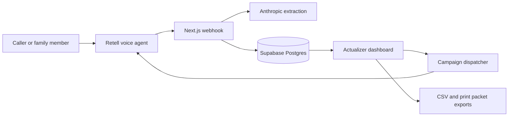

# Full App Code Review Bundle

Generated for external code review on 2026-04-25T20:11:11.258Z. Secrets and generated/dependency files are intentionally excluded.

## Exclusions

- `.env.local` and other secret env files
- `node_modules/`, `.next/`, build/cache output
- lockfiles and TypeScript build info
- binary assets such as images, audio, video, PDFs, archives
- prior review bundle files

## Included Files (198)

- `.gitignore`
- `AGENTS.md`
- `app/(auth)/actions.ts`
- `app/(auth)/auth-panels.tsx`
- `app/(auth)/login/login-form.tsx`
- `app/(auth)/login/page.tsx`
- `app/(auth)/signup/page.tsx`
- `app/(auth)/signup/signup-form.tsx`
- `app/(marketing)/demo-modal.tsx`
- `app/(marketing)/layout.tsx`
- `app/(marketing)/page.tsx`
- `app/api/campaigns/[id]/dispatch-now/route.ts`
- `app/api/campaigns/[id]/uploads/[batchId]/rejected/route.ts`
- `app/api/campaigns/dispatch/route.ts`
- `app/api/env-check/route.ts`
- `app/api/export/all-calls/route.ts`
- `app/api/export/all-contacts/route.ts`
- `app/api/export/all-leads/route.ts`
- `app/api/export/caregivers/route.ts`
- `app/api/export/export-utils.ts`
- `app/api/export/leads/route.ts`
- `app/api/health/route.ts`
- `app/api/retell/extract/route.ts`
- `app/api/retell/tools/lookup-caller/route.ts`
- `app/api/retell/webhook/route.ts`
- `app/api/test-call/status/route.ts`
- `app/dashboard/actions.ts`
- `app/dashboard/agents/[id]/edit/edit-template-form.tsx`
- `app/dashboard/agents/[id]/edit/page.tsx`
- `app/dashboard/agents/actions.ts`
- `app/dashboard/agents/agents-client.tsx`
- `app/dashboard/agents/clone/clone-agent-template-client.tsx`
- `app/dashboard/agents/clone/page.tsx`
- `app/dashboard/agents/import-dialog.tsx`
- `app/dashboard/agents/loading.tsx`
- `app/dashboard/agents/page.tsx`
- `app/dashboard/agents/types.ts`
- `app/dashboard/agents/upload-template-dialog.tsx`
- `app/dashboard/calls/[id]/call-audio-player.tsx`
- `app/dashboard/calls/[id]/call-detail-client.tsx`
- `app/dashboard/calls/[id]/page.tsx`
- `app/dashboard/calls/actions.ts`
- `app/dashboard/calls/calls-list-client.tsx`
- `app/dashboard/calls/filters.tsx`
- `app/dashboard/calls/loading.tsx`
- `app/dashboard/calls/page.tsx`
- `app/dashboard/calls/query.ts`
- `app/dashboard/calls/types.ts`
- `app/dashboard/campaigns/[id]/page.tsx`
- `app/dashboard/campaigns/[id]/upload-dialog.tsx`
- `app/dashboard/campaigns/actions.ts`
- `app/dashboard/campaigns/campaign-controls.tsx`
- `app/dashboard/campaigns/import-call-list-dialog.tsx`
- `app/dashboard/campaigns/import/import-calling-list-wizard.tsx`
- `app/dashboard/campaigns/import/page.tsx`
- `app/dashboard/campaigns/loading.tsx`
- `app/dashboard/campaigns/page.tsx`
- `app/dashboard/caregivers/filter-options.ts`
- `app/dashboard/caregivers/filters.tsx`
- `app/dashboard/caregivers/loading.tsx`
- `app/dashboard/caregivers/page.tsx`
- `app/dashboard/caregivers/query.ts`
- `app/dashboard/caregivers/types.ts`
- `app/dashboard/dashboard-shell.tsx`
- `app/dashboard/error.tsx`
- `app/dashboard/layout.tsx`
- `app/dashboard/leads/[id]/actions.ts`
- `app/dashboard/leads/[id]/activity-tab.tsx`
- `app/dashboard/leads/[id]/call-history-tab.tsx`
- `app/dashboard/leads/[id]/contacts-tab.tsx`
- `app/dashboard/leads/[id]/export-pane.tsx`
- `app/dashboard/leads/[id]/export/route.ts`
- `app/dashboard/leads/[id]/field-components.tsx`
- `app/dashboard/leads/[id]/intake-tab.tsx`
- `app/dashboard/leads/[id]/lead-config.ts`
- `app/dashboard/leads/[id]/lead-detail-client.tsx`
- `app/dashboard/leads/[id]/lead-summary-pane.tsx`
- `app/dashboard/leads/[id]/notes-tab.tsx`
- `app/dashboard/leads/[id]/page.tsx`
- `app/dashboard/leads/[id]/print/layout.tsx`
- `app/dashboard/leads/[id]/print/page.tsx`
- `app/dashboard/leads/[id]/print/print-button.tsx`
- `app/dashboard/leads/[id]/summary.ts`
- `app/dashboard/leads/[id]/types.ts`
- `app/dashboard/leads/actions.ts`
- `app/dashboard/leads/filters.tsx`
- `app/dashboard/leads/lead-list-client.tsx`
- `app/dashboard/leads/list-config.ts`
- `app/dashboard/leads/loading.tsx`
- `app/dashboard/leads/manual-lead-dialog.tsx`
- `app/dashboard/leads/page.tsx`
- `app/dashboard/leads/query.ts`
- `app/dashboard/leads/quick-actions.tsx`
- `app/dashboard/leads/types.ts`
- `app/dashboard/loading.tsx`
- `app/dashboard/not-found.tsx`
- `app/dashboard/page.tsx`
- `app/dashboard/query.ts`
- `app/dashboard/retell-connection-guide.tsx`
- `app/dashboard/settings/actions.ts`
- `app/dashboard/settings/loading.tsx`
- `app/dashboard/settings/page.tsx`
- `app/dashboard/settings/settings-client.tsx`
- `app/dashboard/setup/page.tsx`
- `app/dashboard/setup/setup-actions.tsx`
- `app/dashboard/test-call/actions.ts`
- `app/dashboard/test-call/loading.tsx`
- `app/dashboard/test-call/page.tsx`
- `app/dashboard/test-call/test-call-client.tsx`
- `app/globals.css`
- `app/layout.tsx`
- `app/not-found.tsx`
- `app/opengraph-image.tsx`
- `CLAUDE.md`
- `components.json`
- `components/actualizer-logo.tsx`
- `components/command-palette.tsx`
- `components/empty-state.tsx`
- `components/keyboard-shortcuts.tsx`
- `components/motion-list.tsx`
- `components/page-header.tsx`
- `components/stat-card.tsx`
- `components/theme-toggle.tsx`
- `components/ui/accordion.tsx`
- `components/ui/alert.tsx`
- `components/ui/avatar.tsx`
- `components/ui/badge.tsx`
- `components/ui/button.tsx`
- `components/ui/calendar.tsx`
- `components/ui/card.tsx`
- `components/ui/checkbox.tsx`
- `components/ui/dialog.tsx`
- `components/ui/dropdown-menu.tsx`
- `components/ui/form.tsx`
- `components/ui/input.tsx`
- `components/ui/label.tsx`
- `components/ui/popover.tsx`
- `components/ui/radio-group.tsx`
- `components/ui/select.tsx`
- `components/ui/separator.tsx`
- `components/ui/sheet.tsx`
- `components/ui/skeleton.tsx`
- `components/ui/sonner.tsx`
- `components/ui/switch.tsx`
- `components/ui/table.tsx`
- `components/ui/tabs.tsx`
- `components/ui/textarea.tsx`
- `components/ui/tooltip.tsx`
- `design/TOKENS.md`
- `docs/retell-agent-config.md`
- `docs/templates/example-inbound-intake.json`
- `docs/templates/README.md`
- `eslint.config.mjs`
- `lib/anthropic.ts`
- `lib/auth.ts`
- `lib/campaigns/parse-csv.ts`
- `lib/campaigns/test-scenarios.ts`
- `lib/env-check.ts`
- `lib/formatters.ts`
- `lib/leads/reconcile-lead.ts`
- `lib/motion.ts`
- `lib/phone.ts`
- `lib/retell/client.ts`
- `lib/retell/connection-state.ts`
- `lib/retell/dispatcher.ts`
- `lib/retell/dynamic-variables.ts`
- `lib/retell/setup-status.ts`
- `lib/supabase/admin.ts`
- `lib/supabase/client.ts`
- `lib/supabase/server.ts`
- `lib/theme.ts`
- `lib/utils.ts`
- `middleware.ts`
- `next.config.ts`
- `package.json`
- `pnpm-workspace.yaml`
- `postcss.config.mjs`
- `public/file.svg`
- `public/globe.svg`
- `public/icon.svg`
- `public/next.svg`
- `public/vercel.svg`
- `public/window.svg`
- `README.md`
- `scripts/a11y-smoke.ts`
- `scripts/dispatch-campaigns.ts`
- `scripts/export-code-review.mjs`
- `scripts/seed-demo-data.ts`
- `scripts/seed-system-templates.ts`
- `scripts/test-parse-csv.ts`
- `supabase/migrations/0001_initial_schema.sql`
- `supabase/migrations/0002_reconcile_lead.sql`
- `supabase/migrations/0003_outbound_campaigns.sql`
- `supabase/migrations/0004_reconcile_outbound.sql`
- `supabase/migrations/0005_agent_templates.sql`
- `supabase/migrations/0006_profile_test_phone.sql`
- `tsconfig.json`
- `vercel.json`


## File: `.gitignore`

````text
# See https://help.github.com/articles/ignoring-files/ for more about ignoring files.

# dependencies
/node_modules
/.pnp
.pnp.*
.yarn/*
!.yarn/patches
!.yarn/plugins
!.yarn/releases
!.yarn/versions

# testing
/coverage

# next.js
/.next/
/out/

# production
/build

# misc
.DS_Store
*.pem

# debug
npm-debug.log*
yarn-debug.log*
yarn-error.log*
.pnpm-debug.log*

# env files (can opt-in for committing if needed)
.env*
!.env.local.example

# vercel
.vercel

# typescript
*.tsbuildinfo
next-env.d.ts

````


## File: `AGENTS.md`

````md
<!-- BEGIN:nextjs-agent-rules -->
# This is NOT the Next.js you know

This version has breaking changes — APIs, conventions, and file structure may all differ from your training data. Read the relevant guide in `node_modules/next/dist/docs/` before writing any code. Heed deprecation notices.
<!-- END:nextjs-agent-rules -->

## Outbound calling — rules
- Outbound calls are initiated via lib/retell/client.ts createPhoneCall. Never call Retell's REST API directly from any other file.
- The dispatcher (lib/retell/dispatcher.ts) is the ONLY authorized writer of call_tasks.status transitions from 'queued'/'scheduled' to 'in_progress'. All other status transitions flow through the webhook.
- Never initiate outbound calls to numbers not present in call_tasks. No ad-hoc /api/retell/make-call endpoints.
- Respect campaign.call_window_start / end / timezone. Dispatcher must skip tasks outside window.
- Test-mode calls (campaign.purpose='test') bypass certain rate limits but still go through the same dispatcher.
- Never log to_phone, from_phone, metadata contents, or merge_fields values. Log only campaign_id, call_task_id, and status transitions.

## CSV upload — rules
- Max file size 2 MB, max 5000 rows per upload.
- Phone normalization is authoritative — the lib/phone.ts normalizePhone() result is stored; the raw value is kept for debugging only in call_tasks.to_phone_raw.
- Reject uploads that exceed limits entirely — do not partial-accept over-limit files.
- Rejected rows are stored in call_upload_batches.rejected_rows as an audit trail, not re-surfaced as call_tasks.

## Scope boundaries added
- Still no HHAeXchange/CHAMPS/EVV integration.
- CSV upload only in v1. No direct database import or spreadsheet connector.
- Test-outbound mode is single-number, single-call. No bulk self-test runs.
- Outbound still uses Retell's infrastructure — we are not building our own voice stack.

## What "call my own phone" means for demos
- For the boss demo: open /dashboard/test-call, enter Ben's phone, pick a scenario, click "Call me now." The AI places an outbound call to Ben within ~5 seconds. Ben role-plays the intake staff; the AI role-plays a caller (new referral / caregiver applicant / etc.). After hangup, the transcript and extracted intake data appear in /dashboard/calls and are linked to a newly-created lead.
- This demonstrates: voice quality, natural conversation, structured extraction, lead reconciliation — all in one 2-minute call.

## Agent templates — rules
- All agent creation MUST flow through the template system. Never call lib/retell/client.ts importAgent directly from UI handlers; always go through importTemplateToRetell which enforces variable substitution, webhook URL normalization, and audit logging.
- Never hardcode phone numbers, URLs, or agency names in template JSON. Use {{variables}}.
- System templates (is_system=true) are immutable from the UI. Changes require a seed script update.
- When editing a tenant-owned template that has already been imported to Retell, warn the user — live agents will not automatically update unless they click "Save and re-import."
- Never log retell_payload contents. Log only template_id, slug, and action verb.

## Seed script
- scripts/seed-system-templates.ts must be run once after 0005 migration, and again any time system templates change.
- The script is idempotent — safe to rerun. Version numbers track history.

## File structure
- Templates live in the agent_templates table, not in the filesystem.
- docs/templates/*.json are reference examples only — they are not loaded at runtime.

````


## File: `app/(auth)/actions.ts`

````ts
"use server";

import { z } from "zod";
import { createClient } from "@/lib/supabase/server";

export type AuthActionState = {
  status: "idle" | "success" | "error";
  message: string;
};

const loginSchema = z.object({
  email: z.email("Enter a valid email address."),
  password: z.string().min(1, "Password is required."),
});

const signupSchema = z.object({
  email: z.email("Enter a valid email address."),
  password: z.string().min(8, "Password must be at least 8 characters."),
  fullName: z.string().trim().min(1, "Full name is required."),
  agencyName: z.string().trim().min(1, "Agency name is required."),
});

type SignupDetails = z.infer<typeof signupSchema>;
type SupabaseServerClient = Awaited<ReturnType<typeof createClient>>;

async function finishAgencySetup(
  supabase: SupabaseServerClient,
  details: SignupDetails,
  successMessage = "Agency account created — your workspace is ready."
): Promise<AuthActionState> {
  const { error: accountError } = await supabase.rpc("create_owner_account", {
    p_agency_name: details.agencyName,
    p_full_name: details.fullName,
    p_email: details.email,
  });

  if (accountError) {
    await supabase.auth.signOut();

    if (accountError.message.toLowerCase().includes("profile already exists")) {
      return {
        status: "error",
        message: "An account with this email already exists. Sign in with that email or use a different address.",
      };
    }

    console.error("auth_signup_setup_failed", {
      code: accountError.code,
    });

    return {
      status: "error",
      message: "We created your login but could not finish agency setup. Contact support with code AUTH-SETUP.",
    };
  }

  return {
    status: "success",
    message: successMessage,
  };
}

export async function loginAction(
  _previousState: AuthActionState,
  formData: FormData
): Promise<AuthActionState> {
  const parsed = loginSchema.safeParse({
    email: formData.get("email"),
    password: formData.get("password"),
  });

  if (!parsed.success) {
    return {
      status: "error",
      message: parsed.error.issues[0]?.message ?? "Check your email and password, then try again.",
    };
  }

  const supabase = await createClient();
  const { error } = await supabase.auth.signInWithPassword(parsed.data);

  if (error) {
    return {
      status: "error",
      message: "Invalid email or password. Check your credentials or reset your password.",
    };
  }

  return {
    status: "success",
    message: "Signed in — opening your agency dashboard.",
  };
}

export async function signupAction(
  _previousState: AuthActionState,
  formData: FormData
): Promise<AuthActionState> {
  const parsed = signupSchema.safeParse({
    email: formData.get("email"),
    password: formData.get("password"),
    fullName: formData.get("fullName"),
    agencyName: formData.get("agencyName"),
  });

  if (!parsed.success) {
    return {
      status: "error",
      message: parsed.error.issues[0]?.message ?? "Check the highlighted signup fields, then try again.",
    };
  }

  const supabase = await createClient();
  const { data, error: signupError } = await supabase.auth.signUp({
    email: parsed.data.email,
    password: parsed.data.password,
  });

  if (signupError) {
    if (signupError.code === "user_already_exists") {
      const { error: signInError } = await supabase.auth.signInWithPassword({
        email: parsed.data.email,
        password: parsed.data.password,
      });

      if (!signInError) {
        return finishAgencySetup(
          supabase,
          parsed.data,
          "Agency account created — your workspace is ready."
        );
      }

      return {
        status: "error",
        message: "An account with this email already exists. Sign in with that email or use a different address.",
      };
    }

    console.error("auth_signup_failed", {
      code: signupError.code,
      status: signupError.status,
    });

    return {
      status: "error",
      message: "We could not create the account. Check your details or contact support with code AUTH-SIGNUP.",
    };
  }

  if (!data.user) {
    return {
      status: "error",
      message: "We could not create the account. Try again or contact support with code AUTH-NOUSER.",
    };
  }

  if (!data.session) {
    return {
      status: "error",
      message: "Confirm your email, then return here to complete agency setup.",
    };
  }

  return finishAgencySetup(supabase, parsed.data);
}

````


## File: `app/(auth)/auth-panels.tsx`

````tsx
"use client";

import { useEffect, useState } from "react";
import { CheckCircle2Icon, ClockIcon, FileCheckIcon, MapPinIcon, ShieldCheckIcon } from "lucide-react";
import { Badge } from "@/components/ui/badge";
import { cn } from "@/lib/utils";

const testimonials = [
  {
    quote:
      "Actualizer gives our intake team a clean queue every morning. After-hours calls no longer disappear into voicemail.",
    name: "Denise Carter",
    role: "Administrator",
    agency: "Great Lakes Home Support",
  },
  {
    quote:
      "The Michigan Home Help fields are already organized the way our coordinators think. It feels built for our workflow.",
    name: "Marcus Bell",
    role: "Intake Director",
    agency: "Lansing Care Partners",
  },
  {
    quote:
      "We care about speed, but we care more about trust. The audit trail and handoff packet changed the conversation.",
    name: "Priya Nair",
    role: "Owner",
    agency: "Oak County Homecare",
  },
];

const trustBadges = [
  { label: "HIPAA Compliant", icon: ShieldCheckIcon },
  { label: "BAA Signed", icon: FileCheckIcon },
  { label: "MDHHS-aware", icon: MapPinIcon },
  { label: "EVV-ready", icon: ClockIcon },
];

export function LoginTrustPanel({ mobile = false }: { mobile?: boolean }) {
  const [active, setActive] = useState(0);

  useEffect(() => {
    const interval = window.setInterval(
      () => setActive((current) => (current + 1) % testimonials.length),
      8000
    );
    return () => window.clearInterval(interval);
  }, []);

  return (
    <section
      className={cn(
        "relative overflow-hidden bg-bg-emphasis p-6 text-fg-primary",
        mobile
          ? "rounded-xl"
          : "flex min-h-svh flex-col justify-center rounded-l-[2rem] px-10"
      )}
    >
      <DottedGrid />
      <div className="relative z-10 grid gap-6">
        <p className="text-xs font-medium tracking-wide text-fg-tertiary uppercase">
          Trusted by Michigan Medicaid homecare agencies
        </p>
        <div className={cn("grid gap-4", mobile && "overflow-x-auto")}>
          <article className="rounded-2xl border border-border-default bg-bg-surface/85 p-5 shadow-md backdrop-blur">
            <p className="text-lg font-semibold leading-snug">
              “{testimonials[active].quote}”
            </p>
            <div className="mt-5">
              <p className="font-medium">{testimonials[active].name}</p>
              <p className="text-sm text-fg-secondary">
                {testimonials[active].role}, {testimonials[active].agency}
              </p>
            </div>
          </article>
        </div>
        <div className="grid grid-cols-2 gap-2 sm:grid-cols-4">
          {trustBadges.map((badge) => {
            const Icon = badge.icon;
            return (
              <div
                key={badge.label}
                className="flex items-center gap-2 rounded-lg border border-border-default bg-bg-surface/80 px-3 py-2 text-xs font-medium"
              >
                <Icon className="size-4 text-accent-primary" />
                {badge.label}
              </div>
            );
          })}
        </div>
      </div>
    </section>
  );
}

export function SignupValuePanel() {
  const values = [
    "AI receptionist live in 10 minutes",
    "Captures every call, even after hours",
    "Automatic intake extraction (Michigan Home Help fields)",
    "Multi-tenant ready, HIPAA-compliant infrastructure",
    "CSV export, custom templates, full lead pipeline",
    "Cancel anytime, no setup fee",
  ];

  return (
    <section className="relative overflow-hidden rounded-l-[2rem] bg-bg-emphasis p-10">
      <DottedGrid />
      <div className="relative z-10 grid gap-6">
        <p className="text-xs font-medium tracking-wide text-fg-tertiary uppercase">
          What you get
        </p>
        <div className="grid gap-3">
          {values.map((value) => (
            <div key={value} className="flex items-start gap-3 rounded-xl bg-bg-surface/80 p-3">
              <CheckCircle2Icon className="mt-0.5 size-5 text-success-fg" />
              <span className="text-sm font-medium">{value}</span>
            </div>
          ))}
        </div>
        <p className="text-xs text-fg-tertiary">
          By signing up, you agree to our Terms and HIPAA BAA.
        </p>
        <Badge variant="success" className="w-fit">
          BAA included with every plan
        </Badge>
      </div>
    </section>
  );
}

function DottedGrid() {
  return (
    <div
      aria-hidden="true"
      className="absolute inset-0 opacity-[0.08]"
      style={{
        backgroundImage:
          "radial-gradient(circle at 1px 1px, var(--color-fg-primary) 1px, transparent 0)",
        backgroundSize: "18px 18px",
      }}
    />
  );
}

````


## File: `app/(auth)/login/login-form.tsx`

````tsx
"use client";

import Link from "next/link";
import { useRouter } from "next/navigation";
import { useActionState, useEffect } from "react";
import { toast } from "sonner";
import { loginAction, type AuthActionState } from "@/app/(auth)/actions";
import { Button } from "@/components/ui/button";
import { Card } from "@/components/ui/card";
import { Input } from "@/components/ui/input";
import { Separator } from "@/components/ui/separator";

const initialState: AuthActionState = {
  status: "idle",
  message: "",
};

export function LoginForm() {
  const router = useRouter();
  const [state, formAction, pending] = useActionState(loginAction, initialState);

  useEffect(() => {
    if (state.status === "success") {
      toast.success(state.message);
      router.replace("/dashboard/leads");
      router.refresh();
    }

    if (state.status === "error") {
      toast.error(state.message);
    }
  }, [router, state]);

  return (
    <Card className="w-full max-w-md" padding="comfortable" elevation="raised">
      <div>
        <h1 className="font-heading text-xl font-semibold tracking-snug">
          Sign in to your agency dashboard
        </h1>
        <p className="mt-1 text-sm text-fg-secondary">
          Access your AI intake system, leads, and team.
        </p>
      </div>
      <form action={formAction} className="grid gap-4">
        <Input
          id="email"
          name="email"
          type="email"
          label="Email"
          autoComplete="email"
          required
        />
        <Input
          id="password"
          name="password"
          type="password"
          label="Password"
          autoComplete="current-password"
          required
        />
        <Button type="submit" className="w-full" disabled={pending}>
          {pending ? "Signing in..." : "Sign in"}
        </Button>
      </form>
      <Link href="/forgot-password" className="text-center text-sm font-medium text-fg-link hover:underline">
        Forgot password?
      </Link>
      <Separator label="OR" />
      <Button variant="secondary" className="w-full" render={<Link href="/signup" />}>
        Sign up for a free trial
      </Button>
    </Card>
  );
}

````


## File: `app/(auth)/login/page.tsx`

````tsx
import { ActualizerLogo } from "@/components/actualizer-logo";
import { LoginTrustPanel } from "@/app/(auth)/auth-panels";
import { LoginForm } from "@/app/(auth)/login/login-form";

export default function LoginPage() {
  return (
    <main className="grid min-h-svh bg-bg-page lg:grid-cols-[60fr_40fr]">
      <section className="flex min-h-svh flex-col px-6 py-6">
        <ActualizerLogo markClassName="size-8 bg-accent-primary" />
        <div className="flex flex-1 items-center justify-center py-10">
          <LoginForm />
        </div>
        <div className="lg:hidden">
          <LoginTrustPanel mobile />
        </div>
      </section>
      <div className="hidden lg:block">
        <LoginTrustPanel />
      </div>
    </main>
  );
}

````


## File: `app/(auth)/signup/page.tsx`

````tsx
import { ActualizerLogo } from "@/components/actualizer-logo";
import { SignupValuePanel } from "@/app/(auth)/auth-panels";
import { SignupForm } from "@/app/(auth)/signup/signup-form";

export default function SignupPage() {
  return (
    <main className="grid min-h-svh bg-bg-page lg:grid-cols-[60fr_40fr]">
      <section className="flex min-h-svh flex-col px-6 py-6">
        <ActualizerLogo markClassName="size-8 bg-accent-primary" />
        <div className="flex flex-1 items-center justify-center py-10">
          <SignupForm />
        </div>
      </section>
      <div className="hidden lg:block">
        <SignupValuePanel />
      </div>
      <div className="px-6 pb-6 lg:hidden">
        <SignupValuePanel />
      </div>
    </main>
  );
}

````


## File: `app/(auth)/signup/signup-form.tsx`

````tsx
"use client";

import Link from "next/link";
import { useRouter } from "next/navigation";
import { useActionState, useEffect, useMemo, useState } from "react";
import { toast } from "sonner";
import {
  BotIcon,
  CheckCircle2Icon,
  PhoneCallIcon,
  Settings2Icon,
  SparklesIcon,
} from "lucide-react";
import { signupAction, type AuthActionState } from "@/app/(auth)/actions";
import { Button } from "@/components/ui/button";
import { Card } from "@/components/ui/card";
import { Dialog, DialogContent, DialogHeader, DialogTitle } from "@/components/ui/dialog";
import { Input } from "@/components/ui/input";
import { cn } from "@/lib/utils";

const initialState: AuthActionState = {
  status: "idle",
  message: "",
};

export function SignupForm() {
  const router = useRouter();
  const [password, setPassword] = useState("");
  const [onboardingOpen, setOnboardingOpen] = useState(false);
  const [step, setStep] = useState(0);
  const [state, formAction, pending] = useActionState(
    signupAction,
    initialState
  );
  const strength = useMemo(() => passwordStrength(password), [password]);

  useEffect(() => {
    if (state.status === "success") {
      toast.success(state.message);
      setOnboardingOpen(true);
    }

    if (state.status === "error") {
      toast.error(state.message);
    }
  }, [router, state]);

  return (
    <>
      <Card className="w-full max-w-md" padding="comfortable" elevation="raised">
        <div>
          <h1 className="font-heading text-xl font-semibold tracking-snug">
            Start your free trial
          </h1>
          <p className="mt-1 text-sm text-fg-secondary">
            Create your agency owner account. No credit card required.
          </p>
        </div>
        <form action={formAction} className="grid gap-4">
          <Input id="fullName" name="fullName" label="Full name" autoComplete="name" required />
          <Input id="email" name="email" type="email" label="Email" autoComplete="email" required />
          <div className="grid gap-2">
            <Input
              id="password"
              name="password"
              type="password"
              label="Password"
              autoComplete="new-password"
              minLength={8}
              value={password}
              onChange={(event) => setPassword(event.target.value)}
              required
            />
            <div className="grid gap-1">
              <div className="flex gap-1">
                {Array.from({ length: 4 }).map((_, index) => (
                  <span
                    key={index}
                    className={cn(
                      "h-1.5 flex-1 rounded-full bg-bg-muted",
                      index < strength.score && strength.color
                    )}
                  />
                ))}
              </div>
              <p className="text-xs text-fg-tertiary">{strength.label}</p>
            </div>
          </div>
          <Input id="agencyName" name="agencyName" label="Agency name" required />
          <Button type="submit" className="w-full" disabled={pending}>
            {pending ? "Creating agency account..." : "Create my agency account"}
          </Button>
        </form>
        <p className="text-center text-sm text-fg-secondary">
          Already have an account?{" "}
          <Link href="/login" className="font-medium text-fg-link underline">
            Sign in
          </Link>
        </p>
      </Card>
      <OnboardingDialog
        open={onboardingOpen}
        step={step}
        onStepChange={setStep}
        onSkip={() => {
          setOnboardingOpen(false);
          router.replace("/dashboard/leads");
          router.refresh();
        }}
      />
    </>
  );
}

function passwordStrength(value: string) {
  let score = 0;
  if (value.length >= 8) score += 1;
  if (/[A-Z]/.test(value) && /[a-z]/.test(value)) score += 1;
  if (/\d/.test(value)) score += 1;
  if (/[^A-Za-z0-9]/.test(value)) score += 1;
  const labels = ["Enter a password", "Weak", "Fair", "Strong", "Excellent"];
  const colors = ["", "bg-danger-fg", "bg-warning-fg", "bg-info-fg", "bg-success-fg"];
  return { score, label: labels[score], color: colors[score] };
}

const onboardingSteps = [
  {
    title: "Welcome — let's set up your AI agent",
    icon: SparklesIcon,
    body: "Use the guided setup or skip straight to your dashboard. You can return anytime.",
  },
  {
    title: "Pick a template",
    icon: BotIcon,
    body: "Choose from Intake Receptionist, After-hours Triage, Caregiver Recruiting, Authorization Follow-up, or Client Reactivation.",
  },
  {
    title: "Customize",
    icon: Settings2Icon,
    body: "Add agency name, service area, payer preferences, and handoff rules.",
  },
  {
    title: "Test it",
    icon: PhoneCallIcon,
    body: "Place a controlled test call and review the extracted intake fields.",
  },
  {
    title: "You're live",
    icon: CheckCircle2Icon,
    body: "Connect your Retell number, invite your team, and start capturing calls.",
  },
];

function OnboardingDialog({
  open,
  step,
  onStepChange,
  onSkip,
}: {
  open: boolean;
  step: number;
  onStepChange: (step: number) => void;
  onSkip: () => void;
}) {
  const current = onboardingSteps[step];
  const Icon = current.icon;

  return (
    <Dialog open={open} onOpenChange={(nextOpen) => !nextOpen && onSkip()}>
      <DialogContent size="lg">
        <DialogHeader>
          <DialogTitle>{current.title}</DialogTitle>
        </DialogHeader>
        <div className="grid gap-5">
          <div className="grid place-items-center rounded-2xl bg-bg-emphasis p-8 text-center">
            <Icon className="mb-4 size-10 text-accent-primary" />
            <p className="max-w-md text-sm text-fg-secondary">{current.body}</p>
          </div>
          {step === 1 ? (
            <div className="grid gap-3 sm:grid-cols-2">
              {[
                "Intake Receptionist",
                "After-hours Triage",
                "Caregiver Recruiting",
                "Authorization Follow-up",
                "Client Reactivation",
              ].map((item) => (
                <button
                  key={item}
                  className="rounded-xl border border-border-default bg-bg-surface p-3 text-left text-sm font-medium hover:bg-bg-muted"
                  type="button"
                >
                  {item}
                </button>
              ))}
            </div>
          ) : null}
          <div className="flex items-center justify-between">
            <Button variant="link" onClick={onSkip}>
              Skip to dashboard
            </Button>
            <div className="flex gap-2">
              <Button
                variant="secondary"
                disabled={step === 0}
                onClick={() => onStepChange(Math.max(0, step - 1))}
              >
                Back
              </Button>
              <Button
                onClick={() => {
                  if (step >= onboardingSteps.length - 1) onSkip();
                  else onStepChange(step + 1);
                }}
              >
                {step >= onboardingSteps.length - 1 ? "Go to dashboard" : "Continue"}
              </Button>
            </div>
          </div>
        </div>
      </DialogContent>
    </Dialog>
  );
}

````


## File: `app/(marketing)/demo-modal.tsx`

````tsx
"use client";

import { PlayCircleIcon } from "lucide-react";
import { Button } from "@/components/ui/button";
import {
  Dialog,
  DialogContent,
  DialogDescription,
  DialogHeader,
  DialogTitle,
  DialogTrigger,
} from "@/components/ui/dialog";

export function DemoVideoButton() {
  return (
    <Dialog>
      <DialogTrigger render={<Button variant="secondary" size="lg" />}>
        <PlayCircleIcon />
        See it work in 2 minutes
      </DialogTrigger>
      <DialogContent size="lg">
        <DialogHeader>
          <DialogTitle>Actualizer product walkthrough</DialogTitle>
          <DialogDescription>
            Demo video placeholder. This will show an incoming call becoming a structured Michigan Home Help intake packet.
          </DialogDescription>
        </DialogHeader>
        <div className="grid aspect-video place-items-center rounded-xl bg-bg-emphasis">
          <PlayCircleIcon className="size-16 text-accent-primary" />
        </div>
      </DialogContent>
    </Dialog>
  );
}

````


## File: `app/(marketing)/layout.tsx`

````tsx
import Link from "next/link";
import { ActualizerLogo } from "@/components/actualizer-logo";
import { Button } from "@/components/ui/button";

export default function MarketingLayout({ children }: { children: React.ReactNode }) {
  return (
    <div className="min-h-svh bg-bg-page">
      <header className="sticky top-0 z-40 border-b border-border-subtle bg-bg-surface/85 backdrop-blur-md">
        <div className="mx-auto flex h-16 max-w-7xl items-center justify-between px-4 sm:px-6 lg:px-8">
          <Link href="/" aria-label="Actualizer home">
            <ActualizerLogo tagline />
          </Link>
          <nav className="hidden items-center gap-6 text-sm font-medium text-fg-secondary md:flex">
            <a href="#features" className="hover:text-fg-primary">Features</a>
            <a href="#pricing" className="hover:text-fg-primary">Pricing</a>
            <Link href="/login" className="hover:text-fg-primary">Sign in</Link>
          </nav>
          <Button render={<Link href="/signup" />} variant="accent">
            Create my agency account
          </Button>
        </div>
      </header>
      {children}
      <footer className="border-t border-border-subtle bg-bg-surface">
        <div className="mx-auto grid max-w-7xl gap-8 px-4 py-10 sm:px-6 md:grid-cols-4 lg:px-8">
          {[
            ["Product", "Features", "Pricing", "Templates"],
            ["Company", "About", "Customers", "Contact"],
            ["Resources", "Security", "HIPAA", "Michigan Home Help"],
            ["Legal", "Terms", "Privacy", "BAA"],
          ].map(([title, ...items]) => (
            <div key={title}>
              <h3 className="text-sm font-semibold">{title}</h3>
              <ul className="mt-3 grid gap-2 text-sm text-fg-secondary">
                {items.map((item) => (
                  <li key={item}>
                    <a href="#" className="hover:text-fg-primary">{item}</a>
                  </li>
                ))}
              </ul>
            </div>
          ))}
        </div>
        <div className="border-t border-border-subtle px-4 py-4 text-center text-xs text-fg-tertiary">
          © {new Date().getFullYear()} <ActualizerLogo variant="mono" className="inline" /> · Made for Michigan homecare
        </div>
      </footer>
    </div>
  );
}

````


## File: `app/(marketing)/page.tsx`

````tsx
import Link from "next/link";
import {
  BotIcon,
  CheckCircle2Icon,
  ChevronDownIcon,
  ClipboardListIcon,
  HeadphonesIcon,
  PhoneIncomingIcon,
  ShieldCheckIcon,
} from "lucide-react";
import { DemoVideoButton } from "@/app/(marketing)/demo-modal";
import { Badge } from "@/components/ui/badge";
import { Button } from "@/components/ui/button";
import { Card } from "@/components/ui/card";

const payers = [
  "Meridian",
  "Molina",
  "HAP",
  "Aetna Better Health",
  "Priority Health",
  "Blue Cross Complete",
  "MDHHS",
];

const pricing = [
  {
    name: "Starter",
    price: "$299",
    subtitle: "Up to 20 caregivers",
    features: ["AI receptionist", "Lead pipeline", "CSV exports", "Email support"],
  },
  {
    name: "Growth",
    price: "$599",
    subtitle: "Up to 75 caregivers",
    features: ["Everything in Starter", "Custom templates", "Team roles", "Priority support"],
  },
  {
    name: "Scale",
    price: "$1,199",
    subtitle: "Multi-location",
    features: ["Everything in Growth", "Multi-tenant controls", "Advanced reporting", "Implementation support"],
  },
];

const faqs = [
  "Is a BAA included?",
  "How does Actualizer support HIPAA workflows?",
  "Is this specific to Michigan Medicaid Home Help?",
  "Can it integrate with our phone system?",
  "Can we export our data?",
  "Does it support caregiver recruiting calls?",
  "How does pricing work?",
  "How is data secured?",
];

export default function MarketingHomePage() {
  return (
    <main>
      <section className="mx-auto grid max-w-7xl gap-10 px-4 py-16 sm:px-6 lg:grid-cols-[1fr_0.9fr] lg:px-8 lg:py-24">
        <div className="flex flex-col justify-center">
          <Badge variant="accent" className="mb-5 w-fit">
            AI-Powered Intake for Michigan Homecare
          </Badge>
          <h1 className="font-heading text-3xl font-bold tracking-tight text-fg-primary sm:text-5xl">
            Every call captured. Every lead organized. Every intake handed off — automatically.
          </h1>
          <p className="mt-5 max-w-2xl text-lg leading-normal text-fg-secondary">
            Built specifically for Michigan Medicaid Home Help agencies. From the first ring to the intake packet, your AI receptionist works around the clock.
          </p>
          <div className="mt-8 flex flex-wrap gap-3">
            <Button render={<Link href="/signup" />} variant="accent" size="lg">
              Start free trial
            </Button>
            <DemoVideoButton />
          </div>
          <p className="mt-4 text-sm text-fg-tertiary">
            No credit card · BAA included · Cancel anytime
          </p>
        </div>
        <DashboardMockup />
      </section>

      <section className="border-y border-border-subtle bg-bg-surface py-8">
        <div className="mx-auto max-w-7xl px-4 sm:px-6 lg:px-8">
          <p className="mb-5 text-sm font-medium text-fg-tertiary">
            Built for the agencies that handle...
          </p>
          <div className="grid gap-3 sm:grid-cols-4 lg:grid-cols-7">
            {payers.map((payer) => (
              <div key={payer} className="rounded-lg border border-border-subtle px-3 py-2 text-center text-xs font-semibold text-fg-tertiary grayscale">
                {payer}
              </div>
            ))}
          </div>
        </div>
      </section>

      <section id="features" className="mx-auto grid max-w-7xl gap-12 px-4 py-16 sm:px-6 lg:px-8">
        <Feature
          icon={PhoneIncomingIcon}
          title="Never miss a referral again"
          copy="Your AI receptionist answers 24/7, captures caller intent, and routes every referral into a structured lead queue."
        />
        <Feature
          icon={ClipboardListIcon}
          title="Intake forms that fill themselves"
          copy="Calls are extracted into Michigan Home Help fields, including ADLs, IADLs, coverage, contacts, and follow-up needs."
          flip
        />
        <Feature
          icon={HeadphonesIcon}
          title="Your team focuses on care, not data entry"
          copy="Dense dashboards, chart-style lead records, and handoff packets keep coordinators moving without losing context."
        />
      </section>

      <section className="bg-bg-emphasis py-16">
        <div className="mx-auto max-w-7xl px-4 text-center sm:px-6 lg:px-8">
          <h2 className="font-heading text-3xl font-semibold">Built on infrastructure healthcare buyers trust</h2>
          <div className="mt-8 grid gap-4 md:grid-cols-4">
            {[
              ["Anthropic Claude", "Clinical-grade language reasoning"],
              ["Retell AI", "Reliable voice automation"],
              ["Supabase", "Encrypted Postgres platform"],
              ["Vercel", "Secure global deployment"],
            ].map(([name, descriptor]) => (
              <Card key={name} padding="compact" className="items-center text-center">
                <ShieldCheckIcon className="size-6 text-accent-primary" />
                <h3 className="font-semibold">{name}</h3>
                <p className="text-sm text-fg-secondary">{descriptor}</p>
              </Card>
            ))}
          </div>
          <p className="mt-6 text-sm text-fg-secondary">
            All vendors covered by signed BAAs. Your data is encrypted in transit and at rest.
          </p>
        </div>
      </section>

      <section id="pricing" className="mx-auto max-w-7xl px-4 py-16 sm:px-6 lg:px-8">
        <div className="mb-8 rounded-xl bg-accent-secondary px-4 py-3 text-center text-sm font-semibold text-fg-on-brand">
          Save 20% with annual billing
        </div>
        <div className="grid gap-5 lg:grid-cols-3">
          {pricing.map((tier) => (
            <Card key={tier.name} elevation="raised">
              <div>
                <h3 className="font-heading text-xl font-semibold">{tier.name}</h3>
                <p className="text-sm text-fg-secondary">{tier.subtitle}</p>
              </div>
              <p className="text-4xl font-bold tabular-nums">{tier.price}<span className="text-sm font-medium text-fg-tertiary">/mo</span></p>
              <ul className="grid gap-2">
                {tier.features.map((feature) => (
                  <li key={feature} className="flex gap-2 text-sm">
                    <CheckCircle2Icon className="size-4 text-success-fg" />
                    {feature}
                  </li>
                ))}
              </ul>
              <Button render={<Link href="/signup" />} className="w-full">
                Start trial
              </Button>
            </Card>
          ))}
        </div>
      </section>

      <section className="mx-auto max-w-4xl px-4 py-16 sm:px-6 lg:px-8">
        <h2 className="mb-6 text-center font-heading text-3xl font-semibold">FAQ</h2>
        <div className="grid gap-3">
          {faqs.map((faq) => (
            <details key={faq} className="rounded-xl border border-border-default bg-bg-surface p-4">
              <summary className="flex cursor-pointer items-center justify-between font-medium">
                {faq}
                <ChevronDownIcon className="size-4" />
              </summary>
              <p className="mt-3 text-sm text-fg-secondary">
                Yes. Actualizer is designed for regulated homecare operations with exportable records, role-aware workflows, and healthcare-ready infrastructure.
              </p>
            </details>
          ))}
        </div>
      </section>

      <section className="bg-bg-emphasis px-4 py-16 text-center">
        <h2 className="font-heading text-3xl font-semibold">Ready to see your phones answered?</h2>
        <form className="mx-auto mt-6 flex max-w-md gap-2">
          <input className="h-10 flex-1 rounded-md border border-border-default bg-bg-surface px-3 text-sm" placeholder="work@email.com" type="email" />
          <Button render={<Link href="/signup" />}>Get started</Button>
        </form>
      </section>
    </main>
  );
}

function DashboardMockup() {
  return (
    <div className="relative rounded-2xl border border-border-default bg-bg-surface p-4 shadow-2xl">
      <div className="mb-4 flex items-center justify-between">
        <div>
          <p className="text-xs font-medium text-fg-tertiary uppercase">Lead pipeline</p>
          <h3 className="font-semibold">Today’s intake queue</h3>
        </div>
        <Badge variant="success">Live</Badge>
      </div>
      <div className="grid gap-2">
        {["Mary Johnson", "Robert Ellis", "Angela Price"].map((name, index) => (
          <div key={name} className="grid grid-cols-[1fr_auto] rounded-lg border border-border-subtle p-3">
            <div>
              <p className="font-medium">{name}</p>
              <p className="text-xs text-fg-tertiary">Medicaid Home Help · {index + 2} ADLs</p>
            </div>
            <Badge variant={index === 0 ? "danger" : "routine"} tone={index === 0 ? "solid" : "subtle"}>
              {index === 0 ? "urgent" : "routine"}
            </Badge>
          </div>
        ))}
      </div>
      <div className="absolute -right-3 top-8 animate-pulse rounded-xl border border-border-default bg-bg-surface-raised p-3 shadow-lg">
        <p className="text-xs font-semibold">Live call incoming</p>
        <p className="text-xs text-fg-primary">(734) 555-0182</p>
      </div>
    </div>
  );
}

function Feature({
  icon: Icon,
  title,
  copy,
  flip = false,
}: {
  icon: typeof BotIcon;
  title: string;
  copy: string;
  flip?: boolean;
}) {
  return (
    <div className={`grid items-center gap-8 lg:grid-cols-2 ${flip ? "lg:[&>*:first-child]:order-2" : ""}`}>
      <div className="rounded-2xl border border-border-default bg-bg-surface p-6 shadow-lg">
        <Icon className="mb-4 size-8 text-accent-primary" />
        <div className="grid gap-3 rounded-xl bg-bg-surface-sunken p-4">
          <div className="h-3 w-3/4 rounded-full bg-bg-muted" />
          <div className="h-3 w-full rounded-full bg-bg-muted" />
          <div className="h-3 w-2/3 rounded-full bg-bg-muted" />
        </div>
      </div>
      <div>
        <h2 className="font-heading text-3xl font-semibold">{title}</h2>
        <p className="mt-4 text-lg text-fg-secondary">{copy}</p>
      </div>
    </div>
  );
}

````


## File: `app/api/campaigns/[id]/dispatch-now/route.ts`

````ts
import { z } from "zod";
import { getCurrentUser } from "@/lib/auth";
import { dispatchCampaignCalls } from "@/lib/retell/dispatcher";
import { supabaseAdmin } from "@/lib/supabase/admin";

export const runtime = "nodejs";

const paramsSchema = z.object({
  id: z.string().uuid(),
});

const dispatchNowBodySchema = z.object({
  limit: z.number().int().positive().max(100).optional(),
});

type RouteContext = {
  params: Promise<{
    id: string;
  }>;
};

function methodNotAllowed() {
  return new Response(null, {
    status: 405,
    headers: {
      Allow: "POST",
    },
  });
}

export const GET = methodNotAllowed;
export const PUT = methodNotAllowed;
export const PATCH = methodNotAllowed;
export const DELETE = methodNotAllowed;
export const OPTIONS = methodNotAllowed;

export async function POST(request: Request, context: RouteContext) {
  const current = await getCurrentUser().catch(() => null);

  if (!current) {
    return new Response(null, {
      status: 401,
    });
  }

  if (!["owner", "admin"].includes(current.profile.role)) {
    return new Response(null, {
      status: 403,
    });
  }

  const parsedParams = paramsSchema.safeParse(await context.params);

  if (!parsedParams.success) {
    return Response.json(
      {
        error: "invalid",
      },
      {
        status: 400,
      }
    );
  }

  const parsedBody = dispatchNowBodySchema.safeParse(await request.json().catch(() => ({})));

  if (!parsedBody.success) {
    return Response.json(
      {
        error: "invalid",
      },
      {
        status: 400,
      }
    );
  }

  const { data: campaign, error } = await supabaseAdmin
    .from("campaigns")
    .select("id, status")
    .eq("id", parsedParams.data.id)
    .eq("tenant_id", current.profile.tenant_id)
    .single<{ id: string; status: string }>();

  if (error || !campaign) {
    return new Response(null, {
      status: 404,
    });
  }

  if (campaign.status !== "running") {
    return Response.json(
      {
        error: "Campaign must be running before dispatching calls.",
      },
      {
        status: 409,
      }
    );
  }

  const result = await dispatchCampaignCalls(
    current.profile.tenant_id,
    campaign.id,
    parsedBody.data.limit ?? 5
  );

  return Response.json(result);
}

````


## File: `app/api/campaigns/[id]/uploads/[batchId]/rejected/route.ts`

````ts
import { z } from "zod";
import { getCurrentUser } from "@/lib/auth";
import { supabaseAdmin } from "@/lib/supabase/admin";

export const runtime = "nodejs";

type RouteContext = {
  params: Promise<{
    id: string;
    batchId: string;
  }>;
};

type RejectedRow = {
  row_number?: number;
  raw_row?: Record<string, unknown>;
  reason?: string;
};

function csvEscape(value: unknown) {
  const text = value === null || value === undefined ? "" : String(value);
  return `"${text.replaceAll('"', '""')}"`;
}

function rejectedRowsToCsv(rows: RejectedRow[]) {
  const lines = [
    ["row_number", "reason", "raw_row"].map(csvEscape).join(","),
    ...rows.map((row) =>
      [
        row.row_number ?? "",
        row.reason ?? "",
        JSON.stringify(row.raw_row ?? {}),
      ]
        .map(csvEscape)
        .join(",")
    ),
  ];

  return lines.join("\n");
}

export async function GET(_request: Request, context: RouteContext) {
  const current = await getCurrentUser().catch(() => null);
  if (!current) {
    return new Response(null, { status: 401 });
  }

  const parsed = z
    .object({
      id: z.string().uuid(),
      batchId: z.string().uuid(),
    })
    .safeParse(await context.params);

  if (!parsed.success) {
    return new Response(null, { status: 404 });
  }

  const { data, error } = await supabaseAdmin
    .from("call_upload_batches")
    .select("id, rejected_rows")
    .eq("tenant_id", current.profile.tenant_id)
    .eq("campaign_id", parsed.data.id)
    .eq("id", parsed.data.batchId)
    .single<{ id: string; rejected_rows: RejectedRow[] | null }>();

  if (error || !data) {
    return new Response(null, { status: 404 });
  }

  return new Response(rejectedRowsToCsv(data.rejected_rows ?? []), {
    headers: {
      "content-type": "text/csv; charset=utf-8",
      "content-disposition": `attachment; filename="rejected-rows-${data.id}.csv"`,
    },
  });
}

````


## File: `app/api/campaigns/dispatch/route.ts`

````ts
import { timingSafeEqual } from "node:crypto";
import { z } from "zod";
import { dispatchCampaignCalls } from "@/lib/retell/dispatcher";
import { supabaseAdmin } from "@/lib/supabase/admin";

export const runtime = "nodejs";

const dispatchRequestSchema = z.object({
  campaign_id: z.string().uuid().optional(),
  tenant_id: z.string().uuid().optional(),
  limit: z.number().int().positive().max(100).optional(),
});

type CampaignRow = {
  id: string;
  tenant_id: string;
};

function methodNotAllowed() {
  return new Response(null, {
    status: 405,
    headers: {
      Allow: "GET, POST",
    },
  });
}

export const PUT = methodNotAllowed;
export const PATCH = methodNotAllowed;
export const DELETE = methodNotAllowed;
export const OPTIONS = methodNotAllowed;

function timingSafeEqualString(candidate: string, expected: string) {
  const candidateBuffer = Buffer.from(candidate);
  const expectedBuffer = Buffer.from(expected);

  if (candidateBuffer.length !== expectedBuffer.length) {
    return false;
  }

  return timingSafeEqual(candidateBuffer, expectedBuffer);
}

function isAuthorized(request: Request) {
  const internalSecret = process.env.INTERNAL_API_SECRET;
  const cronSecret = process.env.CRON_SECRET ?? internalSecret;
  const internalHeader = request.headers.get("x-internal-secret");
  const authorization = request.headers.get("authorization");
  const bearerToken = authorization?.match(/^Bearer\s+(.+)$/i)?.[1];

  return Boolean(
    (internalSecret && internalHeader && timingSafeEqualString(internalHeader, internalSecret)) ||
      (cronSecret && bearerToken && timingSafeEqualString(bearerToken, cronSecret))
  );
}

async function loadCampaigns(input: z.infer<typeof dispatchRequestSchema>) {
  let query = supabaseAdmin
    .from("campaigns")
    .select("id, tenant_id")
    .eq("status", "running");

  if (input.campaign_id) {
    query = query.eq("id", input.campaign_id);
  }

  if (input.tenant_id) {
    query = query.eq("tenant_id", input.tenant_id);
  }

  const { data, error } = await query.returns<CampaignRow[]>();

  if (error) {
    throw new Error("Unable to load running campaigns");
  }

  return data ?? [];
}

async function handleDispatch(request: Request, input: unknown) {
  if (!isAuthorized(request)) {
    return new Response(null, {
      status: 401,
    });
  }

  const parsedBody = dispatchRequestSchema.safeParse(input);

  if (!parsedBody.success) {
    return Response.json(
      {
        error: "invalid",
      },
      {
        status: 400,
      }
    );
  }

  const limit = parsedBody.data.limit ?? 5;
  const campaigns = await loadCampaigns(parsedBody.data);
  let totalLaunched = 0;
  let totalFailed = 0;

  for (const campaign of campaigns) {
    const result = await dispatchCampaignCalls(campaign.tenant_id, campaign.id, limit);
    totalLaunched += result.launched;
    totalFailed += result.failed;
  }

  return Response.json({
    campaigns_processed: campaigns.length,
    total_launched: totalLaunched,
    total_failed: totalFailed,
  });
}

export async function GET(request: Request) {
  return handleDispatch(request, {});
}

export async function POST(request: Request) {
  return handleDispatch(request, await request.json().catch(() => ({})));
}

````


## File: `app/api/env-check/route.ts`

````ts
import { checkRequiredEnv } from "@/lib/env-check";

export async function GET() {
  if (process.env.NODE_ENV === "production") {
    return Response.json({ error: "Not found" }, { status: 404 });
  }

  const { missing, misconfigured } = checkRequiredEnv();

  return Response.json({
    ok: missing.length === 0 && misconfigured.length === 0,
    missing,
    misconfigured,
  });
}

````


## File: `app/api/export/all-calls/route.ts`

````ts
import { csvResponse, flatten, requireOwnerForExport, toCsv } from "@/app/api/export/export-utils";

export async function GET() {
  const context = await requireOwnerForExport("all_calls");
  if (!context) {
    return Response.json({ error: "forbidden" }, { status: 403 });
  }

  const { current, supabase } = context;
  const { data } = await supabase
    .from("intake_calls")
    .select("*")
    .eq("tenant_id", current.profile.tenant_id)
    .order("created_at", { ascending: false });

  return csvResponse(
    toCsv((data ?? []).map((call) => flatten("call", call))),
    "all-calls.csv"
  );
}

````


## File: `app/api/export/all-contacts/route.ts`

````ts
import { csvResponse, flatten, requireOwnerForExport, toCsv } from "@/app/api/export/export-utils";

export async function GET() {
  const context = await requireOwnerForExport("all_contacts");
  if (!context) {
    return Response.json({ error: "forbidden" }, { status: 403 });
  }

  const { current, supabase } = context;
  const { data } = await supabase
    .from("contacts")
    .select("*")
    .eq("tenant_id", current.profile.tenant_id)
    .order("created_at", { ascending: false });

  return csvResponse(
    toCsv((data ?? []).map((contact) => flatten("contact", contact))),
    "all-contacts.csv"
  );
}

````


## File: `app/api/export/all-leads/route.ts`

````ts
import { csvResponse, flatten, requireOwnerForExport, toCsv } from "@/app/api/export/export-utils";

export async function GET() {
  const context = await requireOwnerForExport("all_leads");
  if (!context) {
    return Response.json({ error: "forbidden" }, { status: 403 });
  }

  const { current, supabase } = context;
  const [leads, contacts, clients, caregivers] = await Promise.all([
    supabase.from("leads").select("*").eq("tenant_id", current.profile.tenant_id),
    supabase.from("contacts").select("*").eq("tenant_id", current.profile.tenant_id),
    supabase.from("prospective_clients").select("*").eq("tenant_id", current.profile.tenant_id),
    supabase.from("caregiver_applicants").select("*").eq("tenant_id", current.profile.tenant_id),
  ]);
  const contactRows = contacts.data ?? [];
  const clientRows = clients.data ?? [];
  const caregiverRows = caregivers.data ?? [];
  const rows = (leads.data ?? []).map((lead) => ({
    ...flatten("lead", lead),
    ...flatten(
      "primary_contact",
      contactRows.find((contact) => contact.lead_id === lead.id && contact.is_primary_contact) ??
        contactRows.find((contact) => contact.lead_id === lead.id) ??
        null
    ),
    ...flatten("prospective_client", clientRows.find((client) => client.lead_id === lead.id) ?? null),
    ...flatten("caregiver_applicant", caregiverRows.find((caregiver) => caregiver.lead_id === lead.id) ?? null),
  }));

  return csvResponse(toCsv(rows), "all-leads.csv");
}

````


## File: `app/api/export/caregivers/route.ts`

````ts
import { getCurrentUser } from "@/lib/auth";
import {
  loadCaregiverApplicants,
  parseCaregiverFilters,
} from "@/app/dashboard/caregivers/query";

function flattenRecord(prefix: string, record: object | null) {
  if (!record) {
    return {};
  }

  return Object.fromEntries(
    Object.entries(record).map(([key, value]) => [
      `${prefix}_${key}`,
      Array.isArray(value) ? value.join("; ") : value,
    ])
  );
}

function toCsv(rows: Record<string, unknown>[]) {
  const headers = Array.from(new Set(rows.flatMap((row) => Object.keys(row))));
  const lines = rows.map((row) =>
    headers
      .map((header) => {
        const value = row[header];
        const text = value === null || value === undefined ? "" : String(value);
        return `"${text.replaceAll('"', '""')}"`;
      })
      .join(",")
  );

  return `${headers.join(",")}\n${lines.join("\n")}\n`;
}

export async function GET(request: Request) {
  const currentUser = await getCurrentUser();
  const url = new URL(request.url);
  const params: Record<string, string | undefined> = {};
  url.searchParams.forEach((value, key) => {
    params[key] = value;
  });

  const applicants = await loadCaregiverApplicants({
    tenantId: currentUser.profile.tenant_id,
    filters: parseCaregiverFilters(params),
  });

  const rows = applicants.map((applicant) => {
    const { leads, ...caregiver } = applicant;

    return {
      ...flattenRecord("caregiver_applicant", caregiver),
      ...flattenRecord("lead", leads ?? null),
    };
  });

  return new Response(toCsv(rows), {
    headers: {
      "content-type": "text/csv; charset=utf-8",
      "content-disposition": "attachment; filename=\"caregivers-export.csv\"",
    },
  });
}

````


## File: `app/api/export/export-utils.ts`

````ts
import { getCurrentUser } from "@/lib/auth";
import { createClient } from "@/lib/supabase/server";

export function toCsv(rows: Record<string, unknown>[]) {
  const headers = Array.from(new Set(rows.flatMap((row) => Object.keys(row))));
  const lines = rows.map((row) =>
    headers
      .map((header) => {
        const value = row[header];
        const text = value === null || value === undefined ? "" : String(value);
        return `"${text.replaceAll('"', '""')}"`;
      })
      .join(",")
  );

  return `${headers.join(",")}\n${lines.join("\n")}\n`;
}

export function flatten(prefix: string, record: object | null) {
  if (!record) {
    return {};
  }

  return Object.fromEntries(
    Object.entries(record).map(([key, value]) => [
      `${prefix}_${key}`,
      Array.isArray(value) ? value.join("; ") : value,
    ])
  );
}

export async function requireOwnerForExport(exportType: string) {
  const current = await getCurrentUser();
  if (current.profile.role !== "owner") {
    return null;
  }

  const supabase = await createClient();
  await supabase.from("call_events").insert({
    tenant_id: current.profile.tenant_id,
    event_type: "tenant_export",
    payload: { export_type: exportType },
    created_by: current.profile.id,
  });

  return { current, supabase };
}

export function csvResponse(csv: string, filename: string) {
  return new Response(csv, {
    headers: {
      "content-type": "text/csv; charset=utf-8",
      "content-disposition": `attachment; filename="${filename}"`,
    },
  });
}

````


## File: `app/api/export/leads/route.ts`

````ts
import { getCurrentUser } from "@/lib/auth";
import { parseLeadFilters, loadLeadsView } from "@/app/dashboard/leads/query";

function flattenRecord(prefix: string, record: object | null) {
  if (!record) {
    return {};
  }

  return Object.fromEntries(
    Object.entries(record).map(([key, value]) => [
      `${prefix}_${key}`,
      Array.isArray(value) ? value.join("; ") : value,
    ])
  );
}

function toCsv(rows: Record<string, unknown>[]) {
  const headers = Array.from(
    new Set(rows.flatMap((row) => Object.keys(row)))
  );
  const lines = rows.map((row) =>
    headers
      .map((header) => {
        const value = row[header];
        const text = value === null || value === undefined ? "" : String(value);
        return `"${text.replaceAll('"', '""')}"`;
      })
      .join(",")
  );

  return `${headers.join(",")}\n${lines.join("\n")}\n`;
}

export async function GET(request: Request) {
  const currentUser = await getCurrentUser();
  const url = new URL(request.url);
  const params: Record<string, string | undefined> = {};
  url.searchParams.forEach((value, key) => {
    params[key] = value;
  });

  const filters = parseLeadFilters(params);
  const view = await loadLeadsView({
    tenantId: currentUser.profile.tenant_id,
    currentUserId: currentUser.profile.id,
    filters,
  });

  const rows = view.allFilteredItems.map((item) => {
    const {
      primaryContact,
      prospectiveClient,
      caregiverApplicant,
      contactCount,
      callCount,
      flagged,
      profiles,
      ...lead
    } = item;

    return {
      ...flattenRecord("lead", lead),
      lead_flagged: flagged,
      lead_assigned_to_name: profiles?.full_name ?? "",
      ...flattenRecord("primary_contact", primaryContact),
      ...flattenRecord("prospective_client", prospectiveClient),
      ...flattenRecord("caregiver_applicant", caregiverApplicant),
      count_of_contacts: contactCount,
      count_of_calls: callCount,
    };
  });

  return new Response(toCsv(rows), {
    headers: {
      "content-type": "text/csv; charset=utf-8",
      "content-disposition": "attachment; filename=\"leads-export.csv\"",
    },
  });
}

````


## File: `app/api/health/route.ts`

````ts
import { supabaseAdmin } from "@/lib/supabase/admin";

export const runtime = "nodejs";

async function checkDb() {
  const { error } = await supabaseAdmin.from("tenants").select("id").limit(1);
  return !error;
}

async function checkRetell() {
  const agentId = process.env.RETELL_AGENT_ID;
  const apiKey = process.env.RETELL_API_KEY;

  if (!agentId || !apiKey) {
    return false;
  }

  try {
    const response = await fetch(`https://api.retellai.com/get-agent/${agentId}`, {
      headers: { Authorization: `Bearer ${apiKey}` },
      cache: "no-store",
    });
    return response.ok;
  } catch {
    return false;
  }
}

export async function GET() {
  const [db, retellAgent] = await Promise.all([checkDb(), checkRetell()]);

  return Response.json({
    ok: db,
    db,
    retell_agent: retellAgent,
  });
}

````


## File: `app/api/retell/extract/route.ts`

````ts
import { z } from "zod";
import { anthropic } from "@/lib/anthropic";
import { reconcileLead } from "@/lib/leads/reconcile-lead";
import { supabaseAdmin } from "@/lib/supabase/admin";

export const runtime = "nodejs";

const requestSchema = z.object({
  call_id: z.uuid(),
});

const callSchema = z.object({
  id: z.uuid(),
  tenant_id: z.uuid(),
  caller_phone: z.string().nullable(),
  caller_phone_normalized: z.string().nullable(),
  transcript: z.string().nullable(),
  call_direction: z.string().nullable(),
  call_task_id: z.string().nullable(),
});

const nullableString = z.preprocess(
  (value) => (typeof value === "string" ? value : null),
  z.string().nullable()
);
const objectField = z.preprocess(
  (value) => (value && typeof value === "object" && !Array.isArray(value) ? value : {}),
  z.record(z.string(), z.unknown())
);
const stringArrayField = z.preprocess(
  (value) => (Array.isArray(value) ? value : []),
  z.array(z.string())
);

const extractionSchema = z
  .object({
    summary: z.string().default("Call analyzed."),
    lead_type: z
      .preprocess(
        (value) => (value === "other_or_wrong_number" ? "other" : value),
        z.enum(["client_referral", "caregiver_applicant", "existing_client", "other"])
      )
      .default("client_referral"),
    urgency: z.enum(["emergent", "urgent", "routine", "informational"]).default("routine"),
    name: nullableString.optional(),
    client_name: nullableString.optional(),
    primary_payer: nullableString.optional(),
    payer: nullableString.optional(),
    intake_fields: objectField.default({}),
    contact: objectField.default({}),
    prospective_client: objectField.default({}),
    caregiver_applicant: objectField.default({}),
    red_flags: stringArrayField.default([]),
  })
  .passthrough();
type Extraction = z.infer<typeof extractionSchema>;

const inboundIntakeFieldNames = [
  "lead_type",
  "caller_full_name",
  "caller_callback_number",
  "caller_relationship_to_client",
  "client_first_name",
  "client_last_name",
  "client_date_of_birth",
  "client_address_city",
  "client_address_zip",
  "client_county",
  "client_lives_with",
  "primary_payer",
  "medicaid_active",
  "primary_diagnosis",
  "secondary_diagnoses",
  "has_dementia_diagnosis",
  "fall_risk",
  "falls_last_90_days",
  "uses_oxygen",
  "mobility_status",
  "cognitive_status",
  "adl_bathing",
  "adl_dressing",
  "adl_grooming",
  "adl_toileting",
  "adl_transferring",
  "adl_eating",
  "continence_bladder",
  "continence_bowel",
  "iadl_meal_prep",
  "iadl_light_housework",
  "iadl_laundry",
  "iadl_shopping",
  "iadl_medication_reminders",
  "iadl_transportation",
  "requested_services",
  "requested_hours_per_week",
  "requested_start_date",
  "preferred_schedule",
  "preferred_caregiver_gender",
  "preferred_caregiver_language",
  "family_caregiver_available",
  "family_caregiver_relationship",
  "family_caregiver_wants_to_be_paid",
  "currently_receiving_services",
  "current_agency_name",
  "reason_for_change",
  "primary_language",
  "requires_interpreter",
  "veteran_status",
  "has_pcp",
  "pcp_name",
  "recent_hospitalization",
  "recent_hospitalization_detail",
  "caregiver_applicant_first_name",
  "caregiver_applicant_last_name",
  "caregiver_applicant_city",
  "caregiver_years_experience",
  "caregiver_experience_types",
  "caregiver_cna_certified",
  "caregiver_hha_certified",
  "caregiver_cpr_certified",
  "caregiver_first_aid_certified",
  "caregiver_languages_spoken",
  "caregiver_has_drivers_license",
  "caregiver_has_reliable_transportation",
  "caregiver_willing_travel_miles",
  "caregiver_hours_per_week_sought",
  "caregiver_availability",
  "caregiver_relationship_to_specific_client",
  "caregiver_willing_to_enroll_champs",
  "caregiver_willing_background_check",
  "urgency",
  "preferred_callback_time",
  "summary",
  "next_action_recommendation",
  "caller_emotional_state",
  "red_flag_emergency",
  "red_flag_notes",
  "extraction_confidence",
] as const;

const outboundCallbackFieldNames = [
  "outbound_purpose",
  "right_person_reached",
  "voicemail_left",
  "callback_requested",
  "callback_time_requested",
  "do_not_call_requested",
  "interest_level",
  "outcome",
  "caregiver_currently_working",
  "caregiver_current_employer",
  "caregiver_still_interested",
  "caregiver_availability_update",
  "caregiver_certifications_update",
  "caregiver_interview_scheduled",
  "caregiver_interview_time",
  "client_eligibility_status",
  "client_assessment_scheduled",
  "client_assessment_time",
  "client_status_update",
  "referral_partner_followup_needed",
  "referral_partner_followup_detail",
  "summary",
  "next_action_recommendation",
  "red_flag_emergency",
  "red_flag_notes",
  "extraction_confidence",
] as const;

const postCallAnalysisFieldNames = [
  ...new Set([...inboundIntakeFieldNames, ...outboundCallbackFieldNames]),
];

function cleanRecord(record: Record<string, unknown>) {
  return Object.fromEntries(
    Object.entries(record).filter(([, value]) => value !== null && value !== undefined && value !== "")
  );
}

function splitCsv(value: unknown) {
  if (Array.isArray(value)) {
    return value.filter((item): item is string => typeof item === "string" && item.trim().length > 0);
  }

  return typeof value === "string"
    ? value
        .split(",")
        .map((item) => item.trim())
        .filter(Boolean)
    : undefined;
}

function safeUrgency(value: unknown, fallback: Extraction["urgency"]) {
  return ["emergent", "urgent", "routine", "informational"].includes(String(value))
    ? (value as Extraction["urgency"])
    : fallback;
}

function normalizeExtraction(extraction: Extraction): Extraction {
  const flatFields = Object.fromEntries(
    postCallAnalysisFieldNames.flatMap((fieldName) => {
      const value = extraction[fieldName as keyof Extraction] ?? extraction.intake_fields[fieldName];
      return value === undefined ? [] : [[fieldName, value]];
    })
  );
  const intakeFields = cleanRecord({
    ...flatFields,
    ...extraction.intake_fields,
  });
  const contact = cleanRecord({
    full_name: intakeFields.caller_full_name ?? extraction.name,
    phone: intakeFields.caller_callback_number,
    relationship_to_client: intakeFields.caller_relationship_to_client,
    best_time_to_reach: intakeFields.preferred_callback_time,
    ...extraction.contact,
  });
  const prospectiveClient = cleanRecord({
    first_name: intakeFields.client_first_name,
    last_name: intakeFields.client_last_name,
    date_of_birth: intakeFields.client_date_of_birth,
    address_city: intakeFields.client_address_city,
    address_zip: intakeFields.client_address_zip,
    county: intakeFields.client_county,
    lives_with: intakeFields.client_lives_with,
    primary_payer: intakeFields.primary_payer,
    medicaid_active: intakeFields.medicaid_active,
    primary_diagnosis: intakeFields.primary_diagnosis,
    secondary_diagnoses: intakeFields.secondary_diagnoses,
    has_dementia_diagnosis: intakeFields.has_dementia_diagnosis,
    fall_risk: intakeFields.fall_risk,
    falls_last_90_days: intakeFields.falls_last_90_days,
    uses_oxygen: intakeFields.uses_oxygen,
    mobility_status: intakeFields.mobility_status,
    cognitive_status: intakeFields.cognitive_status,
    adl_bathing: intakeFields.adl_bathing,
    adl_dressing: intakeFields.adl_dressing,
    adl_grooming: intakeFields.adl_grooming,
    adl_toileting: intakeFields.adl_toileting,
    adl_transferring: intakeFields.adl_transferring,
    adl_eating: intakeFields.adl_eating,
    continence_bladder: intakeFields.continence_bladder,
    continence_bowel: intakeFields.continence_bowel,
    iadl_meal_prep: intakeFields.iadl_meal_prep,
    iadl_light_housework: intakeFields.iadl_light_housework,
    iadl_laundry: intakeFields.iadl_laundry,
    iadl_shopping: intakeFields.iadl_shopping,
    iadl_medication_reminders: intakeFields.iadl_medication_reminders,
    iadl_transportation: intakeFields.iadl_transportation,
    requested_services: splitCsv(intakeFields.requested_services),
    requested_hours_per_week: intakeFields.requested_hours_per_week,
    requested_start_date: intakeFields.requested_start_date,
    preferred_schedule: intakeFields.preferred_schedule,
    preferred_caregiver_gender: intakeFields.preferred_caregiver_gender,
    preferred_caregiver_language: intakeFields.preferred_caregiver_language,
    family_caregiver_available: intakeFields.family_caregiver_available,
    family_caregiver_relationship: intakeFields.family_caregiver_relationship,
    family_caregiver_wants_to_be_paid: intakeFields.family_caregiver_wants_to_be_paid,
    currently_receiving_services: intakeFields.currently_receiving_services,
    current_agency_name: intakeFields.current_agency_name,
    reason_for_change: intakeFields.reason_for_change,
    primary_language: intakeFields.primary_language,
    requires_interpreter: intakeFields.requires_interpreter,
    veteran_status: intakeFields.veteran_status,
    has_pcp: intakeFields.has_pcp,
    pcp_name: intakeFields.pcp_name,
    recent_hospitalization: intakeFields.recent_hospitalization,
    recent_hospitalization_detail: intakeFields.recent_hospitalization_detail,
    ...extraction.prospective_client,
  });
  const caregiverApplicant = cleanRecord({
    first_name: intakeFields.caregiver_applicant_first_name,
    last_name: intakeFields.caregiver_applicant_last_name,
    phone: intakeFields.caller_callback_number,
    address_city: intakeFields.caregiver_applicant_city,
    years_experience: intakeFields.caregiver_years_experience,
    experience_types: splitCsv(intakeFields.caregiver_experience_types),
    cna_certified: intakeFields.caregiver_cna_certified,
    hha_certified: intakeFields.caregiver_hha_certified,
    cpr_certified: intakeFields.caregiver_cpr_certified,
    first_aid_certified: intakeFields.caregiver_first_aid_certified,
    languages_spoken: splitCsv(intakeFields.caregiver_languages_spoken),
    has_drivers_license: intakeFields.caregiver_has_drivers_license,
    has_reliable_transportation: intakeFields.caregiver_has_reliable_transportation,
    willing_to_travel_miles: intakeFields.caregiver_willing_travel_miles,
    hours_per_week_sought: intakeFields.caregiver_hours_per_week_sought,
    availability: intakeFields.caregiver_availability,
    relationship_to_prospective_client: intakeFields.caregiver_relationship_to_specific_client,
    willing_to_enroll_in_champs: intakeFields.caregiver_willing_to_enroll_champs,
    willing_background_check: intakeFields.caregiver_willing_background_check,
    notes: extraction.summary,
    ...extraction.caregiver_applicant,
  });
  const outboundFields = cleanRecord({
    outbound_purpose: intakeFields.outbound_purpose,
    right_person_reached: intakeFields.right_person_reached,
    voicemail_left: intakeFields.voicemail_left,
    callback_requested: intakeFields.callback_requested,
    callback_time_requested: intakeFields.callback_time_requested,
    do_not_call_requested: intakeFields.do_not_call_requested,
    interest_level: intakeFields.interest_level,
    outcome: intakeFields.outcome,
    caregiver_currently_working: intakeFields.caregiver_currently_working,
    caregiver_current_employer: intakeFields.caregiver_current_employer,
    caregiver_still_interested: intakeFields.caregiver_still_interested,
    caregiver_availability_update: intakeFields.caregiver_availability_update,
    caregiver_certifications_update: intakeFields.caregiver_certifications_update,
    caregiver_interview_scheduled: intakeFields.caregiver_interview_scheduled,
    caregiver_interview_time: intakeFields.caregiver_interview_time,
    client_eligibility_status: intakeFields.client_eligibility_status,
    client_assessment_scheduled: intakeFields.client_assessment_scheduled,
    client_assessment_time: intakeFields.client_assessment_time,
    client_status_update: intakeFields.client_status_update,
    referral_partner_followup_needed: intakeFields.referral_partner_followup_needed,
    referral_partner_followup_detail: intakeFields.referral_partner_followup_detail,
  });

  return {
    ...extraction,
    urgency: safeUrgency(intakeFields.urgency, extraction.urgency),
    name: extraction.name ?? (typeof intakeFields.caller_full_name === "string" ? intakeFields.caller_full_name : null),
    client_name:
      extraction.client_name ??
      ([intakeFields.client_first_name, intakeFields.client_last_name]
        .filter(Boolean)
        .join(" ") ||
        null),
    primary_payer:
      extraction.primary_payer ??
      (typeof intakeFields.primary_payer === "string" ? intakeFields.primary_payer : null),
    payer:
      extraction.payer ??
      (typeof intakeFields.primary_payer === "string" ? intakeFields.primary_payer : null),
    intake_fields: intakeFields,
    contact,
    prospective_client: prospectiveClient,
    caregiver_applicant: {
      ...caregiverApplicant,
      ...cleanRecord({
        current_employer: outboundFields.caregiver_current_employer,
        availability: outboundFields.caregiver_availability_update ?? caregiverApplicant.availability,
        notes: [
          caregiverApplicant.notes,
          outboundFields.caregiver_certifications_update
            ? `Certification update: ${outboundFields.caregiver_certifications_update}`
            : null,
          outboundFields.caregiver_interview_time
            ? `Interview time: ${outboundFields.caregiver_interview_time}`
            : null,
        ]
          .filter(Boolean)
          .join("\n"),
      }),
    },
    red_flags: [
      ...extraction.red_flags,
      ...(intakeFields.red_flag_notes && typeof intakeFields.red_flag_notes === "string"
        ? [intakeFields.red_flag_notes]
        : []),
    ],
  };
}

function unauthorized() {
  return Response.json({ error: "unauthorized" }, { status: 401 });
}

function extractText(content: unknown) {
  if (!Array.isArray(content)) {
    return "";
  }

  return content
    .map((block) =>
      block &&
      typeof block === "object" &&
      "type" in block &&
      block.type === "text" &&
      "text" in block &&
      typeof block.text === "string"
        ? block.text
        : ""
    )
    .join("\n")
    .trim();
}

function parseJsonObject(text: string) {
  const fenced = text.match(/```(?:json)?\s*([\s\S]*?)```/i);
  const raw = fenced?.[1] ?? text;
  const start = raw.indexOf("{");
  const end = raw.lastIndexOf("}");

  if (start === -1 || end === -1 || end <= start) {
    throw new Error("No JSON object returned");
  }

  return JSON.parse(raw.slice(start, end + 1)) as unknown;
}

async function buildExtraction(transcript: string, callerPhone: string | null) {
  const message = await anthropic.messages.create({
    model: process.env.ANTHROPIC_MODEL ?? "claude-sonnet-4-6",
    max_tokens: 5000,
    temperature: 0,
    system:
      "Extract structured Michigan homecare intake facts from a call transcript. Return only one JSON object. Do not include markdown. Use null or empty objects when unknown. Never invent facts not present in the transcript.",
    messages: [
      {
        role: "user",
        content: `Transcript:\n${transcript}\n\nCaller phone: ${
          callerPhone ?? "unknown"
        }\n\nReturn JSON with these keys:
- summary
- lead_type: one of client_referral, caregiver_applicant, existing_client, other
- urgency: one of emergent, urgent, routine, informational
- name, client_name, primary_payer, payer
- intake_fields: object containing these inbound and outbound script fields when known: ${postCallAnalysisFieldNames.join(", ")}
- contact: database object with full_name, phone, relationship_to_client, best_time_to_reach, notes
- prospective_client: database object for care recipients using columns like first_name, last_name, date_of_birth, address_city, address_zip, county, lives_with, primary_payer, medicaid_active, primary_diagnosis, secondary_diagnoses, ADL/IADL fields, requested_services as an array, requested_hours_per_week, preferred_schedule, language, PCP, hospitalization, family caregiver, current agency fields
- caregiver_applicant: database object for job applicants using columns like first_name, last_name, phone, address_city, years_experience, experience_types as an array, certifications, languages_spoken as an array, transportation, travel miles, hours sought, availability, CHAMPS/background check fields
- red_flags: array of red flag strings

For outbound callback calls, populate outbound_purpose, right_person_reached, voicemail_left, callback_requested, callback_time_requested, do_not_call_requested, interest_level, outcome, and the caregiver/client/referral follow-up update fields whenever the transcript supports them.

Use null for unknown scalar fields. contact.relationship_to_client must use a database-safe value when known, such as self, spouse, adult_child, case_manager, caregiver_applicant, other, or unknown. For summary, use first name + last initial only and do not include street addresses, Medicaid IDs, or DOBs.`,
      },
    ],
  });

  return normalizeExtraction(extractionSchema.parse(parseJsonObject(extractText(message.content))));
}

function safeRelationship(value: unknown) {
  const allowed = new Set([
    "self",
    "spouse",
    "adult_child",
    "parent",
    "sibling",
    "other_family",
    "friend",
    "case_manager",
    "hospital_social_worker",
    "referral_source",
    "poa_financial",
    "poa_medical",
    "guardian",
    "caregiver_applicant",
    "other",
    "unknown",
  ]);
  return typeof value === "string" && allowed.has(value) ? value : "unknown";
}

async function createFallbackLead(params: {
  call: z.infer<typeof callSchema>;
  extraction: Extraction;
}) {
  const { call, extraction } = params;
  const contact = extraction.contact;
  const { data: lead, error: leadError } = await supabaseAdmin
    .from("leads")
    .insert({
      tenant_id: call.tenant_id,
      lead_type: extraction.lead_type,
      lead_status: "new",
      source: call.call_direction === "outbound" ? "other" : "phone_inbound",
      urgency: extraction.urgency,
      first_contact_at: new Date().toISOString(),
      last_contact_at: new Date().toISOString(),
      notes: extraction.summary,
    })
    .select("id")
    .single<{ id: string }>();

  if (leadError || !lead) {
    throw new Error("Unable to create fallback lead");
  }

  await supabaseAdmin.from("contacts").insert({
    tenant_id: call.tenant_id,
    lead_id: lead.id,
    full_name:
      (typeof contact.full_name === "string" && contact.full_name) ||
      extraction.client_name ||
      extraction.name ||
      null,
    phone:
      (typeof contact.phone === "string" && contact.phone) ||
      call.caller_phone_normalized ||
      call.caller_phone,
    relationship_to_client: safeRelationship(contact.relationship_to_client),
    is_primary_contact: true,
    preferred_contact_method: "phone",
  });

  await supabaseAdmin
    .from("intake_calls")
    .update({ lead_id: lead.id, status: "merged_into_lead", updated_at: new Date().toISOString() })
    .eq("id", call.id)
    .eq("tenant_id", call.tenant_id);

  if (call.call_task_id) {
    await supabaseAdmin
      .from("call_tasks")
      .update({
        lead_id: lead.id,
        status: "completed",
        disposition: "answered_completed",
        updated_at: new Date().toISOString(),
      })
      .eq("id", call.call_task_id)
      .eq("tenant_id", call.tenant_id);
  }

  return lead.id;
}

export async function POST(request: Request) {
  const secret = process.env.INTERNAL_API_SECRET;
  if (!secret || request.headers.get("x-internal-secret") !== secret) {
    return unauthorized();
  }

  const parsed = requestSchema.safeParse(await request.json().catch(() => null));
  if (!parsed.success) {
    return Response.json({ error: "invalid" }, { status: 400 });
  }

  const { data: callData, error: callError } = await supabaseAdmin
    .from("intake_calls")
    .select("id, tenant_id, caller_phone, caller_phone_normalized, transcript, call_direction, call_task_id")
    .eq("id", parsed.data.call_id)
    .single();

  if (callError || !callData) {
    return Response.json({ error: "not_found" }, { status: 404 });
  }

  const call = callSchema.parse(callData);
  if (!call.transcript?.trim()) {
    return Response.json({ error: "transcript_required" }, { status: 422 });
  }

  try {
    const extraction = await buildExtraction(
      call.transcript,
      call.caller_phone_normalized ?? call.caller_phone
    );

    const { error: updateError } = await supabaseAdmin
      .from("intake_calls")
      .update({
        extraction,
        extraction_confidence: "medium",
        status: "extracted",
        updated_at: new Date().toISOString(),
      })
      .eq("id", call.id)
      .eq("tenant_id", call.tenant_id);

    if (updateError) {
      throw new Error("Unable to store extraction");
    }

    let leadId: string;
    let action = "merged";
    try {
      const reconciliation = await reconcileLead(call.id, call.tenant_id);
      leadId = reconciliation.lead_id;
      action = reconciliation.action;
    } catch {
      leadId = await createFallbackLead({ call, extraction });
      action = "created";
    }

    await supabaseAdmin.from("call_events").insert({
      tenant_id: call.tenant_id,
      call_id: call.id,
      lead_id: leadId,
      event_type: "extraction_completed",
      payload: { action },
    });

    return Response.json({ ok: true, lead_id: leadId });
  } catch (error) {
    await supabaseAdmin.from("call_events").insert({
      tenant_id: call.tenant_id,
      call_id: call.id,
      event_type: "extraction_failed",
      payload: { reason: error instanceof Error ? error.message : "unknown" },
    });

    return Response.json({ error: "extraction_failed" }, { status: 500 });
  }
}

````


## File: `app/api/retell/tools/lookup-caller/route.ts`

````ts
import { createHash, createHmac, timingSafeEqual } from "node:crypto";
import { z } from "zod";
import { normalizePhone } from "@/lib/phone";
import { supabaseAdmin } from "@/lib/supabase/admin";

export const runtime = "nodejs";

const lookupCallerSchema = z.object({
  args: z.object({
    phone_number: z.string().min(1),
  }),
});

const lookupRowSchema = z.object({
  id: z.string(),
  created_at: z.string().nullable(),
  updated_at: z.string().nullable().optional(),
  relationship_to_client: z.string().nullable(),
  leads: z
    .object({
      id: z.string(),
      lead_type: z.string(),
      lead_status: z.string(),
      last_contact_at: z.string().nullable(),
      created_at: z.string().nullable(),
      profiles: z
        .object({
          full_name: z.string().nullable(),
        })
        .nullable()
        .optional(),
      prospective_clients: z
        .array(
          z.object({
            address_city: z.string().nullable(),
            county: z.string().nullable(),
          })
        )
        .nullable()
        .optional(),
    })
    .nullable(),
});

type LookupRow = z.infer<typeof lookupRowSchema>;

function methodNotAllowed() {
  return new Response(null, {
    status: 405,
    headers: {
      Allow: "POST",
    },
  });
}

export const GET = methodNotAllowed;
export const PUT = methodNotAllowed;
export const PATCH = methodNotAllowed;
export const DELETE = methodNotAllowed;
export const OPTIONS = methodNotAllowed;

function getRequiredEnv(name: string): string {
  const value = process.env[name];

  if (!value) {
    throw new Error(`${name} is required`);
  }

  return value;
}

function timingSafeCompare(candidate: string, expected: string): boolean {
  const candidateBuffer = Buffer.from(candidate);
  const expectedBuffer = Buffer.from(expected);

  if (candidateBuffer.length !== expectedBuffer.length) {
    return false;
  }

  return timingSafeEqual(candidateBuffer, expectedBuffer);
}

function verifySignature(rawBody: string, signature: string | null): boolean {
  if (!signature) {
    return false;
  }

  const secret = getRequiredEnv("RETELL_WEBHOOK_SECRET");
  const expectedHex = createHmac("sha256", secret).update(rawBody).digest("hex");
  const expectedBase64 = createHmac("sha256", secret)
    .update(rawBody)
    .digest("base64");
  const normalizedSignature = signature.trim().replace(/^sha256=/, "");

  return (
    timingSafeCompare(normalizedSignature, expectedHex) ||
    timingSafeCompare(normalizedSignature, expectedBase64)
  );
}

function hashPhone(normalizedPhone: string): string {
  return createHash("sha256").update(normalizedPhone).digest("hex");
}

function formatLeadType(leadType: string): string {
  if (leadType === "client_referral") {
    return "a new referral";
  }

  if (leadType === "existing_client") {
    return "an existing client";
  }

  if (leadType === "caregiver_applicant") {
    return "a caregiver applicant";
  }

  return "a lead";
}

function relativeDays(value: string | null | undefined): string {
  if (!value) {
    return "recently";
  }

  const diffMs = Date.now() - new Date(value).getTime();
  const days = Math.max(0, Math.round(diffMs / 86_400_000));

  if (days === 0) {
    return "today";
  }

  if (days === 1) {
    return "yesterday";
  }

  if (days < 7) {
    return `${days} days ago`;
  }

  const weeks = Math.round(days / 7);
  if (weeks === 1) {
    return "last week";
  }

  return `${weeks} weeks ago`;
}

function firstNameOnly(fullName: string | null | undefined): string | null {
  const firstName = fullName?.trim().split(/\s+/)[0];

  return firstName || null;
}

function getClientCity(row: LookupRow): string | null {
  const client = row.leads?.prospective_clients?.[0];

  return client?.address_city || null;
}

function buildSummary(rows: LookupRow[], matchCount: number): string {
  if (matchCount === 0 || rows.length === 0) {
    return "No previous calls from this number.";
  }

  const row = rows[0];
  const lead = row.leads;

  if (!lead) {
    return "No previous calls from this number.";
  }

  const when = relativeDays(lead.last_contact_at ?? row.updated_at ?? row.created_at);
  const leadType = formatLeadType(lead.lead_type);
  const city = getClientCity(row);
  const status = lead.lead_status.replaceAll("_", " ");
  const assignedName = firstNameOnly(lead.profiles?.full_name);

  if (matchCount > 1) {
    return `This number has called ${matchCount} times about ${leadType}. Most recent activity was ${when}. Status is '${status}'.`;
  }

  const location = city ? ` for a client in ${city}` : "";
  const assignment = assignedName
    ? ` A staff member named ${assignedName} is assigned.`
    : "";

  return `This number called ${when} about ${leadType}${location}. Status is '${status}'.${assignment}`;
}

async function insertLookupEvent(tenantId: string, normalizedPhone: string, matchCount: number) {
  await supabaseAdmin.from("call_events").insert({
    tenant_id: tenantId,
    event_type: "tool_lookup_caller",
    payload: {
      phone_hash: hashPhone(normalizedPhone),
      match_count: matchCount,
    },
  });
}

export async function POST(request: Request) {
  try {
    const rawBody = await request.text();

    if (!verifySignature(rawBody, request.headers.get("x-retell-signature"))) {
      return new Response(null, {
        status: 401,
      });
    }

    const parsed = lookupCallerSchema.safeParse(JSON.parse(rawBody));

    if (!parsed.success) {
      return Response.json(
        {
          result: "No previous calls from this number.",
        },
        {
          status: 200,
        }
      );
    }

    const normalizedPhone = normalizePhone(parsed.data.args.phone_number);

    if (!normalizedPhone) {
      return Response.json({
        result: "No previous calls from this number.",
      });
    }

    const tenantId = getRequiredEnv("DEMO_TENANT_ID");
    const { data, count, error } = await supabaseAdmin
      .from("contacts")
      .select(
        "id, created_at, updated_at, relationship_to_client, leads!inner(id, lead_type, lead_status, last_contact_at, created_at, profiles(full_name), prospective_clients(address_city, county))",
        {
          count: "exact",
        }
      )
      .eq("tenant_id", tenantId)
      .eq("phone", normalizedPhone)
      .order("created_at", { ascending: false })
      .limit(3);

    if (error) {
      return Response.json(
        {
          result: "No previous calls from this number.",
        },
        {
          status: 200,
        }
      );
    }

    const rows = z.array(lookupRowSchema).safeParse(data ?? []);
    const safeRows = rows.success ? rows.data : [];
    const matchCount = count ?? safeRows.length;

    await insertLookupEvent(tenantId, normalizedPhone, matchCount);

    return Response.json({
      result: buildSummary(safeRows, matchCount),
    });
  } catch {
    return Response.json(
      {
        result: "No previous calls from this number.",
      },
      {
        status: 200,
      }
    );
  }
}

````


## File: `app/api/retell/webhook/route.ts`

````ts
import { createHmac, timingSafeEqual } from "node:crypto";
import { z } from "zod";
import { normalizePhone } from "@/lib/phone";
import { dispatchCampaignCalls } from "@/lib/retell/dispatcher";
import { supabaseAdmin } from "@/lib/supabase/admin";

export const runtime = "nodejs";

const timestampSchema = z.union([z.string(), z.number()]).nullable().optional();

const retellCallSchema = z
  .object({
    call_id: z.string().min(1),
    from_number: z.string().nullable().optional(),
    to_number: z.string().nullable().optional(),
    start_timestamp: timestampSchema,
    end_timestamp: timestampSchema,
    duration_ms: z.number().nullable().optional(),
    duration_seconds: z.number().nullable().optional(),
    transcript: z.string().nullable().optional(),
    recording_url: z.string().nullable().optional(),
    disconnection_reason: z.string().nullable().optional(),
    disconnect_reason: z.string().nullable().optional(),
    direction: z.enum(["inbound", "outbound"]).nullable().optional(),
    metadata: z
      .object({
        tenant_id: z.string().uuid().optional(),
        campaign_id: z.string().uuid().optional(),
        call_task_id: z.string().uuid().optional(),
      })
      .passthrough()
      .nullable()
      .optional(),
  })
  .passthrough();

const retellWebhookSchema = z.discriminatedUnion("event", [
  z
    .object({
      event: z.literal("call_started"),
      call: retellCallSchema,
    })
    .passthrough(),
  z
    .object({
      event: z.literal("call_ended"),
      call: retellCallSchema,
    })
    .passthrough(),
  z
    .object({
      event: z.literal("call_analyzed"),
      call: retellCallSchema,
    })
    .passthrough(),
]);

type RetellWebhookEvent = z.infer<typeof retellWebhookSchema>;

type IntakeCallRow = {
  id: string;
  lead_id?: string | null;
  call_task_id?: string | null;
};

type CallContext = {
  tenantId: string;
  campaignId: string | null;
  callTaskId: string | null;
  isOutbound: boolean;
};

type OutboundDisposition =
  | "voicemail_or_quick_hangup"
  | "answered_completed"
  | "agent_completed"
  | "no_answer"
  | "busy"
  | "dial_failed"
  | "voicemail_left"
  | "other";

const safeLogSchema = z.object({
  event: z.enum(["call_started", "call_ended", "call_analyzed"]).optional(),
  call: z
    .object({
      call_id: z.string().optional(),
      metadata: z
        .object({
          call_task_id: z.string().uuid().optional(),
        })
        .passthrough()
        .nullable()
        .optional(),
    })
    .optional(),
});

function methodNotAllowed() {
  return new Response(null, {
    status: 405,
    headers: {
      Allow: "POST",
    },
  });
}

export const GET = methodNotAllowed;
export const PUT = methodNotAllowed;
export const PATCH = methodNotAllowed;
export const DELETE = methodNotAllowed;
export const OPTIONS = methodNotAllowed;

function getRequiredEnv(name: string): string {
  const value = process.env[name];

  if (!value) {
    throw new Error(`${name} is required`);
  }

  return value;
}

function timingSafeCompare(candidate: string, expected: string): boolean {
  const candidateBuffer = Buffer.from(candidate);
  const expectedBuffer = Buffer.from(expected);

  if (candidateBuffer.length !== expectedBuffer.length) {
    return false;
  }

  return timingSafeEqual(candidateBuffer, expectedBuffer);
}

function verifySignature(rawBody: string, signature: string | null): boolean {
  if (!signature) {
    return false;
  }

  const secret = getRequiredEnv("RETELL_WEBHOOK_SECRET");
  const hmac = createHmac("sha256", secret).update(rawBody);
  const expectedHex = hmac.digest("hex");
  const expectedBase64 = createHmac("sha256", secret)
    .update(rawBody)
    .digest("base64");
  const normalizedSignature = signature.trim().replace(/^sha256=/, "");

  return (
    timingSafeCompare(normalizedSignature, expectedHex) ||
    timingSafeCompare(normalizedSignature, expectedBase64)
  );
}

function parseTimestamp(value: string | number | null | undefined) {
  if (value === null || value === undefined) {
    return null;
  }

  const date =
    typeof value === "number"
      ? new Date(value > 10_000_000_000 ? value : value * 1000)
      : new Date(value);

  if (Number.isNaN(date.getTime())) {
    return null;
  }

  return date.toISOString();
}

function getDurationSeconds(event: RetellWebhookEvent) {
  const durationSeconds = event.call.duration_seconds;

  if (typeof durationSeconds === "number") {
    return Math.round(durationSeconds);
  }

  const durationMs = event.call.duration_ms;

  if (typeof durationMs === "number") {
    return Math.round(durationMs / 1000);
  }

  return null;
}

function getDisconnectReason(event: RetellWebhookEvent) {
  return event.call.disconnect_reason ?? event.call.disconnection_reason ?? null;
}

function getCallContext(event: RetellWebhookEvent): CallContext {
  const metadata = event.call.metadata;
  const isOutbound = event.call.direction === "outbound" || Boolean(metadata?.call_task_id);

  if (isOutbound) {
    if (!metadata?.tenant_id) {
      throw new Error("Outbound Retell webhook missing tenant metadata");
    }

    return {
      tenantId: metadata.tenant_id,
      campaignId: metadata.campaign_id ?? null,
      callTaskId: metadata.call_task_id ?? null,
      isOutbound: true,
    };
  }

  // TODO: Replace with agent_id -> tenant mapping when multi-tenant inbound ships.
  return {
    tenantId: getRequiredEnv("DEMO_TENANT_ID"),
    campaignId: null,
    callTaskId: null,
    isOutbound: false,
  };
}

function getOutboundDisposition(event: RetellWebhookEvent): OutboundDisposition {
  const reason = getDisconnectReason(event);
  const durationSeconds = getDurationSeconds(event) ?? 0;

  switch (reason) {
    case "user_hangup":
      return durationSeconds < 15 ? "voicemail_or_quick_hangup" : "answered_completed";
    case "agent_hangup":
      return "agent_completed";
    case "dial_no_answer":
    case "no_answer":
      return "no_answer";
    case "dial_busy":
      return "busy";
    case "dial_failed":
      return "dial_failed";
    case "voicemail":
      return "voicemail_left";
    default:
      return "other";
  }
}

function getStoredCallerPhone(event: RetellWebhookEvent, context: CallContext) {
  return context.isOutbound
    ? event.call.to_number ?? null
    : event.call.from_number ?? null;
}

function getSafeLogFields(payload: unknown) {
  const parsed = safeLogSchema.safeParse(payload);

  return {
    event: parsed.success ? parsed.data.event ?? "unknown" : "unknown",
    call_id: parsed.success ? parsed.data.call?.call_id ?? "unknown" : "unknown",
    call_task_id: parsed.success ? parsed.data.call?.metadata?.call_task_id ?? null : null,
    disposition: null,
  };
}

async function insertCallEvent(params: {
  tenantId: string;
  callId: string;
  event: RetellWebhookEvent["event"];
  retellCallId: string;
  callTaskId?: string | null;
  disposition?: string | null;
}) {
  const { error } = await supabaseAdmin.from("call_events").insert({
    tenant_id: params.tenantId,
    call_id: params.callId,
    event_type: params.event,
    payload: {
      event: params.event,
      call_id: params.retellCallId,
      call_task_id: params.callTaskId ?? null,
      disposition: params.disposition ?? null,
    },
  });

  if (error) {
    throw new Error("Failed to insert call event");
  }
}

async function handleCallStarted(event: RetellWebhookEvent, context: CallContext) {
  const callerPhone = getStoredCallerPhone(event, context);
  const { data, error } = await supabaseAdmin
    .from("intake_calls")
    .upsert(
      {
        tenant_id: context.tenantId,
        retell_call_id: event.call.call_id,
        caller_phone: callerPhone,
        caller_phone_normalized: callerPhone ? normalizePhone(callerPhone) : null,
        call_started_at: parseTimestamp(event.call.start_timestamp),
        call_direction: context.isOutbound ? "outbound" : "inbound",
        campaign_id: context.campaignId,
        call_task_id: context.callTaskId,
        status: "received",
      },
      {
        onConflict: "retell_call_id",
      }
    )
    .select("id")
    .single<IntakeCallRow>();

  if (error || !data) {
    throw new Error("Failed to upsert started call");
  }

  await insertCallEvent({
    tenantId: context.tenantId,
    callId: data.id,
    event: event.event,
    retellCallId: event.call.call_id,
    callTaskId: context.callTaskId,
  });
}

async function updateOutboundTaskOnCallEnded(event: RetellWebhookEvent, context: CallContext) {
  if (!context.callTaskId) {
    return null;
  }

  const disposition = getOutboundDisposition(event);
  const { data: task } = await supabaseAdmin
    .from("call_tasks")
    .select("campaign_id, status, attempts, campaigns(status, max_attempts_per_task, retry_delay_minutes, max_concurrent)")
    .eq("id", context.callTaskId)
    .eq("tenant_id", context.tenantId)
    .single<{
      campaign_id: string;
      status: string;
      attempts: number;
      campaigns: {
        status: string;
        max_attempts_per_task: number;
        retry_delay_minutes: number;
        max_concurrent: number;
      } | null;
    }>();

  const dispatchContext =
    task?.campaigns?.status === "running"
      ? {
          campaignId: task.campaign_id,
          limit: Math.max(task.campaigns.max_concurrent, 1),
        }
      : null;

  if (task?.status === "cancelled") {
    return { disposition: "skipped_by_user", dispatchContext };
  }

  const campaign = task?.campaigns;
  const attempts = task?.attempts ?? 0;
  const maxAttempts = campaign?.max_attempts_per_task ?? 1;
  const retryDelayMinutes = campaign?.retry_delay_minutes ?? 60;
  const shouldRetryNoAnswer = disposition === "no_answer" && attempts < maxAttempts;
  const nextAttemptAt = shouldRetryNoAnswer
    ? new Date(Date.now() + retryDelayMinutes * 60_000).toISOString()
    : null;
  const status =
    disposition === "answered_completed" ||
    disposition === "agent_completed" ||
    disposition === "voicemail_left"
      ? "completed"
      : shouldRetryNoAnswer
        ? "scheduled"
        : disposition === "no_answer"
          ? "no_answer"
          : disposition === "busy"
            ? "busy"
            : disposition === "voicemail_or_quick_hangup"
              ? "voicemail"
              : "failed";

  await supabaseAdmin
    .from("call_tasks")
    .update({
      status,
      disposition,
      next_attempt_at: nextAttemptAt,
      updated_at: new Date().toISOString(),
    })
    .eq("id", context.callTaskId)
    .eq("tenant_id", context.tenantId);

  return { disposition, dispatchContext };
}

async function handleCallEnded(event: RetellWebhookEvent, context: CallContext) {
  const outboundUpdate = context.isOutbound
    ? await updateOutboundTaskOnCallEnded(event, context)
    : null;
  const disposition = outboundUpdate?.disposition ?? null;
  const callerPhone = getStoredCallerPhone(event, context);
  const { data, error } = await supabaseAdmin
    .from("intake_calls")
    .upsert(
      {
        tenant_id: context.tenantId,
        retell_call_id: event.call.call_id,
        caller_phone: callerPhone,
        caller_phone_normalized: callerPhone ? normalizePhone(callerPhone) : null,
        call_ended_at: parseTimestamp(event.call.end_timestamp),
        duration_seconds: getDurationSeconds(event),
        transcript: event.call.transcript ?? null,
        disconnect_reason: getDisconnectReason(event),
        call_direction: context.isOutbound ? "outbound" : "inbound",
        campaign_id: context.campaignId,
        call_task_id: context.callTaskId,
      },
      {
        onConflict: "retell_call_id",
      }
    )
    .select("id")
    .single<IntakeCallRow>();

  if (error || !data) {
    throw new Error("Failed to update ended call");
  }

  await insertCallEvent({
    tenantId: context.tenantId,
    callId: data.id,
    event: event.event,
    retellCallId: event.call.call_id,
    callTaskId: context.callTaskId,
    disposition,
  });

  if (outboundUpdate?.dispatchContext) {
    await dispatchCampaignCalls(
      context.tenantId,
      outboundUpdate.dispatchContext.campaignId,
      outboundUpdate.dispatchContext.limit
    );
  }
}

async function handleCallAnalyzed(
  event: RetellWebhookEvent,
  context: CallContext,
  origin: string
) {
  const callerPhone = getStoredCallerPhone(event, context);
  const { data, error } = await supabaseAdmin
    .from("intake_calls")
    .upsert(
      {
        tenant_id: context.tenantId,
        retell_call_id: event.call.call_id,
        caller_phone: callerPhone,
        caller_phone_normalized: callerPhone ? normalizePhone(callerPhone) : null,
        transcript: event.call.transcript ?? null,
        recording_url: event.call.recording_url ?? null,
        call_direction: context.isOutbound ? "outbound" : "inbound",
        campaign_id: context.campaignId,
        call_task_id: context.callTaskId,
      },
      {
        onConflict: "retell_call_id",
      }
    )
    .select("id, lead_id, call_task_id")
    .single<IntakeCallRow>();

  if (error || !data) {
    throw new Error("Failed to update analyzed call");
  }

  const internalSecret = process.env.INTERNAL_API_SECRET;
  const { data: task } =
    context.isOutbound && context.callTaskId
      ? await supabaseAdmin
          .from("call_tasks")
          .select("lead_id, merge_fields")
          .eq("id", context.callTaskId)
          .eq("tenant_id", context.tenantId)
          .single<{ lead_id: string | null; merge_fields: Record<string, unknown> | null }>()
      : { data: null };
  const isTestCall =
    task?.merge_fields?.test_call === "true" || task?.merge_fields?.mode === "test_outbound";
  const shouldEnqueueExtraction =
    Boolean(event.call.transcript) &&
    (!context.isOutbound || Boolean(data.lead_id ?? task?.lead_id) || isTestCall);

  if (!shouldEnqueueExtraction) {
    // No transcript or outbound lead context to reconcile yet.
  } else if (!internalSecret) {
    console.error("Retell extraction enqueue failed", {
      event: event.event,
      call_id: event.call.call_id,
      call_task_id: context.callTaskId,
      disposition: null,
    });
  } else {
    void fetch(`${origin}/api/retell/extract`, {
      method: "POST",
      headers: {
        "content-type": "application/json",
        "x-internal-secret": internalSecret,
      },
      body: JSON.stringify({
        call_id: data.id,
      }),
    }).catch(() => {
      console.error("Retell extraction enqueue failed", {
        event: event.event,
        call_id: event.call.call_id,
        call_task_id: context.callTaskId,
        disposition: null,
      });
    });
  }

  await insertCallEvent({
    tenantId: context.tenantId,
    callId: data.id,
    event: event.event,
    retellCallId: event.call.call_id,
    callTaskId: context.callTaskId,
  });
}

export async function POST(request: Request) {
  let safeLogFields = {
    event: "unknown",
    call_id: "unknown",
    call_task_id: null as string | null,
    disposition: null as string | null,
  };

  try {
    const rawBody = await request.text();

    if (!verifySignature(rawBody, request.headers.get("x-retell-signature"))) {
      return new Response(null, {
        status: 401,
      });
    }

    const parsedJson: unknown = JSON.parse(rawBody);
    safeLogFields = getSafeLogFields(parsedJson);

    const parsed = retellWebhookSchema.safeParse(parsedJson);

    if (!parsed.success) {
      return Response.json(
        {
          error: "invalid",
        },
        {
          status: 400,
        }
      );
    }

    const context = getCallContext(parsed.data);

    switch (parsed.data.event) {
      case "call_started":
        await handleCallStarted(parsed.data, context);
        break;
      case "call_ended":
        await handleCallEnded(parsed.data, context);
        break;
      case "call_analyzed":
        await handleCallAnalyzed(parsed.data, context, new URL(request.url).origin);
        break;
    }

    return Response.json({
      ok: true,
    });
  } catch {
    console.error("Retell webhook error", safeLogFields);

    return Response.json(
      {
        error: "internal",
      },
      {
        status: 500,
      }
    );
  }
}

````


## File: `app/api/test-call/status/route.ts`

````ts
import { getCurrentUser } from "@/lib/auth";
import { normalizePhone } from "@/lib/phone";
import { getCall } from "@/lib/retell/client";
import { supabaseAdmin } from "@/lib/supabase/admin";

export const runtime = "nodejs";

type TaskRow = {
  id: string;
  status: string;
  disposition: string | null;
  last_retell_call_id: string | null;
  created_at: string | null;
  merge_fields: Record<string, unknown> | null;
};

type CallRow = {
  id: string;
  retell_call_id: string;
  lead_id: string | null;
  created_at: string | null;
  duration_seconds: number | null;
  transcript: string | null;
  extraction: unknown | null;
};

function parseTimestamp(value: unknown) {
  if (value === null || value === undefined) {
    return null;
  }

  const date =
    typeof value === "number"
      ? new Date(value > 10_000_000_000 ? value : value * 1000)
      : typeof value === "string"
        ? new Date(value)
        : null;

  return date && !Number.isNaN(date.getTime()) ? date.toISOString() : null;
}

function stringField(record: Record<string, unknown>, key: string) {
  const value = record[key];
  return typeof value === "string" ? value : null;
}

function numberField(record: Record<string, unknown>, key: string) {
  const value = record[key];
  return typeof value === "number" ? value : null;
}

function getDurationSeconds(record: Record<string, unknown>) {
  const seconds = numberField(record, "duration_seconds");
  if (seconds !== null) {
    return Math.round(seconds);
  }

  const ms = numberField(record, "duration_ms");
  return ms !== null ? Math.round(ms / 1000) : null;
}

function retellTerminalStatus(record: Record<string, unknown>) {
  const status = stringField(record, "call_status") ?? stringField(record, "status");
  const disconnectReason =
    stringField(record, "disconnect_reason") ?? stringField(record, "disconnection_reason");
  const endedAt = parseTimestamp(record.end_timestamp);
  const duration = getDurationSeconds(record);

  if (status && ["ended", "completed", "done"].includes(status)) {
    return "completed";
  }

  if (status && ["error", "failed"].includes(status)) {
    return "failed";
  }

  if (endedAt || disconnectReason || duration !== null || stringField(record, "transcript")) {
    return "completed";
  }

  return null;
}

async function syncRetellCall(params: {
  task: TaskRow;
  tenantId: string;
  campaignIds: string[];
  origin: string;
}) {
  if (!params.task.last_retell_call_id) {
    return null;
  }

  const retellCall = (await getCall(params.task.last_retell_call_id).catch(() => null)) as Record<
    string,
    unknown
  > | null;
  if (!retellCall) {
    return null;
  }

  const metadata =
    retellCall.metadata && typeof retellCall.metadata === "object"
      ? (retellCall.metadata as Record<string, unknown>)
      : {};
  const campaignId = stringField(metadata, "campaign_id");
  const callerPhone = stringField(retellCall, "to_number");
  const transcript = stringField(retellCall, "transcript");
  const terminalStatus = retellTerminalStatus(retellCall);

  const { data } = await supabaseAdmin
    .from("intake_calls")
    .upsert(
      {
        tenant_id: params.tenantId,
        retell_call_id: params.task.last_retell_call_id,
        caller_phone: callerPhone,
        caller_phone_normalized: callerPhone ? normalizePhone(callerPhone) : null,
        call_started_at: parseTimestamp(retellCall.start_timestamp),
        call_ended_at: parseTimestamp(retellCall.end_timestamp),
        duration_seconds: getDurationSeconds(retellCall),
        transcript,
        recording_url: stringField(retellCall, "recording_url"),
        disconnect_reason:
          stringField(retellCall, "disconnect_reason") ??
          stringField(retellCall, "disconnection_reason"),
        call_direction: "outbound",
        campaign_id:
          campaignId && params.campaignIds.includes(campaignId) ? campaignId : params.campaignIds[0],
        call_task_id: params.task.id,
      },
      { onConflict: "retell_call_id" }
    )
    .select("id, retell_call_id, lead_id, created_at, duration_seconds, transcript, extraction")
    .single<CallRow>();

  if (terminalStatus && ["queued", "scheduled", "in_progress"].includes(params.task.status)) {
    await supabaseAdmin
      .from("call_tasks")
      .update({
        status: terminalStatus,
        disposition:
          terminalStatus === "completed"
            ? "answered_completed"
            : stringField(retellCall, "disconnect_reason") ?? "retell_failed",
        updated_at: new Date().toISOString(),
      })
      .eq("id", params.task.id)
      .eq("tenant_id", params.tenantId);

    params.task.status = terminalStatus;
    params.task.disposition =
      terminalStatus === "completed"
        ? "answered_completed"
        : stringField(retellCall, "disconnect_reason") ?? "retell_failed";
  }

  if (data?.id && transcript && !data.extraction && process.env.INTERNAL_API_SECRET) {
    void fetch(`${params.origin}/api/retell/extract`, {
      method: "POST",
      headers: {
        "content-type": "application/json",
        "x-internal-secret": process.env.INTERNAL_API_SECRET,
      },
      body: JSON.stringify({ call_id: data.id }),
    }).catch(() => null);
  }

  return data ?? null;
}

function scenarioLabel(task: TaskRow) {
  const description = task.merge_fields?.scenario_description;
  return typeof description === "string" ? description : "test call";
}

export async function GET(request: Request) {
  const current = await getCurrentUser().catch(() => null);
  if (!current) {
    return new Response(null, { status: 401 });
  }

  const taskId = new URL(request.url).searchParams.get("task_id");
  const { data: campaigns } = await supabaseAdmin
    .from("campaigns")
    .select("id")
    .eq("tenant_id", current.profile.tenant_id)
    .eq("name", "Self-test")
    .eq("purpose", "test")
    .returns<Array<{ id: string }>>();
  const campaignIds = (campaigns ?? []).map((campaign) => campaign.id);

  if (campaignIds.length === 0) {
    return Response.json({ task: null, recent: [] });
  }

  let currentTask: TaskRow | null = null;
  if (taskId) {
    const { data } = await supabaseAdmin
      .from("call_tasks")
      .select("id, status, disposition, last_retell_call_id, created_at, merge_fields")
      .eq("tenant_id", current.profile.tenant_id)
      .eq("id", taskId)
      .in("campaign_id", campaignIds)
      .single<TaskRow>();
    currentTask = data ?? null;
  }

  const { data: recentTasks } = await supabaseAdmin
    .from("call_tasks")
    .select("id, status, disposition, last_retell_call_id, created_at, merge_fields")
    .eq("tenant_id", current.profile.tenant_id)
    .in("campaign_id", campaignIds)
    .order("created_at", { ascending: false })
    .limit(10)
    .returns<TaskRow[]>();
  const retellIds = (recentTasks ?? [])
    .concat(currentTask ? [currentTask] : [])
    .map((task) => task.last_retell_call_id)
    .filter((id): id is string => Boolean(id));
  const { data: calls } =
    retellIds.length > 0
      ? await supabaseAdmin
          .from("intake_calls")
          .select("id, retell_call_id, lead_id, created_at, duration_seconds, transcript, extraction")
          .eq("tenant_id", current.profile.tenant_id)
          .in("retell_call_id", retellIds)
          .returns<CallRow[]>()
      : { data: [] as CallRow[] };
  const callByRetellId = new Map((calls ?? []).map((call) => [call.retell_call_id, call]));
  const tasksNeedingSync = (recentTasks ?? [])
    .concat(currentTask ? [currentTask] : [])
    .filter((task) => {
      if (!task.last_retell_call_id) {
        return false;
      }

      const call = callByRetellId.get(task.last_retell_call_id);
      if (!call) {
        return true;
      }

      return (
        ["queued", "scheduled", "in_progress"].includes(task.status) ||
        (task.status === "completed" && (!call.transcript || !call.extraction))
      );
    });

  await Promise.all(
    tasksNeedingSync.map(async (task) => {
      const call = await syncRetellCall({
        task,
        tenantId: current.profile.tenant_id,
        campaignIds,
        origin: new URL(request.url).origin,
      });
      if (call) {
        callByRetellId.set(call.retell_call_id, call);
      }
    })
  );

  const serialize = (task: TaskRow) => {
    const call = task.last_retell_call_id ? callByRetellId.get(task.last_retell_call_id) : null;
    return {
      id: task.id,
      status: task.status,
      disposition: task.disposition,
      created_at: task.created_at,
      scenario: scenarioLabel(task),
      call_id: call?.id ?? null,
      call_href: call ? `/dashboard/calls/${call.id}` : null,
      lead_href: call?.lead_id ? `/dashboard/leads/${call.lead_id}` : null,
      duration_seconds: call?.duration_seconds ?? null,
      transcript: call?.transcript ?? null,
      extraction: call?.extraction ?? null,
      has_extraction: Boolean(call?.extraction),
    };
  };

  return Response.json({
    task: currentTask ? serialize(currentTask) : null,
    recent: (recentTasks ?? []).map(serialize),
  });
}

````


## File: `app/dashboard/actions.ts`

````ts
"use server";

import { redirect } from "next/navigation";
import { createClient } from "@/lib/supabase/server";

export async function logoutAction() {
  const supabase = await createClient();
  await supabase.auth.signOut();

  redirect("/login");
}

````


## File: `app/dashboard/agents/[id]/edit/edit-template-form.tsx`

````tsx
"use client";

import CodeMirror from "@uiw/react-codemirror";
import { json } from "@codemirror/lang-json";
import { useRouter } from "next/navigation";
import { useMemo, useState, useTransition } from "react";
import { toast } from "sonner";
import {
  updateImportedRetellAgents,
  updateTemplate,
} from "@/app/dashboard/agents/actions";
import type { AgentTemplateRow } from "@/app/dashboard/agents/types";
import { Badge } from "@/components/ui/badge";
import { Button } from "@/components/ui/button";
import { Card } from "@/components/ui/card";
import { Input } from "@/components/ui/input";
import { Label } from "@/components/ui/label";
import { Textarea } from "@/components/ui/textarea";

type EditTemplateFormProps = {
  template: AgentTemplateRow;
};

const purposes = [
  "client_intake",
  "caregiver_recruitment",
  "reengagement",
  "eligibility_followup",
  "appointment_reminder",
  "satisfaction_survey",
  "general",
  "test",
] as const;

function parseList(value: string) {
  return value
    .split(",")
    .map((item) => item.trim())
    .filter(Boolean);
}

function parseDefaults(value: string) {
  const parsed = JSON.parse(value) as unknown;
  if (!parsed || typeof parsed !== "object" || Array.isArray(parsed)) {
    throw new Error("Default variables must be a JSON object.");
  }

  return Object.fromEntries(
    Object.entries(parsed).map(([key, item]) => [key, String(item ?? "")])
  );
}

export function EditTemplateForm({ template }: EditTemplateFormProps) {
  const router = useRouter();
  const [pending, startTransition] = useTransition();
  const [name, setName] = useState(template.name);
  const [description, setDescription] = useState(template.description ?? "");
  const [category, setCategory] = useState(template.category);
  const [purpose, setPurpose] = useState(template.purpose ?? "general");
  const [tags, setTags] = useState((template.tags ?? []).join(", "));
  const [requiredVariables, setRequiredVariables] = useState(
    (template.required_variables ?? []).join(", ")
  );
  const [defaultVariables, setDefaultVariables] = useState(
    JSON.stringify(template.default_variables ?? {}, null, 2)
  );
  const [payloadText, setPayloadText] = useState(
    JSON.stringify(template.retell_payload ?? {}, null, 2)
  );
  const importedAgentCount = template.imported_agent_ids?.length ?? 0;
  const jsonIssue = useMemo(() => {
    try {
      JSON.parse(payloadText);
      parseDefaults(defaultVariables);
      return null;
    } catch (error) {
      return error instanceof Error ? error.message : "Invalid JSON.";
    }
  }, [defaultVariables, payloadText]);

  function buildUpdateInput() {
    return {
      template_id: template.id,
      metadata: {
        name,
        description,
        category,
        purpose,
        tags: parseList(tags),
        required_variables: parseList(requiredVariables),
        default_variables: parseDefaults(defaultVariables),
      },
      retell_payload: JSON.parse(payloadText) as unknown,
    };
  }

  function save() {
    if (jsonIssue) {
      toast.error(jsonIssue);
      return;
    }

    startTransition(async () => {
      try {
        await updateTemplate(buildUpdateInput());
        toast.success("Template saved.");
        router.refresh();
      } catch (error) {
        toast.error(error instanceof Error ? error.message : "Unable to save template.");
      }
    });
  }

  function saveAndReimport() {
    if (jsonIssue) {
      toast.error(jsonIssue);
      return;
    }

    if (
      !window.confirm(
        `Save this template and update ${importedAgentCount} linked Retell ${
          importedAgentCount === 1 ? "agent" : "agents"
        }?`
      )
    ) {
      return;
    }

    startTransition(async () => {
      try {
        await updateTemplate(buildUpdateInput());
        await updateImportedRetellAgents({ template_id: template.id });
        toast.success("Template saved and linked Retell agents updated.");
        router.refresh();
      } catch (error) {
        toast.error(error instanceof Error ? error.message : "Unable to update linked agents.");
      }
    });
  }

  return (
    <div className="grid gap-4">
      <Card className="grid gap-4 p-4">
        <div className="flex flex-wrap items-center justify-between gap-2">
          <div>
            <h2 className="font-medium">Metadata</h2>
            <p className="text-sm text-muted-foreground">
              Version {template.version}. Slug:{" "}
              <span className="font-mono">{template.slug}</span>
            </p>
          </div>
          {importedAgentCount ? (
            <Badge variant="secondary">
              {importedAgentCount} linked Retell{" "}
              {importedAgentCount === 1 ? "agent" : "agents"}
            </Badge>
          ) : null}
        </div>
        <div className="grid gap-3 md:grid-cols-2">
          <div className="grid gap-2">
            <Label htmlFor="templateName">Name</Label>
            <Input id="templateName" value={name} onChange={(event) => setName(event.target.value)} />
          </div>
          <div className="grid gap-2">
            <Label htmlFor="templateCategory">Category</Label>
            <select
              id="templateCategory"
              className="h-9 rounded-lg border bg-background px-2 text-sm"
              value={category}
              onChange={(event) => setCategory(event.target.value)}
            >
              {["inbound", "outbound", "test", "specialty"].map((item) => (
                <option key={item} value={item}>
                  {item}
                </option>
              ))}
            </select>
          </div>
          <div className="grid gap-2">
            <Label htmlFor="templatePurpose">Purpose</Label>
            <select
              id="templatePurpose"
              className="h-9 rounded-lg border bg-background px-2 text-sm"
              value={purpose}
              onChange={(event) => setPurpose(event.target.value)}
            >
              {purposes.map((item) => (
                <option key={item} value={item}>
                  {item}
                </option>
              ))}
            </select>
          </div>
          <div className="grid gap-2">
            <Label htmlFor="templateTags">Tags</Label>
            <Input value={tags} onChange={(event) => setTags(event.target.value)} />
          </div>
        </div>
        <div className="grid gap-2">
          <Label htmlFor="templateDescription">Description</Label>
          <Textarea
            id="templateDescription"
            value={description}
            onChange={(event) => setDescription(event.target.value)}
          />
        </div>
        <div className="grid gap-3 md:grid-cols-2">
          <div className="grid gap-2">
            <Label htmlFor="requiredVariables">Required variables</Label>
            <Input
              id="requiredVariables"
              value={requiredVariables}
              onChange={(event) => setRequiredVariables(event.target.value)}
              placeholder="agency_name, agency_callback_hours"
            />
          </div>
          <div className="grid gap-2">
            <Label htmlFor="defaultVariables">Default variables JSON</Label>
            <Textarea
              id="defaultVariables"
              className="min-h-28 font-mono text-xs"
              value={defaultVariables}
              onChange={(event) => setDefaultVariables(event.target.value)}
            />
          </div>
        </div>
      </Card>

      <Card className="grid gap-3 p-4">
        <div>
          <h2 className="font-medium">Retell payload</h2>
          <p className="text-sm text-muted-foreground">
            JSON schema hints are enforced on save through the Retell payload validator.
          </p>
        </div>
        {jsonIssue ? (
          <div className="rounded-lg border border-destructive/30 bg-destructive/10 p-3 text-sm text-destructive">
            {jsonIssue}
          </div>
        ) : null}
        <CodeMirror
          value={payloadText}
          height="520px"
          extensions={[json()]}
          basicSetup={{
            foldGutter: true,
            autocompletion: true,
            lintKeymap: true,
          }}
          onChange={(value) => setPayloadText(value)}
        />
      </Card>

      <div className="flex flex-wrap justify-end gap-2">
        <Button variant="outline" onClick={() => router.push("/dashboard/agents")}>
          Cancel
        </Button>
        <Button disabled={pending || Boolean(jsonIssue) || !name.trim()} onClick={save}>
          {pending ? "Saving..." : "Save"}
        </Button>
        {importedAgentCount ? (
          <Button disabled={pending || Boolean(jsonIssue)} onClick={saveAndReimport}>
            Save and re-import
          </Button>
        ) : null}
      </div>
    </div>
  );
}

````


## File: `app/dashboard/agents/[id]/edit/page.tsx`

````tsx
import { notFound } from "next/navigation";
import { z } from "zod";
import { EditTemplateForm } from "@/app/dashboard/agents/[id]/edit/edit-template-form";
import type { AgentTemplateRow } from "@/app/dashboard/agents/types";
import { getCurrentUser } from "@/lib/auth";
import { createClient } from "@/lib/supabase/server";

const templateSchema = z.object({
  id: z.uuid(),
  tenant_id: z.uuid().nullable(),
  name: z.string(),
  slug: z.string(),
  description: z.string().nullable(),
  category: z.string(),
  purpose: z.string().nullable(),
  tags: z.array(z.string()).nullable(),
  version: z.number(),
  retell_payload: z.unknown(),
  default_voice: z.string().nullable(),
  default_llm_model: z.string().nullable(),
  required_variables: z.array(z.string()).nullable(),
  default_variables: z.record(z.string(), z.unknown()).nullable(),
  imported_agent_ids: z.array(z.string()).nullable(),
  is_system: z.boolean(),
  created_at: z.string().nullable(),
  updated_at: z.string().nullable(),
});

type EditTemplatePageProps = {
  params: Promise<{
    id: string;
  }>;
};

export default async function EditTemplatePage({ params }: EditTemplatePageProps) {
  const [{ id }, currentUser, supabase] = await Promise.all([
    params,
    getCurrentUser(),
    createClient(),
  ]);
  const { data, error } = await supabase
    .from("agent_templates")
    .select(
      "id, tenant_id, name, slug, description, category, purpose, tags, version, retell_payload, default_voice, default_llm_model, required_variables, default_variables, imported_agent_ids, is_system, created_at, updated_at"
    )
    .eq("id", id)
    .eq("tenant_id", currentUser.profile.tenant_id)
    .eq("is_system", false)
    .single();

  if (error || !data) {
    notFound();
  }

  const template = templateSchema.parse(data) as AgentTemplateRow;

  return (
    <div className="grid gap-4">
      <div>
        <h1 className="text-xl font-semibold">Edit agent template</h1>
        <p className="text-sm text-muted-foreground">
          Update metadata and Retell import JSON for this agency-owned template.
        </p>
      </div>
      <EditTemplateForm template={template} />
    </div>
  );
}

````


## File: `app/dashboard/agents/actions.ts`

````ts
"use server";

import { headers } from "next/headers";
import { revalidatePath } from "next/cache";
import { z } from "zod";
import type { AgentTemplateRow, ImportTemplateResult } from "@/app/dashboard/agents/types";
import { getCurrentUser } from "@/lib/auth";
import {
  deleteAgent,
  exportAgent,
  importAgent,
  RetellApiError,
  updateAgent,
  validateRetellPayload,
} from "@/lib/retell/client";
import type { RetellAgentImportPayload } from "@/lib/retell/client";
import { createClient } from "@/lib/supabase/server";

const importTemplateSchema = z.object({
  template_id: z.uuid(),
  overrides: z.object({
    agent_name: z.string().trim().optional(),
    voice_id: z.string().trim().optional(),
    language: z.string().trim().optional(),
    webhook_base_url: z.string().trim().optional(),
    variables: z.record(z.string(), z.string()),
  }),
});

const templateSchema = z.object({
  id: z.uuid(),
  tenant_id: z.uuid().nullable(),
  name: z.string(),
  required_variables: z.array(z.string()).nullable(),
  retell_payload: z.unknown(),
  imported_agent_ids: z.array(z.string()).nullable(),
});

const templateCategorySchema = z.enum(["inbound", "outbound", "test", "specialty"]);
const templatePurposeSchema = z.enum([
  "client_intake",
  "caregiver_recruitment",
  "reengagement",
  "eligibility_followup",
  "appointment_reminder",
  "satisfaction_survey",
  "general",
  "test",
]);

const validateUploadedTemplateSchema = z.object({
  json_text: z.string().min(1),
});

const saveUploadedTemplateSchema = z.object({
  metadata: z.object({
    name: z.string().trim().min(1),
    description: z.string().trim().optional(),
    category: templateCategorySchema,
    purpose: templatePurposeSchema.optional(),
    tags: z.array(z.string()),
  }),
  payload: z.unknown(),
  required_variables: z.array(z.string()),
  default_variables: z.record(z.string(), z.string()),
});

const templateIdSchema = z.object({
  template_id: z.uuid(),
});

const deleteTemplateSchema = z.object({
  template_id: z.uuid(),
  delete_retell_agents: z.boolean().default(false),
});

const updateTemplateSchema = z.object({
  template_id: z.uuid(),
  metadata: z.object({
    name: z.string().trim().min(1),
    description: z.string().trim().optional(),
    category: templateCategorySchema,
    purpose: templatePurposeSchema.optional().nullable(),
    tags: z.array(z.string()),
    required_variables: z.array(z.string()),
    default_variables: z.record(z.string(), z.string()),
  }),
  retell_payload: z.unknown(),
});

const reimportTemplateSchema = z.object({
  template_id: z.uuid(),
});

const saveRetellAgentAsTemplateSchema = z.object({
  retell_agent_id: z.string().trim().min(1),
  metadata: z
    .object({
      name: z.string().trim().optional(),
      description: z.string().trim().optional(),
      category: templateCategorySchema.optional(),
      purpose: templatePurposeSchema.optional(),
      tags: z.array(z.string()).optional(),
    })
    .optional(),
  required_variables: z.array(z.string()).optional(),
});

const cloneFromRetellAgentIdSchema = z.object({
  agent_id: z.string().trim().min(1),
});

const templateRowSchema = z.object({
  id: z.uuid(),
  tenant_id: z.uuid().nullable(),
  name: z.string(),
  slug: z.string(),
  description: z.string().nullable(),
  category: z.string(),
  purpose: z.string().nullable(),
  tags: z.array(z.string()).nullable(),
  version: z.number(),
  retell_payload: z.unknown(),
  default_voice: z.string().nullable(),
  default_llm_model: z.string().nullable(),
  required_variables: z.array(z.string()).nullable(),
  default_variables: z.record(z.string(), z.unknown()).nullable(),
  imported_agent_ids: z.array(z.string()).nullable(),
  is_system: z.boolean(),
  created_at: z.string().nullable(),
  updated_at: z.string().nullable(),
});

class ValidationError extends Error {
  constructor(message: string) {
    super(message);
    this.name = "ValidationError";
  }
}

class ImportError extends Error {
  constructor(message: string) {
    super(message);
    this.name = "ImportError";
  }
}

function cloneJson<T>(value: T): T {
  return JSON.parse(JSON.stringify(value)) as T;
}

function sanitizeError(error: unknown) {
  if (error instanceof RetellApiError) {
    return `Retell API request failed with status ${error.status}.`;
  }

  if (error instanceof Error) {
    return error.message.slice(0, 300);
  }

  return "Agent import failed.";
}

function assertHttpsWebhookBaseUrl(value: string) {
  let url: URL;
  try {
    url = new URL(value);
  } catch {
    throw new ValidationError("Webhook base URL is invalid.");
  }

  if (url.protocol !== "https:") {
    throw new ValidationError("Webhook base URL must use https://.");
  }

  if (
    process.env.NODE_ENV === "production" &&
    ["localhost", "127.0.0.1"].includes(url.hostname)
  ) {
    throw new ValidationError("Localhost webhook URLs are not allowed in production.");
  }

  return url.origin;
}

async function getFallbackWebhookBaseUrl() {
  if (process.env.NEXT_PUBLIC_APP_URL) {
    return process.env.NEXT_PUBLIC_APP_URL;
  }

  const requestHeaders = await headers();
  const host = requestHeaders.get("x-forwarded-host") ?? requestHeaders.get("host");
  const proto = requestHeaders.get("x-forwarded-proto") ?? "https";

  if (!host) {
    throw new ValidationError("Webhook base URL is required.");
  }

  return `${proto}://${host}`;
}

function substitutePlaceholders(value: unknown, variables: Record<string, string>): unknown {
  if (typeof value === "string") {
    return value.replace(/\{\{\s*([a-zA-Z0-9_]+)\s*\}\}/g, (match, key: string) => {
      return key in variables ? variables[key] : match;
    });
  }

  if (Array.isArray(value)) {
    return value.map((item) => substitutePlaceholders(item, variables));
  }

  if (value && typeof value === "object") {
    return Object.fromEntries(
      Object.entries(value).map(([key, item]) => [
        key,
        substitutePlaceholders(item, variables),
      ])
    );
  }

  return value;
}

function collectStrings(value: unknown): string[] {
  if (typeof value === "string") {
    return [value];
  }

  if (Array.isArray(value)) {
    return value.flatMap(collectStrings);
  }

  if (value && typeof value === "object") {
    return Object.values(value).flatMap(collectStrings);
  }

  return [];
}

function collectUrls(value: unknown, parentKey = ""): Array<{ url: string; key: string }> {
  if (typeof value === "string" && /^https?:\/\//i.test(value)) {
    return [{ url: value, key: parentKey }];
  }

  if (Array.isArray(value)) {
    return value.flatMap((item) => collectUrls(item, parentKey));
  }

  if (value && typeof value === "object") {
    return Object.entries(value).flatMap(([key, item]) => collectUrls(item, key));
  }

  return [];
}

function collectPlaceholders(value: unknown): string[] {
  const matches = collectStrings(value).flatMap((text) => {
    return Array.from(text.matchAll(/\{\{\s*([a-zA-Z0-9_]+)\s*\}\}/g)).map(
      (match) => match[1]
    );
  });

  return Array.from(new Set(matches)).sort();
}

function getRetellPrompt(payload: RetellAgentImportPayload) {
  return payload.retell_llm?.general_prompt ?? payload.response_engine.prompt ?? "";
}

function getRetellTools(payload: RetellAgentImportPayload) {
  return payload.retell_llm?.general_tools ?? [];
}

function getUploadedTemplateIssues(payload: RetellAgentImportPayload) {
  const issues: string[] = [];
  const prompt = getRetellPrompt(payload);
  const tools = getRetellTools(payload);

  if (prompt.length > 50_000) {
    issues.push("general_prompt exceeds the 50,000 character limit.");
  }

  if (tools.length > 30) {
    issues.push("general_tools exceeds the 30 tool limit.");
  }

  for (const item of collectUrls(payload)) {
    let url: URL;
    try {
      url = new URL(item.url);
    } catch {
      issues.push(`Invalid URL found in ${item.key || "payload"}.`);
      continue;
    }

    const isLocalhost = ["localhost", "127.0.0.1"].includes(url.hostname);
    const isWebhookOrToolUrl = item.key === "webhook_url" || item.key === "url";

    if (isWebhookOrToolUrl && url.protocol !== "https:" && !isLocalhost) {
      issues.push(`Retell webhook/tool URL must be https: ${item.url}`);
    }

    if (isWebhookOrToolUrl && isLocalhost && process.env.NODE_ENV === "production") {
      issues.push(`Localhost webhook/tool URL is not allowed in production: ${item.url}`);
    }
  }

  return issues;
}

function getUploadedTemplateWarnings(payload: RetellAgentImportPayload) {
  return collectUrls(payload)
    .filter((item) => {
      return !item.url.includes("{{webhook_base_url}}");
    })
    .map((item) => `External absolute URL found in ${item.key || "payload"}: ${item.url}`);
}

function slugify(value: string) {
  return value
    .toLowerCase()
    .replace(/[^a-z0-9]+/g, "-")
    .replace(/^-+|-+$/g, "")
    .slice(0, 80);
}

async function auditTemplateEvent(
  eventType: string,
  templateId: string | null,
  extra: Record<string, unknown> = {}
) {
  const supabase = await createClient();
  const { profile } = await getCurrentUser();
  await supabase.from("call_events").insert({
    tenant_id: profile.tenant_id,
    call_id: null,
    lead_id: null,
    event_type: eventType,
    payload: {
      template_id: templateId,
      action: eventType,
      ...extra,
    },
    created_by: profile.id,
  });
}

async function loadVisibleTemplate(templateId: string) {
  const supabase = await createClient();
  const { data, error } = await supabase
    .from("agent_templates")
    .select(
      "id, tenant_id, name, slug, description, category, purpose, tags, version, retell_payload, default_voice, default_llm_model, required_variables, default_variables, imported_agent_ids, is_system, created_at, updated_at"
    )
    .eq("id", templateId)
    .single();

  if (error || !data) {
    throw new ValidationError("Template not found or not available to this tenant.");
  }

  return templateRowSchema.parse(data) as AgentTemplateRow;
}

async function loadTenantTemplate(templateId: string) {
  const template = await loadVisibleTemplate(templateId);
  const { profile } = await getCurrentUser();

  if (template.tenant_id !== profile.tenant_id || template.is_system) {
    throw new ValidationError("Only agency-owned templates can be changed.");
  }

  return template;
}

async function updateImportAudit(
  importId: string,
  values: Record<string, unknown>
) {
  const supabase = await createClient();
  await supabase.from("agent_template_imports").update(values).eq("id", importId);
}

async function appendTenantOwnedImportedAgentId(
  templateId: string,
  existingAgentIds: string[],
  agentId: string
) {
  const supabase = await createClient();
  await supabase
    .from("agent_templates")
    .update({
      imported_agent_ids: Array.from(new Set([...existingAgentIds, agentId])),
    })
    .eq("id", templateId);
}

export async function importTemplateToRetell(
  input: unknown
): Promise<ImportTemplateResult> {
  const parsed = importTemplateSchema.safeParse(input);
  if (!parsed.success) {
    throw new ValidationError("Invalid template import request.");
  }

  const supabase = await createClient();
  const { profile } = await getCurrentUser();
  const { data, error } = await supabase
    .from("agent_templates")
    .select("id, tenant_id, name, required_variables, retell_payload, imported_agent_ids")
    .eq("id", parsed.data.template_id)
    .single();

  if (error || !data) {
    throw new ValidationError("Template not found or not available to this tenant.");
  }

  const template = templateSchema.parse(data);
  const requiredVariables = template.required_variables ?? [];
  const variables = parsed.data.overrides.variables;
  const missingVariables = requiredVariables.filter((variable) => {
    return !variables[variable]?.trim();
  });

  if (missingVariables.length) {
    throw new ValidationError(`Missing required variables: ${missingVariables.join(", ")}`);
  }

  const webhookBaseUrl = assertHttpsWebhookBaseUrl(
    parsed.data.overrides.webhook_base_url || (await getFallbackWebhookBaseUrl())
  );
  const payloadVariables = {
    ...variables,
    webhook_base_url: webhookBaseUrl,
  };
  const payloadDraft = substitutePlaceholders(
    cloneJson(template.retell_payload),
    payloadVariables
  ) as Record<string, unknown>;

  if (parsed.data.overrides.agent_name) {
    payloadDraft.agent_name = parsed.data.overrides.agent_name;
  }
  if (parsed.data.overrides.voice_id) {
    payloadDraft.voice_id = parsed.data.overrides.voice_id;
  }
  if (parsed.data.overrides.language) {
    payloadDraft.language = parsed.data.overrides.language;
  }

  const payload = validateRetellPayload(payloadDraft) as RetellAgentImportPayload;
  const { data: audit, error: auditError } = await supabase
    .from("agent_template_imports")
    .insert({
      tenant_id: profile.tenant_id,
      template_id: template.id,
      imported_by: profile.id,
      status: "pending",
    })
    .select("id")
    .single<{ id: string }>();

  if (auditError || !audit) {
    throw new ImportError("Unable to create import audit row.");
  }

  await auditTemplateEvent("agent_template_import_started", template.id);

  try {
    const result = await importAgent(payload);

    await updateImportAudit(audit.id, {
      status: "success",
      retell_agent_id: result.agent_id,
      retell_response: {
        agent_id: result.agent_id,
        llm_id: result.llm_id,
        conversation_flow_id: result.conversation_flow_id,
        variables,
      },
    });

    if (template.tenant_id === profile.tenant_id) {
      await appendTenantOwnedImportedAgentId(
        template.id,
        template.imported_agent_ids ?? [],
        result.agent_id
      );
    }

    await auditTemplateEvent("agent_template_imported", template.id, {
      retell_agent_id: result.agent_id,
    });
    revalidatePath("/dashboard/agents");
    return {
      agent_id: result.agent_id,
      llm_id: result.llm_id,
      conversation_flow_id: result.conversation_flow_id,
      variables,
    };
  } catch (error) {
    const message = sanitizeError(error);
    await updateImportAudit(audit.id, {
      status: "failed",
      error_message: message,
    });
    await auditTemplateEvent("agent_template_import_failed", template.id);
    throw new ImportError(message);
  }
}

export async function validateUploadedTemplate(input: unknown): Promise<{
  valid: boolean;
  payload: RetellAgentImportPayload | null;
  detected_variables: string[];
  issues: string[];
}> {
  const parsed = validateUploadedTemplateSchema.safeParse(input);
  if (!parsed.success) {
    return {
      valid: false,
      payload: null,
      detected_variables: [],
      issues: ["JSON text is required."],
    };
  }

  try {
    const rawPayload = JSON.parse(parsed.data.json_text) as unknown;
    const payload = validateRetellPayload(rawPayload);
    const issues = getUploadedTemplateIssues(payload);
    const warnings = getUploadedTemplateWarnings(payload);

    return {
      valid: issues.length === 0,
      payload,
      detected_variables: collectPlaceholders(payload),
      issues: [...issues, ...warnings],
    };
  } catch (error) {
    return {
      valid: false,
      payload: null,
      detected_variables: [],
      issues: [
        error instanceof Error
          ? error.message.slice(0, 300)
          : "Uploaded template JSON is malformed.",
      ],
    };
  }
}

export async function saveUploadedTemplate(input: unknown): Promise<{
  template_id: string;
  template: AgentTemplateRow;
}> {
  const parsed = saveUploadedTemplateSchema.safeParse(input);
  if (!parsed.success) {
    throw new ValidationError("Invalid uploaded template metadata.");
  }

  const payload = validateRetellPayload(parsed.data.payload);
  const issues = getUploadedTemplateIssues(payload);
  if (issues.length) {
    throw new ValidationError(issues.join(" "));
  }

  const supabase = await createClient();
  const { profile } = await getCurrentUser();
  const slugBase = slugify(parsed.data.metadata.name) || "uploaded-agent-template";
  const slug = `${slugBase}-${Date.now().toString(36)}`;
  const { data, error } = await supabase
    .from("agent_templates")
    .insert({
      tenant_id: profile.tenant_id,
      name: parsed.data.metadata.name,
      slug,
      description: parsed.data.metadata.description || null,
      category: parsed.data.metadata.category,
      purpose: parsed.data.metadata.purpose ?? null,
      tags: parsed.data.metadata.tags,
      version: 1,
      retell_payload: payload,
      default_voice: payload.voice_id,
      default_llm_model: payload.retell_llm?.model ?? null,
      required_variables: parsed.data.required_variables,
      default_variables: parsed.data.default_variables,
      imported_agent_ids: [],
      is_system: false,
      created_by: profile.id,
    })
    .select(
      "id, tenant_id, name, slug, description, category, purpose, tags, version, retell_payload, default_voice, default_llm_model, required_variables, default_variables, imported_agent_ids, is_system, created_at, updated_at"
    )
    .single();

  if (error || !data) {
    throw new ImportError("Unable to save uploaded template.");
  }

  await auditTemplateEvent("agent_template_json_imported", data.id);
  revalidatePath("/dashboard/agents");
  return {
    template_id: data.id,
    template: data as AgentTemplateRow,
  };
}

export async function exportTemplate(input: unknown): Promise<{
  payload: RetellAgentImportPayload;
}> {
  const parsed = templateIdSchema.safeParse(input);
  if (!parsed.success) {
    throw new ValidationError("Invalid template export request.");
  }

  const template = await loadVisibleTemplate(parsed.data.template_id);
  const payload = validateRetellPayload(template.retell_payload);
  await auditTemplateEvent("agent_template_exported", template.id);
  return { payload };
}

export async function duplicateTemplate(input: unknown): Promise<{ template_id: string }> {
  const parsed = templateIdSchema.safeParse(input);
  if (!parsed.success) {
    throw new ValidationError("Invalid template duplicate request.");
  }

  const supabase = await createClient();
  const { profile } = await getCurrentUser();
  const original = await loadVisibleTemplate(parsed.data.template_id);
  const timestamp = Date.now().toString(36);
  const { data, error } = await supabase
    .from("agent_templates")
    .insert({
      tenant_id: profile.tenant_id,
      name: `${original.name} Copy`,
      slug: `${original.slug}-copy-${timestamp}`,
      description: original.description,
      category: original.category,
      purpose: original.purpose,
      tags: original.tags ?? [],
      version: 1,
      retell_payload: original.retell_payload,
      default_voice: original.default_voice,
      default_llm_model: original.default_llm_model,
      required_variables: original.required_variables ?? [],
      default_variables: original.default_variables ?? {},
      imported_agent_ids: [],
      is_system: false,
      created_by: profile.id,
    })
    .select("id")
    .single<{ id: string }>();

  if (error || !data) {
    throw new ImportError("Unable to duplicate template.");
  }

  await auditTemplateEvent("agent_template_duplicated", data.id, {
    source_template_id: original.id,
  });
  revalidatePath("/dashboard/agents");
  return { template_id: data.id };
}

export async function updateTemplate(input: unknown): Promise<{ template_id: string }> {
  const parsed = updateTemplateSchema.safeParse(input);
  if (!parsed.success) {
    throw new ValidationError("Invalid template update request.");
  }

  const payload = validateRetellPayload(parsed.data.retell_payload);
  const template = await loadTenantTemplate(parsed.data.template_id);
  const supabase = await createClient();
  const { error } = await supabase
    .from("agent_templates")
    .update({
      name: parsed.data.metadata.name,
      description: parsed.data.metadata.description || null,
      category: parsed.data.metadata.category,
      purpose: parsed.data.metadata.purpose || null,
      tags: parsed.data.metadata.tags,
      required_variables: parsed.data.metadata.required_variables,
      default_variables: parsed.data.metadata.default_variables,
      retell_payload: payload,
      default_voice: payload.voice_id,
      default_llm_model: payload.retell_llm?.model ?? null,
      version: template.version + 1,
    })
    .eq("id", template.id);

  if (error) {
    throw new ImportError("Unable to update template.");
  }

  await auditTemplateEvent("agent_template_updated", template.id);
  revalidatePath("/dashboard/agents");
  revalidatePath(`/dashboard/agents/${template.id}/edit`);
  return { template_id: template.id };
}

export async function updateImportedRetellAgents(input: unknown): Promise<{
  updated_agent_ids: string[];
}> {
  const parsed = reimportTemplateSchema.safeParse(input);
  if (!parsed.success) {
    throw new ValidationError("Invalid Retell update request.");
  }

  const template = await loadTenantTemplate(parsed.data.template_id);
  const payload = validateRetellPayload(template.retell_payload);
  const agentIds = template.imported_agent_ids ?? [];
  const updatedAgentIds: string[] = [];

  for (const agentId of agentIds) {
    await updateAgent(agentId, payload);
    updatedAgentIds.push(agentId);
  }

  await auditTemplateEvent("agent_template_reimported", template.id, {
    retell_agent_count: updatedAgentIds.length,
  });
  return { updated_agent_ids: updatedAgentIds };
}

export async function deleteTemplate(input: unknown): Promise<{ deleted: true }> {
  const parsed = deleteTemplateSchema.safeParse(input);
  if (!parsed.success) {
    throw new ValidationError("Invalid template delete request.");
  }

  const template = await loadTenantTemplate(parsed.data.template_id);
  const agentIds = template.imported_agent_ids ?? [];

  if (parsed.data.delete_retell_agents) {
    for (const agentId of agentIds) {
      await deleteAgent(agentId);
    }
  }

  await auditTemplateEvent("agent_template_deleted", template.id, {
    deleted_retell_agent_count: parsed.data.delete_retell_agents ? agentIds.length : 0,
  });

  const supabase = await createClient();
  const { error } = await supabase.from("agent_templates").delete().eq("id", template.id);

  if (error) {
    throw new ImportError("Unable to delete template.");
  }

  revalidatePath("/dashboard/agents");
  return { deleted: true };
}

export async function saveRetellAgentAsTemplate(input: unknown): Promise<{
  payload: RetellAgentImportPayload;
  suggested_variables: string[];
  issues: string[];
  metadata: {
    name: string;
    description: string;
    category: "inbound" | "outbound" | "test" | "specialty";
    purpose:
      | "client_intake"
      | "caregiver_recruitment"
      | "reengagement"
      | "eligibility_followup"
      | "appointment_reminder"
      | "satisfaction_survey"
      | "general"
      | "test";
    tags: string[];
  };
}> {
  const parsed = saveRetellAgentAsTemplateSchema.safeParse(input);
  if (!parsed.success) {
    throw new ValidationError("Invalid Retell agent export request.");
  }

  const payload = await exportAgent(parsed.data.retell_agent_id);
  const strings = collectStrings(payload).join("\n");
  const suggestedVariables = new Set<string>(parsed.data.required_variables ?? []);

  if (/\b\d{3}[-.\s]?\d{3}[-.\s]?\d{4}\b/.test(strings)) {
    suggestedVariables.add("agency_phone_number");
  }
  if (/https?:\/\//i.test(strings)) {
    suggestedVariables.add("webhook_base_url");
  }
  if (payload.agent_name && !payload.agent_name.includes("{{")) {
    suggestedVariables.add("agency_name");
  }

  await auditTemplateEvent("agent_template_retell_agent_exported", null, {
    retell_agent_id: parsed.data.retell_agent_id,
  });

  return {
    payload,
    suggested_variables: Array.from(suggestedVariables).sort(),
    issues: getUploadedTemplateWarnings(payload),
    metadata: {
      name: parsed.data.metadata?.name || payload.agent_name || "Retell Agent Template",
      description: parsed.data.metadata?.description || "",
      category: parsed.data.metadata?.category || "inbound",
      purpose: parsed.data.metadata?.purpose || "general",
      tags: parsed.data.metadata?.tags || ["retell", "exported"],
    },
  };
}

export async function cloneFromRetellAgentId(input: unknown): Promise<{
  payload: RetellAgentImportPayload;
  suggested_variables: string[];
  issues: string[];
  metadata: {
    name: string;
    description: string;
    category: "inbound" | "outbound" | "test" | "specialty";
    purpose:
      | "client_intake"
      | "caregiver_recruitment"
      | "reengagement"
      | "eligibility_followup"
      | "appointment_reminder"
      | "satisfaction_survey"
      | "general"
      | "test";
    tags: string[];
  };
}> {
  const parsed = cloneFromRetellAgentIdSchema.safeParse(input);
  if (!parsed.success) {
    throw new ValidationError("Enter a Retell agent ID.");
  }

  return saveRetellAgentAsTemplate({
    retell_agent_id: parsed.data.agent_id,
    metadata: {
      tags: ["retell", "cloned"],
    },
  });
}

````


## File: `app/dashboard/agents/agents-client.tsx`

````tsx
"use client";

import { useRouter } from "next/navigation";
import type { ReactNode } from "react";
import { useMemo, useState, useTransition } from "react";
import { FlaskConicalIcon, PhoneIncomingIcon, PhoneOutgoingIcon, SparklesIcon } from "lucide-react";
import { toast } from "sonner";
import {
  deleteTemplate,
  duplicateTemplate,
  exportTemplate,
  saveRetellAgentAsTemplate,
  saveUploadedTemplate,
} from "@/app/dashboard/agents/actions";
import type {
  AgentTemplateRow,
  RetellAgentSummary,
  RetellVoiceSummary,
} from "@/app/dashboard/agents/types";
import { ImportTemplateDialog } from "@/app/dashboard/agents/import-dialog";
import { UploadTemplateDialog } from "@/app/dashboard/agents/upload-template-dialog";
import { Badge } from "@/components/ui/badge";
import { Button } from "@/components/ui/button";
import { Card } from "@/components/ui/card";
import {
  Dialog,
  DialogContent,
  DialogDescription,
  DialogFooter,
  DialogHeader,
  DialogTitle,
} from "@/components/ui/dialog";
import { Input } from "@/components/ui/input";
import { Textarea } from "@/components/ui/textarea";
import { cn } from "@/lib/utils";

type DialogMode =
  | "details"
  | "import"
  | "live-agents"
  | null;

type FilterOption = {
  value: string;
  label: string;
};

type AgentsClientProps = {
  systemTemplates: AgentTemplateRow[];
  tenantTemplates: AgentTemplateRow[];
  retellAgents: RetellAgentSummary[];
  retellVoices: RetellVoiceSummary[];
  tenantName: string;
  webhookBaseUrl: string;
};

function titleCase(value: string | null | undefined) {
  return value ? value.replaceAll("_", " ") : "Unspecified";
}

function TemplateIcon({ category }: { category: string }) {
  const normalized = category.toLowerCase();
  const Icon = normalized.includes("outbound")
    ? PhoneOutgoingIcon
    : normalized.includes("test")
      ? FlaskConicalIcon
      : normalized.includes("special")
        ? SparklesIcon
        : PhoneIncomingIcon;

  return (
    <span className="grid size-10 place-items-center rounded-xl bg-bg-emphasis text-accent-primary">
      <Icon className="size-5" />
    </span>
  );
}

function prettyJson(value: unknown) {
  return JSON.stringify(value ?? {}, null, 2);
}

function uniq(values: Array<string | null | undefined>) {
  return Array.from(new Set(values.filter((value): value is string => Boolean(value)))).sort();
}

function useTemplateFilters(templates: AgentTemplateRow[]) {
  const categories = useMemo(
    () => uniq(templates.map((template) => template.category)),
    [templates]
  );
  const purposes = useMemo(
    () => uniq(templates.map((template) => template.purpose)),
    [templates]
  );
  const tags = useMemo(
    () => uniq(templates.flatMap((template) => template.tags ?? [])),
    [templates]
  );

  return { categories, purposes, tags };
}

function filterTemplates(
  templates: AgentTemplateRow[],
  filters: {
    search: string;
    categories: string[];
    purposes: string[];
    tags: string[];
  }
) {
  const search = filters.search.trim().toLowerCase();

  return templates.filter((template) => {
    const haystack = [
      template.name,
      template.slug,
      template.description ?? "",
      ...(template.tags ?? []),
    ]
      .join(" ")
      .toLowerCase();

    if (search && !haystack.includes(search)) {
      return false;
    }

    if (filters.categories.length && !filters.categories.includes(template.category)) {
      return false;
    }

    if (
      filters.purposes.length &&
      (!template.purpose || !filters.purposes.includes(template.purpose))
    ) {
      return false;
    }

    if (
      filters.tags.length &&
      !filters.tags.every((tag) => (template.tags ?? []).includes(tag))
    ) {
      return false;
    }

    return true;
  });
}

function MultiFilter({
  label,
  options,
  selected,
  onToggle,
}: {
  label: string;
  options: FilterOption[];
  selected: string[];
  onToggle: (value: string) => void;
}) {
  if (!options.length) {
    return null;
  }

  return (
    <div className="grid gap-2">
      <p className="text-xs font-medium text-muted-foreground">{label}</p>
      <div className="flex flex-wrap gap-1.5">
        {options.map((option) => {
          const active = selected.includes(option.value);

          return (
            <button
              key={option.value}
              type="button"
              onClick={() => onToggle(option.value)}
              className={cn(
                "rounded-full border px-2.5 py-1 text-xs transition-colors",
                active
                  ? "border-primary bg-primary text-primary-foreground"
                  : "border-border bg-background text-muted-foreground hover:bg-muted hover:text-foreground"
              )}
            >
              {option.label}
            </button>
          );
        })}
      </div>
    </div>
  );
}

function TemplateFilters({
  templates,
  search,
  setSearch,
  categories,
  setCategories,
  purposes,
  setPurposes,
  tags,
  setTags,
}: {
  templates: AgentTemplateRow[];
  search: string;
  setSearch: (value: string) => void;
  categories: string[];
  setCategories: (value: string[]) => void;
  purposes: string[];
  setPurposes: (value: string[]) => void;
  tags: string[];
  setTags: (value: string[]) => void;
}) {
  const options = useTemplateFilters(templates);
  const toggle = (values: string[], setter: (next: string[]) => void, value: string) => {
    setter(values.includes(value) ? values.filter((item) => item !== value) : [...values, value]);
  };

  return (
    <Card className="grid gap-3 p-4">
      <Input
        value={search}
        onChange={(event) => setSearch(event.target.value)}
        placeholder="Search templates by name, slug, description, or tag"
      />
      <div className="grid gap-3 lg:grid-cols-3">
        <MultiFilter
          label="Category"
          options={options.categories.map((value) => ({ value, label: titleCase(value) }))}
          selected={categories}
          onToggle={(value) => toggle(categories, setCategories, value)}
        />
        <MultiFilter
          label="Purpose"
          options={options.purposes.map((value) => ({ value, label: titleCase(value) }))}
          selected={purposes}
          onToggle={(value) => toggle(purposes, setPurposes, value)}
        />
        <MultiFilter
          label="Tags"
          options={options.tags.map((value) => ({ value, label: value }))}
          selected={tags}
          onToggle={(value) => toggle(tags, setTags, value)}
        />
      </div>
    </Card>
  );
}

function TemplateCard({
  template,
  isCustom,
  onOpen,
  onExport,
  onDuplicate,
  onEdit,
  onDelete,
}: {
  template: AgentTemplateRow;
  isCustom: boolean;
  onOpen: (template: AgentTemplateRow, mode: DialogMode) => void;
  onExport: (template: AgentTemplateRow) => void;
  onDuplicate: (template: AgentTemplateRow) => void;
  onEdit: (template: AgentTemplateRow) => void;
  onDelete: (template: AgentTemplateRow) => void;
}) {
  const liveAgentCount = template.imported_agent_ids?.length ?? 0;

  return (
    <Card interactive elevation="raised" padding="compact" className="flex h-full flex-col gap-4 hover:-translate-y-0.5 hover:shadow-md">
      <div className="grid gap-2">
        <div className="flex items-start justify-between gap-3">
          <div className="flex min-w-0 gap-3">
            <TemplateIcon category={template.category} />
            <div className="min-w-0">
            <h3 className="font-medium">{template.name}</h3>
            <p className="font-mono text-xs text-muted-foreground">{template.slug}</p>
            </div>
          </div>
          <div className="flex flex-col items-end gap-1">
            {template.is_system ? <Badge variant="accent">OFFICIAL</Badge> : null}
            <Badge variant="neutral">v{template.version}</Badge>
          </div>
        </div>
        <div className="flex flex-wrap gap-1.5">
          <Badge variant="neutral">{titleCase(template.category)}</Badge>
          <Badge variant="neutral">{titleCase(template.purpose)}</Badge>
          {liveAgentCount ? (
            <button type="button" onClick={() => onOpen(template, "live-agents")}>
              <Badge variant="success">
                Imported ({liveAgentCount})
              </Badge>
            </button>
          ) : null}
        </div>
      </div>
      <p className="line-clamp-3 text-sm text-muted-foreground">
        {template.description ?? "No description provided."}
      </p>
      <div className="flex flex-wrap gap-1">
        {(template.tags ?? []).map((tag) => (
          <Badge key={tag} variant="ghost">
            {tag}
          </Badge>
        ))}
      </div>
      <p className="text-xs text-muted-foreground">
        {(template.required_variables ?? []).length} required variables
      </p>
      <div className="mt-auto flex flex-wrap gap-2">
        <Button variant="secondary" size="sm" onClick={() => onOpen(template, "details")}>
          View
        </Button>
        <Button size="sm" onClick={() => onOpen(template, "import")}>
          Import
        </Button>
        <Button variant="outline" size="sm" onClick={() => onDuplicate(template)}>
          Duplicate
        </Button>
        <Button variant="outline" size="sm" onClick={() => onExport(template)}>
          Export JSON
        </Button>
        {isCustom ? (
          <>
            <Button variant="outline" size="sm" onClick={() => onEdit(template)}>
              Edit
            </Button>
            <Button variant="outline" size="sm" onClick={() => onDelete(template)}>
              Delete
            </Button>
          </>
        ) : null}
      </div>
    </Card>
  );
}

function TemplateGrid({
  templates,
  isCustom,
  empty,
  onOpen,
  onExport,
  onDuplicate,
  onEdit,
  onDelete,
  emptyAction,
}: {
  templates: AgentTemplateRow[];
  isCustom: boolean;
  empty: string;
  onOpen: (template: AgentTemplateRow, mode: DialogMode) => void;
  onExport: (template: AgentTemplateRow) => void;
  onDuplicate: (template: AgentTemplateRow) => void;
  onEdit: (template: AgentTemplateRow) => void;
  onDelete: (template: AgentTemplateRow) => void;
  emptyAction?: ReactNode;
}) {
  if (!templates.length) {
    return (
      <Card className="items-center p-8 text-center">
        <SparklesIcon className="size-10 text-accent-primary" />
        <p className="font-medium">No templates yet</p>
        <p className="max-w-md text-sm text-muted-foreground">{empty}</p>
        {emptyAction ? <div className="mt-2 flex flex-wrap justify-center gap-2">{emptyAction}</div> : null}
      </Card>
    );
  }

  return (
    <div className="grid gap-3 md:grid-cols-2 xl:grid-cols-3">
      {templates.map((template) => (
        <TemplateCard
          key={template.id}
          template={template}
          isCustom={isCustom}
          onOpen={onOpen}
          onExport={onExport}
          onDuplicate={onDuplicate}
          onEdit={onEdit}
          onDelete={onDelete}
        />
      ))}
    </div>
  );
}

function TemplateDetails({ template }: { template: AgentTemplateRow }) {
  return (
    <div className="grid max-h-[70vh] gap-4 overflow-y-auto pr-1">
      <div>
        <p className="text-xs font-medium text-muted-foreground">Description</p>
        <p className="text-sm">{template.description ?? "No description provided."}</p>
      </div>
      <div className="grid gap-2 md:grid-cols-2">
        <div>
          <p className="text-xs font-medium text-muted-foreground">Required variables</p>
          <div className="mt-1 flex flex-wrap gap-1">
            {(template.required_variables ?? []).length ? (
              (template.required_variables ?? []).map((variable) => (
                <Badge key={variable} variant="outline">
                  {variable}
                </Badge>
              ))
            ) : (
              <span className="text-sm text-muted-foreground">None</span>
            )}
          </div>
        </div>
        <div>
          <p className="text-xs font-medium text-muted-foreground">Default variables</p>
          <pre className="mt-1 max-h-40 overflow-auto rounded-lg bg-muted p-3 text-xs">
            {prettyJson(template.default_variables)}
          </pre>
        </div>
      </div>
      <div>
        <p className="text-xs font-medium text-muted-foreground">Retell payload</p>
        <pre className="mt-1 max-h-96 overflow-auto rounded-lg bg-muted p-3 text-xs">
          {prettyJson(template.retell_payload)}
        </pre>
      </div>
    </div>
  );
}

function TemplateDialog({
  mode,
  template,
  onClose,
}: {
  mode: DialogMode;
  template: AgentTemplateRow | null;
  onClose: () => void;
}) {
  const open = Boolean(mode && mode !== "import" && template);

  return (
    <Dialog open={open} onOpenChange={(nextOpen) => !nextOpen && onClose()}>
      <DialogContent className="sm:max-w-3xl">
        <DialogHeader>
          <DialogTitle>
            {mode === "details" && template?.name}
            {mode === "import" && "Import system template"}
            {mode === "live-agents" && "Live Retell agents"}
          </DialogTitle>
          <DialogDescription>{template?.slug}</DialogDescription>
        </DialogHeader>

        {template && mode === "details" ? <TemplateDetails template={template} /> : null}

        {template && mode === "live-agents" ? (
          <div className="grid gap-2">
            {(template.imported_agent_ids ?? []).map((agentId) => (
              <div
                key={agentId}
                className="flex items-center justify-between rounded-lg border p-3 text-sm"
              >
                <span className="font-mono text-xs">{agentId}</span>
                <Badge variant="outline">Status check pending</Badge>
              </div>
            ))}
          </div>
        ) : null}

      </DialogContent>
    </Dialog>
  );
}

function NewTemplateDialog({
  open,
  onOpenChange,
}: {
  open: boolean;
  onOpenChange: (open: boolean) => void;
}) {
  return (
    <Dialog open={open} onOpenChange={onOpenChange}>
      <DialogContent className="sm:max-w-2xl">
        <DialogHeader>
          <DialogTitle>New template</DialogTitle>
          <DialogDescription>Create an agency-owned Retell template.</DialogDescription>
        </DialogHeader>
        <div className="grid gap-3">
          <Input placeholder="Template name" />
          <Input placeholder="Slug, e.g. my-custom-agent" />
          <Textarea placeholder="Description" />
          <Textarea className="min-h-48 font-mono" placeholder="Paste Retell import-agent JSON" />
        </div>
        <DialogFooter>
          <Button onClick={() => toast.info("Template creation will run in the next step.")}>
            Save template
          </Button>
        </DialogFooter>
      </DialogContent>
    </Dialog>
  );
}

function SaveRetellAgentDialog({
  open,
  onOpenChange,
  retellAgents,
}: {
  open: boolean;
  onOpenChange: (open: boolean) => void;
  retellAgents: RetellAgentSummary[];
}) {
  const [selectedAgentId, setSelectedAgentId] = useState("");
  const [pending, startTransition] = useTransition();
  const [payloadText, setPayloadText] = useState("");
  const [suggestedVariables, setSuggestedVariables] = useState<string[]>([]);
  const [issues, setIssues] = useState<string[]>([]);
  const [name, setName] = useState("");
  const [description, setDescription] = useState("");
  const [category, setCategory] = useState("inbound");
  const [purpose, setPurpose] = useState("general");
  const [tags, setTags] = useState("retell,exported");
  const hasPreview = Boolean(payloadText);

  function parseTags(value: string) {
    return value
      .split(",")
      .map((tag) => tag.trim())
      .filter(Boolean);
  }

  function previewAgent() {
    startTransition(async () => {
      try {
        const result = await saveRetellAgentAsTemplate({
          retell_agent_id: selectedAgentId,
        });
        setPayloadText(JSON.stringify(result.payload, null, 2));
        setSuggestedVariables(result.suggested_variables);
        setIssues(result.issues);
        setName(result.metadata.name);
        setDescription(result.metadata.description);
        setCategory(result.metadata.category);
        setPurpose(result.metadata.purpose);
        setTags(result.metadata.tags.join(", "));
      } catch (error) {
        toast.error(error instanceof Error ? error.message : "Unable to export Retell agent.");
      }
    });
  }

  function saveTemplate() {
    startTransition(async () => {
      try {
        const payload = JSON.parse(payloadText) as unknown;
        await saveUploadedTemplate({
          metadata: {
            name,
            description,
            category,
            purpose,
            tags: parseTags(tags),
          },
          payload,
          required_variables: suggestedVariables.filter(
            (variable) => variable !== "webhook_base_url"
          ),
          default_variables: {},
        });
        toast.success("Template saved. You can now import it to Retell.");
        onOpenChange(false);
      } catch (error) {
        toast.error(error instanceof Error ? error.message : "Unable to save template.");
      }
    });
  }

  return (
    <Dialog open={open} onOpenChange={onOpenChange}>
      <DialogContent className="sm:max-w-xl">
        <DialogHeader>
          <DialogTitle>Save existing Retell agent</DialogTitle>
          <DialogDescription>
            Pick an existing Retell agent to export and save as an agency template.
          </DialogDescription>
        </DialogHeader>
        <div className="grid max-h-[70vh] gap-3 overflow-y-auto pr-1">
          {!hasPreview && retellAgents.length ? (
            retellAgents.map((agent) => (
              <label
                key={agent.agent_id}
                className="flex cursor-pointer items-center gap-3 rounded-lg border p-3 text-sm"
              >
                <input
                  type="radio"
                  name="retellAgent"
                  value={agent.agent_id}
                  checked={selectedAgentId === agent.agent_id}
                  onChange={() => setSelectedAgentId(agent.agent_id)}
                />
                <span>
                  <span className="block font-medium">
                    {agent.agent_name ?? agent.agent_id}
                  </span>
                  <span className="block font-mono text-xs text-muted-foreground">
                    {agent.agent_id}
                  </span>
                </span>
              </label>
            ))
          ) : null}
          {!hasPreview && !retellAgents.length ? (
            <Card className="p-4 text-sm text-muted-foreground">
              No Retell agents were available from the API.
            </Card>
          ) : null}
          {hasPreview ? (
            <>
              {issues.length ? (
                <Card className="grid gap-1 p-3 text-sm text-muted-foreground">
                  {issues.map((issue) => (
                    <p key={issue}>{issue}</p>
                  ))}
                </Card>
              ) : null}
              <div className="grid gap-3 md:grid-cols-2">
                <Input value={name} onChange={(event) => setName(event.target.value)} />
                <Input value={tags} onChange={(event) => setTags(event.target.value)} />
                <select
                  className="h-9 rounded-lg border bg-background px-2 text-sm"
                  value={category}
                  onChange={(event) => setCategory(event.target.value)}
                >
                  {["inbound", "outbound", "test", "specialty"].map((item) => (
                    <option key={item} value={item}>
                      {item}
                    </option>
                  ))}
                </select>
                <Input value={purpose} onChange={(event) => setPurpose(event.target.value)} />
              </div>
              <Textarea
                value={description}
                onChange={(event) => setDescription(event.target.value)}
                placeholder="Description"
              />
              <div className="flex flex-wrap gap-1">
                {suggestedVariables.map((variable) => (
                  <Badge key={variable} variant="outline">
                    {variable}
                  </Badge>
                ))}
              </div>
              <Textarea
                className="min-h-72 font-mono text-xs"
                value={payloadText}
                onChange={(event) => setPayloadText(event.target.value)}
              />
            </>
          ) : null}
        </div>
        <DialogFooter>
          <Button
            disabled={!selectedAgentId}
            variant={hasPreview ? "outline" : "default"}
            onClick={hasPreview ? () => setPayloadText("") : previewAgent}
          >
            {hasPreview ? "Back" : pending ? "Exporting..." : "Export selected agent"}
          </Button>
          {hasPreview ? (
            <Button disabled={pending || !name.trim()} onClick={saveTemplate}>
              {pending ? "Saving..." : "Save as template"}
            </Button>
          ) : null}
        </DialogFooter>
      </DialogContent>
    </Dialog>
  );
}

function DeleteTemplateDialog({
  template,
  open,
  onOpenChange,
}: {
  template: AgentTemplateRow | null;
  open: boolean;
  onOpenChange: (open: boolean) => void;
}) {
  const router = useRouter();
  const [deleteRetellAgents, setDeleteRetellAgents] = useState(false);
  const [pending, startTransition] = useTransition();
  const count = template?.imported_agent_ids?.length ?? 0;

  function submit() {
    if (!template) {
      return;
    }

    startTransition(async () => {
      try {
        await deleteTemplate({
          template_id: template.id,
          delete_retell_agents: deleteRetellAgents,
        });
        toast.success("Template deleted.");
        onOpenChange(false);
        router.refresh();
      } catch (error) {
        toast.error(error instanceof Error ? error.message : "Unable to delete template.");
      }
    });
  }

  return (
    <Dialog open={open} onOpenChange={onOpenChange}>
      <DialogContent>
        <DialogHeader>
          <DialogTitle>Delete template</DialogTitle>
          <DialogDescription>
            Linked Retell agents are not deleted automatically unless you choose that option.
          </DialogDescription>
        </DialogHeader>
        <div className="grid gap-4">
          <p className="text-sm">
            Delete <span className="font-medium">{template?.name}</span>? This cannot be undone.
          </p>
          {count ? (
            <label className="flex items-center gap-2 text-sm">
              <input
                type="checkbox"
                checked={deleteRetellAgents}
                onChange={(event) => setDeleteRetellAgents(event.target.checked)}
              />
              Also delete the {count} Retell {count === 1 ? "agent" : "agents"} imported from
              this template
            </label>
          ) : null}
        </div>
        <DialogFooter>
          <Button variant="outline" disabled={pending} onClick={() => onOpenChange(false)}>
            Cancel
          </Button>
          <Button variant="destructive" disabled={pending} onClick={submit}>
            {pending ? "Deleting..." : "Delete template"}
          </Button>
        </DialogFooter>
      </DialogContent>
    </Dialog>
  );
}

export function AgentsClient({
  systemTemplates,
  tenantTemplates,
  retellAgents,
  retellVoices,
  tenantName,
  webhookBaseUrl,
}: AgentsClientProps) {
  const router = useRouter();
  const [pending, startTransition] = useTransition();
  const [selectedTemplate, setSelectedTemplate] = useState<AgentTemplateRow | null>(null);
  const [dialogMode, setDialogMode] = useState<DialogMode>(null);
  const [deleteTarget, setDeleteTarget] = useState<AgentTemplateRow | null>(null);
  const [systemSearch, setSystemSearch] = useState("");
  const [systemCategories, setSystemCategories] = useState<string[]>([]);
  const [systemPurposes, setSystemPurposes] = useState<string[]>([]);
  const [systemTags, setSystemTags] = useState<string[]>([]);
  const [tenantSearch, setTenantSearch] = useState("");
  const [tenantCategories, setTenantCategories] = useState<string[]>([]);
  const [tenantPurposes, setTenantPurposes] = useState<string[]>([]);
  const [tenantTags, setTenantTags] = useState<string[]>([]);
  const [newTemplateOpen, setNewTemplateOpen] = useState(false);
  const [uploadOpen, setUploadOpen] = useState(false);
  const [saveRetellOpen, setSaveRetellOpen] = useState(false);

  const filteredSystemTemplates = useMemo(
    () =>
      filterTemplates(systemTemplates, {
        search: systemSearch,
        categories: systemCategories,
        purposes: systemPurposes,
        tags: systemTags,
      }),
    [systemCategories, systemPurposes, systemSearch, systemTags, systemTemplates]
  );
  const filteredTenantTemplates = useMemo(
    () =>
      filterTemplates(tenantTemplates, {
        search: tenantSearch,
        categories: tenantCategories,
        purposes: tenantPurposes,
        tags: tenantTags,
      }),
    [tenantCategories, tenantPurposes, tenantSearch, tenantTags, tenantTemplates]
  );

  function openTemplate(template: AgentTemplateRow, mode: DialogMode) {
    setSelectedTemplate(template);
    setDialogMode(mode);
  }

  function closeTemplateDialog() {
    setSelectedTemplate(null);
    setDialogMode(null);
  }

  function exportTemplateJson(template: AgentTemplateRow) {
    startTransition(async () => {
      try {
        const result = await exportTemplate({ template_id: template.id });
        const blob = new Blob([prettyJson(result.payload)], { type: "application/json" });
        const url = URL.createObjectURL(blob);
        const link = document.createElement("a");
        link.href = url;
        link.download = `${template.slug}-v${template.version}.json`;
        link.click();
        URL.revokeObjectURL(url);
      } catch (error) {
        toast.error(error instanceof Error ? error.message : "Unable to export template.");
      }
    });
  }

  function duplicateTemplateCard(template: AgentTemplateRow) {
    startTransition(async () => {
      try {
        const result = await duplicateTemplate({ template_id: template.id });
        toast.success("Template duplicated.");
        router.push(`/dashboard/agents/${result.template_id}/edit`);
      } catch (error) {
        toast.error(error instanceof Error ? error.message : "Unable to duplicate template.");
      }
    });
  }

  function editTemplate(template: AgentTemplateRow) {
    router.push(`/dashboard/agents/${template.id}/edit`);
  }

  return (
    <div className="grid gap-8">
      <section className="grid gap-4">
        <div>
          <h2 className="text-lg font-semibold">System templates</h2>
          <p className="text-sm text-muted-foreground">
            Read-only templates seeded by Anthropic and available to every agency.
          </p>
        </div>
        <TemplateFilters
          templates={systemTemplates}
          search={systemSearch}
          setSearch={setSystemSearch}
          categories={systemCategories}
          setCategories={setSystemCategories}
          purposes={systemPurposes}
          setPurposes={setSystemPurposes}
          tags={systemTags}
          setTags={setSystemTags}
        />
        <TemplateGrid
          templates={filteredSystemTemplates}
          isCustom={false}
          empty="No system templates match the current filters."
          onOpen={openTemplate}
          onExport={exportTemplateJson}
          onDuplicate={duplicateTemplateCard}
          onEdit={editTemplate}
          onDelete={setDeleteTarget}
        />
      </section>

      <section className="grid gap-4">
        <div className="flex flex-wrap items-center justify-between gap-3">
          <div>
            <h2 className="text-lg font-semibold">My templates</h2>
            <p className="text-sm text-muted-foreground">
              Agency-owned templates you can edit, duplicate, import, and export.
            </p>
          </div>
          <div className="flex flex-wrap gap-2">
            <Button variant="outline" onClick={() => setUploadOpen(true)}>
              Import from JSON file
            </Button>
            <Button variant="outline" onClick={() => setSaveRetellOpen(true)}>
              Save a Retell agent as template
            </Button>
            <Button onClick={() => setNewTemplateOpen(true)}>New template</Button>
          </div>
        </div>
        <TemplateFilters
          templates={tenantTemplates}
          search={tenantSearch}
          setSearch={setTenantSearch}
          categories={tenantCategories}
          setCategories={setTenantCategories}
          purposes={tenantPurposes}
          setPurposes={setTenantPurposes}
          tags={tenantTags}
          setTags={setTenantTags}
        />
        <TemplateGrid
          templates={filteredTenantTemplates}
          isCustom
          empty="Import one of the system templates or upload your own JSON file."
          onOpen={openTemplate}
          onExport={exportTemplateJson}
          onDuplicate={duplicateTemplateCard}
          onEdit={editTemplate}
          onDelete={setDeleteTarget}
          emptyAction={
            <>
              <Button variant="secondary" onClick={() => setUploadOpen(true)}>
                Import JSON
              </Button>
              <Button onClick={() => setNewTemplateOpen(true)}>New template</Button>
            </>
          }
        />
      </section>

      <TemplateDialog
        mode={dialogMode}
        template={selectedTemplate}
        onClose={closeTemplateDialog}
      />
      <ImportTemplateDialog
        open={dialogMode === "import"}
        onOpenChange={(open) => {
          if (!open) {
            closeTemplateDialog();
          }
        }}
        template={selectedTemplate}
        tenantName={tenantName}
        webhookBaseUrl={webhookBaseUrl}
        voices={retellVoices}
      />
      <NewTemplateDialog open={newTemplateOpen} onOpenChange={setNewTemplateOpen} />
      <UploadTemplateDialog
        open={uploadOpen}
        onOpenChange={setUploadOpen}
        onImportSavedTemplate={(template) => openTemplate(template, "import")}
      />
      <SaveRetellAgentDialog
        open={saveRetellOpen}
        onOpenChange={setSaveRetellOpen}
        retellAgents={retellAgents}
      />
      <DeleteTemplateDialog
        open={Boolean(deleteTarget)}
        onOpenChange={(open) => !open && setDeleteTarget(null)}
        template={deleteTarget}
      />
      {pending ? <span className="sr-only">Template action in progress</span> : null}
    </div>
  );
}

````


## File: `app/dashboard/agents/clone/clone-agent-template-client.tsx`

````tsx
"use client";

import { useRouter } from "next/navigation";
import { useMemo, useState, useTransition } from "react";
import { toast } from "sonner";
import {
  cloneFromRetellAgentId,
  saveUploadedTemplate,
  validateUploadedTemplate,
} from "@/app/dashboard/agents/actions";
import { Badge } from "@/components/ui/badge";
import { Button } from "@/components/ui/button";
import { Card } from "@/components/ui/card";
import { Input } from "@/components/ui/input";
import { Label } from "@/components/ui/label";
import { Tabs, TabsContent, TabsList, TabsTrigger } from "@/components/ui/tabs";
import { Textarea } from "@/components/ui/textarea";
import {
  Tooltip,
  TooltipContent,
  TooltipTrigger,
} from "@/components/ui/tooltip";

type VariableState = {
  name: string;
  required: boolean;
  defaultValue: string;
};

type Purpose =
  | "client_intake"
  | "caregiver_recruitment"
  | "reengagement"
  | "eligibility_followup"
  | "appointment_reminder"
  | "satisfaction_survey"
  | "general"
  | "test";

const MAX_FILE_BYTES = 500 * 1024;
const purposes: Purpose[] = [
  "client_intake",
  "caregiver_recruitment",
  "reengagement",
  "eligibility_followup",
  "appointment_reminder",
  "satisfaction_survey",
  "general",
  "test",
];

function parseTags(value: string) {
  return value
    .split(",")
    .map((tag) => tag.trim())
    .filter(Boolean);
}

function prettyJson(value: unknown) {
  return JSON.stringify(value ?? {}, null, 2);
}

function variableDefaults(variables: VariableState[]) {
  return Object.fromEntries(
    variables
      .filter((variable) => variable.defaultValue.trim())
      .map((variable) => [variable.name, variable.defaultValue.trim()])
  );
}

function TemplateSaveForm({
  payload,
  variables,
  setVariables,
  issues,
  name,
  setName,
  description,
  setDescription,
  category,
  setCategory,
  purpose,
  setPurpose,
  tags,
  setTags,
}: {
  payload: unknown;
  variables: VariableState[];
  setVariables: (variables: VariableState[]) => void;
  issues: string[];
  name: string;
  setName: (value: string) => void;
  description: string;
  setDescription: (value: string) => void;
  category: "inbound" | "outbound" | "test" | "specialty";
  setCategory: (value: "inbound" | "outbound" | "test" | "specialty") => void;
  purpose: Purpose;
  setPurpose: (value: Purpose) => void;
  tags: string;
  setTags: (value: string) => void;
}) {
  const router = useRouter();
  const [pending, startTransition] = useTransition();
  const requiredVariables = useMemo(
    () => variables.filter((variable) => variable.required).map((variable) => variable.name),
    [variables]
  );

  function updateVariable(variable: string, patch: Partial<VariableState>) {
    setVariables(
      variables.map((item) => (item.name === variable ? { ...item, ...patch } : item))
    );
  }

  function saveTemplate() {
    startTransition(async () => {
      try {
        const result = await saveUploadedTemplate({
          metadata: {
            name,
            description,
            category,
            purpose,
            tags: parseTags(tags),
          },
          payload,
          required_variables: requiredVariables,
          default_variables: variableDefaults(variables),
        });
        toast.success("Template saved. You can now import it to Retell.");
        router.push(`/dashboard/agents/${result.template_id}/edit`);
      } catch (error) {
        toast.error(error instanceof Error ? error.message : "Unable to save template.");
      }
    });
  }

  return (
    <div className="grid gap-4">
      {issues.length ? (
        <Card className="grid gap-1 p-3 text-sm text-muted-foreground">
          {issues.map((issue) => (
            <p key={issue}>{issue}</p>
          ))}
        </Card>
      ) : null}

      <div className="grid gap-3 md:grid-cols-2">
        <label className="grid gap-1">
          <Label>Name</Label>
          <Input value={name} onChange={(event) => setName(event.target.value)} required />
        </label>
        <label className="grid gap-1">
          <Label>Tags</Label>
          <Input
            value={tags}
            onChange={(event) => setTags(event.target.value)}
            placeholder="cloned, retell"
          />
        </label>
        <label className="grid gap-1">
          <Label>Category</Label>
          <select
            className="h-9 rounded-lg border bg-background px-2 text-sm"
            value={category}
            onChange={(event) => setCategory(event.target.value as typeof category)}
          >
            {["inbound", "outbound", "test", "specialty"].map((item) => (
              <option key={item} value={item}>
                {item}
              </option>
            ))}
          </select>
        </label>
        <label className="grid gap-1">
          <Label>Purpose</Label>
          <select
            className="h-9 rounded-lg border bg-background px-2 text-sm"
            value={purpose}
            onChange={(event) => setPurpose(event.target.value as Purpose)}
          >
            {purposes.map((item) => (
              <option key={item} value={item}>
                {item}
              </option>
            ))}
          </select>
        </label>
      </div>

      <label className="grid gap-1">
        <Label>Description</Label>
        <Textarea value={description} onChange={(event) => setDescription(event.target.value)} />
      </label>

      <div className="grid gap-2">
        <p className="text-sm font-medium">Detected variables</p>
        {variables.length ? (
          variables.map((variable) => (
            <div key={variable.name} className="grid gap-2 rounded-lg border p-3">
              <div className="flex flex-wrap items-center justify-between gap-2">
                <span className="font-mono text-sm">{variable.name}</span>
                <label className="flex items-center gap-2 text-sm">
                  <input
                    type="checkbox"
                    checked={variable.required}
                    onChange={(event) =>
                      updateVariable(variable.name, { required: event.target.checked })
                    }
                  />
                  Required
                </label>
              </div>
              <Input
                value={variable.defaultValue}
                onChange={(event) =>
                  updateVariable(variable.name, { defaultValue: event.target.value })
                }
                placeholder="Default value"
              />
            </div>
          ))
        ) : (
          <p className="text-sm text-muted-foreground">No placeholders detected.</p>
        )}
      </div>

      <details className="rounded-lg border p-3">
        <summary className="cursor-pointer text-sm font-medium">Preview Retell JSON</summary>
        <pre className="mt-3 max-h-96 overflow-auto rounded-lg bg-muted p-3 text-xs">
          {prettyJson(payload)}
        </pre>
      </details>

      <div className="flex justify-end">
        <Button disabled={pending || !name.trim()} onClick={saveTemplate}>
          {pending ? "Saving..." : "Save as template"}
        </Button>
      </div>
    </div>
  );
}

function CloneFromFile() {
  const [pending, startTransition] = useTransition();
  const [jsonText, setJsonText] = useState("");
  const [issues, setIssues] = useState<string[]>([]);
  const [payload, setPayload] = useState<unknown>(null);
  const [variables, setVariables] = useState<VariableState[]>([]);
  const [name, setName] = useState("");
  const [description, setDescription] = useState("");
  const [category, setCategory] = useState<"inbound" | "outbound" | "test" | "specialty">(
    "inbound"
  );
  const [purpose, setPurpose] = useState<Purpose>("general");
  const [tags, setTags] = useState("cloned,json");

  async function readFile(file: File) {
    if (!file.name.endsWith(".json")) {
      setIssues(["Only .json files are supported."]);
      return;
    }

    if (file.size > MAX_FILE_BYTES) {
      setIssues(["JSON file must be 500 KB or smaller."]);
      return;
    }

    setJsonText(await file.text());
    setIssues([]);
  }

  function validate() {
    startTransition(async () => {
      try {
        JSON.parse(jsonText);
      } catch {
        setIssues(["Malformed JSON. Check the file and try again."]);
        return;
      }

      const result = await validateUploadedTemplate({ json_text: jsonText });
      setIssues(result.issues);
      setPayload(result.payload);
      setVariables(
        result.detected_variables
          .filter((variable) => variable !== "webhook_base_url")
          .map((variable) => ({
            name: variable,
            required: true,
            defaultValue: "",
          }))
      );

      if (result.valid && result.payload) {
        setName(result.payload.agent_name ?? "Cloned Agent Template");
        setTags("cloned,json,retell");
      }
    });
  }

  return (
    <Card className="grid gap-4 p-4">
      <div>
        <h2 className="font-medium">Clone from file</h2>
        <p className="text-sm text-muted-foreground">
          Upload a Retell export JSON file or paste JSON from another source.
        </p>
      </div>
      <div className="grid gap-2">
        <Label htmlFor="cloneFile">JSON file</Label>
        <Input
          id="cloneFile"
          type="file"
          accept="application/json,.json"
          onChange={(event) => {
            const file = event.target.files?.[0];
            if (file) void readFile(file);
          }}
        />
      </div>
      <label className="grid gap-1">
        <Label>Paste JSON</Label>
        <Textarea
          className="min-h-64 font-mono text-xs"
          value={jsonText}
          onChange={(event) => setJsonText(event.target.value)}
          placeholder="{ ... }"
        />
      </label>
      <div className="flex justify-end">
        <Button disabled={pending || !jsonText.trim()} onClick={validate}>
          {pending ? "Validating..." : "Preview & metadata"}
        </Button>
      </div>
      {payload ? (
        <TemplateSaveForm
          payload={payload}
          variables={variables}
          setVariables={setVariables}
          issues={issues}
          name={name}
          setName={setName}
          description={description}
          setDescription={setDescription}
          category={category}
          setCategory={setCategory}
          purpose={purpose}
          setPurpose={setPurpose}
          tags={tags}
          setTags={setTags}
        />
      ) : issues.length ? (
        <Card className="grid gap-1 border-destructive/30 bg-destructive/10 p-3 text-sm text-destructive">
          {issues.map((issue) => (
            <p key={issue}>{issue}</p>
          ))}
        </Card>
      ) : null}
    </Card>
  );
}

function CloneFromRetellAgentId() {
  const [pending, startTransition] = useTransition();
  const [agentId, setAgentId] = useState("");
  const [issues, setIssues] = useState<string[]>([]);
  const [payload, setPayload] = useState<unknown>(null);
  const [variables, setVariables] = useState<VariableState[]>([]);
  const [name, setName] = useState("");
  const [description, setDescription] = useState("");
  const [category, setCategory] = useState<"inbound" | "outbound" | "test" | "specialty">(
    "inbound"
  );
  const [purpose, setPurpose] = useState<Purpose>("general");
  const [tags, setTags] = useState("retell,cloned");

  function clone() {
    startTransition(async () => {
      try {
        const result = await cloneFromRetellAgentId({ agent_id: agentId });
        setPayload(result.payload);
        setIssues(result.issues);
        setVariables(
          result.suggested_variables
            .filter((variable) => variable !== "webhook_base_url")
            .map((variable) => ({
              name: variable,
              required: true,
              defaultValue: "",
            }))
        );
        setName(result.metadata.name);
        setDescription(result.metadata.description);
        setCategory(result.metadata.category);
        setPurpose(result.metadata.purpose);
        setTags(result.metadata.tags.join(", "));
      } catch (error) {
        toast.error(error instanceof Error ? error.message : "Unable to clone Retell agent.");
      }
    });
  }

  return (
    <Card className="grid gap-4 p-4">
      <div>
        <h2 className="font-medium">Clone from Retell agent ID</h2>
        <p className="text-sm text-muted-foreground">
          Export an agent available to the current Retell API key and save it as a reusable
          template.
        </p>
      </div>
      <div className="grid gap-2 md:grid-cols-[1fr_auto]">
        <label className="grid gap-1">
          <Label>Retell agent ID</Label>
          <Input
            value={agentId}
            onChange={(event) => setAgentId(event.target.value)}
            placeholder="agent_..."
          />
        </label>
        <Button className="self-end" disabled={pending || !agentId.trim()} onClick={clone}>
          {pending ? "Exporting..." : "Load agent"}
        </Button>
      </div>
      {payload ? (
        <TemplateSaveForm
          payload={payload}
          variables={variables}
          setVariables={setVariables}
          issues={issues}
          name={name}
          setName={setName}
          description={description}
          setDescription={setDescription}
          category={category}
          setCategory={setCategory}
          purpose={purpose}
          setPurpose={setPurpose}
          tags={tags}
          setTags={setTags}
        />
      ) : null}
    </Card>
  );
}

export function CloneAgentTemplateClient() {
  return (
    <Tabs defaultValue="file" className="grid gap-4">
      <TabsList>
        <TabsTrigger value="file">From file</TabsTrigger>
        <TabsTrigger value="retell">From Retell agent ID</TabsTrigger>
        <Tooltip>
          <TooltipTrigger>
            <TabsTrigger value="url" disabled>
              From another tenant&apos;s export URL
            </TabsTrigger>
          </TooltipTrigger>
          <TooltipContent>Coming soon — shareable template URLs across agencies.</TooltipContent>
        </Tooltip>
      </TabsList>

      <TabsContent value="file">
        <CloneFromFile />
      </TabsContent>
      <TabsContent value="retell">
        <CloneFromRetellAgentId />
      </TabsContent>
      <TabsContent value="url">
        <Card className="p-6 text-sm text-muted-foreground">
          Shareable template URLs are coming soon.
        </Card>
      </TabsContent>
      <div className="flex flex-wrap gap-2 text-xs text-muted-foreground">
        <Badge variant="outline">No new tables</Badge>
        <Badge variant="outline">Uses existing upload/import logic</Badge>
      </div>
    </Tabs>
  );
}

````


## File: `app/dashboard/agents/clone/page.tsx`

````tsx
import { CloneAgentTemplateClient } from "@/app/dashboard/agents/clone/clone-agent-template-client";

export default function CloneAgentTemplatePage() {
  return (
    <div className="grid gap-4">
      <div>
        <h1 className="text-xl font-semibold">Clone agent template</h1>
        <p className="text-sm text-muted-foreground">
          Save exported Retell JSON, dashboard-built agents, or future share links as reusable
          agency templates.
        </p>
      </div>
      <CloneAgentTemplateClient />
    </div>
  );
}

````


## File: `app/dashboard/agents/import-dialog.tsx`

````tsx
"use client";

import Link from "next/link";
import { useRouter } from "next/navigation";
import { useMemo, useState, useTransition } from "react";
import { toast } from "sonner";
import { importTemplateToRetell } from "@/app/dashboard/agents/actions";
import type {
  AgentTemplateRow,
  ImportTemplateResult,
  RetellVoiceSummary,
} from "@/app/dashboard/agents/types";
import { Badge } from "@/components/ui/badge";
import { Button } from "@/components/ui/button";
import {
  Dialog,
  DialogContent,
  DialogDescription,
  DialogFooter,
  DialogHeader,
  DialogTitle,
} from "@/components/ui/dialog";
import { Input } from "@/components/ui/input";
import { Label } from "@/components/ui/label";
import {
  Tooltip,
  TooltipContent,
  TooltipTrigger,
} from "@/components/ui/tooltip";

type ImportDialogProps = {
  template: AgentTemplateRow | null;
  tenantName: string;
  webhookBaseUrl: string;
  voices: RetellVoiceSummary[];
  open: boolean;
  onOpenChange: (open: boolean) => void;
  onImported?: (result: ImportTemplateResult, template: AgentTemplateRow) => void;
};

function getPrompt(template: AgentTemplateRow | null) {
  const payload = template?.retell_payload;
  if (!payload || typeof payload !== "object" || !("retell_llm" in payload)) {
    return "";
  }

  const retellLlm = (payload as { retell_llm?: unknown }).retell_llm;
  if (!retellLlm || typeof retellLlm !== "object" || !("general_prompt" in retellLlm)) {
    return "";
  }

  const prompt = (retellLlm as { general_prompt?: unknown }).general_prompt;
  return typeof prompt === "string" ? prompt : "";
}

function defaultValue(template: AgentTemplateRow, variable: string) {
  const value = template.default_variables?.[variable];
  return typeof value === "string" ? value : "";
}

function renderPromptPreview(prompt: string, values: Record<string, string>) {
  const parts: Array<{ text: string; highlighted: boolean }> = [];
  let cursor = 0;

  for (const match of prompt.matchAll(/\{\{\s*([a-zA-Z0-9_]+)\s*\}\}/g)) {
    const index = match.index ?? 0;
    const variable = match[1];
    if (index > cursor) {
      parts.push({ text: prompt.slice(cursor, index), highlighted: false });
    }
    parts.push({ text: values[variable] || match[0], highlighted: true });
    cursor = index + match[0].length;
  }

  if (cursor < prompt.length) {
    parts.push({ text: prompt.slice(cursor), highlighted: false });
  }

  return parts;
}

function isLocalhostUrl(value: string) {
  try {
    const url = new URL(value);
    return ["localhost", "127.0.0.1"].includes(url.hostname);
  } catch {
    return false;
  }
}

function isHttpsUrl(value: string) {
  try {
    return new URL(value).protocol === "https:";
  } catch {
    return false;
  }
}

export function ImportTemplateDialog({
  template,
  tenantName,
  webhookBaseUrl,
  voices,
  open,
  onOpenChange,
  onImported,
}: ImportDialogProps) {
  const router = useRouter();
  const [step, setStep] = useState(1);
  const [pending, startTransition] = useTransition();
  const [agentName, setAgentName] = useState("");
  const [voiceId, setVoiceId] = useState("");
  const [language, setLanguage] = useState("en-US");
  const [variables, setVariables] = useState<Record<string, string>>({});
  const [resultAgentId, setResultAgentId] = useState<string | null>(null);
  const requiredVariables = useMemo(
    () => template?.required_variables ?? [],
    [template?.required_variables]
  );
  const prompt = getPrompt(template);
  const effectiveAgentName =
    agentName || (template ? `${template.name} - ${tenantName}` : "");
  const effectiveVoiceId = voiceId || template?.default_voice || "";
  const effectiveVariables = useMemo(() => {
    if (!template) {
      return {};
    }

    return Object.fromEntries(
      requiredVariables.map((variable) => [
        variable,
        variables[variable] ?? defaultValue(template, variable),
      ])
    );
  }, [requiredVariables, template, variables]);
  const allRequiredFilled = requiredVariables.every((variable) => {
    return (effectiveVariables[variable] ?? "").trim();
  });
  const webhookWarning = !isHttpsUrl(webhookBaseUrl)
    ? "Webhook URL must use https:// before importing to Retell."
    : isLocalhostUrl(webhookBaseUrl)
      ? "Localhost webhooks cannot receive Retell calls outside your machine."
      : null;
  const promptPreview = useMemo(
    () =>
      renderPromptPreview(prompt, {
        ...effectiveVariables,
        webhook_base_url: webhookBaseUrl,
      }),
    [effectiveVariables, prompt, webhookBaseUrl]
  );

  function reset(nextOpen: boolean) {
    if (!nextOpen) {
      setStep(1);
      setAgentName("");
      setVoiceId("");
      setLanguage("en-US");
      setVariables({});
      setResultAgentId(null);
    }
    onOpenChange(nextOpen);
  }

  function updateVariable(variable: string, value: string) {
    setVariables((current) => ({
      ...current,
      [variable]: value,
    }));
  }

  function submit() {
    if (!template) {
      return;
    }

    if (!allRequiredFilled) {
      toast.error("Fill in every required variable before importing.");
      setStep(2);
      return;
    }

    if (!isHttpsUrl(webhookBaseUrl)) {
      toast.error("Webhook URL must use https:// before importing to Retell.");
      return;
    }

    startTransition(async () => {
      try {
        const result = await importTemplateToRetell({
          template_id: template.id,
          overrides: {
            agent_name: effectiveAgentName,
            voice_id: effectiveVoiceId,
            language,
            webhook_base_url: webhookBaseUrl,
            variables: effectiveVariables,
          },
        });
        setResultAgentId(result.agent_id);
        onImported?.(result, template);
        toast.success(
          `Agent imported. Retell agent ID: ${result.agent_id} — you can now assign a phone number and start using it.`
        );
        router.refresh();
      } catch (error) {
        toast.error(error instanceof Error ? error.message : "Agent import failed.");
      }
    });
  }

  if (!template) {
    return null;
  }

  return (
    <Dialog open={open} onOpenChange={reset}>
      <DialogContent className="sm:max-w-3xl">
        <DialogHeader>
          <DialogTitle>Import to my agency</DialogTitle>
          <DialogDescription>{template.name}</DialogDescription>
        </DialogHeader>

        <div className="flex flex-wrap gap-2">
          {[1, 2, 3].map((item) => (
            <Badge key={item} variant={step === item ? "default" : "outline"}>
              Step {item}
            </Badge>
          ))}
        </div>

        {step === 1 ? (
          <div className="grid gap-4">
            <div className="grid gap-2">
              <Label htmlFor="agentName">Agent name</Label>
              <Input
                id="agentName"
                value={effectiveAgentName}
                onChange={(event) => setAgentName(event.target.value)}
              />
            </div>
            <div className="grid gap-2">
              <Label htmlFor="voiceId">Voice ID</Label>
              <select
                id="voiceId"
                className="h-9 rounded-lg border bg-background px-2 text-sm"
                value={effectiveVoiceId}
                onChange={(event) => setVoiceId(event.target.value)}
              >
                {template.default_voice ? (
                  <option value={template.default_voice}>{template.default_voice}</option>
                ) : null}
                {voices.map((voice) => (
                  <option key={voice.voice_id} value={voice.voice_id}>
                    {voice.voice_name ?? voice.voice_id}
                  </option>
                ))}
              </select>
              {voices.find((voice) => voice.voice_id === effectiveVoiceId)
                ?.preview_audio_url ? (
                <audio
                  controls
                  src={
                    voices.find((voice) => voice.voice_id === effectiveVoiceId)
                      ?.preview_audio_url ?? undefined
                  }
                />
              ) : null}
            </div>
            <div className="grid gap-2">
              <Label htmlFor="language">Language</Label>
              <Input
                id="language"
                value={language}
                onChange={(event) => setLanguage(event.target.value)}
              />
            </div>
          </div>
        ) : null}

        {step === 2 ? (
          <div className="grid gap-4">
            {requiredVariables.map((variable) => (
              <div key={variable} className="grid gap-2">
                <div className="flex items-center gap-2">
                  <Label htmlFor={`variable-${variable}`}>{variable}</Label>
                  <Tooltip>
                    <TooltipTrigger>
                      <Badge variant="outline">?</Badge>
                    </TooltipTrigger>
                    <TooltipContent>
                      Used wherever <code>{`{{${variable}}}`}</code> appears in the
                      template prompt or Retell payload.
                    </TooltipContent>
                  </Tooltip>
                </div>
                <Input
                  id={`variable-${variable}`}
                  value={effectiveVariables[variable] ?? ""}
                  onChange={(event) => updateVariable(variable, event.target.value)}
                />
              </div>
            ))}
          </div>
        ) : null}

        {step === 3 ? (
          <div className="grid max-h-[60vh] gap-4 overflow-y-auto pr-1">
            <div>
              <p className="text-xs font-medium text-muted-foreground">Webhook URL</p>
              <p className="break-all font-mono text-xs">
                {webhookBaseUrl}/api/retell/webhook
              </p>
              {webhookWarning ? (
                <p className="mt-1 text-sm text-destructive">{webhookWarning}</p>
              ) : null}
            </div>
            <div>
              <p className="text-xs font-medium text-muted-foreground">
                Rendered prompt preview
              </p>
              <div className="mt-1 whitespace-pre-wrap rounded-lg bg-muted p-3 text-xs leading-relaxed">
                {promptPreview.map((part, index) => (
                  <span
                    key={`${part.text}-${index}`}
                    className={part.highlighted ? "rounded bg-amber-200 px-1 text-black" : ""}
                  >
                    {part.text}
                  </span>
                ))}
              </div>
            </div>
          </div>
        ) : null}

        {resultAgentId ? (
          <div className="rounded-lg border bg-muted/50 p-3 text-sm">
            Imported Retell agent ID:{" "}
            <Link
              href={`https://dashboard.retellai.com/agents/${resultAgentId}`}
              target="_blank"
              className="font-mono underline"
            >
              {resultAgentId}
            </Link>
          </div>
        ) : null}

        <DialogFooter>
          <Button
            variant="outline"
            disabled={step === 1 || pending}
            onClick={() => setStep(step - 1)}
          >
            Back
          </Button>
          {step < 3 ? (
            <Button onClick={() => setStep(step + 1)}>Next</Button>
          ) : (
            <Button
              disabled={pending || !allRequiredFilled || !isHttpsUrl(webhookBaseUrl)}
              onClick={submit}
            >
              {pending ? "Importing..." : "Import to Retell"}
            </Button>
          )}
        </DialogFooter>
      </DialogContent>
    </Dialog>
  );
}

````


## File: `app/dashboard/agents/loading.tsx`

````tsx
import DashboardLoading from "@/app/dashboard/loading";

export default DashboardLoading;

````


## File: `app/dashboard/agents/page.tsx`

````tsx
import { z } from "zod";
import { headers } from "next/headers";
import { AgentsClient } from "@/app/dashboard/agents/agents-client";
import type {
  AgentTemplateRow,
  RetellAgentSummary,
  RetellVoiceSummary,
} from "@/app/dashboard/agents/types";
import { PageHeader } from "@/components/page-header";
import { getCurrentUser } from "@/lib/auth";
import { listAgents, listVoices } from "@/lib/retell/client";
import { createClient } from "@/lib/supabase/server";

const templateSchema = z.object({
  id: z.uuid(),
  tenant_id: z.uuid().nullable(),
  name: z.string(),
  slug: z.string(),
  description: z.string().nullable(),
  category: z.string(),
  purpose: z.string().nullable(),
  tags: z.array(z.string()).nullable(),
  version: z.number(),
  retell_payload: z.unknown(),
  default_voice: z.string().nullable(),
  default_llm_model: z.string().nullable(),
  required_variables: z.array(z.string()).nullable(),
  default_variables: z.record(z.string(), z.unknown()).nullable(),
  imported_agent_ids: z.array(z.string()).nullable(),
  is_system: z.boolean(),
  created_at: z.string().nullable(),
  updated_at: z.string().nullable(),
});

const retellAgentSchema = z
  .object({
    agent_id: z.string(),
    agent_name: z.string().nullable().optional(),
    voice_id: z.string().nullable().optional(),
  })
  .passthrough();

const retellVoiceSchema = z
  .object({
    voice_id: z.string(),
    voice_name: z.string().nullable().optional(),
    provider: z.string().nullable().optional(),
    preview_audio_url: z.string().nullable().optional(),
  })
  .passthrough();

async function loadTemplates(tenantId: string) {
  const supabase = await createClient();
  const [systemResult, tenantResult] = await Promise.all([
    supabase
      .from("agent_templates")
      .select(
        "id, tenant_id, name, slug, description, category, purpose, tags, version, retell_payload, default_voice, default_llm_model, required_variables, default_variables, imported_agent_ids, is_system, created_at, updated_at"
      )
      .eq("is_system", true)
      .order("name"),
    supabase
      .from("agent_templates")
      .select(
        "id, tenant_id, name, slug, description, category, purpose, tags, version, retell_payload, default_voice, default_llm_model, required_variables, default_variables, imported_agent_ids, is_system, created_at, updated_at"
      )
      .eq("tenant_id", tenantId)
      .order("updated_at", { ascending: false }),
  ]);

  if (systemResult.error) {
    throw new Error("Unable to load system agent templates");
  }

  if (tenantResult.error) {
    throw new Error("Unable to load agency agent templates");
  }

  return {
    systemTemplates: z.array(templateSchema).parse(systemResult.data ?? []),
    tenantTemplates: z.array(templateSchema).parse(tenantResult.data ?? []),
  };
}

async function loadRetellAgents(): Promise<RetellAgentSummary[]> {
  if (!process.env.RETELL_API_KEY) {
    return [];
  }

  try {
    const agents = await listAgents();
    return z.array(retellAgentSchema).parse(agents);
  } catch {
    return [];
  }
}

async function loadRetellVoices(): Promise<RetellVoiceSummary[]> {
  if (!process.env.RETELL_API_KEY) {
    return [];
  }

  try {
    const voices = await listVoices();
    return z.array(retellVoiceSchema).parse(voices);
  } catch {
    return [];
  }
}

async function getWebhookBaseUrl() {
  if (process.env.NEXT_PUBLIC_APP_URL) {
    return process.env.NEXT_PUBLIC_APP_URL.replace(/\/$/, "");
  }

  const requestHeaders = await headers();
  const host = requestHeaders.get("x-forwarded-host") ?? requestHeaders.get("host");
  const proto = requestHeaders.get("x-forwarded-proto") ?? "https";

  return host ? `${proto}://${host}` : "";
}

export default async function AgentsPage() {
  const currentUser = await getCurrentUser();
  const [{ systemTemplates, tenantTemplates }, retellAgents, retellVoices, webhookBaseUrl] =
    await Promise.all([
    loadTemplates(currentUser.profile.tenant_id),
    loadRetellAgents(),
    loadRetellVoices(),
    getWebhookBaseUrl(),
  ]);

  return (
    <div className="grid gap-4">
      <PageHeader
        eyebrow="Configuration"
        title="Agents"
        description="Manage system agent templates, agency templates, and Retell imports."
      />
      <AgentsClient
        systemTemplates={systemTemplates as AgentTemplateRow[]}
        tenantTemplates={tenantTemplates as AgentTemplateRow[]}
        retellAgents={retellAgents}
        retellVoices={retellVoices}
        tenantName={currentUser.tenant.name}
        webhookBaseUrl={webhookBaseUrl}
      />
    </div>
  );
}

````


## File: `app/dashboard/agents/types.ts`

````ts
export type AgentTemplateRow = {
  id: string;
  tenant_id: string | null;
  name: string;
  slug: string;
  description: string | null;
  category: string;
  purpose: string | null;
  tags: string[] | null;
  version: number;
  retell_payload: unknown;
  default_voice: string | null;
  default_llm_model: string | null;
  required_variables: string[] | null;
  default_variables: Record<string, unknown> | null;
  imported_agent_ids: string[] | null;
  is_system: boolean;
  created_at: string | null;
  updated_at: string | null;
};

export type RetellAgentSummary = {
  agent_id: string;
  agent_name?: string | null;
  voice_id?: string | null;
};

export type RetellVoiceSummary = {
  voice_id: string;
  voice_name?: string | null;
  provider?: string | null;
  preview_audio_url?: string | null;
};

export type ImportTemplateResult = {
  agent_id: string;
  llm_id?: string;
  conversation_flow_id?: string;
  variables?: Record<string, string>;
};

````


## File: `app/dashboard/agents/upload-template-dialog.tsx`

````tsx
"use client";

import { useMemo, useState, useTransition } from "react";
import { toast } from "sonner";
import {
  saveUploadedTemplate,
  validateUploadedTemplate,
} from "@/app/dashboard/agents/actions";
import type { AgentTemplateRow } from "@/app/dashboard/agents/types";
import { Badge } from "@/components/ui/badge";
import { Button } from "@/components/ui/button";
import {
  Dialog,
  DialogContent,
  DialogDescription,
  DialogFooter,
  DialogHeader,
  DialogTitle,
} from "@/components/ui/dialog";
import { Input } from "@/components/ui/input";
import { Label } from "@/components/ui/label";
import { Textarea } from "@/components/ui/textarea";

type UploadTemplateDialogProps = {
  open: boolean;
  onOpenChange: (open: boolean) => void;
  onImportSavedTemplate: (template: AgentTemplateRow) => void;
};

type VariableState = {
  name: string;
  required: boolean;
  defaultValue: string;
};

const MAX_FILE_BYTES = 500 * 1024;
const purposes = [
  "client_intake",
  "caregiver_recruitment",
  "reengagement",
  "eligibility_followup",
  "appointment_reminder",
  "satisfaction_survey",
  "general",
  "test",
] as const;

const exampleTemplate = {
  agent_name: "Example Michigan Home Help Intake",
  voice_id: "11labs-Rachel",
  language: "en-US",
  response_engine: {
    type: "retell-llm",
  },
  webhook_url: "{{webhook_base_url}}/api/retell/webhook",
  interruption_sensitivity: 0.4,
  enable_backchannel: true,
  voice_speed: 0.95,
  end_call_after_silence_ms: 12000,
  max_call_duration_ms: 900000,
  retell_llm: {
    begin_message:
      "Hi, thanks for calling {{agency_name}}. How can I help you today?",
    model: "claude-sonnet-4-6",
    general_prompt:
      "You are the inbound phone assistant for {{agency_name}}, a Michigan Medicaid Home Help agency. Gather basic intake details, never promise eligibility, and tell callers the agency will call back {{agency_callback_hours}}.",
    general_tools: [
      {
        type: "function",
        name: "lookup_caller",
        url: "{{webhook_base_url}}/api/retell/tools/lookup-caller",
        method: "POST",
        args_schema: {
          type: "object",
          properties: {
            phone_number: { type: "string" },
          },
          required: ["phone_number"],
        },
      },
    ],
  },
};

function parseTags(value: string) {
  return value
    .split(",")
    .map((tag) => tag.trim())
    .filter(Boolean);
}

function downloadExample() {
  const blob = new Blob([JSON.stringify(exampleTemplate, null, 2)], {
    type: "application/json",
  });
  const url = URL.createObjectURL(blob);
  const link = document.createElement("a");
  link.href = url;
  link.download = "example-inbound-intake.json";
  link.click();
  URL.revokeObjectURL(url);
}

export function UploadTemplateDialog({
  open,
  onOpenChange,
  onImportSavedTemplate,
}: UploadTemplateDialogProps) {
  const [step, setStep] = useState(1);
  const [jsonText, setJsonText] = useState("");
  const [issues, setIssues] = useState<string[]>([]);
  const [payload, setPayload] = useState<unknown>(null);
  const [variables, setVariables] = useState<VariableState[]>([]);
  const [name, setName] = useState("");
  const [description, setDescription] = useState("");
  const [category, setCategory] = useState<"inbound" | "outbound" | "test" | "specialty">(
    "inbound"
  );
  const [purpose, setPurpose] = useState<(typeof purposes)[number]>("client_intake");
  const [tags, setTags] = useState("");
  const [savedTemplate, setSavedTemplate] = useState<AgentTemplateRow | null>(null);
  const [pending, startTransition] = useTransition();
  const requiredVariables = useMemo(
    () => variables.filter((variable) => variable.required).map((variable) => variable.name),
    [variables]
  );
  const defaultVariables = useMemo(
    () =>
      Object.fromEntries(
        variables
          .filter((variable) => variable.defaultValue.trim())
          .map((variable) => [variable.name, variable.defaultValue.trim()])
      ),
    [variables]
  );

  function reset(nextOpen: boolean) {
    if (!nextOpen) {
      setStep(1);
      setJsonText("");
      setIssues([]);
      setPayload(null);
      setVariables([]);
      setName("");
      setDescription("");
      setCategory("inbound");
      setPurpose("client_intake");
      setTags("");
      setSavedTemplate(null);
    }
    onOpenChange(nextOpen);
  }

  async function readFile(file: File) {
    if (!file.name.endsWith(".json")) {
      setIssues(["Only .json files are supported."]);
      return;
    }

    if (file.size > MAX_FILE_BYTES) {
      setIssues(["JSON file must be 500 KB or smaller."]);
      return;
    }

    setJsonText(await file.text());
    setIssues([]);
  }

  function continueToPreview() {
    startTransition(async () => {
      try {
        JSON.parse(jsonText);
      } catch {
        setIssues(["Malformed JSON. Check the file and try again."]);
        return;
      }

      const result = await validateUploadedTemplate({ json_text: jsonText });
      setIssues(result.issues);
      setPayload(result.payload);
      setVariables(
        result.detected_variables
          .filter((variable) => variable !== "webhook_base_url")
          .map((variable) => ({
            name: variable,
            required: true,
            defaultValue: "",
          }))
      );

      if (result.valid && result.payload) {
        setName(result.payload.agent_name ?? "");
        setCategory("inbound");
        setTags(result.detected_variables.includes("webhook_base_url") ? "uploaded,retell" : "uploaded");
        setStep(2);
      }
    });
  }

  function updateVariable(variable: string, patch: Partial<VariableState>) {
    setVariables((current) =>
      current.map((item) => (item.name === variable ? { ...item, ...patch } : item))
    );
  }

  function saveTemplate() {
    if (!payload) {
      toast.error("Validate a Retell payload before saving.");
      return;
    }

    startTransition(async () => {
      try {
        const result = await saveUploadedTemplate({
          metadata: {
            name,
            description,
            category,
            purpose,
            tags: parseTags(tags),
          },
          payload,
          required_variables: requiredVariables,
          default_variables: defaultVariables,
        });
        setSavedTemplate(result.template);
        setStep(3);
        toast.success("Template saved. You can now import it to Retell.");
      } catch (error) {
        toast.error(error instanceof Error ? error.message : "Unable to save template.");
      }
    });
  }

  return (
    <Dialog open={open} onOpenChange={reset}>
      <DialogContent className="sm:max-w-3xl">
        <DialogHeader>
          <DialogTitle>Import from JSON file</DialogTitle>
          <DialogDescription>
            Upload a Retell-compatible JSON template or paste the JSON directly.
          </DialogDescription>
        </DialogHeader>

        <div className="flex flex-wrap gap-2">
          {[1, 2, 3].map((item) => (
            <Badge key={item} variant={step === item ? "default" : "outline"}>
              Step {item}
            </Badge>
          ))}
        </div>

        {step === 1 ? (
          <div className="grid gap-4">
            <div className="flex justify-end">
              <Button variant="outline" type="button" onClick={downloadExample}>
                Download example JSON
              </Button>
            </div>
            <div className="grid gap-2">
              <Label htmlFor="templateFile">JSON file</Label>
              <Input
                id="templateFile"
                type="file"
                accept="application/json,.json"
                onChange={(event) => {
                  const file = event.target.files?.[0];
                  if (file) void readFile(file);
                }}
              />
              <p className="text-xs text-muted-foreground">Maximum file size: 500 KB.</p>
            </div>
            <div className="grid gap-2">
              <Label htmlFor="templateJson">Paste JSON</Label>
              <Textarea
                id="templateJson"
                className="min-h-64 font-mono text-xs"
                value={jsonText}
                onChange={(event) => setJsonText(event.target.value)}
                placeholder="{ ... }"
              />
            </div>
            {issues.length ? (
              <div className="rounded-lg border border-destructive/30 bg-destructive/10 p-3 text-sm text-destructive">
                {issues.map((issue) => (
                  <p key={issue}>{issue}</p>
                ))}
              </div>
            ) : null}
            <DialogFooter>
              <Button disabled={!jsonText.trim() || pending} onClick={continueToPreview}>
                {pending ? "Validating..." : "Continue"}
              </Button>
            </DialogFooter>
          </div>
        ) : null}

        {step === 2 ? (
          <div className="grid max-h-[70vh] gap-4 overflow-y-auto pr-1">
            {issues.length ? (
              <div className="rounded-lg border bg-muted p-3 text-sm">
                {issues.map((issue) => (
                  <p key={issue}>{issue}</p>
                ))}
              </div>
            ) : null}
            <div className="grid gap-3 md:grid-cols-2">
              <div className="grid gap-2">
                <Label htmlFor="templateName">Name</Label>
                <Input id="templateName" value={name} onChange={(event) => setName(event.target.value)} />
              </div>
              <div className="grid gap-2">
                <Label htmlFor="templateCategory">Category</Label>
                <select
                  id="templateCategory"
                  className="h-9 rounded-lg border bg-background px-2 text-sm"
                  value={category}
                  onChange={(event) => setCategory(event.target.value as typeof category)}
                >
                  {["inbound", "outbound", "test", "specialty"].map((item) => (
                    <option key={item} value={item}>
                      {item}
                    </option>
                  ))}
                </select>
              </div>
              <div className="grid gap-2">
                <Label htmlFor="templatePurpose">Purpose</Label>
                <select
                  id="templatePurpose"
                  className="h-9 rounded-lg border bg-background px-2 text-sm"
                  value={purpose}
                  onChange={(event) => setPurpose(event.target.value as typeof purpose)}
                >
                  {purposes.map((item) => (
                    <option key={item} value={item}>
                      {item}
                    </option>
                  ))}
                </select>
              </div>
              <div className="grid gap-2">
                <Label htmlFor="templateTags">Tags</Label>
                <Input
                  id="templateTags"
                  value={tags}
                  onChange={(event) => setTags(event.target.value)}
                  placeholder="inbound, michigan, intake"
                />
              </div>
            </div>
            <div className="grid gap-2">
              <Label htmlFor="templateDescription">Description</Label>
              <Textarea
                id="templateDescription"
                value={description}
                onChange={(event) => setDescription(event.target.value)}
              />
            </div>
            <div className="grid gap-2">
              <p className="text-sm font-medium">Detected variables</p>
              {variables.length ? (
                variables.map((variable) => (
                  <div key={variable.name} className="grid gap-2 rounded-lg border p-3">
                    <div className="flex flex-wrap items-center justify-between gap-2">
                      <span className="font-mono text-sm">{variable.name}</span>
                      <label className="flex items-center gap-2 text-sm">
                        <input
                          type="checkbox"
                          checked={variable.required}
                          onChange={(event) =>
                            updateVariable(variable.name, { required: event.target.checked })
                          }
                        />
                        Required
                      </label>
                    </div>
                    <Input
                      value={variable.defaultValue}
                      onChange={(event) =>
                        updateVariable(variable.name, { defaultValue: event.target.value })
                      }
                      placeholder="Default value"
                    />
                  </div>
                ))
              ) : (
                <p className="text-sm text-muted-foreground">No placeholders detected.</p>
              )}
            </div>
            <DialogFooter>
              <Button variant="outline" disabled={pending} onClick={() => setStep(1)}>
                Back
              </Button>
              <Button disabled={pending || !name.trim()} onClick={saveTemplate}>
                {pending ? "Saving..." : "Save as template"}
              </Button>
            </DialogFooter>
          </div>
        ) : null}

        {step === 3 ? (
          <div className="grid gap-4">
            <div className="rounded-lg border bg-muted/50 p-4 text-sm">
              Template saved. You can now import it to Retell.
            </div>
            <DialogFooter>
              <Button variant="outline" onClick={() => reset(false)}>
                Close
              </Button>
              <Button
                disabled={!savedTemplate}
                onClick={() => {
                  if (savedTemplate) {
                    reset(false);
                    onImportSavedTemplate(savedTemplate);
                  }
                }}
              >
                Import to Retell now
              </Button>
            </DialogFooter>
          </div>
        ) : null}
      </DialogContent>
    </Dialog>
  );
}

````


## File: `app/dashboard/calls/[id]/call-audio-player.tsx`

````tsx
"use client";

import { useEffect, useRef, useState } from "react";
import WaveSurfer from "wavesurfer.js";
import { Button } from "@/components/ui/button";

export function CallAudioPlayer({ recordingUrl }: { recordingUrl: string | null }) {
  const containerRef = useRef<HTMLDivElement | null>(null);
  const wavesurferRef = useRef<WaveSurfer | null>(null);
  const [playing, setPlaying] = useState(false);
  const [ready, setReady] = useState(false);

  useEffect(() => {
    if (!recordingUrl || !containerRef.current) return;

    const wavesurfer = WaveSurfer.create({
      container: containerRef.current,
      url: recordingUrl,
      height: 72,
      waveColor: "var(--brand-navy-200)",
      progressColor: "var(--brand-teal-600)",
      cursorColor: "var(--brand-navy-700)",
      barWidth: 3,
      barGap: 2,
      barRadius: 999,
    });

    wavesurferRef.current = wavesurfer;
    wavesurfer.on("ready", () => setReady(true));
    wavesurfer.on("play", () => setPlaying(true));
    wavesurfer.on("pause", () => setPlaying(false));
    wavesurfer.on("finish", () => setPlaying(false));

    return () => {
      wavesurfer.destroy();
      wavesurferRef.current = null;
    };
  }, [recordingUrl]);

  if (!recordingUrl) {
    return (
      <div className="rounded-xl border border-dashed border-border-default bg-bg-surface-sunken p-4 text-sm text-fg-tertiary">
        Recording will appear here after Retell finishes processing the call.
      </div>
    );
  }

  return (
    <div className="grid gap-3 rounded-xl border border-border-default bg-bg-surface p-4 shadow-xs">
      <div className="flex items-center justify-between gap-3">
        <div>
          <p className="text-sm font-semibold">Call recording</p>
          <p className="text-xs text-fg-tertiary">
            Loaded on demand so the chart opens quickly.
          </p>
        </div>
        <Button
          type="button"
          variant="accent"
          size="sm"
          disabled={!ready}
          onClick={() => void wavesurferRef.current?.playPause()}
        >
          {playing ? "Pause recording" : ready ? "Play recording" : "Loading recording..."}
        </Button>
      </div>
      <div ref={containerRef} className="overflow-hidden rounded-lg bg-bg-surface-sunken p-2" />
    </div>
  );
}

````


## File: `app/dashboard/calls/[id]/call-detail-client.tsx`

````tsx
"use client";

import Link from "next/link";
import { useRouter } from "next/navigation";
import { useState, useTransition } from "react";
import { toast } from "sonner";
import {
  createLeadFromCall,
  relinkCallFromDetail,
  rerunExtraction,
} from "@/app/dashboard/calls/actions";
import type {
  CallEvent,
  CallRow,
  RelatedLead,
} from "@/app/dashboard/calls/types";
import { Alert } from "@/components/ui/alert";
import { Badge } from "@/components/ui/badge";
import { Button } from "@/components/ui/button";
import { Card } from "@/components/ui/card";
import { maskPhone } from "@/lib/phone";
import { cn } from "@/lib/utils";

function getExtractionObject(extraction: unknown): Record<string, unknown> {
  return extraction && typeof extraction === "object" && !Array.isArray(extraction)
    ? { ...extraction }
    : {};
}

function getSummary(extraction: unknown) {
  const obj = getExtractionObject(extraction);
  return typeof obj.summary === "string" ? obj.summary : "No summary available.";
}

function getRedFlags(extraction: unknown) {
  const obj = getExtractionObject(extraction);
  return Array.isArray(obj.red_flags)
    ? obj.red_flags.filter((item): item is string => typeof item === "string")
    : [];
}

function isDisplayValue(value: unknown) {
  return (
    value !== null &&
    value !== undefined &&
    (typeof value !== "object" ||
      (Array.isArray(value) &&
        value.some((item) => ["string", "number", "boolean"].includes(typeof item))))
  );
}

function flattenExtractionFields(
  extraction: Record<string, unknown>,
  keyPrefix = ""
): Array<[string, unknown]> {
  return Object.entries(extraction).flatMap(([key, value]) => {
    const fieldKey = keyPrefix ? `${keyPrefix}.${key}` : key;
    if (["summary", "red_flags", "transcript"].includes(key)) {
      return [];
    }

    if (isDisplayValue(value)) {
      return [[fieldKey, value]];
    }

    if (value && typeof value === "object" && !Array.isArray(value)) {
      return flattenExtractionFields(value as Record<string, unknown>, fieldKey);
    }

    return [];
  });
}

function formatExtractionValue(value: unknown) {
  if (Array.isArray(value)) {
    return value.join(", ");
  }

  return String(value);
}

function getKeyFields(extraction: unknown) {
  const obj = getExtractionObject(extraction);
  return flattenExtractionFields(obj);
}

function parseTranscript(transcript: string | null) {
  if (!transcript) {
    return [];
  }

  return transcript
    .split(/\n+/)
    .map((line) => line.trim())
    .filter(Boolean)
    .map((line) => {
      const match = line.match(/^([^:]{1,40}):\s*(.*)$/);
      return {
        speaker: match?.[1] ?? "Speaker",
        text: match?.[2] ?? line,
      };
    });
}

export function PhoneReveal({ phone }: { phone: string | null }) {
  const [shown, setShown] = useState(false);

  if (!phone) {
    return <span>Unknown</span>;
  }

  return (
    <span className="inline-flex items-center gap-2">
      {shown ? phone : maskPhone(phone)}
      <button
        type="button"
        className="text-xs underline"
        onClick={() => setShown((value) => !value)}
      >
        {shown ? "Hide" : "Show"}
      </button>
    </span>
  );
}

export function TranscriptView({ transcript }: { transcript: string | null }) {
  const rows = parseTranscript(transcript);

  if (!rows.length) {
    return <p className="text-sm text-muted-foreground">No transcript available.</p>;
  }

  return (
    <div className="grid max-h-[52rem] gap-3 overflow-auto rounded-xl border border-border-default bg-bg-surface-sunken p-4">
      {rows.map((row, index) => {
        const agent = /agent|assistant|ai/i.test(row.speaker);

        return (
          <div
            key={`${row.speaker}-${index}`}
            className={cn("flex", agent ? "justify-start" : "justify-end")}
          >
            <div
              className={cn(
                "max-w-[82%] rounded-2xl px-4 py-2 text-sm shadow-xs",
                agent
                  ? "rounded-tl-md bg-bg-emphasis text-fg-on-emphasis"
                  : "rounded-tr-md border border-border-subtle bg-bg-surface text-fg-primary"
              )}
            >
              <p className="mb-1 text-xs opacity-75">{agent ? "AI receptionist" : row.speaker}</p>
              <p className="leading-relaxed">{row.text}</p>
            </div>
          </div>
        );
      })}
    </div>
  );
}

export function ExtractionPanel({
  call,
  relatedLeads,
  canRerun,
}: {
  call: CallRow;
  relatedLeads: RelatedLead[];
  canRerun: boolean;
}) {
  const router = useRouter();
  const [targetLeadId, setTargetLeadId] = useState("");
  const [pending, startTransition] = useTransition();
  const redFlags = getRedFlags(call.extraction);
  const keyFields = getKeyFields(call.extraction);

  function relink() {
    startTransition(async () => {
      const result = await relinkCallFromDetail({
        callId: call.id,
        targetLeadId,
      });
      if (result.ok) {
        toast.success(result.message);
        router.refresh();
      } else {
        toast.error(result.message);
      }
    });
  }

  function rerun() {
    startTransition(async () => {
      const result = await rerunExtraction(call.id);
      if (result.ok) {
        toast.success(result.message);
        router.refresh();
      } else {
        toast.error(result.message);
      }
    });
  }

  function createNewLead() {
    startTransition(async () => {
      const result = await createLeadFromCall(call.id);
      if (result.ok) {
        toast.success(result.message);
        if (result.leadId) {
          router.push(`/dashboard/leads/${result.leadId}`);
        } else {
          router.refresh();
        }
      } else {
        toast.error(result.message);
      }
    });
  }

  return (
    <div className="grid gap-4">
      <Card elevation="raised" padding="compact">
        <div className="flex items-start justify-between gap-3">
          <div>
            <h2 className="font-heading text-lg font-semibold">Extraction fact sheet</h2>
            <p className="mt-1 text-sm text-fg-secondary">{getSummary(call.extraction)}</p>
          </div>
          <Badge variant={call.extraction_confidence === "high" ? "success" : call.extraction_confidence === "low" ? "danger" : "warning"}>
            {call.extraction_confidence ?? "pending"} confidence
          </Badge>
        </div>
      </Card>
      {redFlags.length ? (
        <Alert className="border-danger-border bg-danger-bg">
          <div className="grid gap-1">
            <p className="font-medium text-danger-fg">Red flags</p>
            {redFlags.map((flag) => (
              <p key={flag} className="text-sm">
                {flag}
              </p>
            ))}
          </div>
        </Alert>
      ) : null}
      <Card padding="compact">
        <h2 className="mb-3 text-sm font-semibold">Key fields</h2>
        <dl className="grid gap-2">
          {keyFields.map(([key, value]) => (
            <div key={key} className="grid grid-cols-[9rem_1fr] gap-3 rounded-lg border border-border-subtle bg-bg-surface-sunken px-3 py-2 text-sm">
              <dt className="text-fg-tertiary">{key.replaceAll("_", " ")}</dt>
              <dd className="font-medium">{formatExtractionValue(value)}</dd>
            </div>
          ))}
          {!keyFields.length ? (
            <p className="text-sm text-fg-tertiary">No structured fields extracted yet.</p>
          ) : null}
        </dl>
      </Card>
      <Card padding="compact">
        <h2 className="mb-3 text-sm font-semibold">Linked Lead</h2>
        {call.lead_id ? (
          <div className="flex items-center justify-between gap-3">
            <div>
              <p className="font-medium">{call.leads?.lead_type ?? "Lead"}</p>
              <p className="text-sm text-muted-foreground">
                {call.leads?.lead_status ?? "Linked"}
              </p>
            </div>
            <Button
              variant="secondary"
              render={<Link href={`/dashboard/leads/${call.lead_id}`} />}
            >
              Open lead
            </Button>
          </div>
        ) : (
          <p className="text-sm text-fg-tertiary">This call is unlinked.</p>
        )}
      </Card>
      <Card elevation="raised" padding="compact" className="gap-4 border-accent-secondary/30">
        <div>
          <h2 className="font-heading text-lg font-semibold">Use extracted facts</h2>
          <p className="mt-1 text-sm text-fg-secondary">
            Create a new lead from this extraction, or attach the call and extracted context to an existing lead.
          </p>
        </div>
        <div className="grid gap-3">
          <div className="grid gap-2">
            <label className="text-xs font-medium tracking-wide text-fg-tertiary uppercase">
              Existing lead
            </label>
            <select
              value={targetLeadId}
              className="h-10 w-full min-w-0 rounded-lg border border-border-default bg-bg-surface px-3 text-sm text-fg-primary"
              onChange={(event) => setTargetLeadId(event.target.value)}
            >
              <option value="">Choose existing lead</option>
              {relatedLeads.map((lead) => (
                <option key={lead.id} value={lead.id}>
                  {lead.lead_type.replaceAll("_", " ")} - {lead.lead_status} - {lead.id}
                </option>
              ))}
            </select>
          </div>
          <div className="flex flex-wrap gap-2">
            <Button disabled={pending} onClick={createNewLead}>
              Add as new lead
            </Button>
            <Button variant="secondary" disabled={pending || !targetLeadId} onClick={relink}>
              Add to existing lead
            </Button>
            <Button variant="tertiary" disabled={!canRerun || pending} onClick={rerun}>
              Re-extract facts
            </Button>
          </div>
        </div>
      </Card>
      {call.lead_id ? (
        <Button
          className="w-fit"
          variant="secondary"
          render={<Link href={`/dashboard/leads/${call.lead_id}`} />}
        >
          Open linked lead
        </Button>
      ) : null}
      {!canRerun ? (
        <p className="text-xs text-fg-tertiary">
          Only admins and owners can re-run extraction.
        </p>
      ) : null}
    </div>
  );
}

export function AuditTrail({ events }: { events: CallEvent[] }) {
  return (
    <Card className="p-4">
      <h2 className="mb-4 text-sm font-semibold">Audit Trail</h2>
      <div className="grid gap-3">
        {events.map((event) => (
          <div key={event.id} className="rounded-lg border p-3">
            <div className="flex flex-wrap items-center gap-2">
              <Badge variant="outline">{event.event_type}</Badge>
              <span className="text-xs text-muted-foreground">
                {event.created_at
                  ? new Intl.DateTimeFormat("en-US", {
                      dateStyle: "short",
                      timeStyle: "short",
                    }).format(new Date(event.created_at))
                  : "Unknown time"}
              </span>
            </div>
            <p className="mt-1 text-xs text-muted-foreground">
              {event.profiles?.full_name || event.profiles?.email || "System"}
            </p>
          </div>
        ))}
        {!events.length ? (
          <p className="text-sm text-muted-foreground">No audit events yet.</p>
        ) : null}
      </div>
    </Card>
  );
}

````


## File: `app/dashboard/calls/[id]/page.tsx`

````tsx
import dynamic from "next/dynamic";
import { notFound } from "next/navigation";
import { z } from "zod";
import {
  AuditTrail,
  ExtractionPanel,
  PhoneReveal,
  TranscriptView,
} from "@/app/dashboard/calls/[id]/call-detail-client";
import { loadCallDetail } from "@/app/dashboard/calls/query";
import { PageHeader } from "@/components/page-header";
import { Badge } from "@/components/ui/badge";
import { Card } from "@/components/ui/card";
import { getCurrentUser } from "@/lib/auth";
import { formatDate, formatDuration, formatTime } from "@/lib/formatters";

type CallDetailPageProps = {
  params: Promise<{
    id: string;
  }>;
};

const paramsSchema = z.object({
  id: z.uuid(),
});

const CallAudioPlayer = dynamic(() =>
  import("@/app/dashboard/calls/[id]/call-audio-player").then(
    (mod) => mod.CallAudioPlayer
  )
);

export default async function CallDetailPage({ params }: CallDetailPageProps) {
  const parsedParams = paramsSchema.safeParse(await params);

  if (!parsedParams.success) {
    notFound();
  }

  const currentUser = await getCurrentUser();
  const data = await loadCallDetail({
    tenantId: currentUser.profile.tenant_id,
    callId: parsedParams.data.id,
  });

  if (!data) {
    notFound();
  }

  const canRerun = ["admin", "owner"].includes(currentUser.profile.role);

  return (
    <div className="grid gap-5 pb-20">
      <PageHeader
        eyebrow="Call review"
        title="Call detail"
        description="Review the conversation, recording, extraction, and lead linkage in one chart-like workspace."
      />

      <Card elevation="raised" padding="compact">
        <div className="flex flex-wrap items-start justify-between gap-4">
          <div>
            <h1 className="text-xl font-semibold">Call record</h1>
            <p className="break-all font-mono text-xs text-muted-foreground">
              {data.call.id}
            </p>
          </div>
          <div className="flex flex-wrap gap-2">
            <Badge variant="outline">{data.call.call_direction ?? "inbound"}</Badge>
            <Badge>{data.call.status}</Badge>
            {data.call.extraction_confidence ? (
              <Badge variant="secondary">{data.call.extraction_confidence}</Badge>
            ) : null}
          </div>
        </div>
        <dl className="mt-4 grid gap-3 text-sm md:grid-cols-3">
          <div>
            <dt className="text-muted-foreground">Started</dt>
            <dd>{data.call.call_started_at ? `${formatDate(data.call.call_started_at)} ${formatTime(data.call.call_started_at)}` : "Not available"}</dd>
          </div>
          <div>
            <dt className="text-muted-foreground">Ended</dt>
            <dd>{data.call.call_ended_at ? `${formatDate(data.call.call_ended_at)} ${formatTime(data.call.call_ended_at)}` : "Not available"}</dd>
          </div>
          <div>
            <dt className="text-muted-foreground">Duration</dt>
            <dd>{formatDuration(data.call.duration_seconds)}</dd>
          </div>
          <div>
            <dt className="text-muted-foreground">Phone</dt>
            <dd>
              <PhoneReveal
                phone={data.call.caller_phone_normalized ?? data.call.caller_phone}
              />
            </dd>
          </div>
          <div>
            <dt className="text-muted-foreground">Disconnect reason</dt>
            <dd>{data.call.disconnect_reason ?? "Not provided"}</dd>
          </div>
          <div>
            <dt className="text-muted-foreground">Retell call ID</dt>
            <dd className="break-all font-mono text-xs">{data.call.retell_call_id}</dd>
          </div>
        </dl>
      </Card>

      <div className="grid gap-5 lg:grid-cols-[minmax(0,3fr)_minmax(22rem,2fr)]">
        <section className="grid gap-4">
          <CallAudioPlayer recordingUrl={data.call.recording_url} />
          <Card padding="compact">
            <h2 className="mb-3 font-heading text-lg font-semibold">Transcript</h2>
            <TranscriptView transcript={data.call.transcript} />
          </Card>
        </section>
        <ExtractionPanel
          call={data.call}
          relatedLeads={data.relatedLeads}
          canRerun={canRerun}
        />
      </div>

      <AuditTrail events={data.events} />
    </div>
  );
}

````


## File: `app/dashboard/calls/actions.ts`

````ts
"use server";

import { revalidatePath } from "next/cache";
import { z } from "zod";
import { getCurrentUser } from "@/lib/auth";
import { normalizePhone } from "@/lib/phone";
import { createClient } from "@/lib/supabase/server";

export type CallActionResult = {
  ok: boolean;
  message: string;
};

const relinkSchema = z.object({
  callId: z.uuid(),
  targetLeadId: z.uuid(),
});

const callIdSchema = z.uuid();
const leadTypes = new Set(["client_referral", "caregiver_applicant", "existing_client", "other"]);
const urgencies = new Set(["emergent", "urgent", "routine", "informational"]);
const payerValues = new Set([
  "medicaid_home_help",
  "mi_choice_waiver",
  "mco_meridian",
  "mco_molina",
  "mco_hap",
  "mco_aetna_better_health",
  "mco_priority_health",
  "mco_united_community",
  "mco_bcbs_complete",
  "mco_other",
  "medicare",
  "medicare_advantage",
  "private_pay",
  "ltc_insurance",
  "va",
  "dual_eligible",
  "self_pay_pending_medicaid",
  "unknown",
  "not_discussed",
]);

function record(value: unknown): Record<string, unknown> {
  return value && typeof value === "object" && !Array.isArray(value)
    ? (value as Record<string, unknown>)
    : {};
}

function text(value: unknown) {
  return typeof value === "string" && value.trim() ? value.trim() : null;
}

function leadType(value: unknown) {
  const normalized = value === "other_or_wrong_number" ? "other" : text(value);
  return normalized && leadTypes.has(normalized) ? normalized : "client_referral";
}

function urgency(value: unknown) {
  const normalized = text(value);
  return normalized && urgencies.has(normalized) ? normalized : "routine";
}

function safePayer(value: unknown) {
  const normalized = text(value);
  return normalized && payerValues.has(normalized) ? normalized : null;
}

function clean<T extends Record<string, unknown>>(value: T) {
  return Object.fromEntries(
    Object.entries(value).filter(([, item]) => item !== null && item !== undefined && item !== "")
  );
}

export async function relinkCallFromDetail(input: unknown): Promise<CallActionResult> {
  const parsed = relinkSchema.safeParse(input);

  if (!parsed.success) {
    return { ok: false, message: "Invalid relink request." };
  }

  const supabase = await createClient();
  const { profile } = await getCurrentUser();
  const { data: lead, error: leadError } = await supabase
    .from("leads")
    .select("id, tenant_id")
    .eq("id", parsed.data.targetLeadId)
    .eq("tenant_id", profile.tenant_id)
    .single();

  if (leadError || !lead) {
    return { ok: false, message: "Target lead not found." };
  }

  const { error } = await supabase
    .from("intake_calls")
    .update({ lead_id: parsed.data.targetLeadId, status: "merged_into_lead" })
    .eq("id", parsed.data.callId)
    .eq("tenant_id", profile.tenant_id);

  if (error) {
    return { ok: false, message: "Unable to relink call." };
  }

  await supabase.from("call_events").insert({
    tenant_id: profile.tenant_id,
    call_id: parsed.data.callId,
    lead_id: lead.id,
    event_type: "call_relinked",
    payload: { lead_id: lead.id },
    created_by: profile.id,
  });

  revalidatePath(`/dashboard/calls/${parsed.data.callId}`);
  return { ok: true, message: "Call relinked." };
}

export async function createLeadFromCall(callId: string): Promise<CallActionResult & { leadId?: string }> {
  const parsed = callIdSchema.safeParse(callId);

  if (!parsed.success) {
    return { ok: false, message: "Invalid call." };
  }

  const supabase = await createClient();
  const { profile } = await getCurrentUser();
  const { data: call, error: callError } = await supabase
    .from("intake_calls")
    .select("id, tenant_id, caller_phone, caller_phone_normalized, extraction")
    .eq("id", parsed.data)
    .eq("tenant_id", profile.tenant_id)
    .single();

  if (callError || !call) {
    return { ok: false, message: "Call not found." };
  }

  const extraction = record(call.extraction);
  if (!Object.keys(extraction).length) {
    return { ok: false, message: "Run extraction before creating a lead." };
  }

  const contact = record(extraction.contact);
  const client = record(extraction.prospective_client);
  const caregiver = record(extraction.caregiver_applicant);
  const type = leadType(extraction.lead_type);
  const fallbackPhone = call.caller_phone_normalized ?? call.caller_phone ?? null;
  const contactPhone = text(contact.phone) ?? fallbackPhone;
  const { data: lead, error: leadError } = await supabase
    .from("leads")
    .insert({
      tenant_id: profile.tenant_id,
      lead_type: type,
      lead_status: "new",
      source: "phone_inbound",
      urgency: urgency(extraction.urgency),
      first_contact_at: new Date().toISOString(),
      last_contact_at: new Date().toISOString(),
      notes: text(extraction.summary),
    })
    .select("id")
    .single();

  if (leadError || !lead) {
    return { ok: false, message: "Unable to create lead from call." };
  }

  await supabase.from("contacts").insert({
    tenant_id: profile.tenant_id,
    lead_id: lead.id,
    full_name:
      text(contact.full_name) ??
      text(extraction.client_name) ??
      text(extraction.name),
    phone: contactPhone ? normalizePhone(contactPhone) ?? contactPhone : null,
    email: text(contact.email),
    relationship_to_client: text(contact.relationship_to_client),
    is_primary_contact: true,
    preferred_contact_method: "phone",
    best_time_to_reach: text(contact.best_time_to_reach),
  });

  if (type === "client_referral" || type === "existing_client") {
    await supabase.from("prospective_clients").insert(
      clean({
        tenant_id: profile.tenant_id,
        lead_id: lead.id,
        first_name: text(client.first_name),
        last_name: text(client.last_name),
        address_city: text(client.address_city),
        address_zip: text(client.address_zip),
        county: text(client.county),
        primary_payer: safePayer(client.primary_payer ?? extraction.primary_payer ?? extraction.payer),
        primary_diagnosis: text(client.primary_diagnosis),
      })
    );
  }

  if (type === "caregiver_applicant") {
    await supabase.from("caregiver_applicants").insert(
      clean({
        tenant_id: profile.tenant_id,
        lead_id: lead.id,
        first_name: text(caregiver.first_name),
        last_name: text(caregiver.last_name),
        phone: contactPhone ? normalizePhone(contactPhone) ?? contactPhone : null,
        email: text(caregiver.email ?? contact.email),
        address_city: text(caregiver.address_city),
        status: "new",
        notes: text(extraction.summary),
      })
    );
  }

  await supabase
    .from("intake_calls")
    .update({ lead_id: lead.id, status: "merged_into_lead" })
    .eq("id", call.id)
    .eq("tenant_id", profile.tenant_id);

  await supabase.from("call_events").insert({
    tenant_id: profile.tenant_id,
    call_id: call.id,
    lead_id: lead.id,
    event_type: "merged",
    payload: { source: "manual_create_from_call" },
    created_by: profile.id,
  });

  revalidatePath(`/dashboard/calls/${call.id}`);
  revalidatePath("/dashboard/leads");
  return { ok: true, message: "New lead created from call.", leadId: lead.id };
}

export async function rerunExtraction(callId: string): Promise<CallActionResult> {
  const parsed = z.uuid().safeParse(callId);

  if (!parsed.success) {
    return { ok: false, message: "Invalid call." };
  }

  const { profile } = await getCurrentUser();

  if (!["admin", "owner"].includes(profile.role)) {
    return { ok: false, message: "Only admins and owners can re-run extraction." };
  }

  const secret = process.env.INTERNAL_API_SECRET;

  if (!secret) {
    return { ok: false, message: "Extraction endpoint is not configured." };
  }

  const baseUrl = process.env.NEXT_PUBLIC_APP_URL ?? "http://localhost:3000";
  const response = await fetch(`${baseUrl}/api/retell/extract`, {
    method: "POST",
    headers: {
      "content-type": "application/json",
      "x-internal-secret": secret,
    },
    body: JSON.stringify({ call_id: parsed.data }),
  });

  if (!response.ok) {
    return { ok: false, message: "Unable to re-run extraction." };
  }

  revalidatePath(`/dashboard/calls/${parsed.data}`);
  return { ok: true, message: "Extraction refreshed." };
}

````


## File: `app/dashboard/calls/calls-list-client.tsx`

````tsx
"use client";

import Link from "next/link";
import { useMemo, useState } from "react";
import {
  FileTextIcon,
  PhoneIncomingIcon,
  PhoneOffIcon,
  PhoneOutgoingIcon,
  UnlinkIcon,
} from "lucide-react";
import type { CallRow } from "@/app/dashboard/calls/types";
import { EmptyState } from "@/components/empty-state";
import { Badge } from "@/components/ui/badge";
import { Button } from "@/components/ui/button";
import {
  Sheet,
  SheetContent,
  SheetDescription,
  SheetFooter,
  SheetHeader,
  SheetTitle,
} from "@/components/ui/sheet";
import {
  Table,
  TableBody,
  TableCell,
  TableHead,
  TableHeader,
  TableRow,
} from "@/components/ui/table";
import { formatDate, formatDuration, formatRelativeTime, maskPhone } from "@/lib/formatters";

function extractionObject(extraction: unknown) {
  return extraction && typeof extraction === "object" && !Array.isArray(extraction)
    ? (extraction as Record<string, unknown>)
    : {};
}

function summary(call: CallRow) {
  const extraction = extractionObject(call.extraction);
  return typeof extraction.summary === "string" && extraction.summary.trim()
    ? extraction.summary
    : "No extraction summary yet.";
}

function linkedLead(call: CallRow) {
  return call.leads
    ? `${call.leads.lead_type.replaceAll("_", " ")} (${call.leads.lead_status})`
    : "Linked lead";
}

function confidenceVariant(confidence: string | null) {
  if (confidence === "high") return "success";
  if (confidence === "medium") return "warning";
  if (confidence === "low") return "danger";
  return "neutral";
}

export function CallsListClient({ calls }: { calls: CallRow[] }) {
  const [previewCall, setPreviewCall] = useState<CallRow | null>(null);
  const previewFields = useMemo(() => {
    const extraction = extractionObject(previewCall?.extraction);
    return Object.entries(extraction)
      .filter(([key, value]) => key !== "summary" && value !== null && value !== undefined)
      .slice(0, 8);
  }, [previewCall]);

  if (!calls.length) {
    return (
      <EmptyState
        icon={PhoneOffIcon}
        title="No calls yet — your AI receptionist is ready"
        description="Inbound and outbound calls will appear here with transcripts, confidence, and linked lead context."
      />
    );
  }

  return (
    <>
      <Table stickyHeader className="min-w-[980px]">
        <TableHeader>
          <TableRow>
            <TableHead>Direction</TableHead>
            <TableHead>When</TableHead>
            <TableHead>Duration</TableHead>
            <TableHead>Masked phone</TableHead>
            <TableHead>Linked lead</TableHead>
            <TableHead>Confidence</TableHead>
            <TableHead>Status</TableHead>
            <TableHead>Actions</TableHead>
          </TableRow>
        </TableHeader>
        <TableBody>
          {calls.map((call) => {
            const outbound = call.call_direction === "outbound";
            const DirectionIcon = outbound ? PhoneOutgoingIcon : PhoneIncomingIcon;
            return (
              <TableRow
                key={call.id}
                className="cursor-pointer"
                onClick={() => setPreviewCall(call)}
              >
                <TableCell>
                  <span className="inline-flex items-center gap-2 capitalize">
                    <span className="grid size-8 place-items-center rounded-full bg-bg-emphasis text-accent-primary">
                      <DirectionIcon className="size-4" />
                    </span>
                    {call.call_direction ?? "inbound"}
                  </span>
                </TableCell>
                <TableCell>
                  <span title={formatDate(call.created_at)} className="font-medium">
                    {formatRelativeTime(call.created_at) || "Unknown"}
                  </span>
                  <span className="block text-xs text-fg-tertiary">{formatDate(call.created_at)}</span>
                </TableCell>
                <TableCell className="font-mono tabular-nums">
                  {formatDuration(call.duration_seconds)}
                </TableCell>
                <TableCell className="font-mono">
                  {call.caller_phone_normalized ? maskPhone(call.caller_phone_normalized) : "Unknown"}
                </TableCell>
                <TableCell>
                  {call.lead_id ? (
                    <Link
                      href={`/dashboard/leads/${call.lead_id}`}
                      className="font-medium text-fg-link hover:underline"
                      onClick={(event) => event.stopPropagation()}
                    >
                      {linkedLead(call)}
                    </Link>
                  ) : (
                    <div className="flex items-center gap-2">
                      <Badge variant="neutral">Unlinked</Badge>
                      <Button
                        variant="tertiary"
                        size="xs"
                        onClick={(event) => {
                          event.stopPropagation();
                          setPreviewCall(call);
                        }}
                      >
                        <UnlinkIcon />
                        Link
                      </Button>
                    </div>
                  )}
                </TableCell>
                <TableCell>
                  {call.extraction_confidence ? (
                    <Badge variant={confidenceVariant(call.extraction_confidence)}>
                      {call.extraction_confidence}
                    </Badge>
                  ) : (
                    <Badge variant="neutral">Pending</Badge>
                  )}
                </TableCell>
                <TableCell>
                  <Badge variant="neutral">{call.status}</Badge>
                </TableCell>
                <TableCell>
                  <Button
                    variant="secondary"
                    size="sm"
                    render={<Link href={`/dashboard/calls/${call.id}`} onClick={(event) => event.stopPropagation()} />}
                  >
                    View
                  </Button>
                </TableCell>
              </TableRow>
            );
          })}
        </TableBody>
      </Table>

      <Sheet open={Boolean(previewCall)} onOpenChange={(open) => !open && setPreviewCall(null)}>
        <SheetContent className="max-w-xl">
          <SheetHeader>
            <SheetTitle>Call preview</SheetTitle>
            <SheetDescription>
              {previewCall ? `${formatDate(previewCall.created_at)} · ${formatDuration(previewCall.duration_seconds)}` : ""}
            </SheetDescription>
          </SheetHeader>
          {previewCall ? (
            <div className="grid gap-4 overflow-y-auto pr-1">
              <div className="rounded-xl border border-border-subtle bg-bg-surface-sunken p-4">
                <div className="mb-2 flex items-center gap-2 text-sm font-semibold">
                  <FileTextIcon className="size-4 text-accent-primary" />
                  Extraction summary
                </div>
                <p className="text-sm leading-normal text-fg-secondary">{summary(previewCall)}</p>
              </div>
              <div className="rounded-xl border border-border-subtle p-4">
                <p className="mb-2 text-sm font-semibold">Transcript</p>
                <p className="line-clamp-[12] whitespace-pre-wrap text-sm leading-relaxed text-fg-secondary">
                  {previewCall.transcript || "No transcript available yet."}
                </p>
              </div>
              <dl className="grid gap-2">
                {previewFields.map(([key, value]) => (
                  <div key={key} className="grid grid-cols-[9rem_1fr] gap-3 text-sm">
                    <dt className="text-fg-tertiary">{key.replaceAll("_", " ")}</dt>
                    <dd className="font-medium">{String(value)}</dd>
                  </div>
                ))}
              </dl>
            </div>
          ) : null}
          <SheetFooter>
            <Button disabled={!previewCall} render={<Link href={previewCall ? `/dashboard/calls/${previewCall.id}` : "#"} />}>
              Open full call
            </Button>
          </SheetFooter>
        </SheetContent>
      </Sheet>
    </>
  );
}

````


## File: `app/dashboard/calls/filters.tsx`

````tsx
"use client";

import { usePathname, useRouter, useSearchParams } from "next/navigation";
import type { CallFilters } from "@/app/dashboard/calls/types";
import { Badge } from "@/components/ui/badge";
import { Input } from "@/components/ui/input";
import { cn } from "@/lib/utils";

const statuses = ["all", "received", "extracted", "reviewed", "merged_into_lead"];
const confidences = ["all", "high", "medium", "low"];
const linkedOptions = ["all", "linked", "unlinked"];
const directions = ["all", "inbound", "outbound"];

export function CallsFilterBar({ filters }: { filters: CallFilters }) {
  const router = useRouter();
  const pathname = usePathname();
  const searchParams = useSearchParams();

  function setParam(key: string, value: string) {
    const next = new URLSearchParams(searchParams.toString());
    if (value && value !== "all") {
      next.set(key, value);
    } else {
      next.delete(key);
    }
    router.push(`${pathname}?${next.toString()}`);
  }

  function toggleConfidence(confidence: string) {
    const next = new URLSearchParams(searchParams.toString());
    if (confidence === "all") {
      next.delete("confidence");
      router.push(`${pathname}?${next.toString()}`);
      return;
    }
    const values = (next.get("confidence") ?? "").split(",").filter(Boolean);
    const updated = values.includes(confidence)
      ? values.filter((item) => item !== confidence)
      : [...values, confidence];
    if (updated.length) next.set("confidence", updated.join(","));
    else next.delete("confidence");
    router.push(`${pathname}?${next.toString()}`);
  }

  const selectedConfidence =
    filters.confidence === "all" ? [] : filters.confidence.split(",").filter(Boolean);

  return (
    <section className="grid gap-4 rounded-xl border border-border-default bg-bg-surface p-4 shadow-xs">
      <div className="grid gap-3 md:grid-cols-[1fr_1fr_1fr_1fr_1fr]">
        <SelectFilter label="Direction" value={filters.direction} options={directions} onChange={(value) => setParam("direction", value)} />
        <SelectFilter label="Status" value={filters.status} options={statuses} onChange={(value) => setParam("status", value)} />
        <SelectFilter label="Linked" value={filters.linked} options={linkedOptions} onChange={(value) => setParam("linked", value)} />
        <Input label="From" type="date" value={filters.from} onChange={(event) => setParam("from", event.target.value)} />
        <Input label="To" type="date" value={filters.to} onChange={(event) => setParam("to", event.target.value)} />
      </div>
      <div className="grid gap-3 md:grid-cols-[1fr_2fr] md:items-end">
        <Input
          label="Search"
          defaultValue={filters.search}
          placeholder="Phone, Retell ID, or note"
          onBlur={(event) => setParam("search", event.target.value)}
        />
        <div className="grid gap-1.5">
          <p className="text-xs font-medium text-fg-tertiary">Confidence</p>
          <div className="flex flex-wrap gap-2">
            {confidences.map((confidence) => {
              const active =
                confidence === "all"
                  ? selectedConfidence.length === 0
                  : selectedConfidence.includes(confidence);
              return (
                <button
                  key={confidence}
                  type="button"
                  onClick={() => toggleConfidence(confidence)}
                >
                  <Badge
                    variant={active ? "accent" : "neutral"}
                    className={cn("capitalize", active && "shadow-xs")}
                  >
                    {confidence}
                  </Badge>
                </button>
              );
            })}
          </div>
        </div>
      </div>
    </section>
  );
}

function SelectFilter({
  label,
  value,
  options,
  onChange,
}: {
  label: string;
  value: string;
  options: string[];
  onChange: (value: string) => void;
}) {
  return (
    <label className="grid gap-1 text-xs font-medium text-fg-tertiary">
      {label}
      <select
        value={value}
        className="h-9 rounded-md border border-border-default bg-bg-surface px-2 text-sm text-fg-primary shadow-xs focus-visible:shadow-focus"
        onChange={(event) => onChange(event.target.value)}
      >
        {options.map((option) => (
          <option key={option} value={option}>
            {option.replaceAll("_", " ")}
          </option>
        ))}
      </select>
    </label>
  );
}

````


## File: `app/dashboard/calls/loading.tsx`

````tsx
import DashboardLoading from "@/app/dashboard/loading";

export default DashboardLoading;

````


## File: `app/dashboard/calls/page.tsx`

````tsx
import { CallsListClient } from "@/app/dashboard/calls/calls-list-client";
import { CallsFilterBar } from "@/app/dashboard/calls/filters";
import { loadCallsList, parseCallFilters } from "@/app/dashboard/calls/query";
import { PageHeader } from "@/components/page-header";
import { Card } from "@/components/ui/card";
import { getCurrentUser } from "@/lib/auth";
import { formatDuration, formatPercent } from "@/lib/formatters";

type CallsPageProps = {
  searchParams: Promise<Record<string, string | string[] | undefined>>;
};

export default async function CallsPage({ searchParams }: CallsPageProps) {
  const currentUser = await getCurrentUser();
  const filters = parseCallFilters(await searchParams);
  const calls = await loadCallsList({
    tenantId: currentUser.profile.tenant_id,
    filters,
  });
  const todayKey = new Date().toISOString().slice(0, 10);
  const callsToday = calls.filter((call) => call.created_at?.startsWith(todayKey));
  const completedDurations = calls
    .map((call) => call.duration_seconds)
    .filter((duration): duration is number => typeof duration === "number" && duration > 0);
  const extractedCalls = calls.filter((call) => Boolean(call.extraction));
  const pickupRate = calls.length
    ? calls.filter((call) => call.duration_seconds && call.duration_seconds > 15).length / calls.length
    : 0;
  const extractionRate = calls.length ? extractedCalls.length / calls.length : 0;

  return (
    <div className="grid gap-5">
      <PageHeader
        eyebrow="Operations"
        title="Calls"
        description="Review inbound Retell calls, extraction status, and linked leads."
      />
      <section className="grid gap-3 md:grid-cols-4">
        <CallStat label="Total calls today" value={callsToday.length} />
        <CallStat
          label="Avg duration"
          value={formatDuration(
            completedDurations.length
              ? Math.round(
                  completedDurations.reduce((sum, duration) => sum + duration, 0) /
                    completedDurations.length
                )
              : 0
          )}
        />
        <CallStat label="Pickup rate" value={calls.length ? formatPercent(pickupRate) : "Placeholder"} />
        <CallStat label="Extraction success" value={calls.length ? formatPercent(extractionRate) : "0%"} />
      </section>
      <CallsFilterBar filters={filters} />
      <CallsListClient calls={calls} />
    </div>
  );
}

function CallStat({ label, value }: { label: string; value: string | number }) {
  return (
    <Card elevation="raised" padding="compact">
      <p className="text-xs font-medium tracking-wide text-fg-tertiary uppercase">{label}</p>
      <p className="mt-1 text-2xl font-semibold tabular-nums text-fg-primary">{value}</p>
    </Card>
  );
}

````


## File: `app/dashboard/calls/query.ts`

````ts
import { z } from "zod";
import {
  callEventSchema,
  callRowSchema,
  relatedLeadSchema,
  type CallFilters,
} from "@/app/dashboard/calls/types";
import { supabaseAdmin } from "@/lib/supabase/admin";
import { createClient } from "@/lib/supabase/server";

function daysAgo(days: number) {
  const date = new Date();
  date.setDate(date.getDate() - days);
  return date.toISOString().slice(0, 10);
}

function today() {
  return new Date().toISOString().slice(0, 10);
}

function splitParam(value: string | string[] | undefined) {
  const raw = Array.isArray(value) ? value.join(",") : value ?? "";
  return raw
    .split(",")
    .map((item) => item.trim())
    .filter(Boolean);
}

export function parseCallFilters(params: Record<string, string | string[] | undefined>): CallFilters {
  const get = (key: string, fallback: string) =>
    Array.isArray(params[key]) ? params[key][0] ?? fallback : params[key] ?? fallback;

  return {
    status: get("status", "all"),
    confidence: splitParam(params.confidence).join(",") || "all",
    linked: get("linked", "all"),
    direction: get("direction", "all"),
    search: get("search", ""),
    from: get("from", daysAgo(60)),
    to: get("to", today()),
  };
}

export async function loadCallsList(params: {
  tenantId: string;
  filters: CallFilters;
}) {
  const supabase = await createClient();
  const fromIso = new Date(`${params.filters.from}T00:00:00.000Z`).toISOString();
  const toIso = new Date(`${params.filters.to}T23:59:59.999Z`).toISOString();

  let query = supabase
    .from("intake_calls")
    .select("*, leads!intake_calls_lead_tenant_fk(id, lead_type, lead_status)")
    .eq("tenant_id", params.tenantId)
    .gte("created_at", fromIso)
    .lte("created_at", toIso)
    .order("created_at", { ascending: false })
    .limit(100);

  if (params.filters.status !== "all") {
    query = query.eq("status", params.filters.status);
  }

  if (params.filters.confidence !== "all") {
    query = query.in("extraction_confidence", params.filters.confidence.split(","));
  }

  if (params.filters.linked === "linked") {
    query = query.not("lead_id", "is", null);
  }

  if (params.filters.linked === "unlinked") {
    query = query.is("lead_id", null);
  }

  if (params.filters.direction !== "all") {
    query = query.eq("call_direction", params.filters.direction);
  }

  if (params.filters.search) {
    query = query.or(
      `caller_phone.ilike.%${params.filters.search}%,caller_phone_normalized.ilike.%${params.filters.search}%,retell_call_id.ilike.%${params.filters.search}%`
    );
  }

  const { data } = await query;

  return z.array(callRowSchema).parse(data ?? []);
}

export async function loadCallDetail(params: {
  tenantId: string;
  callId: string;
}) {
  const [callResult, eventsResult, leadsResult] = await Promise.all([
    supabaseAdmin
      .from("intake_calls")
      .select("*, leads!intake_calls_lead_tenant_fk(id, lead_type, lead_status)")
      .eq("tenant_id", params.tenantId)
      .eq("id", params.callId)
      .single(),
    supabaseAdmin
      .from("call_events")
      .select("id, event_type, payload, created_at, profiles!call_events_created_by_tenant_fk(full_name, email)")
      .eq("tenant_id", params.tenantId)
      .eq("call_id", params.callId)
      .order("created_at", { ascending: false }),
    supabaseAdmin
      .from("leads")
      .select("id, lead_type, lead_status, created_at")
      .eq("tenant_id", params.tenantId)
      .order("created_at", { ascending: false })
      .limit(100),
  ]);

  if (callResult.error || !callResult.data) {
    return null;
  }

  return {
    call: callRowSchema.parse(callResult.data),
    events: z.array(callEventSchema).parse(eventsResult.data ?? []),
    relatedLeads: z.array(relatedLeadSchema).parse(leadsResult.data ?? []),
  };
}

````


## File: `app/dashboard/calls/types.ts`

````ts
import { z } from "zod";

export const callRowSchema = z.object({
  id: z.uuid(),
  tenant_id: z.uuid(),
  lead_id: z.uuid().nullable(),
  retell_call_id: z.string(),
  caller_phone: z.string().nullable(),
  caller_phone_normalized: z.string().nullable(),
  call_started_at: z.string().nullable(),
  call_ended_at: z.string().nullable(),
  duration_seconds: z.number().nullable(),
  transcript: z.string().nullable(),
  recording_url: z.string().nullable(),
  disconnect_reason: z.string().nullable(),
  call_direction: z.string().nullable(),
  status: z.string(),
  extraction: z.unknown().nullable(),
  extraction_confidence: z.string().nullable(),
  manually_edited: z.boolean().nullable(),
  created_at: z.string().nullable(),
  updated_at: z.string().nullable(),
  leads: z
    .object({
      id: z.uuid(),
      lead_type: z.string(),
      lead_status: z.string(),
    })
    .nullable()
    .optional(),
});

export const callEventSchema = z.object({
  id: z.uuid(),
  event_type: z.string(),
  payload: z.unknown().nullable(),
  created_at: z.string().nullable(),
  profiles: z
    .object({
      full_name: z.string().nullable(),
      email: z.string().nullable(),
    })
    .nullable()
    .optional(),
});

export const relatedLeadSchema = z.object({
  id: z.uuid(),
  lead_type: z.string(),
  lead_status: z.string(),
  created_at: z.string().nullable(),
});

export type CallRow = z.infer<typeof callRowSchema>;
export type CallEvent = z.infer<typeof callEventSchema>;
export type RelatedLead = z.infer<typeof relatedLeadSchema>;

export type CallFilters = {
  status: string;
  confidence: string;
  linked: string;
  direction: string;
  search: string;
  from: string;
  to: string;
};

````


## File: `app/dashboard/campaigns/[id]/page.tsx`

````tsx
import Link from "next/link";
import { notFound } from "next/navigation";
import { z } from "zod";
import { UploadCloudIcon } from "lucide-react";
import {
  AddSingleTaskDialog,
  CampaignConfigForm,
  CampaignHeaderActions,
  TaskRowActions,
} from "@/app/dashboard/campaigns/campaign-controls";
import { CampaignUploadDialog } from "@/app/dashboard/campaigns/[id]/upload-dialog";
import { Badge } from "@/components/ui/badge";
import { Button } from "@/components/ui/button";
import { Card } from "@/components/ui/card";
import { Input } from "@/components/ui/input";
import { PageHeader } from "@/components/page-header";
import {
  Table,
  TableBody,
  TableCell,
  TableHead,
  TableHeader,
  TableRow,
} from "@/components/ui/table";
import { getCurrentUser } from "@/lib/auth";
import { listAgents, listPhoneNumbers } from "@/lib/retell/client";
import { supabaseAdmin } from "@/lib/supabase/admin";
import { cn } from "@/lib/utils";

type CampaignDetailPageProps = {
  params: Promise<{ id: string }>;
  searchParams: Promise<Record<string, string | string[] | undefined>>;
};

type CampaignRow = {
  id: string;
  name: string;
  description: string | null;
  purpose: string;
  status: string;
  agent_id: string;
  from_phone: string;
  max_concurrent: number;
  max_attempts_per_task: number;
  retry_delay_minutes: number;
  call_window_start: string | null;
  call_window_end: string | null;
  call_window_timezone: string | null;
  script_variables: Record<string, unknown> | null;
};

type TaskRow = {
  id: string;
  to_phone: string;
  contact_name: string | null;
  status: string;
  attempts: number;
  last_attempt_at: string | null;
  next_attempt_at: string | null;
  last_retell_call_id: string | null;
  disposition: string | null;
  created_at: string | null;
};

type IntakeCallRow = {
  id: string;
  retell_call_id: string;
  duration_seconds: number | null;
};

type CallEventRow = {
  id: string;
  call_id: string | null;
  event_type: string;
  payload: Record<string, unknown> | null;
  created_at: string | null;
};

type UploadBatchRow = {
  id: string;
  filename: string | null;
  row_count_total: number;
  row_count_accepted: number;
  row_count_rejected: number;
  created_at: string | null;
  profiles?: {
    full_name: string | null;
    email: string | null;
  } | null;
};

const tabLabels = {
  "call-list": "Call list",
  config: "Script & configuration",
  activity: "Activity",
} as const;

const statusVariants: Record<string, "neutral" | "info" | "success" | "warning" | "danger"> = {
  draft: "neutral",
  ready: "info",
  running: "success",
  paused: "warning",
  completed: "neutral",
  cancelled: "danger",
};

const taskStatuses = [
  "queued",
  "scheduled",
  "in_progress",
  "completed",
  "no_answer",
  "failed",
  "voicemail",
  "busy",
  "cancelled",
] as const;

const finalTaskStatuses = new Set([
  "completed",
  "failed",
  "cancelled",
  "no_answer",
  "busy",
  "voicemail",
]);

function formatDate(value: string | null) {
  if (!value) return "";
  return new Intl.DateTimeFormat("en-US", {
    dateStyle: "short",
    timeStyle: "short",
  }).format(new Date(value));
}

function relativeTime(value: string | null) {
  if (!value) return "";
  const seconds = Math.round((new Date(value).getTime() - Date.now()) / 1000);
  const formatter = new Intl.RelativeTimeFormat("en", { numeric: "auto" });
  const abs = Math.abs(seconds);
  if (abs < 3600) return formatter.format(Math.round(seconds / 60), "minute");
  if (abs < 86400) return formatter.format(Math.round(seconds / 3600), "hour");
  return formatter.format(Math.round(seconds / 86400), "day");
}

function csvEscape(value: unknown) {
  const text = value === null || value === undefined ? "" : String(value);
  return `"${text.replaceAll('"', '""')}"`;
}

function csvHref(tasks: TaskRow[], maxAttempts: number) {
  const lines = [
    ["contact_name", "masked_phone", "status", "attempts", "max_attempts", "disposition"]
      .map(csvEscape)
      .join(","),
    ...tasks.map((task) =>
      [
        task.contact_name ?? "",
        task.to_phone,
        task.status,
        task.attempts,
        maxAttempts,
        task.disposition ?? "",
      ]
        .map(csvEscape)
        .join(",")
    ),
  ];

  return `data:text/csv;charset=utf-8,${encodeURIComponent(lines.join("\n"))}`;
}

function statCounts(tasks: TaskRow[]) {
  return {
    queued: tasks.filter((task) => task.status === "queued").length,
    scheduled: tasks.filter((task) => task.status === "scheduled").length,
    inProgress: tasks.filter((task) => task.status === "in_progress").length,
    completed: tasks.filter((task) => task.status === "completed").length,
    noAnswer: tasks.filter((task) => task.status === "no_answer").length,
    failed: tasks.filter((task) => task.status === "failed").length,
    voicemail: tasks.filter(
      (task) => task.status === "voicemail" || task.disposition === "voicemail_left"
    ).length,
  };
}

function attemptsRemaining(tasks: TaskRow[], maxAttempts: number) {
  return tasks
    .filter((task) => !finalTaskStatuses.has(task.status))
    .reduce((sum, task) => sum + Math.max(maxAttempts - task.attempts, 0), 0);
}

function estimatedCompletion(
  remainingAttempts: number,
  avgDurationSeconds: number,
  maxConcurrent: number
) {
  if (remainingAttempts <= 0) return "Complete";
  const seconds = Math.ceil((remainingAttempts * avgDurationSeconds) / Math.max(maxConcurrent, 1));
  if (seconds < 3600) return `${Math.max(1, Math.ceil(seconds / 60))} min`;
  return `${Math.ceil(seconds / 3600)} hr`;
}

function payloadString(payload: Record<string, unknown> | null, key: string) {
  const value = payload?.[key];
  return typeof value === "string" ? value : null;
}

function uploadedBy(batch: UploadBatchRow) {
  return batch.profiles?.full_name || batch.profiles?.email || "Unknown";
}

async function loadRetellOptions() {
  const [agentsResult, phoneNumbersResult] = await Promise.allSettled([
    listAgents(),
    listPhoneNumbers(),
  ]);

  return {
    agents: agentsResult.status === "fulfilled" ? agentsResult.value : [],
    phoneNumbers: phoneNumbersResult.status === "fulfilled" ? phoneNumbersResult.value : [],
  };
}

function StatCard({ label, value }: { label: string; value: string | number }) {
  return (
    <Card elevation="raised" padding="compact">
      <p className="text-xs font-medium tracking-wide text-fg-tertiary uppercase">{label}</p>
      <p className="mt-1 text-lg font-semibold tabular-nums text-fg-primary">{value}</p>
    </Card>
  );
}

function RecentUploadsPanel({
  campaignId,
  uploads,
}: {
  campaignId: string;
  uploads: UploadBatchRow[];
}) {
  if (uploads.length === 0) {
    return (
      <Card elevation="raised" padding="compact" className="text-sm text-fg-tertiary">
        No recent uploads yet.
      </Card>
    );
  }

  return (
    <details className="rounded-lg border border-border-default bg-bg-surface p-4 shadow-xs">
      <summary className="cursor-pointer font-medium">Recent uploads</summary>
      <div className="mt-3 overflow-x-auto">
        <Table className="min-w-[800px]">
          <TableHeader>
            <TableRow>
              <TableHead>Filename</TableHead>
              <TableHead>Total</TableHead>
              <TableHead>Accepted</TableHead>
              <TableHead>Rejected</TableHead>
              <TableHead>Uploaded by</TableHead>
              <TableHead>Timestamp</TableHead>
              <TableHead>Rejected rows</TableHead>
            </TableRow>
          </TableHeader>
          <TableBody>
            {uploads.map((upload) => (
              <TableRow key={upload.id}>
                <TableCell>{upload.filename ?? "CSV upload"}</TableCell>
                <TableCell>{upload.row_count_total}</TableCell>
                <TableCell>{upload.row_count_accepted}</TableCell>
                <TableCell>{upload.row_count_rejected}</TableCell>
                <TableCell>{uploadedBy(upload)}</TableCell>
                <TableCell>{formatDate(upload.created_at)}</TableCell>
                <TableCell>
                  {upload.row_count_rejected > 0 ? (
                    <Link
                      className="underline"
                      href={`/api/campaigns/${campaignId}/uploads/${upload.id}/rejected`}
                    >
                      Download rejected rows
                    </Link>
                  ) : (
                    "None"
                  )}
                </TableCell>
              </TableRow>
            ))}
          </TableBody>
        </Table>
      </div>
    </details>
  );
}

function AddTasksCard({
  campaign,
  hasTasks,
  canAdmin,
}: {
  campaign: Pick<CampaignRow, "id" | "name" | "status">;
  hasTasks: boolean;
  canAdmin: boolean;
}) {
  const canAddTasks = ["draft", "ready", "paused"].includes(campaign.status);
  const canReopen = campaign.status === "completed";
  const content = (
    <div className="grid gap-4">
      <div>
        <h2 className="font-heading text-lg font-semibold">Add tasks</h2>
        <p className="text-sm text-fg-secondary">
          {!canAddTasks
            ? canReopen
              ? "Reopen this campaign to add more numbers."
              : campaign.status === "running"
              ? "Pause this campaign before adding more tasks."
              : "This campaign cannot accept new tasks."
            : hasTasks
              ? "Add more numbers to this campaign."
              : "This campaign has no tasks yet. Upload a CSV or add a single number to start."}
        </p>
      </div>
      {canAddTasks ? (
        <div className="flex flex-wrap gap-2">
          <CampaignUploadDialog
            campaignId={campaign.id}
            campaignName={campaign.name}
            triggerVariant="default"
            trigger={
              <>
                <UploadCloudIcon />
                Upload calling list (CSV)
              </>
            }
          />
          <AddSingleTaskDialog campaignId={campaign.id} />
        </div>
      ) : (
        <div className="grid gap-3">
          <p className="rounded-lg border border-warning-border bg-warning-bg p-3 text-sm text-warning-fg">
            CSV tasks can only be uploaded while a campaign is draft, ready, or paused.
          </p>
          {canReopen ? (
            <div className="flex flex-wrap gap-2">
              <CampaignHeaderActions
                campaignId={campaign.id}
                status={campaign.status}
                canAdmin={canAdmin}
              />
              <Button
                type="button"
                variant="outline"
                render={<Link href="/dashboard/campaigns/import" />}
              >
                Import as new campaign
              </Button>
            </div>
          ) : null}
        </div>
      )}
    </div>
  );

  if (hasTasks) {
    return (
      <Card elevation="raised" padding="compact">
        <details>
          <summary className="cursor-pointer font-medium">Add tasks</summary>
          <div className="mt-3">{content}</div>
        </details>
      </Card>
    );
  }

  return (
    <Card
      elevation="raised"
      padding="comfortable"
      className="animate-pulse border border-border-emphasis"
    >
      {content}
    </Card>
  );
}

export default async function CampaignDetailPage({
  params,
  searchParams,
}: CampaignDetailPageProps) {
  const current = await getCurrentUser();
  const parsedParams = z.object({ id: z.string().uuid() }).safeParse(await params);
  const rawSearchParams = await searchParams;

  if (!parsedParams.success) {
    notFound();
  }

  const selectedTab = z
    .enum(["call-list", "config", "activity"])
    .catch("call-list")
    .parse(rawSearchParams.tab);
  const selectedStatuses = z
    .array(z.enum(taskStatuses))
    .catch([])
    .parse(
      Array.isArray(rawSearchParams.status)
        ? rawSearchParams.status
        : rawSearchParams.status
          ? [rawSearchParams.status]
          : []
    );
  const phoneSearch =
    typeof rawSearchParams.phone === "string" ? rawSearchParams.phone.trim() : "";
  const uploadedTaskCount =
    typeof rawSearchParams.upload_tasks === "string"
      ? Number.parseInt(rawSearchParams.upload_tasks, 10)
      : null;
  const uploadedFilename =
    typeof rawSearchParams.upload_file === "string"
      ? rawSearchParams.upload_file
      : "CSV upload";

  const { data: campaign } = await supabaseAdmin
    .from("campaigns")
    .select(
      "id, name, description, purpose, status, agent_id, from_phone, max_concurrent, max_attempts_per_task, retry_delay_minutes, call_window_start, call_window_end, call_window_timezone, script_variables"
    )
    .eq("tenant_id", current.profile.tenant_id)
    .eq("id", parsedParams.data.id)
    .single<CampaignRow>();

  if (!campaign) {
    notFound();
  }

  const [{ agents, phoneNumbers }, allTasksResult, callsResult, uploadsResult] = await Promise.all([
    loadRetellOptions(),
    supabaseAdmin
      .from("call_tasks")
      .select(
        "id, to_phone, contact_name, status, attempts, last_attempt_at, next_attempt_at, last_retell_call_id, disposition, created_at"
      )
      .eq("tenant_id", current.profile.tenant_id)
      .eq("campaign_id", campaign.id)
      .order("created_at", { ascending: false })
      .returns<TaskRow[]>(),
    supabaseAdmin
      .from("intake_calls")
      .select("id, retell_call_id, duration_seconds")
      .eq("tenant_id", current.profile.tenant_id)
      .eq("campaign_id", campaign.id)
      .returns<IntakeCallRow[]>(),
    supabaseAdmin
      .from("call_upload_batches")
      .select("id, filename, row_count_total, row_count_accepted, row_count_rejected, created_at, profiles(full_name, email)")
      .eq("tenant_id", current.profile.tenant_id)
      .eq("campaign_id", campaign.id)
      .order("created_at", { ascending: false })
      .limit(10)
      .returns<UploadBatchRow[]>(),
  ]);
  const allTasks = allTasksResult.data ?? [];
  const calls = callsResult.data ?? [];
  const uploads = uploadsResult.data ?? [];
  const retellCallIdToCallId = new Map(calls.map((call) => [call.retell_call_id, call.id]));
  const taskIds = new Set(allTasks.map((task) => task.id));
  const callIds = new Set(calls.map((call) => call.id));
  const filteredTasks = allTasks.filter((task) => {
    if (
      selectedStatuses.length > 0 &&
      !selectedStatuses.includes(task.status as (typeof taskStatuses)[number])
    ) {
      return false;
    }

    if (phoneSearch && !task.to_phone.includes(phoneSearch)) {
      return false;
    }

    return true;
  });
  const counts = statCounts(allTasks);
  const remainingAttempts = attemptsRemaining(allTasks, campaign.max_attempts_per_task);
  const completedCallDurations = calls
    .map((call) => call.duration_seconds)
    .filter((duration): duration is number => typeof duration === "number" && duration > 0);
  const avgDurationSeconds = completedCallDurations.length
    ? Math.round(
        completedCallDurations.reduce((sum, duration) => sum + duration, 0) /
          completedCallDurations.length
      )
    : 180;
  const { data: eventCandidates } = await supabaseAdmin
    .from("call_events")
    .select("id, call_id, event_type, payload, created_at")
    .eq("tenant_id", current.profile.tenant_id)
    .order("created_at", { ascending: false })
    .limit(500)
    .returns<CallEventRow[]>();
  const events = (eventCandidates ?? [])
    .filter((event) => {
      const callTaskId = payloadString(event.payload, "call_task_id");
      const campaignId = payloadString(event.payload, "campaign_id");
      return (
        campaignId === campaign.id ||
        (event.call_id ? callIds.has(event.call_id) : false) ||
        (callTaskId ? taskIds.has(callTaskId) : false)
      );
    })
    .slice(0, 200);
  const canAdmin = ["owner", "admin"].includes(current.profile.role);
  const hasTasks = allTasks.length > 0;

  const tabHref = (tab: keyof typeof tabLabels) => {
    const next = new URLSearchParams();
    next.set("tab", tab);
    return `/dashboard/campaigns/${campaign.id}?${next.toString()}`;
  };

  return (
    <div className="grid gap-5">
      <PageHeader
        eyebrow={
          <Button variant="link" className="h-auto px-0" render={<Link href="/dashboard/campaigns" />}>
            Back to campaigns
          </Button>
        }
        title={
          <span className="inline-flex flex-wrap items-center gap-2">
            {campaign.name}
            <Badge variant={statusVariants[campaign.status] ?? "neutral"} dot>
              {campaign.status}
            </Badge>
            <Badge variant="accent">{campaign.purpose.replaceAll("_", " ")}</Badge>
          </span>
        }
        description={campaign.description || "Outbound campaign details."}
        actions={
          <CampaignHeaderActions
            campaignId={campaign.id}
            status={campaign.status}
            canAdmin={canAdmin}
          />
        }
      />

      {hasTasks ? (
        <section className="grid gap-3 lg:grid-cols-[minmax(18rem,0.85fr)_minmax(0,1.15fr)]">
          <AddTasksCard campaign={campaign} hasTasks={hasTasks} canAdmin={canAdmin} />
          <RecentUploadsPanel campaignId={campaign.id} uploads={uploads} />
        </section>
      ) : (
        <AddTasksCard campaign={campaign} hasTasks={hasTasks} canAdmin={canAdmin} />
      )}

      {uploadedTaskCount !== null && Number.isFinite(uploadedTaskCount) ? (
        <Card className="border-success-border bg-success-bg p-4 text-success-fg">
          <p className="font-medium">
            {uploadedTaskCount} tasks added from {uploadedFilename}. Start the campaign when
            you&apos;re ready to begin calling.
          </p>
        </Card>
      ) : null}

      <section className="grid gap-3 md:grid-cols-4 xl:grid-cols-9">
        <StatCard label="Queued" value={counts.queued} />
        <StatCard label="Scheduled" value={counts.scheduled} />
        <StatCard label="In progress" value={counts.inProgress} />
        <StatCard label="Completed" value={counts.completed} />
        <StatCard label="No answer" value={counts.noAnswer} />
        <StatCard label="Failed" value={counts.failed} />
        <StatCard label="Voicemail left" value={counts.voicemail} />
        <StatCard label="Attempts remaining" value={remainingAttempts} />
        <StatCard
          label="Estimated completion"
          value={estimatedCompletion(
            remainingAttempts,
            avgDurationSeconds,
            campaign.max_concurrent
          )}
        />
      </section>

      <nav className="flex flex-wrap gap-2 border-b border-border-subtle">
        {(Object.keys(tabLabels) as Array<keyof typeof tabLabels>).map((tab) => (
          <Link
            key={tab}
            href={tabHref(tab)}
            className={cn(
              "px-3 py-2 text-sm font-medium text-fg-tertiary",
              selectedTab === tab && "border-b-2 border-accent-secondary text-fg-primary"
            )}
          >
            {tabLabels[tab]}
          </Link>
        ))}
      </nav>

      {selectedTab === "call-list" ? (
        <div className="grid gap-3">
          <form className="flex flex-wrap items-end gap-3 rounded-xl border border-border-default bg-bg-surface p-4 shadow-xs">
            <input type="hidden" name="tab" value="call-list" />
            <label className="grid gap-1">
              <span className="text-xs font-medium text-fg-tertiary">Phone search</span>
              <Input
                name="phone"
                defaultValue={phoneSearch}
                placeholder="+1313"
              />
            </label>
            <fieldset className="flex flex-wrap gap-2">
              <legend className="mb-1 text-xs font-medium text-fg-tertiary">Status</legend>
              {taskStatuses.map((status) => (
                <label key={status} className="flex items-center gap-1 rounded-full border border-border-subtle px-2 py-1 text-xs">
                  <input
                    type="checkbox"
                    name="status"
                    value={status}
                    defaultChecked={selectedStatuses.includes(status)}
                  />
                  {status}
                </label>
              ))}
            </fieldset>
            <Button type="submit" variant="outline">
              Apply filters
            </Button>
            <Button
              type="button"
              variant="outline"
              render={
                <a
                  href={csvHref(filteredTasks, campaign.max_attempts_per_task)}
                  download={`${campaign.name.replaceAll(/\W+/g, "-").toLowerCase()}-tasks.csv`}
                />
              }
            >
              Export CSV
            </Button>
          </form>

          <div className="flex flex-wrap items-center gap-2 rounded-xl border border-border-subtle bg-bg-surface-sunken p-3">
            <span className="mr-auto text-sm font-medium">Add tasks</span>
            <span className="text-sm text-fg-tertiary">
              Use the Add Tasks card at the top of this page to upload a CSV or add one number.
            </span>
          </div>

          <Table className="min-w-[1200px]" stickyHeader>
              <TableHeader>
                <TableRow>
                  <TableHead>Contact name</TableHead>
                  <TableHead>Phone</TableHead>
                  <TableHead>Status</TableHead>
                  <TableHead>Attempts / Max</TableHead>
                  <TableHead>Last attempt</TableHead>
                  <TableHead>Next attempt</TableHead>
                  <TableHead>Disposition</TableHead>
                  <TableHead>Last call</TableHead>
                  <TableHead>Actions</TableHead>
                </TableRow>
              </TableHeader>
              <TableBody>
                {filteredTasks.map((task) => {
                  const lastCallId = task.last_retell_call_id
                    ? retellCallIdToCallId.get(task.last_retell_call_id)
                    : null;
                  const lastCallHref = lastCallId ? `/dashboard/calls/${lastCallId}` : null;

                  return (
                    <TableRow key={task.id}>
                      <TableCell>{task.contact_name || "Unnamed"}</TableCell>
                      <TableCell className="font-mono">{task.to_phone}</TableCell>
                      <TableCell>
                        <Badge variant="neutral">{task.status}</Badge>
                      </TableCell>
                      <TableCell>
                        {task.attempts} / {campaign.max_attempts_per_task}
                      </TableCell>
                      <TableCell>{relativeTime(task.last_attempt_at)}</TableCell>
                      <TableCell>
                        {task.status === "scheduled" ? relativeTime(task.next_attempt_at) : ""}
                      </TableCell>
                      <TableCell>{task.disposition ?? ""}</TableCell>
                      <TableCell>
                        {lastCallHref ? (
                          <Link className="underline" href={lastCallHref}>
                            View
                          </Link>
                        ) : "None"}
                      </TableCell>
                      <TableCell>
                        <TaskRowActions
                          campaignId={campaign.id}
                          taskId={task.id}
                          status={task.status}
                          lastCallHref={lastCallHref}
                        />
                      </TableCell>
                    </TableRow>
                  );
                })}
                {filteredTasks.length === 0 ? (
                  <TableRow>
                    <TableCell className="p-6 text-center text-fg-tertiary" colSpan={9}>
                      No tasks match the current filters.
                    </TableCell>
                  </TableRow>
                ) : null}
              </TableBody>
          </Table>
        </div>
      ) : null}

      {selectedTab === "config" ? (
        <Card className="p-4">
          <CampaignConfigForm
            campaign={campaign}
            agents={agents}
            phoneNumbers={phoneNumbers}
          />
        </Card>
      ) : null}

      {selectedTab === "activity" ? (
        <Card className="max-h-[700px] overflow-auto" padding="compact">
          <div className="relative grid gap-0">
            {events.map((event) => (
              <div key={event.id} className="relative grid gap-1 border-l-2 border-border-subtle py-3 pl-5">
                <span className="absolute -left-[5px] top-5 size-2 rounded-full bg-accent-secondary" />
                <div className="flex flex-wrap items-center justify-between gap-2">
                  <Badge variant="neutral">{event.event_type}</Badge>
                  <span className="text-xs text-fg-tertiary">{formatDate(event.created_at)}</span>
                </div>
                <p className="text-xs text-fg-tertiary">
                  call_task_id: {payloadString(event.payload, "call_task_id") ?? "n/a"}
                  {" · "}
                  disposition: {payloadString(event.payload, "disposition") ?? "n/a"}
                </p>
              </div>
            ))}
            {events.length === 0 ? (
              <p className="p-6 text-center text-sm text-muted-foreground">
                No campaign activity yet.
              </p>
            ) : null}
          </div>
        </Card>
      ) : null}
    </div>
  );
}

````


## File: `app/dashboard/campaigns/[id]/upload-dialog.tsx`

````tsx
"use client";

import * as Papa from "papaparse";
import { useRouter } from "next/navigation";
import { useMemo, useState, useTransition } from "react";
import { toast } from "sonner";
import {
  parseAndValidateCsv,
  uploadCsvToCampaign,
  type CsvValidationResult,
} from "@/app/dashboard/campaigns/actions";
import { Badge } from "@/components/ui/badge";
import { Button } from "@/components/ui/button";
import {
  Dialog,
  DialogContent,
  DialogDescription,
  DialogFooter,
  DialogHeader,
  DialogTitle,
  DialogTrigger,
} from "@/components/ui/dialog";
import { Input } from "@/components/ui/input";
import { Label } from "@/components/ui/label";

type UploadDialogProps = {
  campaignId: string;
  campaignName: string;
  trigger?: React.ReactNode;
  triggerVariant?: "default" | "primary" | "secondary" | "outline" | "accent";
  open?: boolean;
  onOpenChange?: (open: boolean) => void;
  onUploaded?: (result: { accepted: number; rejected: number; filename: string }) => void;
};

type PreviewRow = Record<string, string>;

const maxFileBytes = 2 * 1024 * 1024;
const phoneCandidates = ["phone", "to_phone", "number", "phone_number", "mobile", "cell"];
const nameCandidates = ["name", "full_name", "contact_name", "client_name"];
const templateCsv =
  "phone,name,client_name,client_status,notes\n+13135550101,Jane Example,Jane Example,interested,Synthetic example row";

function detectColumn(headers: string[], candidates: string[]) {
  const normalized = new Map(headers.map((header) => [header.trim().toLowerCase(), header]));
  for (const candidate of candidates) {
    const match = normalized.get(candidate);
    if (match) {
      return match;
    }
  }
  return "";
}

function parsePreview(csvText: string) {
  const parsed = Papa.parse<PreviewRow>(csvText, {
    preview: 5,
    header: true,
    skipEmptyLines: true,
    transformHeader: (header) => header.trim(),
  });

  return {
    headers: parsed.meta.fields?.filter(Boolean) ?? [],
    rows: parsed.data ?? [],
  };
}

function readFileText(file: File) {
  return new Promise<string>((resolve, reject) => {
    const reader = new FileReader();
    reader.onload = () => resolve(String(reader.result ?? ""));
    reader.onerror = () => reject(new Error("Unable to read CSV file"));
    reader.readAsText(file);
  });
}

export function CampaignUploadDialog({
  campaignId,
  campaignName,
  trigger,
  triggerVariant = "outline",
  open,
  onOpenChange,
  onUploaded,
}: UploadDialogProps) {
  const router = useRouter();
  const [internalOpen, setInternalOpen] = useState(false);
  const [step, setStep] = useState<1 | 2 | 3>(1);
  const [pending, startTransition] = useTransition();
  const [fileName, setFileName] = useState("");
  const [fileText, setFileText] = useState("");
  const [headers, setHeaders] = useState<string[]>([]);
  const [previewRows, setPreviewRows] = useState<PreviewRow[]>([]);
  const [phoneColumn, setPhoneColumn] = useState("");
  const [nameColumn, setNameColumn] = useState("");
  const [validation, setValidation] = useState<CsvValidationResult | null>(null);
  const [uploading, setUploading] = useState(false);
  const [dragging, setDragging] = useState(false);
  const templateHref = useMemo(
    () => `data:text/csv;charset=utf-8,${encodeURIComponent(templateCsv)}`,
    []
  );
  const dialogOpen = open ?? internalOpen;

  function setDialogOpen(nextOpen: boolean) {
    onOpenChange?.(nextOpen);
    if (open === undefined) {
      setInternalOpen(nextOpen);
    }
  }

  function reset() {
    setStep(1);
    setFileName("");
    setFileText("");
    setHeaders([]);
    setPreviewRows([]);
    setPhoneColumn("");
    setNameColumn("");
    setValidation(null);
    setUploading(false);
  }

  async function handleFile(file: File | undefined) {
    if (!file) {
      return;
    }

    if (!file.name.toLowerCase().endsWith(".csv")) {
      toast.error("Upload a .csv file.");
      return;
    }

    if (file.size > maxFileBytes) {
      toast.error("CSV must be 2MB or smaller.");
      return;
    }

    try {
      const text = await readFileText(file);
      const preview = parsePreview(text);
      setFileName(file.name);
      setFileText(text);
      setHeaders(preview.headers);
      setPreviewRows(preview.rows);
      setPhoneColumn(detectColumn(preview.headers, phoneCandidates));
      setNameColumn(detectColumn(preview.headers, nameCandidates));
      setValidation(null);
    } catch {
      toast.error("Unable to read CSV file.");
    }
  }

  function validateCsv() {
    if (!fileText || !phoneColumn) {
      toast.error("Select a CSV and phone column first.");
      return;
    }

    startTransition(async () => {
      const result = await parseAndValidateCsv({
        campaign_id: campaignId,
        file_text: fileText,
        phone_column: phoneColumn,
        name_column: nameColumn || undefined,
      });

      if (!result.ok) {
        toast.error(result.message);
        return;
      }

      setValidation(result);
      setStep(2);
    });
  }

  async function uploadCsv() {
    if (!validation || uploading) {
      return;
    }

    setUploading(true);
    const result = await uploadCsvToCampaign({
      campaign_id: campaignId,
      file_text: fileText,
      phone_column: phoneColumn,
      name_column: nameColumn || undefined,
      filename: fileName,
    });

    if (result.ok) {
      toast.success(result.message);
      setDialogOpen(false);
      reset();
      if (onUploaded) {
        onUploaded({
          accepted: result.accepted ?? 0,
          rejected: result.rejected ?? 0,
          filename: fileName,
        });
      } else {
        router.refresh();
      }
    } else {
      toast.error(result.message);
      setUploading(false);
    }
  }

  return (
    <Dialog
      open={dialogOpen}
      onOpenChange={(nextOpen) => {
        setDialogOpen(nextOpen);
        if (!nextOpen) reset();
      }}
    >
      {trigger === null ? null : (
        <DialogTrigger render={<Button variant={triggerVariant} />}>
          {trigger ?? "Add tasks from CSV"}
        </DialogTrigger>
      )}
      <DialogContent className="sm:max-w-3xl">
        <DialogHeader>
          <DialogTitle>Add tasks from CSV</DialogTitle>
          <DialogDescription>
            Upload a call list, validate phone numbers, then add accepted rows as queued tasks.
          </DialogDescription>
        </DialogHeader>
        <div className="rounded-lg border border-info-border bg-info-bg p-3 text-sm text-info-fg">
          All data uploaded here is scoped to your agency tenant. Other agencies cannot access it.
        </div>

        <div className="grid grid-cols-3 gap-2">
          {[
            [1, "File drop"],
            [2, "Column mapping"],
            [3, "Confirm"],
          ].map(([stepNumber, label]) => (
            <div
              key={stepNumber}
              className={`rounded-lg border px-3 py-2 text-xs ${
                step === stepNumber
                  ? "border-accent-secondary bg-[color-mix(in_oklch,var(--color-accent-secondary)_10%,transparent)] text-fg-primary"
                  : "border-border-subtle bg-bg-surface-sunken text-fg-tertiary"
              }`}
            >
              <span className="font-semibold">Step {stepNumber}</span>
              <span className="block">{label}</span>
            </div>
          ))}
        </div>

        {step === 1 ? (
          <div className="grid gap-4">
            <div
              className={`rounded-xl border border-dashed p-6 text-center transition-colors ${
                dragging
                  ? "border-border-emphasis bg-bg-emphasis"
                  : "border-border-default bg-bg-surface"
              }`}
              onDragEnter={() => setDragging(true)}
              onDragLeave={() => setDragging(false)}
              onDragOver={(event) => event.preventDefault()}
              onDrop={(event) => {
                event.preventDefault();
                setDragging(false);
                void handleFile(event.dataTransfer.files[0]);
              }}
            >
              <p className="font-medium">Drop a CSV here, or choose a file</p>
              <p className="mb-3 text-sm text-muted-foreground">CSV only, max 2MB.</p>
              <Input
                type="file"
                accept=".csv,text/csv"
                onChange={(event) => void handleFile(event.target.files?.[0])}
              />
              <a
                className="mt-3 inline-block text-sm underline"
                href={templateHref}
                download="campaign-call-list-template.csv"
              >
                Download template CSV
              </a>
            </div>

            {headers.length > 0 ? (
              <div className="grid gap-3">
                <div className="flex flex-wrap gap-2">
                  {headers.map((header) => (
                    <Badge key={header} variant="outline">
                      {header}
                    </Badge>
                  ))}
                </div>
                <div className="grid gap-3 md:grid-cols-2">
                  <label className="grid gap-1">
                    <Label>Phone column</Label>
                    <select
                      value={phoneColumn}
                      onChange={(event) => setPhoneColumn(event.target.value)}
                      className="h-8 rounded-lg border bg-background px-2 text-sm"
                    >
                      <option value="">Select phone column</option>
                      {headers.map((header) => (
                        <option key={header} value={header}>
                          {header}
                        </option>
                      ))}
                    </select>
                    {phoneColumn ? (
                      <span className="text-xs text-success-fg">Auto-detected {phoneColumn}</span>
                    ) : (
                      <span className="text-xs text-warning-fg">Select the phone column</span>
                    )}
                  </label>
                  <label className="grid gap-1">
                    <Label>Name column</Label>
                    <select
                      value={nameColumn}
                      onChange={(event) => setNameColumn(event.target.value)}
                      className="h-8 rounded-lg border bg-background px-2 text-sm"
                    >
                      <option value="">No name column</option>
                      {headers.map((header) => (
                        <option key={header} value={header}>
                          {header}
                        </option>
                      ))}
                    </select>
                    {nameColumn ? (
                      <span className="text-xs text-success-fg">Auto-detected {nameColumn}</span>
                    ) : (
                      <span className="text-xs text-fg-tertiary">Optional</span>
                    )}
                  </label>
                </div>
                <div className="overflow-x-auto rounded-lg border">
                  <table className="w-full min-w-[600px] text-xs">
                    <thead className="bg-muted/50 text-left">
                      <tr>
                        {headers.map((header) => (
                          <th key={header} className="p-2">
                            {header}
                          </th>
                        ))}
                      </tr>
                    </thead>
                    <tbody>
                      {previewRows.map((row, index) => (
                        <tr key={index} className="border-t">
                          {headers.map((header) => (
                            <td key={header} className="p-2">
                              {row[header] ?? ""}
                            </td>
                          ))}
                        </tr>
                      ))}
                    </tbody>
                  </table>
                </div>
              </div>
            ) : null}
          </div>
        ) : null}

        {step === 2 && validation ? (
          <div className="grid gap-4">
            <div className="rounded-lg border bg-muted/30 p-3">
              <p className="font-medium">
                Accepted {validation.accepted_count} rows, rejected {validation.rejected_count} rows.
              </p>
              {validation.warnings.length > 0 ? (
                <p className="text-sm text-muted-foreground">
                  {validation.warnings.join(" ")}
                </p>
              ) : null}
            </div>
            {validation.rejected_rows.length > 0 ? (
              <details className="rounded-lg border p-3">
                <summary className="cursor-pointer font-medium">Rejected rows</summary>
                <ul className="mt-2 grid gap-1 text-sm text-muted-foreground">
                  {validation.rejected_rows.map((row) => (
                    <li key={row.row_number}>
                      Row {row.row_number}: {row.reason}
                    </li>
                  ))}
                </ul>
              </details>
            ) : null}
            {validation.accepted_samples.length > 0 ? (
              <div className="overflow-x-auto rounded-lg border">
                <table className="w-full text-xs">
                  <thead className="bg-muted/50 text-left">
                    <tr>
                      <th className="p-2">Row</th>
                      <th className="p-2">Phone</th>
                      <th className="p-2">Merge fields preview</th>
                    </tr>
                  </thead>
                  <tbody>
                    {validation.accepted_samples.map((row) => (
                      <tr key={row.row_number} className="border-t">
                        <td className="p-2">{row.row_number}</td>
                        <td className="p-2">{row.masked_phone}</td>
                        <td className="p-2 font-mono">
                          {JSON.stringify(row.merge_fields)}
                        </td>
                      </tr>
                    ))}
                  </tbody>
                </table>
              </div>
            ) : null}
          </div>
        ) : null}

        {step === 3 && validation ? (
          <div className="rounded-lg border bg-muted/30 p-4">
            <p className="text-base font-medium">
              Add {validation.accepted_count} tasks to campaign {campaignName}?
            </p>
            <p className="text-sm text-muted-foreground">
              They&apos;ll start as queued and begin calling when you start the campaign.
            </p>
          </div>
        ) : null}

        <DialogFooter>
          {step > 1 ? (
            <Button
              type="button"
              variant="outline"
              disabled={pending || uploading}
              onClick={() => setStep((current) => (current === 3 ? 2 : 1))}
            >
              Back
            </Button>
          ) : null}
          {step === 1 ? (
            <Button type="button" disabled={!fileText || !phoneColumn || pending} onClick={validateCsv}>
              {pending ? "Validating..." : "Continue"}
            </Button>
          ) : null}
          {step === 2 && validation ? (
            <Button
              type="button"
              disabled={validation.accepted_count === 0}
              onClick={() => setStep(3)}
            >
              Continue
            </Button>
          ) : null}
          {step === 3 && validation ? (
            <Button type="button" disabled={uploading} onClick={uploadCsv}>
              {uploading ? "Uploading..." : `Upload ${validation.accepted_count} tasks`}
            </Button>
          ) : null}
        </DialogFooter>
      </DialogContent>
    </Dialog>
  );
}

````


## File: `app/dashboard/campaigns/actions.ts`

````ts
"use server";

import { revalidatePath } from "next/cache";
import { z } from "zod";
import { dispatchCampaignCalls } from "@/lib/retell/dispatcher";
import { getCurrentUser } from "@/lib/auth";
import { maskPhone, normalizePhone } from "@/lib/phone";
import { parseCallListCsv } from "@/lib/campaigns/parse-csv";
import { deleteCall, exportAgent, RetellApiError } from "@/lib/retell/client";
import { buildSettingsDynamicVariables } from "@/lib/retell/dynamic-variables";
import { supabaseAdmin } from "@/lib/supabase/admin";

export type CampaignActionResult = {
  ok: boolean;
  message: string;
  campaign_id?: string;
};

const purposeSchema = z.enum([
  "reengagement",
  "followup",
  "referral_followup",
  "caregiver_recruitment",
  "eligibility_check",
  "general_outreach",
  "test",
]);

const statusSchema = z.enum(["draft", "ready", "running", "paused", "completed", "cancelled"]);

const createCampaignSchema = z.object({
  name: z.string().trim().min(1),
  purpose: purposeSchema,
  description: z.string().trim().optional(),
  agent_id: z.string().trim().min(1),
  from_phone: z.string().trim().min(1),
  script_variables: z.string().trim().default("{}"),
  max_concurrent: z.coerce.number().int().positive().max(25).default(1),
  max_attempts_per_task: z.coerce.number().int().positive().max(10).default(3),
  retry_delay_minutes: z.coerce.number().int().positive().max(1440).default(60),
  call_window_start: z.string().trim().default("09:00:00"),
  call_window_end: z.string().trim().default("20:00:00"),
  call_window_timezone: z.string().trim().min(1).default("America/Detroit"),
});

const selfTestSchema = z.object({
  phone: z.string().trim().min(1),
  agent_id: z.string().trim().min(1),
  from_phone: z.string().trim().min(1),
});

const updateCampaignConfigSchema = createCampaignSchema.extend({
  campaign_id: z.string().uuid(),
  script_variables: z.string().trim().default("{}"),
});

const addSingleTaskSchema = z.object({
  campaign_id: z.string().uuid(),
  phone: z.string().trim().min(1),
  contact_name: z.string().trim().optional(),
  merge_fields: z.string().trim().default("{}"),
});

const taskActionSchema = z.object({
  campaign_id: z.string().uuid(),
  task_id: z.string().uuid(),
});

const csvCampaignSchema = z.object({
  campaign_id: z.string().uuid(),
  file_text: z.string().max(2 * 1024 * 1024),
  phone_column: z.string().trim().optional(),
  name_column: z.string().trim().optional(),
  filename: z.string().trim().optional(),
});

const csvImportValidationSchema = csvCampaignSchema.omit({ campaign_id: true, filename: true });

const csvVariableMappingSchema = z.record(
  z.string().trim().min(1),
  z.discriminatedUnion("mode", [
    z.object({ mode: z.literal("fixed"), value: z.string() }),
    z.object({ mode: z.literal("column"), column: z.string().trim().min(1) }),
    z.object({ mode: z.literal("default") }),
  ])
);

const importCallingListSchema = createCampaignSchema.extend({
  file_text: z.string().max(2 * 1024 * 1024),
  phone_column: z.string().trim().optional(),
  name_column: z.string().trim().optional(),
  filename: z.string().trim().optional(),
  status: z.enum(["draft", "running"]),
  variable_mapping: csvVariableMappingSchema.default({}),
});

export type CsvValidationResult = {
  ok: boolean;
  message: string;
  headers: string[];
  accepted_count: number;
  rejected_count: number;
  warnings: string[];
  rejected_rows: Array<{
    row_number: number;
    reason: string;
  }>;
  accepted_samples: Array<{
    row_number: number;
    masked_phone: string;
    merge_fields: Record<string, string>;
  }>;
};

export type ImportCallingListResult = CampaignActionResult & {
  accepted?: number;
  rejected?: number;
  launched?: number;
  failed?: number;
};

async function requireAdmin() {
  const current = await getCurrentUser();
  if (!["owner", "admin"].includes(current.profile.role)) {
    throw new Error("Forbidden");
  }
  return current;
}

function actionError(message: string): CampaignActionResult {
  return { ok: false, message };
}

function parseJsonRecord(value: string) {
  try {
    const parsed = JSON.parse(value || "{}");
    return parsed && typeof parsed === "object" && !Array.isArray(parsed)
      ? (parsed as Record<string, unknown>)
      : null;
  } catch {
    return null;
  }
}

function applyCsvVariableMapping(
  mergeFields: Record<string, string>,
  raw: Record<string, string>,
  mappings: z.infer<typeof csvVariableMappingSchema>
) {
  const next = { ...mergeFields };

  for (const [variable, mapping] of Object.entries(mappings)) {
    if (mapping.mode === "fixed") {
      next[variable] = mapping.value;
    }

    if (mapping.mode === "column") {
      next[variable] = raw[mapping.column] ?? "";
    }
  }

  return next;
}

async function loadTenantCampaign(campaignId: string, tenantId: string) {
  const { data, error } = await supabaseAdmin
    .from("campaigns")
    .select("id, status, agent_id, from_phone, max_attempts_per_task, max_concurrent")
    .eq("tenant_id", tenantId)
    .eq("id", campaignId)
    .single<{
      id: string;
      status: string;
      agent_id: string | null;
      from_phone: string | null;
      max_attempts_per_task: number;
      max_concurrent: number;
    }>();

  if (error || !data) {
    return null;
  }

  return data;
}

export async function createCampaign(input: unknown): Promise<CampaignActionResult> {
  const parsed = createCampaignSchema.safeParse(input);
  if (!parsed.success) {
    return actionError("Enter the required campaign details.");
  }

  const current = await requireAdmin();
  const scriptVariables = parseJsonRecord(parsed.data.script_variables);
  if (!scriptVariables) {
    return actionError("Script variables must be a JSON object.");
  }

  const { error } = await supabaseAdmin.from("campaigns").insert({
    tenant_id: current.profile.tenant_id,
    name: parsed.data.name,
    purpose: parsed.data.purpose,
    description: parsed.data.description || null,
    agent_id: parsed.data.agent_id,
    from_phone: parsed.data.from_phone,
    script_variables: scriptVariables,
    max_concurrent: parsed.data.max_concurrent,
    max_attempts_per_task: parsed.data.max_attempts_per_task,
    retry_delay_minutes: parsed.data.retry_delay_minutes,
    call_window_start: parsed.data.call_window_start,
    call_window_end: parsed.data.call_window_end,
    call_window_timezone: parsed.data.call_window_timezone,
    status: "draft",
    created_by: current.profile.id,
  });

  if (error) {
    return actionError("Unable to create campaign.");
  }

  revalidatePath("/dashboard/campaigns");
  return { ok: true, message: "Campaign saved as draft." };
}

export async function createCampaignDraft(input: unknown): Promise<CampaignActionResult> {
  const parsed = createCampaignSchema.safeParse(input);
  if (!parsed.success) {
    return actionError("Enter the required campaign details.");
  }

  const current = await requireAdmin();
  const scriptVariables = parseJsonRecord(parsed.data.script_variables);
  if (!scriptVariables) {
    return actionError("Script variables must be a JSON object.");
  }

  const { data, error } = await supabaseAdmin
    .from("campaigns")
    .insert({
      tenant_id: current.profile.tenant_id,
      name: parsed.data.name,
      purpose: parsed.data.purpose,
      description: parsed.data.description || null,
      agent_id: parsed.data.agent_id,
      from_phone: parsed.data.from_phone,
      script_variables: scriptVariables,
      max_concurrent: parsed.data.max_concurrent,
      max_attempts_per_task: parsed.data.max_attempts_per_task,
      retry_delay_minutes: parsed.data.retry_delay_minutes,
      call_window_start: parsed.data.call_window_start,
      call_window_end: parsed.data.call_window_end,
      call_window_timezone: parsed.data.call_window_timezone,
      status: "draft",
      created_by: current.profile.id,
    })
    .select("id")
    .single<{ id: string }>();

  if (error || !data) {
    return actionError("Unable to create campaign.");
  }

  revalidatePath("/dashboard/campaigns");
  return { ok: true, message: "Campaign saved as draft.", campaign_id: data.id };
}

export async function validateImportCsv(input: unknown): Promise<CsvValidationResult> {
  const parsed = csvImportValidationSchema.safeParse(input);
  if (!parsed.success) {
    return {
      ok: false,
      message: "Upload a valid CSV file under 2MB.",
      headers: [],
      accepted_count: 0,
      rejected_count: 0,
      warnings: [],
      rejected_rows: [],
      accepted_samples: [],
    };
  }

  await requireAdmin();
  const result = await parseCallListCsv(parsed.data.file_text, {
    phone_column: parsed.data.phone_column || undefined,
    name_column: parsed.data.name_column || undefined,
  });

  return {
    ok: true,
    message: "CSV parsed.",
    headers: result.headers,
    accepted_count: result.accepted_count,
    rejected_count: result.rejected_count,
    warnings: result.warnings,
    rejected_rows: result.rows
      .filter((row) => row.errors.length > 0)
      .slice(0, 20)
      .map((row) => ({
        row_number: row.row_number,
        reason: row.errors.join(", "),
      })),
    accepted_samples: result.rows
      .filter((row) => row.errors.length === 0 && row.to_phone)
      .slice(0, 5)
      .map((row) => ({
        row_number: row.row_number,
        masked_phone: maskPhone(row.to_phone ?? ""),
        merge_fields: row.merge_fields,
      })),
  };
}

export async function importCallingListCampaign(
  input: unknown
): Promise<ImportCallingListResult> {
  const parsed = importCallingListSchema.safeParse(input);
  if (!parsed.success) {
    return actionError("Enter the required campaign and CSV details.");
  }

  const current = await requireAdmin();
  const baseScriptVariables = parseJsonRecord(parsed.data.script_variables);
  if (!baseScriptVariables) {
    return actionError("Script variables must be a JSON object.");
  }

  const csv = await parseCallListCsv(parsed.data.file_text, {
    phone_column: parsed.data.phone_column || undefined,
    name_column: parsed.data.name_column || undefined,
  });
  const acceptedRows = csv.rows.filter((row) => row.errors.length === 0 && row.to_phone);
  const rejectedRows = csv.rows
    .filter((row) => row.errors.length > 0)
    .map((row) => ({
      row_number: row.row_number,
      raw_row: row.raw,
      reason: row.errors.join(", "),
    }));

  if (acceptedRows.length === 0) {
    return actionError("No valid phone numbers were found in this CSV.");
  }

  const scriptVariables = {
    ...baseScriptVariables,
    __csv_variable_mapping: parsed.data.variable_mapping,
  };
  const { data: campaign, error: campaignError } = await supabaseAdmin
    .from("campaigns")
    .insert({
      tenant_id: current.profile.tenant_id,
      name: parsed.data.name,
      purpose: parsed.data.purpose,
      description: parsed.data.description || null,
      agent_id: parsed.data.agent_id,
      from_phone: parsed.data.from_phone,
      script_variables: scriptVariables,
      max_concurrent: parsed.data.max_concurrent,
      max_attempts_per_task: parsed.data.max_attempts_per_task,
      retry_delay_minutes: parsed.data.retry_delay_minutes,
      call_window_start: parsed.data.call_window_start,
      call_window_end: parsed.data.call_window_end,
      call_window_timezone: parsed.data.call_window_timezone,
      status: parsed.data.status,
      created_by: current.profile.id,
      started_at: parsed.data.status === "running" ? new Date().toISOString() : null,
    })
    .select("id")
    .single<{ id: string }>();

  if (campaignError || !campaign) {
    return actionError("Unable to create campaign.");
  }

  const { data: batch, error: batchError } = await supabaseAdmin
    .from("call_upload_batches")
    .insert({
      tenant_id: current.profile.tenant_id,
      campaign_id: campaign.id,
      uploaded_by: current.profile.id,
      filename: parsed.data.filename || null,
    })
    .select("id")
    .single<{ id: string }>();

  if (batchError || !batch) {
    return actionError("Unable to create upload batch.");
  }

  const { error: insertError } = await supabaseAdmin.from("call_tasks").insert(
    acceptedRows.map((row) => ({
      tenant_id: current.profile.tenant_id,
      campaign_id: campaign.id,
      to_phone: row.to_phone,
      to_phone_raw: row.to_phone_raw,
      contact_name: row.contact_name,
      merge_fields: applyCsvVariableMapping(row.merge_fields, row.raw, parsed.data.variable_mapping),
      status: "queued",
    }))
  );

  if (insertError) {
    return actionError("Unable to insert call tasks.");
  }

  await supabaseAdmin
    .from("call_upload_batches")
    .update({
      row_count_total: csv.rows.length,
      row_count_accepted: acceptedRows.length,
      row_count_rejected: rejectedRows.length,
      rejected_rows: rejectedRows,
    })
    .eq("tenant_id", current.profile.tenant_id)
    .eq("id", batch.id);

  const dispatchResult =
    parsed.data.status === "running"
      ? await dispatchCampaignCalls(current.profile.tenant_id, campaign.id, parsed.data.max_concurrent)
      : { launched: 0, failed: 0 };

  revalidatePath("/dashboard/campaigns");
  revalidatePath(`/dashboard/campaigns/${campaign.id}`);
  return {
    ok: true,
    message:
      parsed.data.status === "running"
        ? `Campaign created and started. Launched ${dispatchResult.launched} calls.`
        : "Campaign saved as draft.",
    campaign_id: campaign.id,
    accepted: acceptedRows.length,
    rejected: rejectedRows.length,
    launched: dispatchResult.launched,
    failed: dispatchResult.failed,
  };
}

export async function updateCampaignStatus(input: unknown): Promise<CampaignActionResult> {
  const parsed = z
    .object({
      campaign_id: z.string().uuid(),
      status: statusSchema,
    })
    .safeParse(input);

  if (!parsed.success) {
    return actionError("Invalid campaign status.");
  }

  const current = await requireAdmin();
  const campaign = await loadTenantCampaign(parsed.data.campaign_id, current.profile.tenant_id);
  if (!campaign) {
    return actionError("Campaign not found.");
  }

  const nextStatus = parsed.data.status;
  const allowedTransitions: Record<string, string[]> = {
    draft: ["ready", "cancelled"],
    ready: ["running", "cancelled"],
    running: ["paused", "completed"],
    paused: ["running", "cancelled"],
    completed: ["paused"],
    cancelled: [],
  };

  if (!allowedTransitions[campaign.status]?.includes(nextStatus)) {
    return actionError("That campaign status change is not allowed.");
  }

  if (campaign.status === "draft" && nextStatus === "ready") {
    if (!campaign.agent_id || !campaign.from_phone) {
      return actionError("Add a Retell agent and from number before marking ready.");
    }

    const { count, error: countError } = await supabaseAdmin
      .from("call_tasks")
      .select("id", { count: "exact", head: true })
      .eq("tenant_id", current.profile.tenant_id)
      .eq("campaign_id", campaign.id);

    if (countError || !count) {
      return actionError("Add at least one task before marking ready.");
    }
  }

  const patch: Record<string, string | null> = {
    status: nextStatus,
  };

  if (nextStatus === "running") {
    patch.started_at = new Date().toISOString();
  }

  if (nextStatus === "completed") {
    patch.completed_at = new Date().toISOString();
  }

  if (campaign.status === "completed" && nextStatus === "paused") {
    patch.completed_at = null;
  }

  const { error } = await supabaseAdmin
    .from("campaigns")
    .update(patch)
    .eq("tenant_id", current.profile.tenant_id)
    .eq("id", parsed.data.campaign_id);

  if (error) {
    return actionError("Unable to update campaign.");
  }

  revalidatePath("/dashboard/campaigns");
  revalidatePath(`/dashboard/campaigns/${campaign.id}`);
  return {
    ok: true,
    message:
      campaign.status === "completed" && nextStatus === "paused"
        ? "Campaign reopened. You can add more tasks now."
        : `Campaign ${nextStatus}.`,
  };
}

export async function placeSelfTestCall(input: unknown): Promise<CampaignActionResult> {
  const parsed = selfTestSchema.safeParse(input);
  if (!parsed.success) {
    return actionError("Enter a phone number, agent, and from number.");
  }

  const current = await requireAdmin();
  const toPhone = normalizePhone(parsed.data.phone);
  if (!toPhone) {
    return actionError("Enter a valid phone number.");
  }

  const { data: campaign, error: campaignError } = await supabaseAdmin
    .from("campaigns")
    .insert({
      tenant_id: current.profile.tenant_id,
      name: "Self-test",
      purpose: "test",
      agent_id: parsed.data.agent_id,
      from_phone: parsed.data.from_phone,
      status: "ready",
      max_concurrent: 1,
      max_attempts_per_task: 1,
      retry_delay_minutes: 60,
      created_by: current.profile.id,
    })
    .select("id")
    .single<{ id: string }>();

  if (campaignError || !campaign) {
    return actionError("Unable to create self-test campaign.");
  }

  const { error: taskError } = await supabaseAdmin.from("call_tasks").insert({
    tenant_id: current.profile.tenant_id,
    campaign_id: campaign.id,
    to_phone: toPhone,
    to_phone_raw: parsed.data.phone,
    contact_name: current.profile.full_name || "Self-test",
    status: "queued",
    merge_fields: {
      contact_name: current.profile.full_name || "Self-test",
      test_call: "true",
    },
  });

  if (taskError) {
    return actionError("Unable to create self-test task.");
  }

  await supabaseAdmin
    .from("campaigns")
    .update({ status: "running", started_at: new Date().toISOString() })
    .eq("tenant_id", current.profile.tenant_id)
    .eq("id", campaign.id);

  const result = await dispatchCampaignCalls(current.profile.tenant_id, campaign.id, 1);
  revalidatePath("/dashboard/campaigns");

  if (result.launched > 0) {
    return {
      ok: true,
      message:
        "Calling you now - the AI will ring your phone within a few seconds. Check the Calls page to see the transcript after the call ends.",
    };
  }

  return actionError("Self-test campaign was created, but no call launched yet.");
}

export async function addSingleCallTask(input: unknown): Promise<CampaignActionResult> {
  const parsed = addSingleTaskSchema.safeParse(input);
  if (!parsed.success) {
    return actionError("Enter a valid phone number.");
  }

  const current = await requireAdmin();
  const campaign = await loadTenantCampaign(parsed.data.campaign_id, current.profile.tenant_id);
  if (!campaign || !["draft", "ready", "paused"].includes(campaign.status)) {
    return actionError("Tasks can only be added while a campaign is draft, ready, or paused.");
  }

  const toPhone = normalizePhone(parsed.data.phone);
  if (!toPhone) {
    return actionError("Enter a valid phone number.");
  }

  const mergeFields = parseJsonRecord(parsed.data.merge_fields);
  if (!mergeFields) {
    return actionError("Merge fields must be a JSON object.");
  }

  const { error } = await supabaseAdmin.from("call_tasks").insert({
    tenant_id: current.profile.tenant_id,
    campaign_id: campaign.id,
    to_phone: toPhone,
    to_phone_raw: parsed.data.phone,
    contact_name: parsed.data.contact_name || null,
    merge_fields: mergeFields,
    status: "queued",
  });

  if (error) {
    return actionError("Unable to add task.");
  }

  revalidatePath(`/dashboard/campaigns/${campaign.id}`);
  return { ok: true, message: "Task added." };
}

export async function retryCallTaskNow(input: unknown): Promise<CampaignActionResult> {
  const parsed = taskActionSchema.safeParse(input);
  if (!parsed.success) {
    return actionError("Invalid task.");
  }

  const current = await requireAdmin();
  const campaign = await loadTenantCampaign(parsed.data.campaign_id, current.profile.tenant_id);
  if (!campaign || ["completed", "cancelled"].includes(campaign.status)) {
    return actionError("This campaign cannot retry tasks.");
  }

  const { error } = await supabaseAdmin
    .from("call_tasks")
    .update({ status: "queued", next_attempt_at: null, updated_at: new Date().toISOString() })
    .eq("tenant_id", current.profile.tenant_id)
    .eq("campaign_id", campaign.id)
    .eq("id", parsed.data.task_id)
    .in("status", ["failed", "no_answer"]);

  if (error) {
    return actionError("Unable to retry task.");
  }

  revalidatePath(`/dashboard/campaigns/${campaign.id}`);
  return { ok: true, message: "Task queued for retry." };
}

export async function skipCallTask(input: unknown): Promise<CampaignActionResult> {
  const parsed = taskActionSchema.safeParse(input);
  if (!parsed.success) {
    return actionError("Invalid task.");
  }

  const current = await requireAdmin();
  const campaign = await loadTenantCampaign(parsed.data.campaign_id, current.profile.tenant_id);
  if (!campaign || ["completed", "cancelled"].includes(campaign.status)) {
    return actionError("This campaign cannot skip tasks.");
  }

  const { data: task, error: taskError } = await supabaseAdmin
    .from("call_tasks")
    .select("id, status, last_retell_call_id")
    .eq("tenant_id", current.profile.tenant_id)
    .eq("campaign_id", campaign.id)
    .eq("id", parsed.data.task_id)
    .single<{
      id: string;
      status: string;
      last_retell_call_id: string | null;
    }>();

  if (taskError || !task) {
    return actionError("Task not found.");
  }

  const skippedActiveCall = task.status === "in_progress";

  if (skippedActiveCall && task.last_retell_call_id) {
    try {
      await deleteCall(task.last_retell_call_id);
    } catch (error) {
      if (!(error instanceof RetellApiError && error.status === 404)) {
        return actionError("Unable to end the active Retell call. Try again in a moment.");
      }
    }
  }

  const { error } = await supabaseAdmin
    .from("call_tasks")
    .update({
      status: "cancelled",
      disposition: skippedActiveCall ? "skipped_by_user" : "cancelled_by_user",
      next_attempt_at: null,
      updated_at: new Date().toISOString(),
    })
    .eq("tenant_id", current.profile.tenant_id)
    .eq("campaign_id", campaign.id)
    .eq("id", parsed.data.task_id);

  if (error) {
    return actionError("Unable to skip task.");
  }

  revalidatePath(`/dashboard/campaigns/${campaign.id}`);
  if (campaign.status === "running") {
    const counts = await dispatchCampaignCalls(
      current.profile.tenant_id,
      campaign.id,
      Math.max(campaign.max_concurrent, 1)
    );
    return {
      ok: true,
      message:
        counts.launched > 0
          ? skippedActiveCall
            ? "Task skipped. Retell ended the active call and started the next one."
            : "Task skipped. Started the next call."
          : skippedActiveCall
            ? "Task skipped. Retell ended the active call; no next call was ready."
            : "Task skipped. No next call was ready.",
    };
  }

  return { ok: true, message: "Task skipped." };
}

export async function updateCampaignConfig(input: unknown): Promise<CampaignActionResult> {
  const parsed = updateCampaignConfigSchema.safeParse(input);
  if (!parsed.success) {
    return actionError("Enter valid campaign configuration.");
  }

  const current = await requireAdmin();
  const campaign = await loadTenantCampaign(parsed.data.campaign_id, current.profile.tenant_id);
  if (!campaign || campaign.status === "running") {
    return actionError("Campaign configuration cannot be edited while running.");
  }

  const scriptVariables = parseJsonRecord(parsed.data.script_variables);
  if (!scriptVariables) {
    return actionError("Script variables must be a JSON object.");
  }

  const { error } = await supabaseAdmin
    .from("campaigns")
    .update({
      name: parsed.data.name,
      purpose: parsed.data.purpose,
      description: parsed.data.description || null,
      agent_id: parsed.data.agent_id,
      from_phone: parsed.data.from_phone,
      max_concurrent: parsed.data.max_concurrent,
      max_attempts_per_task: parsed.data.max_attempts_per_task,
      retry_delay_minutes: parsed.data.retry_delay_minutes,
      call_window_start: parsed.data.call_window_start,
      call_window_end: parsed.data.call_window_end,
      call_window_timezone: parsed.data.call_window_timezone,
      script_variables: scriptVariables,
    })
    .eq("tenant_id", current.profile.tenant_id)
    .eq("id", campaign.id);

  if (error) {
    return actionError("Unable to save campaign configuration.");
  }

  revalidatePath("/dashboard/campaigns");
  revalidatePath(`/dashboard/campaigns/${campaign.id}`);
  return { ok: true, message: "Campaign configuration saved." };
}

export async function previewAgentPrompt(input: unknown): Promise<{
  ok: boolean;
  message: string;
  prompt?: string;
}> {
  const parsed = z
    .object({
      agent_id: z.string().trim().min(1),
      script_variables: z.string().trim().default("{}"),
      sample_merge_fields: z.string().trim().default("{}"),
    })
    .safeParse(input);

  if (!parsed.success) {
    return { ok: false, message: "Select an agent first." };
  }

  const current = await requireAdmin();
  const scriptVariables = parseJsonRecord(parsed.data.script_variables);
  const mergeFields = parseJsonRecord(parsed.data.sample_merge_fields);
  if (!scriptVariables || !mergeFields) {
    return { ok: false, message: "Variables must be JSON objects." };
  }

  try {
    const agent = await exportAgent(parsed.data.agent_id);
    const prompt =
      agent.retell_llm?.general_prompt ??
      agent.response_engine.prompt ??
      "No prompt found for this agent.";
    const variables = {
      ...buildSettingsDynamicVariables({ tenant: current.tenant }),
      ...scriptVariables,
      ...mergeFields,
    };
    const renderedPrompt = prompt.replace(/\{\{\s*([\w.-]+)\s*\}\}/g, (match, key) =>
      variables[key] === undefined ? match : String(variables[key])
    );

    return { ok: true, message: "Prompt loaded.", prompt: renderedPrompt };
  } catch {
    return { ok: false, message: "Unable to load prompt from Retell." };
  }
}

export async function parseAndValidateCsv(input: unknown): Promise<CsvValidationResult> {
  const parsed = csvCampaignSchema.safeParse(input);
  if (!parsed.success) {
    return {
      ok: false,
      message: "Upload a valid CSV file under 2MB.",
      headers: [],
      accepted_count: 0,
      rejected_count: 0,
      warnings: [],
      rejected_rows: [],
      accepted_samples: [],
    };
  }

  const current = await requireAdmin();
  const campaign = await loadTenantCampaign(parsed.data.campaign_id, current.profile.tenant_id);
  if (!campaign) {
    return {
      ok: false,
      message: "Campaign not found.",
      headers: [],
      accepted_count: 0,
      rejected_count: 0,
      warnings: [],
      rejected_rows: [],
      accepted_samples: [],
    };
  }

  const result = await parseCallListCsv(parsed.data.file_text, {
    phone_column: parsed.data.phone_column || undefined,
    name_column: parsed.data.name_column || undefined,
  });

  return {
    ok: true,
    message: "CSV parsed.",
    headers: result.headers,
    accepted_count: result.accepted_count,
    rejected_count: result.rejected_count,
    warnings: result.warnings,
    rejected_rows: result.rows
      .filter((row) => row.errors.length > 0)
      .slice(0, 20)
      .map((row) => ({
        row_number: row.row_number,
        reason: row.errors.join(", "),
      })),
    accepted_samples: result.rows
      .filter((row) => row.errors.length === 0 && row.to_phone)
      .slice(0, 5)
      .map((row) => ({
        row_number: row.row_number,
        masked_phone: maskPhone(row.to_phone ?? ""),
        merge_fields: row.merge_fields,
      })),
  };
}

export async function uploadCsvToCampaign(input: unknown): Promise<{
  ok: boolean;
  message: string;
  batch_id?: string;
  accepted?: number;
  rejected?: number;
}> {
  const parsed = csvCampaignSchema.safeParse(input);
  if (!parsed.success) {
    return { ok: false, message: "Upload a valid CSV file under 2MB." };
  }

  const current = await requireAdmin();
  const campaign = await loadTenantCampaign(parsed.data.campaign_id, current.profile.tenant_id);
  if (!campaign || !["draft", "ready", "paused"].includes(campaign.status)) {
    return {
      ok: false,
      message: "CSV tasks can only be uploaded while a campaign is draft, ready, or paused.",
    };
  }

  const result = await parseCallListCsv(parsed.data.file_text, {
    phone_column: parsed.data.phone_column || undefined,
    name_column: parsed.data.name_column || undefined,
  });
  const acceptedRows = result.rows.filter((row) => row.errors.length === 0 && row.to_phone);
  const rejectedRows = result.rows
    .filter((row) => row.errors.length > 0)
    .map((row) => ({
      row_number: row.row_number,
      raw_row: row.raw,
      reason: row.errors.join(", "),
    }));

  const { data: batch, error: batchError } = await supabaseAdmin
    .from("call_upload_batches")
    .insert({
      tenant_id: current.profile.tenant_id,
      campaign_id: campaign.id,
      uploaded_by: current.profile.id,
      filename: parsed.data.filename || null,
    })
    .select("id")
    .single<{ id: string }>();

  if (batchError || !batch) {
    return { ok: false, message: "Unable to create upload batch." };
  }

  if (acceptedRows.length > 0) {
    const { error: insertError } = await supabaseAdmin.from("call_tasks").insert(
      acceptedRows.map((row) => ({
        tenant_id: current.profile.tenant_id,
        campaign_id: campaign.id,
        to_phone: row.to_phone,
        to_phone_raw: row.to_phone_raw,
        contact_name: row.contact_name,
        merge_fields: row.merge_fields,
        status: "queued",
      }))
    );

    if (insertError) {
      return { ok: false, message: "Unable to insert call tasks." };
    }
  }

  await supabaseAdmin
    .from("call_upload_batches")
    .update({
      row_count_total: result.rows.length,
      row_count_accepted: acceptedRows.length,
      row_count_rejected: rejectedRows.length,
      rejected_rows: rejectedRows,
    })
    .eq("tenant_id", current.profile.tenant_id)
    .eq("id", batch.id);

  revalidatePath(`/dashboard/campaigns/${campaign.id}`);
  return {
    ok: true,
    message: `Uploaded ${acceptedRows.length} tasks. They'll start calling when the campaign runs.`,
    batch_id: batch.id,
    accepted: acceptedRows.length,
    rejected: rejectedRows.length,
  };
}

````


## File: `app/dashboard/campaigns/campaign-controls.tsx`

````tsx
"use client";

import { useMemo, useState, useTransition } from "react";
import { useRouter } from "next/navigation";
import { toast } from "sonner";
import { ImportTemplateDialog } from "@/app/dashboard/agents/import-dialog";
import type {
  AgentTemplateRow,
  RetellVoiceSummary,
} from "@/app/dashboard/agents/types";
import {
  addSingleCallTask,
  createCampaign,
  placeSelfTestCall,
  previewAgentPrompt,
  retryCallTaskNow,
  skipCallTask,
  updateCampaignConfig,
  updateCampaignStatus,
  type CampaignActionResult,
} from "@/app/dashboard/campaigns/actions";
import { Button } from "@/components/ui/button";
import {
  Dialog,
  DialogContent,
  DialogDescription,
  DialogFooter,
  DialogHeader,
  DialogTitle,
  DialogTrigger,
} from "@/components/ui/dialog";
import { Input } from "@/components/ui/input";
import { Label } from "@/components/ui/label";
import { Textarea } from "@/components/ui/textarea";
import { Tooltip, TooltipContent, TooltipTrigger } from "@/components/ui/tooltip";
import { getRetellPhoneNumberAgentIds } from "@/lib/retell/connection-state";

type AgentOption = {
  agent_id: string;
  agent_name?: string | null;
};

type PhoneNumberOption = {
  phone_number: string;
  nickname?: string;
  agent_id?: string;
  inbound_agent_id?: string;
  outbound_agent_id?: string;
  agent_ids?: string[];
  inbound_agent_ids?: string[];
  outbound_agent_ids?: string[];
};

export type TemplateAgentOption = {
  template_id: string;
  template_name: string;
  template_slug: string;
  retell_agent_id: string;
  required_variables: string[];
  default_variables: Record<string, unknown>;
  import_variables: Record<string, string>;
};

const purposes = [
  "reengagement",
  "followup",
  "referral_followup",
  "caregiver_recruitment",
  "eligibility_check",
  "general_outreach",
  "test",
] as const;

function SelectField({
  name,
  label,
  children,
  required = true,
  defaultValue,
  disabled = false,
}: {
  name: string;
  label: string;
  children: React.ReactNode;
  required?: boolean;
  defaultValue?: string;
  disabled?: boolean;
}) {
  return (
    <label className="grid gap-1">
      <Label>{label}</Label>
      <select
        name={name}
        defaultValue={defaultValue}
        required={required}
        disabled={disabled}
        className="h-8 rounded-lg border bg-background px-2 text-sm"
      >
        {children}
      </select>
    </label>
  );
}

function runAction(
  startTransition: React.TransitionStartFunction,
  action: () => Promise<CampaignActionResult>,
  onSuccess?: () => void
) {
  startTransition(async () => {
    const result = await action();
    if (result.ok) {
      toast.success(result.message);
      onSuccess?.();
    } else {
      toast.error(result.message);
    }
  });
}

export function NewCampaignDialog({
  agents,
  phoneNumbers,
  templateAgents,
  importableTemplates,
  voices,
  tenantName,
  webhookBaseUrl,
}: {
  agents: AgentOption[];
  phoneNumbers: PhoneNumberOption[];
  templateAgents: TemplateAgentOption[];
  importableTemplates: AgentTemplateRow[];
  voices: RetellVoiceSummary[];
  tenantName: string;
  webhookBaseUrl: string;
}) {
  const [open, setOpen] = useState(false);
  const [pending, startTransition] = useTransition();
  const templateAgentIds = useMemo(
    () => new Set(templateAgents.map((option) => option.retell_agent_id)),
    [templateAgents]
  );
  const otherAgents = useMemo(
    () => agents.filter((agent) => !templateAgentIds.has(agent.agent_id)),
    [agents, templateAgentIds]
  );
  const firstAgent =
    templateAgents[0]?.retell_agent_id ?? otherAgents[0]?.agent_id ?? agents[0]?.agent_id ?? "";
  const [selectedAgentId, setSelectedAgentId] = useState(firstAgent);
  const selectedTemplateAgent = templateAgents.find(
    (option) => option.retell_agent_id === selectedAgentId
  );
  const linkedPhoneNumbers = phoneNumbers.filter(
    (phoneNumber) => getRetellPhoneNumberAgentIds(phoneNumber).includes(selectedAgentId)
  );
  const [selectedFromPhone, setSelectedFromPhone] = useState(
    linkedPhoneNumbers[0]?.phone_number ?? ""
  );
  const [scriptVariables, setScriptVariables] = useState<Record<string, string>>(
    selectedTemplateAgent
      ? Object.fromEntries(
          Object.entries({
            ...selectedTemplateAgent.default_variables,
            ...selectedTemplateAgent.import_variables,
          }).map(([key, value]) => [key, String(value ?? "")])
        )
      : {}
  );
  const [templatePickerOpen, setTemplatePickerOpen] = useState(false);
  const [importDialogOpen, setImportDialogOpen] = useState(false);
  const [importTemplate, setImportTemplate] = useState<AgentTemplateRow | null>(
    importableTemplates[0] ?? null
  );

  function selectAgent(agentId: string) {
    if (agentId === "__import_template") {
      setImportTemplate(importableTemplates[0] ?? null);
      setTemplatePickerOpen(true);
      return;
    }

    setSelectedAgentId(agentId);
    const nextTemplateAgent = templateAgents.find(
      (option) => option.retell_agent_id === agentId
    );
    const nextPhone = phoneNumbers.find((phoneNumber) =>
      getRetellPhoneNumberAgentIds(phoneNumber).includes(agentId)
    );
    setSelectedFromPhone(nextPhone?.phone_number ?? "");
    setScriptVariables(
      nextTemplateAgent
        ? Object.fromEntries(
            Object.entries({
              ...nextTemplateAgent.default_variables,
              ...nextTemplateAgent.import_variables,
            }).map(([key, value]) => [key, String(value ?? "")])
          )
        : {}
    );
  }

  function updateScriptVariable(variable: string, value: string) {
    setScriptVariables((current) => ({
      ...current,
      [variable]: value,
    }));
  }

  return (
    <Dialog open={open} onOpenChange={setOpen}>
      <DialogTrigger render={<Button />}>New campaign</DialogTrigger>
      <DialogContent className="sm:max-w-2xl">
        <DialogHeader>
          <DialogTitle>New campaign</DialogTitle>
          <DialogDescription>
            Save an outbound campaign as a draft before uploading or adding call tasks.
          </DialogDescription>
        </DialogHeader>
        <form
          className="grid gap-3"
          action={(formData) =>
            runAction(
              startTransition,
              () =>
                createCampaign({
                  name: formData.get("name"),
                  purpose: formData.get("purpose"),
                  description: formData.get("description"),
                  agent_id: selectedAgentId,
                  from_phone: selectedFromPhone,
                  script_variables: JSON.stringify(scriptVariables),
                  max_concurrent: formData.get("max_concurrent"),
                  max_attempts_per_task: formData.get("max_attempts_per_task"),
                  retry_delay_minutes: formData.get("retry_delay_minutes"),
                  call_window_start: formData.get("call_window_start"),
                  call_window_end: formData.get("call_window_end"),
                  call_window_timezone: formData.get("call_window_timezone"),
                }),
              () => setOpen(false)
            )
          }
        >
          <div className="grid gap-3 md:grid-cols-2">
            <label className="grid gap-1">
              <Label>Name</Label>
              <Input name="name" required placeholder="Reengagement campaign" />
            </label>
            <SelectField name="purpose" label="Purpose" defaultValue="test">
              {purposes.map((purpose) => (
                <option key={purpose} value={purpose}>
                  {purpose.replaceAll("_", " ")}
                </option>
              ))}
            </SelectField>
          </div>
          <label className="grid gap-1">
            <Label>Description</Label>
            <Textarea name="description" placeholder="Who this campaign should call and why." />
          </label>
          <div className="grid gap-3 md:grid-cols-2">
            <label className="grid gap-1">
              <Label>Agent</Label>
              <select
                value={selectedAgentId}
                required
                className="h-8 rounded-lg border bg-background px-2 text-sm"
                onChange={(event) => selectAgent(event.target.value)}
              >
                <option value="" disabled>
                  Select an agent
                </option>
                {templateAgents.length ? (
                  <optgroup label="Your imported templates">
                    {templateAgents.map((option) => (
                      <option
                        key={`${option.template_id}-${option.retell_agent_id}`}
                        value={option.retell_agent_id}
                      >
                        {option.template_name} - {option.retell_agent_id}
                      </option>
                    ))}
                  </optgroup>
                ) : null}
                {otherAgents.length ? (
                  <optgroup label="Other Retell agents">
                    {otherAgents.map((agent) => (
                      <option key={agent.agent_id} value={agent.agent_id}>
                        {agent.agent_name || agent.agent_id}
                      </option>
                    ))}
                  </optgroup>
                ) : null}
                <option value="__import_template">+ Import a template</option>
              </select>
            </label>
            <label className="grid gap-1">
              <Label>From number</Label>
              <select
                value={selectedFromPhone}
                required
                className="h-8 rounded-lg border bg-background px-2 text-sm"
                onChange={(event) => setSelectedFromPhone(event.target.value)}
              >
                <option value="" disabled>
                  {selectedAgentId
                    ? "Select a number linked to this agent"
                    : "Select an agent first"}
                </option>
                {linkedPhoneNumbers.map((phoneNumber) => (
                  <option key={phoneNumber.phone_number} value={phoneNumber.phone_number}>
                    {phoneNumber.nickname
                      ? `${phoneNumber.nickname} (${phoneNumber.phone_number})`
                      : phoneNumber.phone_number}
                  </option>
                ))}
              </select>
            </label>
          </div>
          {selectedTemplateAgent ? (
            <div className="grid gap-3 rounded-lg border bg-muted/20 p-3">
              <div>
                <p className="text-sm font-medium">Template variables</p>
                <p className="text-xs text-muted-foreground">
                  Import-time values are prefilled. Override them for this campaign as needed.
                </p>
              </div>
              {selectedTemplateAgent.required_variables.length ? (
                selectedTemplateAgent.required_variables.map((variable) => (
                  <label key={variable} className="grid gap-1">
                    <Label>{variable}</Label>
                    <Input
                      value={scriptVariables[variable] ?? ""}
                      onChange={(event) => updateScriptVariable(variable, event.target.value)}
                    />
                  </label>
                ))
              ) : (
                <p className="text-sm text-muted-foreground">
                  This template has no required variables.
                </p>
              )}
            </div>
          ) : null}
          <div className="grid gap-3 md:grid-cols-3">
            <label className="grid gap-1">
              <Label>Max concurrent</Label>
              <Input name="max_concurrent" type="number" min={1} defaultValue={1} />
            </label>
            <label className="grid gap-1">
              <Label>Max attempts</Label>
              <Input name="max_attempts_per_task" type="number" min={1} defaultValue={3} />
            </label>
            <label className="grid gap-1">
              <Label>Retry delay minutes</Label>
              <Input name="retry_delay_minutes" type="number" min={1} defaultValue={60} />
            </label>
          </div>
          <div className="grid gap-3 md:grid-cols-3">
            <label className="grid gap-1">
              <Label>Window start</Label>
              <Input name="call_window_start" type="time" defaultValue="09:00" />
            </label>
            <label className="grid gap-1">
              <Label>Window end</Label>
              <Input name="call_window_end" type="time" defaultValue="20:00" />
            </label>
            <label className="grid gap-1">
              <Label>Timezone</Label>
              <Input name="call_window_timezone" defaultValue="America/Detroit" />
            </label>
          </div>
          <DialogFooter>
            <Button type="submit" disabled={pending || !selectedAgentId || !selectedFromPhone}>
              Save draft
            </Button>
          </DialogFooter>
        </form>
      </DialogContent>
      <Dialog open={templatePickerOpen} onOpenChange={setTemplatePickerOpen}>
        <DialogContent>
          <DialogHeader>
            <DialogTitle>Import a template</DialogTitle>
            <DialogDescription>
              Choose a template to import to Retell, then use the new agent for this campaign.
            </DialogDescription>
          </DialogHeader>
          <label className="grid gap-1">
            <Label>Template</Label>
            <select
              value={importTemplate?.id ?? ""}
              className="h-8 rounded-lg border bg-background px-2 text-sm"
              onChange={(event) => {
                setImportTemplate(
                  importableTemplates.find((template) => template.id === event.target.value) ??
                    null
                );
              }}
            >
              {importableTemplates.map((template) => (
                <option key={template.id} value={template.id}>
                  {template.name}
                </option>
              ))}
            </select>
          </label>
          <DialogFooter>
            <Button
              disabled={!importTemplate}
              onClick={() => {
                setTemplatePickerOpen(false);
                setImportDialogOpen(true);
              }}
            >
              Continue
            </Button>
          </DialogFooter>
        </DialogContent>
      </Dialog>
      <ImportTemplateDialog
        open={importDialogOpen}
        onOpenChange={setImportDialogOpen}
        template={importTemplate}
        tenantName={tenantName}
        webhookBaseUrl={webhookBaseUrl}
        voices={voices}
        onImported={(result, template) => {
          setSelectedAgentId(result.agent_id);
          setScriptVariables(result.variables ?? {});
          setSelectedFromPhone("");
          setImportDialogOpen(false);
          toast.info(
            `${template.name} imported. Link a phone number to ${result.agent_id}, then choose it here.`
          );
        }}
      />
    </Dialog>
  );
}

export function CampaignStatusActions({
  campaignId,
  status,
  retellConnected = true,
}: {
  campaignId: string;
  status: string;
  retellConnected?: boolean;
}) {
  const [pending, startTransition] = useTransition();
  const nextStatus = status === "running" ? "paused" : "running";
  const disabled = pending || !retellConnected;
  const tooltip = !retellConnected ? "Fix Retell connection first." : null;

  function wrapAction(content: React.ReactNode) {
    if (!tooltip) {
      return content;
    }

    return (
      <Tooltip>
        <TooltipTrigger render={<span className="inline-flex" />}>{content}</TooltipTrigger>
        <TooltipContent>{tooltip}</TooltipContent>
      </Tooltip>
    );
  }

  return (
    <div className="flex flex-wrap gap-2">
      {!["completed", "cancelled"].includes(status) ? (
        wrapAction(
          <Button
            type="button"
            variant="outline"
            size="sm"
            disabled={disabled}
            onClick={() =>
              runAction(startTransition, () =>
                updateCampaignStatus({ campaign_id: campaignId, status: nextStatus })
              )
            }
          >
            {status === "running" ? "Pause" : "Start"}
          </Button>
        )
      ) : null}
      {status !== "completed" ? (
        wrapAction(
          <Button
            type="button"
            variant="ghost"
            size="sm"
            disabled={disabled}
            onClick={() =>
              runAction(startTransition, () =>
                updateCampaignStatus({ campaign_id: campaignId, status: "completed" })
              )
            }
          >
            Complete
          </Button>
        )
      ) : null}
      {status !== "cancelled" ? (
        wrapAction(
          <Button
            type="button"
            variant="ghost"
            size="sm"
            disabled={disabled}
            onClick={() =>
              runAction(startTransition, () =>
                updateCampaignStatus({ campaign_id: campaignId, status: "cancelled" })
              )
            }
          >
            Cancel
          </Button>
        )
      ) : null}
    </div>
  );
}

export function SelfTestCard({
  agents,
  phoneNumbers,
}: {
  agents: AgentOption[];
  phoneNumbers: PhoneNumberOption[];
}) {
  const [pending, startTransition] = useTransition();
  const firstAgent = agents[0]?.agent_id ?? "";
  const firstPhoneNumber = phoneNumbers[0]?.phone_number ?? "";

  return (
    <form
      className="grid gap-3 md:grid-cols-[1fr_1fr_1fr_auto]"
      action={(formData) =>
        runAction(startTransition, () =>
          placeSelfTestCall({
            phone: formData.get("phone"),
            agent_id: formData.get("agent_id"),
            from_phone: formData.get("from_phone"),
          })
        )
      }
    >
      <label className="grid gap-1">
        <Label>Your phone</Label>
        <Input name="phone" placeholder="+13135550101" required />
      </label>
      <SelectField name="agent_id" label="Agent" defaultValue={firstAgent}>
        <option value="" disabled>
          Select an agent
        </option>
        {agents.map((agent) => (
          <option key={agent.agent_id} value={agent.agent_id}>
            {agent.agent_name || agent.agent_id}
          </option>
        ))}
      </SelectField>
      <SelectField name="from_phone" label="From number" defaultValue={firstPhoneNumber}>
        <option value="" disabled>
          Select a number
        </option>
        {phoneNumbers.map((phoneNumber) => (
          <option key={phoneNumber.phone_number} value={phoneNumber.phone_number}>
            {phoneNumber.nickname
              ? `${phoneNumber.nickname} (${phoneNumber.phone_number})`
              : phoneNumber.phone_number}
          </option>
        ))}
      </SelectField>
      <Button
        type="submit"
        className="self-end"
        disabled={pending || !firstAgent || !firstPhoneNumber}
      >
        Place test call
      </Button>
    </form>
  );
}

export function CampaignHeaderActions({
  campaignId,
  status,
  canAdmin,
}: {
  campaignId: string;
  status: string;
  canAdmin: boolean;
}) {
  const router = useRouter();
  const [pending, startTransition] = useTransition();
  const [dispatching, setDispatching] = useState(false);
  const actions =
    status === "draft"
      ? [{ label: "Mark ready", status: "ready" }]
      : status === "ready"
        ? [{ label: "Start", status: "running" }]
        : status === "running"
          ? [
              { label: "Pause", status: "paused" },
              { label: "Complete", status: "completed" },
            ]
          : status === "paused"
            ? [
                { label: "Resume", status: "running" },
                { label: "Cancel", status: "cancelled" },
              ]
            : status === "completed"
              ? [{ label: "Reopen", status: "paused" }]
            : [];

  async function dispatchNow() {
    setDispatching(true);
    try {
      const response = await fetch(`/api/campaigns/${campaignId}/dispatch-now`, {
        method: "POST",
        headers: { "content-type": "application/json" },
        body: JSON.stringify({ limit: 5 }),
      });

      if (!response.ok) {
        toast.error("Unable to dispatch campaign.");
        return;
      }

      const result = (await response.json()) as { launched: number; failed: number };
      toast.success(`Dispatched ${result.launched} calls. Failed: ${result.failed}.`);
      router.refresh();
    } finally {
      setDispatching(false);
    }
  }

  return (
    <div className="flex flex-wrap gap-2">
      {actions.map((action) => (
        <Button
          key={action.status}
          type="button"
          variant={action.status === "cancelled" ? "destructive" : "outline"}
          disabled={pending || !canAdmin}
          onClick={() =>
            runAction(startTransition, () =>
              updateCampaignStatus({ campaign_id: campaignId, status: action.status })
            )
          }
        >
          {action.label}
        </Button>
      ))}
      {status === "running" ? (
        <Button type="button" disabled={dispatching || !canAdmin} onClick={dispatchNow}>
          Dispatch now
        </Button>
      ) : null}
    </div>
  );
}

export function TaskRowActions({
  campaignId,
  taskId,
  status,
  lastCallHref,
}: {
  campaignId: string;
  taskId: string;
  status: string;
  lastCallHref: string | null;
}) {
  const [pending, startTransition] = useTransition();

  return (
    <div className="flex flex-wrap gap-2">
      {["failed", "no_answer"].includes(status) ? (
        <Button
          type="button"
          variant="outline"
          size="sm"
          disabled={pending}
          onClick={() =>
            runAction(startTransition, () =>
              retryCallTaskNow({ campaign_id: campaignId, task_id: taskId })
            )
          }
        >
          Retry now
        </Button>
      ) : null}
      {!["completed", "cancelled"].includes(status) ? (
        <Button
          type="button"
          variant="ghost"
          size="sm"
          disabled={pending}
          onClick={() =>
            runAction(startTransition, () =>
              skipCallTask({ campaign_id: campaignId, task_id: taskId })
            )
          }
        >
          Skip
        </Button>
      ) : null}
      {lastCallHref ? (
        <Button type="button" variant="outline" size="sm" render={<a href={lastCallHref} />}>
          View last call
        </Button>
      ) : null}
    </div>
  );
}

export function AddSingleTaskDialog({ campaignId }: { campaignId: string }) {
  const [pending, startTransition] = useTransition();
  const [open, setOpen] = useState(false);

  return (
    <Dialog open={open} onOpenChange={setOpen}>
      <DialogTrigger render={<Button variant="accent" />}>Add single task</DialogTrigger>
      <DialogContent>
        <DialogHeader>
          <DialogTitle>Add single task</DialogTitle>
          <DialogDescription>
            Add one phone number to this campaign. It starts queued and will call when the campaign runs.
          </DialogDescription>
        </DialogHeader>
        <form
          className="grid gap-3"
          action={(formData) =>
            runAction(
              startTransition,
              () =>
                addSingleCallTask({
                  campaign_id: campaignId,
                  phone: formData.get("phone"),
                  contact_name: formData.get("contact_name"),
                  merge_fields: formData.get("merge_fields"),
                }),
              () => setOpen(false)
            )
          }
        >
          <label className="grid gap-1">
            <Label>Phone</Label>
            <Input name="phone" placeholder="+13135550101" required />
          </label>
          <label className="grid gap-1">
            <Label>Name</Label>
            <Input name="contact_name" placeholder="Optional" />
          </label>
          <label className="grid gap-1">
            <Label>Merge fields JSON</Label>
            <Textarea name="merge_fields" defaultValue="{}" className="min-h-28 font-mono text-xs" />
          </label>
          <DialogFooter>
            <Button type="submit" disabled={pending}>
              {pending ? "Adding..." : "Add task"}
            </Button>
          </DialogFooter>
        </form>
      </DialogContent>
    </Dialog>
  );
}

export function CsvUploadDialog() {
  return (
    <Dialog>
      <DialogTrigger render={<Button variant="outline" />}>Add tasks from CSV</DialogTrigger>
      <DialogContent>
        <DialogHeader>
          <DialogTitle>Add tasks from CSV</DialogTitle>
          <DialogDescription>
            CSV parsing is available in the backend helper. Upload wiring will be connected in the
            campaign CSV upload step.
          </DialogDescription>
        </DialogHeader>
        <Input type="file" accept=".csv,text/csv" disabled />
        <DialogFooter showCloseButton />
      </DialogContent>
    </Dialog>
  );
}

export function CampaignConfigForm({
  campaign,
  agents,
  phoneNumbers,
}: {
  campaign: {
    id: string;
    name: string;
    purpose: string;
    description: string | null;
    agent_id: string;
    from_phone: string;
    max_concurrent: number;
    max_attempts_per_task: number;
    retry_delay_minutes: number;
    call_window_start: string | null;
    call_window_end: string | null;
    call_window_timezone: string | null;
    script_variables: Record<string, unknown> | null;
    status: string;
  };
  agents: AgentOption[];
  phoneNumbers: PhoneNumberOption[];
}) {
  const [pending, startTransition] = useTransition();
  const readOnly = !["draft", "ready", "paused"].includes(campaign.status);
  const [scriptText, setScriptText] = useState(
    JSON.stringify(campaign.script_variables ?? {}, null, 2)
  );

  return (
    <form
      className="grid gap-4"
      action={(formData) =>
        runAction(startTransition, () =>
          updateCampaignConfig({
            campaign_id: campaign.id,
            name: formData.get("name"),
            purpose: formData.get("purpose"),
            description: formData.get("description"),
            agent_id: formData.get("agent_id"),
            from_phone: formData.get("from_phone"),
            max_concurrent: formData.get("max_concurrent"),
            max_attempts_per_task: formData.get("max_attempts_per_task"),
            retry_delay_minutes: formData.get("retry_delay_minutes"),
            call_window_start: formData.get("call_window_start"),
            call_window_end: formData.get("call_window_end"),
            call_window_timezone: formData.get("call_window_timezone"),
            script_variables: formData.get("script_variables"),
          })
        )
      }
    >
      {readOnly ? (
        <div className="rounded-lg border border-warning-border bg-warning-bg p-3 text-sm text-warning-fg">
          This campaign is {campaign.status.replaceAll("_", " ")}. Pause or duplicate it before editing configuration.
        </div>
      ) : null}
      <div className="grid gap-3 md:grid-cols-2">
        <label className="grid gap-1">
          <Label>Name</Label>
          <Input name="name" defaultValue={campaign.name} disabled={readOnly} required />
        </label>
        <SelectField
          name="purpose"
          label="Purpose"
          defaultValue={campaign.purpose}
          disabled={readOnly}
        >
          {purposes.map((purpose) => (
            <option key={purpose} value={purpose}>
              {purpose.replaceAll("_", " ")}
            </option>
          ))}
        </SelectField>
      </div>
      <label className="grid gap-1">
        <Label>Description</Label>
        <Textarea
          name="description"
          defaultValue={campaign.description ?? ""}
          disabled={readOnly}
        />
      </label>
      <div className="grid gap-3 md:grid-cols-2">
        <SelectField
          name="agent_id"
          label="Agent"
          defaultValue={campaign.agent_id}
          disabled={readOnly}
        >
          {agents.map((agent) => (
            <option key={agent.agent_id} value={agent.agent_id}>
              {agent.agent_name || agent.agent_id}
            </option>
          ))}
        </SelectField>
        <SelectField
          name="from_phone"
          label="From number"
          defaultValue={campaign.from_phone}
          disabled={readOnly}
        >
          {phoneNumbers.map((phoneNumber) => (
            <option key={phoneNumber.phone_number} value={phoneNumber.phone_number}>
              {phoneNumber.nickname
                ? `${phoneNumber.nickname} (${phoneNumber.phone_number})`
                : phoneNumber.phone_number}
            </option>
          ))}
        </SelectField>
      </div>
      <div className="grid gap-3 md:grid-cols-3">
        <label className="grid gap-1">
          <Label>Max concurrent</Label>
          <Input
            name="max_concurrent"
            type="number"
            min={1}
            defaultValue={campaign.max_concurrent}
            disabled={readOnly}
          />
        </label>
        <label className="grid gap-1">
          <Label>Max attempts</Label>
          <Input
            name="max_attempts_per_task"
            type="number"
            min={1}
            defaultValue={campaign.max_attempts_per_task}
            disabled={readOnly}
          />
        </label>
        <label className="grid gap-1">
          <Label>Retry delay</Label>
          <Input
            name="retry_delay_minutes"
            type="number"
            min={1}
            defaultValue={campaign.retry_delay_minutes}
            disabled={readOnly}
          />
        </label>
      </div>
      <div className="grid gap-3 md:grid-cols-3">
        <label className="grid gap-1">
          <Label>Window start</Label>
          <Input
            name="call_window_start"
            type="time"
            defaultValue={(campaign.call_window_start ?? "09:00").slice(0, 5)}
            disabled={readOnly}
          />
        </label>
        <label className="grid gap-1">
          <Label>Window end</Label>
          <Input
            name="call_window_end"
            type="time"
            defaultValue={(campaign.call_window_end ?? "20:00").slice(0, 5)}
            disabled={readOnly}
          />
        </label>
        <label className="grid gap-1">
          <Label>Timezone</Label>
          <Input
            name="call_window_timezone"
            defaultValue={campaign.call_window_timezone ?? "America/Detroit"}
            disabled={readOnly}
          />
        </label>
      </div>
      <div className="grid gap-4 lg:grid-cols-[minmax(0,1fr)_22rem]">
        <label className="grid gap-1">
          <Label>Script variables</Label>
          <Textarea
            name="script_variables"
            value={scriptText}
            onChange={(event) => setScriptText(event.target.value)}
            disabled={readOnly}
            className="min-h-56 font-mono text-xs"
          />
        </label>
        <div className="rounded-xl border border-border-default bg-bg-surface-sunken p-4">
          <p className="text-sm font-semibold">Prompt variable preview</p>
          <p className="mt-1 text-xs text-fg-tertiary">
            Updates as campaign variables change.
          </p>
          <pre className="mt-3 max-h-48 overflow-auto rounded-lg bg-bg-surface p-3 text-xs whitespace-pre-wrap">
            {scriptText}
          </pre>
        </div>
      </div>
      <div className="flex flex-wrap gap-2">
        <PromptPreviewButton
          agentId={campaign.agent_id}
          scriptVariables={scriptText}
        />
        <Button type="submit" disabled={pending || readOnly}>
          Save
        </Button>
      </div>
    </form>
  );
}

export function PromptPreviewButton({
  agentId,
  scriptVariables,
}: {
  agentId: string;
  scriptVariables: string;
}) {
  const [pending, startTransition] = useTransition();
  const [prompt, setPrompt] = useState<string | null>(null);

  return (
    <Dialog>
      <DialogTrigger
        render={
          <Button
            type="button"
            variant="outline"
            disabled={pending}
            onClick={() =>
              runAction(startTransition, async () => {
                const result = await previewAgentPrompt({
                  agent_id: agentId,
                  script_variables: scriptVariables,
                  sample_merge_fields: "{}",
                });
                if (result.ok && result.prompt) {
                  setPrompt(result.prompt);
                }
                return result;
              })
            }
          />
        }
      >
        Preview prompt
      </DialogTrigger>
      <DialogContent className="sm:max-w-2xl">
        <DialogHeader>
          <DialogTitle>Prompt preview</DialogTitle>
          <DialogDescription>
            Current Retell prompt rendered with sample campaign variables.
          </DialogDescription>
        </DialogHeader>
        <pre className="max-h-[60vh] overflow-auto rounded-lg bg-muted p-3 text-xs whitespace-pre-wrap">
          {prompt ?? "Click Preview prompt to load the current Retell prompt."}
        </pre>
      </DialogContent>
    </Dialog>
  );
}

````


## File: `app/dashboard/campaigns/import-call-list-dialog.tsx`

````tsx
"use client";

import { useMemo, useState, useTransition } from "react";
import { useRouter } from "next/navigation";
import { UploadCloudIcon } from "lucide-react";
import { toast } from "sonner";
import { CampaignUploadDialog } from "@/app/dashboard/campaigns/[id]/upload-dialog";
import { createCampaignDraft } from "@/app/dashboard/campaigns/actions";
import { Button } from "@/components/ui/button";
import {
  Dialog,
  DialogContent,
  DialogDescription,
  DialogFooter,
  DialogHeader,
  DialogTitle,
  DialogTrigger,
} from "@/components/ui/dialog";
import { Input } from "@/components/ui/input";
import { Label } from "@/components/ui/label";
import { getRetellPhoneNumberAgentIds } from "@/lib/retell/connection-state";

type CampaignOption = {
  id: string;
  name: string;
  status: string;
};

type AgentOption = {
  agent_id: string;
  agent_name?: string | null;
  name?: string | null;
};

type PhoneNumberOption = {
  phone_number: string;
  nickname?: string;
  agent_id?: string;
  inbound_agent_id?: string;
  outbound_agent_id?: string;
  agent_ids?: string[];
  inbound_agent_ids?: string[];
  outbound_agent_ids?: string[];
};

const purposes = [
  "reengagement",
  "followup",
  "referral_followup",
  "caregiver_recruitment",
  "eligibility_check",
  "general_outreach",
  "test",
] as const;

function agentLabel(agent: AgentOption) {
  return agent.agent_name ?? agent.name ?? agent.agent_id;
}

export function ImportCallListDialog({
  campaigns,
  hasRunningCampaigns,
  agents,
  phoneNumbers,
  trigger,
}: {
  campaigns: CampaignOption[];
  hasRunningCampaigns: boolean;
  agents: AgentOption[];
  phoneNumbers: PhoneNumberOption[];
  trigger?: React.ReactNode;
}) {
  const router = useRouter();
  const [open, setOpen] = useState(false);
  const [uploadOpen, setUploadOpen] = useState(false);
  const [pending, startTransition] = useTransition();
  const [mode, setMode] = useState<"existing" | "new">(
    campaigns.length > 0 ? "existing" : "new"
  );
  const [selectedCampaignId, setSelectedCampaignId] = useState(campaigns[0]?.id ?? "");
  const [selectedAgentId, setSelectedAgentId] = useState(agents[0]?.agent_id ?? "");
  const linkedPhoneNumbers = useMemo(
    () =>
      phoneNumbers.filter((phoneNumber) =>
        getRetellPhoneNumberAgentIds(phoneNumber).includes(selectedAgentId)
      ),
    [phoneNumbers, selectedAgentId]
  );
  const [selectedFromPhone, setSelectedFromPhone] = useState(
    linkedPhoneNumbers[0]?.phone_number ?? ""
  );
  const [resolvedCampaign, setResolvedCampaign] = useState<CampaignOption | null>(null);

  function selectAgent(agentId: string) {
    setSelectedAgentId(agentId);
    const nextPhone = phoneNumbers.find((phoneNumber) =>
      getRetellPhoneNumberAgentIds(phoneNumber).includes(agentId)
    );
    setSelectedFromPhone(nextPhone?.phone_number ?? "");
  }

  function openUploadForCampaign(campaign: CampaignOption) {
    setResolvedCampaign(campaign);
    setOpen(false);
    setUploadOpen(true);
  }

  function continueWithExistingCampaign() {
    const campaign = campaigns.find((item) => item.id === selectedCampaignId);
    if (!campaign) {
      toast.error("Choose a campaign first.");
      return;
    }

    openUploadForCampaign(campaign);
  }

  function createAndContinue(formData: FormData) {
    startTransition(async () => {
      const result = await createCampaignDraft({
        name: formData.get("name"),
        purpose: formData.get("purpose"),
        description: "",
        agent_id: selectedAgentId,
        from_phone: selectedFromPhone,
        script_variables: "{}",
        max_concurrent: 1,
        max_attempts_per_task: 3,
        retry_delay_minutes: 60,
        call_window_start: "09:00",
        call_window_end: "20:00",
        call_window_timezone: "America/Detroit",
      });

      if (!result.ok || !result.campaign_id) {
        toast.error(result.message);
        return;
      }

      toast.success("Campaign draft created.");
      openUploadForCampaign({
        id: result.campaign_id,
        name: String(formData.get("name") ?? "Imported calling list"),
        status: "draft",
      });
    });
  }

  return (
    <>
      <Dialog open={open} onOpenChange={setOpen}>
        <DialogTrigger render={<Button variant="secondary" />}>
          {trigger ?? (
            <>
              <UploadCloudIcon />
              Import calling list
            </>
          )}
        </DialogTrigger>
        <DialogContent className="sm:max-w-2xl">
          <DialogHeader>
            <DialogTitle>Import a calling list</DialogTitle>
            <DialogDescription>
              Choose where the CSV tasks should land, then upload and validate the list.
            </DialogDescription>
          </DialogHeader>

          <div className="grid gap-3">
            <p className="text-sm font-semibold">Step 1: Pick destination campaign</p>
            <div className="grid gap-3">
              {campaigns.length > 0 ? (
                <label className="grid gap-2 rounded-lg border border-border-default p-3">
                  <span className="flex items-center gap-2 font-medium">
                    <input
                      type="radio"
                      name="import_mode"
                      checked={mode === "existing"}
                      onChange={() => setMode("existing")}
                    />
                    Add to existing campaign
                  </span>
                  {mode === "existing" ? (
                    <select
                      value={selectedCampaignId}
                      onChange={(event) => setSelectedCampaignId(event.target.value)}
                      className="h-9 rounded-lg border bg-background px-2 text-sm"
                    >
                      {campaigns.map((campaign) => (
                        <option key={campaign.id} value={campaign.id}>
                          {campaign.name} ({campaign.status})
                        </option>
                      ))}
                    </select>
                  ) : null}
                </label>
              ) : null}

              {hasRunningCampaigns ? (
                <p className="rounded-lg border border-warning-border bg-warning-bg p-3 text-sm text-warning-fg">
                  Running campaigns cannot accept uploads. Pause the campaign to add tasks.
                </p>
              ) : null}

              <label className="grid gap-2 rounded-lg border border-border-default p-3">
                <span className="flex items-center gap-2 font-medium">
                  <input
                    type="radio"
                    name="import_mode"
                    checked={mode === "new"}
                    onChange={() => setMode("new")}
                  />
                  Create new campaign for this list
                </span>
              </label>
            </div>

            {mode === "new" ? (
              <form className="grid gap-3 rounded-lg border bg-bg-surface-sunken p-3" action={createAndContinue}>
                <div className="grid gap-3 md:grid-cols-2">
                  <label className="grid gap-1">
                    <Label>Name</Label>
                    <Input name="name" required placeholder="Spring outreach list" />
                  </label>
                  <label className="grid gap-1">
                    <Label>Purpose</Label>
                    <select
                      name="purpose"
                      required
                      defaultValue="followup"
                      className="h-9 rounded-lg border bg-background px-2 text-sm"
                    >
                      {purposes.map((purpose) => (
                        <option key={purpose} value={purpose}>
                          {purpose.replaceAll("_", " ")}
                        </option>
                      ))}
                    </select>
                  </label>
                </div>
                <div className="grid gap-3 md:grid-cols-2">
                  <label className="grid gap-1">
                    <Label>Agent</Label>
                    <select
                      value={selectedAgentId}
                      required
                      className="h-9 rounded-lg border bg-background px-2 text-sm"
                      onChange={(event) => selectAgent(event.target.value)}
                    >
                      <option value="" disabled>
                        Select an agent
                      </option>
                      {agents.map((agent) => (
                        <option key={agent.agent_id} value={agent.agent_id}>
                          {agentLabel(agent)}
                        </option>
                      ))}
                    </select>
                  </label>
                  <label className="grid gap-1">
                    <Label>From phone</Label>
                    <select
                      value={selectedFromPhone}
                      required
                      className="h-9 rounded-lg border bg-background px-2 text-sm"
                      onChange={(event) => setSelectedFromPhone(event.target.value)}
                    >
                      <option value="" disabled>
                        Select a number linked to this agent
                      </option>
                      {linkedPhoneNumbers.map((phoneNumber) => (
                        <option key={phoneNumber.phone_number} value={phoneNumber.phone_number}>
                          {phoneNumber.nickname
                            ? `${phoneNumber.nickname} (${phoneNumber.phone_number})`
                            : phoneNumber.phone_number}
                        </option>
                      ))}
                    </select>
                  </label>
                </div>
                <p className="text-xs text-fg-tertiary">
                  Defaults: 1 concurrent call, 3 attempts, 60 minute retry delay, 9:00 AM-8:00 PM
                  America/Detroit.
                </p>
                <DialogFooter>
                  <Button type="submit" disabled={pending || !selectedAgentId || !selectedFromPhone}>
                    {pending ? "Creating..." : "Create campaign and continue"}
                  </Button>
                </DialogFooter>
              </form>
            ) : (
              <DialogFooter>
                <Button type="button" onClick={continueWithExistingCampaign}>
                  Continue to upload
                </Button>
              </DialogFooter>
            )}
          </div>
        </DialogContent>
      </Dialog>

      {resolvedCampaign ? (
        <CampaignUploadDialog
          campaignId={resolvedCampaign.id}
          campaignName={resolvedCampaign.name}
          trigger={null}
          open={uploadOpen}
          onOpenChange={setUploadOpen}
          onUploaded={({ accepted, filename }) => {
            const params = new URLSearchParams({
              upload_tasks: String(accepted),
              upload_file: filename || "CSV upload",
            });
            router.push(`/dashboard/campaigns/${resolvedCampaign.id}?${params.toString()}`);
          }}
        />
      ) : null}
    </>
  );
}

````


## File: `app/dashboard/campaigns/import/import-calling-list-wizard.tsx`

````tsx
"use client";

import Link from "next/link";
import { useMemo, useState, useTransition } from "react";
import { useRouter } from "next/navigation";
import * as Papa from "papaparse";
import { toast } from "sonner";
import {
  importCallingListCampaign,
  validateImportCsv,
  type CsvValidationResult,
} from "@/app/dashboard/campaigns/actions";
import { Badge } from "@/components/ui/badge";
import { Button } from "@/components/ui/button";
import { Card } from "@/components/ui/card";
import { Input } from "@/components/ui/input";
import { Label } from "@/components/ui/label";
import { getRetellPhoneNumberAgentIds } from "@/lib/retell/connection-state";

type AgentOption = {
  agent_id: string;
  agent_name?: string | null;
  name?: string | null;
};

type PhoneNumberOption = {
  phone_number: string;
  nickname?: string;
  agent_id?: string;
  inbound_agent_id?: string;
  outbound_agent_id?: string;
  agent_ids?: string[];
  inbound_agent_ids?: string[];
  outbound_agent_ids?: string[];
};

type TemplateVariables = {
  agent_id: string;
  template_name: string;
  required_variables: string[];
  default_variables: Record<string, unknown>;
};

type PreviewRow = Record<string, string>;

type MappingState = Record<
  string,
  | { mode: "fixed"; value: string }
  | { mode: "column"; column: string }
  | { mode: "default" }
>;

const maxFileBytes = 2 * 1024 * 1024;
const phoneCandidates = ["phone", "to_phone", "number", "phone_number", "mobile", "cell"];
const nameCandidates = ["name", "full_name", "contact_name", "client_name"];
const purposes = [
  "reengagement",
  "followup",
  "referral_followup",
  "caregiver_recruitment",
  "eligibility_check",
  "general_outreach",
  "test",
] as const;
const steps = [
  "Upload your CSV",
  "Configure the campaign",
  "Map template variables",
  "Review and launch",
] as const;

function detectColumn(headers: string[], candidates: string[]) {
  const normalized = new Map(headers.map((header) => [header.trim().toLowerCase(), header]));
  return candidates.find((candidate) => normalized.has(candidate))
    ? normalized.get(candidates.find((candidate) => normalized.has(candidate)) ?? "") ?? ""
    : "";
}

function parsePreview(csvText: string) {
  const parsed = Papa.parse<PreviewRow>(csvText, {
    preview: 5,
    header: true,
    skipEmptyLines: true,
    transformHeader: (header) => header.trim(),
  });

  return {
    headers: parsed.meta.fields?.filter(Boolean) ?? [],
    rows: parsed.data ?? [],
  };
}

function readFileText(file: File) {
  return new Promise<string>((resolve, reject) => {
    const reader = new FileReader();
    reader.onload = () => resolve(String(reader.result ?? ""));
    reader.onerror = () => reject(new Error("Unable to read CSV file"));
    reader.readAsText(file);
  });
}

function agentLabel(agent: AgentOption) {
  return agent.agent_name ?? agent.name ?? agent.agent_id;
}

export function ImportCallingListWizard({
  agents,
  phoneNumbers,
  templateVariables,
}: {
  agents: AgentOption[];
  phoneNumbers: PhoneNumberOption[];
  templateVariables: TemplateVariables[];
}) {
  const router = useRouter();
  const [pending, startTransition] = useTransition();
  const [step, setStep] = useState<1 | 2 | 3 | 4>(1);
  const [dragging, setDragging] = useState(false);
  const [fileName, setFileName] = useState("");
  const [fileText, setFileText] = useState("");
  const [headers, setHeaders] = useState<string[]>([]);
  const [previewRows, setPreviewRows] = useState<PreviewRow[]>([]);
  const [phoneColumn, setPhoneColumn] = useState("");
  const [nameColumn, setNameColumn] = useState("");
  const [validation, setValidation] = useState<CsvValidationResult | null>(null);
  const [campaignName, setCampaignName] = useState("");
  const [purpose, setPurpose] = useState<(typeof purposes)[number]>("followup");
  const [selectedAgentId, setSelectedAgentId] = useState(agents[0]?.agent_id ?? "");
  const linkedPhoneNumbers = useMemo(
    () =>
      phoneNumbers.filter((phoneNumber) =>
        getRetellPhoneNumberAgentIds(phoneNumber).includes(selectedAgentId)
      ),
    [phoneNumbers, selectedAgentId]
  );
  const [selectedFromPhone, setSelectedFromPhone] = useState(
    linkedPhoneNumbers[0]?.phone_number ?? ""
  );
  const [maxConcurrent, setMaxConcurrent] = useState(1);
  const [maxAttempts, setMaxAttempts] = useState(3);
  const [retryDelay, setRetryDelay] = useState(60);
  const [windowStart, setWindowStart] = useState("09:00");
  const [windowEnd, setWindowEnd] = useState("20:00");
  const [timezone, setTimezone] = useState("America/Detroit");
  const selectedTemplate = templateVariables.find(
    (template) => template.agent_id === selectedAgentId
  );
  const requiredVariables = selectedTemplate?.required_variables ?? [];
  const [mapping, setMapping] = useState<MappingState>({});

  function setAgent(agentId: string) {
    setSelectedAgentId(agentId);
    const nextPhone = phoneNumbers.find((phoneNumber) =>
      getRetellPhoneNumberAgentIds(phoneNumber).includes(agentId)
    );
    setSelectedFromPhone(nextPhone?.phone_number ?? "");
  }

  async function handleFile(file: File | undefined) {
    if (!file) {
      return;
    }

    if (!file.name.toLowerCase().endsWith(".csv")) {
      toast.error("Upload a .csv file.");
      return;
    }

    if (file.size > maxFileBytes) {
      toast.error("CSV must be 2MB or smaller.");
      return;
    }

    const text = await readFileText(file);
    const preview = parsePreview(text);
    setFileName(file.name);
    setFileText(text);
    setHeaders(preview.headers);
    setPreviewRows(preview.rows);
    setPhoneColumn(detectColumn(preview.headers, phoneCandidates));
    setNameColumn(detectColumn(preview.headers, nameCandidates));
    setValidation(null);
  }

  function validateCsv() {
    if (!fileText || !phoneColumn) {
      toast.error("Select a CSV and phone column first.");
      return;
    }

    startTransition(async () => {
      const result = await validateImportCsv({
        file_text: fileText,
        phone_column: phoneColumn,
        name_column: nameColumn || undefined,
      });

      if (!result.ok) {
        toast.error(result.message);
        return;
      }

      setValidation(result);
      setCampaignName((current) => current || fileName.replace(/\.csv$/i, ""));
      setStep(2);
    });
  }

  function configureLater() {
    if (!campaignName) {
      setCampaignName(fileName.replace(/\.csv$/i, "") || "Imported calling list");
    }
    setStep(4);
  }

  function updateMapping(variable: string, next: MappingState[string]) {
    setMapping((current) => ({ ...current, [variable]: next }));
  }

  function buildScriptVariables() {
    const defaults: Record<string, unknown> = {};
    for (const variable of requiredVariables) {
      const item = mapping[variable];
      if (item?.mode === "fixed") {
        defaults[variable] = item.value;
      } else if (item?.mode === "default" && selectedTemplate?.default_variables[variable] !== undefined) {
        defaults[variable] = selectedTemplate.default_variables[variable];
      }
    }

    return defaults;
  }

  function save(status: "draft" | "running") {
    if (!validation || !campaignName || !selectedAgentId || !selectedFromPhone) {
      toast.error("Finish the required campaign details first.");
      return;
    }

    startTransition(async () => {
      const result = await importCallingListCampaign({
        name: campaignName,
        purpose,
        description: "",
        agent_id: selectedAgentId,
        from_phone: selectedFromPhone,
        script_variables: JSON.stringify(buildScriptVariables()),
        max_concurrent: maxConcurrent,
        max_attempts_per_task: maxAttempts,
        retry_delay_minutes: retryDelay,
        call_window_start: windowStart,
        call_window_end: windowEnd,
        call_window_timezone: timezone,
        file_text: fileText,
        phone_column: phoneColumn,
        name_column: nameColumn || undefined,
        filename: fileName,
        status,
        variable_mapping: mapping,
      });

      if (!result.ok || !result.campaign_id) {
        toast.error(result.message);
        return;
      }

      toast.success(result.message);
      router.push(`/dashboard/campaigns/${result.campaign_id}`);
    });
  }

  return (
    <Card elevation="raised" padding="comfortable" className="gap-6">
      <div className="grid gap-2 md:grid-cols-4">
        {steps.map((label, index) => {
          const number = index + 1;
          const active = step === number;
          const complete = step > number;
          return (
            <div
              key={label}
              className={`rounded-lg border px-3 py-2 text-sm ${
                active
                  ? "border-accent-secondary bg-[color-mix(in_oklch,var(--color-accent-secondary)_10%,transparent)]"
                  : complete
                    ? "border-success-border bg-success-bg text-success-fg"
                    : "border-border-subtle bg-bg-surface-sunken text-fg-tertiary"
              }`}
            >
              <span className="font-semibold">Step {number}</span>
              <span className="block">{label}</span>
            </div>
          );
        })}
      </div>

      {step === 1 ? (
        <div className="grid gap-4">
          <div
            className={`rounded-xl border border-dashed p-8 text-center transition-colors ${
              dragging ? "border-border-emphasis bg-bg-emphasis" : "border-border-default"
            }`}
            onDragEnter={() => setDragging(true)}
            onDragLeave={() => setDragging(false)}
            onDragOver={(event) => event.preventDefault()}
            onDrop={(event) => {
              event.preventDefault();
              setDragging(false);
              void handleFile(event.dataTransfer.files[0]);
            }}
          >
            <p className="font-heading text-xl font-semibold">Upload your CSV</p>
            <p className="mb-4 text-sm text-fg-secondary">CSV only, max 2 MB.</p>
            <Input
              type="file"
              accept=".csv,text/csv"
              onChange={(event) => void handleFile(event.target.files?.[0])}
            />
          </div>

          {headers.length > 0 ? (
            <div className="grid gap-4">
              <div className="flex flex-wrap gap-2">
                {headers.map((header) => (
                  <Badge key={header} variant="outline">
                    {header}
                  </Badge>
                ))}
              </div>
              <div className="grid gap-3 md:grid-cols-2">
                <label className="grid gap-1">
                  <Label>Phone column</Label>
                  <select
                    value={phoneColumn}
                    onChange={(event) => setPhoneColumn(event.target.value)}
                    className="h-9 rounded-lg border bg-background px-2 text-sm"
                  >
                    <option value="">Select phone column</option>
                    {headers.map((header) => (
                      <option key={header} value={header}>
                        {header}
                      </option>
                    ))}
                  </select>
                </label>
                <label className="grid gap-1">
                  <Label>Name column</Label>
                  <select
                    value={nameColumn}
                    onChange={(event) => setNameColumn(event.target.value)}
                    className="h-9 rounded-lg border bg-background px-2 text-sm"
                  >
                    <option value="">No name column</option>
                    {headers.map((header) => (
                      <option key={header} value={header}>
                        {header}
                      </option>
                    ))}
                  </select>
                </label>
              </div>
              <PreviewTable headers={headers} rows={previewRows} />
            </div>
          ) : null}

          <div className="flex justify-end">
            <Button type="button" disabled={!fileText || !phoneColumn || pending} onClick={validateCsv}>
              {pending ? "Validating..." : "Continue"}
            </Button>
          </div>
        </div>
      ) : null}

      {step === 2 && validation ? (
        <div className="grid gap-4">
          <div className="rounded-lg border bg-bg-surface-sunken p-3">
            Found {validation.accepted_count} valid numbers and {validation.rejected_count} bad rows.
          </div>
          <div className="grid gap-3 md:grid-cols-2">
            <label className="grid gap-1">
              <Label>Campaign name</Label>
              <Input value={campaignName} required onChange={(event) => setCampaignName(event.target.value)} />
            </label>
            <label className="grid gap-1">
              <Label>Purpose</Label>
              <select
                value={purpose}
                onChange={(event) => setPurpose(event.target.value as typeof purpose)}
                className="h-9 rounded-lg border bg-background px-2 text-sm"
              >
                {purposes.map((item) => (
                  <option key={item} value={item}>
                    {item.replaceAll("_", " ")}
                  </option>
                ))}
              </select>
            </label>
          </div>
          <div className="grid gap-3 md:grid-cols-2">
            <label className="grid gap-1">
              <Label>Agent</Label>
              {agents.length > 0 ? (
                <select
                  value={selectedAgentId}
                  onChange={(event) => setAgent(event.target.value)}
                  className="h-9 rounded-lg border bg-background px-2 text-sm"
                >
                  {agents.map((agent) => (
                    <option key={agent.agent_id} value={agent.agent_id}>
                      {agentLabel(agent)}
                    </option>
                  ))}
                </select>
              ) : (
                <Button variant="secondary" render={<Link href="/dashboard/agents" />}>
                  Import a template first
                </Button>
              )}
            </label>
            <label className="grid gap-1">
              <Label>From phone</Label>
              <select
                value={selectedFromPhone}
                onChange={(event) => setSelectedFromPhone(event.target.value)}
                className="h-9 rounded-lg border bg-background px-2 text-sm"
              >
                <option value="">Select a number linked to this agent</option>
                {linkedPhoneNumbers.map((phoneNumber) => (
                  <option key={phoneNumber.phone_number} value={phoneNumber.phone_number}>
                    {phoneNumber.nickname
                      ? `${phoneNumber.nickname} (${phoneNumber.phone_number})`
                      : phoneNumber.phone_number}
                  </option>
                ))}
              </select>
            </label>
          </div>
          <div className="grid gap-3 md:grid-cols-3">
            <NumberField label="Max concurrent" value={maxConcurrent} setValue={setMaxConcurrent} />
            <NumberField label="Max attempts" value={maxAttempts} setValue={setMaxAttempts} />
            <NumberField label="Retry delay minutes" value={retryDelay} setValue={setRetryDelay} />
          </div>
          <div className="grid gap-3 md:grid-cols-3">
            <label className="grid gap-1">
              <Label>Call window start</Label>
              <Input type="time" value={windowStart} onChange={(event) => setWindowStart(event.target.value)} />
            </label>
            <label className="grid gap-1">
              <Label>Call window end</Label>
              <Input type="time" value={windowEnd} onChange={(event) => setWindowEnd(event.target.value)} />
            </label>
            <label className="grid gap-1">
              <Label>Timezone</Label>
              <Input value={timezone} onChange={(event) => setTimezone(event.target.value)} />
            </label>
          </div>
          <div className="flex flex-wrap justify-between gap-2">
            <Button type="button" variant="secondary" onClick={configureLater}>
              Configure later
            </Button>
            <Button
              type="button"
              disabled={!campaignName || !selectedAgentId || !selectedFromPhone}
              onClick={() => setStep(3)}
            >
              Continue
            </Button>
          </div>
        </div>
      ) : null}

      {step === 3 ? (
        <div className="grid gap-4">
          {requiredVariables.length > 0 ? (
            requiredVariables.map((variable) => (
              <VariableMappingRow
                key={variable}
                variable={variable}
                headers={headers}
                defaultValue={selectedTemplate?.default_variables[variable]}
                value={mapping[variable] ?? { mode: "default" }}
                onChange={(next) => updateMapping(variable, next)}
              />
            ))
          ) : (
            <p className="rounded-lg border bg-bg-surface-sunken p-3 text-sm text-fg-secondary">
              This agent has no imported template variables. CSV columns will still be available as row merge fields.
            </p>
          )}
          <div className="flex justify-end">
            <Button type="button" onClick={() => setStep(4)}>
              Continue
            </Button>
          </div>
        </div>
      ) : null}

      {step === 4 && validation ? (
        <div className="grid gap-4">
          <Card padding="compact">
            <dl className="grid gap-2 text-sm md:grid-cols-2">
              <SummaryItem label="Campaign" value={campaignName || "Imported calling list"} />
              <SummaryItem label="Agent" value={selectedAgentId} />
              <SummaryItem label="From phone" value={selectedFromPhone} />
              <SummaryItem label="Total tasks" value={validation.accepted_count} />
              <SummaryItem label="Call window" value={`${windowStart}-${windowEnd} ${timezone}`} />
              <SummaryItem label="Rejected rows" value={validation.rejected_count} />
            </dl>
          </Card>
          <div className="flex flex-wrap justify-end gap-2">
            <Button type="button" variant="secondary" disabled={pending} onClick={() => save("draft")}>
              Save as draft
            </Button>
            <Button type="button" disabled={pending} onClick={() => save("running")}>
              Save and start calling
            </Button>
          </div>
        </div>
      ) : null}
    </Card>
  );
}

function PreviewTable({ headers, rows }: { headers: string[]; rows: PreviewRow[] }) {
  return (
    <div className="overflow-x-auto rounded-lg border">
      <table className="w-full min-w-[600px] text-xs">
        <thead className="bg-muted/50 text-left">
          <tr>
            {headers.map((header) => (
              <th key={header} className="p-2">
                {header}
              </th>
            ))}
          </tr>
        </thead>
        <tbody>
          {rows.map((row, index) => (
            <tr key={index} className="border-t">
              {headers.map((header) => (
                <td key={header} className="p-2">
                  {row[header] ?? ""}
                </td>
              ))}
            </tr>
          ))}
        </tbody>
      </table>
    </div>
  );
}

function NumberField({
  label,
  value,
  setValue,
}: {
  label: string;
  value: number;
  setValue: (value: number) => void;
}) {
  return (
    <label className="grid gap-1">
      <Label>{label}</Label>
      <Input
        type="number"
        min={1}
        value={value}
        onChange={(event) => setValue(Number(event.target.value))}
      />
    </label>
  );
}

function VariableMappingRow({
  variable,
  headers,
  defaultValue,
  value,
  onChange,
}: {
  variable: string;
  headers: string[];
  defaultValue: unknown;
  value: MappingState[string];
  onChange: (value: MappingState[string]) => void;
}) {
  return (
    <div className="grid gap-3 rounded-lg border border-border-default p-3">
      <p className="font-medium">{variable}</p>
      <div className="grid gap-3 md:grid-cols-3">
        <label className="flex items-center gap-2 text-sm">
          <input
            type="radio"
            checked={value.mode === "fixed"}
            onChange={() => onChange({ mode: "fixed", value: "" })}
          />
          Use fixed value
        </label>
        <label className="flex items-center gap-2 text-sm">
          <input
            type="radio"
            checked={value.mode === "column"}
            onChange={() => onChange({ mode: "column", column: headers[0] ?? "" })}
          />
          Map from CSV column
        </label>
        <label className="flex items-center gap-2 text-sm">
          <input
            type="radio"
            checked={value.mode === "default"}
            onChange={() => onChange({ mode: "default" })}
          />
          Use template default
        </label>
      </div>
      {value.mode === "fixed" ? (
        <Input
          value={value.value}
          placeholder={`Value for ${variable}`}
          onChange={(event) => onChange({ mode: "fixed", value: event.target.value })}
        />
      ) : null}
      {value.mode === "column" ? (
        <select
          value={value.column}
          className="h-9 rounded-lg border bg-background px-2 text-sm"
          onChange={(event) => onChange({ mode: "column", column: event.target.value })}
        >
          {headers.map((header) => (
            <option key={header} value={header}>
              {header}
            </option>
          ))}
        </select>
      ) : null}
      {value.mode === "default" ? (
        <p className="text-xs text-fg-tertiary">
          Default: {defaultValue === undefined ? "No template default" : String(defaultValue)}
        </p>
      ) : null}
    </div>
  );
}

function SummaryItem({ label, value }: { label: string; value: string | number }) {
  return (
    <div>
      <dt className="text-xs font-medium tracking-wide text-fg-tertiary uppercase">{label}</dt>
      <dd className="mt-1 font-medium">{value || "Not set"}</dd>
    </div>
  );
}

````


## File: `app/dashboard/campaigns/import/page.tsx`

````tsx
import { z } from "zod";
import { ImportCallingListWizard } from "@/app/dashboard/campaigns/import/import-calling-list-wizard";
import { PageHeader } from "@/components/page-header";
import { getCurrentUser } from "@/lib/auth";
import { listAgents, listPhoneNumbers } from "@/lib/retell/client";
import { supabaseAdmin } from "@/lib/supabase/admin";

const templateSchema = z.object({
  id: z.string(),
  name: z.string(),
  required_variables: z.array(z.string()).nullable(),
  default_variables: z.record(z.string(), z.unknown()).nullable(),
});

type TemplateImportRow = {
  template_id: string;
  retell_agent_id: string | null;
};

async function loadTemplateVariables(tenantId: string) {
  const [templatesResult, importsResult] = await Promise.all([
    supabaseAdmin
      .from("agent_templates")
      .select("id, name, required_variables, default_variables")
      .or(`is_system.eq.true,tenant_id.eq.${tenantId}`)
      .returns<unknown[]>(),
    supabaseAdmin
      .from("agent_template_imports")
      .select("template_id, retell_agent_id")
      .eq("tenant_id", tenantId)
      .eq("status", "success")
      .not("retell_agent_id", "is", null)
      .returns<TemplateImportRow[]>(),
  ]);
  const templates = z.array(templateSchema).parse(templatesResult.data ?? []);
  const templatesById = new Map(templates.map((template) => [template.id, template]));

  return (importsResult.data ?? []).flatMap((importRow) => {
    const template = templatesById.get(importRow.template_id);
    if (!template || !importRow.retell_agent_id) {
      return [];
    }

    return {
      agent_id: importRow.retell_agent_id,
      template_name: template.name,
      required_variables: template.required_variables ?? [],
      default_variables: template.default_variables ?? {},
    };
  });
}

export default async function ImportCallingListPage() {
  const current = await getCurrentUser();
  const [agentsResult, phoneNumbersResult, templateVariables] = await Promise.allSettled([
    listAgents(),
    listPhoneNumbers(),
    loadTemplateVariables(current.profile.tenant_id),
  ]);

  return (
    <div className="grid gap-5">
      <PageHeader
        eyebrow="Campaigns"
        title="Import calling list"
        description="Start with a CSV, then build the campaign around the list."
      />
      <ImportCallingListWizard
        agents={agentsResult.status === "fulfilled" ? agentsResult.value : []}
        phoneNumbers={phoneNumbersResult.status === "fulfilled" ? phoneNumbersResult.value : []}
        templateVariables={
          templateVariables.status === "fulfilled" ? templateVariables.value : []
        }
      />
    </div>
  );
}

````


## File: `app/dashboard/campaigns/loading.tsx`

````tsx
import DashboardLoading from "@/app/dashboard/loading";

export default DashboardLoading;

````


## File: `app/dashboard/campaigns/page.tsx`

````tsx
import Link from "next/link";
import { headers } from "next/headers";
import type { ComponentType } from "react";
import { z } from "zod";
import {
  ArrowRightIcon,
  CheckCircle2Icon,
  ClockIcon,
  Loader2Icon,
  UploadCloudIcon,
  XCircleIcon,
} from "lucide-react";
import { Badge } from "@/components/ui/badge";
import { Button } from "@/components/ui/button";
import { Card } from "@/components/ui/card";
import { PageHeader } from "@/components/page-header";
import { getCurrentUser } from "@/lib/auth";
import { getRetellConnectionStatus } from "@/lib/retell/connection-state";
import { listAgents, listPhoneNumbers, listVoices } from "@/lib/retell/client";
import { supabaseAdmin } from "@/lib/supabase/admin";
import { cn } from "@/lib/utils";
import { RetellConnectionGuide } from "@/app/dashboard/retell-connection-guide";
import { ImportCallListDialog } from "@/app/dashboard/campaigns/import-call-list-dialog";
import {
  CampaignStatusActions,
  NewCampaignDialog,
  SelfTestCard,
  type TemplateAgentOption,
} from "@/app/dashboard/campaigns/campaign-controls";
import type { AgentTemplateRow } from "@/app/dashboard/agents/types";

type CampaignRow = {
  id: string;
  name: string;
  purpose: string;
  status: string;
  created_at: string | null;
  profiles?: {
    full_name: string | null;
    email: string | null;
  } | null;
};

type TaskRow = {
  campaign_id: string;
  status: string;
};

type TemplateImportRow = {
  template_id: string;
  retell_agent_id: string | null;
  retell_response: Record<string, unknown> | null;
};

const templateSchema = z.object({
  id: z.uuid(),
  tenant_id: z.uuid().nullable(),
  name: z.string(),
  slug: z.string(),
  description: z.string().nullable(),
  category: z.string(),
  purpose: z.string().nullable(),
  tags: z.array(z.string()).nullable(),
  version: z.number(),
  retell_payload: z.unknown(),
  default_voice: z.string().nullable(),
  default_llm_model: z.string().nullable(),
  required_variables: z.array(z.string()).nullable(),
  default_variables: z.record(z.string(), z.unknown()).nullable(),
  imported_agent_ids: z.array(z.string()).nullable(),
  is_system: z.boolean(),
  created_at: z.string().nullable(),
  updated_at: z.string().nullable(),
});

const statusVariants: Record<string, "neutral" | "info" | "success" | "warning" | "danger"> = {
  draft: "neutral",
  ready: "info",
  running: "success",
  paused: "warning",
  completed: "neutral",
  cancelled: "danger",
};

function formatDate(value: string | null) {
  if (!value) {
    return "";
  }

  return new Intl.DateTimeFormat("en-US", {
    dateStyle: "short",
    timeStyle: "short",
  }).format(new Date(value));
}

function taskCounts(tasks: TaskRow[], campaignId: string) {
  const campaignTasks = tasks.filter((task) => task.campaign_id === campaignId);

  return {
    total: campaignTasks.length,
    queued: campaignTasks.filter((task) => task.status === "queued").length,
    inProgress: campaignTasks.filter((task) => task.status === "in_progress").length,
    completed: campaignTasks.filter((task) => task.status === "completed").length,
    failed: campaignTasks.filter((task) => task.status === "failed").length,
  };
}

function createdBy(campaign: CampaignRow) {
  return campaign.profiles?.full_name || campaign.profiles?.email || "Unknown";
}

async function loadRetellOptions() {
  const [agentsResult, phoneNumbersResult, voicesResult] = await Promise.allSettled([
    listAgents(),
    listPhoneNumbers(),
    listVoices(),
  ]);
  const agents = agentsResult.status === "fulfilled" ? agentsResult.value : [];
  const phoneNumbers =
    phoneNumbersResult.status === "fulfilled" ? phoneNumbersResult.value : [];
  const connection = getRetellConnectionStatus({
    agents,
    phoneNumbers,
    agentsLoadFailed: agentsResult.status === "rejected",
    phoneNumbersLoadFailed: phoneNumbersResult.status === "rejected",
  });

  return {
    agents,
    phoneNumbers,
    voices: voicesResult.status === "fulfilled" ? voicesResult.value : [],
    connectionState: connection.connectionState,
    issues: connection.issues,
  };
}

function recordFromUnknown(value: unknown): Record<string, string> {
  if (!value || typeof value !== "object" || Array.isArray(value)) {
    return {};
  }

  return Object.fromEntries(
    Object.entries(value).map(([key, item]) => [key, String(item ?? "")])
  );
}

async function loadAgentTemplates(tenantId: string) {
  const [templatesResult, importsResult] = await Promise.all([
    supabaseAdmin
      .from("agent_templates")
      .select(
        "id, tenant_id, name, slug, description, category, purpose, tags, version, retell_payload, default_voice, default_llm_model, required_variables, default_variables, imported_agent_ids, is_system, created_at, updated_at"
      )
      .or(`is_system.eq.true,tenant_id.eq.${tenantId}`)
      .order("name"),
    supabaseAdmin
      .from("agent_template_imports")
      .select("template_id, retell_agent_id, retell_response")
      .eq("tenant_id", tenantId)
      .eq("status", "success")
      .not("retell_agent_id", "is", null)
      .order("created_at", { ascending: false })
      .returns<TemplateImportRow[]>(),
  ]);
  const templates = z.array(templateSchema).parse(templatesResult.data ?? []) as AgentTemplateRow[];
  const templatesById = new Map(templates.map((template) => [template.id, template]));
  const templateAgents: TemplateAgentOption[] = (importsResult.data ?? [])
    .map((importRow) => {
      const template = templatesById.get(importRow.template_id);
      if (!template || !importRow.retell_agent_id) {
        return null;
      }

      return {
        template_id: template.id,
        template_name: template.name,
        template_slug: template.slug,
        retell_agent_id: importRow.retell_agent_id,
        required_variables: template.required_variables ?? [],
        default_variables: template.default_variables ?? {},
        import_variables: recordFromUnknown(importRow.retell_response?.variables),
      };
    })
    .filter((option): option is TemplateAgentOption => Boolean(option));

  return {
    importableTemplates: templates,
    templateAgents,
  };
}

async function getWebhookBaseUrl() {
  if (process.env.NEXT_PUBLIC_APP_URL) {
    return process.env.NEXT_PUBLIC_APP_URL.replace(/\/$/, "");
  }

  const requestHeaders = await headers();
  const host = requestHeaders.get("x-forwarded-host") ?? requestHeaders.get("host");
  const proto = requestHeaders.get("x-forwarded-proto") ?? "https";

  return host ? `${proto}://${host}` : "";
}

export default async function CampaignsPage() {
  const current = await getCurrentUser();
  const [
    { agents, phoneNumbers, voices, connectionState, issues },
    { importableTemplates, templateAgents },
    webhookBaseUrl,
    campaignsResult,
  ] = await Promise.all([
    loadRetellOptions(),
    loadAgentTemplates(current.profile.tenant_id),
    getWebhookBaseUrl(),
    supabaseAdmin
      .from("campaigns")
      .select("id, name, purpose, status, created_at, profiles(full_name, email)")
      .eq("tenant_id", current.profile.tenant_id)
      .order("created_at", { ascending: false })
      .returns<CampaignRow[]>(),
  ]);
  const campaigns = campaignsResult.data ?? [];
  const retellConnected = connectionState === "ok";
  const uploadableCampaigns = campaigns.filter(
    (campaign) => !["completed", "cancelled", "running"].includes(campaign.status)
  );
  const hasRunningCampaigns = campaigns.some((campaign) => campaign.status === "running");
  const campaignIds = campaigns.map((campaign) => campaign.id);
  const tasksResult =
    campaignIds.length > 0
      ? await supabaseAdmin
          .from("call_tasks")
          .select("campaign_id, status")
          .eq("tenant_id", current.profile.tenant_id)
          .in("campaign_id", campaignIds)
          .returns<TaskRow[]>()
      : { data: [] as TaskRow[] };
  const tasks = tasksResult.data ?? [];

  return (
    <div className="grid gap-4">
      <PageHeader
        eyebrow="Operations"
        title="Campaigns"
        description={
          <span>
            Create outbound AI calling campaigns and monitor dispatcher progress.{" "}
            <Link className="font-medium text-fg-link hover:underline" href="/campaign-call-list-template.csv">
              Need a CSV format? Download our template.
            </Link>
          </span>
        }
        actions={
          retellConnected ? (
            <div className="flex flex-wrap gap-2">
              <NewCampaignDialog
                agents={agents}
                phoneNumbers={phoneNumbers}
                templateAgents={templateAgents}
                importableTemplates={importableTemplates}
                voices={voices}
                tenantName={current.tenant.name}
                webhookBaseUrl={webhookBaseUrl}
              />
              <ImportCallListDialog
                campaigns={uploadableCampaigns}
                hasRunningCampaigns={hasRunningCampaigns}
                agents={agents}
                phoneNumbers={phoneNumbers}
                trigger={
                  <>
                    <UploadCloudIcon />
                    Import calling list
                  </>
                }
              />
            </div>
          ) : null
        }
      />

      {!retellConnected ? (
        <RetellConnectionGuide connectionState={connectionState} issues={issues} />
      ) : null}

      {retellConnected && campaigns.length === 0 ? (
        <div className="grid gap-4 lg:grid-cols-2">
          <Card className="grid gap-4 p-6">
            <div>
              <h2 className="text-lg font-semibold">Test the AI by calling your own phone</h2>
              <p className="text-sm text-muted-foreground">
                Place a one-off self-test call before building your first campaign.
              </p>
            </div>
            <SelfTestCard agents={agents} phoneNumbers={phoneNumbers} />
          </Card>
          <Card className="grid gap-4 p-6">
            <div>
              <h2 className="text-lg font-semibold">Have a list ready?</h2>
              <p className="text-sm text-muted-foreground">
                Import a CSV, create a campaign draft, and review the queued tasks before
                calling starts.
              </p>
            </div>
            <ImportCallListDialog
              campaigns={uploadableCampaigns}
              hasRunningCampaigns={hasRunningCampaigns}
              agents={agents}
              phoneNumbers={phoneNumbers}
              trigger={
                <>
                  <UploadCloudIcon />
                  Import a calling list
                </>
              }
            />
          </Card>
          <Card className="grid gap-3 p-6 lg:col-span-2">
            <div>
              <h2 className="text-lg font-semibold">How CSVs work</h2>
              <p className="text-sm text-muted-foreground">
                Use a simple spreadsheet export. We validate the file before adding any tasks.
              </p>
            </div>
            <ul className="grid gap-2 text-sm text-muted-foreground">
              <li>
                Headers required: at minimum &apos;phone&apos;. Optional: &apos;name&apos;, plus
                any extra columns become merge_fields the agent can read during the call
                (e.g., &apos;last_visit_date&apos;, &apos;preferred_language&apos;).
              </li>
              <li>
                Phone numbers can be in any format — we normalize them to E.164. Bad numbers
                get listed in a downloadable rejection report.
              </li>
              <li>
                Up to 5000 rows per upload, 2 MB max. Larger lists: split into multiple
                uploads to the same campaign.
              </li>
            </ul>
          </Card>
        </div>
      ) : null}

      {campaigns.length ? (
        <div className="grid gap-4 lg:grid-cols-2 xl:grid-cols-3">
          {campaigns.map((campaign) => {
            const counts = taskCounts(tasks, campaign.id);
            const progress = counts.total ? Math.round((counts.completed / counts.total) * 100) : 0;

            return (
              <Card
                key={campaign.id}
                interactive
                elevation="raised"
                padding="comfortable"
                className="hover:-translate-y-0.5 hover:shadow-md"
              >
                <div className="flex items-start justify-between gap-3">
                  <div className="min-w-0">
                    <h2 className="truncate font-heading text-lg font-semibold">
                      {campaign.name}
                    </h2>
                    <p className="mt-1 text-sm text-fg-tertiary">
                      Created by {createdBy(campaign)} · {formatDate(campaign.created_at)}
                    </p>
                  </div>
                  <Badge
                    variant={statusVariants[campaign.status] ?? "neutral"}
                    dot
                    className={cn(campaign.status === "running" && "[&>span:first-child]:animate-pulse")}
                  >
                    {campaign.status}
                  </Badge>
                </div>

                <div className="flex flex-wrap gap-2">
                  <Badge variant="accent">{campaign.purpose.replaceAll("_", " ")}</Badge>
                  <Badge variant="neutral">{counts.total} tasks</Badge>
                </div>

                <div className="grid gap-2">
                  <div className="flex items-center justify-between text-xs text-fg-tertiary">
                    <span>Progress</span>
                    <span>{counts.completed}/{counts.total || 0} completed</span>
                  </div>
                  <div className="h-2 overflow-hidden rounded-full bg-bg-muted">
                    <div
                      className="h-full rounded-full bg-accent-secondary"
                      style={{ width: `${progress}%` }}
                    />
                  </div>
                </div>

                <div className="grid grid-cols-4 gap-2">
                  <MiniStat icon={ClockIcon} label="Queued" value={counts.queued} />
                  <MiniStat icon={Loader2Icon} label="Active" value={counts.inProgress} />
                  <MiniStat icon={CheckCircle2Icon} label="Done" value={counts.completed} />
                  <MiniStat icon={XCircleIcon} label="Failed" value={counts.failed} />
                </div>

                <div className="mt-auto flex flex-wrap items-center gap-2">
                  <CampaignStatusActions
                    campaignId={campaign.id}
                    status={campaign.status}
                    retellConnected={retellConnected}
                  />
                  <Button
                    variant="secondary"
                    size="sm"
                    render={<Link href={`/dashboard/campaigns/${campaign.id}`} />}
                  >
                    Open
                    <ArrowRightIcon />
                  </Button>
                </div>
              </Card>
            );
          })}
        </div>
      ) : retellConnected ? (
        <Card className="p-8 text-center">
          <p className="font-medium">No campaigns yet</p>
          <p className="text-sm text-muted-foreground">
            Create a campaign draft or use the self-test above to place your first outbound call.
          </p>
        </Card>
      ) : null}
    </div>
  );
}

function MiniStat({
  icon: Icon,
  label,
  value,
}: {
  icon: ComponentType<{ className?: string }>;
  label: string;
  value: number;
}) {
  return (
    <div className="rounded-lg border border-border-subtle bg-bg-surface-sunken p-2">
      <Icon className="mb-1 size-3.5 text-accent-primary" />
      <p className="text-base font-semibold tabular-nums">{value}</p>
      <p className="text-[0.68rem] text-fg-tertiary">{label}</p>
    </div>
  );
}

````


## File: `app/dashboard/caregivers/filter-options.ts`

````ts
export const caregiverStatuses = [
  "all",
  "new",
  "phone_screened",
  "interview_scheduled",
  "interview_complete",
  "background_pending",
  "cleared",
  "hired",
  "rejected",
  "withdrew",
] as const;

export const certificationOptions = [
  ["cna_certified", "CNA"],
  ["hha_certified", "HHA"],
  ["cpr_certified", "CPR"],
  ["first_aid_certified", "FA"],
] as const;

export const experienceRanges = [
  ["all", "Any experience"],
  ["0-1", "0-1 years"],
  ["1-3", "1-3 years"],
  ["3-5", "3-5 years"],
  ["5+", "5+ years"],
] as const;

````


## File: `app/dashboard/caregivers/filters.tsx`

````tsx
"use client";

import { usePathname, useRouter, useSearchParams } from "next/navigation";
import {
  caregiverStatuses,
  certificationOptions,
  experienceRanges,
} from "@/app/dashboard/caregivers/filter-options";
import type { CaregiverFilters } from "@/app/dashboard/caregivers/types";
import { Badge } from "@/components/ui/badge";
import { Input } from "@/components/ui/input";

export function CaregiverFilterBar({ filters }: { filters: CaregiverFilters }) {
  const router = useRouter();
  const pathname = usePathname();
  const searchParams = useSearchParams();

  function setParam(key: string, value: string) {
    const next = new URLSearchParams(searchParams.toString());
    if (value && value !== "all") {
      next.set(key, value);
    } else {
      next.delete(key);
    }
    router.push(`${pathname}?${next.toString()}`);
  }

  function toggleCertification(cert: string) {
    const next = new URLSearchParams(searchParams.toString());
    const values = (next.get("cert") ?? "").split(",").filter(Boolean);
    const updated = values.includes(cert)
      ? values.filter((item) => item !== cert)
      : [...values, cert];
    if (updated.length) {
      next.set("cert", updated.join(","));
    } else {
      next.delete("cert");
    }
    router.push(`${pathname}?${next.toString()}`);
  }

  return (
    <section className="grid gap-4 rounded-xl border border-border-default bg-bg-surface p-4 shadow-xs">
      <div className="grid gap-3 lg:grid-cols-5">
      <label className="grid gap-1 text-xs font-medium text-fg-tertiary">
        Status
        <select
          className="h-9 rounded-md border border-border-default bg-bg-surface px-2 text-sm text-fg-primary"
          value={filters.status}
          onChange={(event) => setParam("status", event.target.value)}
        >
          {caregiverStatuses.map((status) => (
            <option key={status} value={status}>
              {status.replaceAll("_", " ")}
            </option>
          ))}
        </select>
      </label>
      <label className="grid gap-1 text-xs font-medium text-fg-tertiary">
        City
        <Input
          defaultValue={filters.city}
          placeholder="Filter by city"
          onBlur={(event) => setParam("city", event.target.value)}
        />
      </label>
      <label className="grid gap-1 text-xs font-medium text-fg-tertiary">
        Experience
        <select
          className="h-9 rounded-md border border-border-default bg-bg-surface px-2 text-sm text-fg-primary"
          value={filters.experience}
          onChange={(event) => setParam("experience", event.target.value)}
        >
          {experienceRanges.map(([value, label]) => (
            <option key={value} value={value}>
              {label}
            </option>
          ))}
        </select>
      </label>
      <label className="grid gap-1 text-xs font-medium text-fg-tertiary">
        Languages
        <Input
          defaultValue={filters.language === "all" ? "" : filters.language}
          placeholder="English, Arabic, Spanish"
          onBlur={(event) => setParam("language", event.target.value || "all")}
        />
      </label>
      <label className="grid gap-1 text-xs font-medium text-fg-tertiary">
        Transportation
        <select
          className="h-9 rounded-md border border-border-default bg-bg-surface px-2 text-sm text-fg-primary"
          value={filters.transportation}
          onChange={(event) => setParam("transportation", event.target.value)}
        >
          <option value="all">Any</option>
          <option value="yes">Has transportation</option>
          <option value="no">Needs transportation</option>
        </select>
      </label>
      </div>
      <div className="flex flex-wrap items-center gap-3">
      <details className="rounded-lg border border-border-subtle p-2">
        <summary className="cursor-pointer text-sm font-medium">Certifications</summary>
        <div className="mt-2 flex flex-wrap gap-2">
          {certificationOptions.map(([value, label]) => (
            <label key={value} className="flex items-center gap-2 text-xs">
              <input
                type="checkbox"
                checked={filters.certifications.includes(value)}
                onChange={() => toggleCertification(value)}
              />
              <Badge variant="neutral">{label}</Badge>
            </label>
          ))}
        </div>
      </details>
      <label className="flex items-center gap-2 text-sm">
        <input
          type="checkbox"
          checked={filters.champsReady}
          onChange={(event) => setParam("champs", event.target.checked ? "1" : "")}
        />
        CHAMPS ready
      </label>
      </div>
    </section>
  );
}

````


## File: `app/dashboard/caregivers/loading.tsx`

````tsx
import DashboardLoading from "@/app/dashboard/loading";

export default DashboardLoading;

````


## File: `app/dashboard/caregivers/page.tsx`

````tsx
import Link from "next/link";
import { UserRoundSearchIcon } from "lucide-react";
import { CaregiverFilterBar } from "@/app/dashboard/caregivers/filters";
import { parseCaregiverFilters, loadCaregiverApplicants } from "@/app/dashboard/caregivers/query";
import type { CaregiverApplicant } from "@/app/dashboard/caregivers/types";
import { EmptyState } from "@/components/empty-state";
import { PageHeader } from "@/components/page-header";
import { Avatar, AvatarFallback } from "@/components/ui/avatar";
import { Badge } from "@/components/ui/badge";
import { Button } from "@/components/ui/button";
import {
  Table,
  TableBody,
  TableCell,
  TableHead,
  TableHeader,
  TableRow,
} from "@/components/ui/table";
import { getCurrentUser } from "@/lib/auth";
import { cn } from "@/lib/utils";

type CaregiversPageProps = {
  searchParams: Promise<Record<string, string | string[] | undefined>>;
};

function fullName(applicant: CaregiverApplicant) {
  return [applicant.first_name, applicant.last_name].filter(Boolean).join(" ") || "Unnamed";
}

function appliedOn(applicant: CaregiverApplicant) {
  return applicant.leads?.first_contact_at
    ? new Intl.DateTimeFormat("en-US", {
        dateStyle: "short",
      }).format(new Date(applicant.leads.first_contact_at))
    : "";
}

function certifications(applicant: CaregiverApplicant) {
  return [
    applicant.cna_certified ? "CNA" : null,
    applicant.hha_certified ? "HHA" : null,
    applicant.cpr_certified ? "CPR" : null,
    applicant.first_aid_certified ? "FA" : null,
  ].filter((item): item is string => Boolean(item));
}

const pipeline = [
  "new",
  "phone_screened",
  "interview_scheduled",
  "background_pending",
  "cleared",
  "hired",
];

const certVariants: Record<string, "accent" | "success" | "info" | "warning"> = {
  CNA: "accent",
  HHA: "success",
  CPR: "info",
  FA: "warning",
};

function initials(name: string) {
  return name
    .split(/\s+/)
    .map((part) => part[0])
    .join("")
    .slice(0, 2)
    .toUpperCase();
}

function PipelineIndicator({ status }: { status: string | null }) {
  const normalized = status ?? "new";
  const activeIndex = Math.max(0, pipeline.indexOf(normalized));

  return (
    <div className="grid gap-1">
      <div className="flex gap-1">
        {pipeline.map((step, index) => (
          <span
            key={step}
            className={cn(
              "h-1.5 flex-1 rounded-full bg-bg-muted",
              index <= activeIndex && "bg-accent-secondary"
            )}
          />
        ))}
      </div>
      <span className="text-xs text-fg-tertiary">{normalized.replaceAll("_", " ")}</span>
    </div>
  );
}

export default async function CaregiversPage({ searchParams }: CaregiversPageProps) {
  const currentUser = await getCurrentUser();
  const rawSearchParams = await searchParams;
  const filters = parseCaregiverFilters(rawSearchParams);
  const applicants = await loadCaregiverApplicants({
    tenantId: currentUser.profile.tenant_id,
    filters,
  });
  const exportHref = `/api/export/caregivers?${new URLSearchParams(
    Object.entries(rawSearchParams).flatMap(([key, value]) =>
      Array.isArray(value) ? value.map((item) => [key, item]) : [[key, value ?? ""]]
    )
  ).toString()}`;

  return (
    <div className="grid gap-4">
      <PageHeader
        eyebrow="Operations"
        title="Caregivers"
        description="Track caregiver applicants routed from intake calls."
        actions={
          <Button variant="outline" render={<a href={exportHref} />}>
            Export caregivers CSV
          </Button>
        }
      />

      <CaregiverFilterBar filters={filters} />

      {applicants.length ? (
          <Table className="min-w-[1100px]" stickyHeader>
            <TableHeader>
              <TableRow>
                <TableHead>Applicant</TableHead>
                <TableHead>City</TableHead>
                <TableHead>Status pipeline</TableHead>
                <TableHead>Experience</TableHead>
                <TableHead>Certifications</TableHead>
                <TableHead>Languages</TableHead>
                <TableHead>Referred by</TableHead>
                <TableHead>Applied</TableHead>
                <TableHead>Assigned</TableHead>
                <TableHead>Actions</TableHead>
              </TableRow>
            </TableHeader>
            <TableBody>
              {applicants.map((applicant) => (
                <TableRow key={applicant.id}>
                  <TableCell>
                    <div className="flex items-center gap-3">
                      <Avatar size="md">
                        <AvatarFallback>{initials(fullName(applicant))}</AvatarFallback>
                      </Avatar>
                      <div>
                        <Link href={`/dashboard/leads/${applicant.lead_id}`} className="font-medium text-fg-link hover:underline">
                          {fullName(applicant)}
                        </Link>
                        <p className="text-xs text-fg-tertiary">Lead {applicant.lead_id.slice(0, 8)}</p>
                      </div>
                    </div>
                  </TableCell>
                  <TableCell>{applicant.address_city ?? ""}</TableCell>
                  <TableCell className="min-w-56">
                    <PipelineIndicator status={applicant.status} />
                  </TableCell>
                  <TableCell>{applicant.years_experience ? `${applicant.years_experience} yr` : ""}</TableCell>
                  <TableCell>
                    <div className="flex flex-wrap gap-1">
                      {certifications(applicant).map((cert) => (
                        <Badge key={cert} variant={certVariants[cert] ?? "neutral"}>
                          {cert}
                        </Badge>
                      ))}
                      {!certifications(applicant).length ? (
                        <span className="text-xs text-fg-tertiary">None captured</span>
                      ) : null}
                    </div>
                  </TableCell>
                  <TableCell>{applicant.languages_spoken?.join(", ") ?? ""}</TableCell>
                  <TableCell>{applicant.referred_by ?? ""}</TableCell>
                  <TableCell>{appliedOn(applicant)}</TableCell>
                  <TableCell>
                    {applicant.leads?.profiles?.full_name ??
                      applicant.leads?.profiles?.email ??
                      "Unassigned"}
                  </TableCell>
                  <TableCell>
                    <Button
                      variant="secondary"
                      size="sm"
                      render={<Link href={`/dashboard/leads/${applicant.lead_id}`} />}
                    >
                      Open lead
                    </Button>
                  </TableCell>
                </TableRow>
              ))}
            </TableBody>
          </Table>
      ) : (
        <EmptyState
          icon={UserRoundSearchIcon}
          title="No caregiver applicants yet"
          description="The AI receptionist will route caregiver job calls here automatically with certification, language, and screening context."
        />
      )}
    </div>
  );
}

````


## File: `app/dashboard/caregivers/query.ts`

````ts
import { z } from "zod";
import {
  caregiverApplicantSchema,
  type CaregiverApplicant,
  type CaregiverFilters,
} from "@/app/dashboard/caregivers/types";
import { createClient } from "@/lib/supabase/server";

function splitParam(value: string | string[] | undefined) {
  const raw = Array.isArray(value) ? value.join(",") : value ?? "";
  return raw
    .split(",")
    .map((item) => item.trim())
    .filter(Boolean);
}

export function parseCaregiverFilters(
  params: Record<string, string | string[] | undefined>
): CaregiverFilters {
  const get = (key: string, fallback: string) =>
    Array.isArray(params[key]) ? params[key][0] ?? fallback : params[key] ?? fallback;

  return {
    status: get("status", "all"),
    certifications: splitParam(params.cert),
    city: get("city", ""),
    experience: get("experience", "all"),
    language: get("language", "all"),
    transportation: get("transportation", "all"),
    champsReady: get("champs", "") === "1",
  };
}

function matchesExperience(years: number | null, range: string) {
  if (range === "all") return true;
  const value = years ?? 0;
  if (range === "0-1") return value <= 1;
  if (range === "1-3") return value >= 1 && value <= 3;
  if (range === "3-5") return value >= 3 && value <= 5;
  return value >= 5;
}

function applyFilters(items: CaregiverApplicant[], filters: CaregiverFilters) {
  return items.filter((item) => {
    if (filters.status !== "all" && item.status !== filters.status) {
      return false;
    }

    if (
      filters.certifications.some(
        (cert) => item[cert as keyof CaregiverApplicant] !== true
      )
    ) {
      return false;
    }

    if (
      filters.city &&
      !item.address_city?.toLowerCase().includes(filters.city.toLowerCase())
    ) {
      return false;
    }

    if (!matchesExperience(item.years_experience, filters.experience)) {
      return false;
    }

    if (
      filters.language !== "all" &&
      !item.languages_spoken?.some((language) =>
        language.toLowerCase().includes(filters.language.toLowerCase())
      )
    ) {
      return false;
    }

    if (filters.transportation !== "all") {
      const hasTransportation =
        item.has_reliable_transportation === true ||
        item.reliable_transportation === true ||
        item.has_transportation === true;
      if (filters.transportation === "yes" && !hasTransportation) return false;
      if (filters.transportation === "no" && hasTransportation) return false;
    }

    if (
      filters.champsReady &&
      !item.has_been_in_champs &&
      !item.willing_to_enroll_in_champs
    ) {
      return false;
    }

    return true;
  });
}

export async function loadCaregiverApplicants(params: {
  tenantId: string;
  filters: CaregiverFilters;
}) {
  const supabase = await createClient();
  const { data, error } = await supabase
    .from("caregiver_applicants")
    .select("*, leads!caregiver_applicants_lead_tenant_fk(id, lead_type, lead_status, first_contact_at, assigned_to, profiles!leads_assigned_to_tenant_fk(full_name, email))")
    .eq("tenant_id", params.tenantId)
    .order("created_at", { ascending: false })
    .limit(200);

  if (error) {
    throw new Error(`Unable to load caregiver applicants: ${error.message}`);
  }

  const applicants = z.array(caregiverApplicantSchema).parse(data ?? []);

  return applyFilters(applicants, params.filters);
}

````


## File: `app/dashboard/caregivers/types.ts`

````ts
import { z } from "zod";

export const caregiverApplicantSchema = z.record(z.string(), z.unknown()).and(
  z.object({
    id: z.uuid(),
    tenant_id: z.uuid(),
    lead_id: z.uuid(),
    first_name: z.string().nullable(),
    last_name: z.string().nullable(),
    address_city: z.string().nullable(),
    status: z.string().nullable(),
    years_experience: z.number().nullable(),
    cna_certified: z.boolean().nullable(),
    hha_certified: z.boolean().nullable(),
    cpr_certified: z.boolean().nullable(),
    first_aid_certified: z.boolean().nullable(),
    languages_spoken: z.array(z.string()).nullable(),
    has_been_in_champs: z.boolean().nullable(),
    willing_to_enroll_in_champs: z.boolean().nullable(),
    referred_by: z.string().nullable(),
    created_at: z.string().nullable(),
    leads: z
      .object({
        id: z.uuid(),
        lead_type: z.string(),
        lead_status: z.string(),
        first_contact_at: z.string().nullable(),
        assigned_to: z.uuid().nullable(),
        profiles: z
          .object({
            full_name: z.string().nullable(),
            email: z.string().nullable(),
          })
          .nullable()
          .optional(),
      })
      .nullable()
      .optional(),
  })
);

export type CaregiverApplicant = z.infer<typeof caregiverApplicantSchema>;

export type CaregiverFilters = {
  status: string;
  certifications: string[];
  city: string;
  experience: string;
  language: string;
  transportation: string;
  champsReady: boolean;
};

````


## File: `app/dashboard/dashboard-shell.tsx`

````tsx
"use client";

import Link from "next/link";
import { usePathname } from "next/navigation";
import { useEffect, useMemo, useState } from "react";
import {
  BellIcon,
  BotIcon,
  ChevronRightIcon,
  CircleHelpIcon,
  HeartPulseIcon,
  LayoutDashboardIcon,
  MenuIcon,
  MegaphoneIcon,
  PanelLeftCloseIcon,
  PanelLeftOpenIcon,
  PhoneIcon,
  PhoneIncomingIcon,
  SettingsIcon,
  SparklesIcon,
  UploadCloudIcon,
  UsersIcon,
} from "lucide-react";
import { logoutAction } from "@/app/dashboard/actions";
import { ActualizerLogo } from "@/components/actualizer-logo";
import { CommandPalette } from "@/components/command-palette";
import { KeyboardShortcutsLayer } from "@/components/keyboard-shortcuts";
import { ThemeToggle } from "@/components/theme-toggle";
import { Avatar, AvatarFallback } from "@/components/ui/avatar";
import { Button } from "@/components/ui/button";
import {
  DropdownMenu,
  DropdownMenuContent,
  DropdownMenuItem,
  DropdownMenuLabel,
  DropdownMenuSeparator,
  DropdownMenuTrigger,
} from "@/components/ui/dropdown-menu";
import { Popover, PopoverContent, PopoverTrigger } from "@/components/ui/popover";
import {
  Sheet,
  SheetContent,
  SheetHeader,
  SheetTitle,
  SheetTrigger,
} from "@/components/ui/sheet";
import {
  Tooltip,
  TooltipContent,
  TooltipProvider,
  TooltipTrigger,
} from "@/components/ui/tooltip";
import { cn } from "@/lib/utils";

type DashboardShellProps = {
  children: React.ReactNode;
  tenantName: string;
  userName: string;
  userEmail: string;
  setupIncomplete: boolean;
};

const navItems = [
  {
    href: "/dashboard",
    label: "Dashboard",
    icon: LayoutDashboardIcon,
  },
  {
    href: "/dashboard/setup",
    label: "Setup",
    icon: SparklesIcon,
    showsSetupDot: true,
  },
  {
    href: "/dashboard/leads",
    label: "Leads",
    icon: HeartPulseIcon,
  },
  {
    href: "/dashboard/calls",
    label: "Calls",
    icon: PhoneIncomingIcon,
  },
  {
    href: "/dashboard/caregivers",
    label: "Caregivers",
    icon: UsersIcon,
  },
  {
    href: "/dashboard/campaigns",
    label: "Campaigns",
    icon: MegaphoneIcon,
  },
  {
    href: "/dashboard/campaigns/import",
    label: "Import calling list",
    icon: UploadCloudIcon,
  },
  {
    href: "/dashboard/test-call",
    label: "Test call",
    icon: PhoneIcon,
  },
  {
    href: "/dashboard/agents",
    label: "Agents",
    icon: BotIcon,
  },
  {
    href: "/dashboard/settings",
    label: "Settings",
    icon: SettingsIcon,
  },
] as const;

const operationsNav = navItems.slice(0, 7);
const configurationNav = navItems.slice(8);
const testNav = navItems.slice(7, 8);

function getInitials(name: string, email: string) {
  const source = name.trim() || email.trim();
  const parts = source.split(/\s+/).filter(Boolean);

  if (parts.length >= 2) {
    return `${parts[0][0]}${parts[1][0]}`.toUpperCase();
  }

  return source.slice(0, 2).toUpperCase() || "U";
}

function ActualizerMark({ collapsed = false }: { collapsed?: boolean }) {
  return <ActualizerLogo showText={!collapsed} markClassName="size-8" />;
}

function NavSectionLabel({ children, collapsed }: { children: React.ReactNode; collapsed: boolean }) {
  if (collapsed) {
    return <div className="my-2 h-px bg-border-subtle" />;
  }

  return (
    <p className="px-3 py-2 text-xs font-medium tracking-wide text-fg-tertiary uppercase">
      {children}
    </p>
  );
}

function NavLink({
  item,
  collapsed,
  onNavigate,
  setupIncomplete,
}: {
  item: (typeof navItems)[number];
  collapsed: boolean;
  onNavigate?: () => void;
  setupIncomplete: boolean;
}) {
  const pathname = usePathname();
  const Icon = item.icon;
  const isActive =
    pathname === item.href ||
    (item.href === "/dashboard/campaigns" &&
      pathname.startsWith("/dashboard/campaigns/") &&
      !pathname.startsWith("/dashboard/campaigns/import")) ||
    (!["/dashboard/leads", "/dashboard/campaigns"].includes(item.href) &&
      pathname.startsWith(`${item.href}/`));
  const content = (
    <Link
      href={item.href}
      onClick={onNavigate}
      className={cn(
        "relative flex h-9 items-center gap-3 rounded-md px-3 text-sm font-medium text-fg-secondary transition-colors duration-fast hover:bg-bg-muted hover:text-fg-primary focus-visible:shadow-focus",
        collapsed && "justify-center px-2",
        isActive &&
          "bg-bg-emphasis text-fg-on-emphasis before:absolute before:top-1.5 before:bottom-1.5 before:left-0 before:w-0.5 before:rounded-full before:bg-accent-secondary"
      )}
    >
      <span className="relative">
        <Icon className="size-[18px]" />
        {item.href === "/dashboard/test-call" ? (
          <span className="absolute -right-0.5 -top-0.5 size-1.5 rounded-full bg-accent-secondary" />
        ) : null}
        {"showsSetupDot" in item && item.showsSetupDot && setupIncomplete ? (
          <span className="absolute -right-1 -top-1 size-2 rounded-full bg-danger-fg ring-2 ring-bg-page" />
        ) : null}
      </span>
      {!collapsed ? <span>{item.label}</span> : null}
    </Link>
  );

  if (!collapsed) {
    return content;
  }

  return (
    <Tooltip>
      <TooltipTrigger render={<span />}>{content}</TooltipTrigger>
      <TooltipContent side="right">{item.label}</TooltipContent>
    </Tooltip>
  );
}

function SidebarNav({
  collapsed,
  onNavigate,
  setupIncomplete,
}: {
  collapsed: boolean;
  onNavigate?: () => void;
  setupIncomplete: boolean;
}) {
  return (
    <nav className="grid gap-3">
      <section className="grid gap-1">
        <NavSectionLabel collapsed={collapsed}>Operations</NavSectionLabel>
        {operationsNav.map((item) => (
          <NavLink
            key={item.href}
            item={item}
            collapsed={collapsed}
            onNavigate={onNavigate}
            setupIncomplete={setupIncomplete}
          />
        ))}
      </section>
      <section className="grid gap-1">
        <NavSectionLabel collapsed={collapsed}>Configuration</NavSectionLabel>
        {configurationNav.map((item) => (
          <NavLink
            key={item.href}
            item={item}
            collapsed={collapsed}
            onNavigate={onNavigate}
            setupIncomplete={setupIncomplete}
          />
        ))}
      </section>
      <section className="mt-auto grid gap-1 border-t border-border-subtle pt-3">
        {testNav.map((item) => (
          <NavLink
            key={item.href}
            item={item}
            collapsed={collapsed}
            onNavigate={onNavigate}
            setupIncomplete={setupIncomplete}
          />
        ))}
      </section>
    </nav>
  );
}

function UserMenu({
  userName,
  userEmail,
  initials,
  compact = false,
}: {
  userName: string;
  userEmail: string;
  initials: string;
  compact?: boolean;
}) {
  return (
    <DropdownMenu>
      <DropdownMenuTrigger
        className={cn(
          "flex rounded-lg outline-none focus-visible:shadow-focus",
          compact ? "size-9 items-center justify-center" : "w-full items-center gap-3 p-2 hover:bg-bg-muted"
        )}
        aria-label="Open user menu"
      >
        <Avatar>
          <AvatarFallback>{initials}</AvatarFallback>
        </Avatar>
        {!compact ? (
          <span className="min-w-0 flex-1 text-left">
            <span className="block truncate text-sm font-medium text-fg-primary">
              {userName || "User"}
            </span>
            <span className="block truncate text-xs text-fg-tertiary">Admin</span>
          </span>
        ) : null}
      </DropdownMenuTrigger>
      <DropdownMenuContent align="end" className="w-64">
        <DropdownMenuLabel>
          <span className="block truncate text-sm text-fg-primary">{userName || "User"}</span>
          <span className="block truncate text-xs font-normal text-fg-tertiary">{userEmail}</span>
        </DropdownMenuLabel>
        <DropdownMenuSeparator />
        <DropdownMenuItem>
          <Link href="/dashboard/settings" className="w-full">
            Profile
          </Link>
        </DropdownMenuItem>
        <DropdownMenuItem>
          <span className="flex w-full items-center justify-between gap-2">
            Theme
            <ThemeToggle />
          </span>
        </DropdownMenuItem>
        <DropdownMenuSeparator />
        <form action={logoutAction}>
          <Button type="submit" variant="tertiary" className="w-full justify-start">
            Sign out
          </Button>
        </form>
      </DropdownMenuContent>
    </DropdownMenu>
  );
}

function Breadcrumbs() {
  const pathname = usePathname();
  const crumbs = useMemo(() => {
    const parts = pathname.split("/").filter(Boolean).slice(1);
    if (!parts.length) {
      return ["Dashboard"];
    }

    return parts.map((part) =>
      part
        .replaceAll("-", " ")
        .replace(/\b\w/g, (character) => character.toUpperCase())
    );
  }, [pathname]);

  return (
    <nav className="flex min-w-0 items-center gap-1 text-sm" aria-label="Breadcrumb">
      <Link href="/dashboard" className="text-fg-secondary hover:text-fg-primary">
        Dashboard
      </Link>
      {crumbs.map((crumb, index) => (
        <span key={`${crumb}-${index}`} className="flex min-w-0 items-center gap-1">
          <ChevronRightIcon className="size-4 shrink-0 text-fg-tertiary" />
          <span className={cn("truncate", index === crumbs.length - 1 ? "text-fg-primary" : "text-fg-secondary")}>
            {crumb}
          </span>
        </span>
      ))}
    </nav>
  );
}

export function DashboardShell({
  children,
  tenantName,
  userName,
  userEmail,
  setupIncomplete,
}: DashboardShellProps) {
  const initials = getInitials(userName, userEmail);
  const [collapsed, setCollapsed] = useState(false);
  const [mobileOpen, setMobileOpen] = useState(false);

  useEffect(() => {
    setCollapsed(window.localStorage.getItem("actualizer-sidebar-collapsed") === "true");
  }, []);

  function toggleCollapsed() {
    setCollapsed((current) => {
      const next = !current;
      window.localStorage.setItem("actualizer-sidebar-collapsed", String(next));
      return next;
    });
  }

  return (
    <TooltipProvider>
      <div className="min-h-svh bg-bg-page">
        <a
          href="#dashboard-main"
          className="sr-only focus:not-sr-only focus:fixed focus:left-3 focus:top-3 focus:z-[100] focus:rounded-md focus:bg-bg-surface-raised focus:px-3 focus:py-2 focus:text-sm focus:font-medium focus:text-fg-primary focus:shadow-focus"
        >
          Skip to main content
        </a>
        <aside
          data-collapsed={collapsed}
          className="fixed inset-y-0 left-0 z-40 hidden w-[240px] flex-col border-r border-border-subtle bg-bg-surface-sunken transition-[width] duration-base motion-reduce:transition-none data-[collapsed=true]:w-[72px] md:flex"
        >
          <div className="flex h-14 items-center justify-between border-b border-border-subtle px-3">
            <ActualizerMark collapsed={collapsed} />
            {!collapsed ? (
              <Button variant="tertiary" size="icon-sm" onClick={toggleCollapsed} aria-label="Collapse sidebar">
                <PanelLeftCloseIcon />
              </Button>
            ) : (
              <Button variant="tertiary" size="icon-sm" onClick={toggleCollapsed} aria-label="Expand sidebar">
                <PanelLeftOpenIcon />
              </Button>
            )}
          </div>
          {!collapsed ? (
            <div className="border-b border-border-subtle px-4 py-3">
              <p className="truncate text-sm font-semibold text-fg-primary">Actualizer</p>
              <p className="truncate text-xs text-fg-secondary">{tenantName}</p>
            </div>
          ) : null}
          <div className="flex min-h-0 flex-1 flex-col gap-3 p-3">
          <SidebarNav collapsed={collapsed} setupIncomplete={setupIncomplete} />
          </div>
          <div className="border-t border-border-subtle p-3">
            <UserMenu userName={userName} userEmail={userEmail} initials={initials} compact={collapsed} />
          </div>
        </aside>

        <div className={cn("transition-[padding] duration-base motion-reduce:transition-none md:pl-[240px]", collapsed && "md:pl-[72px]")}>
          <header className="sticky top-0 z-30 flex h-14 items-center justify-between border-b border-border-subtle bg-bg-surface/80 px-4 backdrop-blur-md md:px-6">
            <div className="flex min-w-0 items-center gap-3">
              <Sheet open={mobileOpen} onOpenChange={setMobileOpen}>
                <SheetTrigger
                  render={
                    <Button
                      type="button"
                      variant="secondary"
                      size="icon-sm"
                      className="md:hidden"
                      aria-label="Open navigation"
                    />
                  }
                >
                  <MenuIcon />
                </SheetTrigger>
                <SheetContent side="left" className="max-w-full p-0">
                  <SheetHeader className="h-14 border-b border-border-subtle px-4 py-3">
                    <SheetTitle>
                      <ActualizerMark />
                    </SheetTitle>
                  </SheetHeader>
                  <div className="p-3">
              <SidebarNav
                collapsed={false}
                onNavigate={() => setMobileOpen(false)}
                setupIncomplete={setupIncomplete}
              />
                  </div>
                </SheetContent>
              </Sheet>
              <Breadcrumbs />
            </div>

            <div className="hidden flex-1 justify-center px-6 lg:flex">
              <CommandPalette />
            </div>

            <div className="flex items-center gap-2">
              <Popover>
                <PopoverTrigger render={<Button type="button" variant="tertiary" size="icon-sm" aria-label="Notifications" />}>
                  <BellIcon />
                </PopoverTrigger>
                <PopoverContent align="end" className="w-72">
                  <p className="font-medium text-fg-primary">Notifications</p>
                  <p className="text-sm text-fg-tertiary">No new notifications.</p>
                </PopoverContent>
              </Popover>
              <DropdownMenu>
                <DropdownMenuTrigger
                  render={<Button type="button" variant="tertiary" size="icon-sm" aria-label="Help" />}
                >
                  <CircleHelpIcon />
                </DropdownMenuTrigger>
                <DropdownMenuContent align="end" className="w-56">
                  <DropdownMenuItem>Help docs</DropdownMenuItem>
                  <DropdownMenuItem
                    onClick={() => window.dispatchEvent(new Event("actualizer:open-shortcuts"))}
                  >
                    Keyboard shortcuts
                  </DropdownMenuItem>
                  <DropdownMenuItem>Contact support</DropdownMenuItem>
                </DropdownMenuContent>
              </DropdownMenu>
              <ThemeToggle />
              <UserMenu userName={userName} userEmail={userEmail} initials={initials} compact />
            </div>
          </header>

          <main id="dashboard-main" tabIndex={-1} className="p-4 md:p-6">
            {children}
          </main>
          <footer className="border-t border-border-subtle px-4 py-3 text-center text-xs text-fg-tertiary md:ml-0">
            Encrypted in transit and at rest · BAA signed with all subprocessors · HIPAA-compliant infrastructure
          </footer>
          <KeyboardShortcutsLayer />
        </div>
      </div>
    </TooltipProvider>
  );
}

````


## File: `app/dashboard/error.tsx`

````tsx
"use client";

import Link from "next/link";
import { AlertTriangleIcon } from "lucide-react";
import { Button } from "@/components/ui/button";
import { Card } from "@/components/ui/card";

export default function DashboardError({
  error,
  reset,
}: {
  error: Error & { digest?: string };
  reset: () => void;
}) {
  console.error("dashboard_render_error", {
    digest: error.digest,
    message: error.message,
  });

  return (
    <div className="flex min-h-[60svh] items-center justify-center">
      <Card className="mx-auto max-w-lg items-center text-center" padding="comfortable">
        <AlertTriangleIcon className="size-12 text-warning-fg" />
        <h1 className="mt-4 text-xl font-semibold">Something went wrong</h1>
        <p className="mt-2 text-sm text-fg-secondary">
          The dashboard could not finish loading. Try again; if it continues, contact support with the reference code below.
        </p>
        {error.digest ? (
          <p className="mt-2 font-mono text-xs text-fg-tertiary">Support code: {error.digest}</p>
        ) : null}
        <div className="mt-5 flex flex-wrap justify-center gap-2">
          <Button onClick={reset}>Try again</Button>
          <Button variant="secondary" render={<Link href="/dashboard" />}>
            Go to dashboard
          </Button>
          <Button variant="link" render={<a href="mailto:support@actualizer.ai?subject=Dashboard%20support%20request" />}>
            Contact support
          </Button>
        </div>
      </Card>
    </div>
  );
}

````


## File: `app/dashboard/layout.tsx`

````tsx
import { redirect } from "next/navigation";
import { headers } from "next/headers";
import { DashboardShell } from "@/app/dashboard/dashboard-shell";
import { getCurrentUser } from "@/lib/auth";
import { loadRetellSetupStatus } from "@/lib/retell/setup-status";

function getAppUrl(host: string | null, proto: string | null) {
  if (process.env.NEXT_PUBLIC_APP_URL) {
    return process.env.NEXT_PUBLIC_APP_URL.replace(/\/$/, "");
  }

  return host ? `${proto ?? "https"}://${host}` : "http://localhost:3000";
}

export default async function DashboardLayout({
  children,
}: Readonly<{
  children: React.ReactNode;
}>) {
  try {
    const requestHeaders = await headers();
    const { profile, tenant } = await getCurrentUser();
    const pathname = requestHeaders.get("x-pathname") ?? "";
    const setup = await loadRetellSetupStatus({
      tenantId: profile.tenant_id,
      appUrl: getAppUrl(
        requestHeaders.get("x-forwarded-host") ?? requestHeaders.get("host"),
        requestHeaders.get("x-forwarded-proto")
      ),
    });

    if (/^\/dashboard\/leads\/[^/]+\/print$/.test(pathname)) {
      return children;
    }

    return (
      <DashboardShell
        tenantName={tenant.name}
        userName={profile.full_name ?? ""}
        userEmail={profile.email}
        setupIncomplete={!setup.allComplete}
      >
        {children}
      </DashboardShell>
    );
  } catch {
    redirect("/login");
  }
}

````


## File: `app/dashboard/leads/[id]/actions.ts`

````ts
"use server";

import { revalidatePath } from "next/cache";
import { z } from "zod";
import {
  caregiverStatuses,
  leadStatuses,
  statusTransitions,
} from "@/app/dashboard/leads/[id]/lead-config";
import { activitySchema } from "@/app/dashboard/leads/[id]/types";
import { getCurrentUser } from "@/lib/auth";
import { createClient } from "@/lib/supabase/server";

const leadFieldSchema = z.enum([
  "source",
  "referral_partner_name",
  "urgency",
  "assigned_to",
  "next_followup_at",
  "notes",
]);

const prospectiveClientFieldSchema = z.enum([
  "first_name",
  "last_name",
  "preferred_name",
  "date_of_birth",
  "age",
  "gender",
  "marital_status",
  "primary_language",
  "requires_interpreter",
  "interpreter_language",
  "ethnicity",
  "veteran_status",
  "address_street",
  "address_unit",
  "address_city",
  "address_state",
  "address_zip",
  "county",
  "lives_with",
  "home_type",
  "stairs_to_enter",
  "pets_in_home",
  "smoking_in_home",
  "home_safety_concerns",
  "medicaid_id",
  "medicare_id",
  "ssn_last4",
  "ss_benefits_receiving",
  "has_pcp",
  "pcp_name",
  "pcp_phone",
  "pcp_practice",
  "recent_hospitalization",
  "recent_hospitalization_detail",
  "primary_payer",
  "mco_plan_name",
  "medicaid_active",
  "medicaid_pending",
  "has_mi_choice_waiver",
  "has_medicare_advantage",
  "ltc_policy_carrier",
  "va_benefits",
  "estimated_monthly_budget_private_pay",
  "adl_bathing",
  "adl_dressing",
  "adl_grooming",
  "adl_toileting",
  "adl_transferring",
  "adl_eating",
  "continence_bladder",
  "continence_bowel",
  "iadl_meal_prep",
  "iadl_light_housework",
  "iadl_laundry",
  "iadl_shopping",
  "iadl_medication_reminders",
  "iadl_transportation",
  "mobility_status",
  "uses_oxygen",
  "fall_risk",
  "falls_last_90_days",
  "medical_equipment",
  "cognitive_status",
  "has_dementia_diagnosis",
  "behavioral_concerns",
  "mental_health_history",
  "primary_diagnosis",
  "secondary_diagnoses",
  "medications_count",
  "medication_list",
  "requested_services",
  "requested_hours_per_week",
  "requested_start_date",
  "preferred_schedule",
  "preferred_caregiver_gender",
  "preferred_caregiver_language",
  "caregiver_notes",
  "family_caregiver_available",
  "family_caregiver_relationship",
  "family_caregiver_wants_to_be_paid",
  "currently_receiving_services",
  "current_agency_name",
  "reason_for_change",
]);

const caregiverApplicantFieldSchema = z.enum([
  "first_name",
  "last_name",
  "phone",
  "email",
  "address_city",
  "address_state",
  "address_zip",
  "date_of_birth",
  "has_drivers_license",
  "has_reliable_transportation",
  "willing_to_travel_miles",
  "years_experience",
  "experience_types",
  "cna_certified",
  "hha_certified",
  "cpr_certified",
  "first_aid_certified",
  "languages_spoken",
  "hours_per_week_sought",
  "availability",
  "has_been_in_champs",
  "willing_to_enroll_in_champs",
  "referred_by",
  "relationship_to_prospective_client",
  "willing_background_check",
  "status",
  "notes",
]);

const contactFieldSchema = z.enum([
  "full_name",
  "phone",
  "phone_alt",
  "email",
  "relationship_to_client",
  "is_primary_contact",
  "is_poa",
  "is_emergency_contact",
  "preferred_contact_method",
  "best_time_to_reach",
  "notes",
]);

const serializableValueSchema = z.union([
  z.string(),
  z.number(),
  z.boolean(),
  z.array(z.string()),
  z.null(),
]);

const leadIdSchema = z.uuid();

export type MutationResult = {
  ok: boolean;
  message: string;
};

async function insertActivity(params: {
  leadId: string;
  tenantId: string;
  activityType:
    | "status_change"
    | "note"
    | "assignment"
    | "field_updated"
    | "flagged"
    | "merged";
  summary: string;
  detail?: Record<string, unknown>;
}) {
  const supabase = await createClient();
  const { profile } = await getCurrentUser();

  const { error } = await supabase.from("lead_activities").insert({
    tenant_id: params.tenantId,
    lead_id: params.leadId,
    activity_type: params.activityType,
    summary: params.summary,
    detail: params.detail ?? null,
    created_by: profile.id,
  });

  if (error) {
    throw new Error("Unable to record activity");
  }
}

async function requireLead(leadId: string) {
  const supabase = await createClient();
  const { profile } = await getCurrentUser();
  const { data, error } = await supabase
    .from("leads")
    .select("id, tenant_id, lead_status, lead_type")
    .eq("id", leadId)
    .eq("tenant_id", profile.tenant_id)
    .single();

  if (error || !data) {
    throw new Error("Lead not found");
  }

  return data;
}

function normalizeValue(value: z.infer<typeof serializableValueSchema>) {
  if (typeof value === "string" && value.trim() === "") {
    return null;
  }

  return value;
}

export async function updateLeadStatus(input: {
  leadId: string;
  status: string;
  note?: string;
}): Promise<MutationResult> {
  const parsed = z
    .object({
      leadId: leadIdSchema,
      status: z.enum(leadStatuses),
      note: z.string().trim().max(1000).optional(),
    })
    .safeParse(input);

  if (!parsed.success) {
    return { ok: false, message: "Invalid status update." };
  }

  const supabase = await createClient();
  const lead = await requireLead(parsed.data.leadId);
  const allowed = statusTransitions[lead.lead_status as keyof typeof statusTransitions];

  if (!allowed.includes(parsed.data.status)) {
    return { ok: false, message: "That status transition is not allowed." };
  }

  const { error } = await supabase
    .from("leads")
    .update({ lead_status: parsed.data.status })
    .eq("id", parsed.data.leadId)
    .eq("tenant_id", lead.tenant_id);

  if (error) {
    return { ok: false, message: "Unable to update status." };
  }

  if (parsed.data.note) {
    await insertActivity({
      leadId: parsed.data.leadId,
      tenantId: lead.tenant_id,
      activityType: "note",
      summary: "Status note added",
      detail: { note: parsed.data.note },
    });
  }

  revalidatePath(`/dashboard/leads/${parsed.data.leadId}`);
  return { ok: true, message: "Status updated." };
}

export async function archiveLead(input: {
  leadId: string;
}): Promise<MutationResult> {
  const parsed = z.object({ leadId: leadIdSchema }).safeParse(input);

  if (!parsed.success) {
    return { ok: false, message: "Invalid lead." };
  }

  const supabase = await createClient();
  const lead = await requireLead(parsed.data.leadId);
  const { error } = await supabase
    .from("leads")
    .update({ lead_status: "lost" })
    .eq("id", parsed.data.leadId)
    .eq("tenant_id", lead.tenant_id);

  if (error) {
    return { ok: false, message: "Unable to archive lead." };
  }

  await insertActivity({
    leadId: parsed.data.leadId,
    tenantId: lead.tenant_id,
    activityType: "status_change",
    summary: "Lead archived",
  });

  revalidatePath(`/dashboard/leads/${parsed.data.leadId}`);
  return { ok: true, message: "Lead archived." };
}

export async function updateLeadField(input: {
  leadId: string;
  field: string;
  value: z.infer<typeof serializableValueSchema>;
}): Promise<MutationResult> {
  const parsed = z
    .object({
      leadId: leadIdSchema,
      field: leadFieldSchema,
      value: serializableValueSchema,
    })
    .safeParse(input);

  if (!parsed.success) {
    return { ok: false, message: "Invalid lead field." };
  }

  const supabase = await createClient();
  const lead = await requireLead(parsed.data.leadId);
  const nextValue = normalizeValue(parsed.data.value);
  const { error } = await supabase
    .from("leads")
    .update({ [parsed.data.field]: nextValue })
    .eq("id", parsed.data.leadId)
    .eq("tenant_id", lead.tenant_id);

  if (error) {
    return { ok: false, message: "Unable to save lead field." };
  }

  await insertActivity({
    leadId: parsed.data.leadId,
    tenantId: lead.tenant_id,
    activityType:
      parsed.data.field === "assigned_to" ? "assignment" : "field_updated",
    summary:
      parsed.data.field === "notes"
        ? "Lead notes saved"
        : `Updated leads.${parsed.data.field}`,
    detail: { field: parsed.data.field },
  });

  revalidatePath(`/dashboard/leads/${parsed.data.leadId}`);
  return { ok: true, message: "Saved." };
}

export async function addNote(input: {
  leadId: string;
  note: string;
}): Promise<MutationResult> {
  const parsed = z
    .object({
      leadId: leadIdSchema,
      note: z.string().trim().min(1).max(4000),
    })
    .safeParse(input);

  if (!parsed.success) {
    return { ok: false, message: "Note is required." };
  }

  const lead = await requireLead(parsed.data.leadId);
  await insertActivity({
    leadId: parsed.data.leadId,
    tenantId: lead.tenant_id,
    activityType: "note",
    summary: parsed.data.note,
    detail: { note: parsed.data.note },
  });

  revalidatePath(`/dashboard/leads/${parsed.data.leadId}`);
  return { ok: true, message: "Note saved." };
}

export async function updateProspectiveClientField(input: {
  leadId: string;
  field: string;
  value: z.infer<typeof serializableValueSchema>;
}): Promise<MutationResult> {
  const parsed = z
    .object({
      leadId: leadIdSchema,
      field: prospectiveClientFieldSchema,
      value: serializableValueSchema,
    })
    .safeParse(input);

  if (!parsed.success) {
    return { ok: false, message: "Invalid intake field." };
  }

  const supabase = await createClient();
  const lead = await requireLead(parsed.data.leadId);
  const { error } = await supabase.from("prospective_clients").upsert(
    {
      lead_id: parsed.data.leadId,
      tenant_id: lead.tenant_id,
      [parsed.data.field]: normalizeValue(parsed.data.value),
    },
    { onConflict: "lead_id" }
  );

  if (error) {
    return { ok: false, message: "Unable to save intake field." };
  }

  await insertActivity({
    leadId: parsed.data.leadId,
    tenantId: lead.tenant_id,
    activityType: "field_updated",
    summary: `Updated prospective_clients.${parsed.data.field}`,
    detail: { field: parsed.data.field },
  });

  revalidatePath(`/dashboard/leads/${parsed.data.leadId}`);
  return { ok: true, message: "Saved." };
}

export async function updateCaregiverApplicantField(input: {
  leadId: string;
  field: string;
  value: z.infer<typeof serializableValueSchema>;
}): Promise<MutationResult> {
  const parsed = z
    .object({
      leadId: leadIdSchema,
      field: caregiverApplicantFieldSchema,
      value: serializableValueSchema,
    })
    .safeParse(input);

  if (!parsed.success) {
    return { ok: false, message: "Invalid caregiver field." };
  }

  if (parsed.data.field === "status") {
    const status = caregiverStatuses.find((item) => item === parsed.data.value);
    if (!status) {
      return { ok: false, message: "Invalid caregiver status." };
    }
  }

  const supabase = await createClient();
  const lead = await requireLead(parsed.data.leadId);
  const { error } = await supabase.from("caregiver_applicants").upsert(
    {
      lead_id: parsed.data.leadId,
      tenant_id: lead.tenant_id,
      [parsed.data.field]: normalizeValue(parsed.data.value),
    },
    { onConflict: "lead_id" }
  );

  if (error) {
    return { ok: false, message: "Unable to save caregiver field." };
  }

  await insertActivity({
    leadId: parsed.data.leadId,
    tenantId: lead.tenant_id,
    activityType: "field_updated",
    summary: `Updated caregiver_applicants.${parsed.data.field}`,
    detail: { field: parsed.data.field },
  });

  revalidatePath(`/dashboard/leads/${parsed.data.leadId}`);
  return { ok: true, message: "Saved." };
}

export async function addFlag(input: {
  leadId: string;
  label: string;
}): Promise<MutationResult> {
  const parsed = z
    .object({
      leadId: leadIdSchema,
      label: z.string().trim().min(1).max(80),
    })
    .safeParse(input);

  if (!parsed.success) {
    return { ok: false, message: "Flag text is required." };
  }

  const lead = await requireLead(parsed.data.leadId);
  await insertActivity({
    leadId: parsed.data.leadId,
    tenantId: lead.tenant_id,
    activityType: "flagged",
    summary: parsed.data.label,
  });

  revalidatePath(`/dashboard/leads/${parsed.data.leadId}`);
  return { ok: true, message: "Flag added." };
}

export async function addContact(input: {
  leadId: string;
  fullName: string;
  phone?: string;
  relationship?: string;
}): Promise<MutationResult> {
  const parsed = z
    .object({
      leadId: leadIdSchema,
      fullName: z.string().trim().min(1).max(160),
      phone: z.string().trim().max(40).optional(),
      relationship: z.string().trim().max(80).optional(),
    })
    .safeParse(input);

  if (!parsed.success) {
    return { ok: false, message: "Contact name is required." };
  }

  const supabase = await createClient();
  const lead = await requireLead(parsed.data.leadId);
  const { error } = await supabase.from("contacts").insert({
    tenant_id: lead.tenant_id,
    lead_id: parsed.data.leadId,
    full_name: parsed.data.fullName,
    phone: parsed.data.phone || null,
    relationship_to_client: parsed.data.relationship || null,
  });

  if (error) {
    return { ok: false, message: "Unable to add contact." };
  }

  await insertActivity({
    leadId: parsed.data.leadId,
    tenantId: lead.tenant_id,
    activityType: "field_updated",
    summary: "Added contact",
  });

  revalidatePath(`/dashboard/leads/${parsed.data.leadId}`);
  return { ok: true, message: "Contact added." };
}

export async function updateContactField(input: {
  leadId: string;
  contactId: string;
  field: string;
  value: z.infer<typeof serializableValueSchema>;
}): Promise<MutationResult> {
  const parsed = z
    .object({
      leadId: leadIdSchema,
      contactId: z.uuid(),
      field: contactFieldSchema,
      value: serializableValueSchema,
    })
    .safeParse(input);

  if (!parsed.success) {
    return { ok: false, message: "Invalid contact field." };
  }

  const supabase = await createClient();
  const lead = await requireLead(parsed.data.leadId);
  const { error } = await supabase
    .from("contacts")
    .update({ [parsed.data.field]: normalizeValue(parsed.data.value) })
    .eq("id", parsed.data.contactId)
    .eq("tenant_id", lead.tenant_id)
    .eq("lead_id", parsed.data.leadId);

  if (error) {
    return { ok: false, message: "Unable to save contact." };
  }

  await insertActivity({
    leadId: parsed.data.leadId,
    tenantId: lead.tenant_id,
    activityType: "field_updated",
    summary: `Updated contacts.${parsed.data.field}`,
    detail: { field: parsed.data.field },
  });

  revalidatePath(`/dashboard/leads/${parsed.data.leadId}`);
  return { ok: true, message: "Saved." };
}

export async function relinkCall(input: {
  leadId: string;
  callId: string;
  targetLeadId: string;
}): Promise<MutationResult> {
  const parsed = z
    .object({
      leadId: leadIdSchema,
      callId: z.uuid(),
      targetLeadId: z.uuid(),
    })
    .safeParse(input);

  if (!parsed.success) {
    return { ok: false, message: "Invalid relink request." };
  }

  const supabase = await createClient();
  const currentLead = await requireLead(parsed.data.leadId);
  const targetLead = await requireLead(parsed.data.targetLeadId);

  if (currentLead.tenant_id !== targetLead.tenant_id) {
    return { ok: false, message: "Invalid target lead." };
  }

  const { error } = await supabase
    .from("intake_calls")
    .update({ lead_id: parsed.data.targetLeadId })
    .eq("id", parsed.data.callId)
    .eq("tenant_id", currentLead.tenant_id);

  if (error) {
    return { ok: false, message: "Unable to relink call." };
  }

  await insertActivity({
    leadId: parsed.data.leadId,
    tenantId: currentLead.tenant_id,
    activityType: "merged",
    summary: "Call relinked to another lead",
    detail: { call_id: parsed.data.callId, target_lead_id: parsed.data.targetLeadId },
  });

  await insertActivity({
    leadId: parsed.data.targetLeadId,
    tenantId: targetLead.tenant_id,
    activityType: "merged",
    summary: "Call linked from another lead",
    detail: { call_id: parsed.data.callId, source_lead_id: parsed.data.leadId },
  });

  revalidatePath(`/dashboard/leads/${parsed.data.leadId}`);
  revalidatePath(`/dashboard/leads/${parsed.data.targetLeadId}`);
  return { ok: true, message: "Call relinked." };
}

export async function markIntakeComplete(input: {
  leadId: string;
}): Promise<MutationResult> {
  const parsed = z.object({ leadId: leadIdSchema }).safeParse(input);

  if (!parsed.success) {
    return { ok: false, message: "Invalid lead." };
  }

  const supabase = await createClient();
  const lead = await requireLead(parsed.data.leadId);
  const nextStatus =
    lead.lead_status === "new" || lead.lead_status === "contacted"
      ? "info_gathering"
      : "pending_eligibility";

  const { error } = await supabase
    .from("leads")
    .update({ lead_status: nextStatus })
    .eq("id", parsed.data.leadId)
    .eq("tenant_id", lead.tenant_id);

  if (error) {
    return { ok: false, message: "Unable to mark intake complete." };
  }

  revalidatePath(`/dashboard/leads/${parsed.data.leadId}`);
  return { ok: true, message: "Intake marked complete." };
}

export async function loadMoreActivities(input: {
  leadId: string;
  offset: number;
}) {
  const parsed = z
    .object({
      leadId: leadIdSchema,
      offset: z.number().int().min(0),
    })
    .safeParse(input);

  if (!parsed.success) {
    return [];
  }

  const supabase = await createClient();
  const lead = await requireLead(parsed.data.leadId);
  const { data } = await supabase
    .from("lead_activities")
    .select("id, activity_type, summary, detail, created_at, profiles(full_name, email)")
    .eq("lead_id", parsed.data.leadId)
    .eq("tenant_id", lead.tenant_id)
    .order("created_at", { ascending: false })
    .range(parsed.data.offset, parsed.data.offset + 49);

  const parsedData = z.array(activitySchema).safeParse(data ?? []);

  return parsedData.success ? parsedData.data : [];
}

````


## File: `app/dashboard/leads/[id]/activity-tab.tsx`

````tsx
"use client";

import { useState, useTransition } from "react";
import { motion } from "framer-motion";
import {
  Edit3Icon,
  FileTextIcon,
  FlagIcon,
  HistoryIcon,
  PhoneIcon,
  UserPlusIcon,
} from "lucide-react";
import { loadMoreActivities } from "@/app/dashboard/leads/[id]/actions";
import type { Activity } from "@/app/dashboard/leads/[id]/types";
import { Button } from "@/components/ui/button";
import { formatDate, formatRelativeTime } from "@/lib/formatters";
import { useActualizerMotion } from "@/lib/motion";

function ActivityIcon({ type }: { type: string }) {
  const Icon =
    type === "flagged"
      ? FlagIcon
      : type.startsWith("call")
        ? PhoneIcon
        : type === "assignment"
          ? UserPlusIcon
          : type === "note"
            ? FileTextIcon
            : type === "field_updated"
              ? Edit3Icon
              : HistoryIcon;

  return <Icon className="size-4" />;
}

function dayKey(value: string | null) {
  return formatDate(value) || "Unknown date";
}

function activityGroup(type: string) {
  if (type.startsWith("call")) return "Calls";
  if (type === "status_change") return "Status";
  if (type === "field_updated") return "Field updates";
  if (type === "note") return "Notes";
  if (type === "flagged") return "Flags";
  return "All";
}

function diffText(detail: unknown, summary: string) {
  if (detail && typeof detail === "object" && "field" in detail) {
    const record = detail as Record<string, unknown>;
    const oldValue = typeof record.old === "string" ? record.old : null;
    const nextValue = typeof record.new === "string" ? record.new : null;
    if (oldValue || nextValue) {
      return (
        <span>
          Changed {String(record.field)} from{" "}
          <span className="text-fg-tertiary line-through">{oldValue ?? "empty"}</span> to{" "}
          <span className="font-medium">{nextValue ?? "empty"}</span>
        </span>
      );
    }
    return `Changed ${String(record.field)}`;
  }

  return summary;
}

export function ActivityTab({
  leadId,
  activities,
}: {
  leadId: string;
  activities: Activity[];
}) {
  const [items, setItems] = useState(activities);
  const [filter, setFilter] = useState("All");
  const [pending, startTransition] = useTransition();
  const motionVariants = useActualizerMotion();
  const filtered = items.filter((item) => filter === "All" || activityGroup(item.activity_type) === filter);
  let currentDay = "";

  function loadMore() {
    startTransition(async () => {
      const next = await loadMoreActivities({ leadId, offset: items.length });
      setItems((current) => [...current, ...next]);
    });
  }

  return (
    <div id="activity" className="grid gap-3">
      <div className="flex flex-wrap gap-2">
        {["All", "Calls", "Status", "Field updates", "Notes", "Flags"].map((item) => (
          <button
            key={item}
            type="button"
            onClick={() => setFilter(item)}
            className={`h-8 rounded-full border px-3 text-xs font-medium ${filter === item ? "border-accent-primary bg-bg-emphasis text-fg-primary" : "border-border-default text-fg-secondary"}`}
          >
            {item}
          </button>
        ))}
      </div>
      <motion.div
        variants={motionVariants.listStagger}
        initial="hidden"
        animate="show"
        className="relative grid gap-0"
      >
        {filtered.map((activity) => {
          const day = dayKey(activity.created_at);
          const showDay = day !== currentDay;
          currentDay = day;

          return (
            <motion.div key={activity.id} variants={motionVariants.fadeUp}>
              {showDay ? (
                <div className="sticky top-32 z-10 bg-bg-page py-2 text-xs font-semibold tracking-wide text-fg-tertiary uppercase">
                  {day}
                </div>
              ) : null}
              <div className="relative grid grid-cols-[2rem_1fr] gap-3 pb-4 before:absolute before:left-4 before:top-8 before:bottom-0 before:border-l-2 before:border-border-subtle">
                <div className="z-10 mt-0.5 grid size-8 place-items-center rounded-full border border-border-default bg-bg-surface text-fg-secondary">
                  <ActivityIcon type={activity.activity_type} />
                </div>
                <div className="rounded-xl border border-border-default bg-bg-surface p-3">
                  <p className="text-sm font-medium">{diffText(activity.detail, activity.summary)}</p>
                  <p className="text-xs text-fg-tertiary">
                    {activity.profiles?.full_name || activity.profiles?.email || "AI"} ·{" "}
                    {formatRelativeTime(activity.created_at) || "Unknown time"}
                  </p>
                </div>
              </div>
            </motion.div>
          );
        })}
      </motion.div>
      {items.length >= 50 ? (
        <Button variant="outline" disabled={pending} onClick={loadMore}>
          {pending ? "Loading..." : "Load more"}
        </Button>
      ) : null}
    </div>
  );
}

````


## File: `app/dashboard/leads/[id]/call-history-tab.tsx`

````tsx
"use client";

import Link from "next/link";
import { useState, useTransition } from "react";
import { toast } from "sonner";
import { ChevronDownIcon, RefreshCcwIcon } from "lucide-react";
import { relinkCall } from "@/app/dashboard/leads/[id]/actions";
import type { IntakeCall, Lead } from "@/app/dashboard/leads/[id]/types";
import { Badge } from "@/components/ui/badge";
import { Button } from "@/components/ui/button";
import {
  Dialog,
  DialogContent,
  DialogFooter,
  DialogHeader,
  DialogTitle,
  DialogTrigger,
} from "@/components/ui/dialog";

function formatDate(value: string | null) {
  return value ? new Intl.DateTimeFormat("en-US", {
    dateStyle: "short",
    timeStyle: "short",
  }).format(new Date(value)) : "Unknown date";
}

function getSummary(extraction: unknown) {
  if (
    extraction &&
    typeof extraction === "object" &&
    "summary" in extraction &&
    typeof extraction.summary === "string"
  ) {
    return extraction.summary;
  }

  return "No summary available.";
}

function transcriptLines(transcript: string | null) {
  return (transcript || "No transcript available.")
    .split(/\n+/)
    .map((line) => line.trim())
    .filter(Boolean);
}

export function CallHistoryTab({
  leadId,
  calls,
  relatedLeads,
}: {
  leadId: string;
  calls: IntakeCall[];
  relatedLeads: Pick<Lead, "id" | "lead_type" | "lead_status" | "created_at">[];
}) {
  const [expanded, setExpanded] = useState<string | null>(null);

  if (!calls.length) {
    return (
      <div className="rounded-xl border bg-background p-4 text-sm text-muted-foreground">
        No linked calls yet.
      </div>
    );
  }

  return (
    <div className="grid gap-3">
      {calls.map((call) => (
        <section key={call.id} className="rounded-xl border border-border-default bg-bg-surface p-4">
          <button
            type="button"
            className="grid w-full gap-2 text-left"
            onClick={() => setExpanded(expanded === call.id ? null : call.id)}
          >
            <div className="flex flex-wrap items-center gap-2">
              <span className="font-medium">{formatDate(call.call_started_at)}</span>
              <Badge variant="neutral">{call.duration_seconds ?? 0}s</Badge>
              {call.extraction_confidence ? (
                <Badge variant="success">Confidence {call.extraction_confidence}</Badge>
              ) : null}
              <ChevronDownIcon className="ml-auto size-4 text-fg-tertiary" />
            </div>
            <p className="text-sm text-fg-secondary">{getSummary(call.extraction)}</p>
          </button>

          {expanded === call.id ? (
            <div className="mt-4 grid gap-4 border-t border-border-subtle pt-4 lg:grid-cols-[minmax(0,1fr)_18rem]">
              <div className="grid gap-4">
                {call.recording_url ? (
                  <details className="rounded-lg border border-border-default p-3" open>
                    <summary className="cursor-pointer text-sm font-medium">Audio</summary>
                    <audio controls src={call.recording_url} className="mt-3 w-full" />
                  </details>
                ) : null}
                <details className="rounded-lg border border-border-default p-3" open>
                  <summary className="cursor-pointer text-sm font-medium">Transcript</summary>
                  <div className="mt-3 grid max-h-96 gap-2 overflow-auto">
                    {transcriptLines(call.transcript).map((line, index) => {
                      const ai = /^ai|assistant|agent/i.test(line);
                      return (
                        <p
                          key={`${call.id}-${index}`}
                          className={`max-w-[85%] rounded-lg px-3 py-2 text-xs ${ai ? "bg-[var(--brand-navy-100)] text-fg-primary" : "ml-auto bg-bg-muted text-fg-primary"}`}
                        >
                          {line}
                        </p>
                      );
                    })}
                  </div>
                </details>
              </div>
              <div className="grid content-start gap-3 rounded-lg border border-border-default bg-bg-surface-sunken p-3">
                <h3 className="text-sm font-semibold">Extraction summary</h3>
                <p className="text-sm text-fg-secondary">{getSummary(call.extraction)}</p>
                <details>
                  <summary className="cursor-pointer text-xs font-medium text-fg-tertiary">
                    Raw fields
                  </summary>
                  <pre className="mt-2 max-h-64 overflow-auto text-xs whitespace-pre-wrap">
                    {JSON.stringify(call.extraction, null, 2)}
                  </pre>
                </details>
                <Button variant="secondary" render={<Link href={`/dashboard/calls/${call.id}`} />}>
                  View full call
                </Button>
                <RelinkDialog leadId={leadId} callId={call.id} relatedLeads={relatedLeads} />
                <Button variant="secondary" disabled>
                  <RefreshCcwIcon />
                  Re-extract
                </Button>
              </div>
            </div>
          ) : null}
        </section>
      ))}
    </div>
  );
}

function RelinkDialog({
  leadId,
  callId,
  relatedLeads,
}: {
  leadId: string;
  callId: string;
  relatedLeads: Pick<Lead, "id" | "lead_type" | "lead_status" | "created_at">[];
}) {
  const [targetLeadId, setTargetLeadId] = useState("");
  const [pending, startTransition] = useTransition();

  function submit() {
    startTransition(async () => {
      const result = await relinkCall({ leadId, callId, targetLeadId });
      if (result.ok) {
        toast.success(result.message);
      } else {
        toast.error(result.message);
      }
    });
  }

  return (
    <Dialog>
      <DialogTrigger render={<Button variant="outline" />}>
        Relink to different lead
      </DialogTrigger>
      <DialogContent>
        <DialogHeader>
          <DialogTitle>Relink call</DialogTitle>
        </DialogHeader>
        <select
          value={targetLeadId}
          className="h-8 rounded-lg border bg-background px-2 text-sm"
          onChange={(event) => setTargetLeadId(event.target.value)}
        >
          <option value="">Choose lead</option>
          {relatedLeads
            .filter((lead) => lead.id !== leadId)
            .map((lead) => (
              <option key={lead.id} value={lead.id}>
                {lead.lead_type.replaceAll("_", " ")} - {lead.lead_status} - {lead.id}
              </option>
            ))}
        </select>
        <DialogFooter>
          <Button disabled={pending || !targetLeadId} onClick={submit}>
            Relink
          </Button>
        </DialogFooter>
      </DialogContent>
    </Dialog>
  );
}

````


## File: `app/dashboard/leads/[id]/contacts-tab.tsx`

````tsx
"use client";

import { useState, useTransition } from "react";
import { toast } from "sonner";
import {
  addContact,
  updateContactField,
} from "@/app/dashboard/leads/[id]/actions";
import type { Contact } from "@/app/dashboard/leads/[id]/types";
import {
  AutoSaveCheckbox,
  AutoSaveField,
  AutoSaveSelect,
  type FieldValue,
} from "@/app/dashboard/leads/[id]/field-components";
import { Badge } from "@/components/ui/badge";
import { Button } from "@/components/ui/button";
import { Input } from "@/components/ui/input";

const relationships = [
  ["self", "Self"],
  ["spouse", "Spouse"],
  ["adult_child", "Adult child"],
  ["parent", "Parent"],
  ["sibling", "Sibling"],
  ["other_family", "Other family"],
  ["friend", "Friend"],
  ["case_manager", "Case manager"],
  ["hospital_social_worker", "Hospital social worker"],
  ["referral_source", "Referral source"],
  ["poa_financial", "POA financial"],
  ["poa_medical", "POA medical"],
  ["guardian", "Guardian"],
  ["caregiver_applicant", "Caregiver applicant"],
  ["other", "Other"],
  ["unknown", "Unknown"],
] as const;

const methods = [
  ["phone", "Phone"],
  ["text", "Text"],
  ["email", "Email"],
  ["no_preference", "No preference"],
] as const;

export function ContactsTab({
  leadId,
  contacts,
}: {
  leadId: string;
  contacts: Contact[];
}) {
  const [fullName, setFullName] = useState("");
  const [phone, setPhone] = useState("");
  const [pending, startTransition] = useTransition();

  function submit() {
    startTransition(async () => {
      const result = await addContact({ leadId, fullName, phone });
      if (result.ok) {
        toast.success(result.message);
        setFullName("");
        setPhone("");
      } else {
        toast.error(result.message);
      }
    });
  }

  return (
    <div className="grid gap-4">
      <section className="rounded-xl border bg-background p-4">
        <h2 className="mb-3 text-sm font-semibold">Add Contact</h2>
        <div className="grid gap-2 md:grid-cols-[1fr_1fr_auto]">
          <Input
            value={fullName}
            placeholder="Full name"
            onChange={(event) => setFullName(event.target.value)}
          />
          <Input
            value={phone}
            placeholder="Phone"
            onChange={(event) => setPhone(event.target.value)}
          />
          <Button disabled={pending} onClick={submit}>
            Add contact
          </Button>
        </div>
      </section>

      {contacts.map((contact) => (
        <section
          key={contact.id}
          className="grid gap-4 rounded-xl border bg-background p-4"
        >
          <div className="flex items-center justify-between">
            <h3 className="font-medium">{contact.full_name || "Unnamed contact"}</h3>
            {contact.is_primary_contact ? <Badge>Primary</Badge> : null}
          </div>
          <ContactFields leadId={leadId} contact={contact} />
        </section>
      ))}
    </div>
  );
}

function ContactFields({ leadId, contact }: { leadId: string; contact: Contact }) {
  async function save(field: string, value: FieldValue) {
    return updateContactField({
      leadId,
      contactId: contact.id,
      field,
      value,
    });
  }

  return (
    <div className="grid gap-4 md:grid-cols-2">
      <AutoSaveField field="full_name" label="Name" value={contact.full_name} onSave={save} />
      <AutoSaveField field="phone" label="Phone" value={contact.phone} onSave={save} />
      <AutoSaveField field="email" label="Email" type="email" value={contact.email} onSave={save} />
      <AutoSaveSelect field="relationship_to_client" label="Relationship" value={contact.relationship_to_client} options={relationships} onSave={save} />
      <AutoSaveCheckbox field="is_primary_contact" label="Primary contact" value={contact.is_primary_contact} onSave={save} />
      <AutoSaveCheckbox field="is_poa" label="POA" value={contact.is_poa} onSave={save} />
      <AutoSaveCheckbox field="is_emergency_contact" label="Emergency contact" value={contact.is_emergency_contact} onSave={save} />
      <AutoSaveSelect field="preferred_contact_method" label="Preferred method" value={contact.preferred_contact_method} options={methods} onSave={save} />
      <AutoSaveField field="best_time_to_reach" label="Best time" value={contact.best_time_to_reach} onSave={save} />
      <AutoSaveField field="notes" label="Notes" type="textarea" value={contact.notes} onSave={save} />
    </div>
  );
}

````


## File: `app/dashboard/leads/[id]/export-pane.tsx`

````tsx
"use client";

import { toast } from "sonner";
import type {
  Contact,
  DetailRecord,
  Lead,
} from "@/app/dashboard/leads/[id]/types";
import { buildPlainTextSummary } from "@/app/dashboard/leads/[id]/summary";
import { Button } from "@/components/ui/button";
import {
  Tooltip,
  TooltipContent,
  TooltipTrigger,
} from "@/components/ui/tooltip";

export function ExportPane({
  lead,
  primaryContact,
  prospectiveClient,
  caregiverApplicant,
}: {
  lead: Lead;
  primaryContact: Contact | null;
  prospectiveClient: DetailRecord | null;
  caregiverApplicant: DetailRecord | null;
}) {
  async function copySummary() {
    const summary = buildPlainTextSummary({
      lead,
      primaryContact,
      prospectiveClient,
      caregiverApplicant,
    });

    await navigator.clipboard.writeText(summary);
    toast.success("Intake summary copied.");
  }

  return (
    <aside className="grid gap-3 rounded-xl border bg-background p-4">
      <div>
        <h2 className="text-sm font-semibold">Export & Handoff</h2>
        <p className="text-xs text-muted-foreground">
          Share the reconciled intake packet with downstream systems.
        </p>
      </div>
      <Button
        variant="outline"
        render={<a href={`/dashboard/leads/${lead.id}/export`} />}
      >
        Export intake packet (CSV)
      </Button>
      <Button
        variant="outline"
        onClick={() => window.open(`/dashboard/leads/${lead.id}/print`, "_blank")}
      >
        Export intake packet (PDF)
      </Button>
      <Button variant="outline" onClick={copySummary}>
        Copy intake summary
      </Button>
      <Tooltip>
        <TooltipTrigger render={<span />}>
          <Button disabled className="w-full">
            Send to CHAMPS
          </Button>
        </TooltipTrigger>
        <TooltipContent>CHAMPS integration coming in v2.</TooltipContent>
      </Tooltip>
    </aside>
  );
}

````


## File: `app/dashboard/leads/[id]/export/route.ts`

````ts
import { notFound } from "next/navigation";
import { z } from "zod";
import {
  contactSchema,
  leadSchema,
  recordSchema,
} from "@/app/dashboard/leads/[id]/types";
import { flattenLeadPacket, toCsv } from "@/app/dashboard/leads/[id]/summary";
import { getCurrentUser } from "@/lib/auth";
import { createClient } from "@/lib/supabase/server";

type RouteProps = {
  params: Promise<{
    id: string;
  }>;
};

const paramsSchema = z.object({
  id: z.uuid(),
});

export async function GET(_request: Request, { params }: RouteProps) {
  const parsed = paramsSchema.safeParse(await params);

  if (!parsed.success) {
    notFound();
  }

  const { profile } = await getCurrentUser();
  const supabase = await createClient();
  const [leadResult, contactResult, clientResult, caregiverResult] =
    await Promise.all([
      supabase
        .from("leads")
        .select("*")
        .eq("id", parsed.data.id)
        .eq("tenant_id", profile.tenant_id)
        .single(),
      supabase
        .from("contacts")
        .select("*")
        .eq("lead_id", parsed.data.id)
        .eq("tenant_id", profile.tenant_id)
        .order("is_primary_contact", { ascending: false })
        .limit(1)
        .maybeSingle(),
      supabase
        .from("prospective_clients")
        .select("*")
        .eq("lead_id", parsed.data.id)
        .eq("tenant_id", profile.tenant_id)
        .maybeSingle(),
      supabase
        .from("caregiver_applicants")
        .select("*")
        .eq("lead_id", parsed.data.id)
        .eq("tenant_id", profile.tenant_id)
        .maybeSingle(),
    ]);

  if (leadResult.error || !leadResult.data) {
    notFound();
  }

  const csv = toCsv(
    flattenLeadPacket({
      lead: leadSchema.parse(leadResult.data),
      primaryContact: contactResult.data
        ? contactSchema.parse(contactResult.data)
        : null,
      prospectiveClient: recordSchema.parse(clientResult.data),
      caregiverApplicant: recordSchema.parse(caregiverResult.data),
    })
  );

  return new Response(csv, {
    headers: {
      "content-type": "text/csv; charset=utf-8",
      "content-disposition": `attachment; filename="lead-${parsed.data.id}-intake.csv"`,
    },
  });
}

````


## File: `app/dashboard/leads/[id]/field-components.tsx`

````tsx
"use client";

import { useState, useTransition } from "react";
import { toast } from "sonner";
import { InfoIcon } from "lucide-react";
import { Checkbox } from "@/components/ui/checkbox";
import { Input } from "@/components/ui/input";
import { Label } from "@/components/ui/label";
import { Textarea } from "@/components/ui/textarea";
import { Tooltip, TooltipContent, TooltipTrigger } from "@/components/ui/tooltip";
import { cn } from "@/lib/utils";

export type FieldValue = string | number | boolean | string[] | null;

type SaveFn = (field: string, value: FieldValue) => Promise<{ ok: boolean; message: string }>;

type FieldProps = {
  field: string;
  label: string;
  value: unknown;
  onSave: SaveFn;
  type?: "text" | "email" | "tel" | "date" | "number" | "textarea";
  required?: boolean;
  masked?: boolean;
  error?: string;
  tooltip?: string;
};

function stringify(value: unknown) {
  if (value === null || value === undefined) {
    return "";
  }

  return String(value);
}

export function AutoSaveField({
  field,
  label,
  value,
  onSave,
  type = "text",
  required,
  masked,
  error,
  tooltip,
}: FieldProps) {
  const [currentValue, setCurrentValue] = useState(stringify(value));
  const [showMasked, setShowMasked] = useState(masked);
  const [savedAt, setSavedAt] = useState<Date | null>(null);
  const [pending, startTransition] = useTransition();
  const id = `field-${field}`;

  function save() {
    const nextValue =
      type === "number" && currentValue !== "" ? Number(currentValue) : currentValue;

    startTransition(async () => {
      const result = await onSave(field, nextValue);
      if (result.ok) {
        setSavedAt(new Date());
      }

      if (!result.ok) {
        toast.error(result.message);
      }
    });
  }

  const inputType = showMasked ? "password" : type === "textarea" ? "text" : type;

  return (
    <div className={cn("grid gap-1.5", error && "border-l-2 border-danger-border pl-2")} data-field={field}>
      <div className="flex items-center justify-between gap-2">
        <Label htmlFor={id} className="inline-flex items-center gap-1.5">
          {label}
          {required ? <span className="text-danger-fg">*</span> : null}
          {tooltip ? (
            <Tooltip>
              <TooltipTrigger render={<span className="inline-flex" />}>
                <InfoIcon className="size-3.5 text-fg-tertiary" />
              </TooltipTrigger>
              <TooltipContent>{tooltip}</TooltipContent>
            </Tooltip>
          ) : null}
        </Label>
        <span className="text-xs text-fg-tertiary">
          {pending ? "Saving..." : savedAt ? "Saved just now" : ""}
        </span>
      </div>
      {type === "textarea" ? (
        <Textarea
          id={id}
          value={currentValue}
          aria-invalid={!!error}
          onChange={(event) => setCurrentValue(event.target.value)}
          onBlur={save}
        />
      ) : (
        <div className="flex gap-2">
          <Input
            id={id}
            type={inputType}
            value={currentValue}
            aria-invalid={!!error}
            onChange={(event) => setCurrentValue(event.target.value)}
            onBlur={save}
          />
          {masked ? (
            <button
              type="button"
              className="rounded-lg border px-2 text-xs"
              onClick={() => setShowMasked((shown) => !shown)}
            >
              {showMasked ? "Reveal" : "Hide"}
            </button>
          ) : null}
        </div>
      )}
      {error ? <p className="text-xs text-danger-fg">{error}</p> : null}
    </div>
  );
}

export function AutoSaveSelect({
  field,
  label,
  value,
  options,
  onSave,
  error,
}: {
  field: string;
  label: string;
  value: unknown;
  options: readonly (readonly [string, string])[];
  onSave: SaveFn;
  error?: string;
}) {
  const [currentValue, setCurrentValue] = useState(stringify(value));
  const [pending, startTransition] = useTransition();

  function save(nextValue: string) {
    setCurrentValue(nextValue);
    startTransition(async () => {
      const result = await onSave(field, nextValue);
      if (!result.ok) {
        toast.error(result.message);
      }
    });
  }

  return (
    <div className="grid gap-1.5" data-field={field}>
      <Label>{label}</Label>
      <select
        value={currentValue}
        aria-invalid={!!error}
        className={cn(
          "h-8 rounded-lg border border-input bg-background px-2 text-sm",
          error && "border-destructive"
        )}
        onChange={(event) => save(event.target.value)}
      >
        <option value="">Not set</option>
        {options.map(([optionValue, optionLabel]) => (
          <option key={optionValue} value={optionValue}>
            {optionLabel}
          </option>
        ))}
      </select>
      <span className="text-xs text-muted-foreground">{pending ? "Saving..." : ""}</span>
      {error ? <p className="text-xs text-destructive">{error}</p> : null}
    </div>
  );
}

export function AutoSaveCheckbox({
  field,
  label,
  value,
  onSave,
  highlight,
}: {
  field: string;
  label: string;
  value: unknown;
  onSave: SaveFn;
  highlight?: boolean;
}) {
  const [checked, setChecked] = useState(value === true);
  const [pending, startTransition] = useTransition();

  function save(nextValue: boolean) {
    setChecked(nextValue);
    startTransition(async () => {
      const result = await onSave(field, nextValue);
      if (!result.ok) {
        toast.error(result.message);
      }
    });
  }

  return (
    <label
      className={cn(
        "flex items-center gap-2 rounded-lg border p-2 text-sm",
        highlight && checked && "border-amber-400 bg-amber-50 text-amber-950"
      )}
    >
      <Checkbox checked={checked} onCheckedChange={(next) => save(next === true)} />
      <span>{label}</span>
      <span className="ml-auto text-xs text-muted-foreground">
        {pending ? "Saving..." : ""}
      </span>
    </label>
  );
}

export function AutoSaveCheckboxGroup({
  field,
  label,
  value,
  options,
  onSave,
}: {
  field: string;
  label: string;
  value: unknown;
  options: readonly (readonly [string, string])[];
  onSave: SaveFn;
}) {
  const initial = Array.isArray(value) ? value.filter((item) => typeof item === "string") : [];
  const [selected, setSelected] = useState<string[]>(initial);
  const [pending, startTransition] = useTransition();

  function toggle(option: string) {
    const nextValue = selected.includes(option)
      ? selected.filter((item) => item !== option)
      : [...selected, option];

    setSelected(nextValue);
    startTransition(async () => {
      const result = await onSave(field, nextValue);
      if (!result.ok) {
        toast.error(result.message);
      }
    });
  }

  return (
    <div className="grid gap-2" data-field={field}>
      <Label>{label}</Label>
      <div className="grid gap-2 sm:grid-cols-2">
        {options.map(([optionValue, optionLabel]) => (
          <label key={optionValue} className="flex items-center gap-2 text-sm">
            <Checkbox
              checked={selected.includes(optionValue)}
              onCheckedChange={() => toggle(optionValue)}
            />
            {optionLabel}
          </label>
        ))}
      </div>
      <span className="text-xs text-muted-foreground">{pending ? "Saving..." : ""}</span>
    </div>
  );
}

````


## File: `app/dashboard/leads/[id]/intake-tab.tsx`

````tsx
"use client";

import { useForm } from "react-hook-form";
import { z } from "zod";
import { zodResolver } from "@hookform/resolvers/zod";
import { toast } from "sonner";
import {
  BathIcon,
  CarIcon,
  ChevronDownIcon,
  ClipboardListIcon,
  CookingPotIcon,
  DropletIcon,
  DumbbellIcon,
  HomeIcon,
  LinkIcon,
  PillIcon,
  ShirtIcon,
  ShoppingCartIcon,
  SparklesIcon,
  UtensilsIcon,
  WashingMachineIcon,
} from "lucide-react";
import {
  markIntakeComplete,
  updateCaregiverApplicantField,
  updateProspectiveClientField,
} from "@/app/dashboard/leads/[id]/actions";
import {
  adlFields,
  adlLevels,
  caregiverStatuses,
  clientRequiredFields,
  iadlFields,
  iadlLevels,
  primaryPayers,
  requestedServices,
} from "@/app/dashboard/leads/[id]/lead-config";
import type { DetailRecord, Lead } from "@/app/dashboard/leads/[id]/types";
import {
  AutoSaveCheckbox,
  AutoSaveCheckboxGroup,
  AutoSaveField,
  AutoSaveSelect,
  type FieldValue,
} from "@/app/dashboard/leads/[id]/field-components";
import { Badge } from "@/components/ui/badge";
import { Button } from "@/components/ui/button";
import { Label } from "@/components/ui/label";
import { cn } from "@/lib/utils";

const formValueSchema = z.record(
  z.string(),
  z.union([z.string(), z.number(), z.boolean(), z.array(z.string()), z.null()])
);

const clientCompletionSchema = z.object({
  first_name: z.string().min(1),
  last_name: z.string().min(1),
  date_of_birth: z.string().min(1),
  address_street: z.string().min(1),
  address_city: z.string().min(1),
  address_zip: z.string().min(1),
  primary_payer: z.string().min(1),
});

const caregiverCompletionSchema = z.object({
  first_name: z.string().min(1),
  last_name: z.string().min(1),
  phone: z.string().min(1),
  status: z.string().min(1),
});

const textOrNull = (record: DetailRecord | null, field: string) => {
  const value = record?.[field];
  return typeof value === "string" || typeof value === "number" ? value : "";
};

const boolOrNull = (record: DetailRecord | null, field: string) => record?.[field] === true;

function Section({
  id,
  title,
  children,
  defaultOpen = false,
  completed = 0,
  total = 0,
}: {
  id: string;
  title: string;
  children: React.ReactNode;
  defaultOpen?: boolean;
  completed?: number;
  total?: number;
}) {
  async function copyAnchor() {
    await navigator.clipboard.writeText(`${window.location.href.split("#")[0]}#${id}`);
    toast.success("Section link copied.");
  }

  return (
    <details
      id={id}
      open={defaultOpen}
      className="group rounded-xl border border-border-default bg-bg-surface open:shadow-sm"
    >
      <summary className="flex cursor-pointer list-none items-center gap-3 border-b border-transparent p-4 text-base font-semibold group-open:border-border-subtle">
        <span className="min-w-0 flex-1">{title}</span>
        <span className="text-xs font-medium text-fg-tertiary">
          {completed} of {total} fields
        </span>
        <button
          type="button"
          onClick={(event) => {
            event.preventDefault();
            copyAnchor();
          }}
          className="rounded-md p-1 text-fg-tertiary hover:bg-bg-muted"
          aria-label={`Copy ${title} section link`}
        >
          <LinkIcon className="size-4" />
        </button>
        <ChevronDownIcon className="size-4 text-fg-tertiary transition-transform group-open:rotate-180" />
      </summary>
      <div className="mt-4 grid gap-4">{children}</div>
    </details>
  );
}

function FieldGrid({ children }: { children: React.ReactNode }) {
  return <div className="grid gap-4 md:grid-cols-2">{children}</div>;
}

function completion(record: DetailRecord | null, fields: readonly string[]) {
  return fields.filter((field) => {
    const value = record?.[field];
    return value !== null && value !== undefined && value !== "";
  }).length;
}

function AssistanceGrid({
  rows,
  levels,
  record,
  onSave,
}: {
  rows: readonly (readonly [string, string])[];
  levels: readonly (readonly [string, string])[];
  record: DetailRecord | null;
  onSave: (field: string, value: FieldValue) => Promise<{ ok: boolean; message: string }>;
}) {
  return (
    <div className="grid gap-2">
        {rows.map(([field, label]) => {
          const value = textOrNull(record, field);
          const Icon = assistanceIcon(field);

          return (
            <div
              key={field}
              className={cn(
                "grid gap-3 rounded-lg border-l-4 border-y border-r bg-bg-surface p-3 lg:grid-cols-[12rem_1fr]",
                assistanceBorder(value)
              )}
              data-field={field}
            >
              <Label className="flex items-center gap-2">
                <Icon className="size-4 text-fg-tertiary" />
                {label}
              </Label>
              <div className="flex flex-wrap gap-1.5">
                {levels.map(([level, levelLabel]) => (
                  <button
                    key={level}
                    type="button"
                    onClick={() => onSave(field, level)}
                    className={cn(
                      "h-8 rounded-md border border-border-default px-2.5 text-xs font-medium text-fg-secondary hover:bg-bg-muted focus-visible:shadow-focus",
                      value === level && "border-accent-primary bg-bg-emphasis text-fg-primary"
                    )}
                  >
                    {levelLabel}
                  </button>
                ))}
              </div>
            </div>
          );
        })}
    </div>
  );
}

function assistanceBorder(value: string | number) {
  if (value === "independent") return "border-l-success-fg";
  if (value === "supervision" || value === "needs_help") return "border-l-info-fg";
  if (value === "partial_assist") return "border-l-warning-fg";
  if (value === "total_assist") return "border-l-danger-fg bg-danger-bg";
  return "border-l-border-default";
}

function assistanceIcon(field: string) {
  if (field.includes("bathing")) return DropletIcon;
  if (field.includes("dressing")) return ShirtIcon;
  if (field.includes("grooming")) return SparklesIcon;
  if (field.includes("toileting")) return BathIcon;
  if (field.includes("transferring")) return DumbbellIcon;
  if (field.includes("eating")) return UtensilsIcon;
  if (field.includes("meal")) return CookingPotIcon;
  if (field.includes("housework")) return HomeIcon;
  if (field.includes("laundry")) return WashingMachineIcon;
  if (field.includes("shopping")) return ShoppingCartIcon;
  if (field.includes("medication")) return PillIcon;
  if (field.includes("transportation")) return CarIcon;
  return ClipboardListIcon;
}

export function IntakeTab({
  lead,
  prospectiveClient,
  caregiverApplicant,
}: {
  lead: Lead;
  prospectiveClient: DetailRecord | null;
  caregiverApplicant: DetailRecord | null;
}) {
  if (lead.lead_type === "caregiver_applicant") {
    return (
      <CaregiverIntakeForm lead={lead} caregiverApplicant={caregiverApplicant} />
    );
  }

  return <ClientIntakeForm lead={lead} prospectiveClient={prospectiveClient} />;
}

function ClientIntakeForm({
  lead,
  prospectiveClient,
}: {
  lead: Lead;
  prospectiveClient: DetailRecord | null;
}) {
  const form = useForm<Record<string, FieldValue>>({
    resolver: zodResolver(formValueSchema),
    defaultValues: Object.fromEntries(
      Object.entries(prospectiveClient ?? {}).map(([key, value]) => [
        key,
        Array.isArray(value) ||
        typeof value === "string" ||
        typeof value === "number" ||
        typeof value === "boolean"
          ? value
          : null,
      ])
    ),
  });

  async function save(field: string, value: FieldValue) {
    form.setValue(field, value, { shouldValidate: true });
    return updateProspectiveClientField({ leadId: lead.id, field, value });
  }

  async function complete() {
    const values = form.getValues();
    const parsed = clientCompletionSchema.safeParse(values);
    const hasAdl = adlFields.some(([field]) => Boolean(values[field]));

    if (!parsed.success || !hasAdl) {
      const firstMissing =
        clientRequiredFields.find((field) => !values[field]) ??
        (!hasAdl ? adlFields[0][0] : null);
      if (firstMissing) {
        document.querySelector(`[data-field="${firstMissing}"]`)?.scrollIntoView({
          behavior: "smooth",
          block: "center",
        });
      }
      toast.error("Complete required intake fields before marking done.");
      return;
    }

    const result = await markIntakeComplete({ leadId: lead.id });
    if (result.ok) {
      toast.success(result.message);
    } else {
      toast.error(result.message);
    }
  }

  return (
    <div className="grid gap-4">
      <Section
        id="demographics"
        title="Demographics"
        defaultOpen
        completed={completion(prospectiveClient, ["first_name", "last_name", "date_of_birth", "preferred_name", "age", "gender", "marital_status", "primary_language", "requires_interpreter", "interpreter_language", "veteran_status", "ethnicity"])}
        total={12}
      >
        <FieldGrid>
          <AutoSaveField field="first_name" label="First name" required value={textOrNull(prospectiveClient, "first_name")} onSave={save} />
          <AutoSaveField field="last_name" label="Last name" required value={textOrNull(prospectiveClient, "last_name")} onSave={save} />
          <AutoSaveField field="preferred_name" label="Preferred name" value={textOrNull(prospectiveClient, "preferred_name")} onSave={save} />
          <AutoSaveField field="date_of_birth" label="DOB" type="date" required value={textOrNull(prospectiveClient, "date_of_birth")} onSave={save} />
          <AutoSaveField field="age" label="Age" type="number" value={textOrNull(prospectiveClient, "age")} onSave={save} />
          <AutoSaveSelect field="gender" label="Gender" value={textOrNull(prospectiveClient, "gender")} options={[["male", "Male"], ["female", "Female"], ["nonbinary", "Nonbinary"], ["prefer_not_to_say", "Prefer not to say"], ["unknown", "Unknown"]]} onSave={save} />
          <AutoSaveSelect field="marital_status" label="Marital status" value={textOrNull(prospectiveClient, "marital_status")} options={[["single", "Single"], ["married", "Married"], ["partnered", "Partnered"], ["divorced", "Divorced"], ["widowed", "Widowed"], ["separated", "Separated"], ["unknown", "Unknown"]]} onSave={save} />
          <AutoSaveField field="primary_language" label="Primary language" value={textOrNull(prospectiveClient, "primary_language")} onSave={save} />
          <AutoSaveCheckbox field="requires_interpreter" label="Requires interpreter" value={boolOrNull(prospectiveClient, "requires_interpreter")} onSave={save} />
          <AutoSaveField field="interpreter_language" label="Interpreter language" value={textOrNull(prospectiveClient, "interpreter_language")} onSave={save} />
          <AutoSaveCheckbox field="veteran_status" label="Veteran status" value={boolOrNull(prospectiveClient, "veteran_status")} onSave={save} />
          <AutoSaveField field="ethnicity" label="Ethnicity" value={textOrNull(prospectiveClient, "ethnicity")} onSave={save} />
        </FieldGrid>
      </Section>
      <Section
        id="address-living"
        title="Address & Living Situation"
        defaultOpen
        completed={completion(prospectiveClient, ["address_street", "address_unit", "address_city", "address_state", "address_zip", "county", "lives_with", "home_type", "stairs_to_enter", "pets_in_home", "smoking_in_home", "home_safety_concerns"])}
        total={12}
      >
        <FieldGrid>
          <AutoSaveField field="address_street" label="Street" required value={textOrNull(prospectiveClient, "address_street")} onSave={save} />
          <AutoSaveField field="address_unit" label="Unit" value={textOrNull(prospectiveClient, "address_unit")} onSave={save} />
          <AutoSaveField field="address_city" label="City" required value={textOrNull(prospectiveClient, "address_city")} onSave={save} />
          <AutoSaveField field="address_state" label="State" value={textOrNull(prospectiveClient, "address_state") || "MI"} onSave={save} />
          <AutoSaveField field="address_zip" label="ZIP" required value={textOrNull(prospectiveClient, "address_zip")} onSave={save} />
          <AutoSaveField field="county" label="County" value={textOrNull(prospectiveClient, "county")} onSave={save} />
          <AutoSaveField field="lives_with" label="Lives with" value={textOrNull(prospectiveClient, "lives_with")} onSave={save} />
          <AutoSaveSelect field="home_type" label="Home type" value={textOrNull(prospectiveClient, "home_type")} options={[["house", "House"], ["apartment", "Apartment"], ["condo", "Condo"], ["mobile_home", "Mobile home"], ["assisted_living", "Assisted living"], ["adult_foster_care", "Adult foster care"], ["group_home", "Group home"], ["family_home", "Family home"], ["other", "Other"], ["unknown", "Unknown"]]} onSave={save} />
          <AutoSaveCheckbox field="stairs_to_enter" label="Stairs to enter" value={boolOrNull(prospectiveClient, "stairs_to_enter")} onSave={save} />
          <AutoSaveField field="pets_in_home" label="Pets" value={textOrNull(prospectiveClient, "pets_in_home")} onSave={save} />
          <AutoSaveCheckbox field="smoking_in_home" label="Smoking in home" value={boolOrNull(prospectiveClient, "smoking_in_home")} onSave={save} />
          <AutoSaveField field="home_safety_concerns" label="Home safety concerns" type="textarea" value={textOrNull(prospectiveClient, "home_safety_concerns")} onSave={save} />
        </FieldGrid>
      </Section>
      <Section id="identifiers-pcp" title="Identifiers & PCP" completed={completion(prospectiveClient, ["medicaid_id", "medicare_id", "ssn_last4", "ss_benefits_receiving", "has_pcp", "pcp_name", "pcp_phone", "pcp_practice", "recent_hospitalization", "recent_hospitalization_detail"])} total={10}>
        <FieldGrid>
          <AutoSaveField field="medicaid_id" label="Medicaid ID" value={textOrNull(prospectiveClient, "medicaid_id")} onSave={save} />
          <AutoSaveField field="medicare_id" label="Medicare ID" value={textOrNull(prospectiveClient, "medicare_id")} onSave={save} />
          <AutoSaveField field="ssn_last4" label="SSN last 4" masked value={textOrNull(prospectiveClient, "ssn_last4")} onSave={save} />
          <AutoSaveCheckbox field="ss_benefits_receiving" label="Receives Social Security benefits" value={boolOrNull(prospectiveClient, "ss_benefits_receiving")} onSave={save} />
          <AutoSaveCheckbox field="has_pcp" label="Has PCP" value={boolOrNull(prospectiveClient, "has_pcp")} onSave={save} />
          <AutoSaveField field="pcp_name" label="PCP name" value={textOrNull(prospectiveClient, "pcp_name")} onSave={save} />
          <AutoSaveField field="pcp_phone" label="PCP phone" value={textOrNull(prospectiveClient, "pcp_phone")} onSave={save} />
          <AutoSaveField field="pcp_practice" label="PCP practice" value={textOrNull(prospectiveClient, "pcp_practice")} onSave={save} />
          <AutoSaveCheckbox field="recent_hospitalization" label="Recent hospitalization" value={boolOrNull(prospectiveClient, "recent_hospitalization")} onSave={save} />
          <AutoSaveField field="recent_hospitalization_detail" label="Hospitalization detail" type="textarea" value={textOrNull(prospectiveClient, "recent_hospitalization_detail")} onSave={save} />
        </FieldGrid>
      </Section>
      <Section id="coverage-payer" title="Coverage & Payer" completed={completion(prospectiveClient, ["primary_payer", "mco_plan_name", "medicaid_active", "medicaid_pending", "has_mi_choice_waiver", "has_medicare_advantage", "ltc_policy_carrier", "va_benefits", "estimated_monthly_budget_private_pay"])} total={9}>
        <FieldGrid>
          <AutoSaveSelect field="primary_payer" label="Primary payer" value={textOrNull(prospectiveClient, "primary_payer")} options={primaryPayers} onSave={save} />
          <AutoSaveField field="mco_plan_name" label="MCO plan" value={textOrNull(prospectiveClient, "mco_plan_name")} onSave={save} />
          <AutoSaveCheckbox field="medicaid_active" label="Medicaid active" value={boolOrNull(prospectiveClient, "medicaid_active")} onSave={save} />
          <AutoSaveCheckbox field="medicaid_pending" label="Medicaid pending" value={boolOrNull(prospectiveClient, "medicaid_pending")} onSave={save} />
          <AutoSaveCheckbox field="has_mi_choice_waiver" label="MI Choice Waiver" value={boolOrNull(prospectiveClient, "has_mi_choice_waiver")} onSave={save} />
          <AutoSaveCheckbox field="has_medicare_advantage" label="Medicare Advantage" value={boolOrNull(prospectiveClient, "has_medicare_advantage")} onSave={save} />
          <AutoSaveField field="ltc_policy_carrier" label="LTC carrier" value={textOrNull(prospectiveClient, "ltc_policy_carrier")} onSave={save} />
          <AutoSaveCheckbox field="va_benefits" label="VA benefits" value={boolOrNull(prospectiveClient, "va_benefits")} onSave={save} />
          <AutoSaveField field="estimated_monthly_budget_private_pay" label="Private-pay budget estimate" type="number" value={textOrNull(prospectiveClient, "estimated_monthly_budget_private_pay")} onSave={save} />
        </FieldGrid>
      </Section>
      <Section id="adl-assessment" title="ADL Assessment" completed={completion(prospectiveClient, adlFields.map(([field]) => field))} total={6}>
        <AssistanceGrid rows={adlFields} levels={adlLevels} record={prospectiveClient} onSave={save} />
      </Section>
      <Section id="iadl-assessment" title="IADL Assessment" completed={completion(prospectiveClient, iadlFields.map(([field]) => field))} total={6}>
        <AssistanceGrid rows={iadlFields} levels={iadlLevels} record={prospectiveClient} onSave={save} />
      </Section>
      <Section id="continence" title="Continence" completed={completion(prospectiveClient, ["continence_bladder", "continence_bowel"])} total={2}>
        <FieldGrid>
          <AutoSaveSelect field="continence_bladder" label="Bladder" value={textOrNull(prospectiveClient, "continence_bladder")} options={[["continent", "Continent"], ["occasional_incontinence", "Occasional"], ["frequent_incontinence", "Frequent"], ["total_incontinence", "Total"], ["catheter", "Catheter"], ["ostomy", "Ostomy"], ["unknown", "Unknown"]]} onSave={save} />
          <AutoSaveSelect field="continence_bowel" label="Bowel" value={textOrNull(prospectiveClient, "continence_bowel")} options={[["continent", "Continent"], ["occasional_incontinence", "Occasional"], ["frequent_incontinence", "Frequent"], ["total_incontinence", "Total"], ["ostomy", "Ostomy"], ["unknown", "Unknown"]]} onSave={save} />
        </FieldGrid>
      </Section>
      <Section id="mobility-equipment" title="Mobility & Equipment" completed={completion(prospectiveClient, ["mobility_status", "uses_oxygen", "fall_risk", "falls_last_90_days", "medical_equipment"])} total={5}>
        <FieldGrid>
          <AutoSaveSelect field="mobility_status" label="Mobility" value={textOrNull(prospectiveClient, "mobility_status")} options={[["ambulatory", "Ambulatory"], ["cane", "Cane"], ["walker", "Walker"], ["wheelchair_manual", "Manual wheelchair"], ["wheelchair_power", "Power wheelchair"], ["bed_bound", "Bed bound"], ["unknown", "Unknown"]]} onSave={save} />
          <AutoSaveCheckbox field="uses_oxygen" label="Uses oxygen" value={boolOrNull(prospectiveClient, "uses_oxygen")} onSave={save} />
          <AutoSaveCheckbox field="fall_risk" label="Fall risk" value={boolOrNull(prospectiveClient, "fall_risk")} onSave={save} />
          <AutoSaveField field="falls_last_90_days" label="Falls in last 90 days" type="number" value={textOrNull(prospectiveClient, "falls_last_90_days")} onSave={save} />
          <AutoSaveField field="medical_equipment" label="Equipment list" type="textarea" value={textOrNull(prospectiveClient, "medical_equipment")} onSave={save} />
        </FieldGrid>
      </Section>
      <Section id="cognitive-behavioral" title="Cognitive & Behavioral" completed={completion(prospectiveClient, ["cognitive_status", "has_dementia_diagnosis", "behavioral_concerns", "mental_health_history"])} total={4}>
        <FieldGrid>
          <AutoSaveSelect field="cognitive_status" label="Cognitive status" value={textOrNull(prospectiveClient, "cognitive_status")} options={[["intact", "Intact"], ["mild_impairment", "Mild"], ["moderate_impairment", "Moderate"], ["severe_impairment", "Severe"], ["unknown", "Unknown"]]} onSave={save} />
          <AutoSaveCheckbox field="has_dementia_diagnosis" label="Dementia diagnosis" value={boolOrNull(prospectiveClient, "has_dementia_diagnosis")} onSave={save} />
          <AutoSaveField field="behavioral_concerns" label="Behavioral concerns" type="textarea" value={textOrNull(prospectiveClient, "behavioral_concerns")} onSave={save} />
          <AutoSaveField field="mental_health_history" label="Mental health history" type="textarea" value={textOrNull(prospectiveClient, "mental_health_history")} onSave={save} />
        </FieldGrid>
      </Section>
      <Section id="diagnoses-medications" title="Diagnoses & Medications" completed={completion(prospectiveClient, ["primary_diagnosis", "secondary_diagnoses", "medications_count", "medication_list"])} total={4}>
        <FieldGrid>
          <AutoSaveField field="primary_diagnosis" label="Primary diagnosis" value={textOrNull(prospectiveClient, "primary_diagnosis")} onSave={save} />
          <AutoSaveField field="secondary_diagnoses" label="Secondary diagnoses" type="textarea" value={textOrNull(prospectiveClient, "secondary_diagnoses")} onSave={save} />
          <AutoSaveField field="medications_count" label="Medication count" type="number" value={textOrNull(prospectiveClient, "medications_count")} onSave={save} />
          <AutoSaveField field="medication_list" label="Medication list" type="textarea" value={textOrNull(prospectiveClient, "medication_list")} onSave={save} />
        </FieldGrid>
      </Section>
      <Section id="requested-services" title="Requested Services" completed={completion(prospectiveClient, ["requested_services", "requested_hours_per_week", "requested_start_date", "preferred_schedule", "preferred_caregiver_gender", "preferred_caregiver_language", "caregiver_notes"])} total={7}>
        <AutoSaveCheckboxGroup field="requested_services" label="Services" value={prospectiveClient?.requested_services} options={requestedServices} onSave={save} />
        <FieldGrid>
          <AutoSaveField field="requested_hours_per_week" label="Requested hours/week" type="number" value={textOrNull(prospectiveClient, "requested_hours_per_week")} onSave={save} />
          <AutoSaveField field="requested_start_date" label="Requested start date" type="date" value={textOrNull(prospectiveClient, "requested_start_date")} onSave={save} />
          <AutoSaveField field="preferred_schedule" label="Preferred schedule" value={textOrNull(prospectiveClient, "preferred_schedule")} onSave={save} />
          <AutoSaveSelect field="preferred_caregiver_gender" label="Caregiver gender" value={textOrNull(prospectiveClient, "preferred_caregiver_gender")} options={[["female", "Female"], ["male", "Male"], ["no_preference", "No preference"]]} onSave={save} />
          <AutoSaveField field="preferred_caregiver_language" label="Caregiver language" value={textOrNull(prospectiveClient, "preferred_caregiver_language")} onSave={save} />
          <AutoSaveField field="caregiver_notes" label="Caregiver notes" type="textarea" value={textOrNull(prospectiveClient, "caregiver_notes")} onSave={save} />
        </FieldGrid>
      </Section>
      <Section id="existing-care" title="Existing Care" completed={completion(prospectiveClient, ["family_caregiver_available", "family_caregiver_relationship", "family_caregiver_wants_to_be_paid", "currently_receiving_services", "current_agency_name", "reason_for_change"])} total={6}>
        <FieldGrid>
          <AutoSaveCheckbox field="family_caregiver_available" label="Family caregiver available" value={boolOrNull(prospectiveClient, "family_caregiver_available")} onSave={save} />
          <AutoSaveField field="family_caregiver_relationship" label="Relationship" value={textOrNull(prospectiveClient, "family_caregiver_relationship")} onSave={save} />
          <AutoSaveCheckbox field="family_caregiver_wants_to_be_paid" label="Family caregiver wants to be paid" highlight value={boolOrNull(prospectiveClient, "family_caregiver_wants_to_be_paid")} onSave={save} />
          <AutoSaveCheckbox field="currently_receiving_services" label="Currently receiving services" value={boolOrNull(prospectiveClient, "currently_receiving_services")} onSave={save} />
          <AutoSaveField field="current_agency_name" label="Current agency" value={textOrNull(prospectiveClient, "current_agency_name")} onSave={save} />
          <AutoSaveField field="reason_for_change" label="Reason for change" type="textarea" value={textOrNull(prospectiveClient, "reason_for_change")} onSave={save} />
        </FieldGrid>
      </Section>
      <Button className="w-full" onClick={complete}>
        Mark Intake Complete
      </Button>
    </div>
  );
}

function CaregiverIntakeForm({
  lead,
  caregiverApplicant,
}: {
  lead: Lead;
  caregiverApplicant: DetailRecord | null;
}) {
  const form = useForm<Record<string, FieldValue>>({
    resolver: zodResolver(formValueSchema),
    defaultValues: Object.fromEntries(
      Object.entries(caregiverApplicant ?? {}).map(([key, value]) => [
        key,
        Array.isArray(value) ||
        typeof value === "string" ||
        typeof value === "number" ||
        typeof value === "boolean"
          ? value
          : null,
      ])
    ),
  });

  async function save(field: string, value: FieldValue) {
    form.setValue(field, value, { shouldValidate: true });
    return updateCaregiverApplicantField({ leadId: lead.id, field, value });
  }

  async function complete() {
    const parsed = caregiverCompletionSchema.safeParse(form.getValues());
    if (!parsed.success) {
      toast.error("Complete required caregiver fields first.");
      return;
    }
    const result = await markIntakeComplete({ leadId: lead.id });
    if (result.ok) {
      toast.success(result.message);
    } else {
      toast.error(result.message);
    }
  }

  return (
    <div className="grid gap-4">
      <Section id="caregiver-personal-info" title="Personal Info" defaultOpen completed={completion(caregiverApplicant, ["first_name", "last_name", "phone", "email", "date_of_birth", "status"])} total={6}>
        <FieldGrid>
          <AutoSaveField field="first_name" label="First name" required value={textOrNull(caregiverApplicant, "first_name")} onSave={save} />
          <AutoSaveField field="last_name" label="Last name" required value={textOrNull(caregiverApplicant, "last_name")} onSave={save} />
          <AutoSaveField field="phone" label="Phone" type="tel" required value={textOrNull(caregiverApplicant, "phone")} onSave={save} />
          <AutoSaveField field="email" label="Email" type="email" value={textOrNull(caregiverApplicant, "email")} onSave={save} />
          <AutoSaveField field="date_of_birth" label="DOB" type="date" value={textOrNull(caregiverApplicant, "date_of_birth")} onSave={save} />
        </FieldGrid>
      </Section>
      <Section id="caregiver-location" title="Location & Transportation" completed={completion(caregiverApplicant, ["address_city", "address_state", "address_zip", "has_drivers_license", "has_reliable_transportation", "willing_to_travel_miles"])} total={6}>
        <FieldGrid>
          <AutoSaveField field="address_city" label="City" value={textOrNull(caregiverApplicant, "address_city")} onSave={save} />
          <AutoSaveField field="address_state" label="State" value={textOrNull(caregiverApplicant, "address_state") || "MI"} onSave={save} />
          <AutoSaveField field="address_zip" label="ZIP" value={textOrNull(caregiverApplicant, "address_zip")} onSave={save} />
          <AutoSaveCheckbox field="has_drivers_license" label="Driver's license" value={boolOrNull(caregiverApplicant, "has_drivers_license")} onSave={save} />
          <AutoSaveCheckbox field="has_reliable_transportation" label="Reliable transportation" value={boolOrNull(caregiverApplicant, "has_reliable_transportation")} onSave={save} />
          <AutoSaveField field="willing_to_travel_miles" label="Travel miles" type="number" value={textOrNull(caregiverApplicant, "willing_to_travel_miles")} onSave={save} />
        </FieldGrid>
      </Section>
      <Section id="caregiver-experience" title="Experience & Certifications" completed={completion(caregiverApplicant, ["years_experience", "experience_types", "cna_certified", "hha_certified", "cpr_certified", "first_aid_certified", "languages_spoken"])} total={7}>
        <FieldGrid>
          <AutoSaveField field="years_experience" label="Years experience" type="number" value={textOrNull(caregiverApplicant, "years_experience")} onSave={save} />
          <AutoSaveCheckbox field="cna_certified" label="CNA certified" value={boolOrNull(caregiverApplicant, "cna_certified")} onSave={save} />
          <AutoSaveCheckbox field="hha_certified" label="HHA certified" value={boolOrNull(caregiverApplicant, "hha_certified")} onSave={save} />
          <AutoSaveCheckbox field="cpr_certified" label="CPR certified" value={boolOrNull(caregiverApplicant, "cpr_certified")} onSave={save} />
          <AutoSaveCheckbox field="first_aid_certified" label="First aid certified" value={boolOrNull(caregiverApplicant, "first_aid_certified")} onSave={save} />
        </FieldGrid>
        <AutoSaveCheckboxGroup field="experience_types" label="Experience types" value={caregiverApplicant?.experience_types} options={[["personal_care", "Personal care"], ["dementia", "Dementia"], ["hospice", "Hospice"], ["pediatric", "Pediatric"], ["behavioral", "Behavioral"], ["companion", "Companion"]]} onSave={save} />
      </Section>
      <Section id="caregiver-availability" title="Availability & CHAMPS" completed={completion(caregiverApplicant, ["hours_per_week_sought", "availability", "has_been_in_champs", "willing_to_enroll_in_champs", "referred_by", "relationship_to_prospective_client", "willing_background_check", "notes"])} total={8}>
        <FieldGrid>
          <AutoSaveField field="languages_spoken" label="Languages" value={Array.isArray(caregiverApplicant?.languages_spoken) ? caregiverApplicant.languages_spoken.join(", ") : ""} onSave={(field, value) => save(field, String(value).split(",").map((item) => item.trim()).filter(Boolean))} />
          <AutoSaveField field="hours_per_week_sought" label="Hours/week sought" type="number" value={textOrNull(caregiverApplicant, "hours_per_week_sought")} onSave={save} />
          <AutoSaveField field="availability" label="Availability" type="textarea" value={textOrNull(caregiverApplicant, "availability")} onSave={save} />
          <AutoSaveCheckbox field="has_been_in_champs" label="Has been in CHAMPS" value={boolOrNull(caregiverApplicant, "has_been_in_champs")} onSave={save} />
          <AutoSaveCheckbox field="willing_to_enroll_in_champs" label="Willing to enroll in CHAMPS" value={boolOrNull(caregiverApplicant, "willing_to_enroll_in_champs")} onSave={save} />
          <AutoSaveCheckbox field="willing_background_check" label="Background-check consent" value={boolOrNull(caregiverApplicant, "willing_background_check")} onSave={save} />
          <AutoSaveField field="referred_by" label="Referred by" value={textOrNull(caregiverApplicant, "referred_by")} onSave={save} />
          <AutoSaveField field="relationship_to_prospective_client" label="Relationship to prospective client" value={textOrNull(caregiverApplicant, "relationship_to_prospective_client")} onSave={save} />
          <AutoSaveSelect field="status" label="Application status" value={textOrNull(caregiverApplicant, "status") || "new"} options={caregiverStatuses.map((item) => [item, item.replaceAll("_", " ")])} onSave={save} />
          <AutoSaveField field="notes" label="Notes" type="textarea" value={textOrNull(caregiverApplicant, "notes")} onSave={save} />
        </FieldGrid>
      </Section>
      <div className="flex items-center justify-between rounded-xl border bg-background p-4">
        <Badge variant="outline">Autosave enabled</Badge>
        <Button onClick={complete}>Mark Intake Complete</Button>
      </div>
    </div>
  );
}

````


## File: `app/dashboard/leads/[id]/lead-config.ts`

````ts
export const leadStatuses = [
  "new",
  "contacted",
  "info_gathering",
  "pending_eligibility",
  "scheduled_assessment",
  "assessment_complete",
  "pending_auth",
  "authorized",
  "enrolled",
  "disqualified",
  "lost",
  "on_hold",
] as const;

export const statusLabels: Record<(typeof leadStatuses)[number], string> = {
  new: "New",
  contacted: "Contacted",
  info_gathering: "Info Gathering",
  pending_eligibility: "Pending Eligibility",
  scheduled_assessment: "Scheduled Assessment",
  assessment_complete: "Assessment Complete",
  pending_auth: "Pending Auth",
  authorized: "Authorized",
  enrolled: "Enrolled",
  disqualified: "Disqualified",
  lost: "Lost",
  on_hold: "On Hold",
};

export const statusTransitions: Record<
  (typeof leadStatuses)[number],
  (typeof leadStatuses)[number][]
> = {
  new: ["contacted", "info_gathering", "disqualified"],
  contacted: ["info_gathering", "scheduled_assessment", "lost", "on_hold"],
  info_gathering: ["pending_eligibility", "scheduled_assessment", "disqualified"],
  pending_eligibility: ["scheduled_assessment", "pending_auth", "disqualified"],
  scheduled_assessment: ["assessment_complete", "on_hold"],
  assessment_complete: ["pending_auth", "authorized", "disqualified"],
  pending_auth: ["authorized", "on_hold", "disqualified"],
  authorized: ["enrolled", "on_hold"],
  enrolled: ["on_hold", "lost"],
  disqualified: ["new"],
  lost: ["new"],
  on_hold: ["contacted", "info_gathering", "lost"],
};

export const leadTypes = [
  "client_referral",
  "caregiver_applicant",
  "existing_client",
  "other",
] as const;

export const urgencyOptions = [
  "emergent",
  "urgent",
  "routine",
  "informational",
] as const;

export const clientRequiredFields = [
  "first_name",
  "last_name",
  "date_of_birth",
  "address_street",
  "address_city",
  "address_zip",
  "primary_payer",
] as const;

export const adlFields = [
  ["adl_bathing", "Bathing"],
  ["adl_dressing", "Dressing"],
  ["adl_grooming", "Grooming"],
  ["adl_toileting", "Toileting"],
  ["adl_transferring", "Transferring"],
  ["adl_eating", "Eating/Feeding"],
] as const;

export const iadlFields = [
  ["iadl_meal_prep", "Meal prep"],
  ["iadl_light_housework", "Light housework"],
  ["iadl_laundry", "Laundry"],
  ["iadl_shopping", "Shopping"],
  ["iadl_medication_reminders", "Medication reminders"],
  ["iadl_transportation", "Transportation"],
] as const;

export const adlLevels = [
  ["independent", "Independent"],
  ["supervision", "Supervision"],
  ["partial_assist", "Partial"],
  ["total_assist", "Total"],
  ["unknown", "Unknown"],
] as const;

export const iadlLevels = [
  ["independent", "Independent"],
  ["needs_help", "Needs help"],
  ["total_assist", "Total"],
  ["unknown", "Unknown"],
] as const;

export const requestedServices = [
  ["personal_care", "Personal care"],
  ["meal_prep", "Meal prep"],
  ["light_housework", "Light housework"],
  ["laundry", "Laundry"],
  ["shopping", "Shopping"],
  ["medication_reminders", "Medication reminders"],
  ["transportation", "Transportation"],
  ["companionship", "Companionship"],
  ["respite_care", "Respite care"],
  ["other", "Other"],
] as const;

export const primaryPayers = [
  ["medicaid_home_help", "MDHHS Home Help"],
  ["mi_choice_waiver", "MI Choice Waiver"],
  ["mco_meridian", "Meridian"],
  ["mco_molina", "Molina"],
  ["mco_hap", "HAP"],
  ["mco_aetna_better_health", "Aetna Better Health"],
  ["mco_priority_health", "Priority Health"],
  ["mco_united_community", "UnitedHealthcare Community Plan"],
  ["mco_bcbs_complete", "Blue Cross Complete"],
  ["mco_other", "Other MCO"],
  ["medicare", "Medicare"],
  ["medicare_advantage", "Medicare Advantage"],
  ["private_pay", "Private pay"],
  ["ltc_insurance", "Long-term care insurance"],
  ["va", "VA"],
  ["dual_eligible", "Dual eligible"],
  ["self_pay_pending_medicaid", "Self-pay pending Medicaid"],
  ["unknown", "Unknown"],
  ["not_discussed", "Not discussed"],
] as const;

export const caregiverStatuses = [
  "new",
  "phone_screened",
  "interview_scheduled",
  "interview_complete",
  "background_pending",
  "cleared",
  "hired",
  "rejected",
  "withdrew",
] as const;

````


## File: `app/dashboard/leads/[id]/lead-detail-client.tsx`

````tsx
"use client";

import Link from "next/link";
import { useRouter } from "next/navigation";
import { useState, useTransition } from "react";
import { toast } from "sonner";
import {
  ArchiveIcon,
  CalendarClockIcon,
  ClipboardCopyIcon,
  DownloadIcon,
  FlagIcon,
  MoreHorizontalIcon,
  PrinterIcon,
} from "lucide-react";
import { ActivityTab } from "@/app/dashboard/leads/[id]/activity-tab";
import {
  addFlag,
  archiveLead,
  markIntakeComplete,
  updateLeadField,
  updateLeadStatus,
} from "@/app/dashboard/leads/[id]/actions";
import { CallHistoryTab } from "@/app/dashboard/leads/[id]/call-history-tab";
import { ContactsTab } from "@/app/dashboard/leads/[id]/contacts-tab";
import { IntakeTab } from "@/app/dashboard/leads/[id]/intake-tab";
import {
  adlFields,
  iadlFields,
  primaryPayers,
  statusLabels,
  statusTransitions,
  urgencyOptions,
} from "@/app/dashboard/leads/[id]/lead-config";
import { NotesTab } from "@/app/dashboard/leads/[id]/notes-tab";
import { buildPlainTextSummary } from "@/app/dashboard/leads/[id]/summary";
import type { DetailRecord, LeadDetailData } from "@/app/dashboard/leads/[id]/types";
import { AutoSaveField, AutoSaveSelect, type FieldValue } from "@/app/dashboard/leads/[id]/field-components";
import { Avatar, AvatarFallback } from "@/components/ui/avatar";
import { Badge } from "@/components/ui/badge";
import { Button } from "@/components/ui/button";
import { Card } from "@/components/ui/card";
import {
  Dialog,
  DialogContent,
  DialogFooter,
  DialogHeader,
  DialogTitle,
} from "@/components/ui/dialog";
import { Input } from "@/components/ui/input";
import {
  Popover,
  PopoverContent,
  PopoverHeader,
  PopoverTitle,
  PopoverTrigger,
} from "@/components/ui/popover";
import { Tabs, TabsContent, TabsList, TabsTrigger } from "@/components/ui/tabs";
import { cn } from "@/lib/utils";

const tabs = ["Intake", "Contacts", "Calls", "Activity", "Notes", "Documents"] as const;

export function LeadDetailClient({ data }: { data: LeadDetailData }) {
  const router = useRouter();
  const [pending, startTransition] = useTransition();
  const [actionsOpen, setActionsOpen] = useState(false);
  const [followupOpen, setFollowupOpen] = useState(false);
  const [followupDate, setFollowupDate] = useState("");
  const primaryContact =
    data.contacts.find((contact) => contact.is_primary_contact) ??
    data.contacts[0] ??
    null;
  const chartName = getClientName(data);

  function run(action: () => Promise<{ ok: boolean; message: string }>) {
    startTransition(async () => {
      const result = await action();
      if (result.ok) toast.success(result.message);
      else toast.error(result.message);
    });
  }

  function runAction(action: () => Promise<{ ok: boolean; message: string }>) {
    setActionsOpen(false);
    run(action);
  }

  function saveFollowup() {
    if (!followupDate) {
      toast.error("Choose a follow-up date.");
      return;
    }

    startTransition(async () => {
      const result = await updateLeadField({
        leadId: data.lead.id,
        field: "next_followup_at",
        value: followupDate,
      });
      if (result.ok) {
        toast.success(result.message);
        setFollowupOpen(false);
        setFollowupDate("");
        router.refresh();
      } else {
        toast.error(result.message);
      }
    });
  }

  return (
    <div className="grid gap-4">
      <section className="sticky top-14 z-20 rounded-xl border border-border-default bg-bg-surface/95 p-4 shadow-sm backdrop-blur-md">
        <div className="flex flex-col gap-4 xl:flex-row xl:items-start xl:justify-between">
          <div className="flex min-w-0 gap-4">
            <Avatar size="lg">
              <AvatarFallback>{initials(chartName)}</AvatarFallback>
            </Avatar>
            <div className="min-w-0">
              <nav className="mb-1 text-sm text-fg-tertiary">
                <Link href="/dashboard/leads" className="hover:text-fg-link">
                  Leads
                </Link>{" "}
                / <span className="text-fg-secondary">{chartName}</span>
              </nav>
              <h1 className="font-heading text-xl font-semibold tracking-snug text-fg-primary">
                {chartName}
              </h1>
              <p className="mt-1 text-sm text-fg-secondary">
                {subtitle(data.prospectiveClient)} · ID {data.lead.id.slice(0, 8).toUpperCase()}
              </p>
              <div className="mt-3 flex flex-wrap gap-2">
                <Badge variant="brand">{statusLabels[data.lead.lead_status]}</Badge>
                <Badge variant="neutral">{data.lead.lead_type.replaceAll("_", " ")}</Badge>
                {data.lead.urgency ? (
                  <Badge variant={urgencyVariant(data.lead.urgency)} dot>
                    {data.lead.urgency}
                  </Badge>
                ) : null}
                <Badge variant="info">{payerLabel(data.prospectiveClient)}</Badge>
              </div>
            </div>
          </div>
          <div className="flex flex-wrap gap-2">
            <Popover open={actionsOpen} onOpenChange={setActionsOpen}>
              <PopoverTrigger render={<Button variant="secondary" />}>
                <MoreHorizontalIcon />
                Actions
              </PopoverTrigger>
              <PopoverContent align="end" className="w-72">
                <PopoverHeader>
                  <PopoverTitle>Status transitions</PopoverTitle>
                </PopoverHeader>
                {statusTransitions[data.lead.lead_status].map((status) => (
                  <Button
                    key={status}
                    type="button"
                    variant="tertiary"
                    className="justify-start"
                    disabled={pending}
                    onClick={() => runAction(() => updateLeadStatus({ leadId: data.lead.id, status }))}
                  >
                    Move to {statusLabels[status]}
                  </Button>
                ))}
                <div className="my-1 h-px bg-border-subtle" />
                <Button
                  type="button"
                  variant="tertiary"
                  className="justify-start"
                  disabled={pending}
                  onClick={() =>
                    runAction(() =>
                      updateLeadField({
                        leadId: data.lead.id,
                        field: "assigned_to",
                        value: data.staff[0]?.id ?? null,
                      })
                    )
                  }
                >
                  Assign
                </Button>
                <Button
                  type="button"
                  variant="tertiary"
                  className="justify-start"
                  disabled={pending}
                  onClick={() => {
                    setActionsOpen(false);
                    setFollowupOpen(true);
                  }}
                >
                  <CalendarClockIcon />
                  Schedule follow-up
                </Button>
                <Button
                  type="button"
                  variant="tertiary"
                  className="justify-start"
                  disabled={pending}
                  onClick={() =>
                    runAction(() => addFlag({ leadId: data.lead.id, label: "Manual review flag" }))
                  }
                >
                  <FlagIcon />
                  Flag
                </Button>
                <Button
                  type="button"
                  variant="tertiary"
                  className="justify-start"
                  disabled={pending}
                  onClick={() => {
                    setActionsOpen(false);
                    window.open(`/dashboard/leads/${data.lead.id}/print`, "_blank");
                  }}
                >
                  <PrinterIcon />
                  Print
                </Button>
                <Button
                  type="button"
                  variant="destructive"
                  className="justify-start"
                  disabled={pending}
                  onClick={() => runAction(() => archiveLead({ leadId: data.lead.id }))}
                >
                  <ArchiveIcon />
                  Archive
                </Button>
              </PopoverContent>
            </Popover>
            <Button
              disabled={pending}
              onClick={() => run(() => markIntakeComplete({ leadId: data.lead.id }))}
            >
              Mark intake complete
            </Button>
            <Dialog open={followupOpen} onOpenChange={setFollowupOpen}>
              <DialogContent>
                <DialogHeader>
                  <DialogTitle>Schedule follow-up</DialogTitle>
                </DialogHeader>
                <Input
                  type="date"
                  value={followupDate}
                  onChange={(event) => setFollowupDate(event.target.value)}
                />
                <DialogFooter showCloseButton>
                  <Button disabled={pending || !followupDate} onClick={saveFollowup}>
                    Save follow-up
                  </Button>
                </DialogFooter>
              </DialogContent>
            </Dialog>
          </div>
        </div>
      </section>

      <div className="grid gap-4 xl:grid-cols-[minmax(0,70%)_minmax(22rem,30%)]">
        <Tabs defaultValue="Intake" className="min-w-0">
          <TabsList variant="line" className="w-full justify-start overflow-x-auto">
            {tabs.map((tab) => (
              <TabsTrigger key={tab} value={tab}>
                {tab}
              </TabsTrigger>
            ))}
          </TabsList>
          <TabsContent value="Intake">
            <IntakeTab
              lead={data.lead}
              prospectiveClient={data.prospectiveClient}
              caregiverApplicant={data.caregiverApplicant}
            />
          </TabsContent>
          <TabsContent value="Contacts">
            <ContactsTab leadId={data.lead.id} contacts={data.contacts} />
          </TabsContent>
          <TabsContent value="Calls">
            <CallHistoryTab
              leadId={data.lead.id}
              calls={data.calls}
              relatedLeads={data.relatedLeads}
            />
          </TabsContent>
          <TabsContent value="Activity">
            <ActivityTab leadId={data.lead.id} activities={data.activities} />
          </TabsContent>
          <TabsContent value="Notes">
            <NotesTab
              lead={data.lead}
              noteActivities={data.activities.filter(
                (activity) => activity.activity_type === "note"
              )}
            />
          </TabsContent>
          <TabsContent value="Documents">
            <Card padding="comfortable" className="items-center text-center">
              <h2 className="text-lg font-semibold">Documents coming in v2</h2>
              <p className="text-sm text-fg-secondary">
                Intake packets, authorizations, and uploaded documents will live here.
              </p>
            </Card>
          </TabsContent>
        </Tabs>

        <ChartSidebar
          data={data}
          primaryContact={primaryContact}
          onRun={run}
          pending={pending}
        />
      </div>
    </div>
  );
}

function ChartSidebar({
  data,
  primaryContact,
  onRun,
  pending,
}: {
  data: LeadDetailData;
  primaryContact: LeadDetailData["contacts"][number] | null;
  onRun: (action: () => Promise<{ ok: boolean; message: string }>) => void;
  pending: boolean;
}) {
  async function saveLeadField(field: string, value: FieldValue) {
    return updateLeadField({ leadId: data.lead.id, field, value });
  }

  async function copySummary() {
    await navigator.clipboard.writeText(
      buildPlainTextSummary({
        lead: data.lead,
        primaryContact,
        prospectiveClient: data.prospectiveClient,
        caregiverApplicant: data.caregiverApplicant,
      })
    );
    toast.success("Summary copied.");
  }

  return (
    <aside className="grid gap-4 xl:sticky xl:top-32 xl:self-start">
      <Card padding="compact">
        <CardTitle title="Snapshot" />
        <div className="grid gap-3">
          <AutoSaveSelect
            field="assigned_to"
            label="Assigned to"
            value={data.lead.assigned_to}
            options={data.staff.map((member) => [member.id, member.full_name ?? member.email])}
            onSave={saveLeadField}
          />
          <AutoSaveSelect
            field="urgency"
            label="Urgency"
            value={data.lead.urgency}
            options={urgencyOptions.map((item) => [item, item])}
            onSave={saveLeadField}
          />
          <AutoSaveField
            key={`next-followup-${data.lead.next_followup_at ?? "empty"}`}
            field="next_followup_at"
            label="Next follow-up"
            type="date"
            value={data.lead.next_followup_at?.slice(0, 10) ?? ""}
            onSave={saveLeadField}
          />
        </div>
      </Card>

      <Card padding="compact">
        <CardTitle title="Health summary" />
        <AdlBurden record={data.prospectiveClient} />
        <dl className="grid gap-2 text-sm">
          <Fact label="IADL summary" value={`${countAssists(data.prospectiveClient, iadlFields)} of 6 need support`} />
          <Fact label="Cognitive status" value={text(data.prospectiveClient, "cognitive_status")} />
          <Fact label="Mobility" value={text(data.prospectiveClient, "mobility_status")} />
        </dl>
      </Card>

      <Card padding="compact">
        <CardTitle title="Coverage" />
        <div className="flex items-center gap-2 text-sm">
          <span className={cn("size-2 rounded-full", coverageDot(data.prospectiveClient))} />
          <span>{payerLabel(data.prospectiveClient)}</span>
        </div>
        <dl className="mt-2 grid gap-2 text-sm">
          <Fact label="Plan" value={text(data.prospectiveClient, "mco_plan_name")} />
          <Fact label="Medicaid" value={coverageStatus(data.prospectiveClient)} />
        </dl>
      </Card>

      <Card padding="compact">
        <CardTitle title="Recent activity" />
        <div className="max-h-52 overflow-y-auto">
          {data.activities.slice(0, 5).map((activity) => (
            <div key={activity.id} className="border-b border-border-subtle py-2 last:border-b-0">
              <p className="text-sm font-medium">{activity.summary}</p>
              <p className="text-xs text-fg-tertiary">{formatDateTime(activity.created_at)}</p>
            </div>
          ))}
        </div>
        <a href="#activity" className="text-sm text-fg-link underline-offset-4 hover:underline">
          View full Activity tab
        </a>
      </Card>

      <Card padding="compact">
        <CardTitle title="Export & handoff" />
        <Button variant="secondary" render={<a href={`/dashboard/leads/${data.lead.id}/export`} />}>
          <DownloadIcon />
          Export CSV
        </Button>
        <Button variant="secondary" onClick={() => window.open(`/dashboard/leads/${data.lead.id}/print`, "_blank")}>
          <PrinterIcon />
          Print intake packet
        </Button>
        <Button variant="secondary" onClick={copySummary}>
          <ClipboardCopyIcon />
          Copy summary
        </Button>
        <Button
          variant="destructive"
          disabled={pending}
          onClick={() => onRun(() => archiveLead({ leadId: data.lead.id }))}
        >
          Archive lead
        </Button>
      </Card>
    </aside>
  );
}

function CardTitle({ title }: { title: string }) {
  return <h2 className="text-sm font-semibold tracking-wide text-fg-primary">{title}</h2>;
}

function Fact({ label, value }: { label: string; value: string }) {
  return (
    <div className="flex justify-between gap-3">
      <dt className="text-fg-tertiary">{label}</dt>
      <dd className="text-right font-medium text-fg-primary">{value || "Not assessed"}</dd>
    </div>
  );
}

function AdlBurden({ record }: { record: DetailRecord | null }) {
  const count = countAssists(record, adlFields);
  return (
    <div>
      <div className="mb-2 flex items-center justify-between text-sm">
        <span className="text-fg-tertiary">ADL burden</span>
        <span className="font-medium">{count} / 6</span>
      </div>
      <div className="flex gap-1">
        {Array.from({ length: 6 }).map((_, index) => (
          <span
            key={index}
            className={cn("h-2 flex-1 rounded-full bg-bg-muted", index < count && "bg-accent-primary")}
          />
        ))}
      </div>
    </div>
  );
}

function getClientName(data: LeadDetailData) {
  const record =
    data.lead.lead_type === "caregiver_applicant"
      ? data.caregiverApplicant
      : data.prospectiveClient;
  const first = text(record, "first_name");
  const last = text(record, "last_name");
  return [first, last].filter(Boolean).join(" ") || data.contacts[0]?.full_name || "Unnamed lead";
}

function initials(value: string) {
  return value
    .split(/\s+/)
    .map((part) => part[0])
    .join("")
    .slice(0, 2)
    .toUpperCase();
}

function subtitle(record: DetailRecord | null) {
  const dob = text(record, "date_of_birth") || "DOB not captured";
  const age = text(record, "age") || "age unknown";
  const city = text(record, "address_city") || "city unknown";
  return `${dob} · ${age} · ${city}`;
}

function text(record: DetailRecord | null, field: string) {
  const value = record?.[field];
  return typeof value === "string" || typeof value === "number"
    ? String(value).replaceAll("_", " ")
    : "";
}

function payerLabel(record: DetailRecord | null) {
  const payer = text(record, "primary_payer");
  const match = primaryPayers.find(([value]) => value === payer);
  return match?.[1] ?? (payer || "Payer not captured");
}

function countAssists(record: DetailRecord | null, fields: readonly (readonly [string, string])[]) {
  return fields.filter(([field]) => {
    const value = record?.[field];
    return value === "partial_assist" || value === "total_assist" || value === "needs_help";
  }).length;
}

function coverageStatus(record: DetailRecord | null) {
  if (record?.medicaid_active === true) return "Active";
  if (record?.medicaid_pending === true) return "Pending";
  return "Unknown";
}

function coverageDot(record: DetailRecord | null) {
  if (record?.medicaid_active === true) return "bg-success-fg";
  if (record?.medicaid_pending === true) return "bg-warning-fg";
  return "bg-fg-tertiary";
}

function urgencyVariant(value: string) {
  if (value === "emergent") return "emergent";
  if (value === "urgent") return "urgent";
  if (value === "routine") return "routine";
  return "informational";
}

function formatDateTime(value: string | null) {
  return value
    ? new Intl.DateTimeFormat("en-US", { dateStyle: "short", timeStyle: "short" }).format(
        new Date(value)
      )
    : "Unknown time";
}

````


## File: `app/dashboard/leads/[id]/lead-summary-pane.tsx`

````tsx
"use client";

import { useState, useTransition } from "react";
import { toast } from "sonner";
import {
  addFlag,
  updateLeadField,
  updateLeadStatus,
} from "@/app/dashboard/leads/[id]/actions";
import {
  statusLabels,
  statusTransitions,
  urgencyOptions,
} from "@/app/dashboard/leads/[id]/lead-config";
import type { Activity, Lead, ProfileOption } from "@/app/dashboard/leads/[id]/types";
import { AutoSaveField, AutoSaveSelect, type FieldValue } from "@/app/dashboard/leads/[id]/field-components";
import { Badge } from "@/components/ui/badge";
import { Button } from "@/components/ui/button";
import {
  Dialog,
  DialogContent,
  DialogDescription,
  DialogFooter,
  DialogHeader,
  DialogTitle,
  DialogTrigger,
} from "@/components/ui/dialog";
import { Input } from "@/components/ui/input";

function formatDate(value: string | null) {
  return value ? new Intl.DateTimeFormat("en-US").format(new Date(value)) : "Not set";
}

export function LeadSummaryPane({
  lead,
  staff,
  flags,
}: {
  lead: Lead;
  staff: ProfileOption[];
  flags: Activity[];
}) {
  const [statusDialog, setStatusDialog] = useState<string | null>(null);
  const [note, setNote] = useState("");
  const [flag, setFlag] = useState("");
  const [pending, startTransition] = useTransition();
  const nextStatuses = statusTransitions[lead.lead_status];

  async function saveLeadField(field: string, value: FieldValue) {
    return updateLeadField({ leadId: lead.id, field, value });
  }

  function submitStatus(status: string) {
    startTransition(async () => {
      const result = await updateLeadStatus({ leadId: lead.id, status, note });
      if (result.ok) {
        toast.success(result.message);
        setStatusDialog(null);
        setNote("");
      } else {
        toast.error(result.message);
      }
    });
  }

  function submitFlag() {
    startTransition(async () => {
      const result = await addFlag({ leadId: lead.id, label: flag });
      if (result.ok) {
        toast.success(result.message);
        setFlag("");
      } else {
        toast.error(result.message);
      }
    });
  }

  return (
    <aside className="grid gap-4">
      <section className="rounded-xl border bg-background p-4">
        <div className="mb-3 flex flex-wrap items-center gap-2">
          <Badge variant="outline">{lead.lead_type.replaceAll("_", " ")}</Badge>
          <Badge>{statusLabels[lead.lead_status]}</Badge>
          {lead.urgency ? <Badge variant="destructive">{lead.urgency}</Badge> : null}
        </div>
        <dl className="grid gap-2 text-sm">
          <div>
            <dt className="text-muted-foreground">Lead ID</dt>
            <dd className="break-all font-mono text-xs">{lead.id}</dd>
          </div>
          <div>
            <dt className="text-muted-foreground">Created</dt>
            <dd>{formatDate(lead.created_at)}</dd>
          </div>
        </dl>
      </section>

      <section className="rounded-xl border bg-background p-4">
        <h2 className="mb-3 text-sm font-semibold">Status Actions</h2>
        <div className="flex flex-wrap gap-2">
          {nextStatuses.map((status) => (
            <Dialog
              key={status}
              open={statusDialog === status}
              onOpenChange={(open) => setStatusDialog(open ? status : null)}
            >
              <DialogTrigger render={<Button size="sm" variant="outline" />}>
                {statusLabels[status]}
              </DialogTrigger>
              <DialogContent>
                <DialogHeader>
                  <DialogTitle>Move to {statusLabels[status]}</DialogTitle>
                  <DialogDescription>Add an optional note for the timeline.</DialogDescription>
                </DialogHeader>
                <Input
                  value={note}
                  placeholder="Optional note"
                  onChange={(event) => setNote(event.target.value)}
                />
                <DialogFooter>
                  <Button disabled={pending} onClick={() => submitStatus(status)}>
                    Update status
                  </Button>
                </DialogFooter>
              </DialogContent>
            </Dialog>
          ))}
        </div>
      </section>

      <section className="grid gap-4 rounded-xl border bg-background p-4">
        <AutoSaveSelect
          field="assigned_to"
          label="Assigned to"
          value={lead.assigned_to}
          options={staff.map((member) => [
            member.id,
            member.full_name ?? member.email,
          ])}
          onSave={saveLeadField}
        />
        <AutoSaveField
          field="next_followup_at"
          label="Next follow-up"
          type="date"
          value={lead.next_followup_at?.slice(0, 10) ?? ""}
          onSave={saveLeadField}
        />
        <AutoSaveSelect
          field="urgency"
          label="Urgency"
          value={lead.urgency}
          options={urgencyOptions.map((item) => [item, item])}
          onSave={saveLeadField}
        />
      </section>

      <section className="grid gap-3 rounded-xl border bg-background p-4">
        <h2 className="text-sm font-semibold">Tags / Flags</h2>
        <div className="flex flex-wrap gap-2">
          {flags.length ? (
            flags.map((item) => (
              <Badge key={item.id} variant="destructive">
                {item.summary}
              </Badge>
            ))
          ) : (
            <p className="text-sm text-muted-foreground">No red flags yet.</p>
          )}
        </div>
        <div className="flex gap-2">
          <Input
            value={flag}
            placeholder="Add manual flag"
            onChange={(event) => setFlag(event.target.value)}
          />
          <Button type="button" variant="outline" disabled={pending} onClick={submitFlag}>
            Add
          </Button>
        </div>
      </section>

      <section className="grid gap-4 rounded-xl border bg-background p-4">
        <AutoSaveField
          field="source"
          label="Source"
          value={lead.source}
          onSave={saveLeadField}
        />
        <AutoSaveField
          field="referral_partner_name"
          label="Referral partner"
          value={lead.referral_partner_name}
          onSave={saveLeadField}
        />
      </section>
    </aside>
  );
}

````


## File: `app/dashboard/leads/[id]/notes-tab.tsx`

````tsx
"use client";

import { useState, useTransition } from "react";
import { toast } from "sonner";
import type { Activity, Lead } from "@/app/dashboard/leads/[id]/types";
import { addNote } from "@/app/dashboard/leads/[id]/actions";
import { Button } from "@/components/ui/button";
import { Textarea } from "@/components/ui/textarea";

export function NotesTab({
  lead,
  noteActivities,
}: {
  lead: Lead;
  noteActivities: Activity[];
}) {
  const [note, setNote] = useState("");
  const [pending, startTransition] = useTransition();

  function save() {
    startTransition(async () => {
      const result = await addNote({ leadId: lead.id, note });
      if (result.ok) {
        toast.success(result.message);
        setNote("");
      } else {
        toast.error(result.message);
      }
    });
  }

  return (
    <div className="grid gap-4">
      <section className="grid gap-3 rounded-xl border border-border-default bg-bg-surface p-4">
        <div>
          <h2 className="text-sm font-semibold">Add note</h2>
          <p className="text-xs text-fg-tertiary">
            Basic markdown is supported: **bold**, *italic*, and list lines.
          </p>
        </div>
        <Textarea
          value={note}
          onChange={(event) => setNote(event.target.value)}
          placeholder="Write a clinical handoff note..."
          className="min-h-32"
        />
        <div className="flex justify-end">
          <Button disabled={pending || !note.trim()} onClick={save}>
            Save note
          </Button>
        </div>
      </section>
      <section className="rounded-xl border border-border-default bg-bg-surface p-4">
        <h2 className="mb-3 text-sm font-semibold">Note History</h2>
        <div className="grid gap-2">
          {noteActivities.length ? (
            noteActivities.map((activity) => (
              <div key={activity.id} className="rounded-lg border border-border-subtle bg-bg-surface-sunken p-3">
                <div className="prose prose-sm max-w-none text-fg-primary">
                  {renderMarkdownish(activity.summary)}
                </div>
                <p className="mt-2 text-xs text-fg-tertiary">
                  {activity.profiles?.full_name || activity.profiles?.email || "AI"} ·{" "}
                  {activity.created_at
                    ? new Intl.DateTimeFormat("en-US", {
                        dateStyle: "short",
                        timeStyle: "short",
                      }).format(new Date(activity.created_at))
                    : "Unknown time"}
                </p>
              </div>
            ))
          ) : (
            <p className="text-sm text-fg-tertiary">No note history yet.</p>
          )}
        </div>
      </section>
    </div>
  );
}

function renderMarkdownish(value: string) {
  return value.split("\n").map((line, index) => {
    const content = line
      .replace(/\*\*(.*?)\*\*/g, "$1")
      .replace(/\*(.*?)\*/g, "$1");
    const list = /^[-*]\s+/.test(content);
    return (
      <p key={index} className={list ? "ml-4 list-item" : ""}>
        {content.replace(/^[-*]\s+/, "") || "\u00a0"}
      </p>
    );
  });
}

````


## File: `app/dashboard/leads/[id]/page.tsx`

````tsx
import { notFound } from "next/navigation";
import { z } from "zod";
import { LeadDetailClient } from "@/app/dashboard/leads/[id]/lead-detail-client";
import {
  activitySchema,
  contactSchema,
  intakeCallSchema,
  leadSchema,
  profileOptionSchema,
  recordSchema,
  type LeadDetailData,
} from "@/app/dashboard/leads/[id]/types";
import { getCurrentUser } from "@/lib/auth";
import { createClient } from "@/lib/supabase/server";

type PageProps = {
  params: Promise<{
    id: string;
  }>;
};

const paramsSchema = z.object({
  id: z.uuid(),
});

function asArray<T>(value: unknown, schema: z.ZodType<T>) {
  const parsed = z.array(schema).safeParse(value);
  return parsed.success ? parsed.data : [];
}

function asRecord(value: unknown) {
  return recordSchema.parse(value);
}

export default async function LeadDetailPage({ params }: PageProps) {
  const parsedParams = paramsSchema.safeParse(await params);

  if (!parsedParams.success) {
    notFound();
  }

  const { profile } = await getCurrentUser();
  const supabase = await createClient();

  const { data: leadData, error: leadError } = await supabase
    .from("leads")
    .select("*")
    .eq("id", parsedParams.data.id)
    .eq("tenant_id", profile.tenant_id)
    .single();

  if (leadError || !leadData) {
    notFound();
  }

  const [
    staffResult,
    clientResult,
    caregiverResult,
    contactsResult,
    callsResult,
    activitiesResult,
    flagsResult,
    relatedLeadsResult,
  ] = await Promise.all([
    supabase
      .from("profiles")
      .select("id, full_name, email, role")
      .eq("tenant_id", profile.tenant_id)
      .order("full_name"),
    supabase
      .from("prospective_clients")
      .select("*")
      .eq("lead_id", parsedParams.data.id)
      .eq("tenant_id", profile.tenant_id)
      .maybeSingle(),
    supabase
      .from("caregiver_applicants")
      .select("*")
      .eq("lead_id", parsedParams.data.id)
      .eq("tenant_id", profile.tenant_id)
      .maybeSingle(),
    supabase
      .from("contacts")
      .select("*")
      .eq("lead_id", parsedParams.data.id)
      .eq("tenant_id", profile.tenant_id)
      .order("is_primary_contact", { ascending: false }),
    supabase
      .from("intake_calls")
      .select("id, retell_call_id, call_started_at, call_ended_at, duration_seconds, transcript, recording_url, extraction, extraction_confidence, created_at")
      .eq("lead_id", parsedParams.data.id)
      .eq("tenant_id", profile.tenant_id)
      .order("created_at", { ascending: false }),
    supabase
      .from("lead_activities")
      .select("id, activity_type, summary, detail, created_at, profiles(full_name, email)")
      .eq("lead_id", parsedParams.data.id)
      .eq("tenant_id", profile.tenant_id)
      .order("created_at", { ascending: false })
      .limit(50),
    supabase
      .from("lead_activities")
      .select("id, activity_type, summary, detail, created_at, profiles(full_name, email)")
      .eq("lead_id", parsedParams.data.id)
      .eq("tenant_id", profile.tenant_id)
      .eq("activity_type", "flagged")
      .order("created_at", { ascending: false })
      .limit(10),
    supabase
      .from("leads")
      .select("id, lead_type, lead_status, created_at")
      .eq("tenant_id", profile.tenant_id)
      .order("created_at", { ascending: false })
      .limit(100),
  ]);

  const data: LeadDetailData = {
    lead: leadSchema.parse(leadData),
    staff: asArray(staffResult.data, profileOptionSchema),
    prospectiveClient: asRecord(clientResult.data),
    caregiverApplicant: asRecord(caregiverResult.data),
    contacts: asArray(contactsResult.data, contactSchema),
    calls: asArray(callsResult.data, intakeCallSchema),
    activities: asArray(activitiesResult.data, activitySchema),
    flags: asArray(flagsResult.data, activitySchema),
    relatedLeads: asArray(
      relatedLeadsResult.data,
      leadSchema.pick({
        id: true,
        lead_type: true,
        lead_status: true,
        created_at: true,
      })
    ),
  };

  return <LeadDetailClient data={data} />;
}

````


## File: `app/dashboard/leads/[id]/print/layout.tsx`

````tsx
export default function PrintLayout({
  children,
}: Readonly<{
  children: React.ReactNode;
}>) {
  return <div className="min-h-svh bg-white text-black">{children}</div>;
}

````


## File: `app/dashboard/leads/[id]/print/page.tsx`

````tsx
import { notFound } from "next/navigation";
import { z } from "zod";
import {
  activitySchema,
  contactSchema,
  leadSchema,
  recordSchema,
} from "@/app/dashboard/leads/[id]/types";
import { PrintButton } from "@/app/dashboard/leads/[id]/print/print-button";
import { getCurrentUser } from "@/lib/auth";
import { createClient } from "@/lib/supabase/server";

type PageProps = {
  params: Promise<{
    id: string;
  }>;
};

const paramsSchema = z.object({
  id: z.uuid(),
});

const assignedProfileSchema = z
  .object({
    full_name: z.string().nullable(),
    email: z.string().nullable(),
  })
  .nullable()
  .optional();

type PrintValue = string | number | boolean | null | undefined | unknown[];
type PrintRecord = Record<string, unknown>;

function display(value: PrintValue) {
  if (value === null || value === undefined || value === "") {
    return "Not assessed";
  }

  if (Array.isArray(value)) {
    return value.length ? value.join(", ") : "Not assessed";
  }

  if (typeof value === "boolean") {
    return value ? "Yes" : "No";
  }

  return String(value).replaceAll("_", " ");
}

function date(value: string | null | undefined) {
  return value
    ? new Intl.DateTimeFormat("en-US", { dateStyle: "medium" }).format(
        new Date(value)
      )
    : "Not assessed";
}

function section(title: string, children: React.ReactNode) {
  return (
    <section className="break-inside-avoid border border-neutral-900">
      <h2 className="border-b border-neutral-900 bg-neutral-100 px-2 py-1 text-[10.5pt] font-bold tracking-wide">
        {title}
      </h2>
      <div className="p-2">{children}</div>
    </section>
  );
}

function field(label: string, value: PrintValue) {
  return (
    <div className="grid grid-cols-[10rem_1fr] border-b border-neutral-200 py-0.5 last:border-b-0">
      <dt className="text-[8pt] font-semibold uppercase tracking-wide text-neutral-600">{label}</dt>
      <dd>{display(value)}</dd>
    </div>
  );
}

function fieldGrid(items: [string, PrintValue][]) {
  return (
    <dl className="grid gap-x-4 md:grid-cols-2 print:grid-cols-2">
      {items.map(([label, value]) => (
        <div key={label}>{field(label, value)}</div>
      ))}
    </dl>
  );
}

function get(record: PrintRecord | null, key: string) {
  return record?.[key] as PrintValue;
}

function adlGrid(record: PrintRecord | null, rows: [string, string][]) {
  return (
    <table className="w-full border-collapse text-left">
      <thead>
        <tr>
          <th className="border border-neutral-500 px-2 py-1">Task</th>
          <th className="border border-neutral-500 px-2 py-1">Assessment</th>
        </tr>
      </thead>
      <tbody>
        {rows.map(([key, label]) => (
          <tr key={key}>
            <td className="border border-neutral-500 px-2 py-1 font-semibold">
              {label}
            </td>
            <td className="border border-neutral-500 px-2 py-1">
              {display(get(record, key))}
            </td>
          </tr>
        ))}
      </tbody>
    </table>
  );
}

export default async function PrintLeadPage({ params }: PageProps) {
  const parsed = paramsSchema.safeParse(await params);

  if (!parsed.success) {
    notFound();
  }

  const { profile, tenant } = await getCurrentUser();
  const supabase = await createClient();
  const [
    leadResult,
    contactsResult,
    clientResult,
    caregiverResult,
    activitiesResult,
  ] =
    await Promise.all([
      supabase
        .from("leads")
        .select("*, profiles!leads_assigned_to_tenant_fk(full_name, email)")
        .eq("id", parsed.data.id)
        .eq("tenant_id", profile.tenant_id)
        .single(),
      supabase
        .from("contacts")
        .select("*")
        .eq("lead_id", parsed.data.id)
        .eq("tenant_id", profile.tenant_id)
        .order("is_primary_contact", { ascending: false })
        .order("created_at", { ascending: true }),
      supabase
        .from("prospective_clients")
        .select("*")
        .eq("lead_id", parsed.data.id)
        .eq("tenant_id", profile.tenant_id)
        .maybeSingle(),
      supabase
        .from("caregiver_applicants")
        .select("*")
        .eq("lead_id", parsed.data.id)
        .eq("tenant_id", profile.tenant_id)
        .maybeSingle(),
      supabase
        .from("lead_activities")
        .select("id, activity_type, summary, detail, created_at, profiles(full_name, email)")
        .eq("lead_id", parsed.data.id)
        .eq("tenant_id", profile.tenant_id)
        .order("created_at", { ascending: false })
        .limit(10),
    ]);

  if (leadResult.error || !leadResult.data) {
    notFound();
  }

  const lead = leadSchema.parse(leadResult.data);
  const assignedProfile = assignedProfileSchema.parse(
    "profiles" in leadResult.data ? leadResult.data.profiles : null
  );
  const contacts = z.array(contactSchema).parse(contactsResult.data ?? []);
  const client = recordSchema.parse(clientResult.data);
  const caregiver = recordSchema.parse(caregiverResult.data);
  const activities = z.array(activitySchema).parse(activitiesResult.data ?? []);
  const isClientLead =
    lead.lead_type === "client_referral" || lead.lead_type === "existing_client";

  return (
    <main className="mx-auto max-w-[8.5in] bg-white p-6 text-[10.5pt] leading-tight text-black print:m-0 print:max-w-none print:p-0">
      <style>
        {`
          @page { size: letter; margin: 0.5in; }
          @media print {
            body, main { font-family: Cambria, "Source Serif 4", Georgia, "Times New Roman", serif; font-size: 10.5pt; line-height: 1.16; background: white; color: black; }
            body > *:not(main), nav, aside, header[data-dashboard-header] { display: none !important; }
            section { break-inside: avoid; page-break-inside: avoid; margin-bottom: 0.09in; }
            .print-footer { position: fixed; bottom: -0.25in; left: 0; right: 0; font-size: 8pt; color: #333; border-top: 1px solid #222; padding-top: 0.05in; }
            .print-footer::after { content: "Page " counter(page) " of " counter(pages); float: right; }
            .no-print { display: none !important; }
          }
        `}
      </style>

      <div className="mb-3 flex items-start justify-between gap-4 border-b border-neutral-900 pb-2 print:mb-2">
        <header className="flex gap-3">
          <div className="grid size-14 place-items-center border border-neutral-900 text-[8pt] font-bold uppercase">
            Logo
          </div>
          <div>
            <p className="text-[14pt] font-bold">{tenant.name}</p>
            <p className="text-[9pt]">{tenant.agency_address ?? "Agency address not set"}</p>
            <p className="text-[9pt]">{tenant.agency_phone ?? "Agency phone not set"}</p>
            <h1 className="mt-2 text-[16pt] font-bold uppercase tracking-wide">
              Intake Packet
            </h1>
            <p className="font-mono text-[8pt]">Lead ID: {lead.id}</p>
            <p className="text-[8pt]">Generated: {new Date().toLocaleString()}</p>
          </div>
        </header>
        <div className="no-print">
          <PrintButton />
        </div>
      </div>

      <div className="grid gap-3">
        {section(
          "1. Lead Summary",
          fieldGrid([
            ["Type", lead.lead_type],
            ["Status", lead.lead_status],
            ["Urgency", lead.urgency],
            ["Source", lead.source],
            ["Assigned to", assignedProfile?.full_name ?? assignedProfile?.email],
            ["First contact", date(lead.first_contact_at)],
            ["Last contact", date(lead.last_contact_at)],
            ["Next follow-up", date(lead.next_followup_at)],
          ])
        )}

        {section(
          "2. Contact Information",
          contacts.length ? (
            <div className="grid gap-2">
              {contacts.map((contact, index) => (
                <article key={contact.id} className="border border-neutral-300 p-2">
                  <h3 className="mb-1 font-bold">
                    Contact {index + 1}
                    {contact.is_primary_contact ? " (Primary)" : ""}
                  </h3>
                  {fieldGrid([
                    ["Name", contact.full_name],
                    ["Phone", contact.phone],
                    ["Alt phone", contact.phone_alt],
                    ["Email", contact.email],
                    ["Relationship", contact.relationship_to_client],
                    ["POA", contact.is_poa],
                    ["Emergency contact", contact.is_emergency_contact],
                    ["Preferred method", contact.preferred_contact_method],
                    ["Best time", contact.best_time_to_reach],
                    ["Notes", contact.notes],
                  ])}
                </article>
              ))}
            </div>
          ) : (
            <p>No contacts recorded.</p>
          )
        )}

        {isClientLead
          ? section(
              "3. Client Demographics",
              fieldGrid([
                ["First name", get(client, "first_name")],
                ["Last name", get(client, "last_name")],
                ["Preferred name", get(client, "preferred_name")],
                ["DOB", get(client, "date_of_birth")],
                ["Age", get(client, "age")],
                ["Gender", get(client, "gender")],
                ["Marital status", get(client, "marital_status")],
                ["Primary language", get(client, "primary_language")],
                ["Interpreter needed", get(client, "requires_interpreter")],
                ["Interpreter language", get(client, "interpreter_language")],
                ["Ethnicity", get(client, "ethnicity")],
                ["Veteran", get(client, "veteran_status")],
              ])
            )
          : null}

        {isClientLead
          ? section(
              "4. Address & Living Situation",
              fieldGrid([
                ["Street", get(client, "address_street")],
                ["Unit", get(client, "address_unit")],
                ["City", get(client, "address_city")],
                ["State", get(client, "address_state")],
                ["ZIP", get(client, "address_zip")],
                ["County", get(client, "county")],
                ["Lives with", get(client, "lives_with")],
                ["Home type", get(client, "home_type")],
                ["Stairs to enter", get(client, "stairs_to_enter")],
                ["Pets", get(client, "pets_in_home")],
                ["Smoking", get(client, "smoking_in_home")],
                ["Safety concerns", get(client, "home_safety_concerns")],
              ])
            )
          : null}

        {isClientLead
          ? section(
              "5. Identifiers & PCP",
              fieldGrid([
                ["Medicaid ID", get(client, "medicaid_id")],
                ["Medicare ID", get(client, "medicare_id")],
                ["SSN last 4", get(client, "ssn_last4")],
                ["Receives SS benefits", get(client, "ss_benefits_receiving")],
                ["Has PCP", get(client, "has_pcp")],
                ["PCP name", get(client, "pcp_name")],
                ["PCP phone", get(client, "pcp_phone")],
                ["PCP practice", get(client, "pcp_practice")],
                ["Recent hospitalization", get(client, "recent_hospitalization")],
                ["Hospital detail", get(client, "recent_hospitalization_detail")],
              ])
            )
          : null}

        {isClientLead
          ? section(
              "6. Payer & Coverage",
              fieldGrid([
                ["Primary payer", get(client, "primary_payer")],
                ["MCO plan", get(client, "mco_plan_name")],
                ["Medicaid active", get(client, "medicaid_active")],
                ["Medicaid pending", get(client, "medicaid_pending")],
                ["MI Choice Waiver", get(client, "has_mi_choice_waiver")],
                ["Medicare Advantage", get(client, "has_medicare_advantage")],
                ["LTC carrier", get(client, "ltc_policy_carrier")],
                ["VA benefits", get(client, "va_benefits")],
                ["Private-pay budget", get(client, "estimated_monthly_budget_private_pay")],
              ])
            )
          : null}

        {isClientLead
          ? section(
              "7. ADL Assessment",
              adlGrid(client, [
                ["adl_bathing", "Bathing"],
                ["adl_dressing", "Dressing"],
                ["adl_grooming", "Grooming"],
                ["adl_toileting", "Toileting"],
                ["adl_transferring", "Transferring"],
                ["adl_eating", "Eating/Feeding"],
              ])
            )
          : null}

        {isClientLead
          ? section(
              "8. IADL Assessment",
              adlGrid(client, [
                ["iadl_meal_prep", "Meal prep"],
                ["iadl_light_housework", "Light housework"],
                ["iadl_laundry", "Laundry"],
                ["iadl_shopping", "Shopping"],
                ["iadl_medication_reminders", "Medication reminders"],
                ["iadl_transportation", "Transportation"],
              ])
            )
          : null}

        {isClientLead
          ? section(
              "9. Continence, Mobility & Equipment",
              fieldGrid([
                ["Bladder", get(client, "continence_bladder")],
                ["Bowel", get(client, "continence_bowel")],
                ["Mobility", get(client, "mobility_status")],
                ["Oxygen", get(client, "uses_oxygen")],
                ["Fall risk", get(client, "fall_risk")],
                ["Falls last 90 days", get(client, "falls_last_90_days")],
                ["Equipment", get(client, "medical_equipment")],
              ])
            )
          : null}

        {isClientLead
          ? section(
              "10. Cognitive, Behavioral, Mental Health",
              fieldGrid([
                ["Cognitive status", get(client, "cognitive_status")],
                ["Dementia diagnosis", get(client, "has_dementia_diagnosis")],
                ["Behavioral concerns", get(client, "behavioral_concerns")],
                ["Mental health history", get(client, "mental_health_history")],
              ])
            )
          : null}

        {isClientLead
          ? section(
              "11. Diagnoses & Medications",
              fieldGrid([
                ["Primary diagnosis", get(client, "primary_diagnosis")],
                ["Secondary diagnoses", get(client, "secondary_diagnoses")],
                ["Medication count", get(client, "medications_count")],
                ["Medication list", get(client, "medication_list")],
              ])
            )
          : null}

        {isClientLead
          ? section(
              "12. Requested Services & Preferences",
              fieldGrid([
                ["Requested services", get(client, "requested_services")],
                ["Hours/week", get(client, "requested_hours_per_week")],
                ["Start date", get(client, "requested_start_date")],
                ["Preferred schedule", get(client, "preferred_schedule")],
                ["Caregiver gender", get(client, "preferred_caregiver_gender")],
                ["Caregiver language", get(client, "preferred_caregiver_language")],
                ["Caregiver notes", get(client, "caregiver_notes")],
              ])
            )
          : null}

        {isClientLead
          ? section(
              "13. Existing Care Situation",
              fieldGrid([
                ["Family caregiver available", get(client, "family_caregiver_available")],
                ["Relationship", get(client, "family_caregiver_relationship")],
                ["Wants to be paid", get(client, "family_caregiver_wants_to_be_paid")],
                ["Currently receiving services", get(client, "currently_receiving_services")],
                ["Current agency", get(client, "current_agency_name")],
                ["Reason for change", get(client, "reason_for_change")],
              ])
            )
          : null}

        {lead.lead_type === "caregiver_applicant"
          ? section(
              "14. Caregiver Applicant Summary",
              fieldGrid([
                ["First name", get(caregiver, "first_name")],
                ["Last name", get(caregiver, "last_name")],
                ["Phone", get(caregiver, "phone")],
                ["Email", get(caregiver, "email")],
                ["City", get(caregiver, "address_city")],
                ["State", get(caregiver, "address_state")],
                ["ZIP", get(caregiver, "address_zip")],
                ["DOB", get(caregiver, "date_of_birth")],
                ["Driver license", get(caregiver, "has_drivers_license")],
                ["Reliable transportation", get(caregiver, "has_reliable_transportation")],
                ["Travel miles", get(caregiver, "willing_to_travel_miles")],
                ["Years experience", get(caregiver, "years_experience")],
                ["Experience types", get(caregiver, "experience_types")],
                ["CNA", get(caregiver, "cna_certified")],
                ["HHA", get(caregiver, "hha_certified")],
                ["CPR", get(caregiver, "cpr_certified")],
                ["First Aid", get(caregiver, "first_aid_certified")],
                ["Languages", get(caregiver, "languages_spoken")],
                ["Hours sought", get(caregiver, "hours_per_week_sought")],
                ["Availability", get(caregiver, "availability")],
                ["Been in CHAMPS", get(caregiver, "has_been_in_champs")],
                ["Willing CHAMPS", get(caregiver, "willing_to_enroll_in_champs")],
                ["Referred by", get(caregiver, "referred_by")],
                ["Relative relationship", get(caregiver, "relationship_to_prospective_client")],
                ["Background check", get(caregiver, "willing_background_check")],
                ["Application status", get(caregiver, "status")],
                ["Notes", get(caregiver, "notes")],
              ])
            )
          : null}

        {section(
          "15. Activity Summary",
          activities.length ? (
            <ol className="grid gap-1">
              {activities.map((activity) => (
                <li key={activity.id} className="border-b border-neutral-200 pb-1">
                  <span className="font-semibold">{date(activity.created_at)}:</span>{" "}
                  {activity.activity_type.replaceAll("_", " ")} - {activity.summary}
                </li>
              ))}
            </ol>
          ) : (
            <p>No activities recorded.</p>
          )
        )}
      </div>

      <footer className="mt-4 border-t border-neutral-900 pt-2 text-[8pt]">
        This intake packet is a preliminary record. Eligibility and authorized
        hours are determined by MDHHS / the applicable payer. Not a clinical
        assessment.
      </footer>
      <div className="print-footer">
        Lead ID: {lead.id} · Generated: {new Date().toLocaleString()}
      </div>
    </main>
  );
}

````


## File: `app/dashboard/leads/[id]/print/print-button.tsx`

````tsx
"use client";

export function PrintButton() {
  return (
    <button
      type="button"
      className="rounded border border-neutral-900 px-3 py-1 text-sm font-medium print:hidden"
      onClick={() => window.print()}
    >
      Print this page
    </button>
  );
}

````


## File: `app/dashboard/leads/[id]/summary.ts`

````ts
import type {
  Contact,
  DetailRecord,
  Lead,
} from "@/app/dashboard/leads/[id]/types";

function isPopulated(value: unknown) {
  return value !== null && value !== undefined && value !== "";
}

export function flattenLeadPacket(params: {
  lead: Lead;
  primaryContact: Contact | null;
  prospectiveClient: DetailRecord | null;
  caregiverApplicant: DetailRecord | null;
}) {
  const rows: Record<string, unknown> = {
    ...Object.fromEntries(
      Object.entries(params.lead).map(([key, value]) => [`lead_${key}`, value])
    ),
  };

  if (params.primaryContact) {
    Object.entries(params.primaryContact).forEach(([key, value]) => {
      rows[`primary_contact_${key}`] = value;
    });
  }

  if (params.prospectiveClient) {
    Object.entries(params.prospectiveClient).forEach(([key, value]) => {
      rows[`client_${key}`] = Array.isArray(value) ? value.join("; ") : value;
    });
  }

  if (params.caregiverApplicant) {
    Object.entries(params.caregiverApplicant).forEach(([key, value]) => {
      rows[`caregiver_${key}`] = Array.isArray(value) ? value.join("; ") : value;
    });
  }

  return rows;
}

export function buildPlainTextSummary(params: {
  lead: Lead;
  primaryContact: Contact | null;
  prospectiveClient: DetailRecord | null;
  caregiverApplicant: DetailRecord | null;
}) {
  const flattened = flattenLeadPacket(params);

  return Object.entries(flattened)
    .filter(([, value]) => isPopulated(value))
    .map(([key, value]) => `${key.replaceAll("_", " ")}: ${String(value)}`)
    .join("\n");
}

export function toCsv(rows: Record<string, unknown>) {
  const headers = Object.keys(rows);
  const values = headers.map((header) => {
    const value = rows[header];
    const text = value === null || value === undefined ? "" : String(value);
    return `"${text.replaceAll('"', '""')}"`;
  });

  return `${headers.join(",")}\n${values.join(",")}\n`;
}

````


## File: `app/dashboard/leads/[id]/types.ts`

````ts
import { z } from "zod";
import { leadStatuses, leadTypes } from "@/app/dashboard/leads/[id]/lead-config";

export const leadSchema = z.object({
  id: z.uuid(),
  tenant_id: z.uuid(),
  lead_type: z.enum(leadTypes),
  lead_status: z.enum(leadStatuses),
  source: z.string().nullable(),
  referral_partner_name: z.string().nullable(),
  urgency: z.string().nullable(),
  assigned_to: z.uuid().nullable(),
  next_followup_at: z.string().nullable(),
  first_contact_at: z.string().nullable(),
  last_contact_at: z.string().nullable(),
  disqualified_reason: z.string().nullable(),
  notes: z.string().nullable(),
  created_at: z.string().nullable(),
  updated_at: z.string().nullable(),
});

export const profileOptionSchema = z.object({
  id: z.uuid(),
  full_name: z.string().nullable(),
  email: z.string(),
  role: z.string(),
});

export const recordSchema = z.record(z.string(), z.unknown()).nullable();

export const contactSchema = z.object({
  id: z.uuid(),
  lead_id: z.uuid(),
  full_name: z.string().nullable(),
  phone: z.string().nullable(),
  phone_alt: z.string().nullable(),
  email: z.string().nullable(),
  relationship_to_client: z.string().nullable(),
  is_primary_contact: z.boolean().nullable(),
  is_poa: z.boolean().nullable(),
  is_emergency_contact: z.boolean().nullable(),
  preferred_contact_method: z.string().nullable(),
  best_time_to_reach: z.string().nullable(),
  notes: z.string().nullable(),
  created_at: z.string().nullable(),
});

export const intakeCallSchema = z.object({
  id: z.uuid(),
  retell_call_id: z.string(),
  call_started_at: z.string().nullable(),
  call_ended_at: z.string().nullable(),
  duration_seconds: z.number().nullable(),
  transcript: z.string().nullable(),
  recording_url: z.string().nullable(),
  extraction: z.unknown().nullable(),
  extraction_confidence: z.string().nullable(),
  created_at: z.string().nullable(),
});

export const activitySchema = z.object({
  id: z.uuid(),
  activity_type: z.string(),
  summary: z.string(),
  detail: z.unknown().nullable(),
  created_at: z.string().nullable(),
  profiles: z
    .object({
      full_name: z.string().nullable(),
      email: z.string().nullable(),
    })
    .nullable()
    .optional(),
});

export type Lead = z.infer<typeof leadSchema>;
export type ProfileOption = z.infer<typeof profileOptionSchema>;
export type Contact = z.infer<typeof contactSchema>;
export type IntakeCall = z.infer<typeof intakeCallSchema>;
export type Activity = z.infer<typeof activitySchema>;
export type DetailRecord = Record<string, unknown>;

export type LeadDetailData = {
  lead: Lead;
  staff: ProfileOption[];
  prospectiveClient: DetailRecord | null;
  caregiverApplicant: DetailRecord | null;
  contacts: Contact[];
  calls: IntakeCall[];
  activities: Activity[];
  flags: Activity[];
  relatedLeads: Pick<Lead, "id" | "lead_type" | "lead_status" | "created_at">[];
};

````


## File: `app/dashboard/leads/actions.ts`

````ts
"use server";

import { revalidatePath } from "next/cache";
import { z } from "zod";
import { getCurrentUser } from "@/lib/auth";
import { normalizePhone } from "@/lib/phone";
import { createClient } from "@/lib/supabase/server";

const leadIdSchema = z.uuid();

const manualLeadSchema = z.object({
  leadType: z.enum(["client_referral", "caregiver_applicant", "existing_client", "other"]),
  contactName: z.string().trim().min(1),
  contactPhone: z.string().trim().optional(),
  contactEmail: z.string().trim().email().optional().or(z.literal("")),
  clientFirstName: z.string().trim().optional(),
  clientLastName: z.string().trim().optional(),
  clientCity: z.string().trim().optional(),
});

export type LeadActionResult = {
  ok: boolean;
  message: string;
  leadId?: string;
};

async function insertActivity(params: {
  tenantId: string;
  leadId: string;
  activityType: "assignment" | "status_change" | "flagged" | "field_updated";
  summary: string;
  detail?: Record<string, unknown>;
}) {
  const supabase = await createClient();
  const { profile } = await getCurrentUser();

  await supabase.from("lead_activities").insert({
    tenant_id: params.tenantId,
    lead_id: params.leadId,
    activity_type: params.activityType,
    summary: params.summary,
    detail: params.detail ?? null,
    created_by: profile.id,
  });
}

async function requireLead(leadId: string) {
  const supabase = await createClient();
  const { profile } = await getCurrentUser();
  const { data, error } = await supabase
    .from("leads")
    .select("id, tenant_id, assigned_to, lead_status")
    .eq("id", leadId)
    .eq("tenant_id", profile.tenant_id)
    .single();

  if (error || !data) {
    throw new Error("Lead not found");
  }

  return { lead: data, profile };
}

export async function createManualLead(input: unknown): Promise<LeadActionResult> {
  const parsed = manualLeadSchema.safeParse(input);

  if (!parsed.success) {
    return { ok: false, message: "Required fields are missing." };
  }

  const supabase = await createClient();
  const { profile } = await getCurrentUser();
  const { data: lead, error: leadError } = await supabase
    .from("leads")
    .insert({
      tenant_id: profile.tenant_id,
      lead_type: parsed.data.leadType,
      lead_status: "new",
      source: "other",
      first_contact_at: new Date().toISOString(),
      last_contact_at: new Date().toISOString(),
    })
    .select("id")
    .single();

  if (leadError || !lead) {
    return { ok: false, message: "Unable to create lead." };
  }

  await supabase.from("contacts").insert({
    tenant_id: profile.tenant_id,
    lead_id: lead.id,
    full_name: parsed.data.contactName,
    phone: parsed.data.contactPhone
      ? normalizePhone(parsed.data.contactPhone) ?? parsed.data.contactPhone
      : null,
    email: parsed.data.contactEmail || null,
    is_primary_contact: true,
  });

  if (
    parsed.data.leadType === "client_referral" ||
    parsed.data.leadType === "existing_client"
  ) {
    await supabase.from("prospective_clients").insert({
      tenant_id: profile.tenant_id,
      lead_id: lead.id,
      first_name: parsed.data.clientFirstName || null,
      last_name: parsed.data.clientLastName || null,
      address_city: parsed.data.clientCity || null,
    });
  }

  await insertActivity({
    tenantId: profile.tenant_id,
    leadId: lead.id,
    activityType: "field_updated",
    summary: "Manual lead created",
  });

  revalidatePath("/dashboard/leads");
  return { ok: true, message: "Lead created.", leadId: lead.id };
}

export async function assignLeadToMe(leadId: string): Promise<LeadActionResult> {
  const parsed = leadIdSchema.safeParse(leadId);
  if (!parsed.success) {
    return { ok: false, message: "Invalid lead." };
  }

  const supabase = await createClient();
  const { lead, profile } = await requireLead(parsed.data);
  const { error } = await supabase
    .from("leads")
    .update({ assigned_to: profile.id })
    .eq("id", lead.id)
    .eq("tenant_id", lead.tenant_id);

  if (error) {
    return { ok: false, message: "Unable to assign lead." };
  }

  await insertActivity({
    tenantId: lead.tenant_id,
    leadId: lead.id,
    activityType: "assignment",
    summary: "Assigned to me",
  });

  revalidatePath("/dashboard/leads");
  return { ok: true, message: "Assigned to you." };
}

export async function markLeadContacted(leadId: string): Promise<LeadActionResult> {
  const parsed = leadIdSchema.safeParse(leadId);
  if (!parsed.success) {
    return { ok: false, message: "Invalid lead." };
  }

  const supabase = await createClient();
  const { lead } = await requireLead(parsed.data);
  const { error } = await supabase
    .from("leads")
    .update({ lead_status: "contacted", last_contact_at: new Date().toISOString() })
    .eq("id", lead.id)
    .eq("tenant_id", lead.tenant_id);

  if (error) {
    return { ok: false, message: "Unable to mark contacted." };
  }

  revalidatePath("/dashboard/leads");
  return { ok: true, message: "Marked contacted." };
}

export async function flagLead(leadId: string): Promise<LeadActionResult> {
  const parsed = leadIdSchema.safeParse(leadId);
  if (!parsed.success) {
    return { ok: false, message: "Invalid lead." };
  }

  const { lead } = await requireLead(parsed.data);
  await insertActivity({
    tenantId: lead.tenant_id,
    leadId: lead.id,
    activityType: "flagged",
    summary: "Manual review flag",
  });

  revalidatePath("/dashboard/leads");
  return { ok: true, message: "Flag added." };
}

export async function archiveLead(leadId: string): Promise<LeadActionResult> {
  const parsed = leadIdSchema.safeParse(leadId);
  if (!parsed.success) {
    return { ok: false, message: "Invalid lead." };
  }

  const supabase = await createClient();
  const { lead } = await requireLead(parsed.data);
  const { error } = await supabase
    .from("leads")
    .update({ lead_status: "lost" })
    .eq("id", lead.id)
    .eq("tenant_id", lead.tenant_id);

  if (error) {
    return { ok: false, message: "Unable to archive lead." };
  }

  await insertActivity({
    tenantId: lead.tenant_id,
    leadId: lead.id,
    activityType: "status_change",
    summary: "Lead archived",
  });

  revalidatePath("/dashboard/leads");
  return { ok: true, message: "Lead archived." };
}

export async function scheduleFollowUp(input: {
  leadId: string;
  nextFollowupAt: string;
}): Promise<LeadActionResult> {
  const parsed = z
    .object({
      leadId: leadIdSchema,
      nextFollowupAt: z.string().min(1),
    })
    .safeParse(input);

  if (!parsed.success) {
    return { ok: false, message: "Choose a follow-up date." };
  }

  const supabase = await createClient();
  const { lead } = await requireLead(parsed.data.leadId);
  const { error } = await supabase
    .from("leads")
    .update({ next_followup_at: `${parsed.data.nextFollowupAt}T12:00:00.000Z` })
    .eq("id", lead.id)
    .eq("tenant_id", lead.tenant_id);

  if (error) {
    return { ok: false, message: "Unable to schedule follow-up." };
  }

  await insertActivity({
    tenantId: lead.tenant_id,
    leadId: lead.id,
    activityType: "field_updated",
    summary: "Follow-up scheduled",
  });

  revalidatePath("/dashboard/leads");
  revalidatePath(`/dashboard/leads/${lead.id}`);
  return { ok: true, message: "Follow-up scheduled." };
}

````


## File: `app/dashboard/leads/filters.tsx`

````tsx
"use client";

import Link from "next/link";
import { useEffect, useMemo, useState } from "react";
import { usePathname, useRouter, useSearchParams } from "next/navigation";
import { ChevronDownIcon, SaveIcon, SearchIcon, XIcon } from "lucide-react";
import {
  leadStatusOptions,
  leadTypeOptions,
  payerOptions,
  urgencyOptions,
} from "@/app/dashboard/leads/list-config";
import type { LeadFilters, StaffRow } from "@/app/dashboard/leads/types";
import { Badge } from "@/components/ui/badge";
import { Button } from "@/components/ui/button";
import {
  Dialog,
  DialogContent,
  DialogFooter,
  DialogHeader,
  DialogTitle,
  DialogTrigger,
} from "@/components/ui/dialog";
import {
  DropdownMenu,
  DropdownMenuContent,
  DropdownMenuItem,
  DropdownMenuLabel,
  DropdownMenuSeparator,
  DropdownMenuTrigger,
} from "@/components/ui/dropdown-menu";
import { Input } from "@/components/ui/input";
import { cn } from "@/lib/utils";

type SavedView = {
  id: string;
  name: string;
  query: string;
};

const savedViewsKey = "actualizer-lead-saved-views";
const sourceOptions = [
  ["retell_call", "Retell call"],
  ["manual", "Manual"],
  ["referral", "Referral"],
  ["web", "Web"],
  ["other", "Other"],
] as const;

const leadTypeShortLabels: Record<string, string> = {
  client_referral: "Client",
  caregiver_applicant: "Caregiver",
  existing_client: "Existing",
  other: "Other",
};

const urgencyDotClass: Record<string, string> = {
  emergent: "bg-urgency-emergent",
  urgent: "bg-urgency-urgent",
  routine: "bg-urgency-routine",
  informational: "bg-urgency-informational",
};

function labelFor(
  key: string,
  value: string,
  staff: StaffRow[]
) {
  const option = [
    ...leadTypeOptions,
    ...leadStatusOptions,
    ...urgencyOptions,
    ...payerOptions,
  ].find(([optionValue]) => optionValue === value);

  if (option) {
    return option[1];
  }

  if (key === "assigned" && value === "unassigned") {
    return "Unassigned";
  }

  if (key === "view") {
    return value === "closed" ? "Closed" : value === "all" ? "All" : "Active";
  }

  if (key === "assigned") {
    return staff.find((member) => member.id === value)?.full_name ?? "Assigned";
  }

  if (key === "source") {
    return sourceOptions.find(([optionValue]) => optionValue === value)?.[1] ?? value;
  }

  if (key === "flags") {
    return "Has flags";
  }

  if (key === "from") {
    return `From ${value}`;
  }

  if (key === "to") {
    return `To ${value}`;
  }

  if (key === "search") {
    return `Search: ${value}`;
  }

  return value;
}

function readSavedViews(): SavedView[] {
  try {
    const parsed = JSON.parse(window.localStorage.getItem(savedViewsKey) ?? "[]");
    return Array.isArray(parsed) ? parsed : [];
  } catch {
    return [];
  }
}

export function SavedViewsMenu() {
  const searchParams = useSearchParams();
  const [views, setViews] = useState<SavedView[]>([]);

  useEffect(() => {
    setViews(readSavedViews());
  }, [searchParams]);

  return (
    <DropdownMenu>
      <DropdownMenuTrigger render={<Button variant="secondary" />}>
        View saved
        <ChevronDownIcon />
      </DropdownMenuTrigger>
      <DropdownMenuContent align="end" className="w-64">
        <DropdownMenuLabel>Saved filter sets</DropdownMenuLabel>
        <DropdownMenuSeparator />
        {views.length ? (
          views.map((view) => (
            <DropdownMenuItem key={view.id} className="p-0">
              <Link href={`/dashboard/leads?${view.query}`} className="w-full px-2 py-1.5">
                {view.name}
              </Link>
            </DropdownMenuItem>
          ))
        ) : (
          <DropdownMenuItem disabled>No saved views yet</DropdownMenuItem>
        )}
      </DropdownMenuContent>
    </DropdownMenu>
  );
}

export function LeadsFilterBar({
  filters,
  staff,
}: {
  filters: LeadFilters;
  staff: StaffRow[];
}) {
  const router = useRouter();
  const pathname = usePathname();
  const searchParams = useSearchParams();
  const [advancedOpen, setAdvancedOpen] = useState(false);
  const [saveOpen, setSaveOpen] = useState(false);
  const [viewName, setViewName] = useState("");

  const params = useMemo(
    () => new URLSearchParams(searchParams.toString()),
    [searchParams]
  );

  function setParam(key: string, value: string) {
    const next = new URLSearchParams(searchParams.toString());
    if (value) {
      next.set(key, value);
    } else {
      next.delete(key);
    }
    next.delete("page");
    router.push(`${pathname}?${next.toString()}`);
  }

  function setStatusMode(value: LeadFilters["statusMode"]) {
    const next = new URLSearchParams(searchParams.toString());
    if (value === "active") {
      next.delete("view");
    } else {
      next.set("view", value);
    }
    next.delete("status");
    next.delete("page");
    router.push(`${pathname}?${next.toString()}`);
  }

  function toggleMulti(key: string, value: string) {
    const next = new URLSearchParams(searchParams.toString());
    const values = (next.get(key) ?? "")
      .split(",")
      .filter(Boolean);
    const updated = values.includes(value)
      ? values.filter((item) => item !== value)
      : [...values, value];

    if (updated.length) {
      next.set(key, updated.join(","));
    } else {
      next.delete(key);
    }
    next.delete("page");
    router.push(`${pathname}?${next.toString()}`);
  }

  function clearFilters() {
    router.push(pathname);
  }

  function removeChip(key: string, value: string) {
    if (["type", "status", "urgency", "payer"].includes(key)) {
      toggleMulti(key, value);
      return;
    }

    if (key === "view") {
      setStatusMode("active");
      return;
    }

    setParam(key, "");
  }

  function saveCurrentView() {
    const trimmed = viewName.trim();
    if (!trimmed) {
      return;
    }

    const views = readSavedViews();
    const next = [
      { id: crypto.randomUUID(), name: trimmed, query: searchParams.toString() },
      ...views.filter((view) => view.name !== trimmed),
    ].slice(0, 8);
    window.localStorage.setItem(savedViewsKey, JSON.stringify(next));
    setViewName("");
    setSaveOpen(false);
  }

  const activeChips = [
    ...(filters.statusMode !== "active"
      ? [{ key: "view", value: filters.statusMode }]
      : []),
    ...["type", "status", "urgency", "payer"].flatMap((key) =>
      (params.get(key) ?? "")
        .split(",")
        .filter(Boolean)
        .map((value) => ({ key, value }))
    ),
    ...(params.get("assigned")
      ? [{ key: "assigned", value: params.get("assigned") ?? "" }]
      : []),
    ...(params.get("search")
      ? [{ key: "search", value: params.get("search") ?? "" }]
      : []),
    ...(params.get("source")
      ? [{ key: "source", value: params.get("source") ?? "" }]
      : []),
    ...(params.get("from") ? [{ key: "from", value: params.get("from") ?? "" }] : []),
    ...(params.get("to") ? [{ key: "to", value: params.get("to") ?? "" }] : []),
    ...(params.get("flags") ? [{ key: "flags", value: "1" }] : []),
    ...(params.get("my") ? [{ key: "my", value: "My leads" }] : []),
  ];

  return (
    <section className="grid gap-3 rounded-xl border border-border-default bg-bg-surface p-4 shadow-xs">
      <div className="grid gap-3 xl:grid-cols-[auto_auto_auto_13rem_1fr]">
        <div className="flex h-9 rounded-full border border-border-default bg-bg-surface-sunken p-0.5">
          {[
            ["active", "Active"],
            ["closed", "Closed"],
            ["all", "All"],
          ].map(([value, label]) => (
            <button
              key={value}
              type="button"
              onClick={() => setStatusMode(value as LeadFilters["statusMode"])}
              className={cn(
                "rounded-full px-3 text-sm font-medium text-fg-secondary transition-colors duration-fast",
                filters.statusMode === value &&
                  "bg-accent-primary text-fg-on-brand shadow-sm"
              )}
            >
              {label}
            </button>
          ))}
        </div>

        <div className="flex flex-wrap items-center gap-1.5">
          {leadTypeOptions.map(([value, label]) => (
            <Pill
              key={value}
              active={filters.leadTypes.includes(value)}
              onClick={() => toggleMulti("type", value)}
            >
              {leadTypeShortLabels[value] ?? label}
            </Pill>
          ))}
        </div>

        <div className="flex flex-wrap items-center gap-1.5">
          {urgencyOptions.map(([value, label]) => (
            <Pill
              key={value}
              active={filters.urgencies.includes(value)}
              onClick={() => toggleMulti("urgency", value)}
            >
              <span className={cn("size-1.5 rounded-full", urgencyDotClass[value])} />
              {label}
            </Pill>
          ))}
        </div>

        <select
          className="h-9 rounded-md border border-border-default bg-bg-surface px-2 text-sm text-fg-primary shadow-xs"
          value={filters.assignedTo}
          onChange={(event) => setParam("assigned", event.target.value)}
        >
          <option value="anyone">Anyone</option>
          <option value="unassigned">Unassigned</option>
          {staff.map((member) => (
            <option key={member.id} value={member.id}>
              {member.full_name ?? member.email}
            </option>
          ))}
        </select>

        <Input
          prefix={<SearchIcon className="size-4 text-fg-tertiary" />}
          placeholder="Search by name, phone, notes..."
          defaultValue={filters.search}
          onBlur={(event) => setParam("search", event.target.value)}
          onKeyDown={(event) => {
            if (event.key === "Enter") {
              setParam("search", event.currentTarget.value);
            }
          }}
        />
      </div>

      <div className="flex flex-wrap items-center gap-3">
        <Button
          type="button"
          variant="tertiary"
          size="sm"
          onClick={() => setAdvancedOpen((current) => !current)}
          iconRight={
            <ChevronDownIcon
              className={cn("transition-transform", advancedOpen && "rotate-180")}
            />
          }
        >
          More filters
        </Button>
        <Dialog open={saveOpen} onOpenChange={setSaveOpen}>
          <DialogTrigger render={<Button type="button" variant="secondary" size="sm" />}>
            <SaveIcon />
            Save current view
          </DialogTrigger>
          <DialogContent>
            <DialogHeader>
              <DialogTitle>Save current lead view</DialogTitle>
            </DialogHeader>
            <Input
              label="View name"
              value={viewName}
              onChange={(event) => setViewName(event.target.value)}
              placeholder="e.g. Urgent Medicaid follow-ups"
            />
            <DialogFooter showCloseButton>
              <Button onClick={saveCurrentView} disabled={!viewName.trim()}>
                Save view
              </Button>
            </DialogFooter>
          </DialogContent>
        </Dialog>
      </div>

      {advancedOpen ? (
        <div className="grid gap-3 rounded-lg border border-border-subtle bg-bg-surface-sunken p-3 lg:grid-cols-[1.5fr_10rem_10rem_12rem_auto]">
          <FilterGroup
            label="Payer"
            options={payerOptions}
            selected={filters.payers}
            onToggle={(value) => toggleMulti("payer", value)}
          />
          <Input
            type="date"
            value={filters.from}
            onChange={(event) => setParam("from", event.target.value)}
          />
          <Input
            type="date"
            value={filters.to}
            onChange={(event) => setParam("to", event.target.value)}
          />
          <select
            className="h-9 rounded-md border border-border-default bg-bg-surface px-2 text-sm text-fg-primary shadow-xs"
            value={filters.source}
            onChange={(event) => setParam("source", event.target.value)}
          >
            <option value="">Any source</option>
            {sourceOptions.map(([value, label]) => (
              <option key={value} value={value}>
                {label}
              </option>
            ))}
          </select>
          <label className="flex h-9 items-center gap-2 text-sm text-fg-secondary">
            <input
              type="checkbox"
              checked={filters.hasFlags}
              onChange={(event) => setParam("flags", event.target.checked ? "1" : "")}
            />
            Has flags
          </label>
        </div>
      ) : null}

      <div className="flex flex-wrap items-center gap-2">
        {activeChips.map((chip) => (
          <Badge
            key={`${chip.key}-${chip.value}`}
            variant="neutral"
            tone="subtle"
            className="gap-1.5 pr-1"
          >
            {labelFor(chip.key, chip.value, staff)} x
            <button
              type="button"
              onClick={() => removeChip(chip.key, chip.value)}
              aria-label={`Remove ${labelFor(chip.key, chip.value, staff)} filter`}
              className="rounded-full p-0.5 hover:bg-bg-muted"
            >
              <XIcon className="size-3" />
            </button>
          </Badge>
        ))}
        {activeChips.length ? (
          <Button variant="link" size="sm" onClick={clearFilters}>
            Clear all
          </Button>
        ) : null}
      </div>
    </section>
  );
}

function FilterGroup({
  label,
  options,
  selected,
  onToggle,
}: {
  label: string;
  options: readonly (readonly [string, string])[];
  selected: string[];
  onToggle: (value: string) => void;
}) {
  return (
    <div className="grid gap-2">
      <p className="text-xs font-medium tracking-wide text-fg-tertiary uppercase">{label}</p>
      <div className="flex max-h-28 flex-wrap gap-1.5 overflow-y-auto">
        {options.map(([value, optionLabel]) => (
          <Pill key={value} active={selected.includes(value)} onClick={() => onToggle(value)}>
            {optionLabel}
          </Pill>
        ))}
      </div>
    </div>
  );
}

function Pill({
  active,
  onClick,
  children,
}: {
  active: boolean;
  onClick: () => void;
  children: React.ReactNode;
}) {
  return (
    <button
      type="button"
      onClick={onClick}
      className={cn(
        "inline-flex h-8 items-center gap-1.5 rounded-full border border-border-default bg-bg-surface px-3 text-xs font-medium text-fg-secondary transition-colors duration-fast hover:bg-bg-muted focus-visible:shadow-focus",
        active && "border-accent-primary bg-bg-emphasis text-fg-primary"
      )}
    >
      {children}
    </button>
  );
}

````


## File: `app/dashboard/leads/lead-list-client.tsx`

````tsx
"use client";

import Link from "next/link";
import { useMemo, useState, useTransition } from "react";
import { usePathname, useRouter, useSearchParams } from "next/navigation";
import { motion } from "framer-motion";
import {
  ArchiveIcon,
  CalendarClockIcon,
  CheckIcon,
  ClockIcon,
  Columns3Icon,
  DownloadIcon,
  MoreHorizontalIcon,
  PhoneIncomingIcon,
  SearchXIcon,
  UserPlusIcon,
} from "lucide-react";
import { toast } from "sonner";
import {
  archiveLead,
  assignLeadToMe,
  flagLead,
  markLeadContacted,
  scheduleFollowUp,
} from "@/app/dashboard/leads/actions";
import {
  leadTypeLabels,
  payerLabels,
  statusLabels,
} from "@/app/dashboard/leads/list-config";
import type { LeadFilters, LeadListItem } from "@/app/dashboard/leads/types";
import { EmptyState } from "@/components/empty-state";
import { Avatar, AvatarFallback } from "@/components/ui/avatar";
import { Badge } from "@/components/ui/badge";
import { Button } from "@/components/ui/button";
import {
  Dialog,
  DialogContent,
  DialogFooter,
  DialogHeader,
  DialogTitle,
} from "@/components/ui/dialog";
import {
  DropdownMenu,
  DropdownMenuCheckboxItem,
  DropdownMenuContent,
  DropdownMenuItem,
  DropdownMenuLabel,
  DropdownMenuSeparator,
  DropdownMenuTrigger,
} from "@/components/ui/dropdown-menu";
import { Input } from "@/components/ui/input";
import {
  Sheet,
  SheetContent,
  SheetFooter,
  SheetHeader,
  SheetTitle,
} from "@/components/ui/sheet";
import {
  Table,
  TableCell,
  TableHead,
  TableHeader,
  TableRow,
} from "@/components/ui/table";
import { Tooltip, TooltipContent, TooltipTrigger } from "@/components/ui/tooltip";
import { formatDate, formatPhone, formatRelativeTime } from "@/lib/formatters";
import { useActualizerMotion } from "@/lib/motion";
import { cn } from "@/lib/utils";

type Density = "comfortable" | "compact";
type ColumnKey =
  | "status"
  | "leadType"
  | "client"
  | "contact"
  | "adl"
  | "urgency"
  | "lastContact"
  | "nextFollowup"
  | "assigned"
  | "calls"
  | "actions";

type LeadListClientProps = {
  items: LeadListItem[];
  filters: LeadFilters;
  rawSearchParams: Record<string, string | string[] | undefined>;
  totalFiltered: number;
  totalPages: number;
  hasAnyLeads: boolean;
};

const defaultColumns: Record<ColumnKey, boolean> = {
  status: true,
  leadType: true,
  client: true,
  contact: true,
  adl: true,
  urgency: true,
  lastContact: true,
  nextFollowup: true,
  assigned: true,
  calls: true,
  actions: true,
};

const columnLabels: Record<ColumnKey, string> = {
  status: "Status",
  leadType: "Lead type",
  client: "Client",
  contact: "Primary contact",
  adl: "ADL burden",
  urgency: "Urgency",
  lastContact: "Last contact",
  nextFollowup: "Next follow-up",
  assigned: "Assigned",
  calls: "Calls",
  actions: "Actions",
};

const adlFields = [
  ["adl_bathing", "Bathing"],
  ["adl_dressing", "Dressing"],
  ["adl_grooming", "Grooming"],
  ["adl_toileting", "Toileting"],
  ["adl_transferring", "Transferring"],
  ["adl_eating", "Eating"],
] as const;

function clientName(item: LeadListItem) {
  const first = item.prospectiveClient?.first_name;
  const last = item.prospectiveClient?.last_name;
  return [first, last].filter(Boolean).join(" ") || item.primaryContact?.full_name || "TBD";
}

function initials(name: string | null | undefined, email?: string | null) {
  const source = name || email || "U";
  return source
    .split(/\s+/)
    .map((part) => part[0])
    .join("")
    .slice(0, 2)
    .toUpperCase();
}

function isOverdue(value: string | null) {
  if (!value) return false;
  const today = new Date();
  today.setHours(0, 0, 0, 0);
  return new Date(value) < today;
}

function isToday(value: string | null) {
  if (!value) return false;
  return new Date(value).toDateString() === new Date().toDateString();
}

function adlBurden(item: LeadListItem) {
  const client = item.prospectiveClient;
  if (!client) return 0;
  return adlFields.filter(([field]) => {
    const value = client[field];
    return value === "partial_assist" || value === "total_assist";
  }).length;
}

function adlSummary(item: LeadListItem) {
  const client = item.prospectiveClient;
  if (!client) return "No ADL details captured.";
  return adlFields
    .map(([field, label]) => `${label}: ${String(client[field] ?? "not discussed").replaceAll("_", " ")}`)
    .join(" · ");
}

function urgencyVariant(value: string | null) {
  if (value === "emergent") return "emergent";
  if (value === "urgent") return "urgent";
  if (value === "routine") return "routine";
  return "informational";
}

function statusVariant(item: LeadListItem) {
  if (item.flagged || item.urgency === "emergent" || item.urgency === "urgent") return "danger";
  if (item.lead_status === "enrolled" || item.lead_status === "authorized") return "success";
  if (item.lead_status === "lost" || item.lead_status === "disqualified") return "neutral";
  return "brand";
}

export function LeadListClient({
  items,
  filters,
  rawSearchParams,
  totalFiltered,
  totalPages,
  hasAnyLeads,
}: LeadListClientProps) {
  const router = useRouter();
  const pathname = usePathname();
  const searchParams = useSearchParams();
  const [selected, setSelected] = useState<string[]>([]);
  const [density, setDensity] = useState<Density>("comfortable");
  const [columns, setColumns] = useState(defaultColumns);
  const [previewLead, setPreviewLead] = useState<LeadListItem | null>(null);
  const [scheduleLead, setScheduleLead] = useState<string | null>(null);
  const [followupDate, setFollowupDate] = useState("");
  const motionVariants = useActualizerMotion();
  const [pending, startTransition] = useTransition();

  const selectedSet = useMemo(() => new Set(selected), [selected]);
  const allVisibleSelected = items.length > 0 && items.every((item) => selectedSet.has(item.id));
  const first = totalFiltered === 0 ? 0 : (filters.page - 1) * filters.pageSize + 1;
  const last = Math.min(filters.page * filters.pageSize, totalFiltered);

  function run(action: () => Promise<{ ok: boolean; message: string }>) {
    startTransition(async () => {
      const result = await action();
      if (result.ok) toast.success(result.message);
      else toast.error(result.message);
    });
  }

  function setPageParam(key: string, value: string) {
    const next = new URLSearchParams(searchParams.toString());
    if (value) next.set(key, value);
    else next.delete(key);
    if (key !== "page") next.delete("page");
    router.push(`${pathname}?${next.toString()}`);
  }

  function pageHref(page: number) {
    const next = new URLSearchParams(
      Object.entries(rawSearchParams).flatMap(([key, value]) =>
        Array.isArray(value) ? value.map((item) => [key, item]) : [[key, value ?? ""]]
      )
    );
    next.set("page", String(page));
    return `/dashboard/leads?${next.toString()}`;
  }

  function toggleSelected(id: string) {
    setSelected((current) =>
      current.includes(id) ? current.filter((item) => item !== id) : [...current, id]
    );
  }

  function openLead(id: string) {
    router.push(`/dashboard/leads/${id}`);
  }

  if (!items.length) {
    return (
      <div className="grid gap-4">
        <EmptyState
          icon={hasAnyLeads ? SearchXIcon : PhoneIncomingIcon}
          title={hasAnyLeads ? "No leads match your filters" : "Your AI receptionist is ready"}
          description={
            hasAnyLeads
              ? "Try clearing filters, widening the date range, or switching to all statuses."
              : "Calls to your Retell number will appear here as leads."
          }
          action={
            hasAnyLeads ? (
              <Button render={<Link href="/dashboard/leads" />}>Clear filters</Button>
            ) : (
              <Button render={<Link href="/dashboard/test-call" />}>Place a test call</Button>
            )
          }
        />
      </div>
    );
  }

  return (
    <div className="grid gap-3">
      <div className="flex flex-wrap items-center justify-between gap-3 rounded-lg border border-border-default bg-bg-surface px-3 py-2 shadow-xs">
        <div className="flex flex-wrap items-center gap-2">
          {selected.length ? (
            <>
              <Badge variant="brand">{selected.length} selected</Badge>
              <Button size="sm" variant="secondary" iconLeft={<UserPlusIcon />}>
                Assign
              </Button>
              <Button size="sm" variant="secondary">
                Status change
              </Button>
              <Button size="sm" variant="secondary" iconLeft={<DownloadIcon />}>
                Export selected
              </Button>
              <Button size="sm" variant="destructive" iconLeft={<ArchiveIcon />}>
                Archive
              </Button>
            </>
          ) : (
            <span className="text-sm text-fg-secondary">
              Dense lead queue optimized for intake follow-up.
            </span>
          )}
        </div>
        <div className="flex flex-wrap items-center gap-2">
          <div className="flex h-8 rounded-md border border-border-default bg-bg-surface-sunken p-0.5">
            {(["comfortable", "compact"] as const).map((value) => (
              <button
                key={value}
                type="button"
                onClick={() => setDensity(value)}
                className={cn(
                  "rounded px-2 text-xs font-medium capitalize text-fg-secondary",
                  density === value && "bg-bg-surface text-fg-primary shadow-xs"
                )}
              >
                {value}
              </button>
            ))}
          </div>
          <DropdownMenu>
            <DropdownMenuTrigger render={<Button variant="secondary" size="sm" />}>
              <Columns3Icon />
              Columns
            </DropdownMenuTrigger>
            <DropdownMenuContent align="end" className="w-52">
              <DropdownMenuLabel>Column visibility</DropdownMenuLabel>
              <DropdownMenuSeparator />
              {(Object.keys(columnLabels) as ColumnKey[]).map((key) => (
                <DropdownMenuCheckboxItem
                  key={key}
                  checked={columns[key]}
                  onCheckedChange={(checked) =>
                    setColumns((current) => ({ ...current, [key]: checked }))
                  }
                >
                  {columnLabels[key]}
                </DropdownMenuCheckboxItem>
              ))}
            </DropdownMenuContent>
          </DropdownMenu>
        </div>
      </div>

      <Table stickyHeader zebra={density === "comfortable"} className="min-w-[1480px]">
        <TableHeader>
          <TableRow>
            <TableHead className="w-10">
              <input
                type="checkbox"
                checked={allVisibleSelected}
                onChange={(event) =>
                  setSelected(event.target.checked ? items.map((item) => item.id) : [])
                }
                aria-label="Select visible leads"
              />
            </TableHead>
            {columns.status ? <TableHead>Status</TableHead> : null}
            {columns.leadType ? <TableHead>Lead type</TableHead> : null}
            {columns.client ? <TableHead>Client</TableHead> : null}
            {columns.contact ? <TableHead>Primary contact</TableHead> : null}
            {columns.adl ? <TableHead>ADL burden</TableHead> : null}
            {columns.urgency ? <TableHead>Urgency</TableHead> : null}
            {columns.lastContact ? <TableHead>Last contact</TableHead> : null}
            {columns.nextFollowup ? <TableHead>Next follow-up</TableHead> : null}
            {columns.assigned ? <TableHead>Assigned</TableHead> : null}
            {columns.calls ? <TableHead>Calls</TableHead> : null}
            {columns.actions ? <TableHead className="text-right">Actions</TableHead> : null}
          </TableRow>
        </TableHeader>
        <motion.tbody
          data-slot="table-body"
          variants={motionVariants.listStagger}
          initial="hidden"
          animate="show"
          className="[&_tr:last-child]:border-0 in-data-[zebra=true]:[&_tr:nth-child(even)]:bg-bg-surface-sunken/60"
        >
          {items.map((item) => {
            const burden = adlBurden(item);
            const payer = item.prospectiveClient?.primary_payer
              ? payerLabels[item.prospectiveClient.primary_payer] ??
                item.prospectiveClient.primary_payer
              : "Payer TBD";
            const overdue = isOverdue(item.next_followup_at);
            const dueToday = isToday(item.next_followup_at);

            return (
              <motion.tr
                key={item.id}
                variants={motionVariants.fadeUp}
                data-slot="table-row"
                data-compact={density === "compact" || undefined}
                data-selected={selectedSet.has(item.id) || undefined}
                onClick={() => openLead(item.id)}
                onDoubleClick={(event) => {
                  event.preventDefault();
                  event.stopPropagation();
                  setPreviewLead(item);
                }}
                className={cn(
                  "group/row h-12 cursor-pointer border-b border-border-subtle transition-colors duration-fast motion-reduce:transition-none hover:bg-bg-muted has-aria-expanded:bg-bg-muted data-[compact=true]:h-10 data-[selected=true]:bg-bg-emphasis data-[selected=true]:hover:bg-[var(--brand-navy-100)] data-[state=selected]:bg-bg-emphasis",
                  "group"
                )}
              >
                <TableCell onClick={(event) => event.stopPropagation()}>
                  <input
                    type="checkbox"
                    checked={selectedSet.has(item.id)}
                    onChange={() => toggleSelected(item.id)}
                    aria-label={`Select ${clientName(item)}`}
                  />
                </TableCell>
                {columns.status ? (
                  <TableCell>
                    <Badge variant={statusVariant(item)} tone="subtle">
                      {statusLabels[item.lead_status] ?? item.lead_status}
                    </Badge>
                  </TableCell>
                ) : null}
                {columns.leadType ? (
                  <TableCell>
                    <Badge variant="neutral" tone="subtle">
                      {leadTypeLabels[item.lead_type] ?? item.lead_type}
                    </Badge>
                  </TableCell>
                ) : null}
                {columns.client ? (
                  <TableCell>
                    <div className="flex items-center gap-3">
                      <Avatar size="sm">
                        <AvatarFallback>{initials(clientName(item))}</AvatarFallback>
                      </Avatar>
                      <div>
                        <p className="font-medium text-fg-primary">{clientName(item)}</p>
                        <p className="text-xs text-fg-tertiary">
                          {item.prospectiveClient?.address_city ?? "City TBD"} · {payer}
                        </p>
                      </div>
                    </div>
                  </TableCell>
                ) : null}
                {columns.contact ? (
                  <TableCell>
                    <p className="font-medium">{item.primaryContact?.full_name ?? "Unknown"}</p>
                    <p className="text-xs text-fg-tertiary">
                      {item.primaryContact?.phone ? formatPhone(item.primaryContact.phone) : "No phone"}
                    </p>
                  </TableCell>
                ) : null}
                {columns.adl ? (
                  <TableCell>
                    <Tooltip>
                      <TooltipTrigger render={<span />}>
                        <span className="inline-flex items-center gap-1">
                          {Array.from({ length: 6 }).map((_, index) => (
                            <span
                              key={index}
                              className={cn(
                                "h-2 w-3 rounded-sm bg-bg-muted",
                                index < burden && "bg-accent-primary"
                              )}
                            />
                          ))}
                        </span>
                      </TooltipTrigger>
                      <TooltipContent>{adlSummary(item)}</TooltipContent>
                    </Tooltip>
                  </TableCell>
                ) : null}
                {columns.urgency ? (
                  <TableCell>
                    {item.urgency ? (
                      <Badge variant={urgencyVariant(item.urgency)} dot>
                        {item.urgency}
                      </Badge>
                    ) : (
                      <span className="text-fg-tertiary">Unset</span>
                    )}
                  </TableCell>
                ) : null}
                {columns.lastContact ? (
                  <TableCell>
                    <span className="inline-flex items-center gap-1">
                      {isOverdue(item.last_contact_at) ? (
                        <ClockIcon className="size-3.5 text-danger-fg" />
                      ) : null}
                      {formatRelativeTime(item.last_contact_at) || "Never"}
                    </span>
                  </TableCell>
                ) : null}
                {columns.nextFollowup ? (
                  <TableCell
                    className={cn(
                      overdue && "font-medium text-danger-fg",
                      dueToday && "font-medium text-warning-fg"
                    )}
                  >
                    <p>{formatDate(item.next_followup_at) || "Not scheduled"}</p>
                    {item.next_followup_at ? (
                      <p className="text-xs text-fg-tertiary">{formatRelativeTime(item.next_followup_at)}</p>
                    ) : null}
                  </TableCell>
                ) : null}
                {columns.assigned ? (
                  <TableCell>
                    {item.profiles ? (
                      <Tooltip>
                        <TooltipTrigger render={<span />}>
                          <span className="inline-flex items-center gap-2">
                            <Avatar size="sm">
                              <AvatarFallback>
                                {initials(item.profiles.full_name, item.profiles.email)}
                              </AvatarFallback>
                            </Avatar>
                            <span className="max-w-32 truncate">
                              {item.profiles.full_name ?? item.profiles.email}
                            </span>
                          </span>
                        </TooltipTrigger>
                        <TooltipContent>{item.profiles.email}</TooltipContent>
                      </Tooltip>
                    ) : (
                      <Avatar size="sm" className="border border-dashed border-border-strong bg-transparent">
                        <AvatarFallback>?</AvatarFallback>
                      </Avatar>
                    )}
                  </TableCell>
                ) : null}
                {columns.calls ? (
                  <TableCell onClick={(event) => event.stopPropagation()}>
                    <Badge
                      variant="info"
                      render={<Link href={`/dashboard/calls?lead=${item.id}`} />}
                    >
                      {item.callCount}
                    </Badge>
                  </TableCell>
                ) : null}
                {columns.actions ? (
                  <TableCell className="text-right" onClick={(event) => event.stopPropagation()}>
                    <LeadActions
                      pending={pending}
                      onOpen={() => openLead(item.id)}
                      onAssign={() => run(() => assignLeadToMe(item.id))}
                      onContacted={() => run(() => markLeadContacted(item.id))}
                      onFlag={() => run(() => flagLead(item.id))}
                      onArchive={() => run(() => archiveLead(item.id))}
                      onSchedule={() => {
                        setScheduleLead(item.id);
                        setFollowupDate("");
                      }}
                    />
                  </TableCell>
                ) : null}
              </motion.tr>
            );
          })}
        </motion.tbody>
      </Table>

      <div className="flex flex-wrap items-center justify-between gap-3">
        <p className="text-sm text-fg-tertiary">
          Showing {first}-{last} of {totalFiltered}
        </p>
        <div className="flex flex-wrap items-center gap-2">
          <select
            value={filters.pageSize}
            onChange={(event) => setPageParam("pageSize", event.target.value)}
            className="h-8 rounded-md border border-border-default bg-bg-surface px-2 text-sm"
          >
            {[25, 50, 100].map((size) => (
              <option key={size} value={size}>
                {size} / page
              </option>
            ))}
          </select>
          <Button
            variant="secondary"
            size="sm"
            disabled={filters.page <= 1}
            render={<Link href={pageHref(filters.page - 1)} />}
          >
            Previous
          </Button>
          <span className="text-sm text-fg-secondary">
            Page {filters.page} of {totalPages}
          </span>
          <Button
            variant="secondary"
            size="sm"
            disabled={filters.page >= totalPages}
            render={<Link href={pageHref(filters.page + 1)} />}
          >
            Next
          </Button>
        </div>
      </div>

      <LeadPreviewSheet lead={previewLead} onOpenChange={(open) => !open && setPreviewLead(null)} />

      <Dialog open={Boolean(scheduleLead)} onOpenChange={(open) => !open && setScheduleLead(null)}>
        <DialogContent>
          <DialogHeader>
            <DialogTitle>Schedule follow-up</DialogTitle>
          </DialogHeader>
          <Input type="date" value={followupDate} onChange={(event) => setFollowupDate(event.target.value)} />
          <DialogFooter showCloseButton>
            <Button
              disabled={pending || !followupDate || !scheduleLead}
              onClick={() =>
                scheduleLead &&
                run(() => scheduleFollowUp({ leadId: scheduleLead, nextFollowupAt: followupDate }))
              }
            >
              Save follow-up
            </Button>
          </DialogFooter>
        </DialogContent>
      </Dialog>
    </div>
  );
}

function LeadActions({
  pending,
  onOpen,
  onAssign,
  onContacted,
  onSchedule,
  onFlag,
  onArchive,
}: {
  pending: boolean;
  onOpen: () => void;
  onAssign: () => void;
  onContacted: () => void;
  onSchedule: () => void;
  onFlag: () => void;
  onArchive: () => void;
}) {
  return (
    <div className="inline-flex opacity-0 transition-opacity duration-fast group-hover:opacity-100 group-focus-within:opacity-100">
      <DropdownMenu>
        <DropdownMenuTrigger render={<Button variant="tertiary" size="icon-sm" aria-label="Lead actions" />}>
          <MoreHorizontalIcon />
        </DropdownMenuTrigger>
        <DropdownMenuContent align="end" className="w-52">
          <DropdownMenuItem onClick={onOpen}>Open</DropdownMenuItem>
          <DropdownMenuItem onClick={onAssign} disabled={pending}>Assign to me</DropdownMenuItem>
          <DropdownMenuItem onClick={onContacted} disabled={pending}>
            <CheckIcon />
            Mark contacted
          </DropdownMenuItem>
          <DropdownMenuItem onClick={onSchedule}>
            <CalendarClockIcon />
            Schedule follow-up
          </DropdownMenuItem>
          <DropdownMenuItem onClick={onFlag} disabled={pending}>Flag</DropdownMenuItem>
          <DropdownMenuSeparator />
          <DropdownMenuItem onClick={onArchive} disabled={pending} variant="destructive">
            Archive
          </DropdownMenuItem>
        </DropdownMenuContent>
      </DropdownMenu>
    </div>
  );
}

function LeadPreviewSheet({
  lead,
  onOpenChange,
}: {
  lead: LeadListItem | null;
  onOpenChange: (open: boolean) => void;
}) {
  return (
    <Sheet open={Boolean(lead)} onOpenChange={onOpenChange}>
      <SheetContent side="right" className="max-w-[480px]">
        {lead ? (
          <>
            <SheetHeader>
              <SheetTitle>{clientName(lead)}</SheetTitle>
              <div className="flex flex-wrap gap-2">
                <Badge variant="neutral">{leadTypeLabels[lead.lead_type] ?? lead.lead_type}</Badge>
                <Badge variant={statusVariant(lead)}>{statusLabels[lead.lead_status] ?? lead.lead_status}</Badge>
              </div>
            </SheetHeader>
            <div className="grid gap-5 overflow-y-auto">
              <section className="grid grid-cols-2 gap-3 text-sm">
                <Fact label="DOB" value="Not captured" />
                <Fact label="Address" value={lead.prospectiveClient?.address_city ?? "Not captured"} />
                <Fact
                  label="Payer"
                  value={
                    lead.prospectiveClient?.primary_payer
                      ? payerLabels[lead.prospectiveClient.primary_payer] ??
                        lead.prospectiveClient.primary_payer
                      : "Not captured"
                  }
                />
                <Fact label="ADL summary" value={`${adlBurden(lead)} of 6 ADLs need assistance`} />
                <Fact label="Last call" value={formatRelativeTime(lead.last_contact_at) || "Never"} />
                <Fact label="Calls" value={String(lead.callCount)} />
              </section>
              <section>
                <h3 className="mb-3 text-sm font-semibold">Recent activity</h3>
                <ol className="grid gap-3 border-l border-border-subtle pl-4">
                  {[
                    "Lead created from intake workflow",
                    lead.flagged ? "Manual review flag added" : "No flags recorded",
                    lead.next_followup_at
                      ? `Follow-up scheduled ${formatRelativeTime(lead.next_followup_at)}`
                      : "No follow-up scheduled",
                    lead.profiles ? `Assigned to ${lead.profiles.full_name ?? lead.profiles.email}` : "Unassigned",
                    lead.notes ?? "No notes captured",
                  ].map((item, index) => (
                    <li key={index} className="relative text-sm text-fg-secondary before:absolute before:-left-[21px] before:top-1.5 before:size-2 before:rounded-full before:bg-accent-secondary">
                      {item}
                    </li>
                  ))}
                </ol>
              </section>
            </div>
            <SheetFooter>
              <Button render={<Link href={`/dashboard/leads/${lead.id}`} />}>Open full lead</Button>
              <Button variant="secondary">Assign to me</Button>
            </SheetFooter>
          </>
        ) : null}
      </SheetContent>
    </Sheet>
  );
}

function Fact({ label, value }: { label: string; value: string }) {
  return (
    <div className="rounded-lg border border-border-subtle bg-bg-surface-sunken p-3">
      <p className="text-xs font-medium tracking-wide text-fg-tertiary uppercase">{label}</p>
      <p className="mt-1 text-sm text-fg-primary">{value}</p>
    </div>
  );
}

````


## File: `app/dashboard/leads/list-config.ts`

````ts
export const defaultActiveStatuses = [
  "new",
  "contacted",
  "info_gathering",
  "pending_eligibility",
  "scheduled_assessment",
  "assessment_complete",
  "pending_auth",
  "authorized",
  "on_hold",
] as const;

export const leadTypeOptions = [
  ["client_referral", "Client referral"],
  ["caregiver_applicant", "Caregiver applicant"],
  ["existing_client", "Existing client"],
  ["other", "Other"],
] as const;

export const leadStatusOptions = [
  ["new", "New"],
  ["contacted", "Contacted"],
  ["info_gathering", "Info gathering"],
  ["pending_eligibility", "Pending eligibility"],
  ["scheduled_assessment", "Scheduled assessment"],
  ["assessment_complete", "Assessment complete"],
  ["pending_auth", "Pending auth"],
  ["authorized", "Authorized"],
  ["enrolled", "Enrolled"],
  ["disqualified", "Disqualified"],
  ["lost", "Lost"],
  ["on_hold", "On hold"],
] as const;

export const urgencyOptions = [
  ["emergent", "Emergent"],
  ["urgent", "Urgent"],
  ["routine", "Routine"],
  ["informational", "Informational"],
] as const;

export const payerOptions = [
  ["medicaid_home_help", "MDHHS Home Help"],
  ["mi_choice_waiver", "MI Choice Waiver"],
  ["mco_meridian", "Meridian"],
  ["mco_molina", "Molina"],
  ["mco_hap", "HAP"],
  ["mco_aetna_better_health", "Aetna Better Health"],
  ["mco_priority_health", "Priority Health"],
  ["mco_united_community", "UnitedHealthcare Community Plan"],
  ["mco_bcbs_complete", "Blue Cross Complete"],
  ["mco_other", "Other MCO"],
  ["medicare", "Medicare"],
  ["medicare_advantage", "Medicare Advantage"],
  ["private_pay", "Private pay"],
  ["ltc_insurance", "LTC insurance"],
  ["va", "VA"],
  ["dual_eligible", "Dual eligible"],
  ["self_pay_pending_medicaid", "Self-pay pending Medicaid"],
  ["unknown", "Unknown"],
  ["not_discussed", "Not discussed"],
] as const;

export const payerLabels = Object.fromEntries(payerOptions);
export const statusLabels = Object.fromEntries(leadStatusOptions);
export const leadTypeLabels = Object.fromEntries(leadTypeOptions);

````


## File: `app/dashboard/leads/loading.tsx`

````tsx
import { Card } from "@/components/ui/card";
import { Skeleton, SkeletonGroup } from "@/components/ui/skeleton";

export default function LeadsLoading() {
  return (
    <SkeletonGroup className="grid gap-6">
      <div className="flex items-center justify-between border-b border-border-subtle pb-4">
        <div className="grid gap-2">
          <Skeleton size="text" className="w-24" />
          <Skeleton size="text-lg" className="w-32" />
          <Skeleton size="text" className="w-64" />
        </div>
        <Skeleton size="button" className="w-40" />
      </div>
      <section className="grid gap-3 md:grid-cols-5">
        {Array.from({ length: 5 }).map((_, index) => (
          <Card key={index} className="p-4">
            <Skeleton size="text" className="mb-3 w-24" />
            <Skeleton size="button" className="w-16" />
          </Card>
        ))}
      </section>
      <Card className="p-4">
        <Skeleton className="h-24 w-full" />
      </Card>
      <Card className="p-0">
        <div className="grid grid-cols-[2rem_7rem_7rem_18rem_14rem_8rem_8rem_9rem_9rem_10rem_5rem_4rem] gap-3 border-b border-border-subtle bg-bg-surface-sunken p-3">
          {Array.from({ length: 12 }).map((_, index) => (
            <Skeleton key={index} size="text" className="w-full" />
          ))}
        </div>
        {Array.from({ length: 8 }).map((_, index) => (
          <div
            key={index}
            className="grid grid-cols-[2rem_7rem_7rem_18rem_14rem_8rem_8rem_9rem_9rem_10rem_5rem_4rem] items-center gap-3 border-b border-border-subtle p-3"
          >
            <Skeleton className="size-4 rounded-sm" />
            <Skeleton size="button" className="w-20" />
            <Skeleton size="button" className="w-20" />
            <div className="flex items-center gap-3">
              <Skeleton className="size-8 rounded-full" />
              <div className="grid flex-1 gap-2">
                <Skeleton size="text" className="w-32" />
                <Skeleton size="text" className="w-44" />
              </div>
            </div>
            <div className="grid gap-2">
              <Skeleton size="text" className="w-28" />
              <Skeleton size="text" className="w-24" />
            </div>
            <div className="flex gap-1">
              {Array.from({ length: 6 }).map((__, cellIndex) => (
                <Skeleton key={cellIndex} className="h-2 w-3 rounded-sm" />
              ))}
            </div>
            <Skeleton size="button" className="w-20" />
            <Skeleton size="text" className="w-20" />
            <div className="grid gap-2">
              <Skeleton size="text" className="w-24" />
              <Skeleton size="text" className="w-16" />
            </div>
            <div className="flex items-center gap-2">
              <Skeleton className="size-8 rounded-full" />
              <Skeleton size="text" className="w-20" />
            </div>
            <Skeleton size="button" className="w-10" />
            <Skeleton className="size-8 rounded-md" />
          </div>
        ))}
      </Card>
    </SkeletonGroup>
  );
}

````


## File: `app/dashboard/leads/manual-lead-dialog.tsx`

````tsx
"use client";

import { useRouter } from "next/navigation";
import { useState, useTransition } from "react";
import { toast } from "sonner";
import { createManualLead } from "@/app/dashboard/leads/actions";
import { leadTypeOptions } from "@/app/dashboard/leads/list-config";
import { Button } from "@/components/ui/button";
import {
  Dialog,
  DialogContent,
  DialogFooter,
  DialogHeader,
  DialogTitle,
  DialogTrigger,
} from "@/components/ui/dialog";
import { Input } from "@/components/ui/input";
import { Label } from "@/components/ui/label";

export function ManualLeadDialog({
  triggerLabel = "New lead (manual)",
  triggerVariant = "default",
}: {
  triggerLabel?: string;
  triggerVariant?: React.ComponentProps<typeof Button>["variant"];
}) {
  const router = useRouter();
  const [open, setOpen] = useState(false);
  const [leadType, setLeadType] = useState("client_referral");
  const [pending, startTransition] = useTransition();

  function submit(formData: FormData) {
    startTransition(async () => {
      const result = await createManualLead({
        leadType,
        contactName: formData.get("contactName"),
        contactPhone: formData.get("contactPhone"),
        contactEmail: formData.get("contactEmail"),
        clientFirstName: formData.get("clientFirstName"),
        clientLastName: formData.get("clientLastName"),
        clientCity: formData.get("clientCity"),
      });

      if (result.ok && result.leadId) {
        toast.success(result.message);
        setOpen(false);
        router.push(`/dashboard/leads/${result.leadId}`);
      } else {
        toast.error(result.message);
      }
    });
  }

  return (
    <Dialog open={open} onOpenChange={setOpen}>
      <DialogTrigger render={<Button variant={triggerVariant} />}>{triggerLabel}</DialogTrigger>
      <DialogContent>
        <DialogHeader>
          <DialogTitle>Create manual lead</DialogTitle>
        </DialogHeader>
        <form action={submit} className="grid gap-4">
          <div className="grid gap-2">
            <Label>Lead type</Label>
            <select
              className="h-9 rounded-lg border bg-background px-2 text-sm"
              value={leadType}
              onChange={(event) => setLeadType(event.target.value)}
            >
              {leadTypeOptions.map(([value, label]) => (
                <option key={value} value={value}>
                  {label}
                </option>
              ))}
            </select>
          </div>
          <div className="grid gap-2">
            <Label htmlFor="contactName">Primary contact name</Label>
            <Input id="contactName" name="contactName" required />
          </div>
          <div className="grid gap-2">
            <Label htmlFor="contactPhone">Primary contact phone</Label>
            <Input id="contactPhone" name="contactPhone" />
          </div>
          <div className="grid gap-2">
            <Label htmlFor="contactEmail">Primary contact email</Label>
            <Input id="contactEmail" name="contactEmail" type="email" />
          </div>
          {leadType === "client_referral" || leadType === "existing_client" ? (
            <div className="grid gap-3 rounded-lg border p-3">
              <p className="text-sm font-medium">Minimum client details</p>
              <Input name="clientFirstName" placeholder="Client first name" />
              <Input name="clientLastName" placeholder="Client last name" />
              <Input name="clientCity" placeholder="Client city" />
            </div>
          ) : null}
          <DialogFooter>
            <Button disabled={pending} type="submit">
              {pending ? "Creating..." : "Create lead"}
            </Button>
          </DialogFooter>
        </form>
      </DialogContent>
    </Dialog>
  );
}

````


## File: `app/dashboard/leads/page.tsx`

````tsx
import { LeadsFilterBar, SavedViewsMenu } from "@/app/dashboard/leads/filters";
import { LeadListClient } from "@/app/dashboard/leads/lead-list-client";
import { ManualLeadDialog } from "@/app/dashboard/leads/manual-lead-dialog";
import { parseLeadFilters, loadLeadsView } from "@/app/dashboard/leads/query";
import { PageHeader } from "@/components/page-header";
import { MotionItem, MotionList } from "@/components/motion-list";
import { StatCard } from "@/components/stat-card";
import { Button } from "@/components/ui/button";
import { getCurrentUser } from "@/lib/auth";

type LeadsPageProps = {
  searchParams: Promise<Record<string, string | string[] | undefined>>;
};

export default async function LeadsPage({ searchParams }: LeadsPageProps) {
  const currentUser = await getCurrentUser();
  const rawSearchParams = await searchParams;
  const filters = parseLeadFilters(rawSearchParams);
  const view = await loadLeadsView({
    tenantId: currentUser.profile.tenant_id,
    currentUserId: currentUser.profile.id,
    filters,
  });
  const exportHref = `/api/export/leads?${new URLSearchParams(
    Object.entries(rawSearchParams).flatMap(([key, value]) =>
      Array.isArray(value) ? value.map((item) => [key, item]) : [[key, value ?? ""]]
    )
  ).toString()}`;
  const totalPages = Math.max(1, Math.ceil(view.totalFiltered / view.pageSize));

  return (
    <div className="grid gap-4">
      <PageHeader
        eyebrow="Operations / Lead pipeline"
        title="Leads"
        description="All callers and referrals across active and archived statuses."
        actions={
          <>
            <ManualLeadDialog triggerLabel="New manual lead" triggerVariant="secondary" />
            <Button variant="secondary" render={<a href={exportHref} />}>
              Export CSV
            </Button>
            <SavedViewsMenu />
          </>
        }
      />

      <MotionList as="section" className="grid gap-3 md:grid-cols-5">
        <MotionItem>
          <StatCard
            label="New leads"
            value={view.stats.newLeads7Days}
            delta="+12%"
            sparkline={view.stats.newLeadSparkline7Days}
          />
        </MotionItem>
        <MotionItem>
          <StatCard
            label="Pending follow-up today"
            value={view.stats.pendingToday}
            delta={view.stats.pendingToday > 0 ? "+8%" : "0%"}
            tone={view.stats.pendingToday > 0 ? "danger" : "default"}
            valueClassName={view.stats.pendingToday > 0 ? "text-danger-fg" : undefined}
            sparkline={[1, 2, 1, 3, 2, view.stats.pendingToday, view.stats.pendingToday + 1]}
          />
        </MotionItem>
        <MotionItem>
          <StatCard
            label="Overdue follow-ups"
            value={view.stats.overdue}
            delta={view.stats.overdue > 0 ? "+4%" : "-6%"}
            trend={view.stats.overdue > 0 ? "up" : "down"}
            tone={view.stats.overdue > 0 ? "danger" : "default"}
            sparkline={[0, 1, 1, 2, 1, view.stats.overdue, view.stats.overdue]}
          />
        </MotionItem>
        <MotionItem>
          <StatCard
            label="Flagged / red-flag leads"
            value={view.stats.flagged14Days}
            delta={view.stats.flagged14Days > 0 ? "+3%" : "0%"}
            tone={view.stats.flagged14Days > 0 ? "warning" : "default"}
            sparkline={[0, 1, 0, 2, 1, view.stats.flagged14Days, view.stats.flagged14Days + 1]}
          />
        </MotionItem>
        <MotionItem>
          <StatCard
            label="Conversion rate"
            value={`${view.stats.conversionRate}%`}
            delta="+5%"
            sparkline={[8, 10, 12, 11, 14, 15, view.stats.conversionRate]}
          />
        </MotionItem>
      </MotionList>

      <LeadsFilterBar filters={filters} staff={view.staff} />

      <LeadListClient
        items={view.items}
        filters={filters}
        rawSearchParams={rawSearchParams}
        totalFiltered={view.totalFiltered}
        totalPages={totalPages}
        hasAnyLeads={view.hasAnyLeads}
      />
    </div>
  );
}

````


## File: `app/dashboard/leads/query.ts`

````ts
import { z } from "zod";
import { defaultActiveStatuses } from "@/app/dashboard/leads/list-config";
import {
  caregiverRowSchema,
  clientRowSchema,
  contactRowSchema,
  leadRowSchema,
  staffSchema,
  type LeadFilters,
  type LeadListItem,
} from "@/app/dashboard/leads/types";
import { normalizePhone } from "@/lib/phone";
import { createClient } from "@/lib/supabase/server";

const defaultPageSize = 50;
const pageSizes = [25, 50, 100] as const;
const closedStatuses = ["enrolled", "disqualified", "lost"] as const;

function daysAgo(days: number) {
  const date = new Date();
  date.setDate(date.getDate() - days);
  return date.toISOString().slice(0, 10);
}

function today() {
  return new Date().toISOString().slice(0, 10);
}

function splitParam(value: string | string[] | undefined) {
  const raw = Array.isArray(value) ? value.join(",") : value ?? "";
  return raw
    .split(",")
    .map((item) => item.trim())
    .filter(Boolean);
}

export function parseLeadFilters(searchParams: Record<string, string | string[] | undefined>): LeadFilters {
  const explicitStatuses = splitParam(searchParams.status);
  const rawStatusMode = Array.isArray(searchParams.view)
    ? searchParams.view[0]
    : searchParams.view;
  const statusMode =
    rawStatusMode === "closed" || rawStatusMode === "all" ? rawStatusMode : "active";
  const rawPageSize = Number(
    Array.isArray(searchParams.pageSize) ? searchParams.pageSize[0] : searchParams.pageSize
  );
  const pageSize = pageSizes.includes(rawPageSize as (typeof pageSizes)[number])
    ? rawPageSize
    : defaultPageSize;

  return {
    leadTypes: splitParam(searchParams.type),
    statuses: explicitStatuses.length
      ? explicitStatuses
      : statusMode === "closed"
        ? [...closedStatuses]
        : statusMode === "all"
          ? []
          : [...defaultActiveStatuses],
    statusMode,
    urgencies: splitParam(searchParams.urgency),
    assignedTo: Array.isArray(searchParams.assigned)
      ? searchParams.assigned[0] ?? "anyone"
      : searchParams.assigned ?? "anyone",
    payers: splitParam(searchParams.payer),
    source: Array.isArray(searchParams.source)
      ? searchParams.source[0] ?? ""
      : searchParams.source ?? "",
    hasFlags: searchParams.flags === "1",
    from: Array.isArray(searchParams.from)
      ? searchParams.from[0] ?? ""
      : searchParams.from ?? "",
    to: Array.isArray(searchParams.to)
      ? searchParams.to[0] ?? ""
      : searchParams.to ?? "",
    search: Array.isArray(searchParams.search)
      ? searchParams.search[0] ?? ""
      : searchParams.search ?? "",
    myLeads: searchParams.my === "1",
    page: Math.max(
      1,
      Number(Array.isArray(searchParams.page) ? searchParams.page[0] : searchParams.page) || 1
    ),
    pageSize,
  };
}

function isActiveStatus(status: string) {
  return !["enrolled", "disqualified", "lost"].includes(status);
}

function adlBurden(client: LeadListItem["prospectiveClient"]) {
  if (!client) {
    return 0;
  }

  return [
    client.adl_bathing,
    client.adl_dressing,
    client.adl_grooming,
    client.adl_toileting,
    client.adl_transferring,
    client.adl_eating,
  ].filter((value) => value === "partial_assist" || value === "total_assist")
    .length;
}

function searchableText(item: LeadListItem) {
  return [
    item.notes,
    item.primaryContact?.full_name,
    item.primaryContact?.phone,
    item.prospectiveClient?.first_name,
    item.prospectiveClient?.last_name,
  ]
    .filter((value): value is string => typeof value === "string")
    .join(" ")
    .toLowerCase();
}

function applyInMemoryFilters(items: LeadListItem[], filters: LeadFilters, currentUserId: string) {
  const normalizedSearchPhone = normalizePhone(filters.search);
  const search = filters.search.trim().toLowerCase();

  return items.filter((item) => {
    if (filters.leadTypes.length && !filters.leadTypes.includes(item.lead_type)) {
      return false;
    }

    if (filters.urgencies.length && (!item.urgency || !filters.urgencies.includes(item.urgency))) {
      return false;
    }

    if (filters.source && item.source !== filters.source) {
      return false;
    }

    if (filters.hasFlags && !item.flagged) {
      return false;
    }

    if (filters.assignedTo === "unassigned" && item.assigned_to) {
      return false;
    }

    if (
      filters.assignedTo !== "anyone" &&
      filters.assignedTo !== "unassigned" &&
      item.assigned_to !== filters.assignedTo
    ) {
      return false;
    }

    if (filters.myLeads && item.assigned_to !== currentUserId) {
      return false;
    }

    if (
      filters.payers.length &&
      (!item.prospectiveClient?.primary_payer ||
        !filters.payers.includes(item.prospectiveClient.primary_payer))
    ) {
      return false;
    }

    if (search) {
      const textMatch = searchableText(item).includes(search);
      const phoneMatch =
        !!normalizedSearchPhone &&
        (item.primaryContact?.phone === normalizedSearchPhone ||
          item.primaryContact?.phone_alt === normalizedSearchPhone);

      if (!textMatch && !phoneMatch) {
        return false;
      }
    }

    return true;
  });
}

function groupByLeadId<T extends { lead_id: string }>(rows: T[]) {
  const map = new Map<string, T[]>();

  rows.forEach((row) => {
    map.set(row.lead_id, [...(map.get(row.lead_id) ?? []), row]);
  });

  return map;
}

export async function loadLeadsView(params: {
  tenantId: string;
  currentUserId: string;
  filters: LeadFilters;
}) {
  const supabase = await createClient();

  let leadQuery = supabase
    .from("leads")
    .select("*, profiles!leads_assigned_to_tenant_fk(id, full_name, email)")
    .eq("tenant_id", params.tenantId)
    .order("last_contact_at", { ascending: false })
    .limit(100);

  if (params.filters.from) {
    leadQuery = leadQuery.gte(
      "last_contact_at",
      new Date(`${params.filters.from}T00:00:00.000Z`).toISOString()
    );
  }

  if (params.filters.to) {
    leadQuery = leadQuery.lte(
      "last_contact_at",
      new Date(`${params.filters.to}T23:59:59.999Z`).toISOString()
    );
  }

  if (params.filters.statuses.length) {
    leadQuery = leadQuery.in("lead_status", params.filters.statuses);
  }

  const [leadsResult, staffResult, totalResult, flagsResult, conversionResult] =
    await Promise.all([
      leadQuery,
      supabase
        .from("profiles")
        .select("id, full_name, email")
        .eq("tenant_id", params.tenantId)
        .order("full_name"),
      supabase
        .from("leads")
        .select("id", { count: "exact", head: true })
        .eq("tenant_id", params.tenantId),
      supabase
        .from("lead_activities")
        .select("lead_id")
        .eq("tenant_id", params.tenantId)
        .eq("activity_type", "flagged")
        .gte("created_at", daysAgo(14)),
      supabase
        .from("leads")
        .select("lead_status")
        .eq("tenant_id", params.tenantId)
        .gte("updated_at", daysAgo(30))
        .in("lead_status", ["enrolled", "disqualified", "lost"]),
    ]);

  if (leadsResult.error) {
    throw new Error(`Unable to load leads: ${leadsResult.error.message}`);
  }

  const leads = z.array(leadRowSchema).parse(leadsResult.data ?? []);
  const leadIds = leads.map((lead) => lead.id);
  const flaggedLeadIds = new Set(
    z
      .array(z.object({ lead_id: z.uuid() }))
      .parse(flagsResult.data ?? [])
      .map((row) => row.lead_id)
  );

  const [contactsResult, clientsResult, caregiversResult, callsResult] =
    leadIds.length
      ? await Promise.all([
          supabase
            .from("contacts")
            .select("*")
            .eq("tenant_id", params.tenantId)
            .in("lead_id", leadIds)
            .order("is_primary_contact", { ascending: false })
            .order("created_at", { ascending: false }),
          supabase
            .from("prospective_clients")
            .select("*")
            .eq("tenant_id", params.tenantId)
            .in("lead_id", leadIds),
          supabase
            .from("caregiver_applicants")
            .select("*")
            .eq("tenant_id", params.tenantId)
            .in("lead_id", leadIds),
          supabase
            .from("intake_calls")
            .select("lead_id")
            .eq("tenant_id", params.tenantId)
            .in("lead_id", leadIds),
        ])
      : [
          { data: [] },
          { data: [] },
          { data: [] },
          { data: [] },
        ];

  const contacts = z.array(contactRowSchema).parse(contactsResult.data ?? []);
  const clients = z.array(clientRowSchema).parse(clientsResult.data ?? []);
  const caregivers = z.array(caregiverRowSchema).parse(caregiversResult.data ?? []);
  const callRows = z
    .array(z.object({ lead_id: z.uuid().nullable() }))
    .parse(callsResult.data ?? []);
  const contactsByLead = groupByLeadId(contacts);
  const clientsByLead = new Map(clients.map((client) => [client.lead_id, client]));
  const caregiversByLead = new Map(
    caregivers.map((caregiver) => [caregiver.lead_id, caregiver])
  );
  const callCounts = new Map<string, number>();

  callRows.forEach((row) => {
    if (row.lead_id) {
      callCounts.set(row.lead_id, (callCounts.get(row.lead_id) ?? 0) + 1);
    }
  });

  const items = applyInMemoryFilters(
    leads.map((lead) => {
      const leadContacts = contactsByLead.get(lead.id) ?? [];

      return {
        ...lead,
        primaryContact: leadContacts[0] ?? null,
        prospectiveClient: clientsByLead.get(lead.id) ?? null,
        caregiverApplicant: caregiversByLead.get(lead.id) ?? null,
        contactCount: leadContacts.length,
        callCount: callCounts.get(lead.id) ?? 0,
        flagged: flaggedLeadIds.has(lead.id),
      };
    }),
    params.filters,
    params.currentUserId
  );

  const pagedItems = items.slice(
    (params.filters.page - 1) * params.filters.pageSize,
    params.filters.page * params.filters.pageSize
  );

  const todayStart = new Date(`${today()}T00:00:00.000Z`).toISOString();
  const todayEnd = new Date(`${today()}T23:59:59.999Z`).toISOString();
  const conversionRows = z
    .array(z.object({ lead_status: z.string() }))
    .parse(conversionResult.data ?? []);
  const conversionDenominator = conversionRows.length;
  const conversionNumerator = conversionRows.filter(
    (row) => row.lead_status === "enrolled"
  ).length;

  return {
    items: pagedItems,
    allFilteredItems: items,
    staff: z.array(staffSchema).parse(staffResult.data ?? []),
    hasAnyLeads: (totalResult.count ?? 0) > 0,
    pageSize: params.filters.pageSize,
    totalFiltered: items.length,
    stats: {
      newLeads7Days: leads.filter(
        (lead) =>
          lead.created_at &&
          lead.created_at >= daysAgo(7)
      ).length,
      newLeadSparkline7Days: Array.from({ length: 7 }, (_, index) => {
        const day = daysAgo(6 - index);
        return leads.filter((lead) => lead.created_at?.startsWith(day)).length;
      }),
      pendingToday: leads.filter(
        (lead) =>
          lead.next_followup_at &&
          lead.next_followup_at >= todayStart &&
          lead.next_followup_at <= todayEnd
      ).length,
      overdue: leads.filter(
        (lead) =>
          isActiveStatus(lead.lead_status) &&
          lead.next_followup_at &&
          lead.next_followup_at < todayStart
      ).length,
      flagged14Days: flaggedLeadIds.size,
      conversionRate:
        conversionDenominator === 0
          ? 0
          : Math.round((conversionNumerator / conversionDenominator) * 100),
    },
    helpers: {
      adlBurden,
    },
  };
}

````


## File: `app/dashboard/leads/quick-actions.tsx`

````tsx
"use client";

import Link from "next/link";
import { useState, useTransition } from "react";
import { toast } from "sonner";
import {
  assignLeadToMe,
  flagLead,
  markLeadContacted,
  scheduleFollowUp,
} from "@/app/dashboard/leads/actions";
import { Button } from "@/components/ui/button";
import {
  Dialog,
  DialogContent,
  DialogFooter,
  DialogHeader,
  DialogTitle,
  DialogTrigger,
} from "@/components/ui/dialog";
import {
  DropdownMenu,
  DropdownMenuContent,
  DropdownMenuItem,
  DropdownMenuTrigger,
} from "@/components/ui/dropdown-menu";
import { Input } from "@/components/ui/input";

export function LeadQuickActions({ leadId }: { leadId: string }) {
  const [pending, startTransition] = useTransition();
  const [date, setDate] = useState("");

  function run(action: () => Promise<{ ok: boolean; message: string }>) {
    startTransition(async () => {
      const result = await action();
      if (result.ok) {
        toast.success(result.message);
      } else {
        toast.error(result.message);
      }
    });
  }

  return (
    <div className="flex items-center gap-2 opacity-0 transition-opacity group-hover:opacity-100">
      <DropdownMenu>
        <DropdownMenuTrigger render={<Button variant="outline" size="sm" />}>
          Actions
        </DropdownMenuTrigger>
        <DropdownMenuContent align="end">
          <DropdownMenuItem onClick={() => run(() => assignLeadToMe(leadId))}>
            Assign to me
          </DropdownMenuItem>
          <DropdownMenuItem onClick={() => run(() => markLeadContacted(leadId))}>
            Mark contacted
          </DropdownMenuItem>
          <DropdownMenuItem onClick={() => run(() => flagLead(leadId))}>
            Flag
          </DropdownMenuItem>
          <DropdownMenuItem className="p-0">
            <Link href={`/dashboard/leads/${leadId}`} className="w-full px-1.5 py-1">
              Open detail
            </Link>
          </DropdownMenuItem>
        </DropdownMenuContent>
      </DropdownMenu>
      <Dialog>
        <DialogTrigger render={<Button variant="outline" size="sm" />}>
          Schedule
        </DialogTrigger>
        <DialogContent>
          <DialogHeader>
            <DialogTitle>Schedule follow-up</DialogTitle>
          </DialogHeader>
          <Input type="date" value={date} onChange={(event) => setDate(event.target.value)} />
          <DialogFooter>
            <Button
              disabled={pending || !date}
              onClick={() => run(() => scheduleFollowUp({ leadId, nextFollowupAt: date }))}
            >
              Save
            </Button>
          </DialogFooter>
        </DialogContent>
      </Dialog>
    </div>
  );
}

````


## File: `app/dashboard/leads/types.ts`

````ts
import { z } from "zod";

export const leadRowSchema = z.object({
  id: z.uuid(),
  tenant_id: z.uuid(),
  lead_type: z.string(),
  lead_status: z.string(),
  source: z.string().nullable(),
  referral_partner_name: z.string().nullable(),
  urgency: z.string().nullable(),
  assigned_to: z.uuid().nullable(),
  next_followup_at: z.string().nullable(),
  first_contact_at: z.string().nullable(),
  last_contact_at: z.string().nullable(),
  disqualified_reason: z.string().nullable(),
  notes: z.string().nullable(),
  created_at: z.string().nullable(),
  updated_at: z.string().nullable(),
  profiles: z
    .object({
      id: z.uuid(),
      full_name: z.string().nullable(),
      email: z.string().nullable(),
    })
    .nullable()
    .optional(),
});

export const contactRowSchema = z.object({
  id: z.uuid(),
  lead_id: z.uuid(),
  full_name: z.string().nullable(),
  phone: z.string().nullable(),
  phone_alt: z.string().nullable(),
  email: z.string().nullable(),
  relationship_to_client: z.string().nullable(),
  is_primary_contact: z.boolean().nullable(),
  is_poa: z.boolean().nullable(),
  is_emergency_contact: z.boolean().nullable(),
  preferred_contact_method: z.string().nullable(),
  best_time_to_reach: z.string().nullable(),
  notes: z.string().nullable(),
  created_at: z.string().nullable(),
});

export const clientRowSchema = z.record(z.string(), z.unknown()).and(
  z.object({
    lead_id: z.uuid(),
    first_name: z.string().nullable().optional(),
    last_name: z.string().nullable().optional(),
    address_city: z.string().nullable().optional(),
    primary_payer: z.string().nullable().optional(),
    adl_bathing: z.string().nullable().optional(),
    adl_dressing: z.string().nullable().optional(),
    adl_grooming: z.string().nullable().optional(),
    adl_toileting: z.string().nullable().optional(),
    adl_transferring: z.string().nullable().optional(),
    adl_eating: z.string().nullable().optional(),
  })
);

export const caregiverRowSchema = z.record(z.string(), z.unknown()).and(
  z.object({
    lead_id: z.uuid(),
  })
);

export const staffSchema = z.object({
  id: z.uuid(),
  full_name: z.string().nullable(),
  email: z.string(),
});

export type LeadRow = z.infer<typeof leadRowSchema>;
export type ContactRow = z.infer<typeof contactRowSchema>;
export type ClientRow = z.infer<typeof clientRowSchema>;
export type CaregiverRow = z.infer<typeof caregiverRowSchema>;
export type StaffRow = z.infer<typeof staffSchema>;

export type LeadListItem = LeadRow & {
  primaryContact: ContactRow | null;
  prospectiveClient: ClientRow | null;
  caregiverApplicant: CaregiverRow | null;
  contactCount: number;
  callCount: number;
  flagged: boolean;
};

export type LeadFilters = {
  leadTypes: string[];
  statuses: string[];
  statusMode: "active" | "closed" | "all";
  urgencies: string[];
  assignedTo: string;
  payers: string[];
  source: string;
  hasFlags: boolean;
  from: string;
  to: string;
  search: string;
  myLeads: boolean;
  page: number;
  pageSize: number;
};

````


## File: `app/dashboard/loading.tsx`

````tsx
import { Card } from "@/components/ui/card";
import { Skeleton, SkeletonGroup } from "@/components/ui/skeleton";

export default function DashboardLoading() {
  return (
    <SkeletonGroup className="grid gap-6">
      <div className="flex items-center justify-between border-b border-border-subtle pb-4">
        <div className="grid gap-2">
          <Skeleton size="text" className="w-24" />
          <Skeleton size="text-lg" className="w-48" />
          <Skeleton size="text" className="w-72" />
        </div>
        <Skeleton size="button" className="w-32" />
      </div>
      <section className="grid gap-3 md:grid-cols-4">
        {Array.from({ length: 4 }).map((_, index) => (
          <Card key={index} className="p-4">
            <Skeleton size="text" className="mb-3 w-24" />
            <Skeleton size="button" className="w-16" />
          </Card>
        ))}
      </section>
      <Card className="p-4">
        <Skeleton size="input" className="mb-4 w-full" />
        <div className="grid gap-3">
          {Array.from({ length: 8 }).map((_, index) => (
            <Skeleton key={index} size="button" className="w-full" />
          ))}
        </div>
      </Card>
    </SkeletonGroup>
  );
}

````


## File: `app/dashboard/not-found.tsx`

````tsx
import Link from "next/link";
import { Button } from "@/components/ui/button";
import { Card } from "@/components/ui/card";

export default function DashboardNotFound() {
  return (
    <Card className="mx-auto max-w-lg p-6 text-center">
      <h1 className="text-xl font-semibold">Dashboard page not found</h1>
      <p className="mt-2 text-sm text-muted-foreground">
        The dashboard page you requested does not exist.
      </p>
      <Button className="mt-4" render={<Link href="/dashboard/leads" />}>
        Back to leads
      </Button>
    </Card>
  );
}

````


## File: `app/dashboard/page.tsx`

````tsx
import Link from "next/link";
import { headers } from "next/headers";
import {
  AlertTriangleIcon,
  ArrowRightIcon,
  CalendarClockIcon,
  CheckCircle2Icon,
  MegaphoneIcon,
  PhoneCallIcon,
  SparklesIcon,
} from "lucide-react";
import { loadDashboardOverview, type DashboardLeadItem } from "@/app/dashboard/query";
import { PageHeader } from "@/components/page-header";
import { Badge } from "@/components/ui/badge";
import { Button } from "@/components/ui/button";
import { Card } from "@/components/ui/card";
import { getCurrentUser } from "@/lib/auth";
import { formatPhone, formatRelativeTime, formatTime } from "@/lib/formatters";
import { loadRetellSetupStatus, type RetellSetupStatus } from "@/lib/retell/setup-status";
import { cn } from "@/lib/utils";

function getAppUrl(host: string | null, proto: string | null) {
  if (process.env.NEXT_PUBLIC_APP_URL) {
    return process.env.NEXT_PUBLIC_APP_URL.replace(/\/$/, "");
  }

  return host ? `${proto ?? "https"}://${host}` : "http://localhost:3000";
}

function setupIssueLabel(key: string) {
  const labels: Record<string, string> = {
    apiKey: "Retell API key",
    webhookSecret: "Webhook secret",
    phoneNumber: "Phone number",
    agent: "Agent",
    linkedPair: "Phone-agent link",
    webhookConfigured: "Agent webhook",
    testCall: "Test call",
  };

  return labels[key] ?? key;
}

function urgencyVariant(urgency: string | null): "emergent" | "urgent" | "routine" | "informational" {
  if (urgency === "emergent" || urgency === "urgent" || urgency === "informational") {
    return urgency;
  }

  return "routine";
}

function leadTypeLabel(type: string) {
  return type
    .split("_")
    .map((part) => part[0]?.toUpperCase() + part.slice(1))
    .join(" ");
}

export default async function DashboardPage() {
  const requestHeaders = await headers();
  const current = await getCurrentUser();
  const appUrl = getAppUrl(
    requestHeaders.get("x-forwarded-host") ?? requestHeaders.get("host"),
    requestHeaders.get("x-forwarded-proto")
  );
  const [overview, setup] = await Promise.all([
    loadDashboardOverview(current.profile.tenant_id),
    loadRetellSetupStatus({
      tenantId: current.profile.tenant_id,
      appUrl,
    }),
  ]);
  const setupIssues = Object.entries(setup.steps)
    .filter(([, state]) => state !== "complete")
    .map(([key]) => setupIssueLabel(key));

  return (
    <div className="grid gap-5">
      <PageHeader
        eyebrow="Operations"
        title="Dashboard"
        description="Today's intake snapshot, live calls, urgent work, campaign progress, and setup health."
        actions={
          <Button render={<Link href="/dashboard/leads" />} variant="secondary">
            Open lead queue
            <ArrowRightIcon />
          </Button>
        }
      />

      <section className="grid gap-3 md:grid-cols-2 xl:grid-cols-5">
        <DashboardStat
          label="Today's intakes"
          value={overview.stats.todayIntakes}
          description="New leads created today"
          href="/dashboard/leads"
        />
        <DashboardStat
          label="Calls in progress"
          value={overview.stats.callsInProgress}
          description="Started calls without an end event"
          tone={overview.stats.callsInProgress > 0 ? "info" : "neutral"}
          href="/dashboard/calls"
        />
        <DashboardStat
          label="Urgent leads"
          value={overview.stats.urgentLeads}
          description="Emergent or urgent active leads"
          tone={overview.stats.urgentLeads > 0 ? "danger" : "neutral"}
          href="/dashboard/leads?urgency=emergent,urgent"
        />
        <DashboardStat
          label="Follow-ups due"
          value={overview.stats.followupsDueToday}
          description="Due today or overdue"
          tone={overview.stats.followupsDueToday > 0 ? "warning" : "neutral"}
          href="/dashboard/leads"
        />
        <DashboardStat
          label="Setup health"
          value={setup.allComplete ? "OK" : setupIssues.length}
          description={setup.allComplete ? "Voice setup is healthy" : "Items need attention"}
          tone={setup.allComplete ? "success" : "warning"}
          href="/dashboard/setup"
        />
      </section>

      <section className="grid gap-5 xl:grid-cols-[1.15fr_0.85fr]">
        <Card elevation="raised" className="gap-5">
          <div className="flex flex-col gap-3 sm:flex-row sm:items-start sm:justify-between">
            <div>
              <p className="text-xs font-medium tracking-wide text-fg-tertiary uppercase">
                Today&apos;s intake queue
              </p>
              <h2 className="font-heading text-xl font-semibold">New work from the phones</h2>
              <p className="mt-1 text-sm text-fg-secondary">
                A real dashboard view of the queue shown on the marketing page.
              </p>
            </div>
            <Badge variant={overview.liveCalls.length ? "success" : "neutral"} dot>
              {overview.liveCalls.length ? "Live activity" : "Quiet"}
            </Badge>
          </div>

          {overview.todayLeads.length ? (
            <div className="grid gap-3">
              {overview.todayLeads.map((lead) => (
                <LeadRow key={lead.id} lead={lead} />
              ))}
            </div>
          ) : (
            <EmptyState
              icon={SparklesIcon}
              title="No intakes yet today"
              copy="New Retell intake calls and manual leads will appear here as they are created."
            />
          )}
        </Card>

        <div className="grid gap-5">
          <LiveCallsCard calls={overview.liveCalls} />
          <CampaignCard campaign={overview.lastCampaign} />
          <SetupHealthCard setup={setup} issues={setupIssues} />
        </div>
      </section>

      <section className="grid gap-5 lg:grid-cols-2">
        <ActionList
          title="Urgent and emergent leads"
          description="High-priority active leads that need a coordinator."
          emptyTitle="No urgent leads"
          emptyCopy="Emergent and urgent leads will be highlighted here."
          items={overview.urgentLeads}
          href="/dashboard/leads?urgency=emergent,urgent"
        />
        <ActionList
          title="Follow-ups due"
          description="Callbacks and next steps due today or already overdue."
          emptyTitle="No follow-ups due"
          emptyCopy="Leads with due follow-up dates will appear here."
          items={overview.followupsDue}
          href="/dashboard/leads"
          showFollowup
        />
      </section>
    </div>
  );
}

function DashboardStat({
  label,
  value,
  description,
  href,
  tone = "neutral",
}: {
  label: string;
  value: string | number;
  description: string;
  href: string;
  tone?: "neutral" | "success" | "warning" | "danger" | "info";
}) {
  return (
    <Link href={href} className="focus-visible:shadow-focus">
      <Card
        elevation="raised"
        padding="compact"
        interactive
        className={cn(
          "h-full gap-2",
          tone === "danger" && "bg-danger-bg",
          tone === "warning" && "bg-warning-bg",
          tone === "success" && "bg-success-bg",
          tone === "info" && "bg-info-bg"
        )}
      >
        <p className="text-xs font-medium tracking-wide text-fg-tertiary uppercase">{label}</p>
        <p className="text-3xl font-semibold tabular-nums text-fg-primary">{value}</p>
        <p className="text-xs text-fg-secondary">{description}</p>
      </Card>
    </Link>
  );
}

function LeadRow({ lead, showFollowup = false }: { lead: DashboardLeadItem; showFollowup?: boolean }) {
  return (
    <Link
      href={`/dashboard/leads/${lead.id}`}
      className="grid gap-3 rounded-xl border border-border-subtle bg-bg-surface-sunken p-3 transition-colors hover:border-border-strong focus-visible:shadow-focus sm:grid-cols-[1fr_auto] sm:items-center"
    >
      <div className="min-w-0">
        <div className="flex flex-wrap items-center gap-2">
          <p className="font-medium text-fg-primary">{lead.displayName}</p>
          {lead.urgency ? (
            <Badge variant={urgencyVariant(lead.urgency)} tone="solid">
              {lead.urgency}
            </Badge>
          ) : null}
        </div>
        <p className="mt-1 text-xs text-fg-tertiary">
          {leadTypeLabel(lead.lead_type)}
          {lead.payer ? ` · ${lead.payer}` : ""}
          {lead.primaryPhone ? ` · ${formatPhone(lead.primaryPhone)}` : ""}
        </p>
      </div>
      <div className="text-left text-xs text-fg-tertiary sm:text-right">
        <p>{lead.assigneeName ? `Assigned to ${lead.assigneeName}` : "Unassigned"}</p>
        {showFollowup && lead.next_followup_at ? (
          <p className="font-medium text-warning-fg">Due {formatRelativeTime(lead.next_followup_at)}</p>
        ) : (
          <p>Updated {formatRelativeTime(lead.last_contact_at ?? lead.created_at)}</p>
        )}
      </div>
    </Link>
  );
}

function ActionList({
  title,
  description,
  emptyTitle,
  emptyCopy,
  items,
  href,
  showFollowup = false,
}: {
  title: string;
  description: string;
  emptyTitle: string;
  emptyCopy: string;
  items: DashboardLeadItem[];
  href: string;
  showFollowup?: boolean;
}) {
  return (
    <Card elevation="raised" className="gap-5">
      <div className="flex items-start justify-between gap-3">
        <div>
          <h2 className="font-heading text-lg font-semibold">{title}</h2>
          <p className="mt-1 text-sm text-fg-secondary">{description}</p>
        </div>
        <Button render={<Link href={href} />} variant="ghost" size="sm">
          View all
          <ArrowRightIcon />
        </Button>
      </div>
      {items.length ? (
        <div className="grid gap-3">
          {items.map((lead) => (
            <LeadRow key={lead.id} lead={lead} showFollowup={showFollowup} />
          ))}
        </div>
      ) : (
        <EmptyState icon={CheckCircle2Icon} title={emptyTitle} copy={emptyCopy} />
      )}
    </Card>
  );
}

function LiveCallsCard({ calls }: { calls: Awaited<ReturnType<typeof loadDashboardOverview>>["liveCalls"] }) {
  return (
    <Card elevation="raised" padding="compact">
      <div className="flex items-start justify-between gap-3">
        <div>
          <h2 className="font-heading text-lg font-semibold">Calls in progress</h2>
          <p className="mt-1 text-sm text-fg-secondary">Retell calls that have started but not ended.</p>
        </div>
        <PhoneCallIcon className="size-5 text-accent-primary" />
      </div>
      {calls.length ? (
        <div className="grid gap-2">
          {calls.map((call) => (
            <Link
              key={call.id}
              href={`/dashboard/calls/${call.id}`}
              className="flex items-center justify-between gap-3 rounded-lg border border-border-subtle p-3 hover:border-border-strong focus-visible:shadow-focus"
            >
              <div>
                <p className="font-medium">{formatPhone(call.caller_phone) || "Unknown caller"}</p>
                <p className="text-xs text-fg-tertiary">
                  {call.call_direction ?? "call"} · started {formatTime(call.call_started_at)}
                </p>
              </div>
              <Badge variant="success" dot>
                live
              </Badge>
            </Link>
          ))}
        </div>
      ) : (
        <EmptyState icon={PhoneCallIcon} title="No live calls" copy="Active inbound or outbound calls will appear here." />
      )}
    </Card>
  );
}

function CampaignCard({
  campaign,
}: {
  campaign: Awaited<ReturnType<typeof loadDashboardOverview>>["lastCampaign"];
}) {
  return (
    <Card elevation="raised" padding="compact">
      <div className="flex items-start justify-between gap-3">
        <div>
          <h2 className="font-heading text-lg font-semibold">Last campaign run</h2>
          <p className="mt-1 text-sm text-fg-secondary">Latest outbound campaign and task progress.</p>
        </div>
        <MegaphoneIcon className="size-5 text-accent-primary" />
      </div>
      {campaign ? (
        <div className="grid gap-3">
          <div className="flex items-start justify-between gap-3">
            <div>
              <p className="font-medium">{campaign.name}</p>
              <p className="text-xs text-fg-tertiary">
                Updated {formatRelativeTime(campaign.updated_at ?? campaign.created_at)}
              </p>
            </div>
            <Badge variant={campaign.status === "running" ? "success" : "neutral"} dot={campaign.status === "running"}>
              {campaign.status}
            </Badge>
          </div>
          <div className="grid grid-cols-4 gap-2 text-center">
            <MiniCount label="Queued" value={campaign.taskCounts.queued} />
            <MiniCount label="Active" value={campaign.taskCounts.inProgress} />
            <MiniCount label="Done" value={campaign.taskCounts.completed} />
            <MiniCount label="Failed" value={campaign.taskCounts.failed} />
          </div>
          <Button render={<Link href={`/dashboard/campaigns/${campaign.id}`} />} variant="secondary" size="sm">
            Open campaign
            <ArrowRightIcon />
          </Button>
        </div>
      ) : (
        <EmptyState icon={MegaphoneIcon} title="No campaigns yet" copy="Create a campaign to see dispatcher progress here." />
      )}
    </Card>
  );
}

function SetupHealthCard({ setup, issues }: { setup: RetellSetupStatus; issues: string[] }) {
  return (
    <Card elevation="raised" padding="compact">
      <div className="flex items-start justify-between gap-3">
        <div>
          <h2 className="font-heading text-lg font-semibold">Setup health</h2>
          <p className="mt-1 text-sm text-fg-secondary">
            Voice, webhook, phone number, and test-call readiness.
          </p>
        </div>
        {setup.allComplete ? (
          <CheckCircle2Icon className="size-5 text-success-fg" />
        ) : (
          <AlertTriangleIcon className="size-5 text-warning-fg" />
        )}
      </div>
      {setup.allComplete ? (
        <p className="rounded-lg border border-success-border bg-success-bg p-3 text-sm text-success-fg">
          Retell setup is complete and the latest test call requirement has been met.
        </p>
      ) : (
        <div className="grid gap-2">
          {issues.slice(0, 4).map((issue) => (
            <div key={issue} className="flex items-center gap-2 rounded-lg border border-warning-border bg-warning-bg p-2 text-sm text-warning-fg">
              <CalendarClockIcon className="size-4" />
              {issue}
            </div>
          ))}
          <Button render={<Link href="/dashboard/setup" />} variant="secondary" size="sm">
            Open setup
            <ArrowRightIcon />
          </Button>
        </div>
      )}
    </Card>
  );
}

function MiniCount({ label, value }: { label: string; value: number }) {
  return (
    <div className="rounded-lg bg-bg-surface-sunken p-2">
      <p className="text-lg font-semibold tabular-nums">{value}</p>
      <p className="text-[11px] text-fg-tertiary">{label}</p>
    </div>
  );
}

function EmptyState({
  icon: Icon,
  title,
  copy,
}: {
  icon: typeof SparklesIcon;
  title: string;
  copy: string;
}) {
  return (
    <div className="grid place-items-center rounded-xl border border-dashed border-border-default bg-bg-surface-sunken p-6 text-center">
      <Icon className="mb-2 size-6 text-fg-tertiary" />
      <p className="font-medium">{title}</p>
      <p className="mt-1 max-w-sm text-sm text-fg-tertiary">{copy}</p>
    </div>
  );
}

````


## File: `app/dashboard/query.ts`

````ts
import "server-only";

import { supabaseAdmin } from "@/lib/supabase/admin";

type DashboardLeadRow = {
  id: string;
  lead_type: string;
  lead_status: string;
  urgency: string | null;
  next_followup_at: string | null;
  last_contact_at: string | null;
  created_at: string | null;
  notes: string | null;
  profiles?: {
    full_name: string | null;
    email: string | null;
  } | null;
};

type DashboardContactRow = {
  lead_id: string;
  full_name: string | null;
  phone: string | null;
  is_primary_contact: boolean | null;
  created_at: string | null;
};

type DashboardClientRow = {
  lead_id: string;
  first_name: string | null;
  last_name: string | null;
  primary_payer: string | null;
};

type DashboardCallRow = {
  id: string;
  caller_phone: string | null;
  call_started_at: string | null;
  created_at: string | null;
  status: string;
  call_direction: string | null;
  lead_id: string | null;
};

type DashboardCampaignRow = {
  id: string;
  name: string;
  status: string;
  started_at: string | null;
  completed_at: string | null;
  updated_at: string | null;
  created_at: string | null;
};

type DashboardTaskRow = {
  status: string;
};

export type DashboardLeadItem = DashboardLeadRow & {
  displayName: string;
  primaryPhone: string | null;
  payer: string | null;
  assigneeName: string | null;
};

export type DashboardOverview = {
  stats: {
    todayIntakes: number;
    callsInProgress: number;
    urgentLeads: number;
    followupsDueToday: number;
  };
  todayLeads: DashboardLeadItem[];
  urgentLeads: DashboardLeadItem[];
  followupsDue: DashboardLeadItem[];
  liveCalls: DashboardCallRow[];
  lastCampaign: (DashboardCampaignRow & {
    taskCounts: {
      total: number;
      queued: number;
      inProgress: number;
      completed: number;
      failed: number;
    };
  }) | null;
};

const closedStatuses = new Set(["enrolled", "disqualified", "lost"]);

function todayRange() {
  const today = new Date().toISOString().slice(0, 10);

  return {
    start: new Date(`${today}T00:00:00.000Z`).toISOString(),
    end: new Date(`${today}T23:59:59.999Z`).toISOString(),
  };
}

function isActiveLead(lead: DashboardLeadRow) {
  return !closedStatuses.has(lead.lead_status);
}

function leadDisplayName(
  lead: DashboardLeadRow,
  contactsByLead: Map<string, DashboardContactRow>,
  clientsByLead: Map<string, DashboardClientRow>
) {
  const client = clientsByLead.get(lead.id);
  const clientName = [client?.first_name, client?.last_name].filter(Boolean).join(" ").trim();

  return clientName || contactsByLead.get(lead.id)?.full_name || "Unnamed lead";
}

async function enrichLeads(leads: DashboardLeadRow[]): Promise<DashboardLeadItem[]> {
  const leadIds = leads.map((lead) => lead.id);

  if (leadIds.length === 0) {
    return [];
  }

  const [contactsResult, clientsResult] = await Promise.all([
    supabaseAdmin
      .from("contacts")
      .select("lead_id, full_name, phone, is_primary_contact, created_at")
      .in("lead_id", leadIds)
      .order("is_primary_contact", { ascending: false })
      .order("created_at", { ascending: false })
      .returns<DashboardContactRow[]>(),
    supabaseAdmin
      .from("prospective_clients")
      .select("lead_id, first_name, last_name, primary_payer")
      .in("lead_id", leadIds)
      .returns<DashboardClientRow[]>(),
  ]);
  const contactsByLead = new Map<string, DashboardContactRow>();
  const clientsByLead = new Map<string, DashboardClientRow>();

  for (const contact of contactsResult.data ?? []) {
    if (!contactsByLead.has(contact.lead_id)) {
      contactsByLead.set(contact.lead_id, contact);
    }
  }

  for (const client of clientsResult.data ?? []) {
    clientsByLead.set(client.lead_id, client);
  }

  return leads.map((lead) => {
    const primaryContact = contactsByLead.get(lead.id);
    const client = clientsByLead.get(lead.id);

    return {
      ...lead,
      displayName: leadDisplayName(lead, contactsByLead, clientsByLead),
      primaryPhone: primaryContact?.phone ?? null,
      payer: client?.primary_payer ?? null,
      assigneeName: lead.profiles?.full_name ?? lead.profiles?.email ?? null,
    };
  });
}

export async function loadDashboardOverview(tenantId: string): Promise<DashboardOverview> {
  const { start, end } = todayRange();

  const [
    todayLeadsResult,
    liveCallsResult,
    urgentLeadsResult,
    followupsResult,
    lastCampaignResult,
  ] = await Promise.all([
    supabaseAdmin
      .from("leads")
      .select("id, lead_type, lead_status, urgency, next_followup_at, last_contact_at, created_at, notes, profiles!leads_assigned_to_tenant_fk(full_name, email)")
      .eq("tenant_id", tenantId)
      .gte("created_at", start)
      .lte("created_at", end)
      .order("created_at", { ascending: false })
      .limit(5)
      .returns<DashboardLeadRow[]>(),
    supabaseAdmin
      .from("intake_calls")
      .select("id, caller_phone, call_started_at, created_at, status, call_direction, lead_id")
      .eq("tenant_id", tenantId)
      .not("call_started_at", "is", null)
      .is("call_ended_at", null)
      .order("call_started_at", { ascending: false })
      .limit(5)
      .returns<DashboardCallRow[]>(),
    supabaseAdmin
      .from("leads")
      .select("id, lead_type, lead_status, urgency, next_followup_at, last_contact_at, created_at, notes, profiles!leads_assigned_to_tenant_fk(full_name, email)")
      .eq("tenant_id", tenantId)
      .in("urgency", ["emergent", "urgent"])
      .order("last_contact_at", { ascending: false })
      .limit(10)
      .returns<DashboardLeadRow[]>(),
    supabaseAdmin
      .from("leads")
      .select("id, lead_type, lead_status, urgency, next_followup_at, last_contact_at, created_at, notes, profiles!leads_assigned_to_tenant_fk(full_name, email)")
      .eq("tenant_id", tenantId)
      .not("next_followup_at", "is", null)
      .lte("next_followup_at", end)
      .order("next_followup_at", { ascending: true })
      .limit(10)
      .returns<DashboardLeadRow[]>(),
    supabaseAdmin
      .from("campaigns")
      .select("id, name, status, started_at, completed_at, updated_at, created_at")
      .eq("tenant_id", tenantId)
      .order("updated_at", { ascending: false })
      .limit(1)
      .maybeSingle<DashboardCampaignRow>(),
  ]);
  const todayLeads = todayLeadsResult.data ?? [];
  const liveCalls = liveCallsResult.data ?? [];
  const urgentLeads = (urgentLeadsResult.data ?? []).filter(isActiveLead).slice(0, 5);
  const followupsDue = (followupsResult.data ?? []).filter(isActiveLead).slice(0, 5);
  const lastCampaign = lastCampaignResult.data ?? null;
  const taskRows = lastCampaign
    ? (
        await supabaseAdmin
          .from("call_tasks")
          .select("status")
          .eq("tenant_id", tenantId)
          .eq("campaign_id", lastCampaign.id)
          .returns<DashboardTaskRow[]>()
      ).data ?? []
    : [];

  return {
    stats: {
      todayIntakes: todayLeads.length,
      callsInProgress: liveCalls.length,
      urgentLeads: urgentLeads.length,
      followupsDueToday: followupsDue.length,
    },
    todayLeads: await enrichLeads(todayLeads),
    urgentLeads: await enrichLeads(urgentLeads),
    followupsDue: await enrichLeads(followupsDue),
    liveCalls,
    lastCampaign: lastCampaign
      ? {
          ...lastCampaign,
          taskCounts: {
            total: taskRows.length,
            queued: taskRows.filter((task) => ["queued", "scheduled"].includes(task.status)).length,
            inProgress: taskRows.filter((task) => task.status === "in_progress").length,
            completed: taskRows.filter((task) => task.status === "completed").length,
            failed: taskRows.filter((task) => ["failed", "no_answer", "busy"].includes(task.status)).length,
          },
        }
      : null,
  };
}

````


## File: `app/dashboard/retell-connection-guide.tsx`

````tsx
"use client";

import Link from "next/link";
import { useRouter } from "next/navigation";
import { AlertTriangleIcon, ExternalLinkIcon, RefreshCwIcon } from "lucide-react";
import { Button } from "@/components/ui/button";
import { Card } from "@/components/ui/card";
import type { RetellConnectionState } from "@/lib/retell/connection-state";

type ConnectionGuideProps = {
  connectionState: RetellConnectionState;
  issues: string[];
};

function setupTarget(connectionState: RetellConnectionState) {
  switch (connectionState) {
    case "no_agents":
      return {
        label: "Open setup",
        href: "/dashboard/agents",
        external: false,
      };
    case "no_phone_numbers":
    case "no_linked_pair":
      return {
        label: "Open Retell",
        href: "https://dashboard.retellai.com",
        external: true,
      };
    case "no_api_key":
      return {
        label: "Open settings",
        href: "/dashboard/settings",
        external: false,
      };
    default:
      return null;
  }
}

export function RetellConnectionGuide({ connectionState, issues }: ConnectionGuideProps) {
  const router = useRouter();
  const target = setupTarget(connectionState);

  return (
    <Card elevation="raised" padding="comfortable" className="gap-5">
      <div className="flex items-start gap-3">
        <div className="grid size-10 shrink-0 place-items-center rounded-full bg-warning-bg text-warning-fg">
          <AlertTriangleIcon className="size-5" />
        </div>
        <div>
          <h2 className="font-heading text-xl font-semibold">Retell isn&apos;t connected yet</h2>
          <p className="mt-1 text-sm text-fg-secondary">
            Finish these setup steps before placing test calls or starting outbound campaigns.
          </p>
        </div>
      </div>

      <ol className="grid gap-3">
        {issues.map((issue, index) => (
          <li
            key={`${connectionState}-${issue}`}
            className="grid gap-3 rounded-xl border border-border-default bg-bg-surface-sunken p-3 sm:grid-cols-[2rem_1fr_auto] sm:items-center"
          >
            <span className="grid size-8 place-items-center rounded-full bg-bg-surface text-sm font-semibold">
              {index + 1}
            </span>
            <p className="text-sm text-fg-secondary">{issue}</p>
            {target ? (
              target.external ? (
                <Button
                  variant="secondary"
                  size="sm"
                  render={
                    <a href={target.href} target="_blank" rel="noreferrer" />
                  }
                >
                  {target.label}
                  <ExternalLinkIcon />
                </Button>
              ) : (
                <Button variant="secondary" size="sm" render={<Link href={target.href} />}>
                  {target.label}
                </Button>
              )
            ) : null}
          </li>
        ))}
      </ol>

      <Button type="button" variant="outline" className="w-fit" onClick={() => router.refresh()}>
        <RefreshCwIcon />
        Recheck connection
      </Button>
    </Card>
  );
}

````


## File: `app/dashboard/settings/actions.ts`

````ts
"use server";

import { revalidatePath } from "next/cache";
import { z } from "zod";
import { getCurrentUser } from "@/lib/auth";
import { supabaseAdmin } from "@/lib/supabase/admin";
import { createClient } from "@/lib/supabase/server";

export type SettingsActionResult = {
  ok: boolean;
  message: string;
};

const roleSchema = z.enum(["owner", "admin", "intake", "scheduler", "hr", "staff"]);

async function requireAdmin() {
  const current = await getCurrentUser();
  if (!["owner", "admin"].includes(current.profile.role)) {
    throw new Error("Forbidden");
  }
  return current;
}

async function requireOwner() {
  const current = await getCurrentUser();
  if (current.profile.role !== "owner") {
    throw new Error("Forbidden");
  }
  return current;
}

export async function updateAgencyInfo(input: unknown): Promise<SettingsActionResult> {
  const parsed = z
    .object({
      name: z.string().trim().min(1),
      agency_phone: z.string().trim().optional(),
      agency_address: z.string().trim().optional(),
    })
    .safeParse(input);

  if (!parsed.success) {
    return { ok: false, message: "Agency name is required." };
  }

  const current = await requireAdmin();
  const supabase = await createClient();
  const { error } = await supabase
    .from("tenants")
    .update({
      name: parsed.data.name,
      agency_phone: parsed.data.agency_phone || null,
      agency_address: parsed.data.agency_address || null,
    })
    .eq("id", current.profile.tenant_id);

  if (error) {
    return { ok: false, message: "Unable to update agency info." };
  }

  revalidatePath("/dashboard/settings");
  return { ok: true, message: "Agency info saved." };
}

export async function inviteStaff(input: unknown): Promise<SettingsActionResult> {
  const parsed = z
    .object({
      email: z.email(),
      role: roleSchema.exclude(["owner"]),
    })
    .safeParse(input);

  if (!parsed.success) {
    return { ok: false, message: "Enter a valid email and role." };
  }

  const current = await requireAdmin();
  const { data, error } = await supabaseAdmin.auth.admin.inviteUserByEmail(
    parsed.data.email
  );

  if (error || !data.user) {
    return { ok: false, message: "Unable to send invite." };
  }

  await supabaseAdmin.from("profiles").upsert({
    id: data.user.id,
    tenant_id: current.profile.tenant_id,
    email: parsed.data.email,
    role: parsed.data.role,
  });

  revalidatePath("/dashboard/settings");
  return { ok: true, message: "Invite sent." };
}

export async function updateStaffRole(input: unknown): Promise<SettingsActionResult> {
  const parsed = z
    .object({
      id: z.uuid(),
      role: roleSchema,
    })
    .safeParse(input);

  if (!parsed.success) {
    return { ok: false, message: "Invalid role update." };
  }

  const current = await requireAdmin();
  if (parsed.data.role === "owner" && current.profile.role !== "owner") {
    return { ok: false, message: "Only owners can assign owner role." };
  }

  const { error } = await supabaseAdmin
    .from("profiles")
    .update({ role: parsed.data.role })
    .eq("id", parsed.data.id)
    .eq("tenant_id", current.profile.tenant_id);

  if (error) {
    return { ok: false, message: "Unable to update role." };
  }

  revalidatePath("/dashboard/settings");
  return { ok: true, message: "Role updated." };
}

export async function removeStaff(input: unknown): Promise<SettingsActionResult> {
  const parsed = z.object({ id: z.uuid() }).safeParse(input);

  if (!parsed.success) {
    return { ok: false, message: "Invalid staff member." };
  }

  const current = await requireOwner();
  if (parsed.data.id === current.profile.id) {
    return { ok: false, message: "Owners cannot remove themselves." };
  }

  const { error } = await supabaseAdmin
    .from("profiles")
    .delete()
    .eq("id", parsed.data.id)
    .eq("tenant_id", current.profile.tenant_id);

  if (error) {
    return { ok: false, message: "Unable to remove staff." };
  }

  await supabaseAdmin.auth.admin.deleteUser(parsed.data.id);
  revalidatePath("/dashboard/settings");
  return { ok: true, message: "Staff member removed." };
}

export async function cancelAllRunningCampaigns(): Promise<SettingsActionResult> {
  const current = await requireOwner();
  const now = new Date().toISOString();
  const { data: campaigns, error: campaignLoadError } = await supabaseAdmin
    .from("campaigns")
    .select("id")
    .eq("tenant_id", current.profile.tenant_id)
    .eq("status", "running")
    .returns<Array<{ id: string }>>();

  if (campaignLoadError) {
    return { ok: false, message: "Unable to load running campaigns." };
  }

  const campaignIds = (campaigns ?? []).map((campaign) => campaign.id);

  if (campaignIds.length === 0) {
    return { ok: true, message: "No running campaigns to cancel." };
  }

  const { error: campaignError } = await supabaseAdmin
    .from("campaigns")
    .update({ status: "cancelled", completed_at: now })
    .eq("tenant_id", current.profile.tenant_id)
    .in("id", campaignIds);

  if (campaignError) {
    return { ok: false, message: "Unable to cancel campaigns." };
  }

  const { error: taskError } = await supabaseAdmin
    .from("call_tasks")
    .update({ status: "cancelled", updated_at: now })
    .eq("tenant_id", current.profile.tenant_id)
    .in("campaign_id", campaignIds)
    .eq("status", "in_progress");

  if (taskError) {
    return { ok: false, message: "Campaigns cancelled, but some tasks could not be cancelled." };
  }

  revalidatePath("/dashboard/settings");
  revalidatePath("/dashboard/campaigns");
  return { ok: true, message: "All running campaigns were cancelled." };
}

````


## File: `app/dashboard/settings/loading.tsx`

````tsx
import DashboardLoading from "@/app/dashboard/loading";

export default DashboardLoading;

````


## File: `app/dashboard/settings/page.tsx`

````tsx
import { redirect } from "next/navigation";
import { z } from "zod";
import { SettingsClient } from "@/app/dashboard/settings/settings-client";
import { PageHeader } from "@/components/page-header";
import { getCurrentUser } from "@/lib/auth";
import { listAgents, listPhoneNumbers } from "@/lib/retell/client";
import { supabaseAdmin } from "@/lib/supabase/admin";
import { createClient } from "@/lib/supabase/server";

const staffSchema = z.object({
  id: z.uuid(),
  full_name: z.string().nullable(),
  email: z.string(),
  role: z.string(),
});

const retellStatusSchema = z
  .object({
    agent_name: z.string().nullable().optional(),
    agentName: z.string().nullable().optional(),
    name: z.string().nullable().optional(),
    phone_number: z.string().nullable().optional(),
    phoneNumber: z.string().nullable().optional(),
  })
  .passthrough();

async function loadRetellStatus() {
  const agentId = process.env.RETELL_AGENT_ID;
  const apiKey = process.env.RETELL_API_KEY;

  if (!agentId || !apiKey) {
    return {
      configured: false,
      reachable: false,
      agentName: null,
      phoneNumber: null,
    };
  }

  try {
    const response = await fetch(`https://api.retellai.com/get-agent/${agentId}`, {
      headers: { Authorization: `Bearer ${apiKey}` },
      next: { revalidate: 300 },
    });

    if (!response.ok) {
      return { configured: true, reachable: false, agentName: null, phoneNumber: null };
    }

    const parsed = retellStatusSchema.safeParse(await response.json());
    if (!parsed.success) {
      return { configured: true, reachable: true, agentName: agentId, phoneNumber: null };
    }

    return {
      configured: true,
      reachable: true,
      agentName:
        parsed.data.agent_name ?? parsed.data.agentName ?? parsed.data.name ?? agentId,
      phoneNumber: parsed.data.phone_number ?? parsed.data.phoneNumber ?? null,
    };
  } catch {
    return { configured: true, reachable: false, agentName: null, phoneNumber: null };
  }
}

async function loadOutboundCalling(tenantId: string) {
  const [phoneNumbersResult, agentsResult, runningCampaigns, queuedTasks, inProgressTasks, lastDispatch] =
    await Promise.all([
      listPhoneNumbers().catch(() => []),
      listAgents().catch(() => []),
      supabaseAdmin
        .from("campaigns")
        .select("id", { count: "exact", head: true })
        .eq("tenant_id", tenantId)
        .eq("status", "running"),
      supabaseAdmin
        .from("call_tasks")
        .select("id", { count: "exact", head: true })
        .eq("tenant_id", tenantId)
        .in("status", ["queued", "scheduled"]),
      supabaseAdmin
        .from("call_tasks")
        .select("id", { count: "exact", head: true })
        .eq("tenant_id", tenantId)
        .eq("status", "in_progress"),
      supabaseAdmin
        .from("call_events")
        .select("created_at")
        .eq("tenant_id", tenantId)
        .eq("event_type", "outbound_dispatched")
        .order("created_at", { ascending: false })
        .limit(1)
        .maybeSingle<{ created_at: string | null }>(),
    ]);

  return {
    retellAgentId: process.env.RETELL_AGENT_ID ?? null,
    phoneNumbers: phoneNumbersResult,
    agents: agentsResult,
    dispatcher: {
      active: (runningCampaigns.count ?? 0) > 0,
      queuedTasks: queuedTasks.count ?? 0,
      inProgressTasks: inProgressTasks.count ?? 0,
      lastRunAt: lastDispatch.data?.created_at ?? null,
    },
  };
}

export default async function SettingsPage() {
  const current = await getCurrentUser();
  if (!["owner", "admin"].includes(current.profile.role)) {
    redirect("/dashboard/leads");
  }

  const supabase = await createClient();
  const { data } = await supabase
    .from("profiles")
    .select("id, full_name, email, role")
    .eq("tenant_id", current.profile.tenant_id)
    .order("email");
  const appUrl = process.env.NEXT_PUBLIC_APP_URL ?? "https://[your-vercel-domain]";
  const outboundCalling = await loadOutboundCalling(current.profile.tenant_id);

  return (
    <div className="grid gap-4">
      <PageHeader
        eyebrow="Configuration"
        title="Settings"
        description="Agency, staff, Retell, outbound calling, compliance, and tenant controls."
      />
      <SettingsClient
        tenant={current.tenant}
        staff={z.array(staffSchema).parse(data ?? [])}
        currentRole={current.profile.role}
        webhookUrl={`${appUrl}/api/retell/webhook`}
        retellStatus={await loadRetellStatus()}
        outboundCalling={outboundCalling}
      />
    </div>
  );
}

````


## File: `app/dashboard/settings/settings-client.tsx`

````tsx
"use client";

import { useState, useTransition } from "react";
import { useRouter } from "next/navigation";
import { toast } from "sonner";
import {
  cancelAllRunningCampaigns,
  inviteStaff,
  removeStaff,
  updateAgencyInfo,
  updateStaffRole,
} from "@/app/dashboard/settings/actions";
import { Button } from "@/components/ui/button";
import { Card } from "@/components/ui/card";
import {
  Dialog,
  DialogContent,
  DialogDescription,
  DialogFooter,
  DialogHeader,
  DialogTitle,
  DialogTrigger,
} from "@/components/ui/dialog";
import { Input } from "@/components/ui/input";
import { Label } from "@/components/ui/label";
import { getRetellPhoneNumberAgentIds } from "@/lib/retell/connection-state";

type StaffMember = {
  id: string;
  full_name: string | null;
  email: string;
  role: string;
};

type RetellStatus = {
  configured: boolean;
  reachable: boolean;
  agentName: string | null;
  phoneNumber: string | null;
};

type SettingsClientProps = {
  tenant: {
    name: string;
    agency_phone: string | null;
    agency_address: string | null;
  };
  staff: StaffMember[];
  currentRole: string;
  webhookUrl: string;
  retellStatus: RetellStatus;
  outboundCalling: {
    retellAgentId: string | null;
    phoneNumbers: Array<{
      phone_number: string;
      nickname?: string;
      agent_id?: string;
      inbound_agent_id?: string;
      outbound_agent_id?: string;
      agent_ids?: string[];
      inbound_agent_ids?: string[];
      outbound_agent_ids?: string[];
    }>;
    agents: Array<{
      agent_id: string;
      agent_name?: string | null;
      agentName?: string | null;
      name?: string | null;
      voice_id?: string | null;
      voice?: string | null;
      llm_id?: string | null;
      llm?: string | null;
      model?: string | null;
    }>;
    dispatcher: {
      active: boolean;
      queuedTasks: number;
      inProgressTasks: number;
      lastRunAt: string | null;
    };
  };
};

const roles = ["admin", "intake", "scheduler", "hr", "staff"] as const;
const baaPartners = [
  ["Retell", "https://docs.retellai.com/"],
  ["Supabase", "https://supabase.com/security"],
  ["Vercel", "https://vercel.com/security"],
  ["Anthropic", "https://trust.anthropic.com/"],
  ["Paubox", "https://www.paubox.com/hipaa-compliance"],
] as const;

export function SettingsClient({
  tenant,
  staff,
  currentRole,
  webhookUrl,
  retellStatus,
  outboundCalling,
}: SettingsClientProps) {
  const [pending, startTransition] = useTransition();
  const [copied, setCopied] = useState(false);
  const [dangerOpen, setDangerOpen] = useState(false);
  const [deleteOpen, setDeleteOpen] = useState(false);
  const router = useRouter();
  const isOwner = currentRole === "owner";

  function run(action: () => Promise<{ ok: boolean; message: string }>) {
    startTransition(async () => {
      const result = await action();
      if (result.ok) {
        toast.success(result.message);
      } else {
        toast.error(result.message);
      }
    });
  }

  function formatDate(value: string | null) {
    if (!value) {
      return "Never";
    }

    return new Intl.DateTimeFormat("en-US", {
      dateStyle: "short",
      timeStyle: "short",
    }).format(new Date(value));
  }

  function agentName(agent: SettingsClientProps["outboundCalling"]["agents"][number]) {
    return agent.agent_name ?? agent.agentName ?? agent.name ?? "Unnamed agent";
  }

  function agentVoice(agent: SettingsClientProps["outboundCalling"]["agents"][number]) {
    return agent.voice ?? agent.voice_id ?? "Unavailable";
  }

  function agentLlm(agent: SettingsClientProps["outboundCalling"]["agents"][number]) {
    return agent.llm ?? agent.llm_id ?? agent.model ?? "Unavailable";
  }

  return (
    <div className="grid gap-4">
      <Card className="p-4">
        <h2 className="mb-1 text-base font-semibold">Agency information</h2>
        <p className="mb-3 text-sm text-fg-secondary">
          Update the tenant identity displayed across the intake workspace.
        </p>
        <form
          className="grid gap-3 md:grid-cols-3"
          action={(formData) =>
            run(() =>
              updateAgencyInfo({
                name: formData.get("name"),
                agency_phone: formData.get("agency_phone"),
                agency_address: formData.get("agency_address"),
              })
            )
          }
        >
          <label className="grid gap-1">
            <Label>Name</Label>
            <Input name="name" defaultValue={tenant.name} required />
          </label>
          <label className="grid gap-1">
            <Label>Phone</Label>
            <Input name="agency_phone" defaultValue={tenant.agency_phone ?? ""} />
          </label>
          <label className="grid gap-1">
            <Label>Address</Label>
            <Input
              name="agency_address"
              defaultValue={tenant.agency_address ?? ""}
            />
          </label>
          <Button disabled={pending} type="submit" className="md:w-fit">
            Save agency info
          </Button>
        </form>
      </Card>

      <Card className="p-4">
        <h2 className="mb-1 text-base font-semibold">Team members</h2>
        <p className="mb-3 text-sm text-fg-secondary">
          Invite teammates by email and assign least-privilege roles.
        </p>
        <form
          className="mb-4 grid gap-3 md:grid-cols-[1fr_12rem_auto]"
          action={(formData) =>
            run(() =>
              inviteStaff({
                email: formData.get("email"),
                role: formData.get("role"),
              })
            )
          }
        >
          <Input name="email" type="email" placeholder="staff@example.com" required />
          <select name="role" className="h-8 rounded-lg border bg-background px-2 text-sm">
            {roles.map((role) => (
              <option key={role} value={role}>
                {role}
              </option>
            ))}
          </select>
          <Button disabled={pending} type="submit">
            Invite by email
          </Button>
        </form>
        <div className="grid gap-2">
          {staff.map((member) => (
            <div
              key={member.id}
              className="grid gap-2 rounded-lg border border-border-default p-3 md:grid-cols-[1fr_12rem_auto]"
            >
              <div>
                <p className="font-medium">{member.full_name || member.email}</p>
                <p className="text-sm text-muted-foreground">{member.email}</p>
              </div>
              <select
                value={member.role}
                className="h-8 rounded-lg border bg-background px-2 text-sm"
                onChange={(event) =>
                  run(() =>
                    updateStaffRole({
                      id: member.id,
                      role: event.target.value,
                    })
                  )
                }
              >
                {[...(isOwner ? ["owner"] : []), ...roles].map((role) => (
                  <option key={role} value={role}>
                    {role}
                  </option>
                ))}
              </select>
              <Button
                type="button"
                variant="outline"
                disabled={!isOwner || pending}
                onClick={() => run(() => removeStaff({ id: member.id }))}
              >
                Remove
              </Button>
            </div>
          ))}
        </div>
      </Card>

      <Card className="grid gap-3 p-4">
        <h2 className="text-base font-semibold">Retell connection status</h2>
        <p className="text-sm text-fg-secondary">
          Managed in the Retell dashboard. Verify reachability, linked agent identity, and webhook configuration.
        </p>
        <dl className="grid gap-2 text-sm md:grid-cols-2">
          <div>
            <dt className="text-fg-tertiary">Configured</dt>
            <dd>{retellStatus.configured ? "Yes" : "No"}</dd>
          </div>
          <div>
            <dt className="text-fg-tertiary">Reachable</dt>
            <dd>{retellStatus.reachable ? "Yes" : "No"}</dd>
          </div>
          <div>
            <dt className="text-fg-tertiary">Agent name</dt>
            <dd>{retellStatus.agentName ?? "Unavailable"}</dd>
          </div>
          <div>
            <dt className="text-fg-tertiary">Primary phone number</dt>
            <dd>{retellStatus.phoneNumber ?? "Unavailable"}</dd>
          </div>
        </dl>
        <div className="flex flex-wrap items-center gap-2 rounded-lg border border-border-default bg-bg-surface-sunken p-3">
          <code className="break-all font-mono text-xs text-fg-secondary">{webhookUrl}</code>
          <Button
            variant="secondary"
            size="sm"
            onClick={async () => {
              await navigator.clipboard.writeText(webhookUrl);
              setCopied(true);
            }}
          >
            {copied ? "Copied" : "Copy webhook URL"}
          </Button>
          <Button type="button" variant="outline" size="sm" onClick={() => router.refresh()}>
            Test connection
          </Button>
        </div>
      </Card>

      <Card className="grid gap-4 p-4">
        <div className="flex flex-wrap items-center justify-between gap-3">
          <div>
            <h2 className="text-base font-semibold">Outbound calling status</h2>
            <p className="text-sm text-fg-secondary">
              Read-only Retell configuration and dispatcher status. Edit Retell
              configuration in Vercel env vars or the Retell dashboard.
            </p>
          </div>
          <Button type="button" variant="outline" onClick={() => router.refresh()}>
            Sync from Retell
          </Button>
        </div>

        <section className="grid gap-3 md:grid-cols-4">
          <div className="rounded-lg border p-3">
            <p className="text-xs text-muted-foreground">Outbound dispatcher</p>
            <p className="font-medium">
              {outboundCalling.dispatcher.active ? "Active" : "Idle"}
            </p>
          </div>
          <div className="rounded-lg border p-3">
            <p className="text-xs text-muted-foreground">Tasks in queue</p>
            <p className="font-medium">{outboundCalling.dispatcher.queuedTasks}</p>
          </div>
          <div className="rounded-lg border p-3">
            <p className="text-xs text-muted-foreground">Tasks in progress</p>
            <p className="font-medium">{outboundCalling.dispatcher.inProgressTasks}</p>
          </div>
          <div className="rounded-lg border p-3">
            <p className="text-xs text-muted-foreground">Last dispatcher run</p>
            <p className="font-medium">{formatDate(outboundCalling.dispatcher.lastRunAt)}</p>
          </div>
        </section>

        <section className="grid gap-2">
          <h3 className="text-sm font-semibold">Linked Retell phone numbers</h3>
          <div className="overflow-x-auto rounded-lg border">
            <table className="w-full min-w-[700px] text-sm">
              <thead className="border-b bg-muted/50 text-left text-xs text-muted-foreground">
                <tr>
                  <th className="p-2">Phone number</th>
                  <th className="p-2">Nickname</th>
                  <th className="p-2">Linked agent ID</th>
                  <th className="p-2">Current env agent</th>
                </tr>
              </thead>
              <tbody>
                {outboundCalling.phoneNumbers.map((phoneNumber) => (
                  <tr key={phoneNumber.phone_number} className="border-b">
                    <td className="p-2 font-mono text-xs">{phoneNumber.phone_number}</td>
                    <td className="p-2">{phoneNumber.nickname ?? ""}</td>
                    <td className="p-2 font-mono text-xs">
                      {getRetellPhoneNumberAgentIds(phoneNumber).join(", ")}
                    </td>
                    <td className="p-2">
                      {outboundCalling.retellAgentId &&
                      getRetellPhoneNumberAgentIds(phoneNumber).includes(
                        outboundCalling.retellAgentId
                      )
                        ? "Yes"
                        : ""}
                    </td>
                  </tr>
                ))}
                {outboundCalling.phoneNumbers.length === 0 ? (
                  <tr>
                    <td className="p-4 text-center text-muted-foreground" colSpan={4}>
                      Connect a Retell number to place outbound campaigns from this workspace.
                    </td>
                  </tr>
                ) : null}
              </tbody>
            </table>
          </div>
        </section>

        <section className="grid gap-2">
          <h3 className="text-sm font-semibold">Linked Retell agents</h3>
          <div className="overflow-x-auto rounded-lg border">
            <table className="w-full min-w-[700px] text-sm">
              <thead className="border-b bg-muted/50 text-left text-xs text-muted-foreground">
                <tr>
                  <th className="p-2">Agent ID</th>
                  <th className="p-2">Agent name</th>
                  <th className="p-2">Voice</th>
                  <th className="p-2">LLM</th>
                </tr>
              </thead>
              <tbody>
                {outboundCalling.agents.map((agent) => (
                  <tr key={agent.agent_id} className="border-b">
                    <td className="p-2 font-mono text-xs">{agent.agent_id}</td>
                    <td className="p-2">{agentName(agent)}</td>
                    <td className="p-2">{agentVoice(agent)}</td>
                    <td className="p-2">{agentLlm(agent)}</td>
                  </tr>
                ))}
                {outboundCalling.agents.length === 0 ? (
                  <tr>
                    <td className="p-4 text-center text-muted-foreground" colSpan={4}>
                      Link a Retell agent to unlock live calls, test scenarios, and extraction review.
                    </td>
                  </tr>
                ) : null}
              </tbody>
            </table>
          </div>
        </section>
      </Card>

      <Card className="grid gap-4 p-4">
        <div>
          <h2 className="text-base font-semibold">Compliance</h2>
          <p className="mt-1 text-sm text-fg-secondary">
            Business associate agreements are signed with subprocessors before PHI touches the workflow.
          </p>
        </div>
        <div className="grid gap-2 sm:grid-cols-2 lg:grid-cols-5">
          {baaPartners.map(([name, href]) => (
            <a
              key={name}
              href={href}
              target="_blank"
              rel="noreferrer"
              className="rounded-xl border border-border-default bg-bg-surface-sunken p-3 text-sm font-semibold text-fg-primary transition-colors hover:bg-bg-muted focus-visible:shadow-focus"
              aria-label={`${name} HIPAA documentation`}
            >
              <span className="block text-lg">{name}</span>
              <span className="mt-1 block text-xs font-normal text-fg-tertiary">BAA signed · HIPAA docs</span>
            </a>
          ))}
        </div>
        <p className="text-sm text-fg-secondary">
          Data retention: tenant data is retained until contract termination or owner-approved deletion.
        </p>
      </Card>

      <Card className="grid gap-3 p-4">
        <h2 className="text-base font-semibold">Data Export</h2>
        <p className="text-sm text-muted-foreground">
          Owner-only full tenant exports.
        </p>
        <div className="flex flex-wrap gap-2">
          <Button disabled={!isOwner} variant="outline" render={<a href="/api/export/all-leads" />}>
            Export all leads
          </Button>
          <Button disabled={!isOwner} variant="outline" render={<a href="/api/export/all-calls" />}>
            Export all calls
          </Button>
          <Button disabled={!isOwner} variant="outline" render={<a href="/api/export/all-contacts" />}>
            Export all contacts
          </Button>
        </div>
      </Card>

      {isOwner ? (
        <Card className="grid gap-3 border-danger-border p-4">
          <div>
            <h2 className="text-base font-semibold text-danger-fg">Danger zone</h2>
            <p className="text-sm text-fg-secondary">
              High-risk tenant actions require confirmation.
            </p>
          </div>
          <div className="flex flex-wrap gap-2">
            <Dialog open={dangerOpen} onOpenChange={setDangerOpen}>
              <DialogTrigger render={<Button variant="destructive" className="w-fit" />}>
                Cancel all running campaigns
              </DialogTrigger>
              <DialogContent>
                <DialogHeader>
                  <DialogTitle>Cancel all running campaigns?</DialogTitle>
                  <DialogDescription>
                    This sets all running campaigns to cancelled and marks all in-progress
                    tasks as cancelled. This cannot be undone from this screen.
                  </DialogDescription>
                </DialogHeader>
                <DialogFooter showCloseButton>
                  <Button
                    variant="destructive"
                    disabled={pending}
                    onClick={() =>
                      run(async () => {
                        const result = await cancelAllRunningCampaigns();
                        if (result.ok) {
                          setDangerOpen(false);
                        }
                        return result;
                      })
                    }
                  >
                    Confirm cancellation
                  </Button>
                </DialogFooter>
              </DialogContent>
            </Dialog>
            <Dialog open={deleteOpen} onOpenChange={setDeleteOpen}>
              <DialogTrigger render={<Button variant="outline" className="w-fit" />}>
                Delete tenant data
              </DialogTrigger>
              <DialogContent>
                <DialogHeader>
                  <DialogTitle>Delete this agency workspace permanently?</DialogTitle>
                  <DialogDescription>
                    Delete this lead and tenant data permanently? This cannot be undone. Export data,
                    complete compliance review, then contact support for supervised deletion.
                  </DialogDescription>
                </DialogHeader>
                <DialogFooter showCloseButton>
                  <Button variant="destructive" disabled>
                    Requires support approval
                  </Button>
                </DialogFooter>
              </DialogContent>
            </Dialog>
          </div>
        </Card>
      ) : null}
    </div>
  );
}

````


## File: `app/dashboard/setup/page.tsx`

````tsx
import Link from "next/link";
import { headers } from "next/headers";
import {
  CheckIcon,
  CircleDashedIcon,
  ExternalLinkIcon,
  PhoneIcon,
  SparklesIcon,
  XIcon,
} from "lucide-react";
import { Badge } from "@/components/ui/badge";
import { Button } from "@/components/ui/button";
import { Card } from "@/components/ui/card";
import { Alert, AlertDescription, AlertTitle } from "@/components/ui/alert";
import { PageHeader } from "@/components/page-header";
import { getCurrentUser } from "@/lib/auth";
import { checkRequiredEnv } from "@/lib/env-check";
import { getRetellPhoneNumberAgentIds } from "@/lib/retell/connection-state";
import {
  loadRetellSetupStatus,
  type SetupStepState,
} from "@/lib/retell/setup-status";
import { CopyButton, GenerateSecretButton } from "@/app/dashboard/setup/setup-actions";

function getAppUrl(host: string | null, proto: string | null) {
  if (process.env.NEXT_PUBLIC_APP_URL) {
    return process.env.NEXT_PUBLIC_APP_URL.replace(/\/$/, "");
  }

  return host ? `${proto ?? "https"}://${host}` : "http://localhost:3000";
}

function StateIcon({ state }: { state: SetupStepState }) {
  if (state === "complete") {
    return (
      <span className="grid size-8 place-items-center rounded-full bg-success-bg text-success-fg">
        <CheckIcon className="size-4" />
      </span>
    );
  }

  if (state === "pending") {
    return (
      <span className="grid size-8 place-items-center rounded-full bg-warning-bg text-warning-fg">
        <CircleDashedIcon className="size-4 animate-spin" />
      </span>
    );
  }

  return (
    <span className="grid size-8 place-items-center rounded-full bg-danger-bg text-danger-fg">
      <XIcon className="size-4" />
    </span>
  );
}

function StepCard({
  number,
  title,
  state,
  complete,
  incomplete,
}: {
  number: number;
  title: string;
  state: SetupStepState;
  complete: React.ReactNode;
  incomplete: React.ReactNode;
}) {
  return (
    <Card padding="comfortable" elevation="raised" className="gap-4">
      <div className="flex items-start gap-3">
        <span className="grid size-9 shrink-0 place-items-center rounded-full bg-bg-emphasis font-semibold text-fg-on-emphasis">
          {number}
        </span>
        <div className="min-w-0 flex-1">
          <h2 className="font-heading text-lg font-semibold">{title}</h2>
          <div className="mt-2 text-sm text-fg-secondary">
            {state === "complete" ? complete : incomplete}
          </div>
        </div>
        <StateIcon state={state} />
      </div>
    </Card>
  );
}

function HealthItem({ label, value }: { label: string; value: React.ReactNode }) {
  return (
    <div className="rounded-lg border border-border-subtle bg-bg-surface-sunken p-3">
      <p className="text-xs font-medium tracking-wide text-fg-tertiary uppercase">{label}</p>
      <div className="mt-1 text-sm font-medium">{value}</div>
    </div>
  );
}

function formatDuration(seconds: number | null) {
  if (!seconds) {
    return "Duration unavailable";
  }

  const minutes = Math.floor(seconds / 60);
  const remaining = seconds % 60;
  return `${minutes}:${String(remaining).padStart(2, "0")}`;
}

export default async function SetupPage() {
  const current = await getCurrentUser();
  const requestHeaders = await headers();
  const appUrl = getAppUrl(
    requestHeaders.get("x-forwarded-host") ?? requestHeaders.get("host"),
    requestHeaders.get("x-forwarded-proto")
  );
  const setup = await loadRetellSetupStatus({
    tenantId: current.profile.tenant_id,
    appUrl,
  });
  const envStatus = checkRequiredEnv();
  const hasEnvIssues =
    envStatus.missing.length > 0 || envStatus.misconfigured.length > 0;

  return (
    <div className="grid gap-5">
      <PageHeader
        eyebrow="Configuration"
        title="Setup"
        description="Connect Retell in order and verify each step with live checks."
      />

      {hasEnvIssues ? (
        <Alert variant="danger">
          <AlertTitle>Environment variables need attention</AlertTitle>
          <AlertDescription>
            {envStatus.missing.length > 0 ? (
              <div>
                <p className="font-medium">Missing</p>
                <ul className="mt-1 list-disc pl-5">
                  {envStatus.missing.map((item) => (
                    <li key={item}>
                      <code>{item}</code>
                    </li>
                  ))}
                </ul>
              </div>
            ) : null}
            {envStatus.misconfigured.length > 0 ? (
              <div className="mt-3">
                <p className="font-medium">Misconfigured</p>
                <ul className="mt-1 list-disc pl-5">
                  {envStatus.misconfigured.map((item) => (
                    <li key={item}>{item}</li>
                  ))}
                </ul>
              </div>
            ) : null}
          </AlertDescription>
        </Alert>
      ) : null}

      {setup.allComplete ? (
        <Card
          elevation="raised"
          padding="comfortable"
          className="border-success-border bg-success-bg text-success-fg"
        >
          <div className="flex items-center gap-3">
            <SparklesIcon className="size-7" />
            <div>
              <h2 className="font-heading text-xl font-semibold">
                You&apos;re connected. Place test calls or start campaigns.
              </h2>
              <p className="mt-1 text-sm">All Retell setup checks are complete.</p>
            </div>
          </div>
        </Card>
      ) : null}

      <Card padding="comfortable" elevation="raised" className="gap-4">
        <div className="flex items-center justify-between gap-3">
          <div>
            <h2 className="font-heading text-lg font-semibold">Connection health</h2>
            <p className="text-sm text-fg-secondary">Live Retell and webhook setup status.</p>
          </div>
          <Badge variant={setup.allComplete ? "success" : "warning"} dot>
            {setup.allComplete ? "Ready" : "Setup needed"}
          </Badge>
        </div>
        <div className="grid gap-3 md:grid-cols-3">
          <HealthItem
            label="Retell API"
            value={setup.apiReachable ? "reachable" : "not reachable"}
          />
          <HealthItem
            label="Webhook URL"
            value={
              <span className="flex flex-wrap items-center gap-2">
                <code className="break-all font-mono text-xs">{setup.webhookUrl}</code>
                <CopyButton value={setup.webhookUrl} />
              </span>
            }
          />
          <HealthItem
            label="Webhook secret"
            value={setup.webhookSecretConfigured ? "configured" : "not configured"}
          />
          <HealthItem label="Total agents" value={setup.agents.length} />
          <HealthItem label="Total numbers" value={setup.phoneNumbers.length} />
          <HealthItem label="Linked pairs" value={setup.linkedPairs} />
        </div>
      </Card>

      <div className="grid gap-4">
        <StepCard
          number={1}
          title="Set RETELL_API_KEY environment variable"
          state={setup.steps.apiKey}
          complete={
            <p>
              <span className="font-medium text-success-fg">Connected</span>{" "}
              {setup.maskedApiKey ? <code>{setup.maskedApiKey}</code> : null}
            </p>
          }
          incomplete={
            <div className="grid gap-3">
              <p>Get key from Retell dashboard → Settings → API Keys.</p>
              <p>Add to Vercel Environment Variables → redeploy.</p>
              <Button
                className="w-fit"
                render={
                  <a href="https://dashboard.retellai.com/api-keys" target="_blank" rel="noreferrer" />
                }
              >
                Open Retell dashboard
                <ExternalLinkIcon />
              </Button>
            </div>
          }
        />

        <StepCard
          number={2}
          title="Set RETELL_WEBHOOK_SECRET"
          state={setup.steps.webhookSecret}
          complete={<p>Webhook secret is configured.</p>}
          incomplete={
            <div className="grid gap-3">
              <p>
                Add this to BOTH your Vercel env AND each agent&apos;s webhook config in
                Retell.
              </p>
              <GenerateSecretButton />
            </div>
          }
        />

        <StepCard
          number={3}
          title="Buy at least one phone number in Retell"
          state={setup.steps.phoneNumber}
          complete={<p>{setup.phoneNumbers.length} phone number(s) found.</p>}
          incomplete={
            <Button
              className="w-fit"
              render={
                <a href="https://dashboard.retellai.com/phone-numbers" target="_blank" rel="noreferrer" />
              }
            >
              Open phone numbers
              <ExternalLinkIcon />
            </Button>
          }
        />

        <StepCard
          number={4}
          title="Import at least one agent template"
          state={setup.steps.agent}
          complete={<p>{setup.agents.length} agent(s) found.</p>}
          incomplete={
            <Button className="w-fit" render={<Link href="/dashboard/agents" />}>
              Open agents
            </Button>
          }
        />

        <StepCard
          number={5}
          title="Link a phone number to an agent"
          state={setup.steps.linkedPair}
          complete={<p>{setup.linkedPairs} linked phone/agent pair(s) found.</p>}
          incomplete={
            <div className="grid gap-3">
              <p>
                In Retell dashboard, edit a phone number and select the agent it should
                use.
              </p>
              <div className="overflow-x-auto rounded-lg border border-border-default">
                <table className="w-full text-left text-sm">
                  <thead className="bg-bg-surface-sunken text-xs text-fg-tertiary uppercase">
                    <tr>
                      <th className="p-2">Phone number</th>
                      <th className="p-2">Nickname</th>
                      <th className="p-2">Linked agent ID</th>
                    </tr>
                  </thead>
                  <tbody>
                    {setup.phoneNumbers.map((phoneNumber) => (
                      <tr key={phoneNumber.phone_number} className="border-t border-border-subtle">
                        <td className="p-2 font-mono text-xs">{phoneNumber.phone_number}</td>
                        <td className="p-2">{phoneNumber.nickname ?? ""}</td>
                        <td className="p-2 font-mono text-xs">
                          {getRetellPhoneNumberAgentIds(phoneNumber).join(", ") || "Not linked"}
                        </td>
                      </tr>
                    ))}
                  </tbody>
                </table>
              </div>
            </div>
          }
        />

        <StepCard
          number={6}
          title="Configure webhook URL on each agent"
          state={setup.steps.webhookConfigured}
          complete={<p>Checked agents have the correct webhook URL.</p>}
          incomplete={
            <div className="grid gap-3">
              <p>
                Set each agent&apos;s webhook URL to{" "}
                <code className="break-all font-mono text-xs">{setup.webhookUrl}</code>.
              </p>
              <CopyButton value={setup.webhookUrl} label="Copy webhook URL" />
              <div className="grid gap-2">
                {setup.agentWebhookStatuses
                  .filter((agent) => !agent.complete)
                  .map((agent) => (
                    <div
                      key={agent.agent_id}
                      className="flex flex-wrap items-center justify-between gap-2 rounded-lg border border-border-default p-3"
                    >
                      <div>
                        <p className="font-medium">{agent.agent_name}</p>
                        <p className="font-mono text-xs text-fg-tertiary">{agent.agent_id}</p>
                        <p className="mt-1 text-xs text-fg-secondary">
                          Current webhook: {agent.webhook_url ?? "Not configured"}
                        </p>
                      </div>
                      <Button
                        variant="secondary"
                        size="sm"
                        render={
                          <a
                            href={`https://dashboard.retellai.com/agents/${agent.agent_id}`}
                            target="_blank"
                            rel="noreferrer"
                          />
                        }
                      >
                        Open agent in Retell
                        <ExternalLinkIcon />
                      </Button>
                    </div>
                  ))}
              </div>
            </div>
          }
        />

        <StepCard
          number={7}
          title="Place a test call"
          state={setup.steps.testCall}
          complete={
            <div className="grid gap-2">
              <p>Last test call found.</p>
              {setup.lastCall ? (
                <div className="rounded-lg border border-border-subtle bg-bg-surface-sunken p-3 text-sm">
                  <p>
                    <span className="font-medium">Call:</span>{" "}
                    <Link className="text-fg-link" href={`/dashboard/calls/${setup.lastCall.id}`}>
                      {setup.lastCall.id}
                    </Link>
                  </p>
                  <p>
                    <span className="font-medium">Duration:</span>{" "}
                    {formatDuration(setup.lastCall.duration_seconds)}
                  </p>
                  <p>
                    <span className="font-medium">Transcript:</span>{" "}
                    {setup.lastCall.transcript ? "available" : "pending"}
                  </p>
                </div>
              ) : null}
            </div>
          }
          incomplete={
            <Button className="w-fit" render={<Link href="/dashboard/test-call" />}>
              <PhoneIcon />
              Place a test call
            </Button>
          }
        />
      </div>
    </div>
  );
}

````


## File: `app/dashboard/setup/setup-actions.tsx`

````tsx
"use client";

import { useState } from "react";
import { CopyIcon, RefreshCwIcon } from "lucide-react";
import { toast } from "sonner";
import { Button } from "@/components/ui/button";

type CopyButtonProps = {
  value: string;
  label?: string;
};

export function CopyButton({ value, label = "Copy" }: CopyButtonProps) {
  return (
    <Button
      type="button"
      variant="outline"
      size="sm"
      onClick={async () => {
        await navigator.clipboard.writeText(value);
        toast.success("Copied to clipboard.");
      }}
    >
      <CopyIcon />
      {label}
    </Button>
  );
}

function generateSecret() {
  const bytes = new Uint8Array(24);
  crypto.getRandomValues(bytes);

  return Array.from(bytes)
    .map((byte) => byte.toString(16).padStart(2, "0"))
    .join("")
    .slice(0, 32);
}

export function GenerateSecretButton() {
  const [secret, setSecret] = useState("");

  return (
    <div className="grid gap-2 rounded-lg border border-border-subtle bg-bg-surface-sunken p-3">
      <Button
        type="button"
        variant="secondary"
        size="sm"
        className="w-fit"
        onClick={() => setSecret(generateSecret())}
      >
        <RefreshCwIcon />
        Generate secret
      </Button>
      {secret ? (
        <div className="flex flex-wrap items-center gap-2">
          <code className="rounded-md bg-bg-surface px-2 py-1 font-mono text-xs">
            {secret}
          </code>
          <CopyButton value={secret} />
        </div>
      ) : null}
    </div>
  );
}

````


## File: `app/dashboard/test-call/actions.ts`

````ts
"use server";

import { z } from "zod";
import { dispatchCampaignCalls } from "@/lib/retell/dispatcher";
import { getCurrentUser } from "@/lib/auth";
import { getTestCallScenario } from "@/lib/campaigns/test-scenarios";
import { normalizePhone } from "@/lib/phone";
import { supabaseAdmin } from "@/lib/supabase/admin";

const placeCallNowSchema = z.object({
  phone: z.string().trim().min(1),
  scenario_id: z.string().trim().min(1),
  custom_script_variables: z.string().trim().optional(),
  test_dynamic_variables: z.record(z.string(), z.string()).optional(),
  save_default_phone: z.boolean().optional(),
  agent_id: z.string().trim().min(1),
  from_phone: z.string().trim().min(1),
});

function parseCustomVariables(value: string | undefined) {
  if (!value) {
    return {};
  }

  try {
    const parsed = JSON.parse(value);
    return parsed && typeof parsed === "object" && !Array.isArray(parsed)
      ? (parsed as Record<string, unknown>)
      : null;
  } catch {
    return null;
  }
}

function asRecord(value: unknown): Record<string, unknown> | null {
  return value && typeof value === "object" && !Array.isArray(value)
    ? (value as Record<string, unknown>)
    : null;
}

function getString(value: unknown) {
  return typeof value === "string" ? value : null;
}

function getStatusCode(value: unknown) {
  return typeof value === "number" ? value : null;
}

function diagnosticMessageFromEvent(payload: unknown) {
  const record = asRecord(payload);
  const error = record?.error ?? record?.retell_call_id_or_error;
  const errorRecord = asRecord(error);
  const status = getStatusCode(errorRecord?.status);
  const name = getString(errorRecord?.name);
  const message = getString(errorRecord?.message) ?? getString(error);

  if (name === "RetellApiError" && status === 401) {
    return "Retell rejected the request — check your API key.";
  }

  if (name === "RetellApiError" && status === 404) {
    return "Agent or phone number not found in Retell. Refresh /dashboard/setup.";
  }

  if (name === "RetellApiError" && status === 400) {
    return "Retell rejected the call parameters. The from_phone must be linked to the agent_id in Retell dashboard.";
  }

  if (message === "Campaign not found") {
    return "Campaign was deleted before launch. Try again.";
  }

  if (status) {
    return `Retell dispatch failed with status ${status}.`;
  }

  return null;
}

async function loadRecentDispatchDiagnostic(tenantId: string) {
  const since = new Date(Date.now() - 60_000).toISOString();
  const { data } = await supabaseAdmin
    .from("call_events")
    .select("payload")
    .eq("tenant_id", tenantId)
    .in("event_type", ["outbound_dispatch_error", "outbound_dispatched"])
    .gte("created_at", since)
    .order("created_at", { ascending: false })
    .limit(1)
    .maybeSingle<{ payload: unknown }>();

  return data ? diagnosticMessageFromEvent(data.payload) : null;
}

async function findOrCreateSelfTestCampaign(params: {
  tenantId: string;
  userId: string;
  agentId: string;
  fromPhone: string;
}) {
  const existing = await supabaseAdmin
    .from("campaigns")
    .select("id")
    .eq("tenant_id", params.tenantId)
    .eq("name", "Self-test")
    .eq("purpose", "test")
    .order("created_at", { ascending: false })
    .limit(1)
    .maybeSingle<{ id: string }>();

  if (existing.data) {
    await supabaseAdmin
      .from("campaigns")
      .update({
        agent_id: params.agentId,
        from_phone: params.fromPhone,
        status: "running",
        max_concurrent: 1,
        max_attempts_per_task: 1,
        retry_delay_minutes: 5,
        call_window_start: "00:00:00",
        call_window_end: "23:59:59",
        call_window_timezone: "America/Detroit",
        started_at: new Date().toISOString(),
      })
      .eq("tenant_id", params.tenantId)
      .eq("id", existing.data.id);

    return existing.data.id;
  }

  const { data, error } = await supabaseAdmin
    .from("campaigns")
    .insert({
      tenant_id: params.tenantId,
      name: "Self-test",
      purpose: "test",
      agent_id: params.agentId,
      from_phone: params.fromPhone,
      status: "running",
      max_concurrent: 1,
      max_attempts_per_task: 1,
      retry_delay_minutes: 5,
      call_window_start: "00:00:00",
      call_window_end: "23:59:59",
      call_window_timezone: "America/Detroit",
      created_by: params.userId,
      started_at: new Date().toISOString(),
    })
    .select("id")
    .single<{ id: string }>();

  if (error || !data) {
    throw new Error("Unable to create self-test campaign");
  }

  return data.id;
}

export async function placeCallNow(input: unknown): Promise<{
  ok: boolean;
  message: string;
  call_task_id?: string;
  retell_call_id_or_error?: string;
}> {
  const parsed = placeCallNowSchema.safeParse(input);
  if (!parsed.success) {
    return { ok: false, message: "Enter a valid phone, scenario, agent, and from number." };
  }

  const current = await getCurrentUser();
  const normalizedPhone = normalizePhone(parsed.data.phone);
  if (!normalizedPhone) {
    return { ok: false, message: "Enter a valid phone number." };
  }

  const scenario = getTestCallScenario(parsed.data.scenario_id);
  const customVariables =
    scenario.id === "custom" ? parseCustomVariables(parsed.data.custom_script_variables) : {};

  if (!customVariables) {
    return { ok: false, message: "Custom script variables must be a JSON object." };
  }

  if (parsed.data.save_default_phone) {
    await supabaseAdmin
      .from("profiles")
      .update({ test_phone: normalizedPhone })
      .eq("id", current.profile.id)
      .eq("tenant_id", current.profile.tenant_id);
  }

  const campaignId = await findOrCreateSelfTestCampaign({
    tenantId: current.profile.tenant_id,
    userId: current.profile.id,
    agentId: parsed.data.agent_id,
    fromPhone: parsed.data.from_phone,
  });

  await supabaseAdmin
    .from("call_tasks")
    .update({
      status: "cancelled",
      disposition: "superseded_by_new_test_call",
      updated_at: new Date().toISOString(),
    })
    .eq("tenant_id", current.profile.tenant_id)
    .eq("campaign_id", campaignId)
    .in("status", ["queued", "scheduled", "in_progress"]);

  const mergeFields = {
    ...scenario.merge_fields,
    ...customVariables,
    ...(parsed.data.test_dynamic_variables ?? {}),
    mode: "test_outbound",
    test_call: "true",
    tester_name: current.profile.full_name ?? current.profile.email,
  };

  const { data: task, error: taskError } = await supabaseAdmin
    .from("call_tasks")
    .insert({
      tenant_id: current.profile.tenant_id,
      campaign_id: campaignId,
      to_phone: normalizedPhone,
      to_phone_raw: parsed.data.phone,
      contact_name: current.profile.full_name || "Test caller",
      merge_fields: mergeFields,
      status: "queued",
    })
    .select("id")
    .single<{ id: string }>();

  if (taskError || !task) {
    return { ok: false, message: "Unable to create test call task." };
  }

  const dispatchResult = await dispatchCampaignCalls(current.profile.tenant_id, campaignId, 1);

  const { data: updatedTask } = await supabaseAdmin
    .from("call_tasks")
    .select("last_retell_call_id, disposition")
    .eq("tenant_id", current.profile.tenant_id)
    .eq("id", task.id)
    .single<{ last_retell_call_id: string | null; disposition: string | null }>();

  if (dispatchResult.launched === 0) {
    const diagnosticMessage = await loadRecentDispatchDiagnostic(current.profile.tenant_id);

    return {
      ok: false,
      message:
        diagnosticMessage ||
        updatedTask?.disposition ||
        "The test call task was created, but Retell did not launch the call. Check that the selected from number is linked to the selected agent.",
      call_task_id: task.id,
      retell_call_id_or_error: updatedTask?.disposition ?? "not_dispatched",
    };
  }

  return {
    ok: true,
    message: "Calling now. Your phone will ring in ~5 seconds.",
    call_task_id: task.id,
    retell_call_id_or_error:
      updatedTask?.last_retell_call_id ?? updatedTask?.disposition ?? "queued",
  };
}

export async function cancelTestCall(input: unknown): Promise<{
  ok: boolean;
  message: string;
}> {
  const parsed = z.object({ task_id: z.uuid() }).safeParse(input);
  if (!parsed.success) {
    return { ok: false, message: "Invalid test call." };
  }

  const current = await getCurrentUser();
  const { error } = await supabaseAdmin
    .from("call_tasks")
    .update({
      status: "cancelled",
      disposition: "cancelled_by_user",
      updated_at: new Date().toISOString(),
    })
    .eq("tenant_id", current.profile.tenant_id)
    .eq("id", parsed.data.task_id)
    .in("status", ["queued", "scheduled", "in_progress"]);

  if (error) {
    return { ok: false, message: "Unable to cancel the test call." };
  }

  return { ok: true, message: "Test call cancelled." };
}

````


## File: `app/dashboard/test-call/loading.tsx`

````tsx
import DashboardLoading from "@/app/dashboard/loading";

export default DashboardLoading;

````


## File: `app/dashboard/test-call/page.tsx`

````tsx
import { TestCallClient } from "@/app/dashboard/test-call/test-call-client";
import { getCurrentUser } from "@/lib/auth";
import { testCallScenarios } from "@/lib/campaigns/test-scenarios";
import {
  getRetellConnectionStatus,
  getRetellPhoneNumberAgentIds,
} from "@/lib/retell/connection-state";
import { listAgents, listPhoneNumbers } from "@/lib/retell/client";
import { supabaseAdmin } from "@/lib/supabase/admin";

type TaskRow = {
  id: string;
  status: string;
  disposition: string | null;
  last_retell_call_id: string | null;
  created_at: string | null;
  merge_fields: Record<string, unknown> | null;
};

type CallRow = {
  id: string;
  retell_call_id: string;
  duration_seconds: number | null;
  extraction: unknown | null;
};

function scenarioLabel(task: TaskRow) {
  const description = task.merge_fields?.scenario_description;
  return typeof description === "string" ? description : "test call";
}

async function loadRetellDefaults() {
  const [agentsResult, phoneNumbersResult] = await Promise.allSettled([
    listAgents(),
    listPhoneNumbers(),
  ]);
  const agents = agentsResult.status === "fulfilled" ? agentsResult.value : [];
  const phoneNumbers =
    phoneNumbersResult.status === "fulfilled" ? phoneNumbersResult.value : [];
  const connection = getRetellConnectionStatus({
    agents,
    phoneNumbers,
    agentsLoadFailed: agentsResult.status === "rejected",
    phoneNumbersLoadFailed: phoneNumbersResult.status === "rejected",
  });
  const agentIds = new Set(agents.map((agent) => agent.agent_id));
  const linkedPhoneNumber = phoneNumbers.find((phoneNumber) =>
    getRetellPhoneNumberAgentIds(phoneNumber).some((agentId) => agentIds.has(agentId))
  );
  const linkedAgentId = linkedPhoneNumber
    ? getRetellPhoneNumberAgentIds(linkedPhoneNumber).find((agentId) => agentIds.has(agentId))
    : undefined;
  const linkedAgent = linkedAgentId
    ? agents.find((agent) => agent.agent_id === linkedAgentId)
    : null;

  return {
    agentId:
      linkedAgent?.agent_id ??
      agents[0]?.agent_id ??
      process.env.RETELL_OUTBOUND_AGENT_ID ??
      process.env.RETELL_AGENT_ID ??
      "",
    fromPhone:
      linkedPhoneNumber?.phone_number ??
      phoneNumbers.find((phoneNumber) =>
        getRetellPhoneNumberAgentIds(phoneNumber).includes(agents[0]?.agent_id ?? "")
      )?.phone_number ??
      process.env.RETELL_OUTBOUND_PHONE_NUMBER ??
      process.env.RETELL_FROM_PHONE ??
      process.env.RETELL_PHONE_NUMBER ??
      "",
    connectionState: connection.connectionState,
    issues: connection.issues,
    phoneNumbers,
    agents,
  };
}

async function loadRecentTestCalls(tenantId: string) {
  const { data: campaigns } = await supabaseAdmin
    .from("campaigns")
    .select("id")
    .eq("tenant_id", tenantId)
    .eq("name", "Self-test")
    .eq("purpose", "test")
    .returns<Array<{ id: string }>>();
  const campaignIds = (campaigns ?? []).map((campaign) => campaign.id);

  if (campaignIds.length === 0) {
    return [];
  }

  const { data: tasks } = await supabaseAdmin
    .from("call_tasks")
    .select("id, status, disposition, last_retell_call_id, created_at, merge_fields")
    .eq("tenant_id", tenantId)
    .in("campaign_id", campaignIds)
    .order("created_at", { ascending: false })
    .limit(10)
    .returns<TaskRow[]>();
  const retellIds = (tasks ?? [])
    .map((task) => task.last_retell_call_id)
    .filter((id): id is string => Boolean(id));
  const { data: calls } =
    retellIds.length > 0
      ? await supabaseAdmin
          .from("intake_calls")
          .select("id, retell_call_id, duration_seconds, extraction")
          .eq("tenant_id", tenantId)
          .in("retell_call_id", retellIds)
          .returns<CallRow[]>()
      : { data: [] as CallRow[] };
  const callByRetellId = new Map((calls ?? []).map((call) => [call.retell_call_id, call]));

  return (tasks ?? []).map((task) => {
    const call = task.last_retell_call_id ? callByRetellId.get(task.last_retell_call_id) : null;
    return {
      id: task.id,
      status: task.status,
      disposition: task.disposition,
      scenario: scenarioLabel(task),
      created_at: task.created_at,
      call_href: call ? `/dashboard/calls/${call.id}` : null,
      duration_seconds: call?.duration_seconds ?? null,
      extraction: call?.extraction ?? null,
      has_extraction: Boolean(call?.extraction),
    };
  });
}

export default async function TestCallPage() {
  const current = await getCurrentUser();
  const [{ data: profile }, retellDefaults, recent] = await Promise.all([
    supabaseAdmin
      .from("profiles")
      .select("test_phone")
      .eq("id", current.profile.id)
      .single<{ test_phone: string | null }>(),
    loadRetellDefaults(),
    loadRecentTestCalls(current.profile.tenant_id),
  ]);

  return (
    <div className="relative">
      <TestCallClient
        defaultPhone={profile?.test_phone ?? ""}
        scenarios={testCallScenarios}
        agentId={retellDefaults.agentId}
        fromPhone={retellDefaults.fromPhone}
        connectionState={retellDefaults.connectionState}
        issues={retellDefaults.issues}
        agents={retellDefaults.agents}
        phoneNumbers={retellDefaults.phoneNumbers}
        initialRecent={recent}
      />
    </div>
  );
}

````


## File: `app/dashboard/test-call/test-call-client.tsx`

````tsx
"use client";

import Link from "next/link";
import { useEffect, useMemo, useState, useTransition } from "react";
import {
  BabyIcon,
  BriefcaseMedicalIcon,
  ChevronRightIcon,
  CircleHelpIcon,
  ClockIcon,
  FileTextIcon,
  HeartPulseIcon,
  MicIcon,
  PhoneCallIcon,
  PhoneIncomingIcon,
  PhoneOffIcon,
  PhoneIcon,
  ShieldAlertIcon,
  SparklesIcon,
  UserRoundIcon,
  Wand2Icon,
  XIcon,
} from "lucide-react";
import { toast } from "sonner";
import { RetellConnectionGuide } from "@/app/dashboard/retell-connection-guide";
import { cancelTestCall, placeCallNow } from "@/app/dashboard/test-call/actions";
import { Alert, AlertAction, AlertDescription, AlertTitle } from "@/components/ui/alert";
import { Badge } from "@/components/ui/badge";
import { Button } from "@/components/ui/button";
import { Card } from "@/components/ui/card";
import { Input } from "@/components/ui/input";
import { Textarea } from "@/components/ui/textarea";
import { cn } from "@/lib/utils";
import type {
  TestCallScenarioId,
  testCallScenarios,
} from "@/lib/campaigns/test-scenarios";
import {
  getRetellPhoneNumberAgentIds,
  retellAgentName,
  type RetellConnectionAgent,
  type RetellConnectionPhoneNumber,
  type RetellConnectionState,
} from "@/lib/retell/connection-state";

type TestCallClientProps = {
  defaultPhone: string;
  scenarios: typeof testCallScenarios;
  agentId: string;
  fromPhone: string;
  connectionState: RetellConnectionState;
  issues: string[];
  agents: RetellConnectionAgent[];
  phoneNumbers: RetellConnectionPhoneNumber[];
  initialRecent: TestCallStatus["recent"];
};

type TestCallStatus = {
  task: TestTask | null;
  recent: TestTask[];
};

type TestTask = {
  id: string;
  status: string;
  disposition: string | null;
  scenario: string;
  call_href: string | null;
  lead_href?: string | null;
  call_id?: string | null;
  duration_seconds?: number | null;
  transcript?: string | null;
  extraction?: unknown | null;
  has_extraction: boolean;
  created_at: string | null;
};
type TestScenario = (typeof testCallScenarios)[number];

const activeStatuses = new Set(["queued", "scheduled", "in_progress"]);
const terminalStatuses = new Set(["completed", "failed", "cancelled", "voicemail", "no_answer", "busy"]);
const tips = [
  "Try saying 'I think my mom needs help' — see how the AI guides you",
  "Mention an MCO like Meridian — watch the payer auto-extract",
  "Pause for a long time — the AI handles silence well",
  "Say 'I'm having an emergency' — see emergency escalation",
  "Hang up mid-sentence — extraction still works",
];
const demoScenarioOrder: TestCallScenarioId[] = [
  "adult-child-mom",
  "mco-case-manager",
  "experienced-hha",
  "family-paid-caregiver",
  "existing-client-status",
  "fall-red-flag",
  "custom",
];
const testDynamicVariableFields = [
  {
    key: "recipient_first_name",
    label: "Recipient first name",
    defaultValue: "Test",
  },
  {
    key: "recipient_last_name",
    label: "Recipient last name",
    defaultValue: "Caller",
  },
  {
    key: "recipient_phone",
    label: "Recipient phone",
    defaultValue: "",
  },
] as const;

const scenarioMeta: Record<string, { icon: typeof PhoneIcon; title: string; description: string }> = {
  "adult-child-mom": {
    icon: HeartPulseIcon,
    title: "Adult child calling about mom",
    description: "A family referral with ADLs, meals, and safety needs.",
  },
  "mco-case-manager": {
    icon: BriefcaseMedicalIcon,
    title: "MCO case manager referral",
    description: "A payer-driven referral with plan context.",
  },
  "experienced-hha": {
    icon: UserRoundIcon,
    title: "Experienced HHA applicant",
    description: "A caregiver recruiting conversation.",
  },
  "family-paid-caregiver": {
    icon: BabyIcon,
    title: "Family caregiver wants pay",
    description: "A relative asks about paid Medicaid care.",
  },
  "existing-client-status": {
    icon: ClockIcon,
    title: "Existing client status update",
    description: "A current client asks for service status.",
  },
  "fall-red-flag": {
    icon: ShieldAlertIcon,
    title: "Emergency red-flag test",
    description: "A fall or safety issue triggers escalation.",
  },
  custom: {
    icon: Wand2Icon,
    title: "Custom scenario",
    description: "Write your own caller behavior and watch extraction.",
  },
};

async function fetchStatus(taskId: string | null) {
  const params = taskId ? `?task_id=${encodeURIComponent(taskId)}` : "";
  const response = await fetch(`/api/test-call/status${params}`, { cache: "no-store" });
  if (!response.ok) return null;
  return (await response.json()) as TestCallStatus;
}

function formatDate(value: string | null) {
  return value
    ? new Intl.DateTimeFormat("en-US", { dateStyle: "short", timeStyle: "short" }).format(
        new Date(value)
      )
    : "";
}

function formatDuration(seconds: number) {
  const minutes = Math.floor(seconds / 60);
  const remaining = seconds % 60;
  return `${minutes}:${String(remaining).padStart(2, "0")}`;
}

function extractionRecord(value: unknown) {
  return value && typeof value === "object" && !Array.isArray(value)
    ? (value as Record<string, unknown>)
    : {};
}

function stringValue(value: unknown, fallback = "Pending") {
  return typeof value === "string" && value.trim() ? value : fallback;
}

function displayValue(value: unknown, fallback = "Pending") {
  if (Array.isArray(value)) {
    return value.length ? value.join(", ") : fallback;
  }

  if (typeof value === "number" || typeof value === "boolean") {
    return String(value);
  }

  return stringValue(value, fallback);
}

export function TestCallClient({
  defaultPhone,
  scenarios,
  agentId,
  fromPhone,
  connectionState,
  issues,
  agents,
  phoneNumbers,
  initialRecent,
}: TestCallClientProps) {
  const [pending, startTransition] = useTransition();
  const demoScenarios = useMemo(() => {
    const byId = new Map(scenarios.map((scenario) => [scenario.id, scenario]));
    return demoScenarioOrder.flatMap((id) => {
      const scenario = byId.get(id);
      return scenario ? [scenario] : [];
    });
  }, [scenarios]);
  const [selectedScenario, setSelectedScenario] = useState<TestCallScenarioId>(
    demoScenarios[0]?.id ?? "custom"
  );
  const [currentTaskId, setCurrentTaskId] = useState<string | null>(null);
  const [status, setStatus] = useState<TestCallStatus>({
    task: null,
    recent: initialRecent,
  });
  const [startedAt, setStartedAt] = useState<number | null>(null);
  const [now, setNow] = useState(Date.now());
  const [visibleWords, setVisibleWords] = useState(0);
  const [tipIndex, setTipIndex] = useState(0);
  const [selectedAgentId, setSelectedAgentId] = useState(agentId);
  const linkedPhoneNumbers = useMemo(
    () =>
      phoneNumbers.filter((phoneNumber) =>
        getRetellPhoneNumberAgentIds(phoneNumber).includes(selectedAgentId)
      ),
    [phoneNumbers, selectedAgentId]
  );
  const [selectedFromPhone, setSelectedFromPhone] = useState(fromPhone);
  const [dispatchError, setDispatchError] = useState<string | null>(null);
  const task = status.task;
  const isCustom = selectedScenario === "custom";
  const isWaitingForArtifacts =
    task?.status === "completed" && (!task.call_href || !task.transcript || !task.has_extraction);
  const isActive = currentTaskId
    ? task
      ? activeStatuses.has(task.status) ||
        isWaitingForArtifacts
      : true
    : false;
  const isComplete = Boolean(task && terminalStatuses.has(task.status) && !isWaitingForArtifacts);
  const elapsedSeconds = startedAt ? Math.max(0, Math.floor((now - startedAt) / 1000)) : 0;

  useEffect(() => {
    const interval = window.setInterval(() => setTipIndex((index) => (index + 1) % tips.length), 6000);
    return () => window.clearInterval(interval);
  }, []);

  useEffect(() => {
    const interval = window.setInterval(() => setNow(Date.now()), 1000);
    return () => window.clearInterval(interval);
  }, []);

  useEffect(() => {
    if (!currentTaskId || !isActive) return;
    const interval = setInterval(() => {
      void fetchStatus(currentTaskId).then((nextStatus) => {
        if (nextStatus) setStatus(nextStatus);
      });
    }, 2500);

    return () => clearInterval(interval);
  }, [currentTaskId, isActive]);

  const transcriptWords = useMemo(
    () =>
      (task?.transcript ||
        "The AI greets the caller, asks about care needs, confirms payer details, and summarizes the next step for intake.")
        .split(/\s+/)
        .filter(Boolean),
    [task?.transcript]
  );

  useEffect(() => {
    if (!isComplete) {
      setVisibleWords(0);
      return;
    }
    const interval = window.setInterval(() => {
      setVisibleWords((count) => Math.min(transcriptWords.length, count + 3));
    }, 140);
    return () => window.clearInterval(interval);
  }, [isComplete, transcriptWords.length]);

  function submit(formData: FormData) {
    startTransition(async () => {
      const testDynamicVariables = Object.fromEntries(
        testDynamicVariableFields.flatMap((field) => {
          const value = formData.get(`dynamic_variable__${field.key}`)?.toString().trim();
          return value ? [[field.key, value]] : [];
        })
      );
      setDispatchError(null);
      const result = await placeCallNow({
        phone: formData.get("phone"),
        scenario_id: selectedScenario,
        custom_script_variables:
          formData.get("custom_script_variables")?.toString() || undefined,
        test_dynamic_variables: testDynamicVariables,
        save_default_phone: formData.get("save_default_phone") === "on",
        agent_id: selectedAgentId,
        from_phone: selectedFromPhone,
      });

      if (!result.ok || !result.call_task_id) {
        setDispatchError(result.message);
        toast.error(result.message);
        return;
      }

      setDispatchError(null);
      toast.success("Call placed — you'll ring in ~5 seconds.");
      setCurrentTaskId(result.call_task_id);
      setStartedAt(Date.now());
      const nextStatus = await fetchStatus(result.call_task_id);
      if (nextStatus) setStatus(nextStatus);
    });
  }

  function cancelCurrentCall() {
    if (!currentTaskId) return;
    startTransition(async () => {
      const result = await cancelTestCall({ task_id: currentTaskId });
      if (result.ok) {
        toast.success(result.message);
        const nextStatus = await fetchStatus(currentTaskId);
        if (nextStatus) setStatus(nextStatus);
      } else {
        toast.error(result.message);
      }
    });
  }

  return (
    <div className="relative min-h-[calc(100svh-9rem)]">
      <TipsRail tip={tips[tipIndex]} />
      <main className="mx-auto grid max-w-2xl gap-8 py-4 xl:mr-[22rem] xl:max-w-2xl">
        <section className="text-center">
          <p className="text-xs font-medium tracking-wide text-fg-tertiary uppercase">Live test</p>
          <h1 className="mt-3 font-heading text-4xl font-semibold tracking-tight text-fg-primary">
            Place a call — hear it ring
          </h1>
          <p className="mx-auto mt-4 max-w-xl text-base leading-normal text-fg-secondary">
            Enter your phone number, pick a scenario, and your AI agent will call you within seconds.
            After the call, the transcript and structured extraction appear here.
          </p>
        </section>

        {!currentTaskId ? (
          connectionState === "ok" ? (
            <TestCallForm
              defaultPhone={defaultPhone}
              demoScenarios={demoScenarios}
              selectedScenario={selectedScenario}
              setSelectedScenario={setSelectedScenario}
              isCustom={isCustom}
              pending={pending}
              agents={agents}
              linkedPhoneNumbers={linkedPhoneNumbers}
              selectedAgentId={selectedAgentId}
              selectedFromPhone={selectedFromPhone}
              setSelectedAgentId={(nextAgentId) => {
                setSelectedAgentId(nextAgentId);
                const nextPhone = phoneNumbers.find((phoneNumber) =>
                  getRetellPhoneNumberAgentIds(phoneNumber).includes(nextAgentId)
                );
                setSelectedFromPhone(nextPhone?.phone_number ?? "");
              }}
              setSelectedFromPhone={setSelectedFromPhone}
              dispatchError={dispatchError}
              onDismissDispatchError={() => setDispatchError(null)}
              onSubmit={submit}
            />
          ) : (
            <RetellConnectionGuide connectionState={connectionState} issues={issues} />
          )
        ) : isComplete ? (
          <CompleteCard
            task={task}
            transcriptWords={transcriptWords}
            visibleWords={visibleWords}
            onReset={() => {
              setCurrentTaskId(null);
              setStatus((current) => ({ ...current, task: null }));
              setStartedAt(null);
            }}
          />
        ) : (
          <CallingCard
            task={task}
            elapsedSeconds={elapsedSeconds}
            pending={pending}
            canCancel={Boolean(task && activeStatuses.has(task.status))}
            onCancel={cancelCurrentCall}
          />
        )}

        <RecentCallsStrip recent={status.recent} />
      </main>
    </div>
  );
}

function TestCallForm({
  defaultPhone,
  demoScenarios,
  selectedScenario,
  setSelectedScenario,
  isCustom,
  pending,
  agents,
  linkedPhoneNumbers,
  selectedAgentId,
  selectedFromPhone,
  setSelectedAgentId,
  setSelectedFromPhone,
  dispatchError,
  onDismissDispatchError,
  onSubmit,
}: {
  defaultPhone: string;
  demoScenarios: TestScenario[];
  selectedScenario: TestCallScenarioId;
  setSelectedScenario: (scenario: TestCallScenarioId) => void;
  isCustom: boolean;
  pending: boolean;
  agents: RetellConnectionAgent[];
  linkedPhoneNumbers: RetellConnectionPhoneNumber[];
  selectedAgentId: string;
  selectedFromPhone: string;
  setSelectedAgentId: (agentId: string) => void;
  setSelectedFromPhone: (phoneNumber: string) => void;
  dispatchError: string | null;
  onDismissDispatchError: () => void;
  onSubmit: (formData: FormData) => void;
}) {
  return (
    <Card elevation="raised" padding="comfortable" className="gap-6">
      <div className="rounded-xl border border-info-border bg-info-bg p-3 text-sm text-info-fg">
        This call is encrypted end-to-end and not stored after analysis. Retention is configurable in settings.
      </div>
      <form action={onSubmit} className="grid gap-6">
        <div className="grid gap-3 sm:grid-cols-2">
          <label className="grid gap-1">
            <span className="text-sm font-medium">Which agent?</span>
            <select
              value={selectedAgentId}
              required
              className="h-9 rounded-lg border bg-background px-2 text-sm"
              onChange={(event) => setSelectedAgentId(event.target.value)}
            >
              {agents.map((agent) => (
                <option key={agent.agent_id} value={agent.agent_id}>
                  {retellAgentName(agent)}
                </option>
              ))}
            </select>
          </label>
          <label className="grid gap-1">
            <span className="text-sm font-medium">Which from-number?</span>
            <select
              value={selectedFromPhone}
              required
              className="h-9 rounded-lg border bg-background px-2 text-sm"
              onChange={(event) => setSelectedFromPhone(event.target.value)}
            >
              <option value="" disabled>
                Select a number linked to this agent
              </option>
              {linkedPhoneNumbers.map((phoneNumber) => (
                <option key={phoneNumber.phone_number} value={phoneNumber.phone_number}>
                  {phoneNumber.nickname
                    ? `${phoneNumber.nickname} (${phoneNumber.phone_number})`
                    : phoneNumber.phone_number}
                </option>
              ))}
            </select>
          </label>
        </div>
        <Input
          name="phone"
          label="Phone number"
          defaultValue={defaultPhone}
          placeholder="(313) 555-0101"
          required
          prefix={<span className="text-base" aria-hidden="true">🇺🇸</span>}
          description="US default. Include area code; we'll normalize it before dialing."
        />

        <div className="grid gap-3 rounded-xl border border-border-default bg-bg-surface-sunken p-4">
          <div>
            <p className="text-sm font-semibold">Template dynamic fields</p>
            <p className="mt-1 text-xs text-fg-tertiary">
              These values fill Retell placeholders like {"{{recipient_first_name}}"} during the test call.
            </p>
          </div>
          <div className="grid gap-3 sm:grid-cols-3">
            {testDynamicVariableFields.map((field) => (
              <Input
                key={field.key}
                name={`dynamic_variable__${field.key}`}
                label={field.label}
                defaultValue={
                  field.key === "recipient_phone" ? defaultPhone : field.defaultValue
                }
                placeholder={field.key}
              />
            ))}
          </div>
        </div>

        <div className="grid gap-3">
          <p className="text-sm font-semibold">Pick a scenario</p>
          <div className="grid gap-3 sm:grid-cols-2">
            {demoScenarios.map((scenario) => {
              const meta = scenarioMeta[scenario.id] ?? scenarioMeta.custom;
              const Icon = meta.icon;
              const selected = selectedScenario === scenario.id;
              return (
                <button
                  key={scenario.id}
                  type="button"
                  onClick={() => setSelectedScenario(scenario.id)}
                  className={cn(
                    "min-h-28 rounded-xl border border-border-default bg-bg-surface p-4 text-left shadow-xs transition-all duration-base hover:-translate-y-0.5 hover:border-border-strong hover:shadow-md focus-visible:shadow-focus",
                    selected &&
                      "border-accent-secondary bg-[color-mix(in_oklch,var(--color-accent-secondary)_5%,transparent)] ring-2 ring-accent-secondary"
                  )}
                >
                  <Icon className="mb-3 size-5 text-accent-primary" />
                  <p className="text-sm font-semibold text-fg-primary">{meta.title}</p>
                  <p className="mt-1 text-xs leading-normal text-fg-secondary">{meta.description}</p>
                </button>
              );
            })}
          </div>
        </div>

        {isCustom ? (
          <Textarea
            name="custom_script_variables"
            label="Custom script variables"
            defaultValue={'{\n  "scenario_description": "a custom test caller",\n  "caller_goal": "stress test the intake agent"\n}'}
            className="min-h-36 font-mono text-xs"
          />
        ) : null}

        <label className="flex items-center gap-2 text-sm text-fg-secondary">
          <input type="checkbox" name="save_default_phone" className="size-4" />
          Save as my default test phone
        </label>

        {!selectedAgentId || !selectedFromPhone ? (
          <p className="rounded-lg border border-danger-border bg-danger-bg p-3 text-sm text-danger-fg">
            Select a Retell agent and a phone number linked to that agent before placing a test call.
          </p>
        ) : null}

        <Button
          type="submit"
          disabled={pending || !selectedAgentId || !selectedFromPhone}
          className="group h-12 w-full text-base"
          iconLeft={<PhoneCallIcon className="transition-transform group-hover:animate-phone-ring" />}
        >
          {pending ? "Calling your phone..." : "Call my phone now"}
        </Button>
      </form>
      {dispatchError ? (
        <Alert variant="danger">
          <AlertTitle>Couldn&apos;t place the test call</AlertTitle>
          <AlertDescription className="grid gap-3">
            <p>{dispatchError}</p>
            <Button
              variant="secondary"
              size="sm"
              className="w-fit"
              render={<Link href="/dashboard/setup" />}
            >
              Run setup checks
            </Button>
          </AlertDescription>
          <AlertAction>
            <Button
              type="button"
              variant="ghost"
              size="icon-xs"
              aria-label="Dismiss diagnostic"
              onClick={onDismissDispatchError}
            >
              <XIcon />
            </Button>
          </AlertAction>
        </Alert>
      ) : null}
    </Card>
  );
}

function CallingCard({
  task,
  elapsedSeconds,
  pending,
  canCancel,
  onCancel,
}: {
  task: TestTask | null;
  elapsedSeconds: number;
  pending: boolean;
  canCancel: boolean;
  onCancel: () => void;
}) {
  const statusText =
    task?.status === "in_progress"
      ? `Conversation in progress (${formatDuration(elapsedSeconds)})`
      : task?.status === "completed"
        ? "Call ended - preparing transcript and extraction"
        : task?.status === "queued" || task?.status === "scheduled"
          ? "Dialing your number..."
          : task?.status
            ? `Status: ${task.status}`
            : "Dialing your number...";

  return (
    <Card elevation="raised" padding="comfortable" className="items-center text-center">
      <div className="relative grid size-24 place-items-center rounded-full bg-bg-emphasis">
        <span className="absolute inset-0 animate-ping rounded-full bg-accent-secondary/20" />
        <PhoneIncomingIcon className="relative size-10 animate-phone-ring text-accent-primary" />
      </div>
      <div>
        <h2 className="text-2xl font-semibold">Calling...</h2>
        <p className="mt-2 text-base text-fg-secondary">{statusText}</p>
        <span className="mt-2 inline-flex items-center gap-1" aria-label="Polling live status">
          <span className="thinking-dot size-1.5 rounded-full bg-accent-secondary" />
          <span className="thinking-dot size-1.5 rounded-full bg-accent-secondary [animation-delay:120ms]" />
          <span className="thinking-dot size-1.5 rounded-full bg-accent-secondary [animation-delay:240ms]" />
        </span>
      </div>
      <div className="grid w-full gap-3 rounded-xl border border-border-subtle bg-bg-surface-sunken p-4 sm:grid-cols-3">
        <Metric label="Live duration" value={formatDuration(elapsedSeconds)} />
        <Metric label="Estimated wait" value={elapsedSeconds < 10 ? "~5 sec" : "Webhook pending"} />
        <Metric label="Task" value={task?.status ?? "queued"} />
      </div>
      {canCancel ? (
        <Button variant="destructive" disabled={pending} onClick={onCancel}>
          <PhoneOffIcon />
          Cancel call
        </Button>
      ) : (
        <p className="text-sm text-fg-tertiary">
          Call ended. Waiting for Retell transcript and extraction artifacts.
        </p>
      )}
    </Card>
  );
}

function CompleteCard({
  task,
  transcriptWords,
  visibleWords,
  onReset,
}: {
  task: TestTask | null;
  transcriptWords: string[];
  visibleWords: number;
  onReset: () => void;
}) {
  const extraction = extractionRecord(task?.extraction);
  const intakeFields = extractionRecord(extraction.intake_fields);

  return (
    <div className="grid gap-5">
      <Card elevation="raised" padding="comfortable" className="items-center text-center">
        <CheckIconCircle />
        <div>
          <h2 className="text-2xl font-semibold">Call complete</h2>
          <p className="mt-2 text-sm text-fg-secondary">
            Transcript and extraction are available below.
          </p>
        </div>
        <div className="flex flex-wrap justify-center gap-3">
          {task?.call_href ? (
            <Button render={<Link href={task.call_href} />}>View transcript</Button>
          ) : (
            <Button disabled>Transcript pending</Button>
          )}
          {task?.lead_href ? (
            <Button variant="secondary" render={<Link href={task.lead_href} />}>
              View extracted lead
            </Button>
          ) : (
            <Button variant="secondary" disabled>
              Lead pending
            </Button>
          )}
          <Button variant="tertiary" onClick={onReset}>
            Run another test
          </Button>
        </div>
      </Card>

      <Card padding="compact">
        <div className="flex items-center gap-2">
          <MicIcon className="size-4 text-accent-primary" />
          <h3 className="font-semibold">Live transcript preview</h3>
        </div>
        <p className="min-h-28 text-sm leading-relaxed text-fg-secondary">
          {transcriptWords.slice(0, visibleWords).join(" ")}
          {visibleWords < transcriptWords.length ? <span className="animate-pulse"> ▍</span> : null}
        </p>
      </Card>

      <Card padding="compact">
        <div className="flex items-center gap-2">
          <FileTextIcon className="size-4 text-accent-primary" />
          <h3 className="font-semibold">Structured extraction preview</h3>
        </div>
        <div className="grid gap-3 sm:grid-cols-2">
          <ReadOnlyField label="Name" value={stringValue(extraction.client_name ?? extraction.name)} />
          <ReadOnlyField label="Payer" value={stringValue(extraction.primary_payer ?? extraction.payer)} />
          <ReadOnlyField label="Urgency" value={stringValue(extraction.urgency)} />
          <ReadOnlyField label="Outcome" value={displayValue(intakeFields.outcome)} />
          <ReadOnlyField label="Callback requested" value={displayValue(intakeFields.callback_time_requested)} />
          <ReadOnlyField label="Requested services" value={displayValue(intakeFields.requested_services)} />
          <ReadOnlyField label="Callback time" value={displayValue(intakeFields.preferred_callback_time)} />
          <ReadOnlyField label="Next action" value={displayValue(intakeFields.next_action_recommendation)} />
          <ReadOnlyField label="Summary" value={stringValue(extraction.summary, "Extraction pending")} />
        </div>
      </Card>
    </div>
  );
}

function RecentCallsStrip({ recent }: { recent: TestTask[] }) {
  return (
    <section className="grid gap-3">
      <h2 className="font-heading text-lg font-semibold">Your recent test calls</h2>
      <div className="flex snap-x gap-3 overflow-x-auto pb-2">
        {recent.map((item) => {
          const extraction = extractionRecord(item.extraction);
          return (
            <Card
              key={item.id}
              padding="compact"
              className="min-w-72 snap-start gap-3"
            >
              <div className="flex items-center justify-between gap-2">
                <Badge variant="neutral">{item.scenario}</Badge>
                <span className="text-xs text-fg-tertiary">
                  {item.duration_seconds ? formatDuration(item.duration_seconds) : item.status}
                </span>
              </div>
              <p className="line-clamp-2 text-sm text-fg-secondary">
                {stringValue(extraction.summary, item.disposition ?? "Awaiting extraction summary.")}
              </p>
              <div className="flex items-center justify-between gap-2">
                <span className="text-xs text-fg-tertiary">{formatDate(item.created_at)}</span>
                {item.call_href ? (
                  <Button variant="secondary" size="sm" render={<Link href={item.call_href} />}>
                    View
                    <ChevronRightIcon />
                  </Button>
                ) : null}
              </div>
            </Card>
          );
        })}
        {recent.length === 0 ? (
          <Card padding="compact" className="min-w-72 text-sm text-fg-tertiary">
            Call your phone now to see the transcript and extraction appear here.
          </Card>
        ) : null}
      </div>
    </section>
  );
}

function TipsRail({ tip }: { tip: string }) {
  return (
    <aside className="fixed right-6 top-28 hidden w-72 xl:block">
      <Card elevation="raised" padding="compact" className="gap-3">
        <div className="flex items-center gap-2">
          <CircleHelpIcon className="size-5 text-accent-primary" />
          <h2 className="font-semibold">Tips</h2>
        </div>
        <p className="text-sm leading-normal text-fg-secondary">{tip}</p>
        <div className="flex gap-1">
          {tips.map((item) => (
            <span
              key={item}
              className={cn("h-1 flex-1 rounded-full bg-bg-muted", item === tip && "bg-accent-secondary")}
            />
          ))}
        </div>
      </Card>
    </aside>
  );
}

function Metric({ label, value }: { label: string; value: string }) {
  return (
    <div>
      <p className="text-xs font-medium tracking-wide text-fg-tertiary uppercase">{label}</p>
      <p className="mt-1 font-mono text-lg font-semibold tabular-nums">{value}</p>
    </div>
  );
}

function ReadOnlyField({ label, value }: { label: string; value: string }) {
  return (
    <label className="grid gap-1">
      <span className="text-xs font-medium tracking-wide text-fg-tertiary uppercase">{label}</span>
      <span className="rounded-md border border-border-default bg-bg-surface-sunken px-3 py-2 text-sm">
        {value}
      </span>
    </label>
  );
}

function CheckIconCircle() {
  return (
    <div className="grid size-20 place-items-center rounded-full bg-success-bg">
      <SparklesIcon className="size-9 text-success-fg" />
    </div>
  );
}

````


## File: `app/globals.css`

````css
@import "tailwindcss";
@import "tw-animate-css";
@import "shadcn/tailwind.css";

/*
Actualizer token naming:
- Raw ramps use brand/neutral names and are not component API.
- Semantic colors use bg/fg/border/accent/status/urgency namespaces.
- Tailwind utilities mirror semantic names: bg-bg-page, text-fg-primary,
  border-border-default, bg-accent-primary, shadow-sm, duration-fast.
- Existing shadcn aliases are mapped to semantic tokens for compatibility.
*/

@custom-variant dark (&:is([data-theme="dark"] *));

@theme inline {
  --font-sans: var(--font-inter);
  --font-heading: var(--font-plex-sans);
  --font-mono: var(--font-jetbrains-mono);

  --text-xs: var(--font-size-xs);
  --text-sm: var(--font-size-sm);
  --text-base: var(--font-size-base);
  --text-md: var(--font-size-md);
  --text-lg: var(--font-size-lg);
  --text-xl: var(--font-size-xl);
  --text-2xl: var(--font-size-2xl);
  --text-3xl: var(--font-size-3xl);

  --leading-tight: var(--line-height-tight);
  --leading-snug: var(--line-height-snug);
  --leading-normal: var(--line-height-normal);
  --leading-relaxed: var(--line-height-relaxed);

  --font-weight-normal: 400;
  --font-weight-medium: 500;
  --font-weight-semibold: 600;
  --font-weight-bold: 700;

  --tracking-tight: var(--letter-spacing-tight);
  --tracking-snug: var(--letter-spacing-snug);
  --tracking-normal: var(--letter-spacing-normal);
  --tracking-wide: var(--letter-spacing-wide);

  --spacing: var(--space-1);

  --radius-sm: 0.25rem;
  --radius-md: 0.375rem;
  --radius-lg: 0.5rem;
  --radius-xl: 0.75rem;
  --radius-2xl: 1rem;
  --radius-full: 9999px;

  --shadow-xs: 0 1px 2px 0 rgb(15 23 42 / 0.04);
  --shadow-sm: 0 1px 3px 0 rgb(15 23 42 / 0.06), 0 1px 2px -1px rgb(15 23 42 / 0.04);
  --shadow-md: 0 4px 6px -1px rgb(15 23 42 / 0.06), 0 2px 4px -2px rgb(15 23 42 / 0.04);
  --shadow-lg: 0 10px 15px -3px rgb(15 23 42 / 0.07), 0 4px 6px -4px rgb(15 23 42 / 0.04);
  --shadow-xl: 0 20px 25px -5px rgb(15 23 42 / 0.08), 0 8px 10px -6px rgb(15 23 42 / 0.04);
  --shadow-2xl: 0 25px 50px -12px rgb(15 23 42 / 0.15);
  --shadow-focus: 0 0 0 4px color-mix(in oklch, var(--color-border-focus) 20%, transparent);

  --duration-instant: 50ms;
  --duration-fast: 120ms;
  --duration-base: 200ms;
  --duration-slow: 320ms;
  --duration-slower: 480ms;
  --ease-out: cubic-bezier(0.16, 1, 0.3, 1);
  --ease-in-out: cubic-bezier(0.65, 0, 0.35, 1);
  --ease-spring: cubic-bezier(0.34, 1.56, 0.64, 1);

  --color-bg-page: var(--color-bg-page);
  --color-bg-surface: var(--color-bg-surface);
  --color-bg-surface-raised: var(--color-bg-surface-raised);
  --color-bg-surface-sunken: var(--color-bg-surface-sunken);
  --color-bg-muted: var(--color-bg-muted);
  --color-bg-emphasis: var(--color-bg-emphasis);
  --color-bg-inverse: var(--color-bg-inverse);

  --color-fg-primary: var(--color-fg-primary);
  --color-fg-secondary: var(--color-fg-secondary);
  --color-fg-tertiary: var(--color-fg-tertiary);
  --color-fg-disabled: var(--color-fg-disabled);
  --color-fg-on-brand: var(--color-fg-on-brand);
  --color-fg-on-emphasis: var(--color-fg-on-emphasis);
  --color-fg-link: var(--color-fg-link);
  --color-fg-link-hover: var(--color-fg-link-hover);

  --color-border-subtle: var(--color-border-subtle);
  --color-border-default: var(--color-border-default);
  --color-border-strong: var(--color-border-strong);
  --color-border-emphasis: var(--color-border-emphasis);
  --color-border-focus: var(--color-border-focus);

  --color-accent-primary: var(--color-accent-primary);
  --color-accent-primary-hover: var(--color-accent-primary-hover);
  --color-accent-secondary: var(--color-accent-secondary);
  --color-accent-secondary-hover: var(--color-accent-secondary-hover);

  --color-success-bg: var(--color-success-bg);
  --color-success-fg: var(--color-success-fg);
  --color-success-border: var(--color-success-border);
  --color-warning-bg: var(--color-warning-bg);
  --color-warning-fg: var(--color-warning-fg);
  --color-warning-border: var(--color-warning-border);
  --color-danger-bg: var(--color-danger-bg);
  --color-danger-fg: var(--color-danger-fg);
  --color-danger-border: var(--color-danger-border);
  --color-info-bg: var(--color-info-bg);
  --color-info-fg: var(--color-info-fg);
  --color-info-border: var(--color-info-border);

  --color-urgency-emergent: var(--color-urgency-emergent);
  --color-urgency-urgent: var(--color-urgency-urgent);
  --color-urgency-routine: var(--color-urgency-routine);
  --color-urgency-informational: var(--color-urgency-informational);

  --color-background: var(--background);
  --color-foreground: var(--foreground);
  --color-card: var(--card);
  --color-card-foreground: var(--card-foreground);
  --color-popover: var(--popover);
  --color-popover-foreground: var(--popover-foreground);
  --color-primary: var(--primary);
  --color-primary-foreground: var(--primary-foreground);
  --color-secondary: var(--secondary);
  --color-secondary-foreground: var(--secondary-foreground);
  --color-muted: var(--muted);
  --color-muted-foreground: var(--muted-foreground);
  --color-accent: var(--accent);
  --color-accent-foreground: var(--accent-foreground);
  --color-destructive: var(--destructive);
  --color-border: var(--border);
  --color-input: var(--input);
  --color-ring: var(--ring);
  --color-sidebar: var(--sidebar);
  --color-sidebar-foreground: var(--sidebar-foreground);
  --color-sidebar-primary: var(--sidebar-primary);
  --color-sidebar-primary-foreground: var(--sidebar-primary-foreground);
  --color-sidebar-accent: var(--sidebar-accent);
  --color-sidebar-accent-foreground: var(--sidebar-accent-foreground);
  --color-sidebar-border: var(--sidebar-border);
  --color-sidebar-ring: var(--sidebar-ring);
}

:root {
  --brand-navy-50: oklch(0.97 0.02 240);
  --brand-navy-100: oklch(0.93 0.04 240);
  --brand-navy-200: oklch(0.85 0.07 240);
  --brand-navy-300: oklch(0.74 0.10 240);
  --brand-navy-400: oklch(0.60 0.13 240);
  --brand-navy-500: oklch(0.48 0.16 240);
  --brand-navy-600: oklch(0.38 0.15 240);
  --brand-navy-700: oklch(0.30 0.13 240);
  --brand-navy-800: oklch(0.22 0.10 240);
  --brand-navy-900: oklch(0.16 0.07 240);
  --brand-navy-950: oklch(0.10 0.04 240);

  --brand-teal-50: oklch(0.96 0.03 195);
  --brand-teal-100: oklch(0.91 0.06 195);
  --brand-teal-200: oklch(0.83 0.10 195);
  --brand-teal-300: oklch(0.72 0.12 195);
  --brand-teal-400: oklch(0.62 0.13 195);
  --brand-teal-500: oklch(0.52 0.13 195);
  --brand-teal-600: oklch(0.44 0.12 195);
  --brand-teal-700: oklch(0.36 0.10 195);
  --brand-teal-800: oklch(0.28 0.08 195);
  --brand-teal-900: oklch(0.20 0.06 195);

  --neutral-0: oklch(1 0 0);
  --neutral-25: oklch(0.99 0.003 240);
  --neutral-50: oklch(0.97 0.005 240);
  --neutral-100: oklch(0.94 0.007 240);
  --neutral-200: oklch(0.89 0.009 240);
  --neutral-300: oklch(0.81 0.011 240);
  --neutral-400: oklch(0.65 0.013 240);
  --neutral-500: oklch(0.50 0.014 240);
  --neutral-600: oklch(0.40 0.012 240);
  --neutral-700: oklch(0.30 0.011 240);
  --neutral-800: oklch(0.22 0.009 240);
  --neutral-900: oklch(0.15 0.007 240);
  --neutral-950: oklch(0.09 0.005 240);

  --color-bg-page: var(--neutral-25);
  --color-bg-surface: var(--neutral-0);
  --color-bg-surface-raised: var(--neutral-0);
  --color-bg-surface-sunken: var(--neutral-50);
  --color-bg-muted: var(--neutral-100);
  --color-bg-emphasis: var(--brand-navy-50);
  --color-bg-inverse: var(--brand-navy-900);

  --color-fg-primary: var(--neutral-900);
  --color-fg-secondary: var(--neutral-700);
  --color-fg-tertiary: var(--neutral-500);
  --color-fg-disabled: var(--neutral-400);
  --color-fg-on-brand: var(--neutral-0);
  --color-fg-on-emphasis: var(--brand-navy-700);
  --color-fg-link: var(--brand-navy-600);
  --color-fg-link-hover: var(--brand-navy-700);

  --color-border-subtle: var(--neutral-100);
  --color-border-default: var(--neutral-200);
  --color-border-strong: var(--neutral-300);
  --color-border-emphasis: var(--brand-navy-200);
  --color-border-focus: var(--brand-teal-500);

  --color-accent-primary: var(--brand-navy-500);
  --color-accent-primary-hover: var(--brand-navy-600);
  --color-accent-secondary: var(--brand-teal-500);
  --color-accent-secondary-hover: var(--brand-teal-600);

  --color-success-bg: oklch(0.95 0.04 155);
  --color-success-fg: oklch(0.40 0.13 155);
  --color-success-border: oklch(0.80 0.10 155);
  --color-warning-bg: oklch(0.96 0.05 75);
  --color-warning-fg: oklch(0.45 0.14 65);
  --color-warning-border: oklch(0.82 0.13 75);
  --color-danger-bg: oklch(0.96 0.03 25);
  --color-danger-fg: oklch(0.45 0.18 25);
  --color-danger-border: oklch(0.82 0.13 25);
  --color-info-bg: oklch(0.96 0.025 240);
  --color-info-fg: oklch(0.40 0.13 240);
  --color-info-border: oklch(0.82 0.08 240);

  --color-urgency-emergent: oklch(0.55 0.22 25);
  --color-urgency-urgent: oklch(0.65 0.16 65);
  --color-urgency-routine: oklch(0.50 0.13 240);
  --color-urgency-informational: oklch(0.55 0.02 240);

  --font-size-xs: 0.75rem;
  --font-size-sm: 0.875rem;
  --font-size-base: 1rem;
  --font-size-md: 1.125rem;
  --font-size-lg: 1.375rem;
  --font-size-xl: 1.75rem;
  --font-size-2xl: 2.25rem;
  --font-size-3xl: 2.875rem;
  --line-height-tight: 1.2;
  --line-height-snug: 1.35;
  --line-height-normal: 1.5;
  --line-height-relaxed: 1.65;
  --font-weight-normal: 400;
  --font-weight-medium: 500;
  --font-weight-semibold: 600;
  --font-weight-bold: 700;
  --letter-spacing-tight: -0.02em;
  --letter-spacing-snug: -0.01em;
  --letter-spacing-normal: 0;
  --letter-spacing-wide: 0.02em;

  --space-0-5: 0.125rem;
  --space-1: 0.25rem;
  --space-1-5: 0.375rem;
  --space-2: 0.5rem;
  --space-3: 0.75rem;
  --space-4: 1rem;
  --space-5: 1.25rem;
  --space-6: 1.5rem;
  --space-8: 2rem;
  --space-10: 2.5rem;
  --space-12: 3rem;
  --space-16: 4rem;
  --space-20: 5rem;
  --space-24: 6rem;

  --radius: 0.5rem;
  --shadow-xs: 0 1px 2px 0 rgb(15 23 42 / 0.04);
  --shadow-sm: 0 1px 3px 0 rgb(15 23 42 / 0.06), 0 1px 2px -1px rgb(15 23 42 / 0.04);
  --shadow-md: 0 4px 6px -1px rgb(15 23 42 / 0.06), 0 2px 4px -2px rgb(15 23 42 / 0.04);
  --shadow-lg: 0 10px 15px -3px rgb(15 23 42 / 0.07), 0 4px 6px -4px rgb(15 23 42 / 0.04);
  --shadow-xl: 0 20px 25px -5px rgb(15 23 42 / 0.08), 0 8px 10px -6px rgb(15 23 42 / 0.04);
  --shadow-2xl: 0 25px 50px -12px rgb(15 23 42 / 0.15);
  --shadow-focus: 0 0 0 4px color-mix(in oklch, var(--color-border-focus) 20%, transparent);
  --shadow-focus-on-brand: 0 0 0 4px oklch(0.72 0.12 195 / 0.35);

  --duration-instant: 50ms;
  --duration-fast: 120ms;
  --duration-base: 200ms;
  --duration-slow: 320ms;
  --duration-slower: 480ms;
  --ease-out: cubic-bezier(0.16, 1, 0.3, 1);
  --ease-in-out: cubic-bezier(0.65, 0, 0.35, 1);
  --ease-spring: cubic-bezier(0.34, 1.56, 0.64, 1);

  --background: var(--color-bg-page);
  --foreground: var(--color-fg-primary);
  --card: var(--color-bg-surface);
  --card-foreground: var(--color-fg-primary);
  --popover: var(--color-bg-surface-raised);
  --popover-foreground: var(--color-fg-primary);
  --primary: var(--color-accent-primary);
  --primary-foreground: var(--color-fg-on-brand);
  --secondary: var(--color-bg-surface-sunken);
  --secondary-foreground: var(--color-fg-primary);
  --muted: var(--color-bg-muted);
  --muted-foreground: var(--color-fg-secondary);
  --accent: var(--color-bg-emphasis);
  --accent-foreground: var(--color-fg-on-emphasis);
  --destructive: var(--color-danger-fg);
  --border: var(--color-border-default);
  --input: var(--color-border-default);
  --ring: var(--color-border-focus);
  --sidebar: var(--color-bg-surface);
  --sidebar-foreground: var(--color-fg-primary);
  --sidebar-primary: var(--color-accent-primary);
  --sidebar-primary-foreground: var(--color-fg-on-brand);
  --sidebar-accent: var(--color-bg-surface-sunken);
  --sidebar-accent-foreground: var(--color-fg-primary);
  --sidebar-border: var(--color-border-default);
  --sidebar-ring: var(--color-border-focus);
}

@media (prefers-color-scheme: dark) {
  :root:not([data-theme="light"]) {
    --brand-navy-50: oklch(0.18 0.035 240);
    --brand-navy-100: oklch(0.22 0.045 240);
    --brand-navy-200: oklch(0.28 0.06 240);
    --brand-navy-300: oklch(0.38 0.095 242);
    --brand-navy-400: oklch(0.49 0.115 242);
    --brand-navy-500: oklch(0.60 0.13 242);
    --brand-navy-600: oklch(0.70 0.115 242);
    --brand-navy-700: oklch(0.78 0.075 240);
    --brand-navy-800: oklch(0.87 0.05 240);
    --brand-navy-900: oklch(0.94 0.025 240);
    --brand-navy-950: oklch(0.98 0.01 240);
    --brand-teal-500: oklch(0.70 0.14 195);
    --brand-teal-600: oklch(0.76 0.13 195);
    --neutral-0: oklch(0.10 0.006 240);
    --neutral-25: oklch(0.13 0.007 240);
    --neutral-50: oklch(0.16 0.008 240);
    --neutral-100: oklch(0.20 0.009 240);
    --neutral-200: oklch(0.27 0.010 240);
    --neutral-300: oklch(0.36 0.011 240);
    --neutral-400: oklch(0.50 0.012 240);
    --neutral-500: oklch(0.64 0.011 240);
    --neutral-600: oklch(0.75 0.010 240);
    --neutral-700: oklch(0.84 0.009 240);
    --neutral-800: oklch(0.92 0.007 240);
    --neutral-900: oklch(0.97 0.005 240);
    --neutral-950: oklch(0.99 0.003 240);
  }
}

[data-theme="dark"] {
  --brand-navy-50: oklch(0.18 0.035 240);
  --brand-navy-100: oklch(0.22 0.045 240);
  --brand-navy-200: oklch(0.28 0.06 240);
    --brand-navy-300: oklch(0.38 0.095 242);
    --brand-navy-400: oklch(0.49 0.115 242);
    --brand-navy-500: oklch(0.60 0.13 242);
    --brand-navy-600: oklch(0.70 0.115 242);
  --brand-navy-700: oklch(0.78 0.075 240);
  --brand-navy-800: oklch(0.87 0.05 240);
  --brand-navy-900: oklch(0.94 0.025 240);
  --brand-navy-950: oklch(0.98 0.01 240);
  --brand-teal-500: oklch(0.70 0.14 195);
  --brand-teal-600: oklch(0.76 0.13 195);
  --neutral-0: oklch(0.10 0.006 240);
  --neutral-25: oklch(0.13 0.007 240);
  --neutral-50: oklch(0.16 0.008 240);
  --neutral-100: oklch(0.20 0.009 240);
  --neutral-200: oklch(0.27 0.010 240);
  --neutral-300: oklch(0.36 0.011 240);
  --neutral-400: oklch(0.50 0.012 240);
  --neutral-500: oklch(0.64 0.011 240);
  --neutral-600: oklch(0.75 0.010 240);
  --neutral-700: oklch(0.84 0.009 240);
  --neutral-800: oklch(0.92 0.007 240);
  --neutral-900: oklch(0.97 0.005 240);
  --neutral-950: oklch(0.99 0.003 240);
}

[data-theme="dark"] {
  --color-bg-page: var(--neutral-25);
  --color-bg-surface: var(--neutral-50);
  --color-bg-surface-raised: var(--neutral-100);
  --color-bg-surface-sunken: var(--neutral-0);
  --color-bg-muted: var(--neutral-100);
  --color-bg-emphasis: var(--brand-navy-100);
  --color-bg-inverse: var(--neutral-950);
  --color-fg-primary: var(--neutral-900);
  --color-fg-secondary: var(--neutral-700);
  --color-fg-tertiary: var(--neutral-600);
  --color-fg-disabled: var(--neutral-500);
  --color-fg-on-brand: var(--neutral-0);
  --color-fg-on-emphasis: var(--brand-navy-900);
  --color-fg-link: var(--brand-teal-600);
  --color-fg-link-hover: var(--brand-teal-700);
  --color-border-subtle: var(--neutral-100);
  --color-border-default: var(--neutral-200);
  --color-border-strong: var(--neutral-300);
  --color-border-emphasis: var(--brand-navy-300);
  --color-border-focus: var(--brand-teal-500);
  --color-accent-primary: var(--brand-navy-600);
  --color-accent-primary-hover: var(--brand-navy-700);
  --color-accent-secondary: var(--brand-teal-500);
  --color-accent-secondary-hover: var(--brand-teal-600);
  --color-success-bg: oklch(0.20 0.05 155);
  --color-success-fg: oklch(0.78 0.12 155);
  --color-success-border: oklch(0.42 0.10 155);
  --color-warning-bg: oklch(0.22 0.04 75);
  --color-warning-fg: oklch(0.82 0.13 75);
  --color-warning-border: oklch(0.48 0.11 75);
  --color-danger-bg: oklch(0.20 0.045 25);
  --color-danger-fg: oklch(0.78 0.16 25);
  --color-danger-border: oklch(0.48 0.14 25);
  --color-info-bg: oklch(0.20 0.035 240);
  --color-info-fg: oklch(0.78 0.09 240);
  --color-info-border: oklch(0.45 0.08 240);
  --color-urgency-emergent: oklch(0.70 0.18 25);
  --color-urgency-urgent: oklch(0.78 0.14 65);
  --color-urgency-routine: oklch(0.72 0.10 240);
  --color-urgency-informational: oklch(0.74 0.025 240);
  --shadow-focus: var(--shadow-focus-on-brand);
  --shadow-xs: 0 1px 2px 0 rgb(0 0 0 / 0.12);
  --shadow-sm: 0 1px 3px 0 rgb(0 0 0 / 0.14), 0 1px 2px -1px rgb(0 0 0 / 0.12);
  --shadow-md: 0 8px 18px -10px rgb(0 0 0 / 0.45);
  --shadow-lg: 0 18px 30px -18px rgb(0 0 0 / 0.55);
  --shadow-xl: 0 26px 44px -24px rgb(0 0 0 / 0.62);
  --shadow-2xl: 0 34px 70px -30px rgb(0 0 0 / 0.72);
}

@media (prefers-color-scheme: dark) {
  :root:not([data-theme="light"]) {
    --color-bg-page: var(--neutral-25);
    --color-bg-surface: var(--neutral-50);
    --color-bg-surface-raised: var(--neutral-100);
    --color-bg-surface-sunken: var(--neutral-0);
    --color-bg-muted: var(--neutral-100);
    --color-bg-emphasis: var(--brand-navy-100);
    --color-bg-inverse: var(--neutral-950);
    --color-fg-primary: var(--neutral-900);
    --color-fg-secondary: var(--neutral-700);
    --color-fg-tertiary: var(--neutral-600);
    --color-fg-disabled: var(--neutral-500);
    --color-fg-on-brand: var(--neutral-0);
    --color-fg-on-emphasis: var(--brand-navy-900);
    --color-fg-link: var(--brand-teal-600);
    --color-fg-link-hover: var(--brand-teal-700);
    --color-border-subtle: var(--neutral-100);
    --color-border-default: var(--neutral-200);
    --color-border-strong: var(--neutral-300);
    --color-border-emphasis: var(--brand-navy-300);
    --color-border-focus: var(--brand-teal-500);
    --color-accent-primary: var(--brand-navy-600);
    --color-accent-primary-hover: var(--brand-navy-700);
    --color-accent-secondary: var(--brand-teal-500);
    --color-accent-secondary-hover: var(--brand-teal-600);
    --color-success-bg: oklch(0.20 0.05 155);
    --color-success-fg: oklch(0.78 0.12 155);
    --color-success-border: oklch(0.42 0.10 155);
    --color-warning-bg: oklch(0.22 0.04 75);
    --color-warning-fg: oklch(0.82 0.13 75);
    --color-warning-border: oklch(0.48 0.11 75);
    --color-danger-bg: oklch(0.20 0.045 25);
    --color-danger-fg: oklch(0.78 0.16 25);
    --color-danger-border: oklch(0.48 0.14 25);
    --color-info-bg: oklch(0.20 0.035 240);
    --color-info-fg: oklch(0.78 0.09 240);
    --color-info-border: oklch(0.45 0.08 240);
    --color-urgency-emergent: oklch(0.70 0.18 25);
    --color-urgency-urgent: oklch(0.78 0.14 65);
    --color-urgency-routine: oklch(0.72 0.10 240);
    --color-urgency-informational: oklch(0.74 0.025 240);
    --shadow-focus: var(--shadow-focus-on-brand);
    --shadow-xs: 0 1px 2px 0 rgb(0 0 0 / 0.12);
    --shadow-sm: 0 1px 3px 0 rgb(0 0 0 / 0.14), 0 1px 2px -1px rgb(0 0 0 / 0.12);
    --shadow-md: 0 8px 18px -10px rgb(0 0 0 / 0.45);
    --shadow-lg: 0 18px 30px -18px rgb(0 0 0 / 0.55);
    --shadow-xl: 0 26px 44px -24px rgb(0 0 0 / 0.62);
    --shadow-2xl: 0 34px 70px -30px rgb(0 0 0 / 0.72);
  }
}

@keyframes actualizer-phone-ring {
  0%, 100% { transform: rotate(0deg); }
  20% { transform: rotate(-10deg); }
  40% { transform: rotate(10deg); }
  60% { transform: rotate(-7deg); }
  80% { transform: rotate(7deg); }
}

@keyframes actualizer-thinking {
  0%, 80%, 100% { opacity: 0.3; transform: translateY(0); }
  40% { opacity: 1; transform: translateY(-2px); }
}

.animate-phone-ring {
  animation: actualizer-phone-ring 720ms var(--ease-spring) infinite;
  transform-origin: 50% 50%;
}

.thinking-dot {
  animation: actualizer-thinking 1.1s ease-in-out infinite;
}

@layer base {
  * {
    @apply border-border-default;
  }

  :focus {
    outline: none;
  }

  :focus-visible {
    outline: none;
    box-shadow: var(--shadow-focus);
  }

  [data-focus-surface="brand"] :focus-visible,
  .focus-on-brand:focus-visible {
    box-shadow: var(--shadow-focus-on-brand);
  }

  body {
    @apply bg-bg-page text-fg-primary;
  }

  html {
    @apply font-sans;
    color-scheme: light;
  }

  html[data-theme="dark"] {
    color-scheme: dark;
  }
}
````


## File: `app/layout.tsx`

````tsx
import type { Metadata } from "next";
import { cookies } from "next/headers";
import { IBM_Plex_Sans, Inter, JetBrains_Mono } from "next/font/google";
import { Toaster } from "@/components/ui/sonner";
import { TooltipProvider } from "@/components/ui/tooltip";
import { checkRequiredEnv } from "@/lib/env-check";
import "./globals.css";

const inter = Inter({
  variable: "--font-inter",
  subsets: ["latin"],
  display: "swap",
});

const ibmPlexSans = IBM_Plex_Sans({
  variable: "--font-plex-sans",
  subsets: ["latin"],
  weight: ["400", "500", "600", "700"],
  display: "swap",
});

const jetBrainsMono = JetBrains_Mono({
  variable: "--font-jetbrains-mono",
  subsets: ["latin"],
  display: "swap",
});

export const metadata: Metadata = {
  metadataBase: new URL(process.env.NEXT_PUBLIC_APP_URL ?? "http://localhost:3000"),
  title: "Actualizer",
  description: "AI-assisted healthcare intake and lead management.",
  icons: {
    icon: "/icon.svg",
    apple: "/apple-icon.png",
  },
  openGraph: {
    title: "Actualizer",
    description: "AI intake infrastructure for healthcare teams.",
    images: ["/opengraph-image"],
  },
};

const themeScript = `
(() => {
  try {
    const match = document.cookie.match(/(?:^|; )actualizer-theme=([^;]+)/);
    const preference = match ? decodeURIComponent(match[1]) : "system";
    const theme = preference === "light" || preference === "dark"
      ? preference
      : window.matchMedia("(prefers-color-scheme: dark)").matches ? "dark" : "light";
    document.documentElement.dataset.theme = theme;
    document.documentElement.dataset.themePreference = preference;
    document.documentElement.style.colorScheme = theme;
  } catch {
    document.documentElement.dataset.theme = "light";
    document.documentElement.dataset.themePreference = "system";
  }
})();
`;

export default async function RootLayout({
  children,
}: Readonly<{
  children: React.ReactNode;
}>) {
  checkRequiredEnv();

  const cookieStore = await cookies();
  const themePreference = cookieStore.get("actualizer-theme")?.value ?? "system";
  const safeThemePreference = ["light", "dark", "system"].includes(themePreference)
    ? themePreference
    : "system";

  return (
    <html
      lang="en"
      data-theme={safeThemePreference}
      data-theme-preference={safeThemePreference}
      suppressHydrationWarning
      className={`${inter.variable} ${ibmPlexSans.variable} ${jetBrainsMono.variable} font-sans antialiased`}
    >
      <head>
        <script dangerouslySetInnerHTML={{ __html: themeScript }} />
      </head>
      <body className="flex min-h-svh flex-col bg-bg-page text-fg-primary">
        <TooltipProvider>
          {children}
          <Toaster />
        </TooltipProvider>
      </body>
    </html>
  );
}

````


## File: `app/not-found.tsx`

````tsx
import Link from "next/link";
import { AlertTriangleIcon } from "lucide-react";
import { Button } from "@/components/ui/button";
import { Card } from "@/components/ui/card";

export default function NotFound() {
  return (
    <main className="flex min-h-svh items-center justify-center bg-bg-page p-6">
      <Card className="max-w-md items-center text-center" padding="comfortable">
        <AlertTriangleIcon className="size-12 text-info-fg" />
        <h1 className="text-xl font-semibold">Page not found</h1>
        <p className="mt-2 text-sm text-fg-secondary">
          The page may have moved or you may not have access. Return to leads or contact support if this blocks intake work.
        </p>
        <div className="mt-4 flex flex-wrap justify-center gap-2">
          <Button render={<Link href="/dashboard/leads" />}>
            Go to leads
          </Button>
          <Button variant="link" render={<a href="mailto:support@actualizer.ai?subject=Missing%20page%20support%20request" />}>
            Contact support
          </Button>
        </div>
      </Card>
    </main>
  );
}

````


## File: `app/opengraph-image.tsx`

````tsx
import { ImageResponse } from "next/og";

export const runtime = "edge";
export const size = {
  width: 1200,
  height: 630,
};
export const contentType = "image/png";

export default function Image() {
  return new ImageResponse(
    (
      <div
        style={{
          width: "100%",
          height: "100%",
          display: "flex",
          alignItems: "center",
          justifyContent: "center",
          background:
            "radial-gradient(circle at 20% 20%, rgba(20,184,166,.35), transparent 26%), linear-gradient(135deg, #071b33 0%, #123765 58%, #0f766e 100%)",
          color: "white",
          fontFamily: "Inter, Arial, sans-serif",
          position: "relative",
          overflow: "hidden",
        }}
      >
        <div
          style={{
            position: "absolute",
            inset: 0,
            backgroundImage:
              "radial-gradient(rgba(255,255,255,.16) 1px, transparent 1px)",
            backgroundSize: "22px 22px",
            opacity: 0.38,
          }}
        />
        <div style={{ display: "flex", alignItems: "center", gap: 34, zIndex: "1" }}>
          <div
            style={{
              width: 132,
              height: 132,
              borderRadius: 32,
              background: "linear-gradient(135deg, #1e5fa3, #13406f 58%, #1cb7b3)",
              display: "flex",
              alignItems: "center",
              justifyContent: "center",
              boxShadow: "0 24px 80px rgba(0,0,0,.3)",
            }}
          >
            <svg width="88" height="88" viewBox="0 0 32 32" fill="none">
              <path d="M9 18.5 14.5 9l4.2 7.2 2.1-3.7L25 20H7l2-1.5Z" fill="white" fillOpacity=".94" />
              <circle cx="22.5" cy="9.5" r="2.25" fill="#55e0dc" />
            </svg>
          </div>
          <div style={{ display: "flex", flexDirection: "column" }}>
            <div style={{ fontSize: 78, fontWeight: 700, letterSpacing: "-0.04em" }}>
              Actualizer
            </div>
            <div style={{ marginTop: 12, fontSize: 32, color: "rgba(255,255,255,.78)" }}>
              AI intake infrastructure for healthcare teams
            </div>
          </div>
        </div>
      </div>
    ),
    size
  );
}

````


## File: `CLAUDE.md`

````md
@AGENTS.md

````


## File: `components.json`

````json
{
  "$schema": "https://ui.shadcn.com/schema.json",
  "style": "base-nova",
  "rsc": true,
  "tsx": true,
  "tailwind": {
    "config": "",
    "css": "app/globals.css",
    "baseColor": "neutral",
    "cssVariables": true,
    "prefix": ""
  },
  "iconLibrary": "lucide",
  "rtl": false,
  "aliases": {
    "components": "@/components",
    "utils": "@/lib/utils",
    "ui": "@/components/ui",
    "lib": "@/lib",
    "hooks": "@/hooks"
  },
  "menuColor": "default",
  "menuAccent": "subtle",
  "registries": {}
}

````


## File: `components/actualizer-logo.tsx`

````tsx
import { cn } from "@/lib/utils";

export function ActualizerLogo({
  className,
  markClassName,
  showText = true,
  variant = "wordmark",
  tagline = false,
}: {
  className?: string;
  markClassName?: string;
  showText?: boolean;
  variant?: "wordmark" | "mark" | "mono";
  tagline?: boolean;
}) {
  if (variant === "mono") {
    return (
      <span className={cn("font-heading text-sm font-semibold tracking-[0.04em] text-fg-primary", className)}>
        Actualizer
        {tagline ? <span className="ml-1 font-sans font-normal tracking-normal text-fg-tertiary">for healthcare</span> : null}
      </span>
    );
  }

  return (
    <div className={cn("inline-flex items-center gap-2", className)}>
      <ActualizerLogomark
        className={cn(
          "size-8",
          markClassName
        )}
      />
      {showText && variant !== "mark" ? (
        <span className="font-heading text-sm font-semibold tracking-[0.04em] text-fg-primary">
          Actualizer
          {tagline ? <span className="ml-1 font-sans font-normal tracking-normal text-fg-tertiary">for healthcare</span> : null}
        </span>
      ) : null}
    </div>
  );
}

export function ActualizerLogomark({ className }: { className?: string }) {
  return (
    <svg
      viewBox="0 0 32 32"
      aria-hidden="true"
      className={cn("shrink-0 drop-shadow-sm", className)}
    >
      <defs>
        <linearGradient id="actualizer-mark-gradient" x1="6" y1="5" x2="26" y2="27">
          <stop stopColor="oklch(0.38 0.15 240)" />
          <stop offset="0.58" stopColor="oklch(0.30 0.13 240)" />
          <stop offset="1" stopColor="oklch(0.52 0.13 195)" />
        </linearGradient>
      </defs>
      <rect width="32" height="32" rx="9" fill="url(#actualizer-mark-gradient)" />
      <path
        d="M9 18.5 14.5 9l4.2 7.2 2.1-3.7L25 20H7l2-1.5Z"
        fill="white"
        fillOpacity="0.94"
      />
      <circle cx="22.5" cy="9.5" r="2.25" fill="oklch(0.72 0.12 195)" />
    </svg>
  );
}

````


## File: `components/command-palette.tsx`

````tsx
"use client";

import { useEffect, useMemo, useState } from "react";
import { useRouter } from "next/navigation";
import { Command } from "cmdk";
import {
  BotIcon,
  HeartPulseIcon,
  MegaphoneIcon,
  PhoneIcon,
  PhoneIncomingIcon,
  PlusIcon,
  SearchIcon,
  SettingsIcon,
  UsersIcon,
} from "lucide-react";
import { Dialog, DialogContent, DialogTitle } from "@/components/ui/dialog";
import { cn } from "@/lib/utils";

type CommandItem = {
  id: string;
  label: string;
  description?: string;
  href?: string;
  icon?: React.ComponentType<{ className?: string }>;
  keywords?: string[];
};

const navigateItems: CommandItem[] = [
  { id: "nav-leads", label: "Leads", href: "/dashboard/leads", icon: HeartPulseIcon },
  { id: "nav-calls", label: "Calls", href: "/dashboard/calls", icon: PhoneIncomingIcon },
  { id: "nav-caregivers", label: "Caregivers", href: "/dashboard/caregivers", icon: UsersIcon },
  { id: "nav-campaigns", label: "Campaigns", href: "/dashboard/campaigns", icon: MegaphoneIcon },
  { id: "nav-test-call", label: "Test call", href: "/dashboard/test-call", icon: PhoneIcon },
  { id: "nav-agents", label: "Agents", href: "/dashboard/agents", icon: BotIcon },
  { id: "nav-settings", label: "Settings", href: "/dashboard/settings", icon: SettingsIcon },
];

const quickActions: CommandItem[] = [
  {
    id: "action-new-lead",
    label: "New manual lead",
    description: "Open the manual lead workflow",
    href: "/dashboard/leads",
    icon: PlusIcon,
    keywords: ["create", "intake"],
  },
  {
    id: "action-test-call",
    label: "Place test call",
    href: "/dashboard/test-call",
    icon: PhoneIcon,
    keywords: ["retell", "ai"],
  },
  {
    id: "action-new-campaign",
    label: "New campaign",
    href: "/dashboard/campaigns",
    icon: MegaphoneIcon,
    keywords: ["outbound"],
  },
  {
    id: "action-import-agent",
    label: "Import agent template",
    href: "/dashboard/agents",
    icon: BotIcon,
    keywords: ["retell", "template"],
  },
];

function getRecentLeads(): CommandItem[] {
  if (typeof window === "undefined") {
    return [];
  }

  try {
    const parsed = JSON.parse(window.localStorage.getItem("actualizer-recent-leads") ?? "[]");
    if (!Array.isArray(parsed)) {
      return [];
    }

    return parsed.slice(0, 5).flatMap((item, index) => {
      if (!item || typeof item !== "object" || typeof item.href !== "string") {
        return [];
      }

      return [
        {
          id: `recent-lead-${index}`,
          label: typeof item.label === "string" ? item.label : "Recent lead",
          description: "Recently viewed lead",
          href: item.href,
          icon: HeartPulseIcon,
        },
      ];
    });
  } catch {
    return [];
  }
}

function CommandRow({ item, onSelect }: { item: CommandItem; onSelect: (item: CommandItem) => void }) {
  const Icon = item.icon;

  return (
    <Command.Item
      value={[item.label, item.description, ...(item.keywords ?? [])].filter(Boolean).join(" ")}
      onSelect={() => onSelect(item)}
      className="flex h-10 cursor-pointer items-center gap-3 rounded-md px-3 text-sm text-fg-primary outline-none aria-selected:bg-bg-muted aria-selected:shadow-focus"
    >
      {Icon ? <Icon className="size-4 text-fg-tertiary" /> : null}
      <span className="min-w-0 flex-1">
        <span className="block truncate font-medium">{item.label}</span>
        {item.description ? (
          <span className="block truncate text-xs text-fg-tertiary">{item.description}</span>
        ) : null}
      </span>
    </Command.Item>
  );
}

export function CommandPalette({ className }: { className?: string }) {
  const router = useRouter();
  const [open, setOpen] = useState(false);
  const [recentLeads, setRecentLeads] = useState<CommandItem[]>([]);

  useEffect(() => {
    setRecentLeads(getRecentLeads());
  }, [open]);

  useEffect(() => {
    function handleKeyDown(event: KeyboardEvent) {
      if ((event.metaKey || event.ctrlKey) && event.key.toLowerCase() === "k") {
        event.preventDefault();
        setOpen((current) => !current);
      }
    }

    window.addEventListener("keydown", handleKeyDown);
    return () => window.removeEventListener("keydown", handleKeyDown);
  }, []);

  const groups = useMemo(
    () => [
      { heading: "Navigate", items: navigateItems },
      { heading: "Quick actions", items: quickActions },
      { heading: "Recent leads", items: recentLeads },
    ],
    [recentLeads]
  );

  function selectItem(item: CommandItem) {
    if (item.href) {
      setOpen(false);
      router.push(item.href);
    }
  }

  return (
    <>
      <button
        type="button"
        onClick={() => setOpen(true)}
        className={cn(
          "hidden h-9 w-[380px] items-center gap-2 rounded-md border border-border-default bg-bg-surface px-3 text-left text-sm text-fg-tertiary shadow-xs transition-colors duration-fast hover:border-border-strong hover:bg-bg-muted focus-visible:shadow-focus lg:flex",
          className
        )}
      >
        <SearchIcon className="size-4" />
        <span className="flex-1">Search leads, calls, caregivers...</span>
        <kbd className="rounded-sm border border-border-subtle bg-bg-surface-sunken px-1.5 py-0.5 font-mono text-[10px] text-fg-tertiary">
          Ctrl K
        </kbd>
      </button>

      <Dialog open={open} onOpenChange={setOpen}>
        <DialogContent size="lg" className="gap-0 overflow-hidden p-0">
          <DialogTitle className="sr-only">Command palette</DialogTitle>
          <Command className="bg-bg-surface-raised text-fg-primary">
            <div className="flex items-center gap-3 border-b border-border-subtle px-4 py-3">
              <SearchIcon className="size-4 text-fg-tertiary" />
              <Command.Input
                autoFocus
                placeholder="Search leads, calls, caregivers..."
                className="h-9 flex-1 bg-transparent text-sm outline-none placeholder:text-fg-tertiary"
              />
            </div>
            <Command.List className="max-h-[420px] overflow-y-auto p-2">
              <Command.Empty className="px-3 py-8 text-center text-sm text-fg-tertiary">
                No results found.
              </Command.Empty>
              {groups.map((group) =>
                group.items.length ? (
                  <Command.Group
                    key={group.heading}
                    heading={group.heading}
                    className="[&_[cmdk-group-heading]]:px-3 [&_[cmdk-group-heading]]:py-2 [&_[cmdk-group-heading]]:text-xs [&_[cmdk-group-heading]]:font-medium [&_[cmdk-group-heading]]:tracking-wide [&_[cmdk-group-heading]]:text-fg-tertiary [&_[cmdk-group-heading]]:uppercase"
                  >
                    {group.items.map((item) => (
                      <CommandRow key={item.id} item={item} onSelect={selectItem} />
                    ))}
                  </Command.Group>
                ) : null
              )}
            </Command.List>
            <div className="border-t border-border-subtle px-4 py-2 font-mono text-xs text-fg-tertiary">
              ↑↓ navigate · enter select · esc close
            </div>
          </Command>
        </DialogContent>
      </Dialog>
    </>
  );
}

````


## File: `components/empty-state.tsx`

````tsx
"use client";

import type { ComponentType, ReactNode } from "react";
import { motion } from "framer-motion";
import { useActualizerMotion } from "@/lib/motion";
import { cn } from "@/lib/utils";

type EmptyStateProps = {
  icon: ComponentType<{ className?: string }>;
  title: ReactNode;
  description: ReactNode;
  action?: ReactNode;
  secondaryLink?: ReactNode;
  className?: string;
};

export function EmptyState({
  icon: Icon,
  title,
  description,
  action,
  secondaryLink,
  className,
}: EmptyStateProps) {
  const motionVariants = useActualizerMotion();

  return (
    <motion.div
      variants={motionVariants.listStagger}
      initial="hidden"
      animate="show"
      className={cn(
        "flex flex-col items-center justify-center rounded-xl border border-dashed border-border-default bg-bg-surface px-6 py-16 text-center",
        className
      )}
    >
      <motion.div variants={motionVariants.fadeUp}>
        <Icon className="mb-4 size-12 text-fg-tertiary" />
      </motion.div>
      <motion.h2 variants={motionVariants.fadeUp} className="font-heading text-lg font-semibold tracking-snug text-fg-primary">
        {title}
      </motion.h2>
      <motion.p variants={motionVariants.fadeUp} className="mx-auto mt-2 max-w-md text-sm leading-normal text-fg-secondary">
        {description}
      </motion.p>
      {action || secondaryLink ? (
        <motion.div variants={motionVariants.fadeUp} className="mt-5 flex flex-wrap items-center justify-center gap-3">
          {action}
          {secondaryLink}
        </motion.div>
      ) : null}
    </motion.div>
  );
}

````


## File: `components/keyboard-shortcuts.tsx`

````tsx
"use client";

import { useEffect, useRef, useState } from "react";
import type { ReactNode } from "react";
import { useRouter } from "next/navigation";
import { toast } from "sonner";
import { CommandIcon, KeyboardIcon, NavigationIcon } from "lucide-react";
import {
  Dialog,
  DialogContent,
  DialogDescription,
  DialogHeader,
  DialogTitle,
} from "@/components/ui/dialog";

const routes: Record<string, string> = {
  l: "/dashboard/leads",
  c: "/dashboard/calls",
  a: "/dashboard/agents",
  s: "/dashboard/settings",
  t: "/dashboard/test-call",
};

function Kbd({ children }: { children: ReactNode }) {
  return (
    <kbd className="rounded-md border border-border-default bg-bg-muted px-1.5 py-0.5 font-mono text-[0.7rem] font-medium text-fg-secondary shadow-xs">
      {children}
    </kbd>
  );
}

export function KeyboardShortcutsLayer() {
  const router = useRouter();
  const [open, setOpen] = useState(false);
  const gPressedAt = useRef<number | null>(null);

  useEffect(() => {
    if (window.sessionStorage.getItem("actualizer-shortcut-toast") === "shown") return;
    window.sessionStorage.setItem("actualizer-shortcut-toast", "shown");
    const id = window.setTimeout(() => toast.info("Press cmd-K to search anything"), 900);
    return () => window.clearTimeout(id);
  }, []);

  useEffect(() => {
    function openHelp() {
      setOpen(true);
    }

    function onKeyDown(event: KeyboardEvent) {
      const target = event.target as HTMLElement | null;
      const isTyping =
        target?.tagName === "INPUT" ||
        target?.tagName === "TEXTAREA" ||
        target?.isContentEditable;

      if (event.key === "Escape") {
        setOpen(false);
        return;
      }

      if ((event.metaKey || event.ctrlKey) && event.key === "/") {
        event.preventDefault();
        setOpen((current) => !current);
        return;
      }

      if (!isTyping && event.key === "?") {
        event.preventDefault();
        setOpen((current) => !current);
        return;
      }

      if (isTyping || event.metaKey || event.ctrlKey || event.altKey) return;

      const now = Date.now();
      if (event.key.toLowerCase() === "g") {
        gPressedAt.current = now;
        return;
      }

      if (gPressedAt.current && now - gPressedAt.current < 900) {
        const route = routes[event.key.toLowerCase()];
        gPressedAt.current = null;
        if (route) {
          event.preventDefault();
          router.push(route);
        }
      }
    }

    window.addEventListener("actualizer:open-shortcuts", openHelp);
    window.addEventListener("keydown", onKeyDown);
    return () => {
      window.removeEventListener("actualizer:open-shortcuts", openHelp);
      window.removeEventListener("keydown", onKeyDown);
    };
  }, [router]);

  return (
    <Dialog open={open} onOpenChange={setOpen}>
      <DialogContent>
        <DialogHeader>
          <DialogTitle className="flex items-center gap-2">
            <KeyboardIcon className="size-5 text-accent-primary" />
            Keyboard shortcuts
          </DialogTitle>
          <DialogDescription>
            Navigate Actualizer without leaving the keyboard.
          </DialogDescription>
        </DialogHeader>
        <div className="grid gap-5">
          <ShortcutGroup
            icon={<CommandIcon className="size-5 text-accent-primary" />}
            title="Search and help"
            rows={[
              [["cmd", "K"], "Open command palette"],
              [["cmd", "/"], "Open this shortcut guide"],
              [["?"], "Toggle shortcut guide"],
              [["esc"], "Close active modal, sheet, or menu"],
            ]}
          />
          <ShortcutGroup
            icon={<NavigationIcon className="size-5 text-accent-primary" />}
            title="Go to"
            rows={[
              [["g", "l"], "Leads"],
              [["g", "c"], "Calls"],
              [["g", "a"], "Agents"],
              [["g", "s"], "Settings"],
              [["g", "t"], "Test call"],
            ]}
          />
        </div>
      </DialogContent>
    </Dialog>
  );
}

function ShortcutGroup({
  icon,
  title,
  rows,
}: {
  icon: ReactNode;
  title: string;
  rows: Array<[string[], string]>;
}) {
  return (
    <section className="grid gap-3">
      <h3 className="flex items-center gap-2 text-sm font-semibold">
        {icon}
        {title}
      </h3>
      <div className="grid gap-2">
        {rows.map(([keys, label]) => (
          <div key={label} className="flex items-center justify-between gap-4 rounded-lg border border-border-subtle bg-bg-surface-sunken px-3 py-2">
            <span className="text-sm text-fg-secondary">{label}</span>
            <span className="flex items-center gap-1">
              {keys.map((key) => (
                <Kbd key={key}>{key}</Kbd>
              ))}
            </span>
          </div>
        ))}
      </div>
    </section>
  );
}

````


## File: `components/motion-list.tsx`

````tsx
"use client";

import { motion } from "framer-motion";
import { useActualizerMotion } from "@/lib/motion";

export function MotionList({
  as = "div",
  className,
  children,
}: {
  as?: "div" | "section" | "tbody";
  className?: string;
  children: React.ReactNode;
}) {
  const motionVariants = useActualizerMotion();
  const Component = motion[as];

  return (
    <Component
      variants={motionVariants.listStagger}
      initial="hidden"
      animate="show"
      className={className}
    >
      {children}
    </Component>
  );
}

export function MotionItem({
  as = "div",
  className,
  children,
}: {
  as?: "div" | "tr";
  className?: string;
  children: React.ReactNode;
}) {
  const motionVariants = useActualizerMotion();
  const Component = motion[as];

  return (
    <Component variants={motionVariants.fadeUp} className={className}>
      {children}
    </Component>
  );
}

````


## File: `components/page-header.tsx`

````tsx
import type { ReactNode } from "react";
import { cn } from "@/lib/utils";

type PageHeaderProps = {
  eyebrow?: ReactNode;
  title: ReactNode;
  description?: ReactNode;
  actions?: ReactNode;
  tabs?: ReactNode;
  className?: string;
};

export function PageHeader({
  eyebrow,
  title,
  description,
  actions,
  tabs,
  className,
}: PageHeaderProps) {
  return (
    <header className={cn("mb-6 border-b border-border-subtle pb-4", className)}>
      <div className="flex flex-col gap-4 sm:flex-row sm:items-start sm:justify-between">
        <div className="min-w-0">
          {eyebrow ? (
            <p className="mb-1 text-xs font-medium tracking-wide text-fg-tertiary uppercase">
              {eyebrow}
            </p>
          ) : null}
          <h1 className="font-heading text-xl font-semibold tracking-snug text-fg-primary">
            {title}
          </h1>
          {description ? (
            <p className="mt-1 max-w-3xl text-sm leading-normal text-fg-secondary">
              {description}
            </p>
          ) : null}
        </div>
        {actions ? <div className="flex shrink-0 flex-wrap gap-2">{actions}</div> : null}
      </div>
      {tabs ? <div className="mt-4">{tabs}</div> : null}
    </header>
  );
}

````


## File: `components/stat-card.tsx`

````tsx
import { TrendingDownIcon, TrendingUpIcon } from "lucide-react";
import { Card } from "@/components/ui/card";
import { cn } from "@/lib/utils";

type StatCardProps = {
  label: string;
  value: string | number;
  delta: string;
  trend?: "up" | "down";
  sparkline?: number[];
  tone?: "default" | "danger" | "warning";
  valueClassName?: string;
};

function sparklinePoints(values: number[]) {
  const safeValues = values.length ? values : [0, 0, 0, 0, 0, 0, 0];
  const max = Math.max(...safeValues, 1);
  const step = 80 / Math.max(safeValues.length - 1, 1);

  return safeValues
    .map((value, index) => `${index * step},${24 - (value / max) * 20 - 2}`)
    .join(" ");
}

export function StatCard({
  label,
  value,
  delta,
  trend = "up",
  sparkline = [2, 4, 3, 5, 6, 4, 7],
  tone = "default",
  valueClassName,
}: StatCardProps) {
  const TrendIcon = trend === "up" ? TrendingUpIcon : TrendingDownIcon;

  return (
    <Card
      elevation="raised"
      padding="compact"
      className={cn(
        "min-w-0 gap-3",
        tone === "danger" && "bg-danger-bg",
        tone === "warning" && "bg-warning-bg"
      )}
    >
      <div className="flex items-start justify-between gap-3">
        <div className="min-w-0">
          <p className="truncate text-xs font-medium tracking-wide text-fg-tertiary uppercase">
            {label}
          </p>
          <p
            className={cn(
              "mt-1 text-2xl font-semibold tabular-nums text-fg-primary",
              tone === "danger" && "text-danger-fg",
              tone === "warning" && "text-warning-fg",
              valueClassName
            )}
          >
            {value}
          </p>
        </div>
        <svg
          width="80"
          height="24"
          viewBox="0 0 80 24"
          aria-hidden="true"
          className="mt-1 shrink-0"
        >
          <polyline
            fill="none"
            stroke="var(--brand-navy-300)"
            strokeLinecap="round"
            strokeLinejoin="round"
            strokeWidth="2"
            points={sparklinePoints(sparkline)}
          />
        </svg>
      </div>
      <p
        className={cn(
          "flex items-center gap-1 text-xs font-medium",
          trend === "up" ? "text-success-fg" : "text-danger-fg"
        )}
      >
        <TrendIcon className="size-3.5" />
        {delta} vs prior 7d
      </p>
    </Card>
  );
}

````


## File: `components/theme-toggle.tsx`

````tsx
"use client";

import type { ComponentType } from "react";
import { MonitorIcon, MoonIcon, SunIcon } from "lucide-react";
import { Button } from "@/components/ui/button";
import {
  DropdownMenu,
  DropdownMenuContent,
  DropdownMenuItem,
  DropdownMenuTrigger,
} from "@/components/ui/dropdown-menu";
import { type ThemePreference, useTheme } from "@/lib/theme";

const themeOptions: Array<{
  value: ThemePreference;
  label: string;
  icon: ComponentType<{ className?: string }>;
}> = [
  { value: "light", label: "Light", icon: SunIcon },
  { value: "dark", label: "Dark", icon: MoonIcon },
  { value: "system", label: "System", icon: MonitorIcon },
];

export function ThemeToggle() {
  const { theme, resolvedTheme, setTheme } = useTheme();
  const CurrentIcon = resolvedTheme === "dark" ? MoonIcon : SunIcon;

  return (
    <DropdownMenu>
      <DropdownMenuTrigger
        render={
          <Button
            type="button"
            variant="outline"
            size="icon"
            aria-label={`Theme: ${theme}`}
          />
        }
      >
        <CurrentIcon className="size-4" />
      </DropdownMenuTrigger>
      <DropdownMenuContent align="end" className="w-36">
        {themeOptions.map((option) => {
          const Icon = option.icon;

          return (
            <DropdownMenuItem key={option.value} onClick={() => setTheme(option.value)}>
              <Icon className="size-4" />
              <span>{option.label}</span>
              {theme === option.value ? <span className="ml-auto text-xs">On</span> : null}
            </DropdownMenuItem>
          );
        })}
      </DropdownMenuContent>
    </DropdownMenu>
  );
}

````


## File: `components/ui/accordion.tsx`

````tsx
import { Accordion as AccordionPrimitive } from "@base-ui/react/accordion"

import { cn } from "@/lib/utils"
import { ChevronDownIcon, ChevronUpIcon } from "lucide-react"

function Accordion({ className, ...props }: AccordionPrimitive.Root.Props) {
  return (
    <AccordionPrimitive.Root
      data-slot="accordion"
      className={cn("flex w-full flex-col", className)}
      {...props}
    />
  )
}

function AccordionItem({ className, ...props }: AccordionPrimitive.Item.Props) {
  return (
    <AccordionPrimitive.Item
      data-slot="accordion-item"
      className={cn("not-last:border-b", className)}
      {...props}
    />
  )
}

function AccordionTrigger({
  className,
  children,
  ...props
}: AccordionPrimitive.Trigger.Props) {
  return (
    <AccordionPrimitive.Header className="flex">
      <AccordionPrimitive.Trigger
        data-slot="accordion-trigger"
        className={cn(
          "group/accordion-trigger relative flex flex-1 items-start justify-between rounded-lg border border-transparent py-2.5 text-left text-sm font-medium transition-all outline-none hover:underline focus-visible:border-ring focus-visible:ring-3 focus-visible:ring-ring/50 focus-visible:after:border-ring aria-disabled:pointer-events-none aria-disabled:opacity-50 **:data-[slot=accordion-trigger-icon]:ml-auto **:data-[slot=accordion-trigger-icon]:size-4 **:data-[slot=accordion-trigger-icon]:text-muted-foreground",
          className
        )}
        {...props}
      >
        {children}
        <ChevronDownIcon data-slot="accordion-trigger-icon" className="pointer-events-none shrink-0 group-aria-expanded/accordion-trigger:hidden" />
        <ChevronUpIcon data-slot="accordion-trigger-icon" className="pointer-events-none hidden shrink-0 group-aria-expanded/accordion-trigger:inline" />
      </AccordionPrimitive.Trigger>
    </AccordionPrimitive.Header>
  )
}

function AccordionContent({
  className,
  children,
  ...props
}: AccordionPrimitive.Panel.Props) {
  return (
    <AccordionPrimitive.Panel
      data-slot="accordion-content"
      className="overflow-hidden text-sm data-open:animate-accordion-down data-closed:animate-accordion-up"
      {...props}
    >
      <div
        className={cn(
          "h-(--accordion-panel-height) pt-0 pb-2.5 data-ending-style:h-0 data-starting-style:h-0 [&_a]:underline [&_a]:underline-offset-3 [&_a]:hover:text-foreground [&_p:not(:last-child)]:mb-4",
          className
        )}
      >
        {children}
      </div>
    </AccordionPrimitive.Panel>
  )
}

export { Accordion, AccordionItem, AccordionTrigger, AccordionContent }

````


## File: `components/ui/alert.tsx`

````tsx
import * as React from "react"
import { cva, type VariantProps } from "class-variance-authority"
import { AlertCircleIcon, CheckCircle2Icon, InfoIcon, TriangleAlertIcon } from "lucide-react"

import { cn } from "@/lib/utils"

const alertVariants = cva(
  "group/alert relative grid w-full gap-1 rounded-lg border border-l-4 px-4 py-3 text-left text-sm has-data-[slot=alert-action]:pr-24 has-[>svg]:grid-cols-[auto_1fr] has-[>svg]:gap-x-3 *:[svg]:row-span-2 *:[svg]:mt-0.5 *:[svg]:size-4",
  {
    variants: {
      variant: {
        default: "border-info-border bg-info-bg text-info-fg",
        info: "border-info-border bg-info-bg text-info-fg",
        success: "border-success-border bg-success-bg text-success-fg",
        warning: "border-warning-border bg-warning-bg text-warning-fg",
        danger: "border-danger-border bg-danger-bg text-danger-fg",
        destructive: "border-danger-border bg-danger-bg text-danger-fg",
      },
    },
    defaultVariants: {
      variant: "default",
    },
  }
)

function Alert({
  className,
  variant = "default",
  children,
  ...props
}: React.ComponentProps<"div"> & VariantProps<typeof alertVariants>) {
  const Icon =
    variant === "success"
      ? CheckCircle2Icon
      : variant === "warning"
        ? TriangleAlertIcon
        : variant === "danger" || variant === "destructive"
          ? AlertCircleIcon
          : InfoIcon

  return (
    <div
      data-slot="alert"
      role="alert"
      className={cn(alertVariants({ variant }), className)}
      {...props}
    >
      <Icon aria-hidden="true" />
      {children}
    </div>
  )
}

function AlertTitle({ className, ...props }: React.ComponentProps<"div">) {
  return (
    <div
      data-slot="alert-title"
      className={cn(
        "font-medium group-has-[>svg]/alert:col-start-2 [&_a]:underline [&_a]:underline-offset-4",
        className
      )}
      {...props}
    />
  )
}

function AlertDescription({
  className,
  ...props
}: React.ComponentProps<"div">) {
  return (
    <div
      data-slot="alert-description"
      className={cn(
        "text-sm text-balance opacity-90 md:text-pretty [&_a]:underline [&_a]:underline-offset-4 [&_p:not(:last-child)]:mb-4",
        className
      )}
      {...props}
    />
  )
}

function AlertAction({ className, ...props }: React.ComponentProps<"div">) {
  return (
    <div
      data-slot="alert-action"
      className={cn("absolute top-2 right-2", className)}
      {...props}
    />
  )
}

export { Alert, AlertTitle, AlertDescription, AlertAction }

````


## File: `components/ui/avatar.tsx`

````tsx
"use client"

import * as React from "react"
import { Avatar as AvatarPrimitive } from "@base-ui/react/avatar"

import { cn } from "@/lib/utils"

const avatarPalette = [
  "bg-[oklch(0.42_0.08_240)]",
  "bg-[oklch(0.45_0.08_195)]",
  "bg-[oklch(0.44_0.02_240)]",
  "bg-[oklch(0.44_0.07_310)]",
  "bg-[oklch(0.50_0.09_75)]",
]

function hashString(value: string) {
  return Array.from(value).reduce((hash, char) => hash + char.charCodeAt(0), 0)
}

function initialsFrom(value: React.ReactNode) {
  return typeof value === "string" ? value.trim() : ""
}

function Avatar({
  className,
  size = "default",
  ...props
}: AvatarPrimitive.Root.Props & {
  size?: "xs" | "sm" | "default" | "md" | "lg" | "xl"
}) {
  return (
    <AvatarPrimitive.Root
      data-slot="avatar"
      data-size={size}
      className={cn(
        "group/avatar relative flex size-8 shrink-0 rounded-full select-none after:absolute after:inset-0 after:rounded-full after:border after:border-border-default data-[size=xs]:size-6 data-[size=sm]:size-8 data-[size=md]:size-10 data-[size=lg]:size-12 data-[size=xl]:size-16",
        className
      )}
      {...props}
    />
  )
}

function AvatarImage({ className, ...props }: AvatarPrimitive.Image.Props) {
  return (
    <AvatarPrimitive.Image
      data-slot="avatar-image"
      className={cn(
        "aspect-square size-full rounded-full object-cover",
        className
      )}
      {...props}
    />
  )
}

function AvatarFallback({
  className,
  children,
  ...props
}: AvatarPrimitive.Fallback.Props) {
  const seed = initialsFrom(children)
  const paletteClass = avatarPalette[hashString(seed) % avatarPalette.length]

  return (
    <AvatarPrimitive.Fallback
      data-slot="avatar-fallback"
      className={cn(
        "flex size-full items-center justify-center rounded-full text-sm font-medium text-fg-on-brand group-data-[size=xs]/avatar:text-xs group-data-[size=sm]/avatar:text-xs group-data-[size=lg]/avatar:text-base group-data-[size=xl]/avatar:text-xl",
        paletteClass,
        className
      )}
      {...props}
    >
      {children}
    </AvatarPrimitive.Fallback>
  )
}

function AvatarBadge({
  className,
  status = "online",
  ...props
}: React.ComponentProps<"span"> & {
  status?: "online" | "offline" | "busy"
}) {
  return (
    <span
      data-slot="avatar-badge"
      data-status={status}
      className={cn(
        "absolute right-0 bottom-0 z-10 inline-flex items-center justify-center rounded-full ring-2 ring-bg-surface select-none data-[status=busy]:bg-warning-fg data-[status=offline]:bg-fg-disabled data-[status=online]:bg-success-fg",
        "group-data-[size=sm]/avatar:size-2 group-data-[size=sm]/avatar:[&>svg]:hidden",
        "group-data-[size=default]/avatar:size-2.5 group-data-[size=default]/avatar:[&>svg]:size-2",
        "group-data-[size=md]/avatar:size-3 group-data-[size=md]/avatar:[&>svg]:size-2",
        "group-data-[size=lg]/avatar:size-3.5 group-data-[size=lg]/avatar:[&>svg]:size-2",
        "group-data-[size=xl]/avatar:size-4 group-data-[size=xl]/avatar:[&>svg]:size-2.5",
        className
      )}
      {...props}
    />
  )
}

function AvatarGroup({ className, ...props }: React.ComponentProps<"div">) {
  return (
    <div
      data-slot="avatar-group"
      className={cn(
        "group/avatar-group flex -space-x-2 *:data-[slot=avatar]:ring-2 *:data-[slot=avatar]:ring-bg-surface",
        className
      )}
      {...props}
    />
  )
}

function AvatarGroupCount({
  className,
  ...props
}: React.ComponentProps<"div">) {
  return (
    <div
      data-slot="avatar-group-count"
      className={cn(
        "relative flex size-8 shrink-0 items-center justify-center rounded-full bg-bg-muted text-sm font-medium text-fg-secondary ring-2 ring-bg-surface group-has-data-[size=lg]/avatar-group:size-12 group-has-data-[size=sm]/avatar-group:size-8 [&>svg]:size-4 group-has-data-[size=lg]/avatar-group:[&>svg]:size-5 group-has-data-[size=sm]/avatar-group:[&>svg]:size-3",
        className
      )}
      {...props}
    />
  )
}

export {
  Avatar,
  AvatarImage,
  AvatarFallback,
  AvatarGroup,
  AvatarGroupCount,
  AvatarBadge,
}

````


## File: `components/ui/badge.tsx`

````tsx
"use client"

import type { ReactNode } from "react"
import { mergeProps } from "@base-ui/react/merge-props"
import { useRender } from "@base-ui/react/use-render"
import { cva, type VariantProps } from "class-variance-authority"

import { cn } from "@/lib/utils"

const badgeVariants = cva(
  "group/badge inline-flex w-fit shrink-0 items-center justify-center gap-1.5 overflow-hidden rounded-full border px-2 font-medium whitespace-nowrap transition-colors duration-fast motion-reduce:transition-none focus-visible:shadow-focus [&>svg]:pointer-events-none [&>svg]:shrink-0",
  {
    variants: {
      variant: {
        default: "",
        neutral: "",
        brand: "",
        accent: "",
        success: "",
        warning: "",
        danger: "",
        destructive: "",
        info: "",
        emergent: "",
        urgent: "",
        routine: "",
        informational: "",
        secondary: "",
        outline: "",
        ghost: "",
        link: "",
      },
      tone: {
        subtle: "",
        solid: "",
      },
      size: {
        xs: "h-5 text-xs [&>svg]:size-3",
        sm: "h-6 text-xs [&>svg]:size-3.5",
        md: "h-7 text-sm [&>svg]:size-4",
      },
    },
    compoundVariants: [
      { variant: ["default", "brand"], tone: "subtle", className: "border-border-emphasis bg-bg-emphasis text-fg-on-emphasis" },
      { variant: ["default", "brand"], tone: "solid", className: "border-accent-primary bg-accent-primary text-fg-on-brand" },
      { variant: ["neutral", "secondary", "outline", "ghost"], tone: "subtle", className: "border-border-default bg-bg-muted text-fg-secondary" },
      { variant: ["neutral", "secondary", "outline", "ghost"], tone: "solid", className: "border-fg-secondary bg-fg-secondary text-fg-on-brand" },
      { variant: "accent", tone: "subtle", className: "border-[color-mix(in_oklch,var(--color-accent-secondary)_35%,transparent)] bg-[color-mix(in_oklch,var(--color-accent-secondary)_12%,transparent)] text-[var(--brand-teal-700)]" },
      { variant: "accent", tone: "solid", className: "border-accent-secondary bg-accent-secondary text-fg-on-brand" },
      { variant: "success", tone: "subtle", className: "border-success-border bg-success-bg text-success-fg" },
      { variant: "success", tone: "solid", className: "border-success-fg bg-success-fg text-fg-on-brand" },
      { variant: "warning", tone: "subtle", className: "border-warning-border bg-warning-bg text-warning-fg" },
      { variant: "warning", tone: "solid", className: "border-warning-fg bg-warning-fg text-fg-on-brand" },
      { variant: ["danger", "destructive"], tone: "subtle", className: "border-danger-border bg-danger-bg text-danger-fg" },
      { variant: ["danger", "destructive"], tone: "solid", className: "border-danger-fg bg-danger-fg text-fg-on-brand" },
      { variant: "info", tone: "subtle", className: "border-info-border bg-info-bg text-info-fg" },
      { variant: "info", tone: "solid", className: "border-info-fg bg-info-fg text-fg-on-brand" },
      { variant: "emergent", tone: "subtle", className: "border-[color-mix(in_oklch,var(--color-urgency-emergent)_40%,transparent)] bg-[color-mix(in_oklch,var(--color-urgency-emergent)_12%,transparent)] text-urgency-emergent" },
      { variant: "emergent", tone: "solid", className: "border-urgency-emergent bg-urgency-emergent text-fg-on-brand" },
      { variant: "urgent", tone: "subtle", className: "border-[color-mix(in_oklch,var(--color-urgency-urgent)_45%,transparent)] bg-[color-mix(in_oklch,var(--color-urgency-urgent)_14%,transparent)] text-urgency-urgent" },
      { variant: "urgent", tone: "solid", className: "border-urgency-urgent bg-urgency-urgent text-fg-primary" },
      { variant: "routine", tone: "subtle", className: "border-[color-mix(in_oklch,var(--color-urgency-routine)_35%,transparent)] bg-bg-emphasis text-urgency-routine" },
      { variant: "routine", tone: "solid", className: "border-urgency-routine bg-urgency-routine text-fg-on-brand" },
      { variant: "informational", tone: "subtle", className: "border-border-default bg-bg-muted text-urgency-informational" },
      { variant: "informational", tone: "solid", className: "border-urgency-informational bg-urgency-informational text-fg-on-brand" },
      { variant: "link", tone: ["subtle", "solid"], className: "border-transparent bg-transparent px-0 text-fg-link underline-offset-4 hover:underline" },
    ],
    defaultVariants: {
      variant: "default",
      tone: "subtle",
      size: "sm",
    },
  }
)

const dotVariants = cva("size-1.5 shrink-0 rounded-full", {
  variants: {
    variant: {
      default: "bg-accent-primary",
      neutral: "bg-fg-tertiary",
      brand: "bg-accent-primary",
      accent: "bg-accent-secondary",
      success: "bg-success-fg",
      warning: "bg-warning-fg",
      danger: "bg-danger-fg",
      destructive: "bg-danger-fg",
      info: "bg-info-fg",
      emergent: "bg-urgency-emergent",
      urgent: "bg-urgency-urgent",
      routine: "bg-urgency-routine",
      informational: "bg-urgency-informational",
      secondary: "bg-fg-tertiary",
      outline: "bg-fg-tertiary",
      ghost: "bg-fg-tertiary",
      link: "bg-fg-link",
      },
    },
    defaultVariants: {
      variant: "default",
    },
  }
)

function Badge({
  className,
  variant = "default",
  tone = "subtle",
  size = "sm",
  dot = false,
  withIcon,
  children,
  render,
  ...props
}: useRender.ComponentProps<"span"> &
  VariantProps<typeof badgeVariants> & {
    dot?: boolean
    withIcon?: ReactNode
  }) {
  const activeStatus =
    typeof children === "string" && ["running", "in_progress"].includes(children)

  return useRender({
    defaultTagName: "span",
    props: mergeProps<"span">(
      {
        className: cn(badgeVariants({ variant, tone, size }), className),
        children: (
          <>
            {dot ? <span aria-hidden="true" className={cn(dotVariants({ variant }), activeStatus && "animate-pulse")} /> : null}
            {withIcon}
            {children}
          </>
        ),
      },
      props
    ),
    render,
    state: {
      slot: "badge",
      variant,
      tone,
      size,
    },
  })
}

export { Badge, badgeVariants }

````


## File: `components/ui/button.tsx`

````tsx
import type { ReactNode } from "react"
import { isValidElement } from "react"
import { Button as ButtonPrimitive } from "@base-ui/react/button"
import { cva, type VariantProps } from "class-variance-authority"
import { Loader2Icon } from "lucide-react"

import { cn } from "@/lib/utils"

const buttonVariants = cva(
  "group/button inline-flex shrink-0 items-center justify-center gap-2 rounded-md border border-transparent bg-clip-padding text-sm font-medium whitespace-nowrap outline-none select-none transition-all duration-fast ease-out motion-reduce:transition-none motion-reduce:transform-none focus-visible:shadow-focus active:not-aria-[haspopup]:translate-y-px active:not-aria-[haspopup]:scale-[0.98] disabled:pointer-events-none disabled:cursor-not-allowed disabled:translate-y-0 disabled:scale-100 disabled:opacity-55 aria-invalid:border-danger-border aria-invalid:shadow-focus [&_svg]:pointer-events-none [&_svg]:shrink-0 [&_svg:not([class*='size-'])]:size-4",
  {
    variants: {
      variant: {
        default:
          "bg-accent-primary text-fg-on-brand shadow-sm hover:bg-accent-primary-hover hover:shadow-md active:bg-[var(--brand-navy-700)]",
        primary:
          "bg-accent-primary text-fg-on-brand shadow-sm hover:bg-accent-primary-hover hover:shadow-md active:bg-[var(--brand-navy-700)]",
        outline:
          "border-border-strong bg-bg-surface text-fg-link shadow-xs hover:bg-bg-muted hover:text-fg-link-hover aria-expanded:bg-bg-muted",
        secondary:
          "border-border-strong bg-bg-surface text-fg-link shadow-xs hover:bg-bg-muted hover:text-fg-link-hover aria-expanded:bg-bg-muted",
        ghost:
          "bg-transparent text-fg-link hover:bg-bg-muted hover:text-fg-link-hover aria-expanded:bg-bg-muted",
        tertiary:
          "bg-transparent text-fg-link hover:bg-bg-muted hover:text-fg-link-hover aria-expanded:bg-bg-muted",
        destructive:
          "bg-danger-fg text-fg-on-brand shadow-sm hover:brightness-95 hover:shadow-md active:brightness-90",
        accent:
          "bg-accent-secondary text-fg-on-brand shadow-sm hover:bg-accent-secondary-hover hover:shadow-md active:brightness-90",
        link: "h-auto rounded-sm border-0 bg-transparent px-0 text-fg-link shadow-none underline-offset-4 hover:text-fg-link-hover hover:underline",
      },
      size: {
        default: "h-9 px-3",
        md: "h-9 px-3",
        xs: "h-7 gap-1.5 px-2 text-xs [&_svg:not([class*='size-'])]:size-3.5",
        sm: "h-8 gap-1.5 px-2.5 text-sm [&_svg:not([class*='size-'])]:size-3.5",
        lg: "h-10 px-4",
        xl: "h-11 px-5 text-base",
        icon: "size-9 p-0",
        "icon-xs": "size-7 p-0 [&_svg:not([class*='size-'])]:size-3.5",
        "icon-sm": "size-8 p-0",
        "icon-lg": "size-10 p-0",
      },
    },
    defaultVariants: {
      variant: "default",
      size: "default",
    },
  }
)

function Button({
  className,
  variant = "default",
  size = "default",
  loading = false,
  iconLeft,
  iconRight,
  children,
  disabled,
  ...props
}: ButtonPrimitive.Props &
  VariantProps<typeof buttonVariants> & {
    loading?: boolean
    iconLeft?: ReactNode
    iconRight?: ReactNode
  }) {
  const renderProp = props.render
  const rendersNativeButton =
    isValidElement(renderProp) &&
    typeof renderProp.type === "string" &&
    renderProp.type === "button"
  const nativeButton =
    props.nativeButton ?? (renderProp ? rendersNativeButton : undefined)

  return (
    <ButtonPrimitive
      data-slot="button"
      className={cn(buttonVariants({ variant, size, className }))}
      disabled={disabled || loading}
      nativeButton={nativeButton}
      {...props}
    >
      {loading ? <Loader2Icon className="size-4 animate-spin" /> : iconLeft}
      {loading ? <span className="sr-only">Loading</span> : children}
      {!loading ? iconRight : null}
    </ButtonPrimitive>
  )
}

export { Button, buttonVariants }

````


## File: `components/ui/calendar.tsx`

````tsx
"use client"

import * as React from "react"
import {
  DayPicker,
  getDefaultClassNames,
  type DayButton,
  type Locale,
} from "react-day-picker"

import { cn } from "@/lib/utils"
import { Button, buttonVariants } from "@/components/ui/button"
import { ChevronLeftIcon, ChevronRightIcon, ChevronDownIcon } from "lucide-react"

const dateRangePresets = [
  "Today",
  "Yesterday",
  "Last 7 days",
  "Last 30 days",
  "This month",
] as const

function Calendar({
  className,
  classNames,
  showOutsideDays = true,
  captionLayout = "label",
  buttonVariant = "ghost",
  locale,
  formatters,
  components,
  ...props
}: React.ComponentProps<typeof DayPicker> & {
  buttonVariant?: React.ComponentProps<typeof Button>["variant"]
}) {
  const defaultClassNames = getDefaultClassNames()

  return (
    <DayPicker
      showOutsideDays={showOutsideDays}
      className={cn(
        "group/calendar bg-bg-surface p-2 text-fg-primary [--cell-radius:var(--radius-md)] [--cell-size:--spacing(8)] in-data-[slot=card-content]:bg-transparent in-data-[slot=popover-content]:bg-transparent",
        String.raw`rtl:**:[.rdp-button\_next>svg]:rotate-180`,
        String.raw`rtl:**:[.rdp-button\_previous>svg]:rotate-180`,
        className
      )}
      captionLayout={captionLayout}
      locale={locale}
      formatters={{
        formatMonthDropdown: (date) =>
          date.toLocaleString(locale?.code, { month: "short" }),
        ...formatters,
      }}
      classNames={{
        root: cn("w-fit", defaultClassNames.root),
        months: cn(
          "relative flex flex-col gap-4 md:flex-row",
          defaultClassNames.months
        ),
        month: cn("flex w-full flex-col gap-4", defaultClassNames.month),
        nav: cn(
          "absolute inset-x-0 top-0 flex w-full items-center justify-between gap-1",
          defaultClassNames.nav
        ),
        button_previous: cn(
          buttonVariants({ variant: buttonVariant }),
          "size-(--cell-size) p-0 select-none aria-disabled:opacity-50",
          defaultClassNames.button_previous
        ),
        button_next: cn(
          buttonVariants({ variant: buttonVariant }),
          "size-(--cell-size) p-0 select-none aria-disabled:opacity-50",
          defaultClassNames.button_next
        ),
        month_caption: cn(
          "flex h-(--cell-size) w-full items-center justify-center px-(--cell-size)",
          defaultClassNames.month_caption
        ),
        dropdowns: cn(
          "flex h-(--cell-size) w-full items-center justify-center gap-1.5 text-sm font-medium text-fg-primary",
          defaultClassNames.dropdowns
        ),
        dropdown_root: cn(
          "relative rounded-(--cell-radius)",
          defaultClassNames.dropdown_root
        ),
        dropdown: cn(
          "absolute inset-0 bg-popover opacity-0",
          defaultClassNames.dropdown
        ),
        caption_label: cn(
          "font-medium select-none",
          captionLayout === "label"
            ? "text-sm"
            : "flex items-center gap-1 rounded-(--cell-radius) text-sm [&>svg]:size-3.5 [&>svg]:text-fg-tertiary",
          defaultClassNames.caption_label
        ),
        table: "w-full border-collapse",
        weekdays: cn("flex", defaultClassNames.weekdays),
        weekday: cn(
          "flex-1 rounded-(--cell-radius) text-xs font-medium tracking-wide text-fg-tertiary uppercase select-none",
          defaultClassNames.weekday
        ),
        week: cn("mt-2 flex w-full", defaultClassNames.week),
        week_number_header: cn(
          "w-(--cell-size) select-none",
          defaultClassNames.week_number_header
        ),
        week_number: cn(
          "text-xs text-fg-tertiary select-none",
          defaultClassNames.week_number
        ),
        day: cn(
          "group/day relative aspect-square h-full w-full rounded-(--cell-radius) p-0 text-center select-none [&:last-child[data-selected=true]_button]:rounded-r-(--cell-radius)",
          props.showWeekNumber
            ? "[&:nth-child(2)[data-selected=true]_button]:rounded-l-(--cell-radius)"
            : "[&:first-child[data-selected=true]_button]:rounded-l-(--cell-radius)",
          defaultClassNames.day
        ),
        range_start: cn(
          "relative isolate z-0 rounded-l-(--cell-radius) bg-bg-emphasis after:absolute after:inset-y-0 after:right-0 after:w-4 after:bg-bg-emphasis",
          defaultClassNames.range_start
        ),
        range_middle: cn("rounded-none bg-bg-emphasis text-fg-on-emphasis", defaultClassNames.range_middle),
        range_end: cn(
          "relative isolate z-0 rounded-r-(--cell-radius) bg-bg-emphasis after:absolute after:inset-y-0 after:left-0 after:w-4 after:bg-bg-emphasis",
          defaultClassNames.range_end
        ),
        today: cn(
          "rounded-(--cell-radius) bg-bg-muted text-fg-primary data-[selected=true]:rounded-none",
          defaultClassNames.today
        ),
        outside: cn(
          "text-fg-tertiary aria-selected:text-fg-on-brand",
          defaultClassNames.outside
        ),
        disabled: cn(
          "text-fg-disabled opacity-60",
          defaultClassNames.disabled
        ),
        hidden: cn("invisible", defaultClassNames.hidden),
        ...classNames,
      }}
      components={{
        Root: ({ className, rootRef, ...props }) => {
          return (
            <div
              data-slot="calendar"
              ref={rootRef}
              className={cn(className)}
              {...props}
            />
          )
        },
        Chevron: ({ className, orientation, ...props }) => {
          if (orientation === "left") {
            return (
              <ChevronLeftIcon className={cn("size-4", className)} {...props} />
            )
          }

          if (orientation === "right") {
            return (
              <ChevronRightIcon className={cn("size-4", className)} {...props} />
            )
          }

          return (
            <ChevronDownIcon className={cn("size-4", className)} {...props} />
          )
        },
        DayButton: ({ ...props }) => (
          <CalendarDayButton locale={locale} {...props} />
        ),
        WeekNumber: ({ children, ...props }) => {
          return (
            <td {...props}>
              <div className="flex size-(--cell-size) items-center justify-center text-center">
                {children}
              </div>
            </td>
          )
        },
        ...components,
      }}
      {...props}
    />
  )
}

function CalendarDayButton({
  className,
  day,
  modifiers,
  locale,
  ...props
}: React.ComponentProps<typeof DayButton> & { locale?: Partial<Locale> }) {
  const defaultClassNames = getDefaultClassNames()

  const ref = React.useRef<HTMLButtonElement>(null)
  React.useEffect(() => {
    if (modifiers.focused) ref.current?.focus()
  }, [modifiers.focused])

  return (
    <Button
      variant="ghost"
      size="icon"
      data-day={day.date.toLocaleDateString(locale?.code)}
      data-selected-single={
        modifiers.selected &&
        !modifiers.range_start &&
        !modifiers.range_end &&
        !modifiers.range_middle
      }
      data-range-start={modifiers.range_start}
      data-range-end={modifiers.range_end}
      data-range-middle={modifiers.range_middle}
      className={cn(
        "relative isolate z-10 flex aspect-square size-auto w-full min-w-(--cell-size) flex-col gap-1 border-0 leading-none font-normal text-fg-primary hover:bg-bg-muted group-data-[focused=true]/day:relative group-data-[focused=true]/day:z-10 group-data-[focused=true]/day:shadow-focus data-[range-end=true]:rounded-(--cell-radius) data-[range-end=true]:rounded-r-(--cell-radius) data-[range-end=true]:bg-accent-primary data-[range-end=true]:text-fg-on-brand data-[range-middle=true]:rounded-none data-[range-middle=true]:bg-bg-emphasis data-[range-middle=true]:text-fg-on-emphasis data-[range-start=true]:rounded-(--cell-radius) data-[range-start=true]:rounded-l-(--cell-radius) data-[range-start=true]:bg-accent-primary data-[range-start=true]:text-fg-on-brand data-[selected-single=true]:bg-accent-primary data-[selected-single=true]:text-fg-on-brand [&>span]:text-xs [&>span]:opacity-70",
        defaultClassNames.day,
        className
      )}
      {...props}
    />
  )
}

function DateRangePresetList({
  className,
  onSelect,
}: {
  className?: string
  onSelect?: (preset: (typeof dateRangePresets)[number]) => void
}) {
  return (
    <div
      data-slot="date-range-presets"
      className={cn("grid min-w-36 gap-1 border-r border-border-subtle pr-3", className)}
    >
      {dateRangePresets.map((preset) => (
        <Button
          key={preset}
          type="button"
          variant="tertiary"
          size="sm"
          className="justify-start"
          onClick={() => onSelect?.(preset)}
        >
          {preset}
        </Button>
      ))}
    </div>
  )
}

export { Calendar, CalendarDayButton, DateRangePresetList, dateRangePresets }

````


## File: `components/ui/card.tsx`

````tsx
import * as React from "react"

import { cn } from "@/lib/utils"

function Card({
  className,
  size = "default",
  padding = "padded",
  elevation = "default",
  interactive = false,
  ...props
}: React.ComponentProps<"div"> & {
  size?: "default" | "sm"
  padding?: "compact" | "padded" | "comfortable"
  elevation?: "default" | "raised"
  interactive?: boolean
}) {
  return (
    <div
      data-slot="card"
      data-size={size}
      data-padding={padding}
      data-elevation={elevation}
      data-interactive={interactive || undefined}
      className={cn(
        "group/card flex flex-col gap-4 overflow-hidden rounded-lg bg-bg-surface text-sm text-fg-primary shadow-xs transition-[box-shadow,border-color,transform] duration-fast ease-out motion-reduce:transition-none motion-reduce:transform-none data-[elevation=default]:border data-[elevation=default]:border-border-default data-[elevation=raised]:border-0 data-[elevation=raised]:shadow-md data-[interactive=true]:cursor-pointer data-[interactive=true]:hover:-translate-y-0.5 data-[interactive=true]:hover:border-border-strong data-[interactive=true]:hover:shadow-md data-[padding=compact]:p-4 data-[padding=padded]:p-6 data-[padding=comfortable]:p-8 data-[size=sm]:gap-3 *:[img:first-child]:rounded-t-lg *:[img:last-child]:rounded-b-lg",
        className
      )}
      {...props}
    />
  )
}

function CardHeader({ className, ...props }: React.ComponentProps<"div">) {
  return (
    <div
      data-slot="card-header"
      className={cn(
        "group/card-header @container/card-header grid auto-rows-min items-start gap-1 has-data-[slot=card-action]:grid-cols-[1fr_auto] has-data-[slot=card-description]:grid-rows-[auto_auto]",
        className
      )}
      {...props}
    />
  )
}

function CardTitle({ className, ...props }: React.ComponentProps<"div">) {
  return (
    <div
      data-slot="card-title"
      className={cn(
        "font-heading text-lg leading-snug font-semibold tracking-snug text-fg-primary group-data-[size=sm]/card:text-base",
        className
      )}
      {...props}
    />
  )
}

function CardDescription({ className, ...props }: React.ComponentProps<"div">) {
  return (
    <div
      data-slot="card-description"
      className={cn("text-sm leading-normal text-fg-tertiary", className)}
      {...props}
    />
  )
}

function CardAction({ className, ...props }: React.ComponentProps<"div">) {
  return (
    <div
      data-slot="card-action"
      className={cn(
        "col-start-2 row-span-2 row-start-1 self-start justify-self-end",
        className
      )}
      {...props}
    />
  )
}

function CardContent({ className, ...props }: React.ComponentProps<"div">) {
  return (
    <div
      data-slot="card-content"
      className={cn("text-fg-primary", className)}
      {...props}
    />
  )
}

function CardFooter({ className, ...props }: React.ComponentProps<"div">) {
  return (
    <div
      data-slot="card-footer"
      className={cn(
        "flex items-center gap-2 border-t border-border-subtle pt-4",
        className
      )}
      {...props}
    />
  )
}

export {
  Card,
  CardHeader,
  CardFooter,
  CardTitle,
  CardAction,
  CardDescription,
  CardContent,
}

````


## File: `components/ui/checkbox.tsx`

````tsx
"use client"

import * as React from "react"
import { Checkbox as CheckboxPrimitive } from "@base-ui/react/checkbox"

import { cn } from "@/lib/utils"
import { CheckIcon } from "lucide-react"

function Checkbox({ className, ...props }: CheckboxPrimitive.Root.Props) {
  return (
    <CheckboxPrimitive.Root
      data-slot="checkbox"
      className={cn(
        "peer relative flex size-4 shrink-0 items-center justify-center rounded-sm border border-border-strong bg-bg-surface text-fg-on-brand outline-none transition-colors duration-fast motion-reduce:transition-none after:absolute after:-inset-x-3 after:-inset-y-2 focus-visible:shadow-focus disabled:cursor-not-allowed disabled:opacity-50 aria-invalid:border-danger-border data-checked:border-accent-primary data-checked:bg-accent-primary group-has-disabled/field:opacity-50",
        className
      )}
      {...props}
    >
      <CheckboxPrimitive.Indicator
        data-slot="checkbox-indicator"
        className="grid place-content-center text-current transition-none [&>svg]:size-3.5"
      >
        <CheckIcon
        />
      </CheckboxPrimitive.Indicator>
    </CheckboxPrimitive.Root>
  )
}

function CheckboxField({
  label,
  description,
  className,
  id,
  ...props
}: CheckboxPrimitive.Root.Props & {
  label: React.ReactNode
  description?: React.ReactNode
}) {
  const generatedId = React.useId()
  const checkboxId = id ?? generatedId

  return (
    <label className={cn("group/field flex items-start gap-3 text-sm", className)}>
      <Checkbox id={checkboxId} {...props} />
      <span className="grid gap-1">
        <span className="font-medium leading-none text-fg-primary">{label}</span>
        {description ? (
          <span className="text-xs leading-normal text-fg-tertiary">{description}</span>
        ) : null}
      </span>
    </label>
  )
}

export { Checkbox, CheckboxField }

````


## File: `components/ui/dialog.tsx`

````tsx
"use client"

import * as React from "react"
import { Dialog as DialogPrimitive } from "@base-ui/react/dialog"

import { cn } from "@/lib/utils"
import { Button } from "@/components/ui/button"
import { XIcon } from "lucide-react"

function Dialog({ ...props }: DialogPrimitive.Root.Props) {
  return <DialogPrimitive.Root data-slot="dialog" {...props} />
}

function DialogTrigger({ ...props }: DialogPrimitive.Trigger.Props) {
  return <DialogPrimitive.Trigger data-slot="dialog-trigger" {...props} />
}

function DialogPortal({ ...props }: DialogPrimitive.Portal.Props) {
  return <DialogPrimitive.Portal data-slot="dialog-portal" {...props} />
}

function DialogClose({ ...props }: DialogPrimitive.Close.Props) {
  return <DialogPrimitive.Close data-slot="dialog-close" {...props} />
}

function DialogOverlay({
  className,
  ...props
}: DialogPrimitive.Backdrop.Props) {
  return (
    <DialogPrimitive.Backdrop
      data-slot="dialog-overlay"
      className={cn(
        "fixed inset-0 isolate z-50 bg-[color-mix(in_oklch,var(--neutral-950)_40%,transparent)] backdrop-blur-sm transition-opacity duration-slow ease-out motion-reduce:transition-none data-open:animate-in data-open:fade-in-0 data-closed:animate-out data-closed:fade-out-0",
        className
      )}
      {...props}
    />
  )
}

function DialogContent({
  className,
  children,
  showCloseButton = true,
  size = "md",
  ...props
}: DialogPrimitive.Popup.Props & {
  showCloseButton?: boolean
  size?: "sm" | "md" | "lg" | "xl" | "2xl"
}) {
  return (
    <DialogPortal>
      <DialogOverlay />
      <DialogPrimitive.Popup
        data-slot="dialog-content"
        data-size={size}
        className={cn(
          "fixed top-1/2 left-1/2 z-50 grid w-[calc(100%-2rem)] -translate-x-1/2 -translate-y-1/2 gap-5 rounded-xl border border-border-default bg-bg-surface-raised p-6 text-sm text-fg-primary shadow-2xl outline-none transition-[opacity,transform] duration-base ease-out motion-reduce:duration-0 motion-reduce:transition-none sm:data-[size=sm]:max-w-sm sm:data-[size=md]:max-w-lg sm:data-[size=lg]:max-w-2xl sm:data-[size=xl]:max-w-4xl sm:data-[size=2xl]:max-w-6xl data-open:animate-in data-open:fade-in-0 data-open:slide-in-from-bottom-2 data-closed:animate-out data-closed:fade-out-0 data-closed:slide-out-to-bottom-2",
          className
        )}
        {...props}
      >
        {children}
        {showCloseButton && (
          <DialogPrimitive.Close
            data-slot="dialog-close"
            render={
              <Button
                variant="tertiary"
                className="absolute top-3 right-3"
                size="icon-sm"
              />
            }
          >
            <XIcon
            />
            <span className="sr-only">Close</span>
          </DialogPrimitive.Close>
        )}
      </DialogPrimitive.Popup>
    </DialogPortal>
  )
}

function DialogHeader({ className, ...props }: React.ComponentProps<"div">) {
  return (
    <div
      data-slot="dialog-header"
      className={cn("flex flex-col gap-2 pr-8", className)}
      {...props}
    />
  )
}

function DialogFooter({
  className,
  showCloseButton = false,
  children,
  ...props
}: React.ComponentProps<"div"> & {
  showCloseButton?: boolean
}) {
  return (
    <div
      data-slot="dialog-footer"
      className={cn(
        "-mx-6 -mb-6 mt-1 flex flex-col-reverse gap-2 rounded-b-xl border-t border-border-subtle bg-bg-surface-sunken p-4 sm:flex-row-reverse sm:justify-start",
        className
      )}
      {...props}
    >
      {children}
      {showCloseButton && (
        <DialogPrimitive.Close render={<Button variant="secondary" />}>
          Close
        </DialogPrimitive.Close>
      )}
    </div>
  )
}

function DialogTitle({ className, ...props }: DialogPrimitive.Title.Props) {
  return (
    <DialogPrimitive.Title
      data-slot="dialog-title"
      className={cn(
        "font-heading text-lg leading-tight font-semibold tracking-snug text-fg-primary",
        className
      )}
      {...props}
    />
  )
}

function DialogDescription({
  className,
  ...props
}: DialogPrimitive.Description.Props) {
  return (
    <DialogPrimitive.Description
      data-slot="dialog-description"
      className={cn(
        "text-sm leading-normal text-fg-tertiary *:[a]:text-fg-link *:[a]:underline *:[a]:underline-offset-4 *:[a]:hover:text-fg-link-hover",
        className
      )}
      {...props}
    />
  )
}

export {
  Dialog,
  DialogClose,
  DialogContent,
  DialogDescription,
  DialogFooter,
  DialogHeader,
  DialogOverlay,
  DialogPortal,
  DialogTitle,
  DialogTrigger,
}

````


## File: `components/ui/dropdown-menu.tsx`

````tsx
"use client"

import * as React from "react"
import { Menu as MenuPrimitive } from "@base-ui/react/menu"

import { cn } from "@/lib/utils"
import { ChevronRightIcon, CheckIcon } from "lucide-react"

function DropdownMenu({ ...props }: MenuPrimitive.Root.Props) {
  return <MenuPrimitive.Root data-slot="dropdown-menu" {...props} />
}

function DropdownMenuPortal({ ...props }: MenuPrimitive.Portal.Props) {
  return <MenuPrimitive.Portal data-slot="dropdown-menu-portal" {...props} />
}

function DropdownMenuTrigger({ ...props }: MenuPrimitive.Trigger.Props) {
  return <MenuPrimitive.Trigger data-slot="dropdown-menu-trigger" {...props} />
}

function DropdownMenuContent({
  align = "start",
  alignOffset = 0,
  side = "bottom",
  sideOffset = 4,
  className,
  ...props
}: MenuPrimitive.Popup.Props &
  Pick<
    MenuPrimitive.Positioner.Props,
    "align" | "alignOffset" | "side" | "sideOffset"
  >) {
  return (
    <MenuPrimitive.Portal>
      <MenuPrimitive.Positioner
        className="isolate z-50 outline-none"
        align={align}
        alignOffset={alignOffset}
        side={side}
        sideOffset={sideOffset}
      >
        <MenuPrimitive.Popup
          data-slot="dropdown-menu-content"
          className={cn("z-50 max-h-(--available-height) w-(--anchor-width) min-w-40 origin-(--transform-origin) overflow-x-hidden overflow-y-auto rounded-lg border border-border-default bg-bg-surface-raised p-1 text-fg-primary shadow-lg outline-none transition-[opacity,transform] duration-base ease-out motion-reduce:duration-0 motion-reduce:transition-none data-open:animate-in data-open:fade-in-0 data-open:zoom-in-95 data-closed:animate-out data-closed:overflow-hidden data-closed:fade-out-0 data-closed:zoom-out-95", className )}
          {...props}
        />
      </MenuPrimitive.Positioner>
    </MenuPrimitive.Portal>
  )
}

function DropdownMenuGroup({ ...props }: MenuPrimitive.Group.Props) {
  return <MenuPrimitive.Group data-slot="dropdown-menu-group" {...props} />
}

function DropdownMenuLabel({
  className,
  inset,
  ...props
}: React.ComponentProps<"div"> & {
  inset?: boolean
}) {
  return (
    <div
      data-slot="dropdown-menu-label"
      data-inset={inset}
      className={cn(
        "px-2 py-1.5 text-xs font-medium tracking-wide text-fg-tertiary data-inset:pl-7",
        className
      )}
      {...props}
    />
  )
}

function DropdownMenuItem({
  className,
  inset,
  variant = "default",
  ...props
}: MenuPrimitive.Item.Props & {
  inset?: boolean
  variant?: "default" | "destructive"
}) {
  return (
    <MenuPrimitive.Item
      data-slot="dropdown-menu-item"
      data-inset={inset}
      data-variant={variant}
      className={cn(
        "group/dropdown-menu-item relative flex h-8 cursor-default items-center gap-2 rounded-md px-2 text-sm text-fg-primary outline-hidden select-none transition-colors duration-fast motion-reduce:transition-none focus:bg-bg-muted data-inset:pl-7 data-[variant=destructive]:text-danger-fg data-[variant=destructive]:focus:bg-danger-bg data-disabled:pointer-events-none data-disabled:text-fg-disabled data-disabled:opacity-60 [&_svg]:pointer-events-none [&_svg]:size-4 [&_svg]:shrink-0 data-[variant=destructive]:*:[svg]:text-danger-fg",
        className
      )}
      {...props}
    />
  )
}

function DropdownMenuSub({ ...props }: MenuPrimitive.SubmenuRoot.Props) {
  return <MenuPrimitive.SubmenuRoot data-slot="dropdown-menu-sub" {...props} />
}

function DropdownMenuSubTrigger({
  className,
  inset,
  children,
  ...props
}: MenuPrimitive.SubmenuTrigger.Props & {
  inset?: boolean
}) {
  return (
    <MenuPrimitive.SubmenuTrigger
      data-slot="dropdown-menu-sub-trigger"
      data-inset={inset}
      className={cn(
        "flex h-8 cursor-default items-center gap-2 rounded-md px-2 text-sm text-fg-primary outline-hidden select-none transition-colors duration-fast motion-reduce:transition-none focus:bg-bg-muted data-inset:pl-7 data-popup-open:bg-bg-muted data-open:bg-bg-muted [&_svg]:pointer-events-none [&_svg]:shrink-0 [&_svg:not([class*='size-'])]:size-4",
        className
      )}
      {...props}
    >
      {children}
      <ChevronRightIcon className="ml-auto" />
    </MenuPrimitive.SubmenuTrigger>
  )
}

function DropdownMenuSubContent({
  align = "start",
  alignOffset = -3,
  side = "right",
  sideOffset = 0,
  className,
  ...props
}: React.ComponentProps<typeof DropdownMenuContent>) {
  return (
    <DropdownMenuContent
      data-slot="dropdown-menu-sub-content"
      className={cn("w-auto min-w-32", className)}
      align={align}
      alignOffset={alignOffset}
      side={side}
      sideOffset={sideOffset}
      {...props}
    />
  )
}

function DropdownMenuCheckboxItem({
  className,
  children,
  checked,
  inset,
  ...props
}: MenuPrimitive.CheckboxItem.Props & {
  inset?: boolean
}) {
  return (
    <MenuPrimitive.CheckboxItem
      data-slot="dropdown-menu-checkbox-item"
      data-inset={inset}
      className={cn(
        "relative flex h-8 cursor-default items-center gap-2 rounded-md py-1 pr-8 pl-2 text-sm text-fg-primary outline-hidden select-none transition-colors duration-fast motion-reduce:transition-none focus:bg-bg-muted data-inset:pl-7 data-disabled:pointer-events-none data-disabled:text-fg-disabled data-disabled:opacity-60 [&_svg]:pointer-events-none [&_svg]:shrink-0 [&_svg:not([class*='size-'])]:size-4",
        className
      )}
      checked={checked}
      {...props}
    >
      <span
        className="pointer-events-none absolute right-2 flex items-center justify-center"
        data-slot="dropdown-menu-checkbox-item-indicator"
      >
        <MenuPrimitive.CheckboxItemIndicator>
          <CheckIcon
          />
        </MenuPrimitive.CheckboxItemIndicator>
      </span>
      {children}
    </MenuPrimitive.CheckboxItem>
  )
}

function DropdownMenuRadioGroup({ ...props }: MenuPrimitive.RadioGroup.Props) {
  return (
    <MenuPrimitive.RadioGroup
      data-slot="dropdown-menu-radio-group"
      {...props}
    />
  )
}

function DropdownMenuRadioItem({
  className,
  children,
  inset,
  ...props
}: MenuPrimitive.RadioItem.Props & {
  inset?: boolean
}) {
  return (
    <MenuPrimitive.RadioItem
      data-slot="dropdown-menu-radio-item"
      data-inset={inset}
      className={cn(
        "relative flex h-8 cursor-default items-center gap-2 rounded-md py-1 pr-8 pl-2 text-sm text-fg-primary outline-hidden select-none transition-colors duration-fast motion-reduce:transition-none focus:bg-bg-muted data-inset:pl-7 data-disabled:pointer-events-none data-disabled:text-fg-disabled data-disabled:opacity-60 [&_svg]:pointer-events-none [&_svg]:shrink-0 [&_svg:not([class*='size-'])]:size-4",
        className
      )}
      {...props}
    >
      <span
        className="pointer-events-none absolute right-2 flex items-center justify-center"
        data-slot="dropdown-menu-radio-item-indicator"
      >
        <MenuPrimitive.RadioItemIndicator>
          <CheckIcon
          />
        </MenuPrimitive.RadioItemIndicator>
      </span>
      {children}
    </MenuPrimitive.RadioItem>
  )
}

function DropdownMenuSeparator({
  className,
  ...props
}: MenuPrimitive.Separator.Props) {
  return (
    <MenuPrimitive.Separator
      data-slot="dropdown-menu-separator"
      className={cn("-mx-1 my-1 h-px bg-border-subtle", className)}
      {...props}
    />
  )
}

function DropdownMenuShortcut({
  className,
  ...props
}: React.ComponentProps<"span">) {
  return (
    <span
      data-slot="dropdown-menu-shortcut"
      className={cn(
        "ml-auto font-mono text-xs tracking-wide text-fg-tertiary",
        className
      )}
      {...props}
    />
  )
}

export {
  DropdownMenu,
  DropdownMenuPortal,
  DropdownMenuTrigger,
  DropdownMenuContent,
  DropdownMenuGroup,
  DropdownMenuLabel,
  DropdownMenuItem,
  DropdownMenuCheckboxItem,
  DropdownMenuRadioGroup,
  DropdownMenuRadioItem,
  DropdownMenuSeparator,
  DropdownMenuShortcut,
  DropdownMenuSub,
  DropdownMenuSubTrigger,
  DropdownMenuSubContent,
}

````


## File: `components/ui/form.tsx`

````tsx
"use client"

import * as React from "react"
import { Slot } from "@radix-ui/react-slot"
import {
  Controller,
  FormProvider,
  useFormContext,
  type ControllerProps,
  type FieldPath,
  type FieldValues,
} from "react-hook-form"

import { cn } from "@/lib/utils"
import { Label } from "@/components/ui/label"

const Form = FormProvider

type FormFieldContextValue<
  TFieldValues extends FieldValues = FieldValues,
  TName extends FieldPath<TFieldValues> = FieldPath<TFieldValues>,
> = {
  name: TName
}

const FormFieldContext = React.createContext<FormFieldContextValue>(
  {} as FormFieldContextValue
)

function FormField<
  TFieldValues extends FieldValues = FieldValues,
  TName extends FieldPath<TFieldValues> = FieldPath<TFieldValues>,
>({ ...props }: ControllerProps<TFieldValues, TName>) {
  return (
    <FormFieldContext.Provider value={{ name: props.name }}>
      <Controller {...props} />
    </FormFieldContext.Provider>
  )
}

type FormItemContextValue = {
  id: string
}

const FormItemContext = React.createContext<FormItemContextValue>(
  {} as FormItemContextValue
)

function useFormField() {
  const fieldContext = React.useContext(FormFieldContext)
  const itemContext = React.useContext(FormItemContext)
  const { getFieldState, formState } = useFormContext()
  const fieldState = getFieldState(fieldContext.name, formState)

  if (!fieldContext) {
    throw new Error("useFormField must be used within <FormField>")
  }

  const { id } = itemContext

  return {
    id,
    name: fieldContext.name,
    formItemId: `${id}-form-item`,
    formDescriptionId: `${id}-form-item-description`,
    formMessageId: `${id}-form-item-message`,
    ...fieldState,
  }
}

function FormItem({ className, ...props }: React.ComponentProps<"div">) {
  const id = React.useId()

  return (
    <FormItemContext.Provider value={{ id }}>
      <div
        data-slot="form-item"
        className={cn("grid gap-2", className)}
        {...props}
      />
    </FormItemContext.Provider>
  )
}

function FormLabel({ className, ...props }: React.ComponentProps<typeof Label>) {
  const { error, formItemId } = useFormField()

  return (
    <Label
      data-slot="form-label"
      data-error={!!error}
      className={cn("data-[error=true]:text-destructive", className)}
      htmlFor={formItemId}
      {...props}
    />
  )
}

function FormControl({ ...props }: React.ComponentProps<typeof Slot>) {
  const { error, formItemId, formDescriptionId, formMessageId } = useFormField()

  return (
    <Slot
      data-slot="form-control"
      id={formItemId}
      aria-describedby={
        !error
          ? formDescriptionId
          : `${formDescriptionId} ${formMessageId}`
      }
      aria-invalid={!!error}
      {...props}
    />
  )
}

function FormDescription({ className, ...props }: React.ComponentProps<"p">) {
  const { formDescriptionId } = useFormField()

  return (
    <p
      data-slot="form-description"
      id={formDescriptionId}
      className={cn("text-muted-foreground text-sm", className)}
      {...props}
    />
  )
}

function FormMessage({ className, ...props }: React.ComponentProps<"p">) {
  const { error, formMessageId } = useFormField()
  const body = error ? String(error.message ?? "") : props.children

  if (!body) {
    return null
  }

  return (
    <p
      data-slot="form-message"
      id={formMessageId}
      className={cn("text-destructive text-sm", className)}
      {...props}
    >
      {body}
    </p>
  )
}

export {
  useFormField,
  Form,
  FormItem,
  FormLabel,
  FormControl,
  FormDescription,
  FormMessage,
  FormField,
}

````


## File: `components/ui/input.tsx`

````tsx
import * as React from "react"
import { Input as InputPrimitive } from "@base-ui/react/input"

import { cn } from "@/lib/utils"
import { Label } from "@/components/ui/label"

type InputProps = Omit<React.ComponentProps<"input">, "prefix"> & {
  label?: React.ReactNode
  description?: React.ReactNode
  error?: React.ReactNode
  prefix?: React.ReactNode
  suffix?: React.ReactNode
}

function Input({
  className,
  type,
  label,
  description,
  error,
  prefix,
  suffix,
  id,
  "aria-invalid": ariaInvalid,
  ...props
}: InputProps) {
  const generatedId = React.useId()
  const inputId = id ?? generatedId
  const invalid = Boolean(error) || ariaInvalid === true || ariaInvalid === "true"
  const input = (
    <div
      data-slot="input-wrapper"
      data-invalid={invalid || undefined}
      className={cn(
        "group/input flex h-9 w-full min-w-0 items-center gap-2 rounded-md border border-border-default bg-bg-surface px-2.5 py-1 text-sm text-fg-primary shadow-[inset_0_1px_1px_rgb(15_23_42_/_0.04)] transition-colors duration-fast ease-out motion-reduce:transition-none focus-within:border-border-emphasis focus-within:shadow-focus data-[invalid=true]:border-danger-border data-[invalid=true]:focus-within:shadow-[0_0_0_4px_color-mix(in_oklch,var(--color-danger-border)_24%,transparent)] has-disabled:cursor-not-allowed has-disabled:bg-bg-muted has-disabled:text-fg-disabled",
        className
      )}
    >
      {prefix ? <span className="shrink-0 text-fg-tertiary">{prefix}</span> : null}
      <InputPrimitive
        id={inputId}
        type={type}
        data-slot="input"
        aria-invalid={invalid || undefined}
        className="h-full min-w-0 flex-1 border-0 bg-transparent p-0 text-sm outline-none placeholder:text-fg-tertiary disabled:cursor-not-allowed disabled:text-fg-disabled file:inline-flex file:h-6 file:border-0 file:bg-transparent file:text-sm file:font-medium file:text-fg-primary"
        {...props}
      />
      {suffix ? <span className="shrink-0 text-fg-tertiary">{suffix}</span> : null}
    </div>
  )

  if (!label && !description && !error) {
    return input
  }

  return (
    <div data-slot="input-field" className="grid gap-1.5">
      {label ? <Label htmlFor={inputId}>{label}</Label> : null}
      {input}
      {description && !error ? (
        <p className="text-xs leading-normal text-fg-tertiary">{description}</p>
      ) : null}
      {error ? <p className="text-xs leading-normal text-danger-fg">{error}</p> : null}
    </div>
  )
}

export { Input }

````


## File: `components/ui/label.tsx`

````tsx
"use client"

import * as React from "react"

import { cn } from "@/lib/utils"

function Label({ className, ...props }: React.ComponentProps<"label">) {
  return (
    <label
      data-slot="label"
      className={cn(
        "flex items-center gap-2 text-sm leading-none font-medium select-none group-data-[disabled=true]:pointer-events-none group-data-[disabled=true]:opacity-50 peer-disabled:cursor-not-allowed peer-disabled:opacity-50",
        className
      )}
      {...props}
    />
  )
}

export { Label }

````


## File: `components/ui/popover.tsx`

````tsx
"use client"

import * as React from "react"
import { Popover as PopoverPrimitive } from "@base-ui/react/popover"

import { cn } from "@/lib/utils"

function Popover({ ...props }: PopoverPrimitive.Root.Props) {
  return <PopoverPrimitive.Root data-slot="popover" {...props} />
}

function PopoverTrigger({ ...props }: PopoverPrimitive.Trigger.Props) {
  return <PopoverPrimitive.Trigger data-slot="popover-trigger" {...props} />
}

function PopoverContent({
  className,
  align = "center",
  alignOffset = 0,
  side = "bottom",
  sideOffset = 4,
  ...props
}: PopoverPrimitive.Popup.Props &
  Pick<
    PopoverPrimitive.Positioner.Props,
    "align" | "alignOffset" | "side" | "sideOffset"
  >) {
  return (
    <PopoverPrimitive.Portal>
      <PopoverPrimitive.Positioner
        align={align}
        alignOffset={alignOffset}
        side={side}
        sideOffset={sideOffset}
        className="isolate z-50"
      >
        <PopoverPrimitive.Popup
          data-slot="popover-content"
          className={cn(
            "z-50 flex w-72 origin-(--transform-origin) flex-col gap-2.5 rounded-lg border border-border-default bg-bg-surface-raised p-3 text-sm text-fg-primary shadow-lg outline-hidden transition-[opacity,transform] duration-base ease-out motion-reduce:duration-0 motion-reduce:transition-none data-open:animate-in data-open:fade-in-0 data-open:zoom-in-95 data-closed:animate-out data-closed:fade-out-0 data-closed:zoom-out-95",
            className
          )}
          {...props}
        />
      </PopoverPrimitive.Positioner>
    </PopoverPrimitive.Portal>
  )
}

function PopoverHeader({ className, ...props }: React.ComponentProps<"div">) {
  return (
    <div
      data-slot="popover-header"
      className={cn("flex flex-col gap-1 text-sm", className)}
      {...props}
    />
  )
}

function PopoverTitle({ className, ...props }: PopoverPrimitive.Title.Props) {
  return (
    <PopoverPrimitive.Title
      data-slot="popover-title"
      className={cn("font-heading font-semibold text-fg-primary", className)}
      {...props}
    />
  )
}

function PopoverDescription({
  className,
  ...props
}: PopoverPrimitive.Description.Props) {
  return (
    <PopoverPrimitive.Description
      data-slot="popover-description"
      className={cn("text-sm leading-normal text-fg-tertiary", className)}
      {...props}
    />
  )
}

export {
  Popover,
  PopoverContent,
  PopoverDescription,
  PopoverHeader,
  PopoverTitle,
  PopoverTrigger,
}

````


## File: `components/ui/radio-group.tsx`

````tsx
"use client"

import * as React from "react"

import { cn } from "@/lib/utils"

function RadioGroup({ className, ...props }: React.ComponentProps<"div">) {
  return <div data-slot="radio-group" className={cn("grid gap-2", className)} {...props} />
}

function RadioGroupItem({
  className,
  ...props
}: Omit<React.ComponentProps<"input">, "type">) {
  return (
    <input
      type="radio"
      data-slot="radio-group-item"
      className={cn(
        "size-4 shrink-0 appearance-none rounded-full border border-border-strong bg-bg-surface outline-none transition-colors duration-fast motion-reduce:transition-none checked:border-accent-primary checked:bg-[radial-gradient(circle_at_center,var(--color-accent-primary)_0_38%,transparent_42%)] focus-visible:shadow-focus disabled:cursor-not-allowed disabled:opacity-50",
        className
      )}
      {...props}
    />
  )
}

function RadioField({
  label,
  description,
  className,
  ...props
}: Omit<React.ComponentProps<"input">, "type"> & {
  label: React.ReactNode
  description?: React.ReactNode
}) {
  return (
    <label className={cn("group/field flex items-start gap-3 text-sm", className)}>
      <RadioGroupItem {...props} />
      <span className="grid gap-1">
        <span className="font-medium leading-none text-fg-primary">{label}</span>
        {description ? (
          <span className="text-xs leading-normal text-fg-tertiary">{description}</span>
        ) : null}
      </span>
    </label>
  )
}

export { RadioGroup, RadioGroupItem, RadioField }

````


## File: `components/ui/select.tsx`

````tsx
"use client"

import * as React from "react"
import { Select as SelectPrimitive } from "@base-ui/react/select"

import { cn } from "@/lib/utils"
import { ChevronDownIcon, CheckIcon, ChevronUpIcon } from "lucide-react"

const Select = SelectPrimitive.Root

function SelectGroup({ className, ...props }: SelectPrimitive.Group.Props) {
  return (
    <SelectPrimitive.Group
      data-slot="select-group"
      className={cn("scroll-my-1 p-1", className)}
      {...props}
    />
  )
}

function SelectValue({ className, ...props }: SelectPrimitive.Value.Props) {
  return (
    <SelectPrimitive.Value
      data-slot="select-value"
      className={cn("flex flex-1 text-left", className)}
      {...props}
    />
  )
}

function SelectTrigger({
  className,
  size = "default",
  children,
  ...props
}: SelectPrimitive.Trigger.Props & {
  size?: "sm" | "default"
}) {
  return (
    <SelectPrimitive.Trigger
      data-slot="select-trigger"
      data-size={size}
      className={cn(
        "group/select flex w-fit min-w-36 items-center justify-between gap-2 rounded-md border border-border-default bg-bg-surface py-2 pr-2 pl-2.5 text-sm text-fg-primary whitespace-nowrap shadow-[inset_0_1px_1px_rgb(15_23_42_/_0.04)] outline-none select-none transition-colors duration-fast ease-out motion-reduce:transition-none focus-visible:border-border-emphasis focus-visible:shadow-focus disabled:cursor-not-allowed disabled:bg-bg-muted disabled:text-fg-disabled disabled:opacity-60 aria-invalid:border-danger-border data-placeholder:text-fg-tertiary data-[size=default]:h-9 data-[size=sm]:h-8 *:data-[slot=select-value]:line-clamp-1 *:data-[slot=select-value]:flex *:data-[slot=select-value]:items-center *:data-[slot=select-value]:gap-1.5 [&_svg]:pointer-events-none [&_svg]:shrink-0 [&_svg:not([class*='size-'])]:size-4",
        className
      )}
      {...props}
    >
      {children}
      <SelectPrimitive.Icon
        render={
          <ChevronDownIcon className="pointer-events-none size-4 text-fg-tertiary transition-transform duration-base motion-reduce:transition-none group-data-[popup-open]/select:rotate-180" />
        }
      />
    </SelectPrimitive.Trigger>
  )
}

function SelectContent({
  className,
  children,
  side = "bottom",
  sideOffset = 4,
  align = "center",
  alignOffset = 0,
  alignItemWithTrigger = true,
  ...props
}: SelectPrimitive.Popup.Props &
  Pick<
    SelectPrimitive.Positioner.Props,
    "align" | "alignOffset" | "side" | "sideOffset" | "alignItemWithTrigger"
  >) {
  return (
    <SelectPrimitive.Portal>
      <SelectPrimitive.Positioner
        side={side}
        sideOffset={sideOffset}
        align={align}
        alignOffset={alignOffset}
        alignItemWithTrigger={alignItemWithTrigger}
        className="isolate z-50"
      >
        <SelectPrimitive.Popup
          data-slot="select-content"
          data-align-trigger={alignItemWithTrigger}
          className={cn("relative isolate z-50 max-h-(--available-height) w-(--anchor-width) min-w-36 origin-(--transform-origin) overflow-x-hidden overflow-y-auto rounded-lg border border-border-default bg-bg-surface-raised p-1 text-fg-primary shadow-lg outline-none transition-[opacity,transform] duration-base ease-out motion-reduce:transition-none data-open:animate-in data-open:fade-in-0 data-open:zoom-in-95 data-closed:animate-out data-closed:fade-out-0 data-closed:zoom-out-95", className )}
          {...props}
        >
          <SelectScrollUpButton />
          <SelectPrimitive.List>{children}</SelectPrimitive.List>
          <SelectScrollDownButton />
        </SelectPrimitive.Popup>
      </SelectPrimitive.Positioner>
    </SelectPrimitive.Portal>
  )
}

function SelectLabel({
  className,
  ...props
}: SelectPrimitive.GroupLabel.Props) {
  return (
    <SelectPrimitive.GroupLabel
      data-slot="select-label"
      className={cn("px-2 py-1 text-xs font-medium tracking-wide text-fg-tertiary", className)}
      {...props}
    />
  )
}

function SelectItem({
  className,
  children,
  ...props
}: SelectPrimitive.Item.Props) {
  return (
    <SelectPrimitive.Item
      data-slot="select-item"
      className={cn(
        "relative flex h-8 w-full cursor-default items-center gap-2 rounded-md py-1 pr-8 pl-2 text-sm text-fg-primary outline-hidden select-none transition-colors duration-fast motion-reduce:transition-none focus:bg-bg-muted data-disabled:pointer-events-none data-disabled:text-fg-disabled data-disabled:opacity-60 [&_svg]:pointer-events-none [&_svg]:shrink-0 [&_svg:not([class*='size-'])]:size-4 *:[span]:last:flex *:[span]:last:items-center *:[span]:last:gap-2",
        className
      )}
      {...props}
    >
      <SelectPrimitive.ItemText className="flex flex-1 shrink-0 gap-2 whitespace-nowrap">
        {children}
      </SelectPrimitive.ItemText>
      <SelectPrimitive.ItemIndicator
        render={
          <span className="pointer-events-none absolute right-2 flex size-4 items-center justify-center" />
        }
      >
        <CheckIcon className="pointer-events-none" />
      </SelectPrimitive.ItemIndicator>
    </SelectPrimitive.Item>
  )
}

function SelectSeparator({
  className,
  ...props
}: SelectPrimitive.Separator.Props) {
  return (
    <SelectPrimitive.Separator
      data-slot="select-separator"
      className={cn("pointer-events-none -mx-1 my-1 h-px bg-border-subtle", className)}
      {...props}
    />
  )
}

function SelectScrollUpButton({
  className,
  ...props
}: React.ComponentProps<typeof SelectPrimitive.ScrollUpArrow>) {
  return (
    <SelectPrimitive.ScrollUpArrow
      data-slot="select-scroll-up-button"
      className={cn(
        "top-0 z-10 flex w-full cursor-default items-center justify-center bg-bg-surface-raised py-1 text-fg-tertiary [&_svg:not([class*='size-'])]:size-4",
        className
      )}
      {...props}
    >
      <ChevronUpIcon
      />
    </SelectPrimitive.ScrollUpArrow>
  )
}

function SelectScrollDownButton({
  className,
  ...props
}: React.ComponentProps<typeof SelectPrimitive.ScrollDownArrow>) {
  return (
    <SelectPrimitive.ScrollDownArrow
      data-slot="select-scroll-down-button"
      className={cn(
        "bottom-0 z-10 flex w-full cursor-default items-center justify-center bg-bg-surface-raised py-1 text-fg-tertiary [&_svg:not([class*='size-'])]:size-4",
        className
      )}
      {...props}
    >
      <ChevronDownIcon
      />
    </SelectPrimitive.ScrollDownArrow>
  )
}

export {
  Select,
  SelectContent,
  SelectGroup,
  SelectItem,
  SelectLabel,
  SelectScrollDownButton,
  SelectScrollUpButton,
  SelectSeparator,
  SelectTrigger,
  SelectValue,
}

````


## File: `components/ui/separator.tsx`

````tsx
"use client"

import { Separator as SeparatorPrimitive } from "@base-ui/react/separator"

import { cn } from "@/lib/utils"

function Separator({
  className,
  orientation = "horizontal",
  label,
  ...props
}: SeparatorPrimitive.Props & { label?: React.ReactNode }) {
  if (label && orientation === "horizontal") {
    return (
      <div data-slot="separator-label" className={cn("flex items-center gap-3", className)}>
        <SeparatorPrimitive
          orientation="horizontal"
          className="h-px flex-1 bg-border-subtle"
          {...props}
        />
        <span className="text-xs font-medium tracking-wide text-fg-tertiary uppercase">{label}</span>
        <SeparatorPrimitive orientation="horizontal" className="h-px flex-1 bg-border-subtle" />
      </div>
    )
  }

  return (
    <SeparatorPrimitive
      data-slot="separator"
      orientation={orientation}
      className={cn(
        "shrink-0 bg-border-subtle data-horizontal:h-px data-horizontal:w-full data-vertical:w-px data-vertical:self-stretch",
        className
      )}
      {...props}
    />
  )
}

export { Separator }

````


## File: `components/ui/sheet.tsx`

````tsx
"use client"

import * as React from "react"
import { Dialog as DialogPrimitive } from "@base-ui/react/dialog"
import { XIcon } from "lucide-react"

import { Button } from "@/components/ui/button"
import { cn } from "@/lib/utils"

const Sheet = DialogPrimitive.Root
const SheetTrigger = DialogPrimitive.Trigger
const SheetClose = DialogPrimitive.Close
const SheetPortal = DialogPrimitive.Portal

function SheetOverlay({ className, ...props }: DialogPrimitive.Backdrop.Props) {
  return (
    <DialogPrimitive.Backdrop
      data-slot="sheet-overlay"
      className={cn(
        "fixed inset-0 z-50 bg-[color-mix(in_oklch,var(--neutral-950)_40%,transparent)] backdrop-blur-sm transition-opacity duration-slow ease-out motion-reduce:transition-none data-open:animate-in data-open:fade-in-0 data-closed:animate-out data-closed:fade-out-0",
        className
      )}
      {...props}
    />
  )
}

function SheetContent({
  className,
  children,
  side = "right",
  showCloseButton = true,
  ...props
}: DialogPrimitive.Popup.Props & {
  side?: "right" | "left" | "top" | "bottom"
  showCloseButton?: boolean
}) {
  return (
    <SheetPortal>
      <SheetOverlay />
      <DialogPrimitive.Popup
        data-slot="sheet-content"
        data-side={side}
        className={cn(
          "fixed z-50 flex flex-col gap-4 border-border-default bg-bg-surface-raised p-6 text-fg-primary shadow-2xl outline-none transition-[opacity,transform] duration-base ease-out motion-reduce:duration-0 motion-reduce:transition-none data-[side=bottom]:inset-x-0 data-[side=bottom]:bottom-0 data-[side=bottom]:max-h-[85svh] data-[side=bottom]:rounded-t-xl data-[side=bottom]:border-t data-[side=left]:inset-y-0 data-[side=left]:left-0 data-[side=left]:h-full data-[side=left]:w-full data-[side=left]:max-w-md data-[side=left]:border-r data-[side=right]:inset-y-0 data-[side=right]:right-0 data-[side=right]:h-full data-[side=right]:w-full data-[side=right]:max-w-md data-[side=right]:border-l data-[side=top]:inset-x-0 data-[side=top]:top-0 data-[side=top]:max-h-[85svh] data-[side=top]:rounded-b-xl data-[side=top]:border-b data-open:animate-in data-open:fade-in-0 data-closed:animate-out data-closed:fade-out-0 data-[side=right]:data-open:slide-in-from-right data-[side=right]:data-closed:slide-out-to-right data-[side=left]:data-open:slide-in-from-left data-[side=left]:data-closed:slide-out-to-left data-[side=top]:data-open:slide-in-from-top data-[side=top]:data-closed:slide-out-to-top data-[side=bottom]:data-open:slide-in-from-bottom data-[side=bottom]:data-closed:slide-out-to-bottom",
          className
        )}
        {...props}
      >
        {children}
        {showCloseButton ? (
          <DialogPrimitive.Close
            render={
              <Button
                type="button"
                variant="tertiary"
                size="icon-sm"
                className="absolute top-3 right-3"
              />
            }
          >
            <XIcon />
            <span className="sr-only">Close</span>
          </DialogPrimitive.Close>
        ) : null}
      </DialogPrimitive.Popup>
    </SheetPortal>
  )
}

function SheetHeader({ className, ...props }: React.ComponentProps<"div">) {
  return <div data-slot="sheet-header" className={cn("grid gap-2 pr-8", className)} {...props} />
}

function SheetFooter({ className, ...props }: React.ComponentProps<"div">) {
  return (
    <div
      data-slot="sheet-footer"
      className={cn("mt-auto flex flex-col-reverse gap-2 border-t border-border-subtle pt-4 sm:flex-row-reverse", className)}
      {...props}
    />
  )
}

function SheetTitle({ className, ...props }: DialogPrimitive.Title.Props) {
  return (
    <DialogPrimitive.Title
      data-slot="sheet-title"
      className={cn("font-heading text-lg font-semibold tracking-snug text-fg-primary", className)}
      {...props}
    />
  )
}

function SheetDescription({ className, ...props }: DialogPrimitive.Description.Props) {
  return (
    <DialogPrimitive.Description
      data-slot="sheet-description"
      className={cn("text-sm leading-normal text-fg-tertiary", className)}
      {...props}
    />
  )
}

export {
  Sheet,
  SheetTrigger,
  SheetClose,
  SheetPortal,
  SheetOverlay,
  SheetContent,
  SheetHeader,
  SheetFooter,
  SheetTitle,
  SheetDescription,
}

````


## File: `components/ui/skeleton.tsx`

````tsx
import { cn } from "@/lib/utils"

function Skeleton({
  className,
  size = "text",
  ...props
}: React.ComponentProps<"div"> & {
  size?: "text" | "text-lg" | "button" | "input"
}) {
  return (
    <div
      data-slot="skeleton"
      data-size={size}
      className={cn(
        "animate-pulse rounded-md bg-bg-muted motion-reduce:animate-none data-[size=button]:h-8 data-[size=input]:h-10 data-[size=text-lg]:h-6 data-[size=text]:h-4",
        className
      )}
      {...props}
    />
  )
}

function SkeletonGroup({ className, ...props }: React.ComponentProps<"div">) {
  return (
    <div
      data-slot="skeleton-group"
      className={cn(
        "grid gap-2 [&>*:nth-child(2)]:[animation-delay:50ms] [&>*:nth-child(3)]:[animation-delay:100ms] [&>*:nth-child(4)]:[animation-delay:150ms] [&>*:nth-child(5)]:[animation-delay:200ms]",
        className
      )}
      {...props}
    />
  )
}

export { Skeleton, SkeletonGroup }

````


## File: `components/ui/sonner.tsx`

````tsx
"use client"

import { Toaster as Sonner, type ToasterProps } from "sonner"
import { CircleCheckIcon, InfoIcon, TriangleAlertIcon, OctagonXIcon, Loader2Icon } from "lucide-react"

const Toaster = ({ ...props }: ToasterProps) => {
  return (
    <Sonner
      theme="system"
      className="toaster group"
      position="bottom-right"
      mobileOffset={12}
      icons={{
        success: (
          <CircleCheckIcon className="size-4" />
        ),
        info: (
          <InfoIcon className="size-4" />
        ),
        warning: (
          <TriangleAlertIcon className="size-4" />
        ),
        error: (
          <OctagonXIcon className="size-4" />
        ),
        loading: (
          <Loader2Icon className="size-4 animate-spin" />
        ),
      }}
      style={
        {
          "--normal-bg": "var(--popover)",
          "--normal-text": "var(--popover-foreground)",
          "--normal-border": "var(--border)",
          "--success-bg": "var(--color-success-bg)",
          "--success-text": "var(--color-success-fg)",
          "--warning-bg": "var(--color-warning-bg)",
          "--warning-text": "var(--color-warning-fg)",
          "--error-bg": "var(--color-danger-bg)",
          "--error-text": "var(--color-danger-fg)",
          "--border-radius": "var(--radius-lg)",
        } as React.CSSProperties
      }
      toastOptions={{
        classNames: {
          toast:
            "cn-toast !rounded-lg !border-border-default !bg-bg-surface-raised !text-fg-primary !shadow-lg data-[mounted=true]:!animate-in data-[mounted=true]:!fade-in-0 data-[mounted=true]:!slide-in-from-bottom-2 motion-reduce:!duration-0",
          title: "!font-medium !text-fg-primary",
          description: "!text-fg-tertiary",
          success: "!border-success-border",
          warning: "!border-warning-border",
          error: "!border-danger-border",
          info: "!border-info-border",
        },
      }}
      {...props}
    />
  )
}

export { Toaster }

````


## File: `components/ui/switch.tsx`

````tsx
"use client"

import * as React from "react"

import { cn } from "@/lib/utils"

function Switch({
  className,
  ...props
}: Omit<React.ComponentProps<"input">, "type">) {
  return (
    <input
      type="checkbox"
      role="switch"
      data-slot="switch"
      className={cn(
        "peer h-6 w-10 shrink-0 cursor-pointer appearance-none rounded-full bg-neutral-300 p-0.5 outline-none transition-colors duration-base ease-out motion-reduce:transition-none checked:bg-accent-secondary focus-visible:shadow-focus disabled:cursor-not-allowed disabled:opacity-50 before:block before:size-5 before:rounded-full before:bg-bg-surface before:shadow-sm before:transition-transform before:duration-base before:ease-out checked:before:translate-x-4 motion-reduce:before:transition-none",
        className
      )}
      {...props}
    />
  )
}

function SwitchField({
  label,
  description,
  className,
  ...props
}: Omit<React.ComponentProps<"input">, "type"> & {
  label: React.ReactNode
  description?: React.ReactNode
}) {
  return (
    <label className={cn("flex items-start justify-between gap-3 text-sm", className)}>
      <span className="grid gap-1">
        <span className="font-medium leading-none text-fg-primary">{label}</span>
        {description ? (
          <span className="text-xs leading-normal text-fg-tertiary">{description}</span>
        ) : null}
      </span>
      <Switch {...props} />
    </label>
  )
}

export { Switch, SwitchField }

````


## File: `components/ui/table.tsx`

````tsx
"use client"

import * as React from "react"

import { cn } from "@/lib/utils"

function Table({
  className,
  zebra = false,
  stickyHeader = false,
  ...props
}: React.ComponentProps<"table"> & {
  zebra?: boolean
  stickyHeader?: boolean
}) {
  return (
    <div
      data-slot="table-container"
      data-sticky-header={stickyHeader || undefined}
      className="relative w-full overflow-x-auto rounded-lg border border-border-default bg-bg-surface"
    >
      <table
        data-slot="table"
        data-zebra={zebra || undefined}
        className={cn("w-full caption-bottom text-sm text-fg-primary", className)}
        {...props}
      />
    </div>
  )
}

function TableHeader({ className, ...props }: React.ComponentProps<"thead">) {
  return (
    <thead
      data-slot="table-header"
      className={cn("bg-bg-surface-sunken text-xs font-medium tracking-wide text-fg-tertiary uppercase [&_tr]:border-b [&_tr]:border-border-subtle in-data-[sticky-header=true]:sticky in-data-[sticky-header=true]:top-0 in-data-[sticky-header=true]:z-10", className)}
      {...props}
    />
  )
}

function TableBody({ className, ...props }: React.ComponentProps<"tbody">) {
  return (
    <tbody
      data-slot="table-body"
      className={cn("[&_tr:last-child]:border-0 in-data-[zebra=true]:[&_tr:nth-child(even)]:bg-bg-surface-sunken/60", className)}
      {...props}
    />
  )
}

function TableFooter({ className, ...props }: React.ComponentProps<"tfoot">) {
  return (
    <tfoot
      data-slot="table-footer"
      className={cn(
        "border-t border-border-subtle bg-bg-surface-sunken font-medium [&>tr]:last:border-b-0",
        className
      )}
      {...props}
    />
  )
}

function TableRow({
  className,
  compact = false,
  selected = false,
  ...props
}: React.ComponentProps<"tr"> & {
  compact?: boolean
  selected?: boolean
}) {
  return (
    <tr
      data-slot="table-row"
      data-compact={compact || undefined}
      data-selected={selected || undefined}
      className={cn(
        "group/row h-12 border-b border-border-subtle transition-colors duration-fast motion-reduce:transition-none hover:bg-bg-muted has-aria-expanded:bg-bg-muted data-[compact=true]:h-10 data-[selected=true]:bg-bg-emphasis data-[selected=true]:hover:bg-[var(--brand-navy-100)] data-[state=selected]:bg-bg-emphasis [&_.row-action]:opacity-0 [&_.row-action]:transition-opacity [&_.row-action]:duration-fast hover:[&_.row-action]:opacity-100 focus-within:[&_.row-action]:opacity-100",
        className
      )}
      {...props}
    />
  )
}

function TableHead({ className, ...props }: React.ComponentProps<"th">) {
  return (
    <th
      data-slot="table-head"
      className={cn(
        "h-10 px-3 text-left align-middle font-medium whitespace-nowrap text-fg-tertiary [&:has([role=checkbox])]:pr-0",
        className
      )}
      {...props}
    />
  )
}

function TableCell({ className, ...props }: React.ComponentProps<"td">) {
  return (
    <td
      data-slot="table-cell"
      className={cn(
        "px-3 py-2 align-middle whitespace-nowrap tabular-nums [&:has([role=checkbox])]:pr-0",
        className
      )}
      {...props}
    />
  )
}

function TableCaption({
  className,
  ...props
}: React.ComponentProps<"caption">) {
  return (
    <caption
      data-slot="table-caption"
      className={cn("mt-4 text-sm text-fg-tertiary", className)}
      {...props}
    />
  )
}

function TableEmpty({
  className,
  children,
  colSpan,
  ...props
}: React.ComponentProps<"td"> & { colSpan?: number }) {
  return (
    <tbody data-slot="table-empty">
      <tr>
        <td
          colSpan={colSpan}
          className={cn("h-40 text-center text-sm text-fg-tertiary", className)}
          {...props}
        >
          {children ?? "No records found."}
        </td>
      </tr>
    </tbody>
  )
}

export {
  Table,
  TableHeader,
  TableBody,
  TableFooter,
  TableHead,
  TableRow,
  TableCell,
  TableCaption,
  TableEmpty,
}

````


## File: `components/ui/tabs.tsx`

````tsx
"use client"

import { Tabs as TabsPrimitive } from "@base-ui/react/tabs"
import { cva, type VariantProps } from "class-variance-authority"

import { cn } from "@/lib/utils"

function Tabs({
  className,
  orientation = "horizontal",
  ...props
}: TabsPrimitive.Root.Props) {
  return (
    <TabsPrimitive.Root
      data-slot="tabs"
      data-orientation={orientation}
      className={cn(
        "group/tabs flex gap-2 data-horizontal:flex-col",
        className
      )}
      {...props}
    />
  )
}

const tabsListVariants = cva(
  "group/tabs-list inline-flex w-fit items-center justify-center border-b border-border-subtle text-fg-tertiary group-data-horizontal/tabs:h-10 group-data-vertical/tabs:h-fit group-data-vertical/tabs:flex-col group-data-vertical/tabs:border-b-0 group-data-vertical/tabs:border-r",
  {
    variants: {
      variant: {
        default: "bg-transparent",
        line: "gap-1 bg-transparent",
      },
    },
    defaultVariants: {
      variant: "default",
    },
  }
)

function TabsList({
  className,
  variant = "default",
  ...props
}: TabsPrimitive.List.Props & VariantProps<typeof tabsListVariants>) {
  return (
    <TabsPrimitive.List
      data-slot="tabs-list"
      data-variant={variant}
      className={cn(tabsListVariants({ variant }), className)}
      {...props}
    />
  )
}

function TabsTrigger({ className, ...props }: TabsPrimitive.Tab.Props) {
  return (
    <TabsPrimitive.Tab
      data-slot="tabs-trigger"
      className={cn(
        "relative inline-flex h-[calc(100%-1px)] flex-1 items-center justify-center gap-1.5 rounded-md border border-transparent px-1.5 py-0.5 text-sm font-medium whitespace-nowrap text-foreground/60 transition-all group-data-vertical/tabs:w-full group-data-vertical/tabs:justify-start hover:text-foreground focus-visible:border-ring focus-visible:ring-[3px] focus-visible:ring-ring/50 focus-visible:outline-1 focus-visible:outline-ring disabled:pointer-events-none disabled:opacity-50 has-data-[icon=inline-end]:pr-1 has-data-[icon=inline-start]:pl-1 aria-disabled:pointer-events-none aria-disabled:opacity-50 dark:text-muted-foreground dark:hover:text-foreground group-data-[variant=default]/tabs-list:data-active:shadow-sm group-data-[variant=line]/tabs-list:data-active:shadow-none [&_svg]:pointer-events-none [&_svg]:shrink-0 [&_svg:not([class*='size-'])]:size-4",
        "relative inline-flex h-full flex-1 items-center justify-center gap-1.5 rounded-none border border-transparent px-3 py-2 text-sm font-medium whitespace-nowrap text-fg-tertiary outline-none transition-colors duration-fast ease-out motion-reduce:transition-none group-data-vertical/tabs:w-full group-data-vertical/tabs:justify-start hover:text-fg-secondary focus-visible:shadow-focus disabled:pointer-events-none disabled:opacity-50 aria-disabled:pointer-events-none aria-disabled:opacity-50 data-active:text-fg-primary [&_svg]:pointer-events-none [&_svg]:shrink-0 [&_svg:not([class*='size-'])]:size-4",
        "after:absolute after:bg-accent-secondary after:opacity-0 after:transition-[opacity,transform] after:duration-base after:ease-out motion-reduce:after:transition-none group-data-horizontal/tabs:after:inset-x-3 group-data-horizontal/tabs:after:bottom-[-1px] group-data-horizontal/tabs:after:h-0.5 group-data-horizontal/tabs:after:origin-center group-data-horizontal/tabs:after:scale-x-75 group-data-vertical/tabs:after:inset-y-2 group-data-vertical/tabs:after:-right-px group-data-vertical/tabs:after:w-0.5 data-active:after:opacity-100 data-active:after:scale-x-100",
        className
      )}
      {...props}
    />
  )
}

function TabsContent({ className, ...props }: TabsPrimitive.Panel.Props) {
  return (
    <TabsPrimitive.Panel
      data-slot="tabs-content"
      className={cn("flex-1 text-sm text-fg-primary outline-none", className)}
      {...props}
    />
  )
}

export { Tabs, TabsList, TabsTrigger, TabsContent, tabsListVariants }

````


## File: `components/ui/textarea.tsx`

````tsx
import * as React from "react"

import { cn } from "@/lib/utils"
import { Label } from "@/components/ui/label"

type TextareaProps = React.ComponentProps<"textarea"> & {
  label?: React.ReactNode
  description?: React.ReactNode
  error?: React.ReactNode
}

function Textarea({
  className,
  label,
  description,
  error,
  id,
  "aria-invalid": ariaInvalid,
  ...props
}: TextareaProps) {
  const generatedId = React.useId()
  const textareaId = id ?? generatedId
  const invalid = Boolean(error) || ariaInvalid === true || ariaInvalid === "true"
  const textarea = (
    <textarea
      id={textareaId}
      data-slot="textarea"
      aria-invalid={invalid || undefined}
      className={cn(
        "flex min-h-20 w-full rounded-md border border-border-default bg-bg-surface px-2.5 py-2 text-sm text-fg-primary shadow-[inset_0_1px_1px_rgb(15_23_42_/_0.04)] outline-none transition-colors duration-fast ease-out placeholder:text-fg-tertiary motion-reduce:transition-none focus-visible:border-border-emphasis focus-visible:shadow-focus disabled:cursor-not-allowed disabled:bg-bg-muted disabled:text-fg-disabled data-[invalid=true]:border-danger-border aria-invalid:border-danger-border aria-invalid:focus-visible:shadow-[0_0_0_4px_color-mix(in_oklch,var(--color-danger-border)_24%,transparent)]",
        className
      )}
      {...props}
    />
  )

  if (!label && !description && !error) {
    return textarea
  }

  return (
    <div data-slot="textarea-field" className="grid gap-1.5">
      {label ? <Label htmlFor={textareaId}>{label}</Label> : null}
      {textarea}
      {description && !error ? (
        <p className="text-xs leading-normal text-fg-tertiary">{description}</p>
      ) : null}
      {error ? <p className="text-xs leading-normal text-danger-fg">{error}</p> : null}
    </div>
  )
}

export { Textarea }

````


## File: `components/ui/tooltip.tsx`

````tsx
"use client"

import { Tooltip as TooltipPrimitive } from "@base-ui/react/tooltip"

import { cn } from "@/lib/utils"

function TooltipProvider({
  delay = 350,
  ...props
}: TooltipPrimitive.Provider.Props) {
  return (
    <TooltipPrimitive.Provider
      data-slot="tooltip-provider"
      delay={delay}
      {...props}
    />
  )
}

function Tooltip({ ...props }: TooltipPrimitive.Root.Props) {
  return <TooltipPrimitive.Root data-slot="tooltip" {...props} />
}

function TooltipTrigger({ ...props }: TooltipPrimitive.Trigger.Props) {
  return <TooltipPrimitive.Trigger data-slot="tooltip-trigger" {...props} />
}

function TooltipContent({
  className,
  side = "top",
  sideOffset = 4,
  align = "center",
  alignOffset = 0,
  children,
  ...props
}: TooltipPrimitive.Popup.Props &
  Pick<
    TooltipPrimitive.Positioner.Props,
    "align" | "alignOffset" | "side" | "sideOffset"
  >) {
  return (
    <TooltipPrimitive.Portal>
      <TooltipPrimitive.Positioner
        align={align}
        alignOffset={alignOffset}
        side={side}
        sideOffset={sideOffset}
        className="isolate z-50"
      >
        <TooltipPrimitive.Popup
          data-slot="tooltip-content"
          className={cn(
            "z-50 inline-flex w-fit max-w-xs origin-(--transform-origin) items-center gap-1.5 rounded-md bg-bg-inverse px-3 py-1.5 text-xs leading-normal text-fg-on-brand shadow-md transition-[opacity,transform] duration-fast ease-out motion-reduce:duration-0 motion-reduce:transition-none has-data-[slot=kbd]:pr-1.5 data-open:animate-in data-open:fade-in-0 data-open:zoom-in-95 data-closed:animate-out data-closed:fade-out-0 data-closed:zoom-out-95",
            className
          )}
          {...props}
        >
          {children}
          <TooltipPrimitive.Arrow className="z-50 size-2.5 translate-y-[calc(-50%-2px)] rotate-45 rounded-[2px] bg-bg-inverse fill-bg-inverse data-[side=bottom]:top-1 data-[side=inline-end]:top-1/2! data-[side=inline-end]:-left-1 data-[side=inline-end]:-translate-y-1/2 data-[side=inline-start]:top-1/2! data-[side=inline-start]:-right-1 data-[side=inline-start]:-translate-y-1/2 data-[side=left]:top-1/2! data-[side=left]:-right-1 data-[side=left]:-translate-y-1/2 data-[side=right]:top-1/2! data-[side=right]:-left-1 data-[side=right]:-translate-y-1/2 data-[side=top]:-bottom-2.5" />
        </TooltipPrimitive.Popup>
      </TooltipPrimitive.Positioner>
    </TooltipPrimitive.Portal>
  )
}

export { Tooltip, TooltipTrigger, TooltipContent, TooltipProvider }

````


## File: `design/TOKENS.md`

````md
# Actualizer Design Tokens

This system is built for a healthcare SaaS interface that should feel credible, dense, and calm: navy for trust, teal for high-signal actions, and blue-tinted neutrals for clinical clarity.

## Naming Discipline

Use semantic tokens in product UI. Raw `--brand-*` and `--neutral-*` ramps are foundation values only.

- Use `--color-bg-*` for page and surface fills.
- Use `--color-fg-*` for text, icons, and foreground affordances.
- Use `--color-border-*` for separators, input strokes, and focus rings.
- Use `--color-accent-*` for primary and secondary actions.
- Use `--color-success-*`, `--color-warning-*`, `--color-danger-*`, and `--color-info-*` for system feedback.
- Use `--color-urgency-*` only for homecare triage severity.

Tailwind utilities mirror the semantic names: `bg-bg-page`, `bg-bg-surface`, `text-fg-primary`, `border-border-default`, `bg-accent-primary`, `text-success-fg`.

## Raw Ramps

`--brand-navy-*` is the primary identity ramp. Use it through `--color-accent-primary`, `--color-bg-emphasis`, and link tokens.

`--brand-teal-*` is the signal ramp. Use it through `--color-accent-secondary` and `--color-border-focus`; it should draw attention without making the interface feel promotional.

`--neutral-*` is the healthcare trust neutral ramp. It is warmer than pure gray but slightly blue-tinted to pair with clinical data layouts.

## Semantic Color Usage

Page and surfaces:

- `--color-bg-page`: app background.
- `--color-bg-surface`: cards, panels, sidebars.
- `--color-bg-surface-raised`: popovers, menus, elevated UI.
- `--color-bg-surface-sunken`: recessed sections, table headers, input groups.
- `--color-bg-muted`: quiet fills and secondary UI blocks.
- `--color-bg-emphasis`: selected or informational emphasis background.
- `--color-bg-inverse`: dark brand areas.

Foreground:

- `--color-fg-primary`: body text and core labels.
- `--color-fg-secondary`: secondary copy, metadata, inactive nav.
- `--color-fg-tertiary`: timestamps, helper text, low-emphasis facts.
- `--color-fg-disabled`: disabled labels and icons.
- `--color-fg-on-brand`: text on primary navy or teal accents.
- `--color-fg-on-emphasis`: text on emphasis backgrounds.
- `--color-fg-link` and `--color-fg-link-hover`: inline links.

Borders:

- `--color-border-subtle`: low-contrast row separators.
- `--color-border-default`: cards, inputs, table borders.
- `--color-border-strong`: section boundaries.
- `--color-border-emphasis`: selected or highlighted surfaces.
- `--color-border-focus`: focus-visible and validation focus states.

## Status And Urgency

Use status tokens for app state feedback: success, warning, danger, and info. These are not triage colors.

Use urgency tokens for homecare-specific clinical or operational severity:

- `--color-urgency-emergent`: immediate safety risk.
- `--color-urgency-urgent`: time-sensitive follow-up.
- `--color-urgency-routine`: normal queue work.
- `--color-urgency-informational`: passive context.

## Contrast Pairings

These pairings were selected for WCAG AA minimum and AAA body-text targets where applicable:

- `--color-fg-primary` on `--color-bg-page`, `--color-bg-surface`, and `--color-bg-surface-raised`.
- `--color-fg-secondary` on `--color-bg-page` and `--color-bg-surface`.
- `--color-fg-on-brand` on `--color-accent-primary` and `--color-accent-primary-hover`.
- `--color-fg-on-brand` on `--color-accent-secondary` only for short labels or icons; prefer navy text for long text on teal tints.
- `--color-fg-on-emphasis` on `--color-bg-emphasis`.
- `--color-success-fg` on `--color-success-bg`.
- `--color-warning-fg` on `--color-warning-bg`.
- `--color-danger-fg` on `--color-danger-bg`.
- `--color-info-fg` on `--color-info-bg`.

Dark mode inverts neutral lightness, desaturates navy, and brightens teal so focus, links, and high-signal controls remain visible.

## Typography

Inter is the primary UI font. IBM Plex Sans is reserved for headings and trust-forward marketing or dashboard section titles. JetBrains Mono is for IDs, phone numbers, timestamps, JSON, logs, and tabular operational data.

Use the modular type scale:

- `text-xs`: labels, captions, badges.
- `text-sm`: dense tables, metadata, compact controls.
- `text-base`: default body.
- `text-md`: large body or empty states.
- `text-lg`: section headings.
- `text-xl`: page titles.
- `text-2xl` and `text-3xl`: hero or marketing moments only.

## Spacing, Radius, Shadow, Motion

Spacing is based on a 4px rhythm. Prefer standard Tailwind spacing utilities generated from `--spacing: 0.25rem`.

Radius is intentionally restrained: `rounded-md` for controls, `rounded-lg` for cards, `rounded-xl` for modals, and `rounded-full` for pills.

Shadows should create hierarchy, not decoration. Use `shadow-xs` or `shadow-sm` for cards and `shadow-lg` or above only for popovers, modals, and command surfaces.

Motion defaults to `--duration-fast` for interactions and `--duration-base` for normal state changes. `--ease-spring` is available but should be rare.

## Focus

Focus must always be visible. Global `:focus-visible` uses `--shadow-focus`; on navy or inverse surfaces, add `focus-on-brand` or wrap the region with `data-focus-surface="brand"`.

````


## File: `docs/retell-agent-config.md`

````md
# Template system

This project uses an agent template layer so Retell agents can be version-controlled, exported/imported as JSON, and seeded with sane Michigan Home Help defaults.

## Template anatomy

A template is a Retell agent JSON payload plus metadata: name, description, category, purpose, tags, required variables, and defaults. Variables use Mustache-style placeholders (`{{variable_name}}`).

## System templates (seeded)

- `homecare-inbound-intake-mi`
- `homecare-caregiver-recruitment-outbound-mi`
- `homecare-referral-followup-outbound-mi`
- `homecare-eligibility-check-outbound-mi`
- `homecare-test-roleplay-bidirectional`

## Typical workflow

1. Open `/dashboard/agents`
2. Browse system templates, pick one relevant to the use case
3. Click "Import to my agency"
4. Fill in the required variables (`agency_name`, `hiring_contact`, etc.)
5. Retell creates a real agent with a generated `agent_id`
6. Link a phone number to that agent in Retell's dashboard (or via settings)
7. In campaigns, select that agent by template name

## When to fork vs. duplicate vs. edit

- Duplicate when you want a standalone copy to customize without affecting the original
- Edit when you own the template and want to change it everywhere it's imported
- Fork (system -> my templates) when a system template is 80% right and you want to customize the remaining 20% (automatically duplicates to tenant-owned)

## Sharing templates between agencies

Not automatic in v1 - use Export JSON / Upload JSON to move templates between tenants.

## Security notes

- Templates may contain tool URLs that execute during calls. Review any uploaded JSON before importing.
- System templates are frozen - tenants cannot overwrite them but can duplicate and edit the copy.
- Webhook URLs in templates are substituted with the current tenant's webhook base URL at import time, not hardcoded in the template.

# Retell Agent Configuration

Use this reference when configuring the Retell inbound voice agent for `HomecareIntakeAI`.

## Agent System Prompt

```text
You are the inbound phone assistant for {{agency_name}}, a Michigan Medicaid Home Help agency.

Your job is to answer first intake calls warmly, gather the right basic information, and make it easy for {{agency_name}}'s staff to call the person back quickly.

Personality:
- Warm, patient, calm, and unhurried.
- Use simple language.
- Keep sentences short.
- Pause naturally, especially for older callers.
- Ask one topic at a time.
- Let the caller talk. Do not interrogate.
- Do not over-explain.
- Let the caller lead when they are emotional or giving important context.

Start of every call:
1. Before the first substantive question, call the `lookup_caller` tool using the caller's phone number.
2. Do not read private details back to the caller. Use the lookup only to understand whether this may be a returning caller.
3. Then greet the caller:
   "Thank you for calling {{agency_name}}. How can I help you today?"

Within the first 2 to 3 exchanges, classify the call into exactly one of these paths:
- NEW CLIENT REFERRAL
- CAREGIVER APPLICATION
- EXISTING CLIENT
- OTHER / WRONG NUMBER

If the caller is not sure what they need, gently ask:
"Are you calling about getting care for someone, applying to be a caregiver, or something else?"

Path 1: NEW CLIENT REFERRAL

Goal: gather enough information for a real staff member to call back and finish intake. Do not ask for a full address on the first call. Do not promise eligibility or hours.

Ask in this order, one topic per exchange:

1. Caller's name and relationship.
   "Can I start with your name, and how you're connected to the person who needs care?"

2. Person needing care's name.
   "And what is the name of the person who may need help at home?"

3. City only.
   "What city do they live in? We do not need the full address right now. A staff member can confirm the rest on the callback."

4. Why they are calling now.
   "What changed recently, or what kind of help are you hoping to get for them?"
   Listen carefully. Let them describe diagnoses, behavior changes, hospital stays, falls, living situation, caregiver stress, safety concerns, or family context in their own words.

5. Payer.
   "Is this through Medicaid, either Home Help or a plan like Meridian or Molina, or through Medicare, private pay, or something else?"
   If they say "I do not know," say:
   "That's completely okay. I will mark that for the team to review."

6. Urgency.
   "When are you hoping to have help start?"
   Then ask:
   "Is anyone with them right now?"

7. Brief ADL check.
   "Can you tell me a bit about what [name] needs help with on a typical day, things like bathing, dressing, meals, or getting around?"
   Do not turn this into a checklist unless the caller needs examples. The extraction system will map their answer later.

8. Callback time and best number.
   "What is the best number for our team to call back, and is there a good time to reach you?"

9. Close.
   "Thank you. I will send this to {{agency_name}}'s intake team. A staff member will call you back within [X business hours]. They will review the details and explain next steps."

Never say the person qualifies. Never promise approved hours. Never promise a start date.

Path 2: CAREGIVER APPLICATION

Goal: gather enough information for hiring staff to call back.

Ask in this order:

1. Name, phone, and email if willing.
   "Can I get your name, the best phone number, and an email if you are comfortable sharing one?"

2. City and travel distance.
   "What city do you live in, and how far are you willing to travel for work?"

3. Experience.
   "How many years of caregiving experience do you have, and what kinds of care have you done?"
   Listen for personal care, dementia, hospice, pediatric, behavioral, companionship, or family caregiving.

4. Certifications.
   "Do you have any certifications, like CNA, HHA, CPR, or First Aid?"

5. Languages.
   "What languages do you speak comfortably?"

6. Availability.
   "How many hours a week are you hoping for, and what days or shifts usually work for you?"

7. Family member path.
   "Are you applying to care for a specific family member or relative?"
   If yes, ask:
   "What is your relationship to them?"
   Note this clearly because it changes the enrollment path.

8. Close.
   "Thank you. I will send this to {{agency_name}}'s hiring team. Someone will call you back within 2 business days."

Path 3: EXISTING CLIENT

Goal: take a message with enough context for staff to act. Do not try to pull up records. Do not answer specific care-plan, billing, Medicaid, staffing, schedule, or authorization questions.

Ask:
- "Can I get your name and the best number for a callback?"
- "Who is this regarding?"
- "What would you like the team to know?"
- "Is this urgent for today?"

Close:
"Thank you. I will send this message to {{agency_name}}'s team and ask someone to call you back."

Path 4: OTHER / WRONG NUMBER

If it is a wrong number:
"No problem. Thank you for letting me know. Take care."

If it is another business matter:
Take a short message, best callback number, and route it to staff.

Hard rules:

- Never give medical advice.
- Never promise eligibility.
- Never promise authorized hours.
- Never promise approval outcomes.
- Never tell a caller they will definitely receive services.
- Never collect a full SSN. If volunteered, do not repeat it back.
- Do not ask for full address during the first call unless staff explicitly configured you to do so. City is enough for first intake.
- If caller mentions an active medical emergency, a fall in progress, suicidal ideation, or abuse, say clearly:
  "I'm going to transfer you to someone who can help right now. Please stay on the line."
  Then transfer if a transfer destination is configured.
  If no transfer destination is configured, say:
  "Please hang up and dial 911 if this is an emergency."
  Stay on the line.
- If asked "are you a real person," answer honestly:
  "I'm an AI assistant helping with the first intake call so {{agency_name}}'s team can call you back quickly. Everything you share goes to a real person on our team."
- If caller is confused, hard-of-hearing, or asks for a human, warmly offer:
  "Of course. I can take your name and best callback number, and a human from {{agency_name}} will call you back."
- If caller speaks Spanish or asks for another language, say:
  "Thank you. I will note that you need an interpreter, and the team will call back with help in that language."
- Do not rush older callers.
- Do not interrupt long pauses too quickly.
- Do not repeat sensitive details unnecessarily.
- Keep the close calm and clear.
```

## Outbound Test Mode

The same Retell agent can be used for the dashboard self-test page. When
`retell_llm_dynamic_variables.mode === "test_outbound"`, do not start with the
normal inbound greeting. Instead open with:

```text
Hi, this is a test call from your agency's AI system. I'll be playing the role of {{scenario_description}}. You take the role of the intake person. Ready?
```

After the user confirms they are ready, simulate being the caller described by
the scenario variables. The agent should answer the user's intake questions as
that caller would, using details implied by variables such as `scenario_type`,
`caller_role`, `caller_goal`, and `likely_path`.

The goal of this mode is to let Ben role-play both sides during a demo: he hears
the AI explain the test, then he acts like the intake person while the AI behaves
like the selected caller scenario. Keep responses natural and realistic. Do not
say this is a real client, caregiver, or emergency. If the scenario includes an
emergency or red flag, simulate it clearly enough for extraction and red-flag
detection to be tested, while keeping it framed as a test.

Second-phase mode to add later: `outbound_real`, where the agent acts as the
agency reaching out to a prior lead.

## Function Definitions

### `lookup_caller`

Use this tool at the start of every call, before the first substantive intake question, to check whether the caller's phone number has prior history.

Do not read private details back to the caller. Use the result only to guide the conversation.

```json
{
  "name": "lookup_caller",
  "description": "Looks up whether the caller's phone number is associated with recent intake history. Call this once at the start of every call before asking intake questions.",
  "url": "https://[your-vercel-domain]/api/retell/tools/lookup-caller",
  "method": "POST",
  "args_schema": {
    "type": "object",
    "properties": {
      "phone_number": {
        "type": "string",
        "description": "The caller's phone number from the inbound call."
      }
    },
    "required": ["phone_number"]
  }
}
```

Expected tool response:

```json
{
  "result": "No previous calls from this number."
}
```

## Voice Settings

- ElevenLabs voice: Rachel
- Voice notes: warm, mid-pitch, American
- Alternatives: Matilda, Sarah
- Speed: `0.95`
- Backchanneling: enabled
- Responsiveness: medium
- Interruption sensitivity: medium-low
- Silence timeout: 8 seconds
- LLM: Claude Sonnet 4.6

## Webhook URL

Paste this webhook URL into Retell:

```text
https://[your-vercel-domain]/api/retell/webhook
```

## Pre-Go-Live Checklist

- BAA signed in Retell compliance portal.
- Webhook secret set in Retell and in Vercel env.
- `RETELL_WEBHOOK_SECRET` matches exactly in both Retell and Vercel.
- Agent tested on 12 simulated calls:
  - Calm adult child
  - Distressed spouse
  - Confused client herself
  - Case manager
  - Caregiver applicant
  - Family caregiver wanting to be paid
  - Wrong number
  - Emergency escalation
  - Hard-of-hearing caller
  - Spanish-speaker asking for interpreter
  - Returning caller, to test `lookup_caller`
  - Caller who hangs up mid-sentence
- All 12 test calls produce valid extraction JSON and a lead row.
- Red-flag detection verified: abuse scenario triggers a `flagged` activity.
- CSV export reviewed end-to-end: one full intake packet exports with all fields.

````


## File: `docs/templates/example-inbound-intake.json`

````json
{
  "agent_name": "Example Michigan Home Help Intake",
  "voice_id": "11labs-Rachel",
  "language": "en-US",
  "response_engine": {
    "type": "retell-llm"
  },
  "webhook_url": "{{webhook_base_url}}/api/retell/webhook",
  "interruption_sensitivity": 0.4,
  "enable_backchannel": true,
  "backchannel_frequency": 0.8,
  "responsiveness": 0.9,
  "voice_speed": 0.95,
  "voice_temperature": 0.5,
  "ambient_sound": null,
  "post_call_analysis_model": "gpt-4o",
  "post_call_analysis_data": [
    {
      "type": "string",
      "name": "call_summary",
      "description": "Brief summary of why the caller contacted the agency."
    },
    {
      "type": "string",
      "name": "caller_type",
      "description": "new_client_referral, caregiver_application, existing_client, or other."
    },
    {
      "type": "boolean",
      "name": "urgent_followup_needed",
      "description": "True when the caller described an urgent care, safety, or escalation need."
    }
  ],
  "allow_user_dtmf": true,
  "normalize_for_speech": true,
  "end_call_after_silence_ms": 12000,
  "max_call_duration_ms": 900000,
  "begin_message_delay_ms": 500,
  "enable_transcription_formatting": true,
  "retell_llm": {
    "begin_message": "Hi, thanks for calling {{agency_name}}. How can I help you today?",
    "model": "claude-sonnet-4-6",
    "model_temperature": 0.2,
    "default_dynamic_variables": {
      "agency_name": "our agency",
      "agency_callback_hours": "within 2 business hours"
    },
    "general_prompt": "You are the inbound phone assistant for {{agency_name}}, a Michigan Medicaid Home Help agency.\n\nYour job is to answer first intake calls warmly, gather basic information, and make it easy for staff to call the person back {{agency_callback_hours}}.\n\nNever promise eligibility, approved hours, a start date, or medical/legal advice. If the caller describes an emergency or immediate danger, tell them to call 911 or local emergency services.\n\nClassify the call as one of: new client referral, caregiver application, existing client, or other. Ask one question at a time. Close by confirming the best callback number and telling the caller a staff member will follow up {{agency_callback_hours}}.",
    "general_tools": [
      {
        "type": "function",
        "name": "lookup_caller",
        "url": "{{webhook_base_url}}/api/retell/tools/lookup-caller",
        "method": "POST",
        "args_schema": {
          "type": "object",
          "properties": {
            "phone_number": {
              "type": "string"
            }
          },
          "required": ["phone_number"]
        }
      }
    ]
  }
}

````


## File: `docs/templates/README.md`

````md
# Agent Template Guide

Templates are Retell import-agent JSON payloads that can be saved with app metadata in `/dashboard/agents`. Use them when you want a repeatable agent configuration that can be imported into Retell for one or more agencies.

## Variable Conventions

- Use Mustache-style placeholders: `{{agency_name}}`, `{{hiring_contact}}`, `{{webhook_base_url}}`.
- Prefer lowercase snake_case variable names.
- Keep tenant-specific values out of source JSON. Put agency names, callback hours, phone numbers, and tool base URLs behind variables.
- Reserve `{{webhook_base_url}}` for app-owned webhook/tool URLs. The import flow substitutes it at import time.

## Prompt Structure Tips

- Start with the agent role, service context, and hard boundaries.
- Describe the first turn clearly, including the opening line.
- Use one topic per question for phone conversations.
- Include escalation rules for eligibility, emergencies, pay questions, complaints, and legal/medical advice.
- Keep post-call extraction fields aligned with what the prompt actually asks.

## Testing

1. Validate the JSON in `/dashboard/agents/clone` or the "Import from JSON file" dialog.
2. Save it as a tenant template.
3. Import it to Retell from `/dashboard/agents`.
4. Link a Retell phone number to the generated `agent_id`.
5. Place a test call from `/dashboard/test-call`.
6. Review transcript, call events, and extracted fields before using it in campaigns.

## Seeded Template Sources

The seeded system templates are generated by `scripts/seed-system-templates.ts`.

- `homecare-inbound-intake-mi` - source payload in `scripts/seed-system-templates.ts`
- `homecare-caregiver-recruitment-outbound-mi` - source payload in `scripts/seed-system-templates.ts`
- `homecare-referral-followup-outbound-mi` - source payload in `scripts/seed-system-templates.ts`
- `homecare-eligibility-check-outbound-mi` - source payload in `scripts/seed-system-templates.ts`
- `homecare-test-roleplay-bidirectional` - source payload in `scripts/seed-system-templates.ts`

## Example

Use `docs/templates/example-inbound-intake.json` as a small, uploadable Retell-compatible payload.

````


## File: `eslint.config.mjs`

````js
import { FlatCompat } from "@eslint/eslintrc";
import { defineConfig, globalIgnores } from "eslint/config";
import { dirname } from "node:path";
import { fileURLToPath } from "node:url";

const __filename = fileURLToPath(import.meta.url);
const __dirname = dirname(__filename);

const compat = new FlatCompat({
  baseDirectory: __dirname,
});

const eslintConfig = defineConfig([
  ...compat.extends("next/core-web-vitals", "next/typescript"),
  // Override default ignores of eslint-config-next.
  globalIgnores([
    // Default ignores of eslint-config-next:
    ".next/**",
    "out/**",
    "build/**",
    "next-env.d.ts",
  ]),
]);

export default eslintConfig;

````


## File: `lib/anthropic.ts`

````ts
import Anthropic from "@anthropic-ai/sdk";

function getRequiredEnv(name: string): string {
  const value = process.env[name];

  if (!value) {
    throw new Error(`${name} is required`);
  }

  return value;
}

export const anthropic = new Anthropic({
  apiKey: getRequiredEnv("ANTHROPIC_API_KEY"),
});

````


## File: `lib/auth.ts`

````ts
import type { User } from "@supabase/supabase-js";
import { z } from "zod";
import { createClient } from "@/lib/supabase/server";

const profileSchema = z.object({
  id: z.uuid(),
  tenant_id: z.uuid(),
  full_name: z.string().nullable(),
  email: z.email(),
  role: z.enum(["owner", "admin", "intake", "scheduler", "hr", "staff"]),
  created_at: z.string().nullable(),
});

const tenantSchema = z.object({
  id: z.uuid(),
  name: z.string(),
  agency_phone: z.string().nullable(),
  agency_address: z.string().nullable(),
  created_at: z.string().nullable(),
});

export type Profile = z.infer<typeof profileSchema>;
export type Tenant = z.infer<typeof tenantSchema>;

export type CurrentUser = {
  user: User;
  profile: Profile;
  tenant: Tenant;
};

export async function getOptionalUser(): Promise<CurrentUser | null> {
  const supabase = await createClient();
  const {
    data: { user },
  } = await supabase.auth.getUser();

  if (!user) {
    return null;
  }

  const { data: profileData, error: profileError } = await supabase
    .from("profiles")
    .select("id, tenant_id, full_name, email, role, created_at")
    .eq("id", user.id)
    .single();

  if (profileError || !profileData) {
    throw new Error("Unable to load profile");
  }

  const profile = profileSchema.parse(profileData);

  const { data: tenantData, error: tenantError } = await supabase
    .from("tenants")
    .select("id, name, agency_phone, agency_address, created_at")
    .eq("id", profile.tenant_id)
    .single();

  if (tenantError || !tenantData) {
    throw new Error("Unable to load tenant");
  }

  return {
    user,
    profile,
    tenant: tenantSchema.parse(tenantData),
  };
}

export async function getCurrentUser(): Promise<CurrentUser> {
  const currentUser = await getOptionalUser();

  if (!currentUser) {
    throw new Error("Unauthenticated");
  }

  return currentUser;
}

````


## File: `lib/campaigns/parse-csv.ts`

````ts
import * as Papa from "papaparse";
import { normalizePhone } from "@/lib/phone";

const DEFAULT_MAX_ROWS = 5000;
const PHONE_COLUMN_CANDIDATES = ["phone", "to_phone", "number", "phone_number", "mobile", "cell"];
const NAME_COLUMN_CANDIDATES = ["name", "full_name", "contact_name", "client_name"];

export type ParsedCallTaskRow = {
  row_number: number;
  raw: Record<string, string>;
  to_phone: string | null;
  to_phone_raw: string;
  contact_name: string | null;
  merge_fields: Record<string, string>;
  errors: string[];
};

export type ParseResult = {
  rows: ParsedCallTaskRow[];
  accepted_count: number;
  rejected_count: number;
  headers: string[];
  warnings: string[];
};

type ParseOptions = {
  phone_column?: string;
  name_column?: string;
  max_rows?: number;
};

function normalizeHeader(value: string) {
  return value.trim().toLowerCase();
}

function toMergeFieldKey(value: string) {
  return normalizeHeader(value).replace(/\s+/g, "_");
}

function resolveColumn(headers: string[], requested: string | undefined, candidates: string[]) {
  const normalizedHeaders = new Map(headers.map((header) => [normalizeHeader(header), header]));

  if (requested) {
    return normalizedHeaders.get(normalizeHeader(requested)) ?? null;
  }

  for (const candidate of candidates) {
    const match = normalizedHeaders.get(candidate);
    if (match) {
      return match;
    }
  }

  return null;
}

function normalizeRow(row: Record<string, unknown>): Record<string, string> {
  return Object.fromEntries(
    Object.entries(row).map(([key, value]) => [key, value === null || value === undefined ? "" : String(value)])
  );
}

export async function parseCallListCsv(
  csvText: string,
  options: ParseOptions = {}
): Promise<ParseResult> {
  const maxRows = options.max_rows ?? DEFAULT_MAX_ROWS;
  const parsed = Papa.parse<Record<string, unknown>>(csvText, {
    header: true,
    skipEmptyLines: true,
    transformHeader: (header) => header.trim(),
  });
  const data = parsed.data ?? [];

  if (data.length > maxRows) {
    return {
      rows: [],
      accepted_count: 0,
      rejected_count: 0,
      headers: [],
      warnings: ["File exceeds max rows limit"],
    };
  }

  const headers = (parsed.meta.fields ?? []).filter(Boolean);
  const phoneColumn = resolveColumn(headers, options.phone_column, PHONE_COLUMN_CANDIDATES);
  const nameColumn = resolveColumn(headers, options.name_column, NAME_COLUMN_CANDIDATES);
  const warnings: string[] = [];
  const seenPhones = new Set<string>();
  let nonUsPhoneDetected = false;
  let missingNameCount = 0;

  if (!phoneColumn) {
    warnings.push(
      `No phone column detected - expected one of: ${PHONE_COLUMN_CANDIDATES.join(", ")}`
    );
  }

  const rows = data.map((row, index): ParsedCallTaskRow => {
    const raw = normalizeRow(row);
    const toPhoneRaw = phoneColumn ? raw[phoneColumn] ?? "" : "";
    const toPhone = toPhoneRaw ? normalizePhone(toPhoneRaw) : null;
    const contactName = nameColumn ? raw[nameColumn]?.trim() || null : null;
    const errors: string[] = [];

    if (!contactName) {
      missingNameCount += 1;
    }

    if (!toPhone) {
      errors.push("invalid phone");
    } else {
      if (seenPhones.has(toPhone)) {
        errors.push("duplicate in file");
      } else {
        seenPhones.add(toPhone);
      }

      if (!toPhone.startsWith("+1")) {
        nonUsPhoneDetected = true;
      }
    }

    const excludedColumns = new Set([phoneColumn, nameColumn].filter(Boolean));
    const mergeFields = Object.fromEntries(
      Object.entries(raw)
        .filter(([key]) => !excludedColumns.has(key))
        .map(([key, value]) => [toMergeFieldKey(key), value])
    );

    return {
      row_number: index + 1,
      raw,
      to_phone: toPhone,
      to_phone_raw: toPhoneRaw,
      contact_name: contactName,
      merge_fields: mergeFields,
      errors,
    };
  });

  if (nonUsPhoneDetected) {
    warnings.push("Non-US phone numbers detected");
  }

  if (rows.length > 0 && missingNameCount / rows.length > 0.1) {
    warnings.push(`${missingNameCount} rows missing names`);
  }

  return {
    rows,
    accepted_count: rows.filter((row) => row.errors.length === 0).length,
    rejected_count: rows.filter((row) => row.errors.length > 0).length,
    headers,
    warnings,
  };
}

````


## File: `lib/campaigns/test-scenarios.ts`

````ts
export const testCallScenarios = [
  {
    id: "adult-child-mom",
    label: "New client referral — adult child calling about mom",
    merge_fields: {
      mode: "test_outbound",
      scenario_type: "new_client_referral",
      scenario_description: "an adult child calling about getting help at home for mom",
      caller_role: "adult child",
      caller_goal: "Ask about help for an older parent who needs support with bathing, meals, and safety.",
      likely_path: "client_referral",
    },
  },
  {
    id: "mco-case-manager",
    label: "New client referral — case manager from MCO",
    merge_fields: {
      mode: "test_outbound",
      scenario_type: "new_client_referral",
      scenario_description: "a case manager from a Medicaid health plan referring a member",
      caller_role: "MCO case manager",
      caller_goal: "Refer a member who may need home help services and follow-up from intake.",
      likely_path: "client_referral",
    },
  },
  {
    id: "experienced-hha",
    label: "Caregiver applicant — experienced HHA looking for work",
    merge_fields: {
      mode: "test_outbound",
      scenario_type: "caregiver_applicant",
      scenario_description: "an experienced HHA looking for caregiving work",
      caller_role: "caregiver applicant",
      caller_goal: "Apply for work and describe experience, certifications, availability, and travel distance.",
      likely_path: "caregiver_applicant",
    },
  },
  {
    id: "family-paid-caregiver",
    label: "Caregiver applicant — family member wanting to be paid",
    merge_fields: {
      mode: "test_outbound",
      scenario_type: "caregiver_applicant",
      scenario_description: "a family member asking how to get paid to care for a relative",
      caller_role: "family caregiver applicant",
      caller_goal: "Ask about becoming a paid caregiver for a relative through Medicaid Home Help.",
      likely_path: "caregiver_applicant",
    },
  },
  {
    id: "existing-client-status",
    label: "Existing client question — status update",
    merge_fields: {
      mode: "test_outbound",
      scenario_type: "existing_client",
      scenario_description: "an existing client calling for a status update",
      caller_role: "existing client or family contact",
      caller_goal: "Ask for a status update about services, scheduling, authorization, or callback timing.",
      likely_path: "existing_client",
    },
  },
  {
    id: "fall-red-flag",
    label: "Emergency/red flag test — caller describes fall",
    merge_fields: {
      mode: "test_outbound",
      scenario_type: "red_flag",
      scenario_description: "a worried caller describing a recent fall and possible safety concern",
      caller_role: "worried family member",
      caller_goal: "Mention a fall and safety concerns so the intake agent can detect urgency and red flags.",
      likely_path: "client_referral",
    },
  },
  {
    id: "confused-misdial",
    label: "Confused caller — misdialed",
    merge_fields: {
      mode: "test_outbound",
      scenario_type: "wrong_number",
      scenario_description: "a confused caller who may have dialed the wrong number",
      caller_role: "confused caller",
      caller_goal: "Sound unsure and possibly misdialed so the agent can gracefully classify other or wrong number.",
      likely_path: "other",
    },
  },
  {
    id: "custom",
    label: "Custom (no preset)",
    merge_fields: {
      mode: "test_outbound",
      scenario_type: "custom",
      scenario_description: "a custom test caller scenario",
    },
  },
] as const;

export type TestCallScenarioId = (typeof testCallScenarios)[number]["id"];

export function getTestCallScenario(id: string) {
  return testCallScenarios.find((scenario) => scenario.id === id) ?? testCallScenarios[0];
}

````


## File: `lib/env-check.ts`

````ts
import "server-only";

const requiredEnv = [
  "NEXT_PUBLIC_SUPABASE_URL",
  "NEXT_PUBLIC_SUPABASE_ANON_KEY",
  "SUPABASE_SERVICE_ROLE_KEY",
  "ANTHROPIC_API_KEY",
  "RETELL_API_KEY",
  "RETELL_WEBHOOK_SECRET",
] as const;

const recommendedEnv = [
  "RETELL_AGENT_ID",
  "NEXT_PUBLIC_APP_URL",
  "INTERNAL_API_SECRET",
  "CRON_SECRET",
] as const;

const placeholderMarkers = ["TODO", "PLACEHOLDER", "CHANGEME", "xxxxx"];

let hasLoggedEnvStatus = false;

function isMissing(value: string | undefined) {
  return !value || value.trim().length === 0;
}

function hasPlaceholder(value: string) {
  const normalized = value.toUpperCase();
  return placeholderMarkers.some((marker) => normalized.includes(marker.toUpperCase()));
}

export function checkRequiredEnv(): { missing: string[]; misconfigured: string[] } {
  const missing = [
    ...requiredEnv.filter((key) => isMissing(process.env[key])),
    ...recommendedEnv
      .filter((key) => isMissing(process.env[key]))
      .map((key) => `${key} (recommended)`),
  ];
  const misconfigured: string[] = [];

  const webhookSecret = process.env.RETELL_WEBHOOK_SECRET;
  if (webhookSecret && webhookSecret.length < 16) {
    misconfigured.push("RETELL_WEBHOOK_SECRET must be at least 16 characters.");
  }

  const appUrl = process.env.NEXT_PUBLIC_APP_URL;
  if (appUrl && !appUrl.startsWith("https://")) {
    misconfigured.push("NEXT_PUBLIC_APP_URL must start with https://.");
  }

  for (const key of [...requiredEnv, ...recommendedEnv]) {
    const value = process.env[key];
    if (value && hasPlaceholder(value)) {
      misconfigured.push(`${key} contains a placeholder value.`);
    }
  }

  if (!hasLoggedEnvStatus && (missing.length > 0 || misconfigured.length > 0)) {
    const lines = [
      "Environment configuration needs attention.",
      missing.length ? `Missing: ${missing.join(", ")}` : null,
      misconfigured.length ? `Misconfigured: ${misconfigured.join(" ")}` : null,
    ].filter(Boolean);

    if (process.env.NODE_ENV === "production") {
      console.error(lines.join("\n"));
    } else {
      console.warn(lines.join("\n"));
    }

    hasLoggedEnvStatus = true;
  }

  return { missing, misconfigured };
}

````


## File: `lib/formatters.ts`

````ts
const dateFormatter = new Intl.DateTimeFormat("en-US", {
  month: "short",
  day: "numeric",
  year: "numeric",
});

const timeFormatter = new Intl.DateTimeFormat("en-US", {
  hour: "numeric",
  minute: "2-digit",
});

const countFormatter = new Intl.NumberFormat("en-US");
const currencyFormatter = new Intl.NumberFormat("en-US", {
  style: "currency",
  currency: "USD",
});
const percentFormatter = new Intl.NumberFormat("en-US", {
  style: "percent",
  minimumFractionDigits: 0,
  maximumFractionDigits: 1,
});

export function formatPhone(e164: string | null | undefined) {
  const digits = (e164 ?? "").replace(/\D/g, "");
  const us = digits.length === 11 && digits.startsWith("1") ? digits.slice(1) : digits;
  if (us.length !== 10) return e164 ?? "";
  return `(${us.slice(0, 3)}) ${us.slice(3, 6)}-${us.slice(6)}`;
}

export function maskPhone(e164: string | null | undefined) {
  const digits = (e164 ?? "").replace(/\D/g, "");
  const us = digits.length === 11 && digits.startsWith("1") ? digits.slice(1) : digits;
  if (us.length !== 10) return e164 ? "***-****" : "";
  return `(***) ***-${us.slice(6)}`;
}

export function formatDate(iso: string | null | undefined) {
  return iso ? dateFormatter.format(new Date(iso)) : "";
}

export function formatTime(iso: string | null | undefined) {
  return iso ? timeFormatter.format(new Date(iso)) : "";
}

export function formatRelativeTime(iso: string | null | undefined) {
  if (!iso) return "";
  const seconds = Math.round((Date.now() - new Date(iso).getTime()) / 1000);
  const abs = Math.abs(seconds);
  if (abs > 86400) return formatDate(iso);
  const formatter = new Intl.RelativeTimeFormat("en", { numeric: "auto" });
  if (abs < 60) return formatter.format(-seconds, "second");
  if (abs < 3600) return formatter.format(-Math.round(seconds / 60), "minute");
  return formatter.format(-Math.round(seconds / 3600), "hour");
}

export function formatDuration(seconds: number | null | undefined) {
  if (!seconds || seconds < 0) return "0s";
  const hours = Math.floor(seconds / 3600);
  const minutes = Math.floor((seconds % 3600) / 60);
  const remaining = Math.floor(seconds % 60);
  if (hours) return `${hours}h ${minutes}m`;
  return minutes ? `${minutes}m ${remaining}s` : `${remaining}s`;
}

export function formatCount(n: number | null | undefined) {
  return countFormatter.format(n ?? 0);
}

export function formatCurrency(cents: number | null | undefined) {
  return currencyFormatter.format((cents ?? 0) / 100);
}

export function formatPercent(decimal: number | null | undefined) {
  return percentFormatter.format(decimal ?? 0);
}

````


## File: `lib/leads/reconcile-lead.ts`

````ts
import { z } from "zod";
import { maskPhone, normalizePhone } from "@/lib/phone";
import { supabaseAdmin } from "@/lib/supabase/admin";

const intakeCallSchema = z.object({
  id: z.uuid(),
  tenant_id: z.uuid(),
  caller_phone: z.string().nullable(),
  caller_phone_normalized: z.string().nullable(),
  extraction: z.unknown().nullable(),
});

const reconciliationResultSchema = z.object({
  lead_id: z.uuid(),
  action: z.enum(["created", "merged"]),
});

export type ReconciliationResult = z.infer<typeof reconciliationResultSchema>;

function stringifyValue(value: unknown): string {
  if (value === null || value === undefined) {
    return "";
  }

  if (typeof value === "string") {
    return value;
  }

  if (typeof value === "number" || typeof value === "boolean") {
    return String(value);
  }

  if (Array.isArray(value)) {
    return value
      .filter((item): item is string | number | boolean =>
        ["string", "number", "boolean"].includes(typeof item)
      )
      .map(String)
      .join(", ");
  }

  return "[captured]";
}

export function maskValueIfPhi(fieldName: string, value: unknown): string {
  const normalizedFieldName = fieldName.toLowerCase();
  const text = stringifyValue(value);

  if (normalizedFieldName === "date_of_birth" || normalizedFieldName === "dob") {
    return "REDACTED";
  }

  if (
    normalizedFieldName === "medicaid_id" ||
    normalizedFieldName === "medicare_id"
  ) {
    return `XXXX${text.replace(/\D/g, "").slice(-4)}`;
  }

  if (
    normalizedFieldName.includes("phone") ||
    normalizedFieldName === "caller_phone"
  ) {
    return maskPhone(text);
  }

  if (
    normalizedFieldName.includes("address") ||
    normalizedFieldName === "home_address"
  ) {
    if (normalizedFieldName.includes("city")) {
      return text;
    }

    return "REDACTED";
  }

  return text;
}

function getNormalizedCallerPhone(call: z.infer<typeof intakeCallSchema>) {
  const alreadyNormalized = call.caller_phone_normalized
    ? normalizePhone(call.caller_phone_normalized)
    : null;

  if (alreadyNormalized) {
    return alreadyNormalized;
  }

  return call.caller_phone ? normalizePhone(call.caller_phone) : null;
}

export async function reconcileLead(
  callId: string,
  tenantId: string
): Promise<ReconciliationResult> {
  const ids = z
    .object({
      callId: z.uuid(),
      tenantId: z.uuid(),
    })
    .parse({ callId, tenantId });

  const { data: callData, error: callError } = await supabaseAdmin
    .from("intake_calls")
    .select("id, tenant_id, caller_phone, caller_phone_normalized, extraction")
    .eq("id", ids.callId)
    .eq("tenant_id", ids.tenantId)
    .single();

  if (callError || !callData) {
    throw new Error("Intake call not found");
  }

  const call = intakeCallSchema.parse(callData);

  if (!call.extraction) {
    const { error: rpcError } = await supabaseAdmin.rpc("reconcile_lead_from_call", {
      p_call_id: ids.callId,
      p_tenant_id: ids.tenantId,
      p_normalized_phone: getNormalizedCallerPhone(call),
    });

    if (rpcError) {
      throw new Error("Lead reconciliation failed");
    }

    throw new Error("Extraction required");
  }

  const { data, error } = await supabaseAdmin.rpc("reconcile_lead_from_call", {
    p_call_id: ids.callId,
    p_tenant_id: ids.tenantId,
    p_normalized_phone: getNormalizedCallerPhone(call),
  });

  if (error) {
    throw new Error("Lead reconciliation failed");
  }

  const parsed = z.array(reconciliationResultSchema).safeParse(data);

  if (!parsed.success || parsed.data.length === 0) {
    throw new Error("Lead reconciliation failed");
  }

  return parsed.data[0];
}

````


## File: `lib/motion.ts`

````ts
"use client";

import { useMemo } from "react";
import { useReducedMotion, type Variants } from "framer-motion";

type MotionSet = {
  fadeUp: Variants;
  fadeIn: Variants;
  scaleIn: Variants;
  slideRight: Variants;
  slideLeft: Variants;
  listStagger: Variants;
};

const easeOut = [0.16, 1, 0.3, 1] as const;

export function createMotionVariants(reduce = false): MotionSet {
  const fast = reduce ? 0 : 0.12;
  const base = reduce ? 0 : 0.2;

  return {
    fadeUp: {
      hidden: { opacity: 0, y: reduce ? 0 : 8 },
      show: { opacity: 1, y: 0, transition: { duration: base, ease: easeOut } },
    },
    fadeIn: {
      hidden: { opacity: 0 },
      show: { opacity: 1, transition: { duration: fast, ease: easeOut } },
    },
    scaleIn: {
      hidden: { opacity: 0, scale: reduce ? 1 : 0.96 },
      show: { opacity: 1, scale: 1, transition: { duration: base, ease: easeOut } },
    },
    slideRight: {
      hidden: { opacity: 0, x: reduce ? 0 : -16 },
      show: { opacity: 1, x: 0, transition: { duration: base, ease: easeOut } },
    },
    slideLeft: {
      hidden: { opacity: 0, x: reduce ? 0 : 16 },
      show: { opacity: 1, x: 0, transition: { duration: base, ease: easeOut } },
    },
    listStagger: {
      hidden: {},
      show: {
        transition: {
          staggerChildren: reduce ? 0 : 0.05,
        },
      },
    },
  };
}

export function useActualizerMotion() {
  const reduce = useReducedMotion();
  return useMemo(() => createMotionVariants(Boolean(reduce)), [reduce]);
}

````


## File: `lib/phone.ts`

````ts
import { parsePhoneNumberFromString } from "libphonenumber-js/core";
import metadata from "libphonenumber-js/metadata.min.json";

export function normalizePhone(input: string): string | null {
  const phoneNumber = parsePhoneNumberFromString(input, "US", metadata);

  if (!phoneNumber?.isValid()) {
    return null;
  }

  return phoneNumber.number;
}

export function maskPhone(phone: string): string {
  const normalizedPhone = normalizePhone(phone);

  if (!normalizedPhone) {
    return "(***) ***-****";
  }

  return `(***) ***-${normalizedPhone.slice(-4)}`;
}

````


## File: `lib/retell/client.ts`

````ts
import "server-only";

import { z } from "zod";

/* Do not import this on the client. Server-only. */

const RETELL_API_BASE_URL = "https://api.retellai.com";
const RETELL_TIMEOUT_MS = 30_000;

export type RetellCreatePhoneCallRequest = {
  from_number: string;
  to_number: string;
  override_agent_id?: string;
  metadata?: Record<string, unknown>;
  retell_llm_dynamic_variables?: Record<string, string>;
};

export type RetellCreatePhoneCallResponse = {
  call_id: string;
  call_status: string;
  agent_id: string;
  call_type: string;
};

export type RetellCallDetails = Record<string, unknown>;

export type RetellPhoneNumber = {
  phone_number: string;
  nickname?: string;
  agent_id?: string;
  inbound_agent_id?: string;
  outbound_agent_id?: string;
  agent_ids?: string[];
  inbound_agent_ids?: string[];
  outbound_agent_ids?: string[];
};

export type RetellAgentSummary = {
  agent_id: string;
  agent_name?: string | null;
  agentName?: string | null;
  name?: string | null;
  webhook_url?: string | null;
  voice_id?: string | null;
  voice?: string | null;
  llm_id?: string | null;
  llm?: string | null;
  model?: string | null;
};

export type RetellVoiceSummary = {
  voice_id: string;
  voice_name?: string | null;
  provider?: string | null;
  preview_audio_url?: string | null;
};

export type RetellAgentDetails = RetellAgentSummary & Record<string, unknown>;

export type RetellAgentImportPayload = {
  agent_name: string;
  voice_id: string;
  language?: string;
  response_engine: {
    type: "retell-llm" | "conversation-flow" | "single-prompt";
    llm_id?: string;
    conversation_flow_id?: string;
    prompt?: string;
  };
  webhook_url?: string;
  interruption_sensitivity?: number;
  enable_backchannel?: boolean;
  backchannel_frequency?: number;
  responsiveness?: number;
  voice_speed?: number;
  voice_temperature?: number;
  ambient_sound?: string | null;
  post_call_analysis_data?: Array<unknown>;
  post_call_analysis_model?: string;
  allow_user_dtmf?: boolean;
  voicemail_option?: { action?: { type: string; text?: string } };
  normalize_for_speech?: boolean;
  end_call_after_silence_ms?: number;
  max_call_duration_ms?: number;
  begin_message_delay_ms?: number;
  enable_transcription_formatting?: boolean;
  retell_llm?: {
    general_prompt: string;
    general_tools?: Array<unknown>;
    states?: Array<unknown>;
    starting_state?: string;
    begin_message?: string;
    model?: string;
    model_temperature?: number;
    model_high_priority?: boolean;
    tool_call_strict_mode?: boolean;
    default_dynamic_variables?: Record<string, string>;
    knowledge_base_ids?: string[];
  };
};

export type RetellAgentImportResponse = {
  agent_id: string;
  llm_id?: string;
  conversation_flow_id?: string;
  raw: unknown;
};

const retellAgentImportPayloadSchema = z
  .object({
    agent_name: z.string().min(1),
    voice_id: z.string().min(1),
    language: z.string().optional(),
    response_engine: z
      .object({
        type: z.enum(["retell-llm", "conversation-flow", "single-prompt"]),
        llm_id: z.string().optional(),
        conversation_flow_id: z.string().optional(),
        prompt: z.string().optional(),
      })
      .passthrough(),
    webhook_url: z.string().optional(),
    interruption_sensitivity: z.number().optional(),
    enable_backchannel: z.boolean().optional(),
    backchannel_frequency: z.number().optional(),
    responsiveness: z.number().optional(),
    voice_speed: z.number().optional(),
    voice_temperature: z.number().optional(),
    ambient_sound: z.string().nullable().optional(),
    post_call_analysis_data: z.array(z.unknown()).optional(),
    post_call_analysis_model: z.string().optional(),
    allow_user_dtmf: z.boolean().optional(),
    voicemail_option: z
      .object({
        action: z
          .object({
            type: z.string(),
            text: z.string().optional(),
          })
          .passthrough()
          .optional(),
      })
      .passthrough()
      .optional(),
    normalize_for_speech: z.boolean().optional(),
    end_call_after_silence_ms: z.number().optional(),
    max_call_duration_ms: z.number().optional(),
    begin_message_delay_ms: z.number().optional(),
    enable_transcription_formatting: z.boolean().optional(),
    retell_llm: z
      .object({
        general_prompt: z.string(),
        general_tools: z.array(z.unknown()).optional(),
        states: z.array(z.unknown()).optional(),
        starting_state: z.string().optional(),
        begin_message: z.string().optional(),
        model: z.string().optional(),
        model_temperature: z.number().optional(),
        model_high_priority: z.boolean().optional(),
        tool_call_strict_mode: z.boolean().optional(),
        default_dynamic_variables: z.record(z.string(), z.string()).optional(),
        knowledge_base_ids: z.array(z.string()).optional(),
      })
      .passthrough()
      .optional(),
  })
  .passthrough();

const retellAgentImportPatchSchema = retellAgentImportPayloadSchema.partial();

export class RetellApiError extends Error {
  status: number;
  body: unknown;

  constructor(message: string, params: { status: number; body: unknown }) {
    super(message);
    this.name = "RetellApiError";
    this.status = params.status;
    this.body = params.body;
    Object.setPrototypeOf(this, RetellApiError.prototype);
  }
}

function getRequiredEnv(name: string): string {
  const value = process.env[name];

  if (!value) {
    throw new Error(`${name} is required`);
  }

  return value;
}

async function parseResponseBody(response: Response): Promise<unknown> {
  const contentType = response.headers.get("content-type") ?? "";

  if (contentType.includes("application/json")) {
    return response.json();
  }

  return response.text();
}

async function requestRetell<T>(path: string, init?: RequestInit): Promise<T> {
  const controller = new AbortController();
  const timeout = setTimeout(() => controller.abort(), RETELL_TIMEOUT_MS);

  try {
    const response = await fetch(`${RETELL_API_BASE_URL}${path}`, {
      ...init,
      headers: {
        Authorization: `Bearer ${getRequiredEnv("RETELL_API_KEY")}`,
        ...init?.headers,
      },
      signal: controller.signal,
      cache: "no-store",
    });

    const body = await parseResponseBody(response);

    if (!response.ok) {
      throw new RetellApiError(`Retell API request failed with status ${response.status}`, {
        status: response.status,
        body,
      });
    }

    return body as T;
  } finally {
    clearTimeout(timeout);
  }
}

function getStringField(body: unknown, field: string, depth = 0): string | undefined {
  if (!body || typeof body !== "object" || depth > 4) {
    return undefined;
  }

  if (Array.isArray(body)) {
    for (const item of body) {
      const match = getStringField(item, field, depth + 1);
      if (match) {
        return match;
      }
    }

    return undefined;
  }

  const record = body as Record<string, unknown>;
  const value = record[field];
  if (typeof value === "string") {
    return value;
  }

  for (const item of Object.values(record)) {
    const match = getStringField(item, field, depth + 1);
    if (match) {
      return match;
    }
  }

  return undefined;
}

export function validateRetellPayload(payload: unknown): RetellAgentImportPayload {
  return retellAgentImportPayloadSchema.parse(payload) as RetellAgentImportPayload;
}

export async function createPhoneCall(
  req: RetellCreatePhoneCallRequest
): Promise<RetellCreatePhoneCallResponse> {
  return requestRetell<RetellCreatePhoneCallResponse>("/v2/create-phone-call", {
    method: "POST",
    headers: {
      "Content-Type": "application/json",
    },
    body: JSON.stringify(req),
  });
}

export async function getCall(callId: string): Promise<RetellCallDetails> {
  return requestRetell<RetellCallDetails>(`/v2/get-call/${encodeURIComponent(callId)}`);
}

export async function deleteCall(callId: string): Promise<void> {
  await requestRetell<unknown>(`/v2/delete-call/${encodeURIComponent(callId)}`, {
    method: "DELETE",
  });
}

export async function getAgent(agentId: string): Promise<RetellAgentDetails> {
  return requestRetell<RetellAgentDetails>(`/get-agent/${encodeURIComponent(agentId)}`);
}

export async function listPhoneNumbers(): Promise<RetellPhoneNumber[]> {
  const body = await requestRetell<RetellPhoneNumber[] | { phone_numbers?: RetellPhoneNumber[] }>(
    "/list-phone-numbers"
  );

  if (Array.isArray(body)) {
    return body;
  }

  return body.phone_numbers ?? [];
}

export async function listAgents(): Promise<RetellAgentSummary[]> {
  const body = await requestRetell<
    RetellAgentSummary[] | { agents?: RetellAgentSummary[] }
  >("/list-agents");

  const agents = Array.isArray(body) ? body : body.agents ?? [];
  const seen = new Set<string>();

  return agents.filter((agent) => {
    if (seen.has(agent.agent_id)) {
      return false;
    }

    seen.add(agent.agent_id);
    return true;
  });
}

export async function listVoices(): Promise<RetellVoiceSummary[]> {
  const body = await requestRetell<
    RetellVoiceSummary[] | { voices?: RetellVoiceSummary[] }
  >("/list-voices");

  if (Array.isArray(body)) {
    return body;
  }

  return body.voices ?? [];
}

export async function importAgent(
  payload: RetellAgentImportPayload
): Promise<RetellAgentImportResponse> {
  const validatedPayload = validateRetellPayload(payload);
  const body = await requestRetell<unknown>("/import-agent", {
    method: "POST",
    headers: {
      "Content-Type": "application/json",
    },
    body: JSON.stringify(validatedPayload),
  });
  const agentId = getStringField(body, "agent_id");

  if (!agentId) {
    throw new RetellApiError("Retell import-agent response did not include agent_id", {
      status: 502,
      body,
    });
  }

  return {
    agent_id: agentId,
    llm_id: getStringField(body, "llm_id"),
    conversation_flow_id: getStringField(body, "conversation_flow_id"),
    raw: body,
  };
}

export async function exportAgent(agentId: string): Promise<RetellAgentImportPayload> {
  const body = await requestRetell<unknown>(`/export-agent/${encodeURIComponent(agentId)}`);

  return validateRetellPayload(body);
}

export async function updateAgent(
  agentId: string,
  patch: Partial<RetellAgentImportPayload>
): Promise<{ agent_id: string }> {
  const validatedPatch = retellAgentImportPatchSchema.parse(patch);
  const body = await requestRetell<unknown>(`/update-agent/${encodeURIComponent(agentId)}`, {
    method: "PATCH",
    headers: {
      "Content-Type": "application/json",
    },
    body: JSON.stringify(validatedPatch),
  });

  return {
    agent_id: getStringField(body, "agent_id") ?? agentId,
  };
}

export async function deleteAgent(agentId: string): Promise<void> {
  await requestRetell<unknown>(`/delete-agent/${encodeURIComponent(agentId)}`, {
    method: "DELETE",
  });
}

````


## File: `lib/retell/connection-state.ts`

````ts
export type RetellConnectionState =
  | "ok"
  | "no_api_key"
  | "no_agents"
  | "no_phone_numbers"
  | "no_linked_pair";

export type RetellConnectionAgent = {
  agent_id: string;
  agent_name?: string | null;
  agentName?: string | null;
  name?: string | null;
};

export type RetellConnectionPhoneNumber = {
  phone_number: string;
  nickname?: string;
  agent_id?: string;
  inbound_agent_id?: string;
  outbound_agent_id?: string;
  agent_ids?: string[];
  inbound_agent_ids?: string[];
  outbound_agent_ids?: string[];
};

export type RetellConnectionStatus = {
  connectionState: RetellConnectionState;
  issues: string[];
};

export function getRetellConnectionStatus(params: {
  agents: RetellConnectionAgent[];
  phoneNumbers: RetellConnectionPhoneNumber[];
  agentsLoadFailed: boolean;
  phoneNumbersLoadFailed: boolean;
}): RetellConnectionStatus {
  if (params.agentsLoadFailed || params.phoneNumbersLoadFailed) {
    return {
      connectionState: "no_api_key",
      issues: [
        "RETELL_API_KEY missing or invalid — set it in your environment and restart.",
      ],
    };
  }

  if (params.agents.length === 0) {
    return {
      connectionState: "no_agents",
      issues: [
        "No agents in your Retell account. Go to /dashboard/agents and import a template.",
      ],
    };
  }

  if (params.phoneNumbers.length === 0) {
    return {
      connectionState: "no_phone_numbers",
      issues: [
        "No phone numbers in Retell. Buy one in the Retell dashboard at https://dashboard.retellai.com → Phone Numbers.",
      ],
    };
  }

  const agentIds = new Set(params.agents.map((agent) => agent.agent_id));
  const hasLinkedPair = params.phoneNumbers.some((phoneNumber) =>
    getRetellPhoneNumberAgentIds(phoneNumber).some((agentId) => agentIds.has(agentId))
  );

  if (!hasLinkedPair) {
    return {
      connectionState: "no_linked_pair",
      issues: [
        "You have phones and agents but none are linked. In Retell dashboard, edit a phone number and select the agent.",
      ],
    };
  }

  return {
    connectionState: "ok",
    issues: [],
  };
}

export function retellAgentName(agent: RetellConnectionAgent) {
  return agent.agent_name ?? agent.agentName ?? agent.name ?? agent.agent_id;
}

export function getRetellPhoneNumberAgentIds(phoneNumber: RetellConnectionPhoneNumber) {
  return [
    phoneNumber.agent_id,
    phoneNumber.inbound_agent_id,
    phoneNumber.outbound_agent_id,
    ...(phoneNumber.agent_ids ?? []),
    ...(phoneNumber.inbound_agent_ids ?? []),
    ...(phoneNumber.outbound_agent_ids ?? []),
  ].filter((agentId): agentId is string => Boolean(agentId));
}

````


## File: `lib/retell/dispatcher.ts`

````ts
import "server-only";

import {
  buildSettingsDynamicVariables,
  mergeRetellDynamicVariables,
} from "@/lib/retell/dynamic-variables";
import { createPhoneCall, getCall, RetellApiError } from "@/lib/retell/client";
import { supabaseAdmin } from "@/lib/supabase/admin";

type CampaignRow = {
  id: string;
  tenant_id: string;
  status: string;
  purpose: string;
  agent_id: string;
  from_phone: string;
  script_variables: Record<string, unknown> | null;
  max_concurrent: number;
  max_attempts_per_task: number;
  retry_delay_minutes: number;
  call_window_start: string | null;
  call_window_end: string | null;
  call_window_timezone: string | null;
};

type CallTaskRow = {
  id: string;
  tenant_id: string;
  campaign_id: string;
  lead_id: string | null;
  to_phone: string;
  merge_fields: Record<string, unknown> | null;
  attempts: number;
};

type ActiveCallTaskRow = CallTaskRow & {
  last_retell_call_id: string | null;
};

type TenantRow = {
  name: string;
  agency_phone: string | null;
  agency_address: string | null;
};

type DispatchCounts = {
  launched: number;
  failed: number;
};

function serializeError(error: unknown) {
  if (error instanceof RetellApiError) {
    return {
      name: error.name,
      status: error.status,
      body: error.body,
    };
  }

  if (error instanceof Error) {
    return {
      name: error.name,
      message: error.message,
    };
  }

  return { message: String(error) };
}

async function insertCallEvent(params: {
  tenantId: string;
  leadId?: string | null;
  eventType: string;
  payload: Record<string, unknown>;
}) {
  try {
    await supabaseAdmin.from("call_events").insert({
      tenant_id: params.tenantId,
      call_id: null,
      lead_id: params.leadId ?? null,
      event_type: params.eventType,
      payload: params.payload,
    });
  } catch {
    // Dispatcher callers should never receive logging failures.
  }
}

function localTimeInMinutes(timeZone: string): number {
  const parts = new Intl.DateTimeFormat("en-US", {
    hour: "2-digit",
    minute: "2-digit",
    second: "2-digit",
    hourCycle: "h23",
    timeZone,
  }).formatToParts(new Date());

  const getPart = (type: string) => Number(parts.find((part) => part.type === type)?.value ?? 0);
  return getPart("hour") * 60 + getPart("minute") + getPart("second") / 60;
}

function timeStringToMinutes(value: string | null): number {
  const [hours = "0", minutes = "0", seconds = "0"] = (value ?? "00:00:00").split(":");
  return Number(hours) * 60 + Number(minutes) + Number(seconds) / 60;
}

function isWithinCallWindow(campaign: CampaignRow): boolean {
  const timeZone = campaign.call_window_timezone ?? "America/Detroit";
  const now = localTimeInMinutes(timeZone);
  const start = timeStringToMinutes(campaign.call_window_start ?? "09:00:00");
  const end = timeStringToMinutes(campaign.call_window_end ?? "20:00:00");

  if (start <= end) {
    return now >= start && now <= end;
  }

  return now >= start || now <= end;
}

function stringField(record: Record<string, unknown>, key: string) {
  const value = record[key];
  return typeof value === "string" && value ? value : null;
}

function numberField(record: Record<string, unknown>, key: string) {
  const value = record[key];
  return typeof value === "number" && Number.isFinite(value) ? value : null;
}

function parseTimestamp(value: unknown) {
  if (value === null || value === undefined || value === "") {
    return null;
  }

  const date =
    typeof value === "number"
      ? new Date(value > 10_000_000_000 ? value : value * 1000)
      : new Date(String(value));

  return Number.isNaN(date.getTime()) ? null : date.toISOString();
}

function getDurationSeconds(record: Record<string, unknown>) {
  const durationSeconds = numberField(record, "duration_seconds");
  if (durationSeconds !== null) {
    return Math.round(durationSeconds);
  }

  const durationMs = numberField(record, "duration_ms");
  return durationMs !== null ? Math.round(durationMs / 1000) : null;
}

function terminalDispositionFromRetellCall(record: Record<string, unknown>) {
  const status = stringField(record, "call_status") ?? stringField(record, "status");
  const disconnectReason =
    stringField(record, "disconnect_reason") ?? stringField(record, "disconnection_reason");
  const endedAt = parseTimestamp(record.end_timestamp);
  const durationSeconds = getDurationSeconds(record) ?? 0;

  if (!endedAt && !disconnectReason && !["ended", "completed", "error"].includes(status ?? "")) {
    return null;
  }

  switch (disconnectReason) {
    case "user_hangup":
      return durationSeconds < 15 ? "voicemail_or_quick_hangup" : "answered_completed";
    case "agent_hangup":
      return "agent_completed";
    case "dial_no_answer":
    case "no_answer":
      return "no_answer";
    case "dial_busy":
      return "busy";
    case "dial_failed":
      return "dial_failed";
    case "voicemail":
      return "voicemail_left";
    default:
      return status === "completed" ? "answered_completed" : "other";
  }
}

function taskStatusFromDisposition(disposition: string, shouldRetryNoAnswer: boolean) {
  if (
    disposition === "answered_completed" ||
    disposition === "agent_completed" ||
    disposition === "voicemail_left"
  ) {
    return "completed";
  }

  if (shouldRetryNoAnswer) {
    return "scheduled";
  }

  if (disposition === "no_answer") {
    return "no_answer";
  }

  if (disposition === "busy") {
    return "busy";
  }

  if (disposition === "voicemail_or_quick_hangup") {
    return "voicemail";
  }

  return "failed";
}

async function syncTerminalInProgressTasks(tenantId: string, campaign: CampaignRow) {
  const { data: activeTasks, error } = await supabaseAdmin
    .from("call_tasks")
    .select("id, tenant_id, campaign_id, lead_id, to_phone, merge_fields, attempts, last_retell_call_id")
    .eq("tenant_id", tenantId)
    .eq("campaign_id", campaign.id)
    .eq("status", "in_progress")
    .not("last_retell_call_id", "is", null)
    .limit(Math.max(campaign.max_concurrent, 1))
    .returns<ActiveCallTaskRow[]>();

  if (error || !activeTasks) {
    return;
  }

  await Promise.all(
    activeTasks.map(async (task) => {
      if (!task.last_retell_call_id) {
        return;
      }

      try {
        const retellCall = (await getCall(task.last_retell_call_id)) as Record<string, unknown>;
        const disposition = terminalDispositionFromRetellCall(retellCall);
        if (!disposition) {
          return;
        }

        const shouldRetryNoAnswer =
          disposition === "no_answer" && task.attempts < campaign.max_attempts_per_task;
        const nextAttemptAt = shouldRetryNoAnswer
          ? new Date(Date.now() + campaign.retry_delay_minutes * 60_000).toISOString()
          : null;

        await supabaseAdmin
          .from("call_tasks")
          .update({
            status: taskStatusFromDisposition(disposition, shouldRetryNoAnswer),
            disposition,
            next_attempt_at: nextAttemptAt,
            updated_at: new Date().toISOString(),
          })
          .eq("id", task.id)
          .eq("tenant_id", tenantId);
      } catch (syncError) {
        await insertCallEvent({
          tenantId,
          leadId: task.lead_id,
          eventType: "outbound_dispatch_error",
          payload: {
            campaign_id: campaign.id,
            call_task_id: task.id,
            error: serializeError(syncError),
          },
        });
      }
    })
  );
}

function recordFromUnknown(value: unknown): Record<string, unknown> {
  return value && typeof value === "object" && !Array.isArray(value)
    ? (value as Record<string, unknown>)
    : {};
}

async function loadTemplateVariablesForAgent(tenantId: string, agentId: string) {
  const { data: importRow } = await supabaseAdmin
    .from("agent_template_imports")
    .select("template_id, retell_response")
    .eq("tenant_id", tenantId)
    .eq("retell_agent_id", agentId)
    .eq("status", "success")
    .order("created_at", { ascending: false })
    .limit(1)
    .maybeSingle<{
      template_id: string;
      retell_response: Record<string, unknown> | null;
    }>();

  if (!importRow) {
    return {
      templateDefaultVariables: {},
      importTimeVariables: {},
    };
  }

  const { data: template } = await supabaseAdmin
    .from("agent_templates")
    .select("default_variables")
    .eq("id", importRow.template_id)
    .maybeSingle<{ default_variables: Record<string, unknown> | null }>();

  return {
    templateDefaultVariables: template?.default_variables ?? {},
    importTimeVariables: recordFromUnknown(importRow.retell_response?.variables),
  };
}

async function scheduleFailedTask(params: {
  task: CallTaskRow;
  campaign: CampaignRow;
  disposition: string;
  retry: boolean;
}) {
  const retryAt = new Date(Date.now() + params.campaign.retry_delay_minutes * 60_000).toISOString();

  await supabaseAdmin
    .from("call_tasks")
    .update({
      status: params.retry ? "scheduled" : "failed",
      disposition: params.disposition,
      next_attempt_at: params.retry ? retryAt : null,
    })
    .eq("id", params.task.id)
    .eq("tenant_id", params.task.tenant_id);
}

export async function dispatchCampaignCalls(
  tenantId: string,
  campaignId: string,
  limit: number
): Promise<DispatchCounts> {
  const counts: DispatchCounts = { launched: 0, failed: 0 };

  try {
    const { data: campaign, error: campaignError } = await supabaseAdmin
      .from("campaigns")
      .select(
        "id, tenant_id, status, purpose, agent_id, from_phone, script_variables, max_concurrent, max_attempts_per_task, retry_delay_minutes, call_window_start, call_window_end, call_window_timezone"
      )
      .eq("tenant_id", tenantId)
      .eq("id", campaignId)
      .single<CampaignRow>();

    if (campaignError || !campaign) {
      await insertCallEvent({
        tenantId,
        eventType: "outbound_dispatch_error",
        payload: {
          campaign_id: campaignId,
          error: campaignError?.message ?? "Campaign not found",
        },
      });
      return counts;
    }

    const { data: tenant, error: tenantError } = await supabaseAdmin
      .from("tenants")
      .select("name, agency_phone, agency_address")
      .eq("id", tenantId)
      .single<TenantRow>();

    if (tenantError || !tenant) {
      await insertCallEvent({
        tenantId,
        eventType: "outbound_dispatch_error",
        payload: {
          campaign_id: campaignId,
          error: tenantError?.message ?? "Tenant not found",
        },
      });
      return counts;
    }

    if (campaign.status !== "running" || !isWithinCallWindow(campaign)) {
      return counts;
    }

    const settingsVariables = buildSettingsDynamicVariables({
      tenant,
      campaignPurpose: campaign.purpose,
    });
    const { templateDefaultVariables, importTimeVariables } =
      await loadTemplateVariablesForAgent(tenantId, campaign.agent_id);

    await syncTerminalInProgressTasks(tenantId, campaign);

    const { count: inProgressCount, error: countError } = await supabaseAdmin
      .from("call_tasks")
      .select("id", { count: "exact", head: true })
      .eq("tenant_id", tenantId)
      .eq("campaign_id", campaignId)
      .eq("status", "in_progress");

    if (countError) {
      await insertCallEvent({
        tenantId,
        eventType: "outbound_dispatch_error",
        payload: {
          campaign_id: campaignId,
          error: countError.message,
        },
      });
      return counts;
    }

    const availableSlots = Math.min(
      Math.max(campaign.max_concurrent - (inProgressCount ?? 0), 0),
      Math.max(limit, 0)
    );

    if (availableSlots <= 0) {
      return counts;
    }

    const { data: claimedTasks, error: claimError } = await supabaseAdmin
      .rpc("claim_next_call_tasks", {
        p_tenant_id: tenantId,
        p_campaign_id: campaignId,
        p_limit: availableSlots,
      });

    if (claimError) {
      await insertCallEvent({
        tenantId,
        eventType: "outbound_dispatch_error",
        payload: {
          campaign_id: campaignId,
          error: claimError.message,
        },
      });
      return counts;
    }

    const tasks = (Array.isArray(claimedTasks) ? claimedTasks : []) as CallTaskRow[];

    for (const task of tasks) {
      try {
        const response = await createPhoneCall({
          from_number: campaign.from_phone,
          to_number: task.to_phone,
          override_agent_id: campaign.agent_id,
          metadata: {
            tenant_id: tenantId,
            campaign_id: campaignId,
            call_task_id: task.id,
          },
          retell_llm_dynamic_variables: mergeRetellDynamicVariables(
            settingsVariables,
            templateDefaultVariables,
            importTimeVariables,
            campaign.script_variables,
            task.merge_fields
          ),
        });

        await supabaseAdmin
          .from("call_tasks")
          .update({ last_retell_call_id: response.call_id })
          .eq("id", task.id)
          .eq("tenant_id", tenantId);

        await insertCallEvent({
          tenantId,
          leadId: task.lead_id,
          eventType: "outbound_dispatched",
          payload: {
            call_task_id: task.id,
            retell_call_id_or_error: response.call_id,
          },
        });

        counts.launched += 1;
      } catch (error) {
        const isRetellError = error instanceof RetellApiError;
        const disposition = isRetellError ? `retell_error_${error.status}` : "dispatch_error";
        const retry = task.attempts < campaign.max_attempts_per_task;

        try {
          await scheduleFailedTask({
            task,
            campaign,
            disposition,
            retry,
          });
        } catch (updateError) {
          await insertCallEvent({
            tenantId,
            leadId: task.lead_id,
            eventType: "outbound_dispatch_error",
            payload: {
              campaign_id: campaignId,
              call_task_id: task.id,
              error: serializeError(updateError),
            },
          });
        }

        await insertCallEvent({
          tenantId,
          leadId: task.lead_id,
          eventType: "outbound_dispatched",
          payload: {
            call_task_id: task.id,
            retell_call_id_or_error: serializeError(error),
          },
        });

        counts.failed += 1;
      }
    }

    return counts;
  } catch (error) {
    await insertCallEvent({
      tenantId,
      eventType: "outbound_dispatch_error",
      payload: {
        campaign_id: campaignId,
        error: serializeError(error),
      },
    });
    return counts;
  }
}

````


## File: `lib/retell/dynamic-variables.ts`

````ts
import "server-only";

type TenantSettings = {
  name: string;
  agency_phone: string | null;
  agency_address: string | null;
};

const callPurposeByCampaignPurpose: Record<string, string> = {
  caregiver_recruitment: "caregiver_recruitment_followup",
  referral_followup: "referral_status_update",
  eligibility_check: "eligibility_check",
  followup: "general_outreach",
  reengagement: "general_outreach",
  general_outreach: "general_outreach",
  test: "general_outreach",
};

export function buildSettingsDynamicVariables(params: {
  tenant: TenantSettings;
  campaignPurpose?: string | null;
  now?: Date;
}): Record<string, string> {
  const variables: Record<string, string> = {
    agency_name: params.tenant.name,
    current_time: (params.now ?? new Date()).toISOString(),
  };

  if (params.tenant.agency_phone) {
    variables.agency_callback_number = params.tenant.agency_phone;
    variables.agency_phone = params.tenant.agency_phone;
  }

  if (params.tenant.agency_address) {
    variables.agency_address = params.tenant.agency_address;
  }

  const callPurpose = params.campaignPurpose
    ? callPurposeByCampaignPurpose[params.campaignPurpose]
    : undefined;
  if (callPurpose) {
    variables.call_purpose = callPurpose;
  }

  return variables;
}

export function mergeRetellDynamicVariables(
  ...sources: Array<Record<string, unknown> | null | undefined>
): Record<string, string> {
  const merged = Object.assign({}, ...sources);

  return Object.fromEntries(
    Object.entries(merged)
      .filter(([, value]) => value !== null && value !== undefined)
      .map(([key, value]) => [
        key,
        typeof value === "object" ? JSON.stringify(value) : String(value),
      ])
  );
}

````


## File: `lib/retell/setup-status.ts`

````ts
import "server-only";

import { getRetellPhoneNumberAgentIds } from "@/lib/retell/connection-state";
import { getAgent, listAgents, listPhoneNumbers } from "@/lib/retell/client";
import { supabaseAdmin } from "@/lib/supabase/admin";

export type SetupStepState = "complete" | "incomplete" | "pending";

export type AgentWebhookStatus = {
  agent_id: string;
  agent_name: string;
  webhook_url: string | null;
  complete: boolean;
};

export type RetellSetupStatus = {
  apiKeyPresent: boolean;
  maskedApiKey: string | null;
  apiReachable: boolean;
  webhookSecretConfigured: boolean;
  webhookUrl: string;
  agents: Array<{
    agent_id: string;
    agent_name?: string | null;
    agentName?: string | null;
    name?: string | null;
    webhook_url?: string | null;
  }>;
  phoneNumbers: Array<{
    phone_number: string;
    nickname?: string;
    agent_id?: string;
    inbound_agent_id?: string;
    outbound_agent_id?: string;
    agent_ids?: string[];
    inbound_agent_ids?: string[];
    outbound_agent_ids?: string[];
  }>;
  linkedPairs: number;
  agentWebhookStatuses: AgentWebhookStatus[];
  lastCall: {
    id: string;
    created_at: string | null;
    duration_seconds: number | null;
    transcript: string | null;
    extraction: unknown | null;
  } | null;
  steps: {
    apiKey: SetupStepState;
    webhookSecret: SetupStepState;
    phoneNumber: SetupStepState;
    agent: SetupStepState;
    linkedPair: SetupStepState;
    webhookConfigured: SetupStepState;
    testCall: SetupStepState;
  };
  allComplete: boolean;
};

function maskApiKey(value: string | undefined) {
  if (!value) {
    return null;
  }

  return `••••${value.slice(-4)}`;
}

function agentName(agent: { agent_id: string; agent_name?: string | null; agentName?: string | null; name?: string | null }) {
  return agent.agent_name ?? agent.agentName ?? agent.name ?? agent.agent_id;
}

export async function loadRetellSetupStatus(params: {
  tenantId: string;
  appUrl: string;
}): Promise<RetellSetupStatus> {
  const apiKey = process.env.RETELL_API_KEY;
  const webhookSecret = process.env.RETELL_WEBHOOK_SECRET;
  const webhookUrl = `${params.appUrl.replace(/\/$/, "")}/api/retell/webhook`;
  const webhookHost = (() => {
    try {
      return new URL(webhookUrl).host;
    } catch {
      return "";
    }
  })();

  const [agentsResult, phoneNumbersResult, lastCallResult] = await Promise.allSettled([
    listAgents(),
    listPhoneNumbers(),
    supabaseAdmin
      .from("intake_calls")
      .select("id, created_at, duration_seconds, transcript, extraction")
      .eq("tenant_id", params.tenantId)
      .order("created_at", { ascending: false })
      .limit(1)
      .maybeSingle<{
        id: string;
        created_at: string | null;
        duration_seconds: number | null;
        transcript: string | null;
        extraction: unknown | null;
      }>(),
  ]);

  const agents = agentsResult.status === "fulfilled" ? agentsResult.value : [];
  const phoneNumbers =
    phoneNumbersResult.status === "fulfilled" ? phoneNumbersResult.value : [];
  const apiReachable = agentsResult.status === "fulfilled" && phoneNumbersResult.status === "fulfilled";
  const agentIds = new Set(agents.map((agent) => agent.agent_id));
  const linkedPairs = phoneNumbers.filter((phoneNumber) =>
    getRetellPhoneNumberAgentIds(phoneNumber).some((agentId) => agentIds.has(agentId))
  ).length;
  const agentsToCheck = agents.slice(0, 5);
  const agentDetailResults = await Promise.allSettled(
    agentsToCheck.map(async (agent) => {
      if (agent.webhook_url) {
        return agent;
      }

      return getAgent(agent.agent_id);
    })
  );
  const agentWebhookStatuses = agentsToCheck.map((agent, index) => {
    const detail =
      agentDetailResults[index]?.status === "fulfilled"
        ? agentDetailResults[index].value
        : agent;
    const webhook_url = typeof detail.webhook_url === "string" ? detail.webhook_url : null;

    return {
      agent_id: agent.agent_id,
      agent_name: agentName(agent),
      webhook_url,
      complete: Boolean(webhookHost && webhook_url?.includes(webhookHost)),
    };
  });
  const lastCall =
    lastCallResult.status === "fulfilled" && lastCallResult.value.data
      ? lastCallResult.value.data
      : null;
  const steps = {
    apiKey: apiKey ? "complete" : "incomplete",
    webhookSecret:
      webhookSecret && webhookSecret.length >= 16 ? "complete" : "incomplete",
    phoneNumber: phoneNumbers.length > 0 ? "complete" : "incomplete",
    agent: agents.length > 0 ? "complete" : "incomplete",
    linkedPair: linkedPairs > 0 ? "complete" : "incomplete",
    webhookConfigured:
      agents.length > 0 &&
      agentWebhookStatuses.length > 0 &&
      agentWebhookStatuses.every((agent) => agent.complete)
        ? "complete"
        : "incomplete",
    testCall: lastCall ? "complete" : "incomplete",
  } satisfies RetellSetupStatus["steps"];
  const allComplete = Object.values(steps).every((step) => step === "complete");

  return {
    apiKeyPresent: Boolean(apiKey),
    maskedApiKey: maskApiKey(apiKey),
    apiReachable,
    webhookSecretConfigured: steps.webhookSecret === "complete",
    webhookUrl,
    agents,
    phoneNumbers,
    linkedPairs,
    agentWebhookStatuses,
    lastCall,
    steps,
    allComplete,
  };
}

````


## File: `lib/supabase/admin.ts`

````ts
import { createClient } from "@supabase/supabase-js";

function getRequiredEnv(name: string): string {
  const value = process.env[name];

  if (!value) {
    throw new Error(`${name} is required`);
  }

  return value;
}

/*
 * SERVICE ROLE CLIENT - WEBHOOK USE ONLY.
 *
 * This client bypasses RLS. Never import it into Client Components, public
 * server actions, or user-facing API routes.
 */
export const supabaseAdmin = createClient(
  getRequiredEnv("NEXT_PUBLIC_SUPABASE_URL"),
  getRequiredEnv("SUPABASE_SERVICE_ROLE_KEY"),
  {
    auth: {
      autoRefreshToken: false,
      persistSession: false,
    },
  }
);

````


## File: `lib/supabase/client.ts`

````ts
import { createBrowserClient } from "@supabase/ssr";

function getRequiredEnv(name: string): string {
  const value = process.env[name];

  if (!value) {
    throw new Error(`${name} is required`);
  }

  return value;
}

export function createClient() {
  return createBrowserClient(
    getRequiredEnv("NEXT_PUBLIC_SUPABASE_URL"),
    getRequiredEnv("NEXT_PUBLIC_SUPABASE_ANON_KEY")
  );
}

````


## File: `lib/supabase/server.ts`

````ts
import { createServerClient } from "@supabase/ssr";
import { cookies } from "next/headers";

function getRequiredEnv(name: string): string {
  const value = process.env[name];

  if (!value) {
    throw new Error(`${name} is required`);
  }

  return value;
}

export async function createClient() {
  const cookieStore = await cookies();

  return createServerClient(
    getRequiredEnv("NEXT_PUBLIC_SUPABASE_URL"),
    getRequiredEnv("NEXT_PUBLIC_SUPABASE_ANON_KEY"),
    {
      cookies: {
        getAll() {
          return cookieStore.getAll();
        },
        setAll(cookiesToSet) {
          try {
            cookiesToSet.forEach(({ name, value, options }) => {
              cookieStore.set(name, value, options);
            });
          } catch {
            // Server Components cannot set cookies; middleware refresh handles this.
          }
        },
      },
    }
  );
}

````


## File: `lib/theme.ts`

````ts
"use client";

import { useCallback, useEffect, useState } from "react";

export type ThemePreference = "light" | "dark" | "system";
export type ResolvedTheme = "light" | "dark";

const themeCookie = "actualizer-theme";
const cookieMaxAge = 60 * 60 * 24 * 365;

function isThemePreference(value: string | null | undefined): value is ThemePreference {
  return value === "light" || value === "dark" || value === "system";
}

function getCookieTheme(): ThemePreference {
  if (typeof document === "undefined") {
    return "system";
  }

  const value = document.cookie
    .split("; ")
    .find((item) => item.startsWith(`${themeCookie}=`))
    ?.split("=")[1];

  const decoded = value ? decodeURIComponent(value) : undefined;
  return isThemePreference(decoded) ? decoded : "system";
}

function getSystemTheme(): ResolvedTheme {
  if (typeof window === "undefined") {
    return "light";
  }

  return window.matchMedia("(prefers-color-scheme: dark)").matches ? "dark" : "light";
}

function resolveTheme(preference: ThemePreference): ResolvedTheme {
  return preference === "system" ? getSystemTheme() : preference;
}

function writeThemeCookie(preference: ThemePreference) {
  document.cookie = `${themeCookie}=${encodeURIComponent(
    preference
  )}; path=/; max-age=${cookieMaxAge}; samesite=lax`;
}

function applyTheme(preference: ThemePreference): ResolvedTheme {
  const resolved = resolveTheme(preference);
  const root = document.documentElement;

  root.dataset.theme = resolved;
  root.dataset.themePreference = preference;
  root.style.colorScheme = resolved;
  writeThemeCookie(preference);

  return resolved;
}

export function useTheme() {
  const [theme, setThemeState] = useState<ThemePreference>("system");
  const [resolvedTheme, setResolvedTheme] = useState<ResolvedTheme>("light");

  useEffect(() => {
    const initialTheme = getCookieTheme();
    setThemeState(initialTheme);
    setResolvedTheme(applyTheme(initialTheme));
  }, []);

  useEffect(() => {
    const media = window.matchMedia("(prefers-color-scheme: dark)");

    function handleSystemThemeChange() {
      setResolvedTheme(applyTheme(getCookieTheme()));
    }

    media.addEventListener("change", handleSystemThemeChange);
    return () => media.removeEventListener("change", handleSystemThemeChange);
  }, []);

  const setTheme = useCallback((nextTheme: ThemePreference) => {
    setThemeState(nextTheme);
    setResolvedTheme(applyTheme(nextTheme));
  }, []);

  return {
    theme,
    resolvedTheme,
    setTheme,
  };
}

````


## File: `lib/utils.ts`

````ts
import { clsx, type ClassValue } from "clsx"
import { twMerge } from "tailwind-merge"

export function cn(...inputs: ClassValue[]) {
  return twMerge(clsx(inputs))
}

````


## File: `middleware.ts`

````ts
import { NextResponse, type NextRequest } from "next/server";

export function middleware(request: NextRequest) {
  const requestHeaders = new Headers(request.headers);
  requestHeaders.set("x-pathname", request.nextUrl.pathname);

  return NextResponse.next({
    request: {
      headers: requestHeaders,
    },
  });
}

export const config = {
  matcher: ["/dashboard/:path*"],
};

````


## File: `next.config.ts`

````ts
import type { NextConfig } from "next";

const nextConfig: NextConfig = {
  devIndicators: false,
};

export default nextConfig;

````


## File: `package.json`

````json
{
  "name": "homecare-intake-ai",
  "version": "0.1.0",
  "private": true,
  "scripts": {
    "dev": "next dev",
    "build": "next build",
    "start": "next start",
    "lint": "eslint",
    "a11y": "tsx scripts/a11y-smoke.ts",
    "dispatch": "tsx scripts/dispatch-campaigns.ts"
  },
  "dependencies": {
    "@anthropic-ai/sdk": "^0.91.0",
    "@base-ui/react": "^1.4.1",
    "@codemirror/lang-json": "^6.0.2",
    "@hookform/resolvers": "^5.2.2",
    "@radix-ui/react-slot": "^1.2.4",
    "@supabase/ssr": "^0.10.2",
    "@supabase/supabase-js": "^2.104.1",
    "@uiw/react-codemirror": "^4.25.9",
    "class-variance-authority": "^0.7.1",
    "clsx": "^2.1.1",
    "cmdk": "^1.1.1",
    "date-fns": "^4.1.0",
    "framer-motion": "^12.38.0",
    "libphonenumber-js": "^1.12.42",
    "lucide-react": "^1.11.0",
    "next": "15.5.15",
    "next-themes": "^0.4.6",
    "papaparse": "^5.5.3",
    "react": "19.2.4",
    "react-day-picker": "^9.14.0",
    "react-dom": "19.2.4",
    "react-hook-form": "^7.73.1",
    "shadcn": "^4.4.0",
    "sonner": "^2.0.7",
    "tailwind-merge": "^3.5.0",
    "tw-animate-css": "^1.4.0",
    "wavesurfer.js": "^7.12.6",
    "zod": "^4.3.6"
  },
  "devDependencies": {
    "@axe-core/playwright": "^4.11.2",
    "@eslint/eslintrc": "^3.3.5",
    "@faker-js/faker": "^10.4.0",
    "@tailwindcss/postcss": "^4",
    "@types/node": "^20",
    "@types/papaparse": "^5.5.2",
    "@types/react": "^19",
    "@types/react-dom": "^19",
    "eslint": "^9",
    "eslint-config-next": "15.5.15",
    "playwright": "^1.59.1",
    "tailwindcss": "^4",
    "tsx": "^4.21.0",
    "typescript": "^5"
  }
}

````


## File: `pnpm-workspace.yaml`

````yaml
ignoredBuiltDependencies:
  - sharp
  - unrs-resolver

````


## File: `postcss.config.mjs`

````js
const config = {
  plugins: {
    "@tailwindcss/postcss": {},
  },
};

export default config;

````


## File: `public/file.svg`

````xml
<svg fill="none" viewBox="0 0 16 16" xmlns="http://www.w3.org/2000/svg"><path d="M14.5 13.5V5.41a1 1 0 0 0-.3-.7L9.8.29A1 1 0 0 0 9.08 0H1.5v13.5A2.5 2.5 0 0 0 4 16h8a2.5 2.5 0 0 0 2.5-2.5m-1.5 0v-7H8v-5H3v12a1 1 0 0 0 1 1h8a1 1 0 0 0 1-1M9.5 5V2.12L12.38 5zM5.13 5h-.62v1.25h2.12V5zm-.62 3h7.12v1.25H4.5zm.62 3h-.62v1.25h7.12V11z" clip-rule="evenodd" fill="#666" fill-rule="evenodd"/></svg>
````


## File: `public/globe.svg`

````xml
<svg fill="none" xmlns="http://www.w3.org/2000/svg" viewBox="0 0 16 16"><g clip-path="url(#a)"><path fill-rule="evenodd" clip-rule="evenodd" d="M10.27 14.1a6.5 6.5 0 0 0 3.67-3.45q-1.24.21-2.7.34-.31 1.83-.97 3.1M8 16A8 8 0 1 0 8 0a8 8 0 0 0 0 16m.48-1.52a7 7 0 0 1-.96 0H7.5a4 4 0 0 1-.84-1.32q-.38-.89-.63-2.08a40 40 0 0 0 3.92 0q-.25 1.2-.63 2.08a4 4 0 0 1-.84 1.31zm2.94-4.76q1.66-.15 2.95-.43a7 7 0 0 0 0-2.58q-1.3-.27-2.95-.43a18 18 0 0 1 0 3.44m-1.27-3.54a17 17 0 0 1 0 3.64 39 39 0 0 1-4.3 0 17 17 0 0 1 0-3.64 39 39 0 0 1 4.3 0m1.1-1.17q1.45.13 2.69.34a6.5 6.5 0 0 0-3.67-3.44q.65 1.26.98 3.1M8.48 1.5l.01.02q.41.37.84 1.31.38.89.63 2.08a40 40 0 0 0-3.92 0q.25-1.2.63-2.08a4 4 0 0 1 .85-1.32 7 7 0 0 1 .96 0m-2.75.4a6.5 6.5 0 0 0-3.67 3.44 29 29 0 0 1 2.7-.34q.31-1.83.97-3.1M4.58 6.28q-1.66.16-2.95.43a7 7 0 0 0 0 2.58q1.3.27 2.95.43a18 18 0 0 1 0-3.44m.17 4.71q-1.45-.12-2.69-.34a6.5 6.5 0 0 0 3.67 3.44q-.65-1.27-.98-3.1" fill="#666"/></g><defs><clipPath id="a"><path fill="#fff" d="M0 0h16v16H0z"/></clipPath></defs></svg>
````


## File: `public/icon.svg`

````xml
<svg width="64" height="64" viewBox="0 0 32 32" fill="none" xmlns="http://www.w3.org/2000/svg">
  <defs>
    <linearGradient id="g" x1="6" y1="5" x2="26" y2="27" gradientUnits="userSpaceOnUse">
      <stop stop-color="#18457a"/>
      <stop offset="0.58" stop-color="#15315e"/>
      <stop offset="1" stop-color="#168b8f"/>
    </linearGradient>
  </defs>
  <rect width="32" height="32" rx="9" fill="url(#g)"/>
  <path d="M9 18.5 14.5 9l4.2 7.2 2.1-3.7L25 20H7l2-1.5Z" fill="white" fill-opacity=".94"/>
  <circle cx="22.5" cy="9.5" r="2.25" fill="#47d2cf"/>
</svg>

````


## File: `public/next.svg`

````xml
<svg xmlns="http://www.w3.org/2000/svg" fill="none" viewBox="0 0 394 80"><path fill="#000" d="M262 0h68.5v12.7h-27.2v66.6h-13.6V12.7H262V0ZM149 0v12.7H94v20.4h44.3v12.6H94v21h55v12.6H80.5V0h68.7zm34.3 0h-17.8l63.8 79.4h17.9l-32-39.7 32-39.6h-17.9l-23 28.6-23-28.6zm18.3 56.7-9-11-27.1 33.7h17.8l18.3-22.7z"/><path fill="#000" d="M81 79.3 17 0H0v79.3h13.6V17l50.2 62.3H81Zm252.6-.4c-1 0-1.8-.4-2.5-1s-1.1-1.6-1.1-2.6.3-1.8 1-2.5 1.6-1 2.6-1 1.8.3 2.5 1a3.4 3.4 0 0 1 .6 4.3 3.7 3.7 0 0 1-3 1.8zm23.2-33.5h6v23.3c0 2.1-.4 4-1.3 5.5a9.1 9.1 0 0 1-3.8 3.5c-1.6.8-3.5 1.3-5.7 1.3-2 0-3.7-.4-5.3-1s-2.8-1.8-3.7-3.2c-.9-1.3-1.4-3-1.4-5h6c.1.8.3 1.6.7 2.2s1 1.2 1.6 1.5c.7.4 1.5.5 2.4.5 1 0 1.8-.2 2.4-.6a4 4 0 0 0 1.6-1.8c.3-.8.5-1.8.5-3V45.5zm30.9 9.1a4.4 4.4 0 0 0-2-3.3 7.5 7.5 0 0 0-4.3-1.1c-1.3 0-2.4.2-3.3.5-.9.4-1.6 1-2 1.6a3.5 3.5 0 0 0-.3 4c.3.5.7.9 1.3 1.2l1.8 1 2 .5 3.2.8c1.3.3 2.5.7 3.7 1.2a13 13 0 0 1 3.2 1.8 8.1 8.1 0 0 1 3 6.5c0 2-.5 3.7-1.5 5.1a10 10 0 0 1-4.4 3.5c-1.8.8-4.1 1.2-6.8 1.2-2.6 0-4.9-.4-6.8-1.2-2-.8-3.4-2-4.5-3.5a10 10 0 0 1-1.7-5.6h6a5 5 0 0 0 3.5 4.6c1 .4 2.2.6 3.4.6 1.3 0 2.5-.2 3.5-.6 1-.4 1.8-1 2.4-1.7a4 4 0 0 0 .8-2.4c0-.9-.2-1.6-.7-2.2a11 11 0 0 0-2.1-1.4l-3.2-1-3.8-1c-2.8-.7-5-1.7-6.6-3.2a7.2 7.2 0 0 1-2.4-5.7 8 8 0 0 1 1.7-5 10 10 0 0 1 4.3-3.5c2-.8 4-1.2 6.4-1.2 2.3 0 4.4.4 6.2 1.2 1.8.8 3.2 2 4.3 3.4 1 1.4 1.5 3 1.5 5h-5.8z"/></svg>
````


## File: `public/vercel.svg`

````xml
<svg fill="none" xmlns="http://www.w3.org/2000/svg" viewBox="0 0 1155 1000"><path d="m577.3 0 577.4 1000H0z" fill="#fff"/></svg>
````


## File: `public/window.svg`

````xml
<svg fill="none" xmlns="http://www.w3.org/2000/svg" viewBox="0 0 16 16"><path fill-rule="evenodd" clip-rule="evenodd" d="M1.5 2.5h13v10a1 1 0 0 1-1 1h-11a1 1 0 0 1-1-1zM0 1h16v11.5a2.5 2.5 0 0 1-2.5 2.5h-11A2.5 2.5 0 0 1 0 12.5zm3.75 4.5a.75.75 0 1 0 0-1.5.75.75 0 0 0 0 1.5M7 4.75a.75.75 0 1 1-1.5 0 .75.75 0 0 1 1.5 0m1.75.75a.75.75 0 1 0 0-1.5.75.75 0 0 0 0 1.5" fill="#666"/></svg>
````


## File: `README.md`

````md
# Actualizer

AI intake infrastructure for healthcare teams.


Actualizer is a healthcare-grade voice intake and lead management workspace for Michigan home care agencies. Retell answers calls, Anthropic extracts structured intake facts, Supabase enforces tenant isolation, and the dashboard gives intake teams a dense chart-like workflow for leads, calls, campaigns, caregivers, and test-call demos.

## Product Screens

Add fresh screenshots after each visual QA pass:

- `docs/screenshots/leads-list.png` — dense lead pipeline with KPIs, filters, and quick preview.
- `docs/screenshots/lead-detail.png` — Athena-style chart view with intake tabs and sticky snapshot.
- `docs/screenshots/test-call.png` — cinematic live test-call flow with transcript and extraction preview.

## Tech Stack

- Next.js App Router, React 19, TypeScript strict mode.
- Tailwind CSS v4 with OKLCH design tokens.
- Supabase Postgres, Auth, Storage-ready patterns, and row level security.
- Retell AI for inbound and outbound voice calls.
- Anthropic Claude for post-call extraction.
- Vercel hosting and edge OG image generation.
- Framer Motion, cmdk, lucide-react, Sonner, PapaParse, WaveSurfer lazy-loaded on call detail.

## Quick Start

```bash
pnpm install
cp .env.local.example .env.local
pnpm dev
```

Required environment variables:

| Variable | Purpose |
| --- | --- |
| `NEXT_PUBLIC_SUPABASE_URL` | Supabase project URL |
| `NEXT_PUBLIC_SUPABASE_ANON_KEY` | Supabase browser/server anon key |
| `SUPABASE_SERVICE_ROLE_KEY` | Server-only service role key for webhooks/admin jobs |
| `ANTHROPIC_API_KEY` | Claude extraction API key |
| `RETELL_API_KEY` | Retell dashboard/API key |
| `RETELL_WEBHOOK_SECRET` | Retell HMAC webhook secret |
| `RETELL_AGENT_ID` | Retell inbound agent ID |
| `DEMO_TENANT_ID` | Tenant used by v1 webhook/tool routing |
| `INTERNAL_API_SECRET` | Internal API shared secret |
| `NEXT_PUBLIC_APP_URL` | Public app URL for callbacks and OG metadata |

Run migrations in order from `supabase/migrations`, then create the first owner account and set `DEMO_TENANT_ID` to that tenant ID.

Seed presentation-ready synthetic data:

```bash
pnpm tsx scripts/seed-demo-data.ts
```

The seed script refuses to run when `NODE_ENV=production`.

## Quality Checks

```bash
pnpm lint
pnpm exec tsc --noEmit
pnpm build
pnpm a11y
```

`pnpm a11y` runs axe-core through Playwright against public routes. Set `A11Y_BASE_URL` and `A11Y_ROUTES` to audit a running authenticated environment:

```bash
A11Y_BASE_URL=http://localhost:3000 A11Y_ROUTES=/,/login,/signup pnpm a11y
```

## Architecture



## Compliance & Security

- Tenant-scoped records include `tenant_id`; Supabase RLS and server-side checks keep agencies isolated.
- Data is encrypted in transit and at rest through the hosting, database, and subprocessor stack.
- BAAs are tracked for Retell, Supabase, Vercel, Anthropic, and Paubox.
- Webhooks use shared secret validation. Internal APIs require `INTERNAL_API_SECRET`.
- Test and seed data must remain synthetic. Do not use real PHI in prompts, screenshots, local logs, or demos.
- CSV uploads are scoped to the active tenant and should be treated as PHI-bearing workflows.

## Retell Setup

Use `docs/retell-agent-config.md` as the source of truth for the agent system prompt, `lookup_caller` tool definition, voice settings, webhook URL, and pre-go-live call simulations.

Webhook URL:

```text
https://[your-vercel-domain]/api/retell/webhook
```

Tool URL:

```text
https://[your-vercel-domain]/api/retell/tools/lookup-caller
```

## Roadmap

### v1

- AI intake receptionist, structured extraction, lead chart, call review, CSV campaigns, caregiver recruiting, test-call demo flow, tenant-scoped exports.

### v2

- Document intake packet uploads, payer-specific authorization workflows, richer assignment queues, configurable retention controls, and supervisor review dashboards.

### v3

- Multi-location agency hierarchy, analytics warehouse sync, EHR integrations, payer portal automations, and advanced QA/compliance reporting.

## Deployment Checklist

- Supabase migrations applied.
- Vercel environment variables set for production.
- Retell webhook secret matches `RETELL_WEBHOOK_SECRET`.
- Retell agent configured from `docs/retell-agent-config.md`.
- `/api/health` returns `{ ok: true, db: true, retell_agent: true }`.
- Twelve simulated Retell calls pass and produce valid extraction JSON.
- Lighthouse target for marketing pages: 95+ Performance, 100 Accessibility, 100 Best Practices, 100 SEO.
- Public routes pass `pnpm a11y`; authenticated routes receive manual keyboard and screen reader QA.
- No real PHI used in tests, prompts, screenshots, logs, or seed data.

````


## File: `scripts/a11y-smoke.ts`

````ts
import AxeBuilder from "@axe-core/playwright";
import { chromium } from "playwright";

const baseUrl = process.env.A11Y_BASE_URL ?? "http://localhost:3000";
const routes = (process.env.A11Y_ROUTES ?? "/,/login,/signup").split(",");

async function main() {
  const browser = await chromium.launch();
  const context = await browser.newContext({ viewport: { width: 1440, height: 1200 } });
  const page = await context.newPage();
  let failed = false;

  for (const route of routes) {
    const url = new URL(route.trim(), baseUrl).toString();
    await page.goto(url, { waitUntil: "networkidle" });
    const results = await new AxeBuilder({ page })
      .withTags(["wcag2a", "wcag2aa", "wcag21a", "wcag21aa"])
      .analyze();

    if (results.violations.length) {
      failed = true;
      process.stderr.write(`\n${url}\n`);
      for (const violation of results.violations) {
        process.stderr.write(`- ${violation.id}: ${violation.help}\n`);
        for (const node of violation.nodes.slice(0, 3)) {
          process.stderr.write(`  ${node.target.join(", ")}\n`);
        }
      }
    } else {
      process.stdout.write(`✓ ${url}\n`);
    }
  }

  await context.close();
  await browser.close();

  if (failed) {
    process.exitCode = 1;
  }
}

main().catch((error: unknown) => {
  process.stderr.write(
    error instanceof Error
      ? `${error.message}\n`
      : "Accessibility smoke test failed.\n"
  );
  process.exit(1);
});

````


## File: `scripts/dispatch-campaigns.ts`

````ts
import { readFileSync } from "node:fs";
import { resolve } from "node:path";

function loadLocalEnv() {
  try {
    const envFile = readFileSync(resolve(process.cwd(), ".env.local"), "utf8");

    for (const line of envFile.split(/\r?\n/)) {
      const trimmed = line.trim();
      if (!trimmed || trimmed.startsWith("#")) {
        continue;
      }

      const separatorIndex = trimmed.indexOf("=");
      if (separatorIndex === -1) {
        continue;
      }

      const key = trimmed.slice(0, separatorIndex).trim();
      const value = trimmed
        .slice(separatorIndex + 1)
        .trim()
        .replace(/^['"]|['"]$/g, "");

      process.env[key] ??= value;
    }
  } catch {
    // Environment variables may already be provided by the shell.
  }
}

async function main() {
  loadLocalEnv();

  const baseUrl = process.env.NEXT_PUBLIC_APP_URL ?? "http://localhost:3000";
  const internalSecret = process.env.INTERNAL_API_SECRET;

  if (!internalSecret) {
    throw new Error("INTERNAL_API_SECRET is required");
  }

  const response = await fetch(`${baseUrl}/api/campaigns/dispatch`, {
    method: "POST",
    headers: {
      "content-type": "application/json",
      "x-internal-secret": internalSecret,
    },
    body: JSON.stringify({}),
  });

  const body = await response.text();

  if (!response.ok) {
    throw new Error(`Dispatch failed with status ${response.status}: ${body}`);
  }

  console.log(body);
}

main().catch((error) => {
  console.error(error instanceof Error ? error.message : error);
  process.exit(1);
});

````


## File: `scripts/export-code-review.mjs`

````js
import { readdirSync, readFileSync, writeFileSync } from "node:fs";
import path from "node:path";

const outputFile = "FULL_APP_CODE_REVIEW.md";
const textExtensions = new Set([
  ".ts",
  ".tsx",
  ".js",
  ".jsx",
  ".json",
  ".md",
  ".mjs",
  ".cjs",
  ".css",
  ".sql",
  ".svg",
  ".txt",
  ".csv",
  ".yml",
  ".yaml",
  ".toml",
]);
const includedFilenames = new Set([
  ".gitignore",
  "vercel.json",
  "components.json",
  "package.json",
  "tsconfig.json",
  "next.config.ts",
  "postcss.config.mjs",
  "eslint.config.mjs",
  "middleware.ts",
  "AGENTS.md",
  "CLAUDE.md",
  "README.md",
  "pnpm-workspace.yaml",
]);
const binaryExtensions = new Set([
  ".png",
  ".jpg",
  ".jpeg",
  ".gif",
  ".webp",
  ".ico",
  ".pdf",
  ".zip",
  ".gz",
  ".mp3",
  ".mp4",
  ".wav",
  ".mov",
  ".woff",
  ".woff2",
  ".ttf",
  ".eot",
]);

function normalizePath(filePath) {
  return filePath.replaceAll("\\", "/");
}

function shouldInclude(filePath) {
  const normalized = normalizePath(filePath);
  const basename = path.basename(normalized);
  const extension = path.extname(normalized).toLowerCase();

  if (normalized === outputFile || normalized === "EXTERNAL_CODE_REVIEW.md") {
    return false;
  }

  if (
    normalized.startsWith(".git/") ||
    normalized.startsWith(".next/") ||
    normalized.startsWith("node_modules/") ||
    normalized.startsWith("coverage/") ||
    normalized.startsWith("out/") ||
    normalized.startsWith("build/")
  ) {
    return false;
  }

  if (
    basename === "next-env.d.ts" ||
    basename.endsWith(".tsbuildinfo") ||
    basename.endsWith("-lock.yaml") ||
    basename === "package-lock.json" ||
    basename === "yarn.lock"
  ) {
    return false;
  }

  if (basename.startsWith(".env") && basename !== ".env.local.example") {
    return false;
  }

  if (binaryExtensions.has(extension)) {
    return false;
  }

  return includedFilenames.has(basename) || textExtensions.has(extension);
}

function languageFor(filePath) {
  const extension = path.extname(filePath).toLowerCase();
  return (
    {
      ".ts": "ts",
      ".tsx": "tsx",
      ".js": "js",
      ".jsx": "jsx",
      ".json": "json",
      ".md": "md",
      ".mjs": "js",
      ".cjs": "js",
      ".css": "css",
      ".sql": "sql",
      ".svg": "xml",
      ".yml": "yaml",
      ".yaml": "yaml",
      ".csv": "csv",
    }[extension] ?? "text"
  );
}

function collectFiles(directory = ".") {
  return readdirSync(directory, { withFileTypes: true }).flatMap((entry) => {
    const filePath = normalizePath(path.join(directory, entry.name));

    if (entry.isDirectory()) {
      if (
        [".git", ".next", "node_modules", "coverage", "out", "build"].includes(entry.name)
      ) {
        return [];
      }

      return collectFiles(filePath);
    }

    if (!entry.isFile()) {
      return [];
    }

    return shouldInclude(filePath) ? [filePath] : [];
  });
}

const files = collectFiles().sort((a, b) => a.localeCompare(b));

let output = `# Full App Code Review Bundle

Generated for external code review on ${new Date().toISOString()}. Secrets and generated/dependency files are intentionally excluded.

## Exclusions

- \`.env.local\` and other secret env files
- \`node_modules/\`, \`.next/\`, build/cache output
- lockfiles and TypeScript build info
- binary assets such as images, audio, video, PDFs, archives
- prior review bundle files

## Included Files (${files.length})

${files.map((file) => `- \`${file}\``).join("\n")}
`;

for (const file of files) {
  const contents = readFileSync(file, "utf8").replaceAll("\r\n", "\n");
  output += `

## File: \`${file}\`

\`\`\`\`${languageFor(file)}
${contents}
\`\`\`\`
`;
}

writeFileSync(outputFile, output, "utf8");
console.log(`Wrote ${outputFile} with ${files.length} files and ${output.length} characters.`);

````


## File: `scripts/seed-demo-data.ts`

````ts
import { createClient } from "@supabase/supabase-js";
import { faker } from "@faker-js/faker";

type LeadType = "client_referral" | "caregiver_applicant" | "existing_client" | "other";
type ExtractionConfidence = "high" | "medium" | "low";

type LeadSeed = {
  leadType: LeadType;
  status: string;
  urgency: string | null;
  city: string;
  zip: string;
  county: string;
  payer?: string;
  diagnosis?: string;
  caregiverStatus?: string;
  yearsExperience?: number;
  note: string;
};

type InsertCounts = {
  leads: number;
  calls: number;
  activities: number;
};

if (process.env.NODE_ENV === "production") {
  throw new Error("Refusing to seed demo data when NODE_ENV is production.");
}

const supabaseUrl = getRequiredEnv("NEXT_PUBLIC_SUPABASE_URL");
const serviceRoleKey = getRequiredEnv("SUPABASE_SERVICE_ROLE_KEY");
const tenantId = getRequiredEnv("DEMO_TENANT_ID");

faker.seed(42);

const supabase = createClient(supabaseUrl, serviceRoleKey, {
  auth: {
    autoRefreshToken: false,
    persistSession: false,
  },
});

const areaCodes = ["248", "313", "586", "734", "810"];
const agencyStyleNames = [
  "Bridgewater Home Care",
  "Detroit Metro Caregivers",
  "Great Lakes Personal Care",
  "Motor City Home Help",
  "Oakland County Care Partners",
] as const;
const cities = [
  ["Detroit", "48201", "Wayne"],
  ["Detroit", "48227", "Wayne"],
  ["Detroit", "48235", "Wayne"],
  ["Southfield", "48075", "Oakland"],
  ["Southfield", "48076", "Oakland"],
  ["Detroit", "48219", "Wayne"],
  ["Detroit", "48221", "Wayne"],
  ["Oak Park", "48237", "Oakland"],
  ["Highland Park", "48203", "Wayne"],
  ["West Bloomfield", "48323", "Oakland"],
] as const;

const diagnoses = [
  "CHF",
  "COPD",
  "diabetes with neuropathy",
  "Alzheimer's disease",
  "Parkinson's disease",
  "post-CVA weakness",
  "dementia NOS",
] as const;

const leadSeeds: LeadSeed[] = [
  {
    leadType: "client_referral",
    status: "info_gathering",
    urgency: "urgent",
    city: "Detroit",
    zip: "48235",
    county: "Wayne",
    payer: "mco_meridian",
    diagnosis: "post-CVA weakness",
    note: "WOW lead: multi-call Meridian referral with full extraction and family dynamics.",
  },
  {
    leadType: "client_referral",
    status: "new",
    urgency: "emergent",
    city: "Southfield",
    zip: "48075",
    county: "Oakland",
    payer: "medicaid_home_help",
    diagnosis: "Alzheimer's disease",
    note: "WOW lead: red-flag fall and emergency callback scenario.",
  },
  {
    leadType: "client_referral",
    status: "authorized",
    urgency: "routine",
    city: "Oak Park",
    zip: "48237",
    county: "Oakland",
    payer: "mi_choice_waiver",
    diagnosis: "Parkinson's disease",
    note: "WOW lead: high-confidence authorized case ready for scheduling.",
  },
  ...[
    "new",
    "contacted",
    "info_gathering",
    "pending_eligibility",
    "authorized",
    "enrolled",
    "disqualified",
    "lost",
    "new",
    "pending_eligibility",
  ].map((status, index): LeadSeed => {
    const [city, zip, county] = cities[index];
    const payer =
      index < 6
        ? "medicaid_home_help"
        : index < 8
          ? "mi_choice_waiver"
          : index === 8
            ? "mco_meridian"
            : "private_pay";
    return {
      leadType: "client_referral",
      status,
      urgency: index % 3 === 0 ? "urgent" : "routine",
      city,
      zip,
      county,
      payer,
      diagnosis: diagnoses[index % diagnoses.length],
      note: "Synthetic client referral for Michigan Home Help demo.",
    };
  }),
  ...["new", "phone_screened", "interview_scheduled", "cleared", "hired"].map(
    (status, index): LeadSeed => {
      const [city, zip, county] = cities[(index + 2) % cities.length];
      return {
        leadType: "caregiver_applicant",
        status: "new",
        caregiverStatus: status,
        urgency: "informational",
        city,
        zip,
        county,
        yearsExperience: [1, 3, 5, 9, 15][index],
        note: "Synthetic caregiver applicant routed from intake.",
      };
    }
  ),
  ...[0, 1, 2].map((index): LeadSeed => {
    const [city, zip, county] = cities[(index + 6) % cities.length];
    return {
      leadType: "existing_client",
      status: "contacted",
      urgency: "informational",
      city,
      zip,
      county,
      payer: "medicaid_home_help",
      diagnosis: diagnoses[(index + 3) % diagnoses.length],
      note: "Synthetic existing client question.",
    };
  }),
  {
    leadType: "other",
    status: "lost",
    urgency: null,
    city: "Detroit",
    zip: "48201",
    county: "Wayne",
    note: "Synthetic wrong number.",
  },
  {
    leadType: "other",
    status: "new",
    urgency: "informational",
    city: "Southfield",
    zip: "48075",
    county: "Oakland",
    note: "Synthetic general inquiry.",
  },
];

const confidencePlan: ExtractionConfidence[] = [
  ...Array.from({ length: 12 }, () => "high" as const),
  ...Array.from({ length: 6 }, () => "medium" as const),
  ...Array.from({ length: 2 }, () => "low" as const),
];

function getRequiredEnv(name: string) {
  const value = process.env[name];
  if (!value) {
    throw new Error(`${name} is required.`);
  }
  return value;
}

function syntheticPhone(index: number) {
  const areaCode = areaCodes[index % areaCodes.length];
  const prefix = String(200 + ((index * 37) % 700)).padStart(3, "0");
  const line = String(1000 + ((index * 91) % 9000)).padStart(4, "0");
  return `+1${areaCode}${prefix}${line}`;
}

function daysAgo(days: number) {
  const date = new Date();
  date.setDate(date.getDate() - days);
  return date.toISOString();
}

function aliveDate(index: number, offset = 0) {
  const dayPattern = [0, 0, 1, 1, 2, 3, 5, 7, 9, 12, 14, 18, 21, 28];
  return daysAgo(dayPattern[index % dayPattern.length] + offset);
}

function fullName() {
  return `${faker.person.firstName()} ${faker.person.lastName()}`;
}

function clientExtraction(seed: LeadSeed, clientName: string, contactName: string) {
  return {
    summary: `${contactName} called about home help for ${clientName} in ${seed.city}.`,
    lead_type: seed.leadType,
    urgency: seed.urgency,
    contact: {
      full_name: contactName,
      phone: syntheticPhone(faker.number.int({ min: 1, max: 99 })),
      relationship_to_client: "adult_child",
      preferred_contact_method: "phone",
      best_time_to_reach: "Weekday afternoons",
    },
    prospective_client: {
      first_name: clientName.split(" ")[0],
      last_name: clientName.split(" ").slice(1).join(" "),
      preferred_name: clientName.split(" ")[0],
      date_of_birth: faker.date.birthdate({ min: 68, max: 92, mode: "age" }).toISOString().slice(0, 10),
      age: faker.number.int({ min: 68, max: 92 }),
      gender: faker.helpers.arrayElement(["female", "male", "unknown"]),
      marital_status: faker.helpers.arrayElement(["widowed", "married", "single", "unknown"]),
      primary_language: "English",
      requires_interpreter: false,
      ethnicity: faker.helpers.arrayElement(["Black or African American", "White", "Arab American", "Prefer not to say"]),
      veteran_status: faker.datatype.boolean({ probability: 0.15 }),
      address_city: seed.city,
      address_state: "MI",
      address_zip: seed.zip,
      county: seed.county,
      lives_with: faker.helpers.arrayElement(["alone", "with adult child", "with spouse", "with sister"]),
      home_type: faker.helpers.arrayElement(["house", "apartment", "family_home"]),
      stairs_to_enter: faker.datatype.boolean(),
      pets_in_home: faker.helpers.arrayElement(["none", "small dog", "cat"]),
      smoking_in_home: faker.datatype.boolean({ probability: 0.2 }),
      home_safety_concerns: faker.helpers.arrayElement(["fall risk near bathroom", "cluttered hallway", "none reported"]),
      medicaid_id: `TEST-${faker.string.numeric(8)}`,
      medicare_id: `TEST-MED-${faker.string.alphanumeric(6).toUpperCase()}`,
      ssn_last4: faker.string.numeric(4),
      ss_benefits_receiving: true,
      has_pcp: true,
      pcp_name: `Dr. ${faker.person.lastName()}`,
      pcp_phone: syntheticPhone(faker.number.int({ min: 100, max: 199 })),
      pcp_practice: faker.company.name(),
      recent_hospitalization: faker.datatype.boolean({ probability: 0.35 }),
      recent_hospitalization_detail: "Recent discharge noted in synthetic intake.",
      primary_payer: seed.payer,
      mco_plan_name: seed.payer === "mco_meridian" ? "Meridian" : null,
      medicaid_active: seed.payer !== "private_pay",
      medicaid_pending: false,
      has_mi_choice_waiver: seed.payer === "mi_choice_waiver",
      has_medicare_advantage: false,
      ltc_policy_carrier: seed.payer === "private_pay" ? "None discussed" : null,
      va_benefits: false,
      estimated_monthly_budget_private_pay: seed.payer === "private_pay" ? 2200 : null,
      adl_bathing: "total_assist",
      adl_dressing: "partial_assist",
      adl_grooming: "supervision",
      adl_toileting: "partial_assist",
      adl_transferring: faker.helpers.arrayElement(["partial_assist", "supervision"]),
      adl_eating: faker.helpers.arrayElement(["supervision", "independent"]),
      continence_bladder: "occasional_incontinence",
      continence_bowel: "continent",
      iadl_meal_prep: "needs_help",
      iadl_light_housework: "total_assist",
      iadl_laundry: "needs_help",
      iadl_shopping: "needs_help",
      iadl_medication_reminders: "needs_help",
      iadl_transportation: "needs_help",
      mobility_status: faker.helpers.arrayElement(["walker", "cane", "wheelchair_manual"]),
      uses_oxygen: seed.diagnosis === "COPD",
      fall_risk: true,
      falls_last_90_days: faker.number.int({ min: 0, max: 3 }),
      medical_equipment: "walker, shower chair",
      cognitive_status: seed.diagnosis?.includes("dementia") || seed.diagnosis?.includes("Alzheimer")
        ? "moderate_impairment"
        : "mild_impairment",
      has_dementia_diagnosis: Boolean(seed.diagnosis?.includes("dementia") || seed.diagnosis?.includes("Alzheimer")),
      behavioral_concerns: seed.diagnosis?.includes("dementia") ? "wandering in evenings" : "none reported",
      mental_health_history: "not discussed",
      primary_diagnosis: seed.diagnosis,
      secondary_diagnoses: "hypertension, arthritis",
      medications_count: faker.number.int({ min: 4, max: 12 }),
      medication_list: "Synthetic medication list to be confirmed by staff.",
      requested_services: ["personal_care", "meal_prep", "light_housework", "transportation"],
      requested_hours_per_week: faker.number.int({ min: 12, max: 32 }),
      requested_start_date: faker.date.soon({ days: 21 }).toISOString().slice(0, 10),
      preferred_schedule: "Weekday mornings preferred",
      preferred_caregiver_gender: "no_preference",
      preferred_caregiver_language: "English",
      caregiver_notes: "Patient prefers a calm caregiver.",
      family_caregiver_available: faker.datatype.boolean({ probability: 0.45 }),
      family_caregiver_relationship: "adult child",
      family_caregiver_wants_to_be_paid: faker.datatype.boolean({ probability: 0.25 }),
      currently_receiving_services: faker.datatype.boolean({ probability: 0.25 }),
      current_agency_name: "Synthetic Prior Agency",
      reason_for_change: "Needs more consistent staffing.",
    },
    red_flags:
      seed.urgency === "emergent"
        ? ["caller mentioned a fall with possible injury", "same-day callback recommended"]
        : seed.urgency === "urgent"
          ? ["recent fall risk", "caregiver burnout"]
          : [],
  };
}

function caregiverExtraction(seed: LeadSeed, applicantName: string) {
  return {
    summary: `${applicantName} called about caregiver work near ${seed.city}.`,
    lead_type: "caregiver_applicant",
    urgency: "informational",
    contact: {
      full_name: applicantName,
      phone: syntheticPhone(faker.number.int({ min: 200, max: 299 })),
      relationship_to_client: "caregiver_applicant",
      preferred_contact_method: "phone",
    },
    caregiver_applicant: {
      first_name: applicantName.split(" ")[0],
      last_name: applicantName.split(" ").slice(1).join(" "),
      phone: syntheticPhone(faker.number.int({ min: 300, max: 399 })),
      email: faker.internet.email({ firstName: applicantName.split(" ")[0] }).toLowerCase(),
      address_city: seed.city,
      address_state: "MI",
      address_zip: seed.zip,
      date_of_birth: faker.date.birthdate({ min: 21, max: 58, mode: "age" }).toISOString().slice(0, 10),
      has_drivers_license: true,
      has_reliable_transportation: faker.datatype.boolean({ probability: 0.85 }),
      willing_to_travel_miles: faker.helpers.arrayElement([10, 15, 20, 25]),
      years_experience: seed.yearsExperience ?? 2,
      experience_types: faker.helpers.arrayElements(["personal_care", "dementia", "hospice", "behavioral", "companion"], { min: 1, max: 3 }),
      cna_certified: faker.datatype.boolean({ probability: 0.4 }),
      hha_certified: faker.datatype.boolean({ probability: 0.35 }),
      cpr_certified: faker.datatype.boolean({ probability: 0.55 }),
      first_aid_certified: faker.datatype.boolean({ probability: 0.45 }),
      languages_spoken: faker.helpers.arrayElements(["English", "Spanish", "Arabic"], { min: 1, max: 2 }),
      hours_per_week_sought: faker.helpers.arrayElement([20, 30, 40]),
      availability: "Weekdays and every other weekend",
      has_been_in_champs: faker.datatype.boolean({ probability: 0.25 }),
      willing_to_enroll_in_champs: true,
      referred_by: faker.helpers.arrayElement(["Indeed", "friend", "Facebook group", "walk-in"]),
      relationship_to_prospective_client: null,
      willing_background_check: true,
      status: seed.caregiverStatus,
      notes: "Synthetic caregiver applicant.",
    },
    red_flags: [],
  };
}

function otherExtraction(seed: LeadSeed, callerName: string) {
  return {
    summary: seed.status === "lost" ? "Wrong number call." : "General inquiry for agency staff.",
    lead_type: seed.leadType,
    urgency: seed.urgency,
    contact: {
      full_name: callerName,
      phone: syntheticPhone(faker.number.int({ min: 400, max: 499 })),
      relationship_to_client: "unknown",
    },
    red_flags: [],
  };
}

function makeTranscript(seed: LeadSeed, callerName: string, subjectName: string) {
  if (seed.leadType === "caregiver_applicant") {
    return [
      `Agent: Thank you for calling ${faker.helpers.arrayElement(agencyStyleNames)}. This is the intake assistant. How can I help today?`,
      `Caller: Hi, my name is ${callerName}. I'm calling about caregiver work around ${seed.city}. I live nearby and I saw your agency mentioned in a Detroit caregiver group.`,
      `Agent: I can take the first screening message for hiring. How many years of caregiving experience do you have, and what kind of clients have you supported?`,
      `Caller: About ${seed.yearsExperience ?? 2} years. Mostly seniors who need help with bathing, meals, transfers, and dementia reminders. I helped one lady near Seven Mile after her stroke and I also covered weekends for a family in Southfield.`,
      "Agent: That's helpful. Do you have CNA, HHA, CPR, First Aid, reliable transportation, and are you willing to complete CHAMPS enrollment if the case requires it?",
      "Caller: I have reliable transportation, CPR is current, and I'm willing to do background check and CHAMPS paperwork. I prefer days but can do every other weekend if the client is close.",
      "Agent: Thank you. I captured your experience, certifications, availability, transportation, and CHAMPS readiness. A hiring coordinator will call you back with next steps and required documents.",
    ].join("\n\n");
  }

  if (seed.leadType === "other") {
    return [
      `Agent: Thank you for calling ${faker.helpers.arrayElement(agencyStyleNames)}. How can I help you today?`,
      `Caller: This is ${callerName}. I think I may have the wrong number, but I wanted to ask a quick question.`,
      "Agent: No problem. I can take a short message if needed.",
      `Caller: Please have someone call me back if this is the right office near ${seed.city}.`,
      "Agent: Thank you. I will pass the message along.",
    ].join("\n\n");
  }

  return [
    `Agent: Thank you for calling ${faker.helpers.arrayElement(agencyStyleNames)}. This is the AI intake assistant. If this is an emergency, please call 911. How can I help today?`,
    `Caller: Hi, my name is ${callerName}. I'm calling about ${subjectName}, ${subjectName.split(" ")[0]} lives in ${seed.city}. I'm the one trying to keep everything together for the family, and we need help at home pretty soon.`,
    `Agent: I can help get the right information to the intake team. What changed recently, and what kind of help is needed at home?`,
    `Caller: ${subjectName.split(" ")[0]} has ${seed.diagnosis}. The biggest things are bathing, dressing, meals, light housekeeping, and making sure ${subjectName.split(" ")[0]} doesn't fall when getting to the bathroom. There was a scare last week and my sister and I are taking turns, but we both work.`,
    "Agent: I understand. Do you know whether coverage is Medicaid Home Help, MI Choice, a health plan like Meridian, Medicare Advantage, private pay, or something still pending?",
    `Caller: I believe it's ${seed.payer ?? "not totally clear yet"}. Someone mentioned Meridian and Medicaid Home Help, but I don't know what forms are needed. We just need someone who can explain it without making us start over.`,
    "Agent: That makes sense. I captured the payer question, family caregiver situation, requested services, fall risk, and best callback need. What time should the intake coordinator call back?",
    "Caller: Afternoon is best, after 2 if possible. Please call this number. If I don't answer, leave a message because I may be at work or with my mom.",
    "Agent: Thank you. I will send this to the intake team with the urgency and payer details. A staff member will follow up to confirm eligibility, service hours, and next steps.",
  ].join("\n\n");
}

async function insertLead(seed: LeadSeed, index: number, counts: InsertCounts) {
  const contactName = fullName();
  const subjectName = fullName();
  const extraction =
    seed.leadType === "caregiver_applicant"
      ? caregiverExtraction(seed, contactName)
      : seed.leadType === "other"
        ? otherExtraction(seed, contactName)
        : clientExtraction(seed, subjectName, contactName);
  const firstContactAt = aliveDate(index, 1);
  const lastContactAt = aliveDate(index);

  const { data: lead, error: leadError } = await supabase
    .from("leads")
    .insert({
      tenant_id: tenantId,
      lead_type: seed.leadType,
      lead_status: seed.status,
      source: "phone_inbound",
      urgency: seed.urgency,
      first_contact_at: firstContactAt,
      last_contact_at: lastContactAt,
      notes: seed.note,
    })
    .select("id")
    .single();

  if (leadError || !lead) {
    throw new Error(`Unable to insert lead ${index}`);
  }

  counts.leads += 1;

  const contactCount = faker.number.int({ min: 1, max: 3 });
  const contacts = Array.from({ length: contactCount }).map((_, contactIndex) => ({
    tenant_id: tenantId,
    lead_id: lead.id,
    full_name: contactIndex === 0 ? contactName : fullName(),
    phone: syntheticPhone(index * 10 + contactIndex),
    email: contactIndex === 0 ? faker.internet.email().toLowerCase() : null,
    relationship_to_client: contactIndex === 0 ? extraction.contact.relationship_to_client : "adult_child",
    is_primary_contact: contactIndex === 0,
    preferred_contact_method: "phone",
    best_time_to_reach: "Afternoons",
  }));
  await supabase.from("contacts").insert(contacts);

  if ("prospective_client" in extraction) {
    await supabase.from("prospective_clients").insert({
      tenant_id: tenantId,
      lead_id: lead.id,
      ...extraction.prospective_client,
    });
  }

  if ("caregiver_applicant" in extraction) {
    await supabase.from("caregiver_applicants").insert({
      tenant_id: tenantId,
      lead_id: lead.id,
      ...extraction.caregiver_applicant,
    });
  }

  const callCount = seed.note.includes("WOW lead") ? 3 : faker.number.int({ min: 1, max: 4 });
  for (let callIndex = 0; callIndex < callCount; callIndex += 1) {
    const confidence = confidencePlan[(counts.calls + callIndex) % confidencePlan.length];
    await supabase.from("intake_calls").insert({
      tenant_id: tenantId,
      lead_id: lead.id,
      retell_call_id: `demo-${lead.id}-${callIndex}`,
      caller_phone: contacts[0].phone,
      caller_phone_normalized: contacts[0].phone,
      call_started_at: aliveDate(index, callIndex),
      call_ended_at: aliveDate(index, callIndex),
      duration_seconds: faker.number.int({ min: 240, max: 720 }),
      transcript: makeTranscript(seed, contactName, subjectName),
      disconnect_reason: "user_hangup",
      call_direction: "inbound",
      status: "merged_into_lead",
      extraction,
      extraction_confidence: seed.note.includes("WOW lead") ? "high" : confidence,
    });
  }
  counts.calls += callCount;

  const activityRows = [
    "Call received",
    "Caller contact captured",
    "Lead type classified",
    "Initial payer information captured",
    "Care needs summarized",
    `Status changed to ${seed.status}`,
    "Staff note added",
    "Follow-up reminder set",
  ].slice(0, faker.number.int({ min: 4, max: 8 }));

  await supabase.from("lead_activities").insert(
    activityRows.map((summary, activityIndex) => ({
      tenant_id: tenantId,
      lead_id: lead.id,
      activity_type:
        activityIndex === 0
          ? "call_received"
          : activityIndex === 5
            ? "status_change"
            : activityIndex === 6
              ? "note"
              : "field_updated",
      summary,
      detail: { synthetic: true },
      created_at: aliveDate(index, activityIndex),
    }))
  );
  counts.activities += activityRows.length;

  if (extraction.red_flags.length) {
    await supabase.from("lead_activities").insert({
      tenant_id: tenantId,
      lead_id: lead.id,
      activity_type: "flagged",
      summary: "Synthetic red flags captured",
      detail: { red_flags: extraction.red_flags },
    });
    counts.activities += 1;
  }
}

async function main() {
  const counts: InsertCounts = { leads: 0, calls: 0, activities: 0 };

  for (const [index, seed] of leadSeeds.entries()) {
    await insertLead(seed, index, counts);
  }

  process.stdout.write(
    `Inserted ${counts.leads} leads, ${counts.calls} calls, ${counts.activities} activities.\n`
  );
}

main().catch((error: unknown) => {
  process.stderr.write(
    error instanceof Error ? `${error.message}\n` : "Failed to seed demo data.\n"
  );
  process.exit(1);
});

````


## File: `scripts/seed-system-templates.ts`

````ts
import { readFileSync } from "node:fs";
import { resolve } from "node:path";
import { createClient } from "@supabase/supabase-js";
import type { SupabaseClient } from "@supabase/supabase-js";

type TemplatePurpose =
  | "client_intake"
  | "caregiver_recruitment"
  | "reengagement"
  | "eligibility_followup"
  | "appointment_reminder"
  | "satisfaction_survey"
  | "general"
  | "test";

type TemplateCategory = "inbound" | "outbound" | "test" | "specialty";

type RetellPayload = {
  agent_name: string;
  voice_id: string;
  language?: string;
  response_engine: {
    type: "retell-llm" | "conversation-flow" | "single-prompt";
    llm_id?: string;
    conversation_flow_id?: string;
    prompt?: string;
  };
  webhook_url?: string;
  interruption_sensitivity?: number;
  enable_backchannel?: boolean;
  backchannel_frequency?: number;
  responsiveness?: number;
  voice_speed?: number;
  voice_temperature?: number;
  ambient_sound?: string | null;
  post_call_analysis_data?: Array<unknown>;
  post_call_analysis_model?: string;
  allow_user_dtmf?: boolean;
  voicemail_option?: { action?: { type: string; text?: string } };
  normalize_for_speech?: boolean;
  end_call_after_silence_ms?: number;
  max_call_duration_ms?: number;
  begin_message_delay_ms?: number;
  enable_transcription_formatting?: boolean;
  retell_llm?: {
    general_prompt: string;
    general_tools?: Array<unknown>;
    states?: Array<unknown>;
    starting_state?: string;
    begin_message?: string;
    model?: string;
    model_temperature?: number;
    model_high_priority?: boolean;
    tool_call_strict_mode?: boolean;
    default_dynamic_variables?: Record<string, string>;
    knowledge_base_ids?: string[];
  };
};

type SystemTemplate = {
  name: string;
  slug: string;
  description: string;
  category: TemplateCategory;
  purpose: TemplatePurpose;
  tags: string[];
  version: number;
  retell_payload: RetellPayload;
  default_voice: string;
  default_llm_model: string;
  required_variables: string[];
  default_variables: Record<string, string>;
};

function loadLocalEnv() {
  try {
    const envFile = readFileSync(resolve(process.cwd(), ".env.local"), "utf8");

    for (const line of envFile.split(/\r?\n/)) {
      const trimmed = line.trim();
      if (!trimmed || trimmed.startsWith("#")) {
        continue;
      }

      const separatorIndex = trimmed.indexOf("=");
      if (separatorIndex === -1) {
        continue;
      }

      const key = trimmed.slice(0, separatorIndex).trim();
      const value = trimmed
        .slice(separatorIndex + 1)
        .trim()
        .replace(/^['"]|['"]$/g, "");

      process.env[key] ??= value;
    }
  } catch {
    // Environment variables may already be provided by the shell.
  }
}

function refuseProduction() {
  if (process.env.NODE_ENV === "production" || process.env.VERCEL_ENV === "production") {
    throw new Error("Refusing to seed system templates in production.");
  }
}

function getRequiredEnv(name: string) {
  const value = process.env[name];
  if (!value) {
    throw new Error(`${name} is required`);
  }

  return value;
}

function loadInboundPrompt() {
  const doc = readFileSync(resolve(process.cwd(), "docs/retell-agent-config.md"), "utf8");
  const match = doc.match(/## Agent System Prompt\s+```text\s+([\s\S]*?)```/);
  if (!match?.[1]) {
    throw new Error("Unable to read inbound system prompt from docs/retell-agent-config.md");
  }

  return match[1].trim().replace("[X business hours]", "{{agency_callback_hours}}");
}

const lookupCallerTool = {
  type: "function",
  name: "lookup_caller",
  description:
    "Looks up whether the caller's phone number is associated with recent intake history. Call this once at the start of every inbound call before asking intake questions.",
  url: "{{webhook_base_url}}/api/retell/tools/lookup-caller",
  method: "POST",
  args_schema: {
    type: "object",
    properties: {
      phone_number: {
        type: "string",
        description: "The caller's phone number from the inbound call.",
      },
    },
    required: ["phone_number"],
  },
};

const intakeAnalysisFields = [
  {
    name: "summary",
    type: "string",
    description: "A concise plain-English summary of why the person called and what should happen next.",
  },
  {
    name: "lead_type",
    type: "string",
    description:
      "One of client_referral, caregiver_applicant, existing_client, or other based on the caller's main reason for calling.",
  },
  {
    name: "urgency",
    type: "string",
    description: "One of emergent, urgent, routine, informational, or unknown.",
  },
  {
    name: "contact",
    type: "object",
    description:
      "Caller/contact details including full_name, phone, phone_alt, email, relationship_to_client, preferred_contact_method, best_time_to_reach, notes.",
  },
  {
    name: "prospective_client",
    type: "object",
    description:
      "Client referral details including name, city, county, payer, diagnoses, ADL needs, living situation, and requested start timing.",
  },
  {
    name: "caregiver_applicant",
    type: "object",
    description:
      "Caregiver applicant details including name, city, experience, certifications, languages, availability, transportation, and CHAMPS readiness.",
  },
  {
    name: "red_flags",
    type: "array",
    description:
      "Safety, abuse, neglect, emergency, medication, fall, caregiver burnout, or urgent staffing concerns mentioned in the call.",
  },
  {
    name: "next_steps",
    type: "string",
    description: "The follow-up action the agency team should take.",
  },
];

function singlePromptPayload(params: {
  agentName: string;
  voiceId?: string;
  beginMessage: string;
  prompt: string;
  tools?: Array<unknown>;
  voicemailText?: string;
  postCallAnalysis?: boolean;
}): RetellPayload {
  return {
    agent_name: params.agentName,
    voice_id: params.voiceId ?? "11labs-Rachel",
    language: "en-US",
    response_engine: {
      type: "retell-llm",
    },
    webhook_url: "{{webhook_base_url}}/api/retell/webhook",
    interruption_sensitivity: 0.4,
    enable_backchannel: true,
    backchannel_frequency: 0.7,
    responsiveness: 0.55,
    voice_speed: 0.95,
    voice_temperature: 0.7,
    ambient_sound: null,
    post_call_analysis_model: params.postCallAnalysis === false ? undefined : "gpt-4o",
    post_call_analysis_data: params.postCallAnalysis === false ? undefined : intakeAnalysisFields,
    allow_user_dtmf: true,
    voicemail_option: params.voicemailText
      ? {
          action: {
            type: "static_text",
            text: params.voicemailText,
          },
        }
      : undefined,
    normalize_for_speech: true,
    end_call_after_silence_ms: 12_000,
    max_call_duration_ms: 900_000,
    begin_message_delay_ms: 500,
    enable_transcription_formatting: true,
    retell_llm: {
      general_prompt: params.prompt,
      general_tools: params.tools,
      begin_message: params.beginMessage,
      model: "claude-sonnet-4-6",
      model_temperature: 0.25,
      model_high_priority: true,
      tool_call_strict_mode: true,
      default_dynamic_variables: {},
    },
  };
}

function caregiverRecruitmentPrompt() {
  return `You are an outbound caregiver recruitment callback assistant for {{agency_name}}, a Michigan homecare agency.

You are calling someone who inquired about a caregiver position. Your job is to confirm interest, gather basic hiring-screen information, and route the details to a human hiring contact. Be warm, professional, brief, and respectful. Ask one question at a time.

Opening:
"Hi, is this {{applicant_name}}? This is {{agency_name}} calling about the caregiver position you inquired about."

If this is not {{applicant_name}}, apologize and end politely without sharing details.

If {{applicant_name}} is available, explain:
"I just need to ask a few quick questions so our hiring team can follow up with the right next step."

Gather:
1. Current city and how far they are willing to travel for work.
2. General availability: days, evenings, weekends, overnight, live-in, and approximate hours desired.
3. Years of caregiving experience and types of care provided.
4. Certifications: CNA, HHA, CPR, First Aid, or other training.
5. Reliable transportation and whether they can get to client homes consistently.
6. Whether they are willing to enroll in CHAMPS if needed for Michigan Medicaid Home Help work.
7. Whether they are comfortable with background checks and onboarding paperwork.
8. Best callback time and preferred contact method.

If the applicant asks about pay, schedules, benefits, or exact job placement, do not guess and do not quote a rate. Say:
"I'll have {{hiring_contact}} share specifics when they follow up {{agency_callback_hours}}."

Hard rules:
- Do not promise employment.
- Do not promise a pay rate, case assignment, schedule, or start date.
- Do not collect Social Security numbers, bank information, driver's license numbers, or date of birth.
- If they ask to speak with a human, say a hiring team member will call them back.
- If they are no longer interested, thank them and mark that clearly.

Close:
"Thanks, {{applicant_name}}. I will send this to {{agency_name}}'s hiring team, and someone will follow up {{agency_callback_hours}}."`;
}

function referralFollowupPrompt() {
  return `You are an outbound referral-source follow-up assistant for {{agency_name}}, a Michigan homecare agency.

You are calling {{referral_partner_name}}, such as a case manager, discharge planner, social worker, or referral coordinator, about a referral involving {{lead_client_name}} from {{days_since_referral}} days ago.

Purpose:
- Confirm the referral was received.
- Provide a brief care-coordination status update in general terms.
- Ask whether the referral source has any new information that would help the agency follow up appropriately.

Privacy and PHI rules:
- Share only the minimum necessary information for care coordination.
- Do not disclose diagnoses, Medicaid IDs, full addresses, detailed family conflict, financial details, or sensitive notes unless the referral source clearly already provided them and asks for confirmation.
- Do not discuss unrelated clients or agency operations.
- If the person you reach is not connected to the referral, do not share details. Ask for the correct contact or end the call.

Opening:
"Hi, this is {{agency_name}} following up with {{referral_partner_name}} about a referral for {{lead_client_name}} from about {{days_since_referral}} days ago. Is this a good person to speak with about that referral?"

If yes, say:
"I'm calling to confirm we received the referral and to check whether there is any updated information we should know before our next outreach."

Keep status language general:
- "Our team has the referral and is following up."
- "We are still trying to connect with the family."
- "We are gathering intake information."
- "We are waiting on the next eligibility or scheduling step."

Ask:
1. "Is there any new contact information or preferred callback time?"
2. "Has anything changed with urgency, discharge timing, safety, or caregiver availability?"
3. "Is there another person we should coordinate with?"

Hard rules:
- Do not promise admission, eligibility, authorization, hours, or start date.
- Do not provide legal, medical, or Medicaid advice.
- Do not leave detailed PHI on voicemail.

Close:
"Thank you. I will pass that to {{agency_name}}'s intake team so they can keep the referral moving."`;
}

function eligibilityFollowupPrompt() {
  return `You are an outbound eligibility-status follow-up assistant for {{agency_name}}, a Michigan Home Help agency.

You are calling {{client_first_name}} or their representative to ask whether their MDHHS or MCO eligibility determination has come through. The case was opened or discussed around {{medicaid_case_opened_at}}. The next action on file is: {{next_action}}.

Your job is to gather a simple status update and help the agency know whether to proceed with scheduling, keep waiting, or follow up again later.

Opening:
"Hi, may I speak with {{client_first_name}} or the person helping with their Home Help paperwork? This is {{agency_name}} calling to check whether there has been any update from MDHHS or your health plan."

Ask one question at a time:
1. "Have you received any letter, phone call, portal message, or notice about the eligibility or authorization?"
2. "Do you know whether it was approved, denied, still pending, or if more information was requested?"
3. "Did they give you a caseworker name, plan contact, or next appointment date?"
4. "Is there anything the agency team should know before they call you back?"

If approved or ready:
"Thank you. I will let the team know we can proceed with scheduling an assessment."

If still pending or unknown:
"Thank you. I will mark this as still pending, and we'll try again in {{retry_days}} days."

If denied, delayed, or confusing:
"Thank you for explaining. I will have the team review this and call you back. They can talk through what information they need, but I cannot give legal or eligibility advice."

Hard rules:
- Do not promise eligibility.
- Do not interpret legal notices.
- Do not tell the caller they qualify or do not qualify.
- Do not advise them to appeal, choose a plan, or make Medicaid decisions.
- Do not collect full Social Security numbers or Medicaid IDs.
- If they ask for a human, say the team will call back.

Close:
"Thanks. I will send this update to {{agency_name}} so they can take the next step."`;
}

function testRoleplayPrompt() {
  return `You are an AI role-play caller used for testing a homecare intake team.

The human on the phone is the intake staff member. You play the caller described by this scenario:
{{scenario_description}}

Opening:
"Hi — this is a test call. I'll be playing the role of {{scenario_description}}. You're the intake person. Go ahead whenever you're ready."

Role-play rules:
- Stay in character as the caller.
- Answer the human's questions naturally based on the scenario.
- Do not volunteer every detail at once. Let the human guide the intake.
- If the human asks clarifying questions, provide realistic answers that fit the scenario.
- If the scenario includes distress, confusion, urgency, caregiver burnout, wrong-number behavior, or reluctance, portray it realistically but safely.
- Do not claim this is a real emergency or real patient unless it is clearly part of the simulation.
- If asked directly whether this is a test, say yes, this is a test role-play call.
- Keep the call useful for evaluating intake skills, empathy, safety screening, and next-step clarity.

End the role-play when the human clearly closes the call or asks to stop the test.`;
}

function buildTemplates(): SystemTemplate[] {
  const inboundPrompt = loadInboundPrompt();

  return [
    {
      name: "Michigan Home Help — Inbound Intake",
      slug: "homecare-inbound-intake-mi",
      description: "Inbound Michigan Medicaid Home Help intake assistant for first calls and basic routing.",
      category: "inbound",
      purpose: "client_intake",
      tags: ["inbound", "michigan", "home_help", "intake"],
      version: 1,
      default_voice: "11labs-Rachel",
      default_llm_model: "claude-sonnet-4-6",
      required_variables: ["agency_name", "agency_callback_hours"],
      default_variables: {
        agency_name: "our agency",
        agency_callback_hours: "within 2 business hours",
      },
      retell_payload: singlePromptPayload({
        agentName: "Michigan Home Help — Inbound Intake",
        beginMessage:
          "Hi, thanks for calling {{agency_name}}. This is Rachel — how can I help you today?",
        prompt: inboundPrompt,
        tools: [lookupCallerTool],
      }),
    },
    {
      name: "Michigan Homecare — Caregiver Recruitment Callback",
      slug: "homecare-caregiver-recruitment-outbound-mi",
      description: "Outbound callback assistant for Michigan homecare caregiver applicants.",
      category: "outbound",
      purpose: "caregiver_recruitment",
      tags: ["outbound", "michigan", "recruitment", "hha", "cna"],
      version: 1,
      default_voice: "11labs-Rachel",
      default_llm_model: "claude-sonnet-4-6",
      required_variables: [
        "agency_name",
        "applicant_name",
        "agency_callback_hours",
        "hiring_contact",
      ],
      default_variables: {
        agency_name: "our agency",
        applicant_name: "the applicant",
        agency_callback_hours: "within 2 business days",
        hiring_contact: "our hiring coordinator",
      },
      retell_payload: singlePromptPayload({
        agentName: "Michigan Homecare — Caregiver Recruitment Callback",
        beginMessage:
          "Hi, is this {{applicant_name}}? This is {{agency_name}} calling about the caregiver position you inquired about.",
        prompt: caregiverRecruitmentPrompt(),
        voicemailText:
          "Hi {{applicant_name}}, this is {{agency_name}} calling about the caregiver position you inquired about. Please call us back at the number you used when you have a moment. Thank you.",
      }),
    },
    {
      name: "Michigan Homecare — Referral Source Follow-Up",
      slug: "homecare-referral-followup-outbound-mi",
      description: "Outbound referral-source status follow-up for case managers and social workers.",
      category: "outbound",
      purpose: "reengagement",
      tags: ["outbound", "michigan", "referral_partner", "followup"],
      version: 1,
      default_voice: "11labs-Rachel",
      default_llm_model: "claude-sonnet-4-6",
      required_variables: [
        "agency_name",
        "lead_client_name",
        "referral_partner_name",
        "days_since_referral",
      ],
      default_variables: {
        agency_name: "our agency",
        lead_client_name: "the client",
        referral_partner_name: "the referral partner",
        days_since_referral: "a few",
      },
      retell_payload: singlePromptPayload({
        agentName: "Michigan Homecare — Referral Source Follow-Up",
        beginMessage:
          "Hi, this is {{agency_name}} following up with {{referral_partner_name}} about a referral for {{lead_client_name}}.",
        prompt: referralFollowupPrompt(),
        voicemailText:
          "Hi, this is {{agency_name}} following up on a referral. Please call us back at the number you used when convenient. Thank you.",
      }),
    },
    {
      name: "Michigan Home Help — Eligibility Status Follow-Up",
      slug: "homecare-eligibility-check-outbound-mi",
      description: "Outbound follow-up assistant for Michigan Home Help eligibility and authorization status.",
      category: "outbound",
      purpose: "eligibility_followup",
      tags: ["outbound", "michigan", "medicaid", "eligibility"],
      version: 1,
      default_voice: "11labs-Rachel",
      default_llm_model: "claude-sonnet-4-6",
      required_variables: [
        "agency_name",
        "client_first_name",
        "medicaid_case_opened_at",
        "next_action",
      ],
      default_variables: {
        agency_name: "our agency",
        client_first_name: "the client",
        medicaid_case_opened_at: "recently",
        next_action: "check eligibility status",
        retry_days: "7",
      },
      retell_payload: singlePromptPayload({
        agentName: "Michigan Home Help — Eligibility Status Follow-Up",
        beginMessage:
          "Hi, may I speak with {{client_first_name}} or the person helping with their Home Help paperwork? This is {{agency_name}} calling to check for an eligibility update.",
        prompt: eligibilityFollowupPrompt(),
        voicemailText:
          "Hi, this is {{agency_name}} calling to check for an eligibility update. Please call us back at the number you used when you have a moment. Thank you.",
      }),
    },
    {
      name: "AI Test — Role-play Any Scenario",
      slug: "homecare-test-roleplay-bidirectional",
      description: "Test-call template where the agent role-plays a caller for intake staff practice.",
      category: "test",
      purpose: "test",
      tags: ["test", "demo", "roleplay"],
      version: 1,
      default_voice: "11labs-Rachel",
      default_llm_model: "claude-sonnet-4-6",
      required_variables: ["scenario_description"],
      default_variables: {
        scenario_description: "a caller asking about homecare services",
      },
      retell_payload: singlePromptPayload({
        agentName: "AI Test — Role-play Any Scenario",
        beginMessage:
          "Hi — this is a test call. I'll be playing the role of {{scenario_description}}. You're the intake person. Go ahead whenever you're ready.",
        prompt: testRoleplayPrompt(),
        postCallAnalysis: false,
      }),
    },
  ];
}

async function seedTemplate(
  supabase: SupabaseClient,
  template: SystemTemplate
) {
  const { data: existing, error: selectError } = await supabase
    .from("agent_templates")
    .select("id")
    .eq("slug", template.slug)
    .eq("is_system", true)
    .maybeSingle<{ id: string }>();

  if (selectError) {
    throw new Error(`Failed to check existing template ${template.slug}: ${selectError.message}`);
  }

  const row = {
    tenant_id: null,
    name: template.name,
    slug: template.slug,
    description: template.description,
    category: template.category,
    purpose: template.purpose,
    tags: template.tags,
    version: template.version,
    retell_payload: template.retell_payload,
    default_voice: template.default_voice,
    default_llm_model: template.default_llm_model,
    required_variables: template.required_variables,
    default_variables: template.default_variables,
    is_system: true,
  };

  if (existing) {
    const { error } = await supabase
      .from("agent_templates")
      .update(row)
      .eq("id", existing.id);

    if (error) {
      throw new Error(`Failed to update template ${template.slug}: ${error.message}`);
    }

    return;
  }

  const { error } = await supabase.from("agent_templates").insert(row);

  if (error) {
    throw new Error(`Failed to insert template ${template.slug}: ${error.message}`);
  }
}

async function main() {
  loadLocalEnv();
  refuseProduction();

  const supabase = createClient(
    getRequiredEnv("NEXT_PUBLIC_SUPABASE_URL"),
    getRequiredEnv("SUPABASE_SERVICE_ROLE_KEY"),
    {
      auth: {
        autoRefreshToken: false,
        persistSession: false,
      },
    }
  );
  const templates = buildTemplates();

  for (const template of templates) {
    await seedTemplate(supabase, template);
  }

  console.log(`Seeded/updated ${templates.length} system agent templates.`);
}

main().catch((error) => {
  console.error(error instanceof Error ? error.message : error);
  process.exit(1);
});

````


## File: `scripts/test-parse-csv.ts`

````ts
import { parseCallListCsv } from "@/lib/campaigns/parse-csv";

const cases = [
  {
    name: "happy path",
    csv: `name,phone,reason
Alice Example,3135550101,follow up
Bob Example,2485550102,reengage`,
  },
  {
    name: "bad phones",
    csv: `name,phone,reason
Bad One,not-a-phone,follow up
Bad Two,123,reengage`,
  },
  {
    name: "duplicates",
    csv: `name,phone,reason
Alice Example,3135550101,follow up
Alice Again,(313) 555-0101,reengage`,
  },
  {
    name: "non-US numbers",
    csv: `name,phone,reason
London Contact,+442071838750,international
Detroit Contact,3135550101,local`,
  },
];

async function main() {
  for (const testCase of cases) {
    const result = await parseCallListCsv(testCase.csv);

    console.log(
      `${testCase.name}: accepted=${result.accepted_count}, rejected=${result.rejected_count}`
    );

    if (result.warnings.length > 0) {
      console.log(`  warnings=${result.warnings.join("; ")}`);
    }
  }
}

main().catch((error) => {
  console.error(error instanceof Error ? error.stack : error);
  process.exit(1);
});

````


## File: `supabase/migrations/0001_initial_schema.sql`

````sql
create extension if not exists pgcrypto;

create table public.tenants (
  id uuid primary key default gen_random_uuid(),
  name text not null,
  agency_phone text,
  agency_address text,
  created_at timestamptz default now()
);

create table public.profiles (
  id uuid primary key references auth.users(id) on delete cascade,
  tenant_id uuid not null references public.tenants(id),
  full_name text,
  email text not null,
  role text not null default 'staff' check (role in ('owner','admin','intake','scheduler','hr','staff')),
  created_at timestamptz default now(),
  unique (id, tenant_id)
);

create table public.leads (
  id uuid primary key default gen_random_uuid(),
  tenant_id uuid not null references public.tenants(id),
  lead_type text not null default 'client_referral' check (lead_type in ('client_referral','caregiver_applicant','existing_client','other')),
  lead_status text not null default 'new' check (lead_status in ('new','contacted','info_gathering','pending_eligibility','scheduled_assessment','assessment_complete','pending_auth','authorized','enrolled','disqualified','lost','on_hold')),
  source text check (source in ('phone_inbound','web_form','referral_partner','case_manager','hospital_discharge','family_referral','returning_client','other','unknown')),
  referral_partner_name text,
  urgency text check (urgency in ('emergent','urgent','routine','informational')),
  assigned_to uuid references public.profiles(id),
  next_followup_at timestamptz,
  first_contact_at timestamptz default now(),
  last_contact_at timestamptz default now(),
  disqualified_reason text,
  notes text,
  created_at timestamptz default now(),
  updated_at timestamptz default now(),
  unique (id, tenant_id),
  constraint leads_assigned_to_tenant_fk
    foreign key (assigned_to, tenant_id) references public.profiles(id, tenant_id)
);

create table public.contacts (
  id uuid primary key default gen_random_uuid(),
  tenant_id uuid not null references public.tenants(id),
  lead_id uuid not null references public.leads(id) on delete cascade,
  full_name text,
  phone text,
  phone_alt text,
  email text,
  relationship_to_client text check (relationship_to_client in ('self','spouse','adult_child','parent','sibling','other_family','friend','case_manager','hospital_social_worker','referral_source','poa_financial','poa_medical','guardian','caregiver_applicant','other','unknown')),
  is_primary_contact boolean default false,
  is_poa boolean default false,
  is_emergency_contact boolean default false,
  preferred_contact_method text check (preferred_contact_method in ('phone','text','email','no_preference')),
  best_time_to_reach text,
  notes text,
  created_at timestamptz default now(),
  constraint contacts_lead_tenant_fk
    foreign key (lead_id, tenant_id) references public.leads(id, tenant_id) on delete cascade
);

create table public.prospective_clients (
  id uuid primary key default gen_random_uuid(),
  tenant_id uuid not null references public.tenants(id),
  lead_id uuid not null unique references public.leads(id) on delete cascade,
  first_name text,
  last_name text,
  preferred_name text,
  date_of_birth date,
  age int check (age is null or age >= 0),
  gender text check (gender in ('male','female','nonbinary','prefer_not_to_say','unknown')),
  marital_status text check (marital_status in ('single','married','partnered','divorced','widowed','separated','unknown')),
  primary_language text,
  requires_interpreter boolean default false,
  interpreter_language text,
  ethnicity text,
  veteran_status boolean,
  address_street text,
  address_unit text,
  address_city text,
  address_state text default 'MI',
  address_zip text,
  county text,
  lives_with text,
  home_type text check (home_type in ('house','apartment','condo','mobile_home','assisted_living','adult_foster_care','group_home','family_home','other','unknown')),
  stairs_to_enter boolean,
  pets_in_home text,
  smoking_in_home boolean,
  home_safety_concerns text,
  medicaid_id text,
  medicare_id text,
  ssn_last4 text check (ssn_last4 is null or ssn_last4 ~ '^[0-9]{4}$'),
  ss_benefits_receiving boolean,
  has_pcp boolean,
  pcp_name text,
  pcp_phone text,
  pcp_practice text,
  recent_hospitalization boolean,
  recent_hospitalization_detail text,
  primary_payer text check (primary_payer in ('medicaid_home_help','mi_choice_waiver','mco_meridian','mco_molina','mco_hap','mco_aetna_better_health','mco_priority_health','mco_united_community','mco_bcbs_complete','mco_other','medicare','medicare_advantage','private_pay','ltc_insurance','va','dual_eligible','self_pay_pending_medicaid','unknown','not_discussed')),
  mco_plan_name text,
  medicaid_active boolean,
  medicaid_pending boolean,
  has_mi_choice_waiver boolean,
  has_medicare_advantage boolean,
  ltc_policy_carrier text,
  va_benefits boolean,
  estimated_monthly_budget_private_pay numeric check (estimated_monthly_budget_private_pay is null or estimated_monthly_budget_private_pay >= 0),
  adl_bathing text check (adl_bathing in ('independent','supervision','partial_assist','total_assist','unknown')),
  adl_dressing text check (adl_dressing in ('independent','supervision','partial_assist','total_assist','unknown')),
  adl_grooming text check (adl_grooming in ('independent','supervision','partial_assist','total_assist','unknown')),
  adl_toileting text check (adl_toileting in ('independent','supervision','partial_assist','total_assist','unknown')),
  adl_transferring text check (adl_transferring in ('independent','supervision','partial_assist','total_assist','unknown')),
  adl_eating text check (adl_eating in ('independent','supervision','partial_assist','total_assist','unknown')),
  continence_bladder text check (continence_bladder in ('continent','occasional_incontinence','frequent_incontinence','total_incontinence','catheter','ostomy','unknown')),
  continence_bowel text check (continence_bowel in ('continent','occasional_incontinence','frequent_incontinence','total_incontinence','ostomy','unknown')),
  iadl_meal_prep text check (iadl_meal_prep in ('independent','needs_help','total_assist','unknown')),
  iadl_light_housework text check (iadl_light_housework in ('independent','needs_help','total_assist','unknown')),
  iadl_laundry text check (iadl_laundry in ('independent','needs_help','total_assist','unknown')),
  iadl_shopping text check (iadl_shopping in ('independent','needs_help','total_assist','unknown')),
  iadl_medication_reminders text check (iadl_medication_reminders in ('independent','needs_help','total_assist','unknown')),
  iadl_transportation text check (iadl_transportation in ('independent','needs_help','total_assist','unknown')),
  mobility_status text check (mobility_status in ('ambulatory','cane','walker','wheelchair_manual','wheelchair_power','bed_bound','unknown')),
  uses_oxygen boolean,
  fall_risk boolean,
  falls_last_90_days int check (falls_last_90_days is null or falls_last_90_days >= 0),
  medical_equipment text,
  cognitive_status text check (cognitive_status in ('intact','mild_impairment','moderate_impairment','severe_impairment','unknown')),
  has_dementia_diagnosis boolean,
  behavioral_concerns text,
  mental_health_history text,
  primary_diagnosis text,
  secondary_diagnoses text,
  medications_count int check (medications_count is null or medications_count >= 0),
  medication_list text,
  requested_services text[] check (
    requested_services is null
    or requested_services <@ array['personal_care','meal_prep','light_housework','laundry','shopping','medication_reminders','transportation','companionship','respite_care','other']::text[]
  ),
  requested_hours_per_week numeric check (requested_hours_per_week is null or requested_hours_per_week >= 0),
  requested_start_date date,
  preferred_schedule text,
  preferred_caregiver_gender text check (preferred_caregiver_gender in ('female','male','no_preference')),
  preferred_caregiver_language text,
  caregiver_notes text,
  family_caregiver_available boolean,
  family_caregiver_relationship text,
  family_caregiver_wants_to_be_paid boolean,
  currently_receiving_services boolean,
  current_agency_name text,
  reason_for_change text,
  created_at timestamptz default now(),
  updated_at timestamptz default now(),
  constraint prospective_clients_lead_tenant_fk
    foreign key (lead_id, tenant_id) references public.leads(id, tenant_id) on delete cascade
);

create table public.caregiver_applicants (
  id uuid primary key default gen_random_uuid(),
  tenant_id uuid not null references public.tenants(id),
  lead_id uuid not null unique references public.leads(id) on delete cascade,
  first_name text,
  last_name text,
  phone text,
  email text,
  address_city text,
  address_state text default 'MI',
  address_zip text,
  date_of_birth date,
  has_drivers_license boolean,
  has_reliable_transportation boolean,
  willing_to_travel_miles int check (willing_to_travel_miles is null or willing_to_travel_miles >= 0),
  years_experience numeric check (years_experience is null or years_experience >= 0),
  experience_types text[] check (
    experience_types is null
    or experience_types <@ array['personal_care','dementia','hospice','pediatric','behavioral','companion']::text[]
  ),
  cna_certified boolean,
  hha_certified boolean,
  cpr_certified boolean,
  first_aid_certified boolean,
  languages_spoken text[],
  hours_per_week_sought int check (hours_per_week_sought is null or hours_per_week_sought >= 0),
  availability text,
  has_been_in_champs boolean,
  willing_to_enroll_in_champs boolean,
  referred_by text,
  relationship_to_prospective_client text,
  willing_background_check boolean,
  status text default 'new' check (status in ('new','phone_screened','interview_scheduled','interview_complete','background_pending','cleared','hired','rejected','withdrew')),
  notes text,
  created_at timestamptz default now(),
  updated_at timestamptz default now(),
  constraint caregiver_applicants_lead_tenant_fk
    foreign key (lead_id, tenant_id) references public.leads(id, tenant_id) on delete cascade
);

create table public.intake_calls (
  id uuid primary key default gen_random_uuid(),
  tenant_id uuid not null references public.tenants(id),
  lead_id uuid references public.leads(id) on delete set null,
  retell_call_id text unique not null,
  caller_phone text,
  caller_phone_normalized text,
  call_started_at timestamptz,
  call_ended_at timestamptz,
  duration_seconds int check (duration_seconds is null or duration_seconds >= 0),
  transcript text,
  recording_url text,
  disconnect_reason text,
  call_direction text default 'inbound' check (call_direction in ('inbound','outbound')),
  status text not null default 'received' check (status in ('received','extracted','reviewed','merged_into_lead')),
  extraction jsonb,
  extraction_confidence text check (extraction_confidence in ('high','medium','low')),
  manually_edited boolean default false,
  created_at timestamptz default now(),
  updated_at timestamptz default now(),
  unique (id, tenant_id),
  constraint intake_calls_lead_tenant_fk
    foreign key (lead_id, tenant_id) references public.leads(id, tenant_id) on delete set null (lead_id)
);

create table public.call_events (
  id uuid primary key default gen_random_uuid(),
  tenant_id uuid not null references public.tenants(id),
  call_id uuid references public.intake_calls(id) on delete cascade,
  lead_id uuid references public.leads(id) on delete cascade,
  event_type text not null,
  payload jsonb,
  created_by uuid references public.profiles(id),
  created_at timestamptz default now(),
  constraint call_events_call_tenant_fk
    foreign key (call_id, tenant_id) references public.intake_calls(id, tenant_id) on delete cascade,
  constraint call_events_lead_tenant_fk
    foreign key (lead_id, tenant_id) references public.leads(id, tenant_id) on delete cascade,
  constraint call_events_created_by_tenant_fk
    foreign key (created_by, tenant_id) references public.profiles(id, tenant_id)
);

create table public.lead_activities (
  id uuid primary key default gen_random_uuid(),
  tenant_id uuid not null references public.tenants(id),
  lead_id uuid not null references public.leads(id) on delete cascade,
  activity_type text not null check (activity_type in ('status_change','note','assignment','call_received','call_made','email_sent','sms_sent','document_received','field_updated','merged','flagged')),
  summary text not null,
  detail jsonb,
  created_by uuid references public.profiles(id),
  created_at timestamptz default now(),
  constraint lead_activities_lead_tenant_fk
    foreign key (lead_id, tenant_id) references public.leads(id, tenant_id) on delete cascade,
  constraint lead_activities_created_by_tenant_fk
    foreign key (created_by, tenant_id) references public.profiles(id, tenant_id)
);

create index leads_tenant_status_last_contact_idx
  on public.leads (tenant_id, lead_status, last_contact_at desc);
create index leads_tenant_type_status_idx
  on public.leads (tenant_id, lead_type, lead_status);
create index leads_tenant_assigned_to_idx
  on public.leads (tenant_id, assigned_to);
create index leads_tenant_next_followup_idx
  on public.leads (tenant_id, next_followup_at)
  where next_followup_at is not null;
create index contacts_lead_id_idx
  on public.contacts (lead_id);
create index contacts_tenant_phone_idx
  on public.contacts (tenant_id, phone);
create index prospective_clients_lead_id_idx
  on public.prospective_clients (lead_id);
create index caregiver_applicants_lead_id_idx
  on public.caregiver_applicants (lead_id);
create index intake_calls_tenant_created_at_idx
  on public.intake_calls (tenant_id, created_at desc);
create index intake_calls_lead_id_idx
  on public.intake_calls (lead_id);
create index intake_calls_retell_call_id_idx
  on public.intake_calls (retell_call_id);
create index intake_calls_caller_phone_normalized_idx
  on public.intake_calls (caller_phone_normalized);
create index lead_activities_lead_created_at_idx
  on public.lead_activities (lead_id, created_at desc);

create or replace function public.current_tenant_id()
returns uuid
language sql
stable
security definer
set search_path = public
as $$
  select tenant_id
  from public.profiles
  where id = auth.uid()
  limit 1
$$;

create or replace function public.current_profile_id()
returns uuid
language sql
stable
security definer
set search_path = public
as $$
  select id
  from public.profiles
  where id = auth.uid()
  limit 1
$$;

create or replace function public.create_owner_account(
  p_agency_name text,
  p_full_name text,
  p_email text
)
returns table (
  tenant_id uuid,
  profile_id uuid
)
language plpgsql
security definer
set search_path = public
as $$
declare
  v_user_id uuid := auth.uid();
  v_tenant_id uuid;
begin
  if v_user_id is null then
    raise exception 'authenticated user required';
  end if;

  if nullif(btrim(p_agency_name), '') is null then
    raise exception 'agency name is required';
  end if;

  if exists (select 1 from public.profiles where id = v_user_id) then
    raise exception 'profile already exists';
  end if;

  insert into public.tenants (name)
  values (btrim(p_agency_name))
  returning id into v_tenant_id;

  insert into public.profiles (id, tenant_id, full_name, email, role)
  values (
    v_user_id,
    v_tenant_id,
    nullif(btrim(p_full_name), ''),
    lower(btrim(p_email)),
    'owner'
  );

  return query select v_tenant_id, v_user_id;
end;
$$;

create or replace function public.set_updated_at()
returns trigger
language plpgsql
set search_path = public
as $$
begin
  new.updated_at = now();
  return new;
end;
$$;

create trigger leads_set_updated_at
  before update on public.leads
  for each row
  execute function public.set_updated_at();

create trigger prospective_clients_set_updated_at
  before update on public.prospective_clients
  for each row
  execute function public.set_updated_at();

create trigger caregiver_applicants_set_updated_at
  before update on public.caregiver_applicants
  for each row
  execute function public.set_updated_at();

create trigger intake_calls_set_updated_at
  before update on public.intake_calls
  for each row
  execute function public.set_updated_at();

create or replace function public.record_lead_changes()
returns trigger
language plpgsql
security definer
set search_path = public
as $$
declare
  actor_id uuid := public.current_profile_id();
begin
  if old.lead_status is distinct from new.lead_status then
    insert into public.lead_activities (
      tenant_id,
      lead_id,
      activity_type,
      summary,
      detail,
      created_by
    )
    values (
      new.tenant_id,
      new.id,
      'status_change',
      'Status changed from ' || old.lead_status || ' to ' || new.lead_status,
      jsonb_build_object('from', old.lead_status, 'to', new.lead_status),
      actor_id
    );
  end if;

  if old.assigned_to is distinct from new.assigned_to then
    insert into public.lead_activities (
      tenant_id,
      lead_id,
      activity_type,
      summary,
      detail,
      created_by
    )
    values (
      new.tenant_id,
      new.id,
      'assignment',
      'Assignment changed',
      jsonb_build_object('from', old.assigned_to, 'to', new.assigned_to),
      actor_id
    );
  end if;

  return new;
end;
$$;

create trigger leads_record_changes
  after update on public.leads
  for each row
  when (
    old.lead_status is distinct from new.lead_status
    or old.assigned_to is distinct from new.assigned_to
  )
  execute function public.record_lead_changes();

alter table public.tenants enable row level security;
alter table public.profiles enable row level security;
alter table public.leads enable row level security;
alter table public.contacts enable row level security;
alter table public.prospective_clients enable row level security;
alter table public.caregiver_applicants enable row level security;
alter table public.intake_calls enable row level security;
alter table public.call_events enable row level security;
alter table public.lead_activities enable row level security;

create policy "tenant members can select tenant"
  on public.tenants for select
  using (id = public.current_tenant_id());

create policy "tenant members can insert tenant"
  on public.tenants for insert
  with check (id = public.current_tenant_id());

create policy "tenant members can update tenant"
  on public.tenants for update
  using (id = public.current_tenant_id())
  with check (id = public.current_tenant_id());

create policy "tenant members can select profiles"
  on public.profiles for select
  using (tenant_id = public.current_tenant_id());

create policy "tenant members can insert profiles"
  on public.profiles for insert
  with check (tenant_id = public.current_tenant_id());

create policy "tenant members can update profiles"
  on public.profiles for update
  using (tenant_id = public.current_tenant_id())
  with check (tenant_id = public.current_tenant_id());

create policy "tenant members can select leads"
  on public.leads for select
  using (tenant_id = public.current_tenant_id());

create policy "tenant members can insert leads"
  on public.leads for insert
  with check (tenant_id = public.current_tenant_id());

create policy "tenant members can update leads"
  on public.leads for update
  using (tenant_id = public.current_tenant_id())
  with check (tenant_id = public.current_tenant_id());

create policy "tenant members can select contacts"
  on public.contacts for select
  using (tenant_id = public.current_tenant_id());

create policy "tenant members can insert contacts"
  on public.contacts for insert
  with check (tenant_id = public.current_tenant_id());

create policy "tenant members can update contacts"
  on public.contacts for update
  using (tenant_id = public.current_tenant_id())
  with check (tenant_id = public.current_tenant_id());

create policy "tenant members can select prospective clients"
  on public.prospective_clients for select
  using (tenant_id = public.current_tenant_id());

create policy "tenant members can insert prospective clients"
  on public.prospective_clients for insert
  with check (tenant_id = public.current_tenant_id());

create policy "tenant members can update prospective clients"
  on public.prospective_clients for update
  using (tenant_id = public.current_tenant_id())
  with check (tenant_id = public.current_tenant_id());

create policy "tenant members can select caregiver applicants"
  on public.caregiver_applicants for select
  using (tenant_id = public.current_tenant_id());

create policy "tenant members can insert caregiver applicants"
  on public.caregiver_applicants for insert
  with check (tenant_id = public.current_tenant_id());

create policy "tenant members can update caregiver applicants"
  on public.caregiver_applicants for update
  using (tenant_id = public.current_tenant_id())
  with check (tenant_id = public.current_tenant_id());

create policy "tenant members can select intake calls"
  on public.intake_calls for select
  using (tenant_id = public.current_tenant_id());

create policy "tenant members can insert intake calls"
  on public.intake_calls for insert
  with check (tenant_id = public.current_tenant_id());

create policy "tenant members can update intake calls"
  on public.intake_calls for update
  using (tenant_id = public.current_tenant_id())
  with check (tenant_id = public.current_tenant_id());

create policy "tenant members can select call events"
  on public.call_events for select
  using (tenant_id = public.current_tenant_id());

create policy "tenant members can insert call events"
  on public.call_events for insert
  with check (tenant_id = public.current_tenant_id());

create policy "tenant members can update call events"
  on public.call_events for update
  using (tenant_id = public.current_tenant_id())
  with check (tenant_id = public.current_tenant_id());

create policy "tenant members can select lead activities"
  on public.lead_activities for select
  using (tenant_id = public.current_tenant_id());

create policy "tenant members can insert lead activities"
  on public.lead_activities for insert
  with check (tenant_id = public.current_tenant_id());

create policy "tenant members can update lead activities"
  on public.lead_activities for update
  using (tenant_id = public.current_tenant_id())
  with check (tenant_id = public.current_tenant_id());

revoke all on function public.create_owner_account(text, text, text) from public;
grant execute on function public.create_owner_account(text, text, text) to authenticated;

/*
Seed data for local demo setup.

Uncomment after first signup and replace the profile id/email with the
synthetic demo user created in Supabase Auth.

with demo_tenant as (
  insert into public.tenants (id, name, agency_phone, agency_address)
  values (
    '00000000-0000-0000-0000-000000000001',
    'Demo Home Care Agency',
    '+15550101000',
    '100 Demo Street, Lansing, MI 48933'
  )
  returning id
),
demo_owner as (
  insert into public.profiles (id, tenant_id, full_name, email, role)
  values (
    '00000000-0000-0000-0000-000000000010',
    (select id from demo_tenant),
    'Demo Owner',
    'demo-owner@example.com',
    'owner'
  )
  returning tenant_id
),
sample_leads as (
  insert into public.leads (
    tenant_id,
    lead_type,
    lead_status,
    source,
    urgency,
    notes
  )
  values
    ((select tenant_id from demo_owner), 'client_referral', 'new', 'phone_inbound', 'routine', 'Synthetic demo referral.'),
    ((select tenant_id from demo_owner), 'client_referral', 'info_gathering', 'case_manager', 'urgent', 'Synthetic case manager referral.'),
    ((select tenant_id from demo_owner), 'caregiver_applicant', 'new', 'web_form', 'informational', 'Synthetic caregiver applicant.')
  returning id, tenant_id, lead_type
)
insert into public.prospective_clients (
  tenant_id,
  lead_id,
  first_name,
  last_name,
  age,
  county,
  primary_payer,
  adl_bathing,
  adl_dressing,
  iadl_meal_prep,
  requested_services,
  requested_hours_per_week
)
select
  tenant_id,
  id,
  case row_number() over (order by id)
    when 1 then 'Alex'
    else 'Jordan'
  end,
  'Demo',
  case row_number() over (order by id)
    when 1 then 78
    else 66
  end,
  'Ingham',
  case row_number() over (order by id)
    when 1 then 'medicaid_home_help'
    else 'mi_choice_waiver'
  end,
  'partial_assist',
  'supervision',
  'needs_help',
  array['personal_care','meal_prep','light_housework']::text[],
  18
from sample_leads
where lead_type = 'client_referral';
*/

````


## File: `supabase/migrations/0002_reconcile_lead.sql`

````sql
alter table public.contacts
  add column if not exists updated_at timestamptz default now();

drop trigger if exists contacts_set_updated_at on public.contacts;
create trigger contacts_set_updated_at
  before update on public.contacts
  for each row
  execute function public.set_updated_at();

create or replace function public.jsonb_populated_fields(
  p_table_name text,
  p_payload jsonb
)
returns jsonb
language sql
stable
set search_path = public
as $$
  select coalesce(jsonb_object_agg(entry.key, entry.value), '{}'::jsonb)
  from jsonb_each(coalesce(p_payload, '{}'::jsonb)) as entry(key, value)
  where entry.value <> 'null'::jsonb
    and entry.value <> '""'::jsonb
    and exists (
      select 1
      from information_schema.columns
      where table_schema = 'public'
        and table_name = p_table_name
        and column_name = entry.key
        and column_name not in ('id', 'tenant_id', 'lead_id', 'created_at', 'updated_at')
    )
$$;

create or replace function public.mask_value_if_phi(
  p_field_name text,
  p_value jsonb
)
returns text
language plpgsql
stable
set search_path = public
as $$
declare
  v_text text;
  v_last4 text;
begin
  if p_value is null or p_value = 'null'::jsonb then
    return '';
  end if;

  v_text := trim(both '"' from p_value::text);

  if p_field_name in ('date_of_birth', 'dob') then
    return 'REDACTED';
  end if;

  if p_field_name in ('medicaid_id', 'medicare_id') then
    v_last4 := right(regexp_replace(v_text, '\D', '', 'g'), 4);
    return 'XXXX' || v_last4;
  end if;

  if p_field_name in (
    'address_street',
    'address_unit',
    'address_zip',
    'address',
    'home_address'
  ) then
    return 'REDACTED';
  end if;

  if p_field_name in ('phone', 'phone_alt', 'caller_phone', 'pcp_phone') then
    v_last4 := right(regexp_replace(v_text, '\D', '', 'g'), 4);
    return '(***) ***-' || v_last4;
  end if;

  return v_text;
end;
$$;

create or replace function public.merge_jsonb_null_fields(
  p_table_name text,
  p_row_id uuid,
  p_payload jsonb
)
returns jsonb
language plpgsql
security definer
set search_path = public
as $$
declare
  v_patch jsonb := public.jsonb_populated_fields(p_table_name, p_payload);
  v_entry record;
  v_existing jsonb;
  v_changed jsonb := '{}'::jsonb;
begin
  execute format('select to_jsonb(t) from public.%I t where id = $1', p_table_name)
    into v_existing
    using p_row_id;

  if v_existing is null then
    return v_changed;
  end if;

  for v_entry in select key, value from jsonb_each(v_patch)
  loop
    if v_existing -> v_entry.key = 'null'::jsonb then
      execute format(
        'update public.%I set %I = (jsonb_populate_record(null::public.%I, jsonb_build_object(%L, $1))).%I where id = $2 and %I is null',
        p_table_name,
        v_entry.key,
        p_table_name,
        v_entry.key,
        v_entry.key,
        v_entry.key
      )
      using v_entry.value, p_row_id;

      v_changed := v_changed || jsonb_build_object(v_entry.key, v_entry.value);
    end if;
  end loop;

  return v_changed;
end;
$$;

create or replace function public.insert_field_activity_rows(
  p_tenant_id uuid,
  p_lead_id uuid,
  p_changed_fields jsonb
)
returns void
language plpgsql
security definer
set search_path = public
as $$
declare
  v_entry record;
begin
  for v_entry in select key, value from jsonb_each(coalesce(p_changed_fields, '{}'::jsonb))
  loop
    insert into public.lead_activities (
      tenant_id,
      lead_id,
      activity_type,
      summary,
      detail
    )
    values (
      p_tenant_id,
      p_lead_id,
      'field_updated',
      v_entry.key || ' captured: ' || public.mask_value_if_phi(v_entry.key, v_entry.value),
      jsonb_build_object('field', v_entry.key)
    );
  end loop;
end;
$$;

create or replace function public.apply_reconciliation_flags(
  p_tenant_id uuid,
  p_lead_id uuid,
  p_red_flags jsonb
)
returns void
language plpgsql
security definer
set search_path = public
as $$
begin
  if jsonb_typeof(coalesce(p_red_flags, '[]'::jsonb)) = 'array'
    and jsonb_array_length(coalesce(p_red_flags, '[]'::jsonb)) > 0 then
    insert into public.lead_activities (
      tenant_id,
      lead_id,
      activity_type,
      summary,
      detail
    )
    values (
      p_tenant_id,
      p_lead_id,
      'flagged',
      'Red flags captured from call',
      jsonb_build_object('red_flags', p_red_flags)
    );

    update public.leads
    set urgency = coalesce(urgency, 'urgent')
    where id = p_lead_id
      and tenant_id = p_tenant_id
      and urgency is null;
  end if;
end;
$$;

create or replace function public.reconcile_lead_from_call(
  p_call_id uuid,
  p_tenant_id uuid,
  p_normalized_phone text default null
)
returns table (
  lead_id uuid,
  action text
)
language plpgsql
security definer
set search_path = public
as $$
declare
  v_call public.intake_calls%rowtype;
  v_extraction jsonb;
  v_contact jsonb;
  v_prospective_client jsonb;
  v_caregiver_applicant jsonb;
  v_red_flags jsonb;
  v_summary text;
  v_lead_type text;
  v_urgency text;
  v_caller_phone text;
  v_contact_phone text;
  v_matched_lead_id uuid;
  v_contact_id uuid;
  v_client_id uuid;
  v_caregiver_id uuid;
  v_changed jsonb;
begin
  begin
    select *
    into v_call
    from public.intake_calls
    where id = p_call_id
      and tenant_id = p_tenant_id
    for update;

    if not found then
      raise exception 'intake call not found';
    end if;

    if v_call.extraction is null then
      raise exception 'extraction required';
    end if;

    v_extraction := v_call.extraction;
    v_contact := coalesce(v_extraction -> 'contact', '{}'::jsonb);
    v_prospective_client := coalesce(v_extraction -> 'prospective_client', '{}'::jsonb);
    v_caregiver_applicant := coalesce(v_extraction -> 'caregiver_applicant', '{}'::jsonb);
    v_red_flags := coalesce(v_extraction -> 'red_flags', '[]'::jsonb);
    v_summary := coalesce(nullif(v_extraction ->> 'summary', ''), 'Call received');
    v_lead_type := coalesce(nullif(v_extraction ->> 'lead_type', ''), 'other');
    v_urgency := nullif(v_extraction ->> 'urgency', '');
    v_caller_phone := coalesce(nullif(p_normalized_phone, ''), nullif(v_call.caller_phone_normalized, ''), nullif(v_call.caller_phone, ''));
    v_contact_phone := coalesce(nullif(p_normalized_phone, ''), nullif(v_contact ->> 'phone', ''), v_caller_phone);

    if v_lead_type not in ('client_referral', 'caregiver_applicant', 'existing_client', 'other') then
      v_lead_type := 'other';
    end if;

    if v_urgency not in ('emergent', 'urgent', 'routine', 'informational') then
      v_urgency := null;
    end if;

    if v_caller_phone is not null then
      select c.lead_id
      into v_matched_lead_id
      from public.contacts c
      where c.tenant_id = p_tenant_id
        and (c.phone = v_caller_phone or c.phone_alt = v_caller_phone)
        and greatest(c.created_at, coalesce(c.updated_at, c.created_at)) >= now() - interval '90 days'
      order by greatest(c.created_at, coalesce(c.updated_at, c.created_at)) desc
      limit 1;
    end if;

    if v_matched_lead_id is null
      and v_prospective_client <> '{}'::jsonb then
      if nullif(v_prospective_client ->> 'first_name', '') is not null
        and nullif(v_prospective_client ->> 'last_name', '') is not null
        and nullif(v_prospective_client ->> 'date_of_birth', '') is not null then
        select pc.lead_id
        into v_matched_lead_id
        from public.prospective_clients pc
        where pc.tenant_id = p_tenant_id
          and lower(pc.first_name) = lower(v_prospective_client ->> 'first_name')
          and lower(pc.last_name) = lower(v_prospective_client ->> 'last_name')
          and pc.date_of_birth = (v_prospective_client ->> 'date_of_birth')::date
        limit 1;
      elsif nullif(v_prospective_client ->> 'last_name', '') is not null
        and nullif(v_prospective_client ->> 'address_zip', '') is not null then
        select pc.lead_id
        into v_matched_lead_id
        from public.prospective_clients pc
        where pc.tenant_id = p_tenant_id
          and lower(pc.last_name) = lower(v_prospective_client ->> 'last_name')
          and pc.address_zip = v_prospective_client ->> 'address_zip'
        limit 1;
      end if;
    end if;

    if v_matched_lead_id is null then
      insert into public.leads (
        tenant_id,
        lead_type,
        lead_status,
        source,
        urgency,
        first_contact_at,
        last_contact_at
      )
      values (
        p_tenant_id,
        v_lead_type,
        'new',
        'phone_inbound',
        v_urgency,
        v_call.call_started_at,
        v_call.call_started_at
      )
      returning id into v_matched_lead_id;

      insert into public.contacts (
        tenant_id,
        lead_id,
        full_name,
        phone,
        phone_alt,
        email,
        relationship_to_client,
        is_primary_contact,
        is_poa,
        is_emergency_contact,
        preferred_contact_method,
        best_time_to_reach,
        notes
      )
      select
        p_tenant_id,
        v_matched_lead_id,
        nullif(v_contact ->> 'full_name', ''),
        v_contact_phone,
        nullif(v_contact ->> 'phone_alt', ''),
        nullif(v_contact ->> 'email', ''),
        nullif(v_contact ->> 'relationship_to_client', ''),
        true,
        coalesce(nullif(v_contact ->> 'is_poa', '')::boolean, false),
        coalesce(nullif(v_contact ->> 'is_emergency_contact', '')::boolean, false),
        nullif(v_contact ->> 'preferred_contact_method', ''),
        nullif(v_contact ->> 'best_time_to_reach', ''),
        nullif(v_contact ->> 'notes', '')
      where v_contact <> '{}'::jsonb or v_contact_phone is not null;

      if v_lead_type in ('client_referral', 'existing_client')
        and v_prospective_client <> '{}'::jsonb then
        insert into public.prospective_clients
        select *
        from jsonb_populate_record(
          null::public.prospective_clients,
          public.jsonb_populated_fields('prospective_clients', v_prospective_client)
          || jsonb_build_object('id', gen_random_uuid(), 'tenant_id', p_tenant_id, 'lead_id', v_matched_lead_id)
        );
      end if;

      if v_lead_type = 'caregiver_applicant'
        and v_caregiver_applicant <> '{}'::jsonb then
        insert into public.caregiver_applicants
        select *
        from jsonb_populate_record(
          null::public.caregiver_applicants,
          public.jsonb_populated_fields('caregiver_applicants', v_caregiver_applicant)
          || jsonb_build_object('id', gen_random_uuid(), 'tenant_id', p_tenant_id, 'lead_id', v_matched_lead_id)
        );
      end if;

      update public.intake_calls
      set lead_id = v_matched_lead_id,
          status = 'merged_into_lead'
      where id = p_call_id
        and tenant_id = p_tenant_id;

      insert into public.lead_activities (
        tenant_id,
        lead_id,
        activity_type,
        summary
      )
      values (
        p_tenant_id,
        v_matched_lead_id,
        'call_received',
        v_summary
      );

      perform public.apply_reconciliation_flags(p_tenant_id, v_matched_lead_id, v_red_flags);

      lead_id := v_matched_lead_id;
      action := 'created';
      return next;
      return;
    end if;

    update public.leads
    set last_contact_at = v_call.call_started_at
    where id = v_matched_lead_id
      and tenant_id = p_tenant_id;

    if v_caller_phone is not null then
      select id
      into v_contact_id
      from public.contacts
      where tenant_id = p_tenant_id
        and lead_id = v_matched_lead_id
        and (phone = v_caller_phone or phone_alt = v_caller_phone)
      order by created_at desc
      limit 1;

      if v_contact_id is null then
        insert into public.contacts (
          tenant_id,
          lead_id,
          full_name,
          phone,
          phone_alt,
          email,
          relationship_to_client,
          is_primary_contact,
          is_poa,
          is_emergency_contact,
          preferred_contact_method,
          best_time_to_reach,
          notes
        )
        select
          p_tenant_id,
          v_matched_lead_id,
          nullif(v_contact ->> 'full_name', ''),
          coalesce(v_contact_phone, v_caller_phone),
          nullif(v_contact ->> 'phone_alt', ''),
          nullif(v_contact ->> 'email', ''),
          nullif(v_contact ->> 'relationship_to_client', ''),
          false,
          coalesce(nullif(v_contact ->> 'is_poa', '')::boolean, false),
          coalesce(nullif(v_contact ->> 'is_emergency_contact', '')::boolean, false),
          nullif(v_contact ->> 'preferred_contact_method', ''),
          nullif(v_contact ->> 'best_time_to_reach', ''),
          nullif(v_contact ->> 'notes', '');
      else
        v_changed := public.merge_jsonb_null_fields(
          'contacts',
          v_contact_id,
          v_contact || jsonb_build_object('phone', v_caller_phone)
        );
        perform public.insert_field_activity_rows(p_tenant_id, v_matched_lead_id, v_changed);
      end if;
    end if;

    if v_prospective_client <> '{}'::jsonb then
      select id
      into v_client_id
      from public.prospective_clients
      where tenant_id = p_tenant_id
        and lead_id = v_matched_lead_id
      limit 1;

      if v_client_id is null then
        insert into public.prospective_clients
        select *
        from jsonb_populate_record(
          null::public.prospective_clients,
          public.jsonb_populated_fields('prospective_clients', v_prospective_client)
          || jsonb_build_object('id', gen_random_uuid(), 'tenant_id', p_tenant_id, 'lead_id', v_matched_lead_id)
        );
      else
        v_changed := public.merge_jsonb_null_fields(
          'prospective_clients',
          v_client_id,
          v_prospective_client
        );
        perform public.insert_field_activity_rows(p_tenant_id, v_matched_lead_id, v_changed);
      end if;
    end if;

    if v_caregiver_applicant <> '{}'::jsonb then
      select id
      into v_caregiver_id
      from public.caregiver_applicants
      where tenant_id = p_tenant_id
        and lead_id = v_matched_lead_id
      limit 1;

      if v_caregiver_id is null then
        insert into public.caregiver_applicants
        select *
        from jsonb_populate_record(
          null::public.caregiver_applicants,
          public.jsonb_populated_fields('caregiver_applicants', v_caregiver_applicant)
          || jsonb_build_object('id', gen_random_uuid(), 'tenant_id', p_tenant_id, 'lead_id', v_matched_lead_id)
        );
      else
        v_changed := public.merge_jsonb_null_fields(
          'caregiver_applicants',
          v_caregiver_id,
          v_caregiver_applicant
        );
        perform public.insert_field_activity_rows(p_tenant_id, v_matched_lead_id, v_changed);
      end if;
    end if;

    update public.intake_calls
    set lead_id = v_matched_lead_id,
        status = 'merged_into_lead'
    where id = p_call_id
      and tenant_id = p_tenant_id;

    insert into public.lead_activities (
      tenant_id,
      lead_id,
      activity_type,
      summary
    )
    values (
      p_tenant_id,
      v_matched_lead_id,
      'call_received',
      v_summary
    );

    perform public.apply_reconciliation_flags(p_tenant_id, v_matched_lead_id, v_red_flags);

    lead_id := v_matched_lead_id;
    action := 'merged';
    return next;
    return;
  exception
    when others then
      insert into public.call_events (
        tenant_id,
        call_id,
        lead_id,
        event_type,
        payload
      )
      values (
        p_tenant_id,
        p_call_id,
        v_matched_lead_id,
        'reconciliation_failed',
        jsonb_build_object('error', left(sqlerrm, 500))
      );

      return;
  end;
end;
$$;

revoke all on function public.reconcile_lead_from_call(uuid, uuid, text) from public;
grant execute on function public.reconcile_lead_from_call(uuid, uuid, text) to service_role;

````


## File: `supabase/migrations/0003_outbound_campaigns.sql`

````sql
create table public.campaigns (
  id uuid primary key default gen_random_uuid(),
  tenant_id uuid not null references public.tenants(id),
  name text not null,
  description text,
  purpose text not null default 'test' check (purpose in ('reengagement','followup','referral_followup','caregiver_recruitment','eligibility_check','general_outreach','test')),
  agent_id text not null,
  from_phone text not null,
  script_variables jsonb default '{}'::jsonb,
  status text not null default 'draft' check (status in ('draft','ready','running','paused','completed','cancelled')),
  max_concurrent int not null default 1,
  max_attempts_per_task int not null default 3,
  retry_delay_minutes int not null default 60,
  call_window_start time default '09:00:00',
  call_window_end time default '20:00:00',
  call_window_timezone text default 'America/Detroit',
  created_by uuid references public.profiles(id),
  created_at timestamptz default now(),
  updated_at timestamptz default now(),
  started_at timestamptz,
  completed_at timestamptz
);

create table public.call_tasks (
  id uuid primary key default gen_random_uuid(),
  tenant_id uuid not null references public.tenants(id),
  campaign_id uuid not null references public.campaigns(id) on delete cascade,
  lead_id uuid references public.leads(id) on delete set null,
  to_phone text not null,
  to_phone_raw text,
  contact_name text,
  merge_fields jsonb default '{}'::jsonb,
  status text not null default 'queued' check (status in ('queued','scheduled','in_progress','completed','failed','voicemail','no_answer','busy','cancelled','skipped_window')),
  attempts int not null default 0,
  last_attempt_at timestamptz,
  next_attempt_at timestamptz,
  last_retell_call_id text,
  disposition text,
  notes text,
  created_at timestamptz default now(),
  updated_at timestamptz default now()
);

create table public.call_upload_batches (
  id uuid primary key default gen_random_uuid(),
  tenant_id uuid not null references public.tenants(id),
  campaign_id uuid not null references public.campaigns(id) on delete cascade,
  uploaded_by uuid references public.profiles(id),
  filename text,
  row_count_total int not null default 0,
  row_count_accepted int not null default 0,
  row_count_rejected int not null default 0,
  rejected_rows jsonb,
  created_at timestamptz default now()
);

alter table public.leads
  add column if not exists metadata jsonb not null default '{}'::jsonb;

alter table public.intake_calls
  add column if not exists campaign_id uuid references public.campaigns(id) on delete set null,
  add column if not exists call_task_id uuid references public.call_tasks(id) on delete set null;

alter table public.call_events
  alter column call_id drop not null;

create index campaigns_tenant_status_created_at_idx
  on public.campaigns (tenant_id, status, created_at desc);
create index call_tasks_tenant_campaign_status_idx
  on public.call_tasks (tenant_id, campaign_id, status);
create index call_tasks_tenant_status_next_attempt_idx
  on public.call_tasks (tenant_id, status, next_attempt_at);
create index call_tasks_tenant_to_phone_idx
  on public.call_tasks (tenant_id, to_phone);
create index call_tasks_last_retell_call_id_idx
  on public.call_tasks (last_retell_call_id)
  where last_retell_call_id is not null;
create index intake_calls_campaign_id_idx
  on public.intake_calls (campaign_id)
  where campaign_id is not null;
create index intake_calls_call_task_id_idx
  on public.intake_calls (call_task_id)
  where call_task_id is not null;
create index call_upload_batches_tenant_created_at_idx
  on public.call_upload_batches (tenant_id, created_at desc);

create trigger campaigns_set_updated_at
  before update on public.campaigns
  for each row
  execute function public.set_updated_at();

create trigger call_tasks_set_updated_at
  before update on public.call_tasks
  for each row
  execute function public.set_updated_at();

alter table public.campaigns enable row level security;
alter table public.call_tasks enable row level security;
alter table public.call_upload_batches enable row level security;

create policy "tenant members can select campaigns"
  on public.campaigns for select
  using (tenant_id = public.current_tenant_id());

create policy "tenant members can insert campaigns"
  on public.campaigns for insert
  with check (tenant_id = public.current_tenant_id());

create policy "tenant members can update campaigns"
  on public.campaigns for update
  using (tenant_id = public.current_tenant_id())
  with check (tenant_id = public.current_tenant_id());

create policy "tenant members can delete campaigns"
  on public.campaigns for delete
  using (tenant_id = public.current_tenant_id());

create policy "tenant members can select call tasks"
  on public.call_tasks for select
  using (tenant_id = public.current_tenant_id());

create policy "tenant members can insert call tasks"
  on public.call_tasks for insert
  with check (tenant_id = public.current_tenant_id());

create policy "tenant members can update call tasks"
  on public.call_tasks for update
  using (tenant_id = public.current_tenant_id())
  with check (tenant_id = public.current_tenant_id());

create policy "tenant members can delete call tasks"
  on public.call_tasks for delete
  using (tenant_id = public.current_tenant_id());

create policy "tenant members can select call upload batches"
  on public.call_upload_batches for select
  using (tenant_id = public.current_tenant_id());

create policy "tenant members can insert call upload batches"
  on public.call_upload_batches for insert
  with check (tenant_id = public.current_tenant_id());

create policy "tenant members can update call upload batches"
  on public.call_upload_batches for update
  using (tenant_id = public.current_tenant_id())
  with check (tenant_id = public.current_tenant_id());

create policy "tenant members can delete call upload batches"
  on public.call_upload_batches for delete
  using (tenant_id = public.current_tenant_id());

create or replace function public.record_campaign_status_change()
returns trigger
language plpgsql
security definer
set search_path = public
as $$
begin
  insert into public.call_events (
    tenant_id,
    call_id,
    lead_id,
    event_type,
    payload
  )
  values (
    new.tenant_id,
    null,
    null,
    'campaign_status_change',
    jsonb_build_object(
      'from', old.status,
      'to', new.status,
      'campaign_id', new.id
    )
  );

  return new;
end;
$$;

create trigger campaigns_record_status_change
  after update on public.campaigns
  for each row
  when (old.status is distinct from new.status)
  execute function public.record_campaign_status_change();

create or replace function public.claim_next_call_tasks(
  p_tenant_id uuid,
  p_campaign_id uuid,
  p_limit int
)
returns setof public.call_tasks
language sql
security definer
set search_path = public
as $$
  with candidates as (
    select id
    from public.call_tasks
    where tenant_id = p_tenant_id
      and campaign_id = p_campaign_id
      and (
        status = 'queued'
        or (status = 'scheduled' and next_attempt_at <= now())
      )
    order by coalesce(next_attempt_at, created_at), created_at
    limit greatest(p_limit, 0)
    for update skip locked
  ),
  claimed as (
    update public.call_tasks task
    set status = 'in_progress',
        attempts = task.attempts + 1,
        last_attempt_at = now(),
        updated_at = now()
    from candidates
    where task.id = candidates.id
    returning task.*
  )
  select *
  from claimed;
$$;

revoke all on function public.claim_next_call_tasks(uuid, uuid, int) from public;
grant execute on function public.claim_next_call_tasks(uuid, uuid, int) to service_role;

create or replace function public.reconcile_lead_from_call(
  p_call_id uuid,
  p_tenant_id uuid,
  p_normalized_phone text default null
)
returns table (
  lead_id uuid,
  action text
)
language plpgsql
security definer
set search_path = public
as $$
declare
  v_call public.intake_calls%rowtype;
  v_extraction jsonb;
  v_contact jsonb;
  v_prospective_client jsonb;
  v_caregiver_applicant jsonb;
  v_red_flags jsonb;
  v_summary text;
  v_lead_type text;
  v_urgency text;
  v_caller_phone text;
  v_contact_phone text;
  v_matched_lead_id uuid;
  v_contact_id uuid;
  v_client_id uuid;
  v_caregiver_id uuid;
  v_changed jsonb;
  v_call_task_disposition text;
  v_effective_campaign_id uuid;
  v_task_campaign_id uuid;
begin
  begin
    select *
    into v_call
    from public.intake_calls
    where id = p_call_id
      and tenant_id = p_tenant_id
    for update;

    if not found then
      raise exception 'intake call not found';
    end if;

    if v_call.extraction is null then
      raise exception 'extraction required';
    end if;

    v_extraction := v_call.extraction;
    v_contact := coalesce(v_extraction -> 'contact', '{}'::jsonb);
    v_prospective_client := coalesce(v_extraction -> 'prospective_client', '{}'::jsonb);
    v_caregiver_applicant := coalesce(v_extraction -> 'caregiver_applicant', '{}'::jsonb);
    v_red_flags := coalesce(v_extraction -> 'red_flags', '[]'::jsonb);
    v_summary := coalesce(nullif(v_extraction ->> 'summary', ''), 'Call received');
    v_lead_type := coalesce(nullif(v_extraction ->> 'lead_type', ''), 'other');
    v_urgency := nullif(v_extraction ->> 'urgency', '');
    v_caller_phone := coalesce(nullif(p_normalized_phone, ''), nullif(v_call.caller_phone_normalized, ''), nullif(v_call.caller_phone, ''));
    v_contact_phone := coalesce(nullif(p_normalized_phone, ''), nullif(v_contact ->> 'phone', ''), v_caller_phone);
    v_effective_campaign_id := v_call.campaign_id;
    v_call_task_disposition := case
      when v_call.disconnect_reason is null then 'answered_completed'
      when lower(v_call.disconnect_reason) like '%voicemail%' then 'voicemail_left'
      when lower(v_call.disconnect_reason) like '%busy%' then 'busy'
      when lower(v_call.disconnect_reason) like '%no%answer%' then 'no_answer'
      when lower(v_call.disconnect_reason) like '%invalid%'
        or lower(v_call.disconnect_reason) like '%bad%number%' then 'bad_number'
      else lower(regexp_replace(v_call.disconnect_reason, '[^a-zA-Z0-9]+', '_', 'g'))
    end;

    if v_call.call_task_id is not null then
      select campaign_id
      into v_task_campaign_id
      from public.call_tasks
      where id = v_call.call_task_id
        and tenant_id = p_tenant_id;

      v_effective_campaign_id := coalesce(v_effective_campaign_id, v_task_campaign_id);
    end if;

    if v_lead_type not in ('client_referral', 'caregiver_applicant', 'existing_client', 'other') then
      v_lead_type := 'other';
    end if;

    if v_urgency not in ('emergent', 'urgent', 'routine', 'informational') then
      v_urgency := null;
    end if;

    if v_caller_phone is not null then
      select c.lead_id
      into v_matched_lead_id
      from public.contacts c
      where c.tenant_id = p_tenant_id
        and (c.phone = v_caller_phone or c.phone_alt = v_caller_phone)
        and greatest(c.created_at, coalesce(c.updated_at, c.created_at)) >= now() - interval '90 days'
      order by greatest(c.created_at, coalesce(c.updated_at, c.created_at)) desc
      limit 1;
    end if;

    if v_matched_lead_id is null
      and v_prospective_client <> '{}'::jsonb then
      if nullif(v_prospective_client ->> 'first_name', '') is not null
        and nullif(v_prospective_client ->> 'last_name', '') is not null
        and nullif(v_prospective_client ->> 'date_of_birth', '') is not null then
        select pc.lead_id
        into v_matched_lead_id
        from public.prospective_clients pc
        where pc.tenant_id = p_tenant_id
          and lower(pc.first_name) = lower(v_prospective_client ->> 'first_name')
          and lower(pc.last_name) = lower(v_prospective_client ->> 'last_name')
          and pc.date_of_birth = (v_prospective_client ->> 'date_of_birth')::date
        limit 1;
      elsif nullif(v_prospective_client ->> 'last_name', '') is not null
        and nullif(v_prospective_client ->> 'address_zip', '') is not null then
        select pc.lead_id
        into v_matched_lead_id
        from public.prospective_clients pc
        where pc.tenant_id = p_tenant_id
          and lower(pc.last_name) = lower(v_prospective_client ->> 'last_name')
          and pc.address_zip = v_prospective_client ->> 'address_zip'
        limit 1;
      end if;
    end if;

    if v_matched_lead_id is null then
      insert into public.leads (
        tenant_id,
        lead_type,
        lead_status,
        source,
        urgency,
        first_contact_at,
        last_contact_at
      )
      values (
        p_tenant_id,
        v_lead_type,
        'new',
        'phone_inbound',
        v_urgency,
        v_call.call_started_at,
        v_call.call_started_at
      )
      returning id into v_matched_lead_id;

      insert into public.contacts (
        tenant_id,
        lead_id,
        full_name,
        phone,
        phone_alt,
        email,
        relationship_to_client,
        is_primary_contact,
        is_poa,
        is_emergency_contact,
        preferred_contact_method,
        best_time_to_reach,
        notes
      )
      select
        p_tenant_id,
        v_matched_lead_id,
        nullif(v_contact ->> 'full_name', ''),
        v_contact_phone,
        nullif(v_contact ->> 'phone_alt', ''),
        nullif(v_contact ->> 'email', ''),
        nullif(v_contact ->> 'relationship_to_client', ''),
        true,
        coalesce(nullif(v_contact ->> 'is_poa', '')::boolean, false),
        coalesce(nullif(v_contact ->> 'is_emergency_contact', '')::boolean, false),
        nullif(v_contact ->> 'preferred_contact_method', ''),
        nullif(v_contact ->> 'best_time_to_reach', ''),
        nullif(v_contact ->> 'notes', '')
      where v_contact <> '{}'::jsonb or v_contact_phone is not null;

      if v_lead_type in ('client_referral', 'existing_client')
        and v_prospective_client <> '{}'::jsonb then
        insert into public.prospective_clients
        select *
        from jsonb_populate_record(
          null::public.prospective_clients,
          public.jsonb_populated_fields('prospective_clients', v_prospective_client)
          || jsonb_build_object('id', gen_random_uuid(), 'tenant_id', p_tenant_id, 'lead_id', v_matched_lead_id)
        );
      end if;

      if v_lead_type = 'caregiver_applicant'
        and v_caregiver_applicant <> '{}'::jsonb then
        insert into public.caregiver_applicants
        select *
        from jsonb_populate_record(
          null::public.caregiver_applicants,
          public.jsonb_populated_fields('caregiver_applicants', v_caregiver_applicant)
          || jsonb_build_object('id', gen_random_uuid(), 'tenant_id', p_tenant_id, 'lead_id', v_matched_lead_id)
        );
      end if;

      update public.intake_calls
      set lead_id = v_matched_lead_id,
          campaign_id = coalesce(campaign_id, v_effective_campaign_id),
          status = 'merged_into_lead'
      where id = p_call_id
        and tenant_id = p_tenant_id;

      if v_call.call_task_id is not null then
        update public.leads
        set metadata = coalesce(metadata, '{}'::jsonb)
            || jsonb_build_object(
              'campaign_id', v_effective_campaign_id,
              'call_task_id', v_call.call_task_id
            )
        where id = v_matched_lead_id
          and tenant_id = p_tenant_id;

        update public.call_tasks
        set lead_id = v_matched_lead_id,
            status = 'completed',
            disposition = v_call_task_disposition,
            last_retell_call_id = coalesce(v_call.retell_call_id, last_retell_call_id),
            updated_at = now()
        where id = v_call.call_task_id
          and tenant_id = p_tenant_id;
      end if;

      insert into public.lead_activities (
        tenant_id,
        lead_id,
        activity_type,
        summary
      )
      values (
        p_tenant_id,
        v_matched_lead_id,
        'call_received',
        v_summary
      );

      perform public.apply_reconciliation_flags(p_tenant_id, v_matched_lead_id, v_red_flags);

      lead_id := v_matched_lead_id;
      action := 'created';
      return next;
      return;
    end if;

    update public.leads
    set last_contact_at = v_call.call_started_at
    where id = v_matched_lead_id
      and tenant_id = p_tenant_id;

    if v_caller_phone is not null then
      select id
      into v_contact_id
      from public.contacts
      where tenant_id = p_tenant_id
        and lead_id = v_matched_lead_id
        and (phone = v_caller_phone or phone_alt = v_caller_phone)
      order by created_at desc
      limit 1;

      if v_contact_id is null then
        insert into public.contacts (
          tenant_id,
          lead_id,
          full_name,
          phone,
          phone_alt,
          email,
          relationship_to_client,
          is_primary_contact,
          is_poa,
          is_emergency_contact,
          preferred_contact_method,
          best_time_to_reach,
          notes
        )
        select
          p_tenant_id,
          v_matched_lead_id,
          nullif(v_contact ->> 'full_name', ''),
          coalesce(v_contact_phone, v_caller_phone),
          nullif(v_contact ->> 'phone_alt', ''),
          nullif(v_contact ->> 'email', ''),
          nullif(v_contact ->> 'relationship_to_client', ''),
          false,
          coalesce(nullif(v_contact ->> 'is_poa', '')::boolean, false),
          coalesce(nullif(v_contact ->> 'is_emergency_contact', '')::boolean, false),
          nullif(v_contact ->> 'preferred_contact_method', ''),
          nullif(v_contact ->> 'best_time_to_reach', ''),
          nullif(v_contact ->> 'notes', '');
      else
        v_changed := public.merge_jsonb_null_fields(
          'contacts',
          v_contact_id,
          v_contact || jsonb_build_object('phone', v_caller_phone)
        );
        perform public.insert_field_activity_rows(p_tenant_id, v_matched_lead_id, v_changed);
      end if;
    end if;

    if v_prospective_client <> '{}'::jsonb then
      select id
      into v_client_id
      from public.prospective_clients
      where tenant_id = p_tenant_id
        and lead_id = v_matched_lead_id
      limit 1;

      if v_client_id is null then
        insert into public.prospective_clients
        select *
        from jsonb_populate_record(
          null::public.prospective_clients,
          public.jsonb_populated_fields('prospective_clients', v_prospective_client)
          || jsonb_build_object('id', gen_random_uuid(), 'tenant_id', p_tenant_id, 'lead_id', v_matched_lead_id)
        );
      else
        v_changed := public.merge_jsonb_null_fields(
          'prospective_clients',
          v_client_id,
          v_prospective_client
        );
        perform public.insert_field_activity_rows(p_tenant_id, v_matched_lead_id, v_changed);
      end if;
    end if;

    if v_caregiver_applicant <> '{}'::jsonb then
      select id
      into v_caregiver_id
      from public.caregiver_applicants
      where tenant_id = p_tenant_id
        and lead_id = v_matched_lead_id
      limit 1;

      if v_caregiver_id is null then
        insert into public.caregiver_applicants
        select *
        from jsonb_populate_record(
          null::public.caregiver_applicants,
          public.jsonb_populated_fields('caregiver_applicants', v_caregiver_applicant)
          || jsonb_build_object('id', gen_random_uuid(), 'tenant_id', p_tenant_id, 'lead_id', v_matched_lead_id)
        );
      else
        v_changed := public.merge_jsonb_null_fields(
          'caregiver_applicants',
          v_caregiver_id,
          v_caregiver_applicant
        );
        perform public.insert_field_activity_rows(p_tenant_id, v_matched_lead_id, v_changed);
      end if;
    end if;

    update public.intake_calls
    set lead_id = v_matched_lead_id,
        campaign_id = coalesce(campaign_id, v_effective_campaign_id),
        status = 'merged_into_lead'
    where id = p_call_id
      and tenant_id = p_tenant_id;

    if v_call.call_task_id is not null then
      update public.leads
      set metadata = coalesce(metadata, '{}'::jsonb)
          || jsonb_build_object(
            'campaign_id', v_effective_campaign_id,
            'call_task_id', v_call.call_task_id
          )
      where id = v_matched_lead_id
        and tenant_id = p_tenant_id;

      update public.call_tasks
      set lead_id = v_matched_lead_id,
          status = 'completed',
          disposition = v_call_task_disposition,
          last_retell_call_id = coalesce(v_call.retell_call_id, last_retell_call_id),
          updated_at = now()
      where id = v_call.call_task_id
        and tenant_id = p_tenant_id;
    end if;

    insert into public.lead_activities (
      tenant_id,
      lead_id,
      activity_type,
      summary
    )
    values (
      p_tenant_id,
      v_matched_lead_id,
      'call_received',
      v_summary
    );

    perform public.apply_reconciliation_flags(p_tenant_id, v_matched_lead_id, v_red_flags);

    lead_id := v_matched_lead_id;
    action := 'merged';
    return next;
    return;
  exception
    when others then
      insert into public.call_events (
        tenant_id,
        call_id,
        lead_id,
        event_type,
        payload
      )
      values (
        p_tenant_id,
        p_call_id,
        v_matched_lead_id,
        'reconciliation_failed',
        jsonb_build_object('error', left(sqlerrm, 500))
      );

      return;
  end;
end;
$$;

revoke all on function public.reconcile_lead_from_call(uuid, uuid, text) from public;
grant execute on function public.reconcile_lead_from_call(uuid, uuid, text) to service_role;

````


## File: `supabase/migrations/0004_reconcile_outbound.sql`

````sql
create or replace function public.reconcile_lead_from_call(
  p_call_id uuid,
  p_tenant_id uuid,
  p_normalized_phone text default null
)
returns table (
  lead_id uuid,
  action text
)
language plpgsql
security definer
set search_path = public
as $$
declare
  v_call public.intake_calls%rowtype;
  v_extraction jsonb;
  v_contact jsonb;
  v_prospective_client jsonb;
  v_caregiver_applicant jsonb;
  v_red_flags jsonb;
  v_summary text;
  v_lead_type text;
  v_urgency text;
  v_caller_phone text;
  v_contact_phone text;
  v_matched_lead_id uuid;
  v_contact_id uuid;
  v_client_id uuid;
  v_caregiver_id uuid;
  v_changed jsonb;
  v_call_task_disposition text;
  v_effective_campaign_id uuid;
  v_task_campaign_id uuid;
  v_task_lead_id uuid;
begin
  begin
    select *
    into v_call
    from public.intake_calls
    where id = p_call_id
      and tenant_id = p_tenant_id
    for update;

    if not found then
      raise exception 'intake call not found';
    end if;

    if v_call.extraction is null then
      raise exception 'extraction required';
    end if;

    v_extraction := v_call.extraction;
    v_contact := coalesce(v_extraction -> 'contact', '{}'::jsonb);
    v_prospective_client := coalesce(v_extraction -> 'prospective_client', '{}'::jsonb);
    v_caregiver_applicant := coalesce(v_extraction -> 'caregiver_applicant', '{}'::jsonb);
    v_red_flags := coalesce(v_extraction -> 'red_flags', '[]'::jsonb);
    v_summary := coalesce(nullif(v_extraction ->> 'summary', ''), 'Call received');
    v_lead_type := coalesce(nullif(v_extraction ->> 'lead_type', ''), 'other');
    v_urgency := nullif(v_extraction ->> 'urgency', '');
    v_caller_phone := coalesce(nullif(p_normalized_phone, ''), nullif(v_call.caller_phone_normalized, ''), nullif(v_call.caller_phone, ''));
    v_contact_phone := coalesce(nullif(p_normalized_phone, ''), nullif(v_contact ->> 'phone', ''), v_caller_phone);
    v_effective_campaign_id := v_call.campaign_id;
    v_call_task_disposition := case
      when v_call.disconnect_reason = 'user_hangup' and coalesce(v_call.duration_seconds, 0) < 15 then 'voicemail_or_quick_hangup'
      when v_call.disconnect_reason = 'user_hangup' and coalesce(v_call.duration_seconds, 0) >= 15 then 'answered_completed'
      when v_call.disconnect_reason = 'agent_hangup' then 'agent_completed'
      when v_call.disconnect_reason in ('dial_no_answer', 'no_answer') then 'no_answer'
      when v_call.disconnect_reason = 'dial_busy' then 'busy'
      when v_call.disconnect_reason = 'dial_failed' then 'dial_failed'
      when v_call.disconnect_reason = 'voicemail' then 'voicemail_left'
      when v_call.disconnect_reason is null then 'answered_completed'
      else 'other'
    end;

    if v_call.call_task_id is not null then
      select lead_id, campaign_id
      into v_task_lead_id, v_task_campaign_id
      from public.call_tasks
      where id = v_call.call_task_id
        and tenant_id = p_tenant_id;

      v_effective_campaign_id := coalesce(v_effective_campaign_id, v_task_campaign_id);
      v_matched_lead_id := v_task_lead_id;
    end if;

    if v_lead_type not in ('client_referral', 'caregiver_applicant', 'existing_client', 'other') then
      v_lead_type := 'other';
    end if;

    if v_urgency not in ('emergent', 'urgent', 'routine', 'informational') then
      v_urgency := null;
    end if;

    if v_call.call_task_id is null and v_caller_phone is not null then
      select c.lead_id
      into v_matched_lead_id
      from public.contacts c
      where c.tenant_id = p_tenant_id
        and (c.phone = v_caller_phone or c.phone_alt = v_caller_phone)
        and greatest(c.created_at, coalesce(c.updated_at, c.created_at)) >= now() - interval '90 days'
      order by greatest(c.created_at, coalesce(c.updated_at, c.created_at)) desc
      limit 1;
    end if;

    if v_call.call_task_id is null
      and v_matched_lead_id is null
      and v_prospective_client <> '{}'::jsonb then
      if nullif(v_prospective_client ->> 'first_name', '') is not null
        and nullif(v_prospective_client ->> 'last_name', '') is not null
        and nullif(v_prospective_client ->> 'date_of_birth', '') is not null then
        select pc.lead_id
        into v_matched_lead_id
        from public.prospective_clients pc
        where pc.tenant_id = p_tenant_id
          and lower(pc.first_name) = lower(v_prospective_client ->> 'first_name')
          and lower(pc.last_name) = lower(v_prospective_client ->> 'last_name')
          and pc.date_of_birth = (v_prospective_client ->> 'date_of_birth')::date
        limit 1;
      elsif nullif(v_prospective_client ->> 'last_name', '') is not null
        and nullif(v_prospective_client ->> 'address_zip', '') is not null then
        select pc.lead_id
        into v_matched_lead_id
        from public.prospective_clients pc
        where pc.tenant_id = p_tenant_id
          and lower(pc.last_name) = lower(v_prospective_client ->> 'last_name')
          and pc.address_zip = v_prospective_client ->> 'address_zip'
        limit 1;
      end if;
    end if;

    if v_matched_lead_id is null then
      insert into public.leads (
        tenant_id,
        lead_type,
        lead_status,
        source,
        urgency,
        first_contact_at,
        last_contact_at
      )
      values (
        p_tenant_id,
        v_lead_type,
        'new',
        case when v_call.call_direction = 'outbound' then 'other' else 'phone_inbound' end,
        v_urgency,
        v_call.call_started_at,
        v_call.call_started_at
      )
      returning id into v_matched_lead_id;

      insert into public.contacts (
        tenant_id,
        lead_id,
        full_name,
        phone,
        phone_alt,
        email,
        relationship_to_client,
        is_primary_contact,
        is_poa,
        is_emergency_contact,
        preferred_contact_method,
        best_time_to_reach,
        notes
      )
      select
        p_tenant_id,
        v_matched_lead_id,
        nullif(v_contact ->> 'full_name', ''),
        v_contact_phone,
        nullif(v_contact ->> 'phone_alt', ''),
        nullif(v_contact ->> 'email', ''),
        nullif(v_contact ->> 'relationship_to_client', ''),
        true,
        coalesce(nullif(v_contact ->> 'is_poa', '')::boolean, false),
        coalesce(nullif(v_contact ->> 'is_emergency_contact', '')::boolean, false),
        nullif(v_contact ->> 'preferred_contact_method', ''),
        nullif(v_contact ->> 'best_time_to_reach', ''),
        nullif(v_contact ->> 'notes', '')
      where v_contact <> '{}'::jsonb or v_contact_phone is not null;

      if v_lead_type in ('client_referral', 'existing_client')
        and v_prospective_client <> '{}'::jsonb then
        insert into public.prospective_clients
        select *
        from jsonb_populate_record(
          null::public.prospective_clients,
          public.jsonb_populated_fields('prospective_clients', v_prospective_client)
          || jsonb_build_object('id', gen_random_uuid(), 'tenant_id', p_tenant_id, 'lead_id', v_matched_lead_id)
        );
      end if;

      if v_lead_type = 'caregiver_applicant'
        and v_caregiver_applicant <> '{}'::jsonb then
        insert into public.caregiver_applicants
        select *
        from jsonb_populate_record(
          null::public.caregiver_applicants,
          public.jsonb_populated_fields('caregiver_applicants', v_caregiver_applicant)
          || jsonb_build_object('id', gen_random_uuid(), 'tenant_id', p_tenant_id, 'lead_id', v_matched_lead_id)
        );
      end if;

      update public.intake_calls
      set lead_id = v_matched_lead_id,
          campaign_id = coalesce(campaign_id, v_effective_campaign_id),
          status = 'merged_into_lead'
      where id = p_call_id
        and tenant_id = p_tenant_id;

      if v_call.call_task_id is not null then
        update public.leads
        set metadata = coalesce(metadata, '{}'::jsonb)
            || jsonb_build_object(
              'campaign_id', v_effective_campaign_id,
              'call_task_id', v_call.call_task_id
            )
        where id = v_matched_lead_id
          and tenant_id = p_tenant_id;

        update public.call_tasks
        set lead_id = v_matched_lead_id,
            status = 'completed',
            disposition = v_call_task_disposition,
            last_retell_call_id = coalesce(v_call.retell_call_id, last_retell_call_id),
            updated_at = now()
        where id = v_call.call_task_id
          and tenant_id = p_tenant_id
          and status not in ('completed', 'failed', 'cancelled', 'no_answer', 'busy', 'voicemail');
      end if;

      insert into public.lead_activities (
        tenant_id,
        lead_id,
        activity_type,
        summary
      )
      values (
        p_tenant_id,
        v_matched_lead_id,
        case when v_call.call_direction = 'outbound' then 'call_made' else 'call_received' end,
        v_summary
      );

      perform public.apply_reconciliation_flags(p_tenant_id, v_matched_lead_id, v_red_flags);

      lead_id := v_matched_lead_id;
      action := 'created';
      return next;
      return;
    end if;

    update public.leads
    set last_contact_at = coalesce(v_call.call_started_at, last_contact_at)
    where id = v_matched_lead_id
      and tenant_id = p_tenant_id;

    if v_caller_phone is not null then
      select id
      into v_contact_id
      from public.contacts
      where tenant_id = p_tenant_id
        and lead_id = v_matched_lead_id
        and (phone = v_caller_phone or phone_alt = v_caller_phone)
      order by created_at desc
      limit 1;

      if v_contact_id is null then
        insert into public.contacts (
          tenant_id,
          lead_id,
          full_name,
          phone,
          phone_alt,
          email,
          relationship_to_client,
          is_primary_contact,
          is_poa,
          is_emergency_contact,
          preferred_contact_method,
          best_time_to_reach,
          notes
        )
        select
          p_tenant_id,
          v_matched_lead_id,
          nullif(v_contact ->> 'full_name', ''),
          coalesce(v_contact_phone, v_caller_phone),
          nullif(v_contact ->> 'phone_alt', ''),
          nullif(v_contact ->> 'email', ''),
          nullif(v_contact ->> 'relationship_to_client', ''),
          false,
          coalesce(nullif(v_contact ->> 'is_poa', '')::boolean, false),
          coalesce(nullif(v_contact ->> 'is_emergency_contact', '')::boolean, false),
          nullif(v_contact ->> 'preferred_contact_method', ''),
          nullif(v_contact ->> 'best_time_to_reach', ''),
          nullif(v_contact ->> 'notes', '');
      else
        v_changed := public.merge_jsonb_null_fields(
          'contacts',
          v_contact_id,
          v_contact || jsonb_build_object('phone', v_caller_phone)
        );
        perform public.insert_field_activity_rows(p_tenant_id, v_matched_lead_id, v_changed);
      end if;
    end if;

    if v_prospective_client <> '{}'::jsonb then
      select id
      into v_client_id
      from public.prospective_clients
      where tenant_id = p_tenant_id
        and lead_id = v_matched_lead_id
      limit 1;

      if v_client_id is null then
        insert into public.prospective_clients
        select *
        from jsonb_populate_record(
          null::public.prospective_clients,
          public.jsonb_populated_fields('prospective_clients', v_prospective_client)
          || jsonb_build_object('id', gen_random_uuid(), 'tenant_id', p_tenant_id, 'lead_id', v_matched_lead_id)
        );
      else
        v_changed := public.merge_jsonb_null_fields(
          'prospective_clients',
          v_client_id,
          v_prospective_client
        );
        perform public.insert_field_activity_rows(p_tenant_id, v_matched_lead_id, v_changed);
      end if;
    end if;

    if v_caregiver_applicant <> '{}'::jsonb then
      select id
      into v_caregiver_id
      from public.caregiver_applicants
      where tenant_id = p_tenant_id
        and lead_id = v_matched_lead_id
      limit 1;

      if v_caregiver_id is null then
        insert into public.caregiver_applicants
        select *
        from jsonb_populate_record(
          null::public.caregiver_applicants,
          public.jsonb_populated_fields('caregiver_applicants', v_caregiver_applicant)
          || jsonb_build_object('id', gen_random_uuid(), 'tenant_id', p_tenant_id, 'lead_id', v_matched_lead_id)
        );
      else
        v_changed := public.merge_jsonb_null_fields(
          'caregiver_applicants',
          v_caregiver_id,
          v_caregiver_applicant
        );
        perform public.insert_field_activity_rows(p_tenant_id, v_matched_lead_id, v_changed);
      end if;
    end if;

    update public.intake_calls
    set lead_id = v_matched_lead_id,
        campaign_id = coalesce(campaign_id, v_effective_campaign_id),
        status = 'merged_into_lead'
    where id = p_call_id
      and tenant_id = p_tenant_id;

    if v_call.call_task_id is not null then
      update public.leads
      set metadata = coalesce(metadata, '{}'::jsonb)
          || jsonb_build_object(
            'campaign_id', v_effective_campaign_id,
            'call_task_id', v_call.call_task_id
          )
      where id = v_matched_lead_id
        and tenant_id = p_tenant_id;

      update public.call_tasks
      set lead_id = v_matched_lead_id,
          status = 'completed',
          disposition = v_call_task_disposition,
          last_retell_call_id = coalesce(v_call.retell_call_id, last_retell_call_id),
          updated_at = now()
      where id = v_call.call_task_id
        and tenant_id = p_tenant_id
        and status not in ('completed', 'failed', 'cancelled', 'no_answer', 'busy', 'voicemail');
    end if;

    insert into public.lead_activities (
      tenant_id,
      lead_id,
      activity_type,
      summary
    )
    values (
      p_tenant_id,
      v_matched_lead_id,
      case when v_call.call_direction = 'outbound' then 'call_made' else 'call_received' end,
      v_summary
    );

    perform public.apply_reconciliation_flags(p_tenant_id, v_matched_lead_id, v_red_flags);

    lead_id := v_matched_lead_id;
    action := 'merged';
    return next;
    return;
  exception
    when others then
      insert into public.call_events (
        tenant_id,
        call_id,
        lead_id,
        event_type,
        payload
      )
      values (
        p_tenant_id,
        p_call_id,
        v_matched_lead_id,
        'reconciliation_failed',
        jsonb_build_object('error', left(sqlerrm, 500))
      );

      return;
  end;
end;
$$;

revoke all on function public.reconcile_lead_from_call(uuid, uuid, text) from public;
grant execute on function public.reconcile_lead_from_call(uuid, uuid, text) to service_role;

````


## File: `supabase/migrations/0005_agent_templates.sql`

````sql
create table public.agent_templates (
  id uuid primary key default gen_random_uuid(),
  tenant_id uuid references public.tenants(id) on delete cascade,
  name text not null,
  slug text not null,
  description text,
  category text not null default 'inbound' check (category in ('inbound','outbound','test','specialty')),
  purpose text check (purpose in ('client_intake','caregiver_recruitment','reengagement','eligibility_followup','appointment_reminder','satisfaction_survey','general','test')),
  tags text[] default array[]::text[],
  version int not null default 1,
  retell_payload jsonb not null,
  default_voice text,
  default_llm_model text default 'claude-sonnet-4-6',
  required_variables text[] default array[]::text[],
  default_variables jsonb default '{}'::jsonb,
  imported_agent_ids text[] default array[]::text[],
  is_system boolean not null default false,
  created_by uuid references public.profiles(id),
  created_at timestamptz default now(),
  updated_at timestamptz default now(),
  unique (tenant_id, slug),
  constraint agent_templates_system_tenant_check
    check (not is_system or tenant_id is null)
);

create table public.agent_template_imports (
  id uuid primary key default gen_random_uuid(),
  tenant_id uuid not null references public.tenants(id),
  template_id uuid not null references public.agent_templates(id),
  imported_by uuid references public.profiles(id),
  retell_agent_id text,
  retell_response jsonb,
  status text not null check (status in ('pending','success','failed')),
  error_message text,
  created_at timestamptz default now()
);

create index agent_templates_tenant_category_idx
  on public.agent_templates (tenant_id, category);
create index agent_templates_system_idx
  on public.agent_templates (is_system)
  where is_system = true;
create index agent_templates_tags_idx
  on public.agent_templates using gin (tags);

create index agent_template_imports_tenant_created_at_idx
  on public.agent_template_imports (tenant_id, created_at desc);

create trigger agent_templates_set_updated_at
  before update on public.agent_templates
  for each row
  execute function public.set_updated_at();

alter table public.agent_templates enable row level security;
alter table public.agent_template_imports enable row level security;

create policy "tenant members can select agent templates"
  on public.agent_templates for select
  using (
    is_system = true
    or tenant_id = public.current_tenant_id()
  );

create policy "tenant members can insert agent templates"
  on public.agent_templates for insert
  with check (
    tenant_id = public.current_tenant_id()
    and is_system = false
  );

create policy "tenant members can update agent templates"
  on public.agent_templates for update
  using (
    tenant_id = public.current_tenant_id()
    and is_system = false
  )
  with check (
    tenant_id = public.current_tenant_id()
    and is_system = false
  );

create policy "tenant members can delete agent templates"
  on public.agent_templates for delete
  using (
    tenant_id = public.current_tenant_id()
    and is_system = false
  );

create policy "tenant members can select agent template imports"
  on public.agent_template_imports for select
  using (tenant_id = public.current_tenant_id());

create policy "tenant members can insert agent template imports"
  on public.agent_template_imports for insert
  with check (tenant_id = public.current_tenant_id());

create policy "tenant members can update agent template imports"
  on public.agent_template_imports for update
  using (tenant_id = public.current_tenant_id())
  with check (tenant_id = public.current_tenant_id());

create policy "tenant members can delete agent template imports"
  on public.agent_template_imports for delete
  using (tenant_id = public.current_tenant_id());

````


## File: `supabase/migrations/0006_profile_test_phone.sql`

````sql
alter table public.profiles
  add column if not exists test_phone text;

````


## File: `tsconfig.json`

````json
{
  "compilerOptions": {
    "target": "ES2017",
    "lib": [
      "dom",
      "dom.iterable",
      "esnext"
    ],
    "allowJs": true,
    "skipLibCheck": true,
    "strict": true,
    "noEmit": true,
    "esModuleInterop": true,
    "module": "esnext",
    "moduleResolution": "bundler",
    "resolveJsonModule": true,
    "isolatedModules": true,
    "jsx": "preserve",
    "incremental": true,
    "plugins": [
      {
        "name": "next"
      }
    ],
    "paths": {
      "@/*": [
        "./*"
      ]
    }
  },
  "include": [
    "next-env.d.ts",
    "**/*.ts",
    "**/*.tsx",
    ".next/types/**/*.ts",
    ".next/dev/types/**/*.ts",
    "**/*.mts"
  ],
  "exclude": [
    "node_modules"
  ]
}

````


## File: `vercel.json`

````json
{
  "crons": [
    {
      "path": "/api/campaigns/dispatch",
      "schedule": "*/2 * * * *"
    }
  ]
}

````
